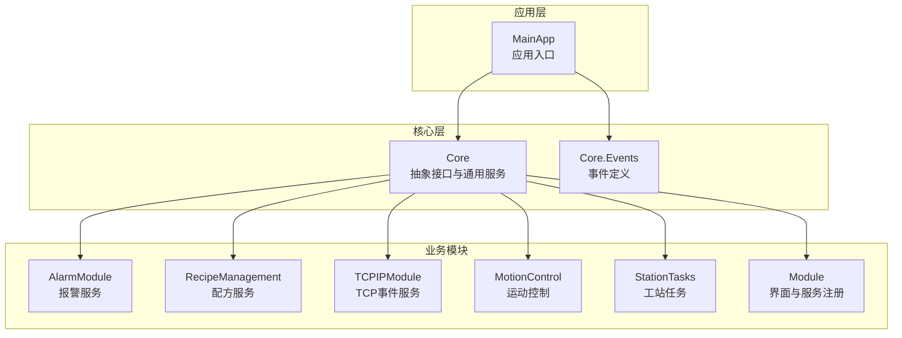
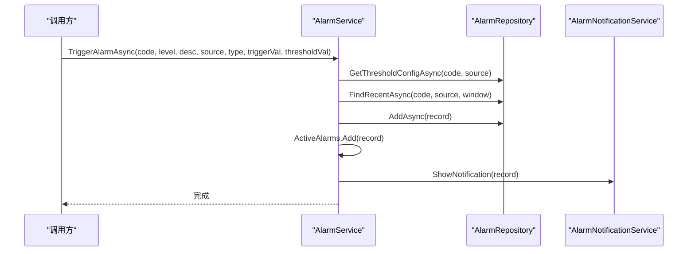
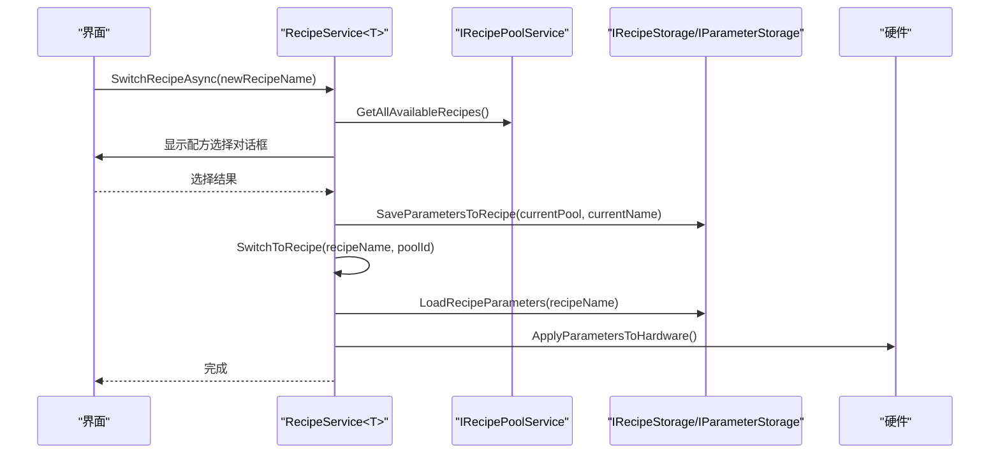
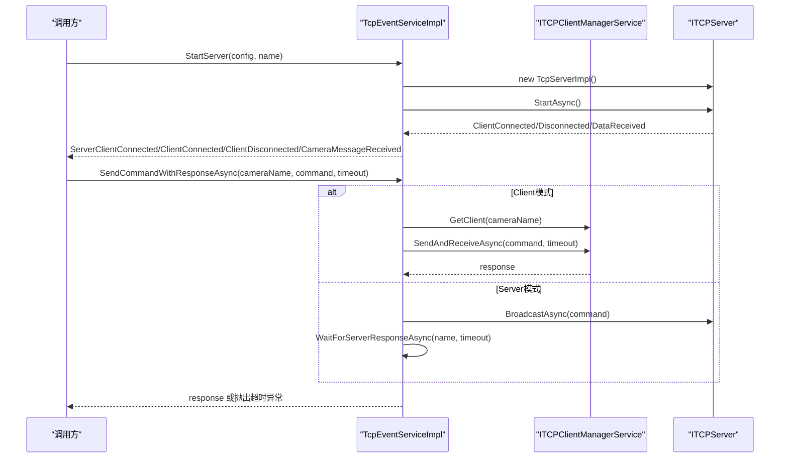
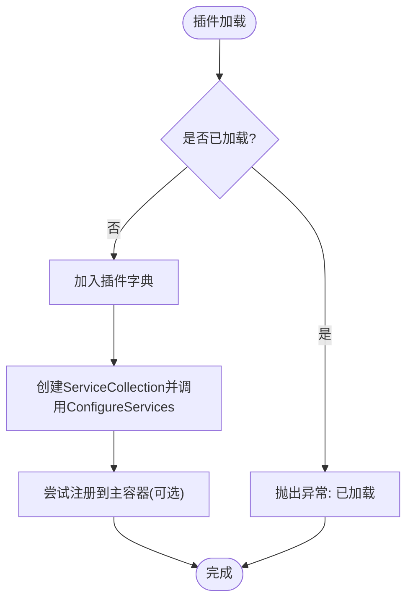
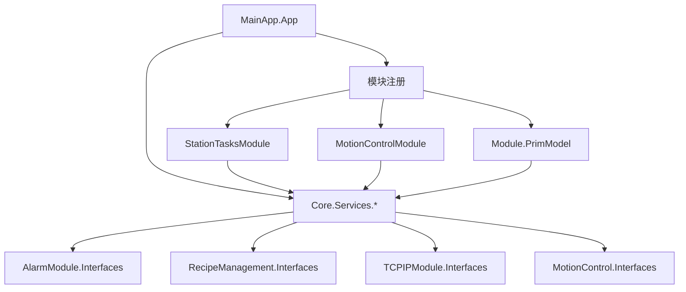

# API参考文档

<cite>
**本文档引用的文件**
- [Core\Abstraction\IConfigurationService.cs](file://Core/Abstraction/IConfigurationService.cs)
- [Core\Abstraction\IParameterService.cs](file://Core/Abstraction/IParameterService.cs)
- [Core\Abstraction\IStationRegistry.cs](file://Core/Abstraction/IStationRegistry.cs)
- [Core\Abstraction\Plugins\IPlugin.cs](file://Core/Abstraction/Plugins/IPlugin.cs)
- [Core\Services\PluginManager.cs](file://Core/Services/PluginManager.cs)
- [AlarmModule\Interfaces\IAlarmService.cs](file://AlarmModule/Interfaces/IAlarmService.cs)
- [AlarmModule\Services\AlarmService.cs](file://AlarmModule/Services/AlarmService.cs)
- [RecipeManagement\Interfaces\IRecipeService.cs](file://RecipeManagement/Interfaces/IRecipeService.cs)
- [RecipeManagement\Services\RecipeService.cs](file://RecipeManagement/Services/RecipeService.cs)
- [TCPIPModule\Services\TcpEventServiceImpl.cs](file://TCPIPModule/Services/TcpEventServiceImpl.cs)
- [MotionControl\Interfaces\IGripperService.cs](file://MotionControl/Interfaces/IGripperService.cs)
- [MotionControl\Services\AxisParameterService.cs](file://MotionControl/Services/AxisParameterService.cs)
- [StationTasks\Actions\Scan3DStepAction.cs](file://StationTasks/Actions/Scan3DStepAction.cs)
- [Core\Events\MessageEvent.cs](file://Core/Events/MessageEvent.cs)
- [Core\Events\SystemInitializedEvent.cs](file://Core/Events/SystemInitializedEvent.cs)
- [MainApp\App.xaml.cs](file://MainApp/App.xaml.cs)
- [StationTasks\StationTasksModule.cs](file://StationTasks/StationTasksModule.cs)
- [MotionControl\MotionControlModule.cs](file://MotionControl/MotionControlModule.cs)
- [Module\PrimModel.cs](file://Module/PrimModel.cs)
</cite>

## 目录
1. [简介](#简介)
2. [项目结构](#项目结构)
3. [核心组件](#核心组件)
4. [架构总览](#架构总览)
5. [详细组件分析](#详细组件分析)
6. [依赖关系分析](#依赖关系分析)
7. [性能考虑](#性能考虑)
8. [故障排除指南](#故障排除指南)
9. [结论](#结论)
10. [附录](#附录)

## 简介
本API参考文档面向GZQL_MACHINE项目的开发者与集成者，系统梳理并规范以下内容：
- 核心服务接口：配置、参数、配方、报警、TCP通信、运动控制等
- 事件定义：消息事件、系统初始化事件、TCP事件等
- 插件扩展接口：插件生命周期与管理
- 接口使用示例、调用约定、异常处理规范
- 版本兼容性与扩展点设计
- 接口测试方法、性能基准与最佳实践

## 项目结构
项目采用模块化架构，核心模块包括Core、AlarmModule、RecipeManagement、TCPIPModule、MotionControl、StationTasks、Module等。各模块通过接口解耦，通过Prism事件总线与依赖注入容器协同。

**图表来源**
- [MainApp\App.xaml.cs:110-177](file://MainApp/App.xaml.cs#L110-L177)
- [StationTasks\StationTasksModule.cs:36-64](file://StationTasks/StationTasksModule.cs#L36-L64)
- [MotionControl\MotionControlModule.cs:59-78](file://MotionControl/MotionControlModule.cs#L59-L78)
- [Module\PrimModel.cs:59-116](file://Module/PrimModel.cs#L59-L116)

**章节来源**
- [MainApp\App.xaml.cs:110-177](file://MainApp/App.xaml.cs#L110-L177)
- [StationTasks\StationTasksModule.cs:36-64](file://StationTasks/StationTasksModule.cs#L36-L64)
- [MotionControl\MotionControlModule.cs:59-78](file://MotionControl/MotionControlModule.cs#L59-L78)
- [Module\PrimModel.cs:59-116](file://Module/PrimModel.cs#L59-L116)

## 核心组件

### 配置与参数接口
- IConfigurationService：提供配置保存与加载能力
- IParameterService：提供参数分组的加载、保存与重置能力
- IStationRegistry：工站注册与查询接口，解决模块加载时序问题

**章节来源**
- [Core\Abstraction\IConfigurationService.cs:5-10](file://Core/Abstraction/IConfigurationService.cs#L5-L10)
- [Core\Abstraction\IParameterService.cs:8-23](file://Core/Abstraction/IParameterService.cs#L8-L23)
- [Core\Abstraction\IStationRegistry.cs:7-20](file://Core/Abstraction/IStationRegistry.cs#L7-L20)

### 报警服务接口
- IAlarmService：报警触发、确认、复位、消除、查询、导出、活跃报警刷新等

**章节来源**
- [AlarmModule\Interfaces\IAlarmService.cs:11-76](file://AlarmModule/Interfaces/IAlarmService.cs#L11-L76)

### 配方服务接口
- IRecipeService：配方加载、保存、切换、参数应用事件、配方变更事件等

**章节来源**
- [RecipeManagement\Interfaces\IRecipeService.cs:13-68](file://RecipeManagement/Interfaces/IRecipeService.cs#L13-L68)

### TCP事件服务接口
- ITCPEventService：TCP服务器/客户端管理、命令发送与响应等待、事件发布等

**章节来源**
- [TCPIPModule\Services\TcpEventServiceImpl.cs:22-84](file://TCPIPModule/Services/TcpEventServiceImpl.cs#L22-L84)

### 运动控制接口
- IGripperService：夹爪初始化、监控、快速操作、运动控制、力矩控制、系统操作、状态查询等

**章节来源**
- [MotionControl\Interfaces\IGripperService.cs:8-44](file://MotionControl/Interfaces/IGripperService.cs#L8-L44)

### 插件扩展接口
- IPlugin：插件名称、版本、描述及服务注册与应用配置
- IPluginManager：插件加载、卸载、查询与统一配置

**章节来源**
- [Core\Abstraction\Plugins\IPlugin.cs:8-31](file://Core/Abstraction/Plugins/IPlugin.cs#L8-L31)
- [Core\Services\PluginManager.cs:7-87](file://Core/Services/PluginManager.cs#L7-L87)

## 架构总览

```mermaid
classDiagram
class IConfigurationService {
+SaveConfiguration(sectionName, format, config)
+LoadConfiguration<T>(sectionName) T
}
class IParameterService {
+LoadParametersAsync() IEnumerable<ParameterGroup>
+SaveParametersAsync(parameterGroups)
+ResetToDefaultsAsync() IEnumerable<ParameterGroup>
}
class IStationRegistry {
+Register(station)
+Unregister(station)
+GetAllStations() IReadOnlyList
+GetStation(stationIdentifier) IStationParameterProvider
}
class IAlarmService {
+TriggerAlarmAsync(...)
+ConfirmAsync(...)
+ResetAsync(...)
+EliminateAsync(...)
+ConfirmAllAsync(...)
+ResetAllAsync(...)
+ActiveAlarms ObservableCollection
+UnconfirmedCount int
+AlarmTriggered event
+QueryAsync(parameters) PagedResult
+ExportToExcelAsync(filePath, parameters)
+RefreshActiveAlarmsAsync()
}
class IRecipeService {
+StationIdentifier string
+StationName string
+CurrentRecipeName string
+CurrentRecipePoolName string
+Parameters object
+AvailableRecipes List<string>
+InitializationTask Task
+EditParametersCommand ICommand
+SwitchRecipeCommand ICommand
+LoadRecipeParameters(poolName, recipeName)
+SaveCurrentParameters()
+SaveParametersToRecipe(poolName, recipeName)
+SwitchRecipeAsync(newRecipeName)
+SwitchToRecipe(recipeName, poolId)
+GetCurrentRecipeInfoAsync() CurrentRecipeInfo
+ParametersApplied event
+RecipeChanged event
+ParametersLoaded event
}
class ITCPEventService {
+Initialize()
+StartServer(serverConfig, serverName)
+StopServer(serverName)
+AddClientAsync(clientName, config)
+AddClient(clientName, config)
+RemoveClient(clientName)
+BroadcastCommandAsync(command, timeout) bool
+SendCommandAsync(cameraName, command, timeout) bool
+SendCommandWithResponseAsync(cameraName, command, timeout) string
+RegisterClient(cameraName, ip, port)
+UnregisterClient(cameraName)
+ReplayConnectedClients()
+ClientConnected event
+ClientDisconnected event
+ClientError event
+ServerClientConnected event
+ServerClientDisconnected event
+CameraMessageReceived event
+CameraCommandCompleted event
}
class IGripperService {
+InitializeAsync(token)
+StartMonitoring(intervalMs)
+StopMonitoring()
+ClampAsync(position, token)
+ReleaseAsync(position, token)
+MoveToPositionAsync(position, speed, token)
+JogLeftAsync(step, speed, token)
+JogRightAsync(step, speed, token)
+Stop()
+SetTorque(percentage)
+HomeAsync(token)
+ResetAlarm()
+GetState() GripperState
+GetCurrentPosition() double
+IsMoving bool
+IsInitialized bool
}
class IPlugin {
+Name string
+Version string
+Description string
+ConfigureServices(services)
+Configure(app)
}
class IPluginManager {
+LoadedPlugins IEnumerable<IPlugin>
+GetPlugin(name) IPlugin
+LoadPlugin(plugin)
+UnloadPlugin(name)
+IsPluginLoaded(name) bool
+ConfigureAllPlugins(app)
}
```

**图表来源**
- [Core\Abstraction\IConfigurationService.cs:5-10](file://Core/Abstraction/IConfigurationService.cs#L5-L10)
- [Core\Abstraction\IParameterService.cs:8-23](file://Core/Abstraction/IParameterService.cs#L8-L23)
- [Core\Abstraction\IStationRegistry.cs:7-20](file://Core/Abstraction/IStationRegistry.cs#L7-L20)
- [AlarmModule\Interfaces\IAlarmService.cs:11-76](file://AlarmModule/Interfaces/IAlarmService.cs#L11-L76)
- [RecipeManagement\Interfaces\IRecipeService.cs:13-68](file://RecipeManagement/Interfaces/IRecipeService.cs#L13-L68)
- [TCPIPModule\Services\TcpEventServiceImpl.cs:22-84](file://TCPIPModule/Services/TcpEventServiceImpl.cs#L22-L84)
- [MotionControl\Interfaces\IGripperService.cs:8-44](file://MotionControl/Interfaces/IGripperService.cs#L8-L44)
- [Core\Abstraction\Plugins\IPlugin.cs:8-31](file://Core/Abstraction/Plugins/IPlugin.cs#L8-L31)
- [Core\Services\PluginManager.cs:7-87](file://Core/Services/PluginManager.cs#L7-L87)

## 详细组件分析

### 报警服务API
- 触发报警：支持防抖抑制、状态流转校验、活跃报警集合更新、通知服务与日志记录
- 确认/复位/消除：严格的状态校验与活跃报警集合更新
- 查询与导出：分页查询与Excel导出
- 刷新活跃报警：从数据库重新加载未消除报警

**图表来源**
- [AlarmModule\Services\AlarmService.cs:52-91](file://AlarmModule/Services/AlarmService.cs#L52-L91)

**章节来源**
- [AlarmModule\Interfaces\IAlarmService.cs:17-74](file://AlarmModule/Interfaces/IAlarmService.cs#L17-L74)
- [AlarmModule\Services\AlarmService.cs:16-308](file://AlarmModule/Services/AlarmService.cs#L16-L308)

### 配方服务API
- 初始化：从默认配方池加载当前配方
- 参数编辑：打开参数编辑器，保存回调触发参数应用事件
- 配方切换：手动切换与内部切换，保存当前参数、加载新配方、应用到硬件、发布事件
- 事件：参数应用、参数加载、配方切换

**图表来源**
- [RecipeManagement\Services\RecipeService.cs:543-634](file://RecipeManagement/Services/RecipeService.cs#L543-L634)

**章节来源**
- [RecipeManagement\Interfaces\IRecipeService.cs:13-68](file://RecipeManagement/Interfaces/IRecipeService.cs#L13-L68)
- [RecipeManagement\Services\RecipeService.cs:22-723](file://RecipeManagement/Services/RecipeService.cs#L22-L723)

### TCP事件服务API
- 服务器管理：启动/停止服务器，连接状态快照与回放
- 客户端管理：添加/移除客户端，连接状态与错误事件
- 命令发送：广播、定向发送、带响应等待（Client/Server模式）
- 事件发布：客户端连接/断开/错误、相机消息接收、命令完成

**图表来源**
- [TCPIPModule\Services\TcpEventServiceImpl.cs:91-430](file://TCPIPModule/Services/TcpEventServiceImpl.cs#L91-L430)

**章节来源**
- [TCPIPModule\Services\TcpEventServiceImpl.cs:22-542](file://TCPIPModule/Services/TcpEventServiceImpl.cs#L22-L542)

### 运动控制API（夹爪服务）
- 生命周期：初始化、监控启停
- 快速操作：夹紧/松开
- 运动控制：定位、点动、急停
- 力矩控制：设置扭矩百分比
- 系统操作：回零、复位报警
- 状态查询：状态、当前位置、运动/初始化状态

**章节来源**
- [MotionControl\Interfaces\IGripperService.cs:8-44](file://MotionControl/Interfaces/IGripperService.cs#L8-L44)

### 插件扩展API
- IPlugin：插件元数据与服务配置、应用配置
- IPluginManager：插件加载/卸载/查询、统一配置

**图表来源**
- [Core\Services\PluginManager.cs:24-69](file://Core/Services/PluginManager.cs#L24-L69)

**章节来源**
- [Core\Abstraction\Plugins\IPlugin.cs:8-31](file://Core/Abstraction/Plugins/IPlugin.cs#L8-L31)
- [Core\Services\PluginManager.cs:7-87](file://Core/Services/PluginManager.cs#L7-L87)

### 事件定义
- MessageEvent：消息事件，携带目标与内容
- SystemInitializedEvent：系统初始化事件

**章节来源**
- [Core\Events\MessageEvent.cs:5-21](file://Core/Events/MessageEvent.cs#L5-L21)
- [Core\Events\SystemInitializedEvent.cs:5-6](file://Core/Events/SystemInitializedEvent.cs#L5-L6)

## 依赖关系分析

**图表来源**
- [MainApp\App.xaml.cs:110-177](file://MainApp/App.xaml.cs#L110-L177)
- [StationTasks\StationTasksModule.cs:36-64](file://StationTasks/StationTasksModule.cs#L36-L64)
- [MotionControl\MotionControlModule.cs:59-78](file://MotionControl/MotionControlModule.cs#L59-L78)
- [Module\PrimModel.cs:59-116](file://Module/PrimModel.cs#L59-L116)

**章节来源**
- [MainApp\App.xaml.cs:110-177](file://MainApp/App.xaml.cs#L110-L177)
- [StationTasks\StationTasksModule.cs:36-64](file://StationTasks/StationTasksModule.cs#L36-L64)
- [MotionControl\MotionControlModule.cs:59-78](file://MotionControl/MotionControlModule.cs#L59-L78)
- [Module\PrimModel.cs:59-116](file://Module/PrimModel.cs#L59-L116)

## 性能考虑
- 异步优先：配置、参数、配方、报警、TCP事件均采用异步API，避免阻塞UI线程
- 并发安全：TCP事件服务使用并发字典管理多服务器实例；夹爪服务状态查询与活跃报警集合更新通过UI调度器保证线程安全
- 防抖与批处理：报警服务对相同Code+Source在时间窗内进行防抖；批量确认/复位减少数据库写入次数
- 资源释放：配方服务实现IDisposable，及时释放事件订阅令牌
- 日志与告警：服务层统一记录Info/Warn/Error，便于性能分析与故障定位

## 故障排除指南
- 报警状态异常
  - 现象：确认/复位/消除操作抛出无效状态异常
  - 处理：检查当前报警状态，仅允许在对应状态下执行相应操作
  - 参考：[AlarmModule\Services\AlarmService.cs:96-155](file://AlarmModule/Services/AlarmService.cs#L96-L155)

- TCP命令超时
  - 现象：SendCommandWithResponseAsync抛出超时异常
  - 处理：检查客户端连接状态、网络连通性、设备响应时间；适当增大超时时间
  - 参考：[TCPIPModule\Services\TcpEventServiceImpl.cs:357-383](file://TCPIPModule/Services/TcpEventServiceImpl.cs#L357-L383)

- 配方切换失败
  - 现象：切换过程中抛出异常或参数未应用
  - 处理：确认配方存在、保存当前参数、检查硬件应用流程、查看日志
  - 参考：[RecipeManagement\Services\RecipeService.cs:596-634](file://RecipeManagement/Services/RecipeService.cs#L596-L634)

- 插件加载冲突
  - 现象：提示插件已加载
  - 处理：卸载后重载或更换插件名称
  - 参考：[Core\Services\PluginManager.cs:24-36](file://Core/Services/PluginManager.cs#L24-L36)

**章节来源**
- [AlarmModule\Services\AlarmService.cs:96-155](file://AlarmModule/Services/AlarmService.cs#L96-L155)
- [TCPIPModule\Services\TcpEventServiceImpl.cs:357-383](file://TCPIPModule/Services/TcpEventServiceImpl.cs#L357-L383)
- [RecipeManagement\Services\RecipeService.cs:596-634](file://RecipeManagement/Services/RecipeService.cs#L596-L634)
- [Core\Services\PluginManager.cs:24-36](file://Core/Services/PluginManager.cs#L24-L36)

## 结论
本API参考文档系统化梳理了GZQL_MACHINE的核心接口、事件与扩展机制，明确了调用约定、异常处理与最佳实践。建议在集成时遵循异步优先、状态校验、资源释放与日志记录的原则，确保系统的稳定性与可维护性。

## 附录

### 接口使用示例与调用约定
- 报警触发
  - 调用约定：提供报警代码、级别、描述、来源、类型与可选数值；服务内部进行防抖与状态更新
  - 参考：[AlarmModule\Interfaces\IAlarmService.cs:17-19](file://AlarmModule/Interfaces/IAlarmService.cs#L17-L19)
- 配方切换
  - 调用约定：通过命令或服务方法触发，内部保存当前参数、加载新配方并应用到硬件
  - 参考：[RecipeManagement\Interfaces\IRecipeService.cs:51-56](file://RecipeManagement/Interfaces/IRecipeService.cs#L51-L56)
- TCP命令发送
  - 调用约定：支持Client/Server两种模式；Server模式下通过事件等待响应
  - 参考：[TCPIPModule\Services\TcpEventServiceImpl.cs:287-383](file://TCPIPModule/Services/TcpEventServiceImpl.cs#L287-L383)
- 夹爪操作
  - 调用约定：先InitializeAsync，再StartMonitoring；运动操作需提供位置与速度参数
  - 参考：[MotionControl\Interfaces\IGripperService.cs:11-25](file://MotionControl/Interfaces/IGripperService.cs#L11-L25)

### 版本兼容性与扩展点
- 版本兼容性：插件接口包含Name、Version、Description，便于版本管理与升级
- 扩展点设计：IPlugin.ConfigureServices与IPlugin.Configure提供服务注册与应用配置扩展；IPluginManager支持动态加载/卸载
- 参考：
  - [Core\Abstraction\Plugins\IPlugin.cs:8-16](file://Core/Abstraction/Plugins/IPlugin.cs#L8-L16)
  - [Core\Services\PluginManager.cs:71-85](file://Core/Services/PluginManager.cs#L71-L85)

### 接口测试方法与性能基准
- 单元测试建议
  - 报警服务：模拟仓储与通知服务，验证防抖、状态流转与活跃报警集合更新
  - 配方服务：模拟对话框服务、事件聚合器与存储，验证切换流程与事件发布
  - TCP事件服务：模拟客户端管理器与服务器，验证广播、定向发送与响应等待
  - 运动控制：模拟运动服务与夹爪服务，验证状态查询与异常处理
- 性能基准
  - 异步I/O：关注TCP事件服务的并发连接与消息吞吐
  - 数据库访问：关注报警与配方服务的批量操作与事务一致性
  - UI线程：确保所有服务操作在后台线程执行，避免阻塞UI