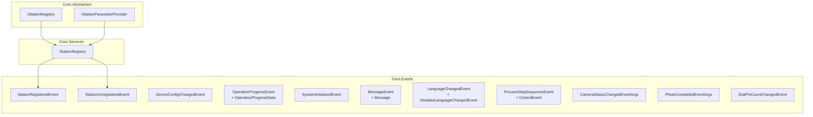
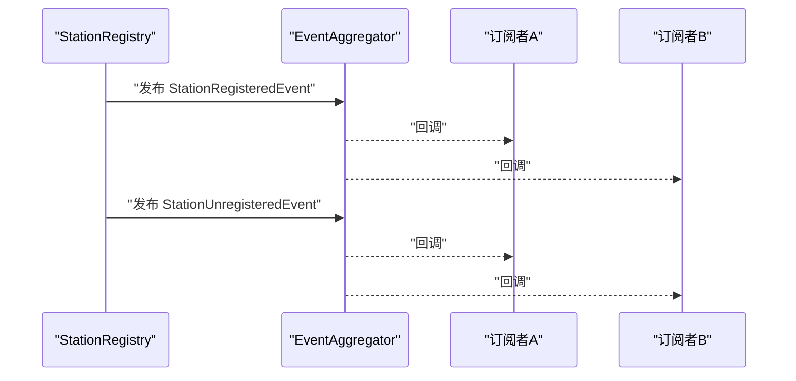
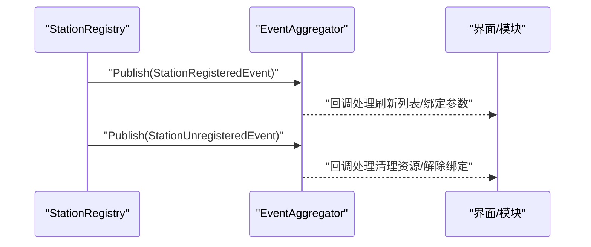
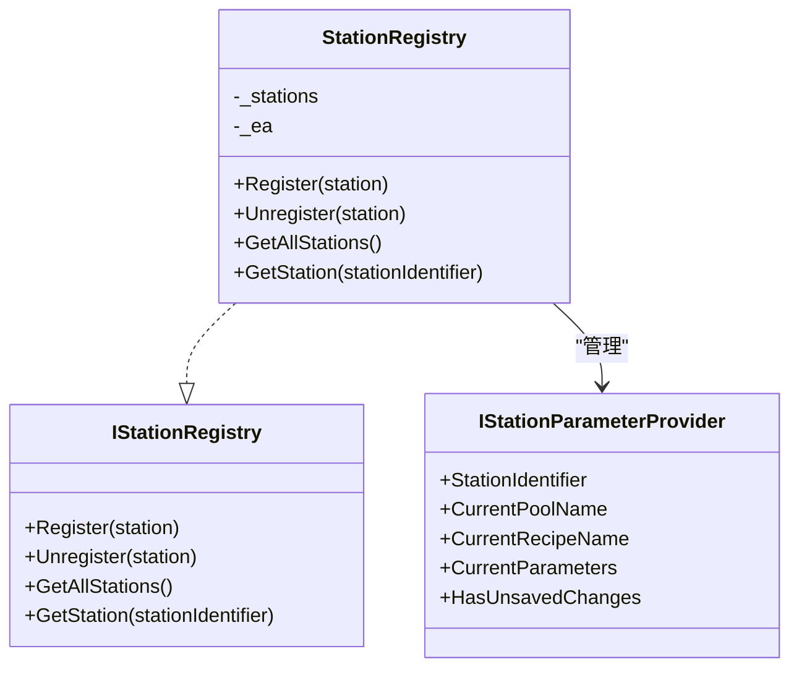

# 事件系统API

<cite>
**本文引用的文件**
- [StationRegisteredEvent.cs](file://Core/Events/StationRegisteredEvent.cs)
- [StationUnregisteredEvent.cs](file://Core/Events/StationUnregisteredEvent.cs)
- [DeviceConfigChangedEvent.cs](file://Core/Events/DeviceConfigChangedEvent.cs)
- [OperationProgressEvent.cs](file://Core/Events/OperationProgressEvent.cs)
- [SystemInitializedEvent.cs](file://Core/Events/SystemInitializedEvent.cs)
- [MessageEvent.cs](file://Core/Events/MessageEvent.cs)
- [LanguageChangedEvent.cs](file://Core/Events/LanguageChangedEvent.cs)
- [ProcessStepSequenceEvent.cs](file://Core/Events/ProcessStepSequenceEvent.cs)
- [StationRegistry.cs](file://Core/Services/StationRegistry.cs)
- [IStationRegistry.cs](file://Core/Abstraction/IStationRegistry.cs)
- [IStationParameterProvider.cs](file://Core/Abstraction/IStationParameterProvider.cs)
- [CameraStatusChangedEventArgs.cs](file://Core/Events/CameraStatusChangedEventArgs.cs)
- [PhotoCompletedEventArgs.cs](file://Core/Events/PhotoCompletedEventArgs.cs)
- [DialPinCountChangedEvent.cs](file://Core/Events/DialPinCountChangedEvent.cs)
- [DashboardStepAction.cs](file://StationTasks/Actions/DashboardStepAction.cs)
- [MotionService.cs](file://MotionControl/Services/MotionService.cs)
- [summary.md](file://.trae/rules/summary.md)
</cite>

## 目录
1. [简介](#简介)
2. [项目结构](#项目结构)
3. [核心组件](#核心组件)
4. [架构总览](#架构总览)
5. [详细组件分析](#详细组件分析)
6. [依赖关系分析](#依赖关系分析)
7. [性能考虑](#性能考虑)
8. [故障排除指南](#故障排除指南)
9. [结论](#结论)

## 简介
本文件为 GZQL_MACHINE 的事件系统提供完整的 API 参考与实践指南。重点覆盖以下方面：
- 事件类型定义、触发条件与数据结构
- 订阅与取消订阅机制
- 核心事件（如 StationRegisteredEvent、DeviceConfigChangedEvent、OperationProgressEvent 等）的使用场景与编程接口
- 事件驱动架构的设计原则、异步处理与传播路径
- 性能优化、内存管理与异常处理最佳实践

## 项目结构
事件系统主要分布在 Core.Events 与 Core.Services 命名空间中，并通过 Prism 的 EventAggregator 实现松耦合的发布/订阅通信。StationTasks 与 MotionControl 等模块通过事件实现跨模块协作。

图表来源
- [StationRegisteredEvent.cs:1-11](file://Core/Events/StationRegisteredEvent.cs#L1-L11)
- [StationUnregisteredEvent.cs:1-11](file://Core/Events/StationUnregisteredEvent.cs#L1-L11)
- [DeviceConfigChangedEvent.cs:1-13](file://Core/Events/DeviceConfigChangedEvent.cs#L1-L13)
- [OperationProgressEvent.cs:1-22](file://Core/Events/OperationProgressEvent.cs#L1-L22)
- [SystemInitializedEvent.cs:1-7](file://Core/Events/SystemInitializedEvent.cs#L1-L7)
- [MessageEvent.cs:1-22](file://Core/Events/MessageEvent.cs#L1-L22)
- [LanguageChangedEvent.cs:1-64](file://Core/Events/LanguageChangedEvent.cs#L1-L64)
- [ProcessStepSequenceEvent.cs:1-53](file://Core/Events/ProcessStepSequenceEvent.cs#L1-L53)
- [StationRegistry.cs:1-47](file://Core/Services/StationRegistry.cs#L1-L47)
- [IStationRegistry.cs:1-21](file://Core/Abstraction/IStationRegistry.cs#L1-L21)
- [IStationParameterProvider.cs:1-24](file://Core/Abstraction/IStationParameterProvider.cs#L1-L24)

章节来源
- [StationRegisteredEvent.cs:1-11](file://Core/Events/StationRegisteredEvent.cs#L1-L11)
- [StationUnregisteredEvent.cs:1-11](file://Core/Events/StationUnregisteredEvent.cs#L1-L11)
- [DeviceConfigChangedEvent.cs:1-13](file://Core/Events/DeviceConfigChangedEvent.cs#L1-L13)
- [OperationProgressEvent.cs:1-22](file://Core/Events/OperationProgressEvent.cs#L1-L22)
- [SystemInitializedEvent.cs:1-7](file://Core/Events/SystemInitializedEvent.cs#L1-L7)
- [MessageEvent.cs:1-22](file://Core/Events/MessageEvent.cs#L1-L22)
- [LanguageChangedEvent.cs:1-64](file://Core/Events/LanguageChangedEvent.cs#L1-L64)
- [ProcessStepSequenceEvent.cs:1-53](file://Core/Events/ProcessStepSequenceEvent.cs#L1-L53)
- [StationRegistry.cs:1-47](file://Core/Services/StationRegistry.cs#L1-L47)
- [IStationRegistry.cs:1-21](file://Core/Abstraction/IStationRegistry.cs#L1-L21)
- [IStationParameterProvider.cs:1-24](file://Core/Abstraction/IStationParameterProvider.cs#L1-L24)

## 核心组件
- 事件定义与数据模型
  - 工站注册/注销事件：StationRegisteredEvent、StationUnregisteredEvent
  - 设备配置变更事件：DeviceConfigChangedEvent
  - 进度与完成事件：OperationProgressEvent、OperationCompletedEvent 及其数据载体
  - 系统初始化事件：SystemInitializedEvent
  - 消息事件：MessageEvent 及消息载体
  - 语言变更事件：LanguageChangedEvent（含详细数据）与 DetailedLanguageChangedEvent
  - 工艺步骤序列事件：ProcessStepSequenceEvent、ProcessStepSequenceControlEvent 及载荷
  - 相机相关事件：CameraStatusChangedEventArgs、PhotoCompletedEventArgs
  - 其他：DialPinCountChangedEvent

- 事件基础设施
  - 工站注册表：IStationRegistry、StationRegistry
  - 工站参数提供者：IStationParameterProvider

章节来源
- [StationRegisteredEvent.cs:1-11](file://Core/Events/StationRegisteredEvent.cs#L1-L11)
- [StationUnregisteredEvent.cs:1-11](file://Core/Events/StationUnregisteredEvent.cs#L1-L11)
- [DeviceConfigChangedEvent.cs:1-13](file://Core/Events/DeviceConfigChangedEvent.cs#L1-L13)
- [OperationProgressEvent.cs:1-22](file://Core/Events/OperationProgressEvent.cs#L1-L22)
- [SystemInitializedEvent.cs:1-7](file://Core/Events/SystemInitializedEvent.cs#L1-L7)
- [MessageEvent.cs:1-22](file://Core/Events/MessageEvent.cs#L1-L22)
- [LanguageChangedEvent.cs:1-64](file://Core/Events/LanguageChangedEvent.cs#L1-L64)
- [ProcessStepSequenceEvent.cs:1-53](file://Core/Events/ProcessStepSequenceEvent.cs#L1-L53)
- [StationRegistry.cs:1-47](file://Core/Services/StationRegistry.cs#L1-L47)
- [IStationRegistry.cs:1-21](file://Core/Abstraction/IStationRegistry.cs#L1-L21)
- [IStationParameterProvider.cs:1-24](file://Core/Abstraction/IStationParameterProvider.cs#L1-L24)
- [CameraStatusChangedEventArgs.cs:1-13](file://Core/Events/CameraStatusChangedEventArgs.cs#L1-L13)
- [PhotoCompletedEventArgs.cs:1-13](file://Core/Events/PhotoCompletedEventArgs.cs#L1-L13)
- [DialPinCountChangedEvent.cs:1-15](file://Core/Events/DialPinCountChangedEvent.cs#L1-L15)

## 架构总览
事件系统采用“发布/订阅”模式，基于 Prism.EventAggregator 提供线程安全的事件总线。StationRegistry 作为工站生命周期的协调者，在注册/注销时发布对应事件，其他模块通过订阅实现解耦协作。

图表来源
- [StationRegistry.cs:24-38](file://Core/Services/StationRegistry.cs#L24-L38)
- [StationRegisteredEvent.cs:1-11](file://Core/Events/StationRegisteredEvent.cs#L1-L11)
- [StationUnregisteredEvent.cs:1-11](file://Core/Events/StationUnregisteredEvent.cs#L1-L11)

章节来源
- [StationRegistry.cs:1-47](file://Core/Services/StationRegistry.cs#L1-L47)
- [summary.md:96-132](file://.trae/rules/summary.md#L96-L132)

## 详细组件分析

### 工站注册与注销事件
- 事件类型
  - StationRegisteredEvent：发布 IStationParameterProvider
  - StationUnregisteredEvent：发布 IStationParameterProvider
- 触发条件
  - 工站实例通过 IStationRegistry.Register/Unregister 调用时触发
- 数据结构
  - 事件载荷为 IStationParameterProvider，包含工站标识、配方信息与参数对象等
- 订阅方式
  - 使用 EventAggregator 获取事件并 Subscribe，返回订阅令牌；在适当时机调用 Unsubscribe
- 典型使用场景
  - 模块间感知新工站加入或退出，动态构建 UI 或路由参数
- 代码示例（路径）
  - 订阅与取消订阅：[DashboardStepAction.cs:108-133](file://StationTasks/Actions/DashboardStepAction.cs#L108-L133)
  - 注册/注销发布点：[StationRegistry.cs:24-38](file://Core/Services/StationRegistry.cs#L24-L38)

图表来源
- [StationRegistry.cs:24-38](file://Core/Services/StationRegistry.cs#L24-L38)
- [StationRegisteredEvent.cs:1-11](file://Core/Events/StationRegisteredEvent.cs#L1-L11)
- [StationUnregisteredEvent.cs:1-11](file://Core/Events/StationUnregisteredEvent.cs#L1-L11)

章节来源
- [StationRegisteredEvent.cs:1-11](file://Core/Events/StationRegisteredEvent.cs#L1-L11)
- [StationUnregisteredEvent.cs:1-11](file://Core/Events/StationUnregisteredEvent.cs#L1-L11)
- [StationRegistry.cs:1-47](file://Core/Services/StationRegistry.cs#L1-L47)
- [IStationParameterProvider.cs:1-24](file://Core/Abstraction/IStationParameterProvider.cs#L1-L24)
- [DashboardStepAction.cs:108-133](file://StationTasks/Actions/DashboardStepAction.cs#L108-L133)

### 设备配置变更事件
- 事件类型：DeviceConfigChangedEvent
- 触发条件：设备配置更新后发布
- 数据结构：事件载荷为 AppSettings
- 订阅方式：EventAggregator.GetEvent<T>().Subscribe(handler)
- 使用场景：全局配置变更通知，统一刷新界面或服务参数

章节来源
- [DeviceConfigChangedEvent.cs:1-13](file://Core/Events/DeviceConfigChangedEvent.cs#L1-L13)

### 进度与完成事件
- 事件类型
  - OperationProgressEvent：进度与状态上报
  - OperationCompletedEvent：操作完成结果
- 数据结构
  - OperationProgressData：包含 Progress、Status、OperationId、IsCompleted、Success
  - OperationCompletedData：包含 OperationId、Success
- 订阅方式：EventAggregator.GetEvent<T>().Subscribe(handler)
- 使用场景：长耗时操作的 UI 进度反馈与最终结果通知

章节来源
- [OperationProgressEvent.cs:1-22](file://Core/Events/OperationProgressEvent.cs#L1-L22)

### 系统初始化事件
- 事件类型：SystemInitializedEvent
- 触发条件：系统完成初始化阶段
- 订阅方式：EventAggregator.GetEvent<T>().Subscribe(handler)
- 使用场景：延迟初始化依赖、启动后清理与校准

章节来源
- [SystemInitializedEvent.cs:1-7](file://Core/Events/SystemInitializedEvent.cs#L1-L7)

### 消息事件
- 事件类型：MessageEvent
- 数据结构：Message（包含 Target、Content）
- 订阅方式：EventAggregator.GetEvent<T>().Subscribe(handler)
- 使用场景：跨模块的消息广播与日志/通知分发

章节来源
- [MessageEvent.cs:1-22](file://Core/Events/MessageEvent.cs#L1-L22)

### 语言变更事件
- 事件类型
  - LanguageChangedEvent：基础语言变更事件
  - DetailedLanguageChangedEvent：携带详细变更数据
- 数据结构
  - Data：OldCultureCode、NewCultureCode、IsUserInitiated、Timestamp
- 订阅方式：EventAggregator.GetEvent<T>().Subscribe(handler)
- 使用场景：界面多语言切换与本地化资源重载

章节来源
- [LanguageChangedEvent.cs:1-64](file://Core/Events/LanguageChangedEvent.cs#L1-L64)

### 工艺步骤序列事件
- 事件类型
  - ProcessStepSequenceEvent：发布步骤序列
  - ProcessStepSequenceControlEvent：暂停/恢复/停止控制
- 数据结构
  - ProcessStepSequencePayload：StationId、Steps
  - ProcessStepSequenceControlPayload：Action、StationId
  - SequenceControlAction：Pause、Resume、Stop
- 订阅方式：EventAggregator.GetEvent<T>().Subscribe(handler)
- 使用场景：从 UI 编辑器向工站任务下发执行计划与控制指令

章节来源
- [ProcessStepSequenceEvent.cs:1-53](file://Core/Events/ProcessStepSequenceEvent.cs#L1-L53)

### 相机相关事件
- 事件类型
  - CameraStatusChangedEventArgs：相机连接状态变化
  - PhotoCompletedEventArgs：拍照完成结果
- 数据结构：包含 CameraName、IsConnected/Success、状态文本或错误信息
- 订阅方式：EventAggregator.GetEvent<T>().Subscribe(handler)
- 使用场景：相机状态监控与拍照结果处理

章节来源
- [CameraStatusChangedEventArgs.cs:1-13](file://Core/Events/CameraStatusChangedEventArgs.cs#L1-L13)
- [PhotoCompletedEventArgs.cs:1-13](file://Core/Events/PhotoCompletedEventArgs.cs#L1-L13)

### 其他事件
- DialPinCountChangedEvent：拨盘针数变更事件，包含任务号与新计数
- 订阅方式：EventAggregator.GetEvent<T>().Subscribe(handler)
- 使用场景：与拨盘/定位相关的参数联动

章节来源
- [DialPinCountChangedEvent.cs:1-15](file://Core/Events/DialPinCountChangedEvent.cs#L1-L15)

## 依赖关系分析
- 组件耦合
  - StationRegistry 依赖 IEventAggregator，负责事件发布
  - IStationRegistry 与 IStationParameterProvider 定义了工站抽象与注册契约
- 外部依赖
  - Prism.EventAggregator 提供事件总线能力
- 潜在风险
  - 订阅未取消可能导致内存泄漏
  - 跨模块事件耦合度高时需谨慎设计载荷类型

图表来源
- [IStationRegistry.cs:1-21](file://Core/Abstraction/IStationRegistry.cs#L1-L21)
- [StationRegistry.cs:1-47](file://Core/Services/StationRegistry.cs#L1-L47)
- [IStationParameterProvider.cs:1-24](file://Core/Abstraction/IStationParameterProvider.cs#L1-L24)

章节来源
- [IStationRegistry.cs:1-21](file://Core/Abstraction/IStationRegistry.cs#L1-L21)
- [StationRegistry.cs:1-47](file://Core/Services/StationRegistry.cs#L1-L47)
- [IStationParameterProvider.cs:1-24](file://Core/Abstraction/IStationParameterProvider.cs#L1-L24)

## 性能考虑
- 异步与线程安全
  - 使用 Prism 事件总线进行线程安全的跨线程通知
  - 长耗时操作建议通过 OperationProgressEvent 分段上报，避免阻塞 UI
- 内存管理
  - 订阅完成后务必调用 Unsubscribe，避免持有引用导致 GC 无法回收
  - 对于临时等待场景，使用 ManualResetEventSlim 等轻量同步原语
- 事件风暴防护
  - 对高频事件（如相机状态、轴状态）应限制发布频率或合并事件
  - 使用令牌化订阅，便于成组取消
- 载荷设计
  - 避免在事件载荷中传递大型对象，必要时传递标识符并在订阅方拉取数据

## 故障排除指南
- 订阅未取消导致内存泄漏
  - 现象：长时间运行后内存持续增长
  - 排查：检查是否在生命周期结束时调用 Unsubscribe
  - 参考实现：[DashboardStepAction.cs:108-133](file://StationTasks/Actions/DashboardStepAction.cs#L108-L133)
- 事件未触发
  - 确认发布方正确获取 EventAggregator 并调用 Publish
  - 确认订阅方在正确的生命周期内订阅
  - 参考发布点：[StationRegistry.cs:24-38](file://Core/Services/StationRegistry.cs#L24-L38)
- 跨模块类型依赖问题
  - 使用 object 类型承载集合（如 Steps），避免直接引用外部类型
  - 参考：[ProcessStepSequenceEvent.cs:14-21](file://Core/Events/ProcessStepSequenceEvent.cs#L14-L21)
- 运动/状态事件处理
  - 订阅 IObserver<T> 时注意线程上下文，必要时切换到 UI 线程
  - 参考：[MotionService.cs:60-100](file://MotionControl/Services/MotionService.cs#L60-L100)

章节来源
- [DashboardStepAction.cs:108-133](file://StationTasks/Actions/DashboardStepAction.cs#L108-L133)
- [StationRegistry.cs:24-38](file://Core/Services/StationRegistry.cs#L24-L38)
- [ProcessStepSequenceEvent.cs:14-21](file://Core/Events/ProcessStepSequenceEvent.cs#L14-L21)
- [MotionService.cs:60-100](file://MotionControl/Services/MotionService.cs#L60-L100)

## 结论
GZQL_MACHINE 的事件系统以 Prism 事件总线为核心，结合 StationRegistry 实现了工站生命周期与跨模块协作的解耦。通过规范的事件定义、明确的订阅/取消订阅流程以及对性能与内存的约束，系统在复杂工业场景下具备良好的扩展性与稳定性。建议在新增事件时遵循现有命名与载荷设计模式，并严格遵守订阅生命周期管理的最佳实践。