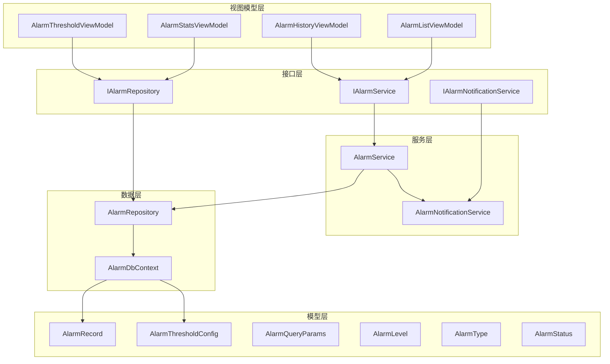
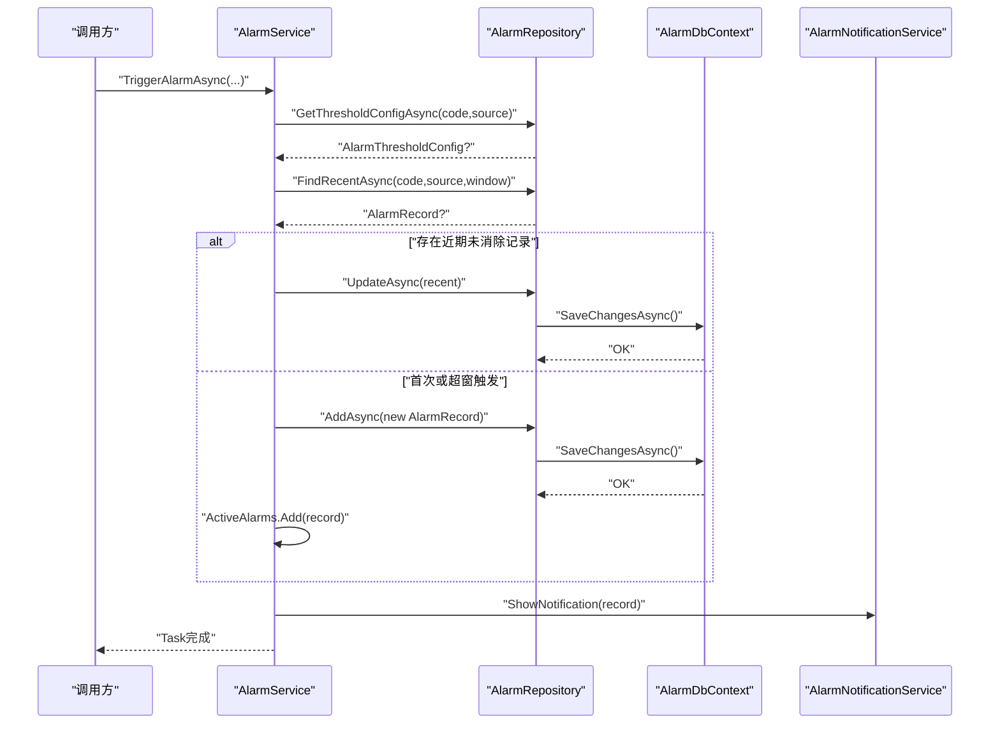
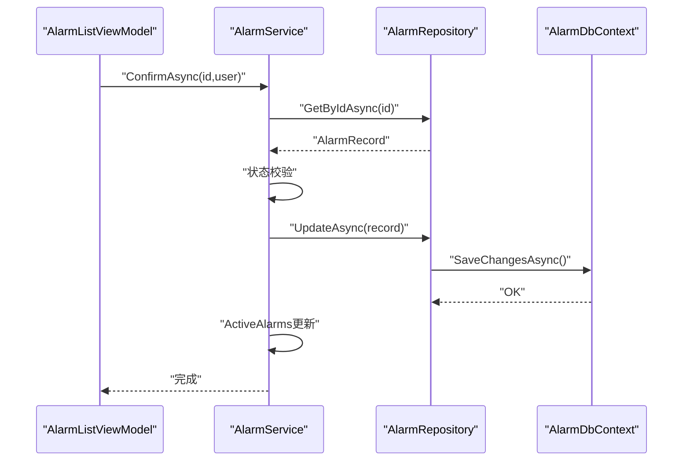
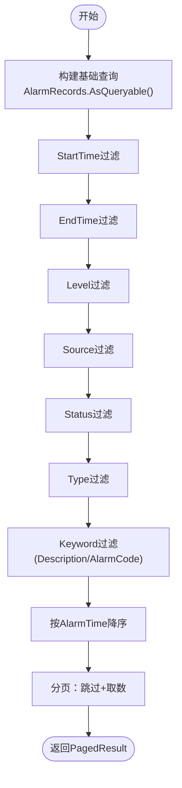
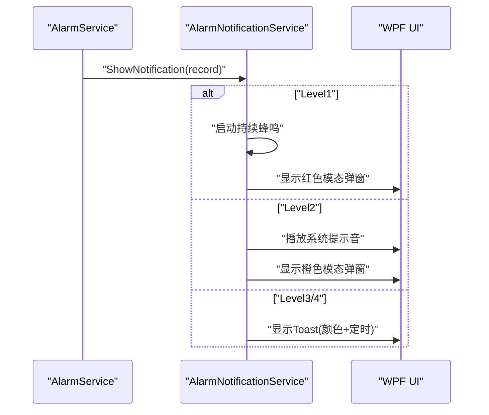
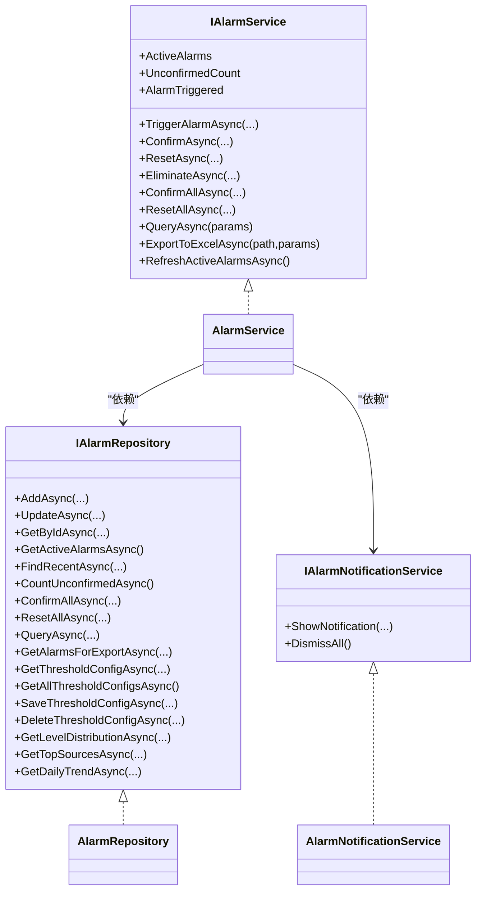

# 报警系统接口

<cite>
**本文引用的文件**
- [IAlarmService.cs](file://AlarmModule/Interfaces/IAlarmService.cs)
- [IAlarmRepository.cs](file://AlarmModule/Interfaces/IAlarmRepository.cs)
- [IAlarmNotificationService.cs](file://AlarmModule/Interfaces/IAlarmNotificationService.cs)
- [AlarmService.cs](file://AlarmModule/Services/AlarmService.cs)
- [AlarmRepository.cs](file://AlarmModule/Data/AlarmRepository.cs)
- [AlarmNotificationService.cs](file://AlarmModule/Services/AlarmNotificationService.cs)
- [AlarmDbContext.cs](file://AlarmModule/Data/AlarmDbContext.cs)
- [AlarmRecord.cs](file://AlarmModule/Models/AlarmRecord.cs)
- [AlarmThresholdConfig.cs](file://AlarmModule/Models/AlarmThresholdConfig.cs)
- [AlarmQueryParams.cs](file://AlarmModule/Models/AlarmQueryParams.cs)
- [AlarmLevel.cs](file://AlarmModule/Models/AlarmLevel.cs)
- [AlarmType.cs](file://AlarmModule/Models/AlarmType.cs)
- [AlarmStatus.cs](file://AlarmModule/Models/AlarmStatus.cs)
- [AlarmListViewModel.cs](file://AlarmModule/ViewModels/AlarmListViewModel.cs)
- [AlarmHistoryViewModel.cs](file://AlarmModule/ViewModels/AlarmHistoryViewModel.cs)
- [AlarmStatsViewModel.cs](file://AlarmModule/ViewModels/AlarmStatsViewModel.cs)
- [AlarmThresholdViewModel.cs](file://AlarmModule/ViewModels/AlarmThresholdViewModel.cs)
</cite>

## 目录
1. [简介](#简介)
2. [项目结构](#项目结构)
3. [核心组件](#核心组件)
4. [架构总览](#架构总览)
5. [详细组件分析](#详细组件分析)
6. [依赖关系分析](#依赖关系分析)
7. [性能考虑](#性能考虑)
8. [故障排查指南](#故障排查指南)
9. [结论](#结论)
10. [附录](#附录)

## 简介
本文件为报警系统模块的完整接口API文档，覆盖接口规范、方法参数与返回值说明、调用流程、配置与统计分析、异步通知机制与消息队列集成建议、监控与告警推送、故障诊断等内容。目标是帮助开发者与运维人员快速理解并正确使用报警系统的触发、查询、处理与通知能力。

## 项目结构
报警系统模块采用分层设计：
- 接口层：定义服务与仓储契约，隔离业务逻辑与实现细节
- 服务层：实现报警触发、生命周期管理、查询导出、通知等核心功能
- 数据层：基于EF Core + SQLite，提供报警记录与阈值配置的CRUD与统计查询
- 视图模型层：封装UI交互逻辑，绑定到WPF界面进行展示与操作

**图表来源**
- [IAlarmService.cs:11-75](file://AlarmModule/Interfaces/IAlarmService.cs#L11-L75)
- [IAlarmRepository.cs:11-32](file://AlarmModule/Interfaces/IAlarmRepository.cs#L11-L32)
- [IAlarmNotificationService.cs:10-21](file://AlarmModule/Interfaces/IAlarmNotificationService.cs#L10-L21)
- [AlarmService.cs:16-46](file://AlarmModule/Services/AlarmService.cs#L16-L46)
- [AlarmRepository.cs:15-22](file://AlarmModule/Data/AlarmRepository.cs#L15-L22)
- [AlarmNotificationService.cs:19-30](file://AlarmModule/Services/AlarmNotificationService.cs#L19-L30)
- [AlarmDbContext.cs:10-44](file://AlarmModule/Data/AlarmDbContext.cs#L10-L44)
- [AlarmRecord.cs:12-60](file://AlarmModule/Models/AlarmRecord.cs#L12-L60)
- [AlarmThresholdConfig.cs:10-35](file://AlarmModule/Models/AlarmThresholdConfig.cs#L10-L35)
- [AlarmQueryParams.cs:9-33](file://AlarmModule/Models/AlarmQueryParams.cs#L9-L33)
- [AlarmLevel.cs:6-16](file://AlarmModule/Models/AlarmLevel.cs#L6-L16)
- [AlarmType.cs:6-16](file://AlarmModule/Models/AlarmType.cs#L6-L16)
- [AlarmStatus.cs:6-16](file://AlarmModule/Models/AlarmStatus.cs#L6-L16)
- [AlarmListViewModel.cs:16-95](file://AlarmModule/ViewModels/AlarmListViewModel.cs#L16-L95)
- [AlarmHistoryViewModel.cs:16-167](file://AlarmModule/ViewModels/AlarmHistoryViewModel.cs#L16-L167)
- [AlarmStatsViewModel.cs:17-93](file://AlarmModule/ViewModels/AlarmStatsViewModel.cs#L17-L93)
- [AlarmThresholdViewModel.cs:17-175](file://AlarmModule/ViewModels/AlarmThresholdViewModel.cs#L17-L175)

**章节来源**
- [AlarmService.cs:16-46](file://AlarmModule/Services/AlarmService.cs#L16-L46)
- [AlarmRepository.cs:15-22](file://AlarmModule/Data/AlarmRepository.cs#L15-L22)
- [AlarmNotificationService.cs:19-30](file://AlarmModule/Services/AlarmNotificationService.cs#L19-L30)
- [AlarmDbContext.cs:10-44](file://AlarmModule/Data/AlarmDbContext.cs#L10-L44)

## 核心组件
本节对关键接口与实现进行规范说明，包括参数、返回值、行为约束与典型用法。

- IAlarmService
  - 触发报警：TriggerAlarmAsync
    - 参数：alarmCode、level、description、source、type、triggerValue、thresholdValue
    - 行为：支持防抖（按Code+Source在配置时间窗内去重），创建未确认报警并持久化
    - 返回：无（Task）
    - 异常：无抛出，内部记录日志
  - 生命周期管理：ConfirmAsync、ResetAsync、EliminateAsync
    - 参数：alarmId、confirmedBy/resetBy
    - 行为：状态流转校验（仅Unconfirmed可确认；仅Confirmed可复位；均可消除）
    - 返回：无（Task）
    - 异常：状态不符时抛出InvalidOperationException
  - 批量操作：ConfirmAllAsync、ResetAllAsync
    - 参数：confirmedBy/resetBy
    - 行为：批量更新状态并同步活跃报警集合
    - 返回：无（Task）
  - 查询与导出：QueryAsync、ExportToExcelAsync
    - 参数：AlarmQueryParams
    - 行为：分页查询、构建Excel并保存
    - 返回：PagedResult<AlarmRecord>、Task
  - 活跃报警与计数：ActiveAlarms、UnconfirmedCount
    - 类型：ObservableCollection<AlarmRecord>、int
    - 行为：实时反映未消除且未确认的报警集合与数量
  - 事件：AlarmTriggered
    - 类型：Action<AlarmRecord>
    - 触发：报警成功创建后发布

- IAlarmRepository
  - 报警记录：AddAsync、UpdateAsync、GetByIdAsync、GetActiveAlarmsAsync、FindRecentAsync
    - 行为：CRUD与最近报警查找（防抖窗口）
  - 统计查询：CountUnconfirmedAsync、GetLevelDistributionAsync、GetTopSourcesAsync、GetDailyTrendAsync
    - 返回：int、字典、列表、列表
  - 批量操作：ConfirmAllAsync、ResetAllAsync
    - 行为：批量更新状态
  - 导出：GetAlarmsForExportAsync
    - 返回：List<AlarmRecord>
  - 查询：QueryAsync
    - 返回：PagedResult<AlarmRecord>
  - 阈值配置：GetThresholdConfigAsync、GetAllThresholdConfigsAsync、SaveThresholdConfigAsync、DeleteThresholdConfigAsync
    - 行为：唯一键（AlarmCode+AlarmSource）管理

- IAlarmNotificationService
  - 显示通知：ShowNotification
    - 参数：AlarmRecord
    - 行为：根据等级弹出模态或Toast，Level1/2持续蜂鸣，Level3/4定时消失
  - 关闭通知：DismissAll
    - 行为：停止蜂鸣并清理Toast

**章节来源**
- [IAlarmService.cs:11-75](file://AlarmModule/Interfaces/IAlarmService.cs#L11-L75)
- [IAlarmRepository.cs:11-32](file://AlarmModule/Interfaces/IAlarmRepository.cs#L11-L32)
- [IAlarmNotificationService.cs:10-21](file://AlarmModule/Interfaces/IAlarmNotificationService.cs#L10-L21)

## 架构总览
报警系统遵循“接口隔离 + 仓储模式 + 通知服务”的分层架构，核心流程如下：

**图表来源**
- [AlarmService.cs:52-91](file://AlarmModule/Services/AlarmService.cs#L52-L91)
- [AlarmRepository.cs:57-65](file://AlarmModule/Data/AlarmRepository.cs#L57-L65)
- [AlarmDbContext.cs:10-16](file://AlarmModule/Data/AlarmDbContext.cs#L10-L16)
- [AlarmNotificationService.cs:35-55](file://AlarmModule/Services/AlarmNotificationService.cs#L35-L55)

## 详细组件分析

### IAlarmService 接口与 AlarmService 实现
- 方法与行为要点
  - TriggerAlarmAsync：防抖策略、状态初始化、事件发布、通知触发
  - ConfirmAsync/ResetAsync/EliminateAsync：状态校验与更新、活跃集合同步
  - ConfirmAllAsync/ResetAllAsync：批量状态更新与UI同步
  - QueryAsync/ExportToExcelAsync：分页查询与Excel导出
  - ActiveAlarms/UnconfirmedCount：实时集合与计数
  - AlarmTriggered事件：订阅者可做进一步处理（如日志、监控上报）

- 典型调用流程（触发与确认）

**图表来源**
- [AlarmListViewModel.cs:113-126](file://AlarmModule/ViewModels/AlarmListViewModel.cs#L113-L126)
- [AlarmService.cs:96-111](file://AlarmModule/Services/AlarmService.cs#L96-L111)
- [AlarmRepository.cs:35-40](file://AlarmModule/Data/AlarmRepository.cs#L35-L40)
- [AlarmDbContext.cs:10-16](file://AlarmModule/Data/AlarmDbContext.cs#L10-L16)

**章节来源**
- [IAlarmService.cs:11-75](file://AlarmModule/Interfaces/IAlarmService.cs#L11-L75)
- [AlarmService.cs:16-308](file://AlarmModule/Services/AlarmService.cs#L16-L308)

### IAlarmRepository 接口与 AlarmRepository 实现
- 数据访问要点
  - 使用独立DbContext实例，避免跨请求上下文泄漏
  - 防抖查询：按Code+Source与时间窗过滤
  - 统计查询：等级分布、Top来源、每日趋势
  - Excel导出：全量查询并写入xlsx
  - 阈值配置：唯一键约束（AlarmCode+AlarmSource），支持启用/禁用与抑制窗口

- 查询参数与过滤

**图表来源**
- [AlarmRepository.cs:243-263](file://AlarmModule/Data/AlarmRepository.cs#L243-L263)

**章节来源**
- [IAlarmRepository.cs:11-32](file://AlarmModule/Interfaces/IAlarmRepository.cs#L11-L32)
- [AlarmRepository.cs:15-266](file://AlarmModule/Data/AlarmRepository.cs#L15-L266)
- [AlarmQueryParams.cs:9-33](file://AlarmModule/Models/AlarmQueryParams.cs#L9-L33)

### IAlarmNotificationService 接口与 AlarmNotificationService 实现
- 通知策略
  - Level1（紧急）：红色模态弹窗 + 持续蜂鸣
  - Level2（严重）：橙色模态弹窗 + 单次蜂鸣
  - Level3（一般）：黄色Toast + 5秒自动消失
  - Level4（提示）：蓝色Toast + 3秒自动消失
- 资源与线程
  - 使用Dispatcher保证UI线程安全
  - 持续蜂鸣在后台任务中循环播放，支持取消

- 通知序列

**图表来源**
- [AlarmService.cs:89-91](file://AlarmModule/Services/AlarmService.cs#L89-L91)
- [AlarmNotificationService.cs:35-55](file://AlarmModule/Services/AlarmNotificationService.cs#L35-L55)
- [AlarmNotificationService.cs:68-130](file://AlarmModule/Services/AlarmNotificationService.cs#L68-L130)
- [AlarmNotificationService.cs:135-196](file://AlarmModule/Services/AlarmNotificationService.cs#L135-L196)
- [AlarmNotificationService.cs:202-270](file://AlarmModule/Services/AlarmNotificationService.cs#L202-L270)

**章节来源**
- [IAlarmNotificationService.cs:10-21](file://AlarmModule/Interfaces/IAlarmNotificationService.cs#L10-L21)
- [AlarmNotificationService.cs:19-309](file://AlarmModule/Services/AlarmNotificationService.cs#L19-L309)

### 数据模型与数据库上下文
- 实体模型
  - AlarmRecord：报警记录主表，包含时间、等级、代码、来源、类型、描述、阈值、状态、确认/复位信息、处理备注、抑制截止时间等
  - AlarmThresholdConfig：阈值配置表，支持唯一键（AlarmCode+AlarmSource）、等级、类型、抑制窗口、启用标志
- 查询参数
  - AlarmQueryParams：分页、时间范围、等级/状态/类型筛选、关键词检索
  - PagedResult<T>：分页结果包装
- 枚举
  - AlarmLevel：紧急、严重、一般、提示
  - AlarmType：硬件故障、参数超限、通讯错误、工艺错误
  - AlarmStatus：未确认、已确认、已复位、已消除
- 数据库上下文
  - AlarmDbContext：注册两个DbSet，配置索引与枚举转换，避免SQLite索引问题

**章节来源**
- [AlarmRecord.cs:12-60](file://AlarmModule/Models/AlarmRecord.cs#L12-L60)
- [AlarmThresholdConfig.cs:10-35](file://AlarmModule/Models/AlarmThresholdConfig.cs#L10-L35)
- [AlarmQueryParams.cs:9-33](file://AlarmModule/Models/AlarmQueryParams.cs#L9-L33)
- [AlarmLevel.cs:6-16](file://AlarmModule/Models/AlarmLevel.cs#L6-L16)
- [AlarmType.cs:6-16](file://AlarmModule/Models/AlarmType.cs#L6-L16)
- [AlarmStatus.cs:6-16](file://AlarmModule/Models/AlarmStatus.cs#L6-L16)
- [AlarmDbContext.cs:10-44](file://AlarmModule/Data/AlarmDbContext.cs#L10-L44)

### 视图模型与UI交互
- 实时报警列表（AlarmListViewModel）
  - 绑定ActiveAlarms与UnconfirmedCount，提供确认/复位/消除命令，订阅AlarmTriggered事件
- 历史查询（AlarmHistoryViewModel）
  - 多条件筛选、分页浏览、Excel导出
- 统计分析（AlarmStatsViewModel）
  - 等级分布、Top来源、每日趋势，支持日期范围
- 阈值配置（AlarmThresholdViewModel）
  - 新增/编辑/删除阈值配置，支持启用/禁用与抑制窗口设置

**章节来源**
- [AlarmListViewModel.cs:16-262](file://AlarmModule/ViewModels/AlarmListViewModel.cs#L16-L262)
- [AlarmHistoryViewModel.cs:16-281](file://AlarmModule/ViewModels/AlarmHistoryViewModel.cs#L16-L281)
- [AlarmStatsViewModel.cs:17-218](file://AlarmModule/ViewModels/AlarmStatsViewModel.cs#L17-L218)
- [AlarmThresholdViewModel.cs:17-298](file://AlarmModule/ViewModels/AlarmThresholdViewModel.cs#L17-L298)

## 依赖关系分析
- 组件耦合
  - AlarmService依赖IAlarmRepository与IAlarmNotificationService，低耦合高内聚
  - AlarmRepository依赖AlarmDbContext，职责单一
  - AlarmNotificationService依赖日志服务，关注通知策略
- 外部依赖
  - EF Core + SQLite：轻量本地存储
  - WPF/MaterialDesignThemes：UI与对话框宿主
  - ClosedXML：Excel导出
- 循环依赖
  - 未发现循环依赖，接口隔离清晰

**图表来源**
- [IAlarmService.cs:11-75](file://AlarmModule/Interfaces/IAlarmService.cs#L11-L75)
- [IAlarmRepository.cs:11-32](file://AlarmModule/Interfaces/IAlarmRepository.cs#L11-L32)
- [IAlarmNotificationService.cs:10-21](file://AlarmModule/Interfaces/IAlarmNotificationService.cs#L10-L21)
- [AlarmService.cs:16-46](file://AlarmModule/Services/AlarmService.cs#L16-L46)
- [AlarmRepository.cs:15-22](file://AlarmModule/Data/AlarmRepository.cs#L15-L22)
- [AlarmNotificationService.cs:19-30](file://AlarmModule/Services/AlarmNotificationService.cs#L19-L30)

**章节来源**
- [AlarmService.cs:16-46](file://AlarmModule/Services/AlarmService.cs#L16-L46)
- [AlarmRepository.cs:15-22](file://AlarmModule/Data/AlarmRepository.cs#L15-L22)
- [AlarmNotificationService.cs:19-30](file://AlarmModule/Services/AlarmNotificationService.cs#L19-L30)

## 性能考虑
- 数据库层面
  - 在AlarmRecord与AlarmThresholdConfig上建立必要索引，避免大表扫描
  - 枚举使用整型存储，减少SQLite索引转换开销
- 查询优化
  - 分页查询与条件过滤组合，避免一次性加载全量数据
  - Excel导出走全量查询，建议在后台线程执行并限制导出范围
- UI线程
  - 所有UI更新通过Dispatcher.Invoke，避免跨线程访问
- 防抖与并发
  - 防抖窗口减少重复触发与数据库压力
  - 每次仓储操作新建DbContext实例，避免上下文跨请求共享导致的异常

[本节为通用性能建议，不直接分析具体文件]

## 故障排查指南
- 常见问题与定位
  - 状态流转异常：确认/复位时报错“仅未确认/已确认可操作”，检查AlarmRecord.Status
  - 消除重复操作：报错“报警已消除，无需重复操作”，确认业务逻辑
  - Excel导出失败：检查文件路径权限与导出范围过大
  - 通知未弹出：检查AlarmNotificationService.ShowNotification是否被调用，确认UI线程调度
- 日志与事件
  - AlarmService与各ViewModel均使用日志服务输出关键事件，便于追踪
  - AlarmTriggered事件可用于外部扩展（如监控上报）

**章节来源**
- [AlarmService.cs:96-155](file://AlarmModule/Services/AlarmService.cs#L96-L155)
- [AlarmListViewModel.cs:113-178](file://AlarmModule/ViewModels/AlarmListViewModel.cs#L113-L178)
- [AlarmHistoryViewModel.cs:188-209](file://AlarmModule/ViewModels/AlarmHistoryViewModel.cs#L188-L209)

## 结论
报警系统通过清晰的接口分层、完善的生命周期管理、灵活的通知策略与统计分析能力，提供了从触发到处理再到可视化的完整闭环。依托SQLite本地存储与WPF界面，系统具备良好的易用性与可维护性。建议在生产环境中结合监控平台与消息队列进行扩展，以满足更高并发与可靠性需求。

[本节为总结性内容，不直接分析具体文件]

## 附录

### 接口调用流程速查
- 创建报警
  - 调用：IAlarmService.TriggerAlarmAsync
  - 流程：防抖 → 创建未确认 → 持久化 → 更新活跃集合 → 发布事件 → 显示通知
- 查询与导出
  - 调用：IAlarmService.QueryAsync、ExportToExcelAsync
  - 流程：构建AlarmQueryParams → 分页查询 → Excel写入
- 处理报警
  - 调用：ConfirmAsync/ResetAsync/EliminateAsync
  - 流程：状态校验 → 更新 → 同步活跃集合
- 批量处理
  - 调用：ConfirmAllAsync/ResetAllAsync
  - 流程：批量更新 → UI同步
- 配置阈值
  - 调用：IAlarmRepository.SaveThresholdConfigAsync/DeleteThresholdConfigAsync
  - 流程：唯一键校验 → 新增/更新/删除

**章节来源**
- [IAlarmService.cs:17-69](file://AlarmModule/Interfaces/IAlarmService.cs#L17-L69)
- [AlarmService.cs:52-91](file://AlarmModule/Services/AlarmService.cs#L52-L91)
- [AlarmService.cs:96-195](file://AlarmModule/Services/AlarmService.cs#L96-L195)
- [AlarmService.cs:200-255](file://AlarmModule/Services/AlarmService.cs#L200-L255)
- [IAlarmRepository.cs:24-27](file://AlarmModule/Interfaces/IAlarmRepository.cs#L24-L27)
- [AlarmRepository.cs:152-184](file://AlarmModule/Data/AlarmRepository.cs#L152-L184)

### 报警阈值配置、历史查询与统计分析示例
- 阈值配置
  - 使用AlarmThresholdViewModel进行新增/编辑/删除，保存后由AlarmRepository统一管理
- 历史查询
  - AlarmHistoryViewModel支持多条件筛选与分页，导出为Excel
- 统计分析
  - AlarmStatsViewModel提供等级分布、Top来源、每日趋势，支持日期范围

**章节来源**
- [AlarmThresholdViewModel.cs:17-298](file://AlarmModule/ViewModels/AlarmThresholdViewModel.cs#L17-L298)
- [AlarmHistoryViewModel.cs:16-281](file://AlarmModule/ViewModels/AlarmHistoryViewModel.cs#L16-L281)
- [AlarmStatsViewModel.cs:17-218](file://AlarmModule/ViewModels/AlarmStatsViewModel.cs#L17-L218)

### 异步通知机制与消息队列集成建议
- 异步通知
  - AlarmNotificationService在UI线程外运行蜂鸣任务，避免阻塞
- 消息队列集成
  - 建议在AlarmTriggered事件中加入消息队列入队，实现跨进程/跨节点告警推送
  - 队列消息格式可包含AlarmRecord关键字段与优先级（对应AlarmLevel）

**章节来源**
- [AlarmService.cs:88-89](file://AlarmModule/Services/AlarmService.cs#L88-L89)
- [AlarmNotificationService.cs:275-296](file://AlarmModule/Services/AlarmNotificationService.cs#L275-L296)

### 监控集成、告警推送与故障诊断
- 监控集成
  - 可在AlarmTriggered中上报至监控平台（如Prometheus、Grafana），指标包含等级分布、Top来源、趋势
- 告警推送
  - 结合消息队列与第三方推送（邮件/短信/IM），按等级与抑制窗口控制频率
- 故障诊断
  - 通过AlarmHistoryViewModel导出数据进行离线分析，结合日志定位根因

**章节来源**
- [AlarmService.cs:88-91](file://AlarmModule/Services/AlarmService.cs#L88-L91)
- [AlarmHistoryViewModel.cs:188-209](file://AlarmModule/ViewModels/AlarmHistoryViewModel.cs#L188-L209)