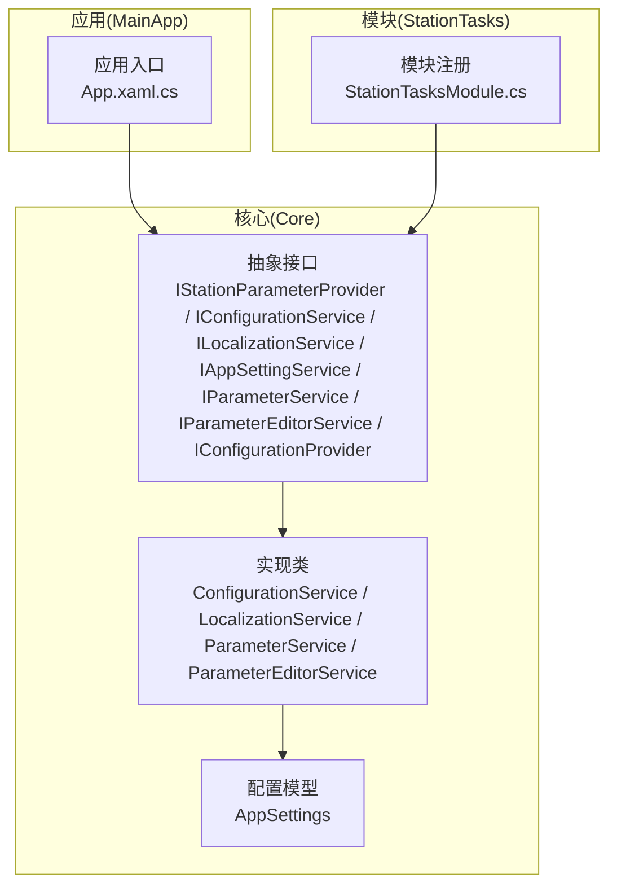
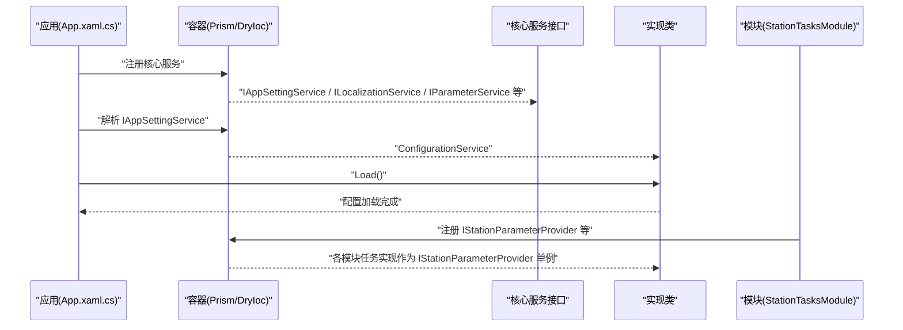

# 核心服务接口

<cite>
**本文引用的文件**
- [IStationParameterProvider.cs](file://Core/Abstraction/IStationParameterProvider.cs)
- [IConfigurationService.cs](file://Core/Abstraction/IConfigurationService.cs)
- [ILocalizationService.cs](file://Core/Abstraction/ILocalizationService.cs)
- [ConfigurationService.cs](file://Core/Services/ConfigurationService.cs)
- [LocalizationService.cs](file://Core/Services/LocalizationService.cs)
- [IAppSettingService.cs](file://Core/Abstraction/IAppSettingService.cs)
- [IConfigurationProvider.cs](file://Core/Abstraction/IConfigurationProvider.cs)
- [AppSettings.cs](file://Core/Configuration/AppSettings.cs)
- [IParameterService.cs](file://Core/Abstraction/IParameterService.cs)
- [ParameterService.cs](file://Core/Services/ParameterService.cs)
- [IParameterEditorService.cs](file://Core/Abstraction/IParameterEditorService.cs)
- [ParameterEditorService.cs](file://Core/Services/ParameterEditorService.cs)
- [StationTasksModule.cs](file://StationTasks/StationTasksModule.cs)
- [App.xaml.cs](file://MainApp/App.xaml.cs)
</cite>

## 目录
1. [简介](#简介)
2. [项目结构](#项目结构)
3. [核心组件](#核心组件)
4. [架构总览](#架构总览)
5. [详细组件分析](#详细组件分析)
6. [依赖关系分析](#依赖关系分析)
7. [性能考量](#性能考量)
8. [故障排查指南](#故障排查指南)
9. [结论](#结论)
10. [附录](#附录)

## 简介
本文件聚焦于 GZQL_MACHINE 的核心服务接口与实现，围绕以下目标展开：
- 明确 IStationParameterProvider、IConfigurationService、ILocalizationService 的设计理念、职责边界与调用约定
- 详述方法签名、参数规范、返回值定义与异常处理机制
- 提供接口正确使用方式的示例路径（以“代码片段路径”形式给出），涵盖参数传递、异步调用与错误处理的最佳实践
- 阐述接口的扩展性设计与插件化架构支持

## 项目结构
本项目采用模块化与分层架构，核心服务位于 Core 层，通过 Prism/DryIoc 容器进行注册与注入；业务模块（如 StationTasks、Module、MotionControl 等）在各自 Module 中注册服务与接口。

图示来源
- [IStationParameterProvider.cs](file://Core/Abstraction/IStationParameterProvider.cs)
- [IConfigurationService.cs](file://Core/Abstraction/IConfigurationService.cs)
- [ILocalizationService.cs](file://Core/Abstraction/ILocalizationService.cs)
- [ConfigurationService.cs](file://Core/Services/ConfigurationService.cs)
- [LocalizationService.cs](file://Core/Services/LocalizationService.cs)
- [IAppSettingService.cs](file://Core/Abstraction/IAppSettingService.cs)
- [IConfigurationProvider.cs](file://Core/Abstraction/IConfigurationProvider.cs)
- [AppSettings.cs](file://Core/Configuration/AppSettings.cs)
- [IParameterService.cs](file://Core/Abstraction/IParameterService.cs)
- [ParameterService.cs](file://Core/Services/ParameterService.cs)
- [IParameterEditorService.cs](file://Core/Abstraction/IParameterEditorService.cs)
- [ParameterEditorService.cs](file://Core/Services/ParameterEditorService.cs)
- [StationTasksModule.cs](file://StationTasks/StationTasksModule.cs)
- [App.xaml.cs](file://MainApp/App.xaml.cs)

章节来源
- [IStationParameterProvider.cs](file://Core/Abstraction/IStationParameterProvider.cs)
- [IConfigurationService.cs](file://Core/Abstraction/IConfigurationService.cs)
- [ILocalizationService.cs](file://Core/Abstraction/ILocalizationService.cs)
- [ConfigurationService.cs](file://Core/Services/ConfigurationService.cs)
- [LocalizationService.cs](file://Core/Services/LocalizationService.cs)
- [IAppSettingService.cs](file://Core/Abstraction/IAppSettingService.cs)
- [IConfigurationProvider.cs](file://Core/Abstraction/IConfigurationProvider.cs)
- [AppSettings.cs](file://Core/Configuration/AppSettings.cs)
- [IParameterService.cs](file://Core/Abstraction/IParameterService.cs)
- [ParameterService.cs](file://Core/Services/ParameterService.cs)
- [IParameterEditorService.cs](file://Core/Abstraction/IParameterEditorService.cs)
- [ParameterEditorService.cs](file://Core/Services/ParameterEditorService.cs)
- [StationTasksModule.cs](file://StationTasks/StationTasksModule.cs)
- [App.xaml.cs](file://MainApp/App.xaml.cs)

## 核心组件
- IStationParameterProvider：提供工站参数上下文（工站标识、当前配方池/配方、当前参数对象、未保存更改状态），用于任务执行与参数编辑场景。
- IConfigurationService：面向“节/格式/配置对象”的通用配置存取接口，便于模块化配置管理。
- ILocalizationService：多语言本地化服务，支持语言切换、资源获取、事件发布与默认值回退。
- IAppSettingService：应用级设置访问接口，封装配置文件的加载、保存、重载、重置与扩展键读取。
- IParameterService：参数分组的加载、保存与重置接口，支持异步操作。
- IParameterEditorService：参数编辑器服务接口，负责弹出编辑对话框、保存与应用变更。
- IConfigurationProvider：面向强类型的配置提供与持久化接口，支持默认配置创建与存在性判断。

章节来源
- [IStationParameterProvider.cs](file://Core/Abstraction/IStationParameterProvider.cs)
- [IConfigurationService.cs](file://Core/Abstraction/IConfigurationService.cs)
- [ILocalizationService.cs](file://Core/Abstraction/ILocalizationService.cs)
- [IAppSettingService.cs](file://Core/Abstraction/IAppSettingService.cs)
- [IParameterService.cs](file://Core/Abstraction/IParameterService.cs)
- [IParameterEditorService.cs](file://Core/Abstraction/IParameterEditorService.cs)
- [IConfigurationProvider.cs](file://Core/Abstraction/IConfigurationProvider.cs)

## 架构总览
核心服务通过容器注册为单例或按需注册，业务模块在自身 Module 中注册对核心接口的实现或适配器。应用入口在启动阶段解析核心服务并完成初始化。

图示来源
- [App.xaml.cs](file://MainApp/App.xaml.cs)
- [StationTasksModule.cs](file://StationTasks/StationTasksModule.cs)
- [ConfigurationService.cs](file://Core/Services/ConfigurationService.cs)
- [LocalizationService.cs](file://Core/Services/LocalizationService.cs)

## 详细组件分析

### IStationParameterProvider 接口
- 设计理念
  - 为工站任务提供统一的参数上下文视图，屏蔽底层存储细节，便于任务执行与参数编辑。
  - 关注“当前配方池/配方、当前参数对象、未保存更改”等关键状态，便于 UI 与业务流程联动。
- 方法与属性
  - StationIdentifier：string，工站唯一标识符
  - CurrentPoolName：string，当前配方池名称
  - CurrentRecipeName：string，当前配方名称
  - CurrentParameters：object，当前参数对象（建议为强类型参数对象）
  - HasUnsavedChanges：bool，是否存在未保存的更改
- 调用约定
  - 仅读取参数上下文，不直接修改存储；变更应通过参数编辑服务或任务内部流程提交。
- 异常处理
  - 该接口为只读契约，不抛出业务异常；具体异常应在实现类中处理（如参数转换失败、序列化异常等）。
- 最佳实践
  - 在任务执行前读取 CurrentParameters 并进行浅拷贝，避免并发修改导致的数据竞争。
  - 结合 HasUnsavedChanges 控制 UI 的“保存/取消”按钮可用状态。
- 代码片段路径
  - [IStationParameterProvider.cs](file://Core/Abstraction/IStationParameterProvider.cs)

章节来源
- [IStationParameterProvider.cs](file://Core/Abstraction/IStationParameterProvider.cs)

### IConfigurationService 接口
- 设计理念
  - 以“节名+格式+配置对象”三元组的方式提供通用配置存取能力，便于不同模块独立管理自己的配置段。
- 方法与参数
  - SaveConfiguration(sectionName, format, config)：保存配置
    - sectionName：string，配置节名
    - format：string，序列化格式标识
    - config：object，要保存的配置对象
  - LoadConfiguration<T>(sectionName)：加载配置
    - sectionName：string，配置节名
    - 返回：T，已反序列化的配置实例（默认构造）
- 调用约定
  - format 通常对应序列化方案（如 JSON、XML），由实现类决定。
  - LoadConfiguration<T> 假设 T 具有默认构造函数，以便在缺失配置时返回新实例。
- 异常处理
  - 未在接口中声明异常；实现类可能在序列化/反序列化失败时抛出异常，调用方应捕获并处理。
- 最佳实践
  - 对于大对象，优先使用异步保存策略；对频繁读取的配置，考虑缓存策略。
- 代码片段路径
  - [IConfigurationService.cs](file://Core/Abstraction/IConfigurationService.cs)

章节来源
- [IConfigurationService.cs](file://Core/Abstraction/IConfigurationService.cs)

### ILocalizationService 接口
- 设计理念
  - 提供统一的多语言资源访问与语言切换能力，支持事件驱动的 UI 刷新与 Prism 事件发布。
- 方法与参数
  - CurrentLanguage：LanguageItem，当前语言
  - CurrentCultureCode：string，当前区域性代码
  - SupportedLanguages：IReadOnlyList<LanguageItem>，支持的语言列表
  - SetLanguage(cultureCode)：bool，设置语言并返回是否成功
  - GetResource(key)：string，获取资源字符串
  - GetResource(key, args)：string，获取带格式的资源字符串
  - GetResourceOrDefault(key, defaultValue)：string，获取资源字符串（支持默认值）
  - TryGetResource(key, out value)：bool，尝试获取资源字符串
  - LanguageChanged：事件，语言变更事件
- 调用约定
  - SetLanguage 成功后会更新线程文化、替换资源字典、保存配置并发布事件。
  - GetResource 系列方法在资源缺失时返回占位符或默认值。
- 异常处理
  - 语言切换与资源替换过程包含异常保护，失败时回滚并记录调试信息。
- 最佳实践
  - 使用 LangExtension 或绑定表达式配合资源键，确保 UI 自动刷新。
  - 在用户手动切换语言后，及时保存配置并监听 LanguageChanged 事件。
- 代码片段路径
  - [ILocalizationService.cs](file://Core/Abstraction/ILocalizationService.cs)
  - [LocalizationService.cs](file://Core/Services/LocalizationService.cs)

章节来源
- [ILocalizationService.cs](file://Core/Abstraction/ILocalizationService.cs)
- [LocalizationService.cs](file://Core/Services/LocalizationService.cs)

### IAppSettingService 与 AppSettings
- 设计理念
  - IAppSettingService 抽象应用级设置的加载、保存、重载、重置与扩展键读取；AppSettings 为具体配置模型。
- 关键成员
  - Settings：AppSettings，当前应用设置
  - 异步方法：SaveAsync、ReloadAsync、ResetToDefaultAsync
  - 同步方法：Load、Save（可选）
  - RecipeName、LastRecipeName、LastSelectedRecipePath、ServerConfig、Clients
  - TryUpdateRecipeName、AddClient、RemoveClient、GetClient、GetValue
- 调用约定
  - 首次访问 Settings 时自动加载；保存时使用线程锁保证并发安全。
  - GetValue 支持从扩展数据中读取任意键值。
- 异常处理
  - 加载/保存失败时记录错误并回退到默认设置。
- 最佳实践
  - 在应用启动时解析 IAppSettingService 并调用 Load；在设置变更后调用 SaveAsync。
- 代码片段路径
  - [IAppSettingService.cs](file://Core/Abstraction/IAppSettingService.cs)
  - [ConfigurationService.cs](file://Core/Services/ConfigurationService.cs)
  - [AppSettings.cs](file://Core/Configuration/AppSettings.cs)

章节来源
- [IAppSettingService.cs](file://Core/Abstraction/IAppSettingService.cs)
- [ConfigurationService.cs](file://Core/Services/ConfigurationService.cs)
- [AppSettings.cs](file://Core/Configuration/AppSettings.cs)

### IParameterService 与 ParameterService
- 设计理念
  - IParameterService 提供参数分组的异步加载、保存与重置能力；ParameterService 为演示实现，返回预置参数分组。
- 方法与参数
  - LoadParametersAsync：返回 IEnumerable<ParameterGroup>
  - SaveParametersAsync：保存参数分组
  - ResetToDefaultsAsync：重置为默认配置
- 调用约定
  - 所有方法均为异步，便于与 UI 线程解耦。
- 异常处理
  - 演示实现中 SaveParametersAsync 包含模拟延迟；实际实现应处理序列化/存储异常。
- 最佳实践
  - 参数分组应包含显示名、描述、默认值、范围约束等元数据，便于 UI 编辑与校验。
- 代码片段路径
  - [IParameterService.cs](file://Core/Abstraction/IParameterService.cs)
  - [ParameterService.cs](file://Core/Services/ParameterService.cs)

章节来源
- [IParameterService.cs](file://Core/Abstraction/IParameterService.cs)
- [ParameterService.cs](file://Core/Services/ParameterService.cs)

### IParameterEditorService 与 ParameterEditorService
- 设计理念
  - IParameterEditorService 抽象参数编辑器的获取与保存；ParameterEditorService 通过对话框服务展示编辑器，保存后将变更复制到目标对象。
- 方法与参数
  - GetEditableParametersAsync：获取可编辑参数分组
  - SaveEditableParametersAsync：保存编辑后的参数分组
- 调用约定
  - EditParameters 接受 IParameterEditable 目标，创建参数快照，打开对话框，保存并复制变更。
- 异常处理
  - 若目标参数类型不匹配或对话框取消，返回 false；否则返回 true。
- 最佳实践
  - 使用 CreateSnapshot 生成可撤销的编辑副本；复制参数时仅复制可读写属性。
- 代码片段路径
  - [IParameterEditorService.cs](file://Core/Abstraction/IParameterEditorService.cs)
  - [ParameterEditorService.cs](file://Core/Services/ParameterEditorService.cs)

章节来源
- [IParameterEditorService.cs](file://Core/Abstraction/IParameterEditorService.cs)
- [ParameterEditorService.cs](file://Core/Services/ParameterEditorService.cs)

### IConfigurationProvider
- 设计理念
  - 面向强类型的配置提供与持久化，支持默认配置创建与存在性检查。
- 方法与参数
  - GetConfiguration<T>：返回 T 实例（new()）
  - SaveConfiguration<T>：保存配置
  - ConfigurationExists：bool，配置是否存在
  - CreateDefaultConfiguration：创建默认配置
- 调用约定
  - 与 IConfigurationService 不同，IConfigurationProvider 更偏向强类型配置的读写。
- 异常处理
  - 未在接口中声明异常；实现类负责序列化/文件系统异常处理。
- 代码片段路径
  - [IConfigurationProvider.cs](file://Core/Abstraction/IConfigurationProvider.cs)

章节来源
- [IConfigurationProvider.cs](file://Core/Abstraction/IConfigurationProvider.cs)

### 接口的扩展性与插件化支持
- 容器注册
  - 应用入口在 RegisterTypes 中注册核心服务实例与实现；模块在各自 Module 中注册对核心接口的实现或适配器。
- 工站参数提供者
  - StationTasksModule 将多个 ITask 实现注册为 IStationParameterProvider 单例，实现工站任务的自注册与统一访问。
- 配置提供者
  - MainApp 在注册阶段根据环境创建 IConfigurationProvider 实例（如 XML 配置提供者），并注入到需要的组件。
- 最佳实践
  - 通过接口隔离实现细节，便于替换不同存储介质（JSON/XML/数据库）。
  - 使用异步 API 与事件机制，降低耦合并提升响应性。

章节来源
- [StationTasksModule.cs](file://StationTasks/StationTasksModule.cs)
- [App.xaml.cs](file://MainApp/App.xaml.cs)

## 依赖关系分析

```mermaid
classDiagram
class IStationParameterProvider {
+string StationIdentifier
+string CurrentPoolName
+string CurrentRecipeName
+object CurrentParameters
+bool HasUnsavedChanges
}
class IConfigurationService {
+void SaveConfiguration(sectionName, format, config)
+T LoadConfiguration~T~(sectionName)
}
class ILocalizationService {
+LanguageItem CurrentLanguage
+string CurrentCultureCode
+IReadOnlyList~LanguageItem~ SupportedLanguages
+bool SetLanguage(cultureCode)
+string GetResource(key)
+string GetResource(key, args)
+string GetResourceOrDefault(key, defaultValue)
+bool TryGetResource(key, out value)
+event LanguageChanged
}
class IAppSettingService {
+AppSettings Settings
+Task SaveAsync()
+Task ReloadAsync()
+Task ResetToDefaultAsync()
+string RecipeName
+string LastRecipeName
+string LastSelectedRecipePath
+ServerConfiguration ServerConfig
+IReadOnlyList~ClientConfiguration~ Clients
+void Load()
+void Save()
+bool TryUpdateRecipeName(newName)
+void AddClient(clientConfig)
+void RemoveClient(clientName)
+ClientConfiguration GetClient(clientName)
+string GetValue(key, defaultValue)
}
class IParameterService {
+Task~IEnumerable~ParameterGroup~~ LoadParametersAsync()
+Task SaveParametersAsync(parameterGroups)
+Task~IEnumerable~ParameterGroup~~ ResetToDefaultsAsync()
}
class IParameterEditorService {
+Task~IEnumerable~ParameterGroup~~ GetEditableParametersAsync()
+Task SaveEditableParametersAsync(parameterGroups)
}
class IConfigurationProvider {
+T GetConfiguration~T~()
+void SaveConfiguration~T~(config)
+bool ConfigurationExists
+void CreateDefaultConfiguration()
}
class ConfigurationService
class LocalizationService
class ParameterService
class ParameterEditorService
IStationParameterProvider <|.. ConfigurationService : "实现(示例)"
ILocalizationService <|.. LocalizationService
IAppSettingService <|.. ConfigurationService
IParameterService <|.. ParameterService
IParameterEditorService <|.. ParameterEditorService
IConfigurationService <|.. ConfigurationService
IConfigurationProvider <|.. ConfigurationService
```

图示来源
- [IStationParameterProvider.cs](file://Core/Abstraction/IStationParameterProvider.cs)
- [IConfigurationService.cs](file://Core/Abstraction/IConfigurationService.cs)
- [ILocalizationService.cs](file://Core/Abstraction/ILocalizationService.cs)
- [IAppSettingService.cs](file://Core/Abstraction/IAppSettingService.cs)
- [IParameterService.cs](file://Core/Abstraction/IParameterService.cs)
- [IParameterEditorService.cs](file://Core/Abstraction/IParameterEditorService.cs)
- [IConfigurationProvider.cs](file://Core/Abstraction/IConfigurationProvider.cs)
- [ConfigurationService.cs](file://Core/Services/ConfigurationService.cs)
- [LocalizationService.cs](file://Core/Services/LocalizationService.cs)
- [ParameterService.cs](file://Core/Services/ParameterService.cs)
- [ParameterEditorService.cs](file://Core/Services/ParameterEditorService.cs)

## 性能考量
- 异步优先：IAppSettingService、IParameterService、IConfigurationService 均提供异步方法，避免阻塞 UI 线程。
- 线程安全：ConfigurationService 在加载/保存时使用锁，防止并发写入导致的数据损坏。
- 资源替换：LocalizationService 在 UI 线程上更新资源字典，减少不必要的刷新成本。
- 事件驱动：LocalizationService 发布 LanguageChanged 事件，便于订阅者批量刷新，避免逐个组件刷新。

## 故障排查指南
- 配置加载失败
  - 现象：应用启动后配置未生效或出现默认值
  - 排查：确认配置文件路径与权限；查看控制台输出的加载异常信息；验证 JSON 格式与字段映射
  - 参考路径
    - [ConfigurationService.cs](file://Core/Services/ConfigurationService.cs)
    - [AppSettings.cs](file://Core/Configuration/AppSettings.cs)
- 语言切换无效
  - 现象：切换语言后 UI 文案未更新
  - 排查：确认 SetLanguage 返回 true；检查资源字典替换是否成功；验证 LangExtension 是否被刷新
  - 参考路径
    - [LocalizationService.cs](file://Core/Services/LocalizationService.cs)
    - [ILocalizationService.cs](file://Core/Abstraction/ILocalizationService.cs)
- 参数保存未生效
  - 现象：编辑参数后重启应用仍恢复默认值
  - 排查：确认 SaveParametersAsync 是否被调用；检查实现类是否真正持久化；核对参数分组命名与键一致
  - 参考路径
    - [IParameterService.cs](file://Core/Abstraction/IParameterService.cs)
    - [ParameterService.cs](file://Core/Services/ParameterService.cs)
- 工站参数上下文为空
  - 现象：IStationParameterProvider 返回空参数
  - 排查：确认模块已将任务实现注册为 IStationParameterProvider；检查任务是否完成自注册
  - 参考路径
    - [StationTasksModule.cs](file://StationTasks/StationTasksModule.cs)
    - [IStationParameterProvider.cs](file://Core/Abstraction/IStationParameterProvider.cs)

章节来源
- [ConfigurationService.cs](file://Core/Services/ConfigurationService.cs)
- [AppSettings.cs](file://Core/Configuration/AppSettings.cs)
- [LocalizationService.cs](file://Core/Services/LocalizationService.cs)
- [ILocalizationService.cs](file://Core/Abstraction/ILocalizationService.cs)
- [IParameterService.cs](file://Core/Abstraction/IParameterService.cs)
- [ParameterService.cs](file://Core/Services/ParameterService.cs)
- [StationTasksModule.cs](file://StationTasks/StationTasksModule.cs)
- [IStationParameterProvider.cs](file://Core/Abstraction/IStationParameterProvider.cs)

## 结论
本文档系统梳理了 GZQL_MACHINE 的核心服务接口与其典型实现，明确了各接口的职责边界、调用约定与异常处理策略，并提供了可直接定位到源码的示例路径。通过容器注册与事件机制，系统实现了良好的扩展性与插件化支持，便于在不同模块中复用与替换实现。

## 附录
- 使用示例（以“代码片段路径”形式给出）
  - 异步加载应用设置
    - [App.xaml.cs](file://MainApp/App.xaml.cs)
  - 切换语言并监听事件
    - [ILocalizationService.cs](file://Core/Abstraction/ILocalizationService.cs)
    - [LocalizationService.cs](file://Core/Services/LocalizationService.cs)
  - 保存参数分组
    - [IParameterService.cs](file://Core/Abstraction/IParameterService.cs)
    - [ParameterService.cs](file://Core/Services/ParameterService.cs)
  - 通过编辑器保存参数并应用
    - [IParameterEditorService.cs](file://Core/Abstraction/IParameterEditorService.cs)
    - [ParameterEditorService.cs](file://Core/Services/ParameterEditorService.cs)
  - 工站参数提供者的注册与使用
    - [StationTasksModule.cs](file://StationTasks/StationTasksModule.cs)
    - [IStationParameterProvider.cs](file://Core/Abstraction/IStationParameterProvider.cs)