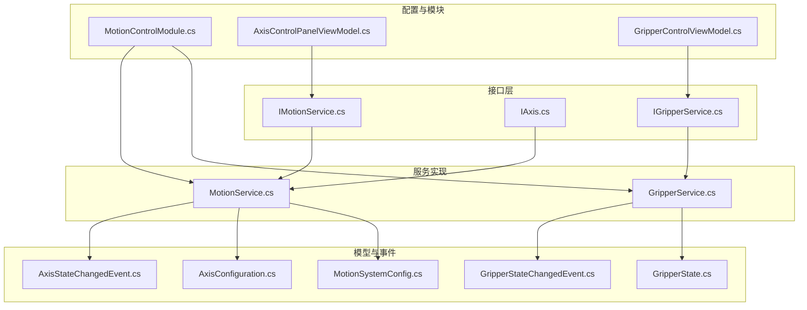
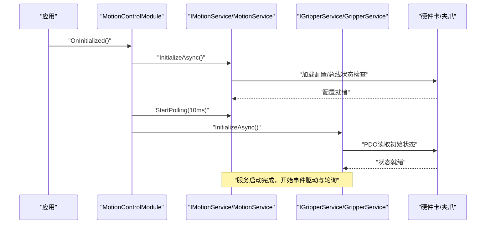
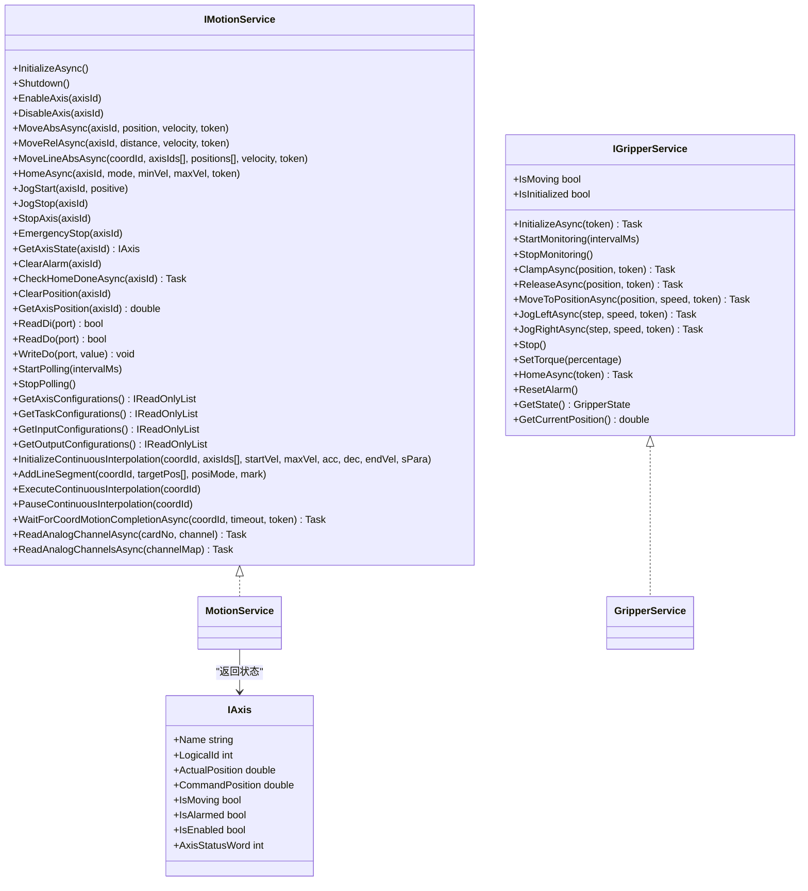
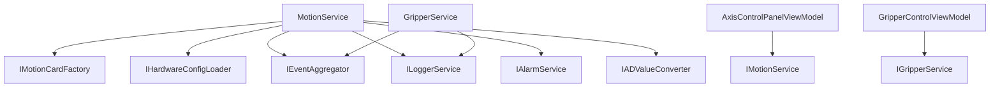

# 运动控制接口

<cite>
**本文档引用的文件**
- [IMotionService.cs](file://MotionControl/Interfaces/IMotionService.cs)
- [IAxis.cs](file://MotionControl/Interfaces/IAxis.cs)
- [IGripperService.cs](file://MotionControl/Interfaces/IGripperService.cs)
- [MotionService.cs](file://MotionControl/Services/MotionService.cs)
- [GripperService.cs](file://MotionControl/Services/GripperService.cs)
- [AxisConfiguration.cs](file://MotionControl/Models/AxisConfiguration.cs)
- [GripperState.cs](file://MotionControl/Models/GripperState.cs)
- [MotionSystemConfig.cs](file://MotionControl/Models/MotionSystemConfig.cs)
- [AxisStateChangedEvent.cs](file://MotionControl/Events/AxisStateChangedEvent.cs)
- [GripperStateChangedEvent.cs](file://MotionControl/Events/GripperStateChangedEvent.cs)
- [MotionControlModule.cs](file://MotionControl/MotionControlModule.cs)
- [AxisControlPanelViewModel.cs](file://MotionControl/ViewModels/AxisControlPanelViewModel.cs)
- [GripperControlViewModel.cs](file://Module/Controls/Grippers/GripperControlViewModel.cs)
</cite>

## 目录
1. [简介](#简介)
2. [项目结构](#项目结构)
3. [核心组件](#核心组件)
4. [架构概览](#架构概览)
5. [详细组件分析](#详细组件分析)
6. [依赖关系分析](#依赖关系分析)
7. [性能考虑](#性能考虑)
8. [故障排除指南](#故障排除指南)
9. [结论](#结论)
10. [附录](#附录)

## 简介
本文件为运动控制模块的接口参考文档，重点覆盖以下接口与服务：
- IMotionService：运动控制服务接口，提供轴控制、IO操作、连续插补、模拟量读取等功能
- IAxis：轴状态查询接口
- IGripperService：抓取器控制接口，支持夹紧/松开、位置移动、点动、力矩控制、回零等

文档内容包括：
- 方法定义、参数规格、返回值类型
- 命令序列与状态查询流程
- 错误处理机制与安全约束
- 轴控制、抓取器操作、任务调度的调用示例
- 同步机制、性能优化策略
- 常见运动控制场景的接口使用模式与故障排除指导

## 项目结构
运动控制模块位于 MotionControl 子目录，核心接口与实现如下：
- 接口层：Interfaces 目录
- 服务实现：Services 目录
- 模型与事件：Models、Events 目录
- 配置与模块注册：MotionControlModule.cs
- 视图模型：ViewModels 目录
- 上层使用示例：Module 控制器中的 GripperControlViewModel.cs

**图表来源**
- [IMotionService.cs:1-91](file://MotionControl/Interfaces/IMotionService.cs#L1-L91)
- [IAxis.cs:1-15](file://MotionControl/Interfaces/IAxis.cs#L1-L15)
- [IGripperService.cs:1-46](file://MotionControl/Interfaces/IGripperService.cs#L1-L46)
- [MotionService.cs:1-741](file://MotionControl/Services/MotionService.cs#L1-L741)
- [GripperService.cs:1-341](file://MotionControl/Services/GripperService.cs#L1-L341)
- [AxisConfiguration.cs:1-298](file://MotionControl/Models/AxisConfiguration.cs#L1-L298)
- [GripperState.cs:1-40](file://MotionControl/Models/GripperState.cs#L1-L40)
- [MotionSystemConfig.cs:1-71](file://MotionControl/Models/MotionSystemConfig.cs#L1-L71)
- [AxisStateChangedEvent.cs:1-51](file://MotionControl/Events/AxisStateChangedEvent.cs#L1-L51)
- [GripperStateChangedEvent.cs:1-8](file://MotionControl/Events/GripperStateChangedEvent.cs#L1-L8)
- [MotionControlModule.cs:1-59](file://MotionControl/MotionControlModule.cs#L1-L59)
- [AxisControlPanelViewModel.cs:1-134](file://MotionControl/ViewModels/AxisControlPanelViewModel.cs#L1-L134)
- [GripperControlViewModel.cs:1-397](file://Module/Controls/Grippers/GripperControlViewModel.cs#L1-L397)

**章节来源**
- [MotionControlModule.cs:1-59](file://MotionControl/MotionControlModule.cs#L1-L59)
- [AxisControlPanelViewModel.cs:1-134](file://MotionControl/ViewModels/AxisControlPanelViewModel.cs#L1-L134)
- [GripperControlViewModel.cs:1-397](file://Module/Controls/Grippers/GripperControlViewModel.cs#L1-L397)

## 核心组件
本节概述关键接口与服务的能力边界与职责。

- IMotionService
  - 轴控制：使能/失能、绝对/相对运动、回零、点动、急停、停止
  - 插补与协调：初始化连续插补、添加直线段、执行/暂停插补、等待坐标系运动完成
  - IO与模拟量：读取DI/DO、写入DO、批量读取模拟量通道
  - 状态与配置：获取轴/任务/DI/DO配置、事件驱动轴状态订阅、轮询控制
  - 返回值与异常：多数方法返回 Task/Task<bool>，部分方法返回数值或状态对象；异常采用可恢复异常与标准异常结合

- IAxis
  - 提供轴名称、逻辑ID、实际/指令位置、运动状态、报警、使能状态、状态字等只读属性

- IGripperService
  - 生命周期：初始化、监控启停
  - 快速操作：夹紧/松开指定位置
  - 运动控制：移动到位置、左右点动、停止
  - 力矩控制：设置夹爪力矩百分比
  - 系统操作：回零、报警复位
  - 状态查询：获取当前状态、实时位置、运动中/已初始化标志

**章节来源**
- [IMotionService.cs:1-91](file://MotionControl/Interfaces/IMotionService.cs#L1-L91)
- [IAxis.cs:1-15](file://MotionControl/Interfaces/IAxis.cs#L1-L15)
- [IGripperService.cs:1-46](file://MotionControl/Interfaces/IGripperService.cs#L1-L46)

## 架构概览
运动控制模块采用事件驱动与轮询相结合的方式实现高实时性与低耦合：
- IMotionService 实现 IObservable<AxisStateChangedEvent>，通过轮询线程读取硬件状态并发布事件
- MotionService 负责硬件卡映射、配置加载、运动命令路由、位置校验与异常处理
- GripperService 通过 EtherCAT PDO 与外部夹爪通信，提供状态监控与事件发布
- 上层视图模型通过注入接口进行调用，模块在初始化阶段统一启动运动服务与夹爪服务

**图表来源**
- [MotionControlModule.cs:23-46](file://MotionControl/MotionControlModule.cs#L23-L46)
- [MotionService.cs:126-161](file://MotionControl/Services/MotionService.cs#L126-L161)
- [GripperService.cs:39-47](file://MotionControl/Services/GripperService.cs#L39-L47)

**章节来源**
- [MotionControlModule.cs:1-59](file://MotionControl/MotionControlModule.cs#L1-L59)
- [MotionService.cs:1-741](file://MotionControl/Services/MotionService.cs#L1-L741)
- [GripperService.cs:1-341](file://MotionControl/Services/GripperService.cs#L1-L341)

## 详细组件分析

### IMotionService 接口详解
- 初始化与生命周期
  - InitializeAsync：加载硬件配置、检查总线状态、下载配置、建立轴/IO映射
  - Shutdown：停止轮询、关闭硬件卡
  - IsSimulationMode：指示是否使用虚拟卡（无真实硬件）

- 轴控制
  - EnableAxis/DisableAxis：使能/失能指定逻辑轴
  - MoveAbsAsync：绝对运动，支持取消令牌与位置校验
  - MoveRelAsync：相对运动，先读取当前位置再计算目标位置
  - MoveLineAbsAsync：多轴联动直线插补，等待所有轴到位
  - HomeAsync：回零流程，包含搜索原点、Z相检测、微调停止与最终校验
  - JogStart/JogStop：点动启动/停止
  - StopAxis/EmergencyStop：常规停止/急停
  - GetAxisState：返回 IAxis 状态快照
  - ClearAlarm/ClearPosition：清除报警与位置

- 状态查询与配置
  - CheckHomeDoneAsync：查询回零状态（1=完成、0=进行中、-1=失败/超时）
  - GetAxisPosition：直接读取硬件位置（高实时性）
  - GetAxisConfigurations/GetTaskConfigurations/GetInputConfigurations/GetOutputConfigurations：读取配置

- IO与模拟量
  - ReadDi/ReadDo/WriteDo：数字量读写
  - ReadAnalogChannelAsync/ReadAnalogChannelsAsync：AD通道读取与批量转换

- 连续插补
  - InitializeContinuousInterpolation：设置速度曲线、前瞻模式、打开插补列表
  - AddLineSegment：添加直线段
  - ExecuteContinuousInterpolation/PauseContinuousInterpolation：执行/暂停
  - WaitForCoordMotionCompletionAsync：等待坐标系运动完成（支持超时与取消）

- 轮询与事件
  - StartPolling/StopPolling：启动/停止高精度轮询（默认10ms）
  - IObservable<AxisStateChangedEvent>：订阅轴状态变更事件

- 参数与返回值
  - 大多数方法返回 Task 或 Task<bool>，支持 CancellationToken
  - 状态查询方法返回数值或状态对象（如 IAxis、GripperState）
  - 异常：位置未到位、回零失败等抛出可恢复异常；硬件错误抛出标准异常

**章节来源**
- [IMotionService.cs:1-91](file://MotionControl/Interfaces/IMotionService.cs#L1-L91)
- [MotionService.cs:210-725](file://MotionControl/Services/MotionService.cs#L210-L725)

### IAxis 接口详解
- 属性
  - Name：轴名称
  - LogicalId：逻辑轴号
  - ActualPosition/CommandPosition：实际/指令位置
  - IsMoving/IsAlarmed/IsEnabled：运动中、报警、使能状态
  - AxisStatusWord：状态字（原始IO位）

- 使用场景
  - UI显示、状态判断、报警处理、运动完成校验

**章节来源**
- [IAxis.cs:1-15](file://MotionControl/Interfaces/IAxis.cs#L1-L15)

### IGripperService 接口详解
- 生命周期
  - InitializeAsync：初始化并更新状态
  - StartMonitoring/StopMonitoring：启动/停止状态轮询（默认200ms）

- 快速操作
  - ClampAsync/ReleaseAsync：夹紧/松开到指定位置

- 运动控制
  - MoveToPositionAsync：移动到目标位置
  - JogLeftAsync/JogRightAsync：左右点动
  - Stop：停止

- 力矩控制
  - SetTorque：设置夹爪力矩百分比（0-100）

- 系统操作
  - HomeAsync：回零
  - ResetAlarm：报警复位（预留）

- 状态查询
  - GetState/GetCurrentPosition/IsMoving/IsInitialized

- 参数与返回值
  - 大多数方法返回 Task，支持 CancellationToken
  - GetCurrentPosition 返回实时位置
  - 异常：操作失败抛出可恢复异常

**章节来源**
- [IGripperService.cs:1-46](file://MotionControl/Interfaces/IGripperService.cs#L1-L46)
- [GripperService.cs:1-341](file://MotionControl/Services/GripperService.cs#L1-L341)

### 类关系图（代码级）

**图表来源**
- [IMotionService.cs:1-91](file://MotionControl/Interfaces/IMotionService.cs#L1-L91)
- [IAxis.cs:1-15](file://MotionControl/Interfaces/IAxis.cs#L1-L15)
- [IGripperService.cs:1-46](file://MotionControl/Interfaces/IGripperService.cs#L1-L46)
- [MotionService.cs:26-741](file://MotionControl/Services/MotionService.cs#L26-L741)
- [GripperService.cs:14-341](file://MotionControl/Services/GripperService.cs#L14-L341)

## 依赖关系分析
- 组件耦合
  - MotionService 依赖 IMotionCardFactory、IHardwareConfigLoader、IEventAggregator、ILoggerService、IAlarmService、IADValueConverter
  - GripperService 依赖 ILoggerService、IEventAggregator
  - 视图模型通过 Prism 注入接口，降低对具体实现的耦合

- 外部依赖
  - 硬件卡驱动：通过 IMotionCard 接口抽象，支持真实卡与虚拟卡
  - EtherCAT PDO：夹爪通过 LTDMC 读写 PDO 寄存器
  - Prism 事件总线：用于状态事件发布与订阅

**图表来源**
- [MotionService.cs:113-123](file://MotionControl/Services/MotionService.cs#L113-L123)
- [GripperService.cs:31-37](file://MotionControl/Services/GripperService.cs#L31-L37)
- [AxisControlPanelViewModel.cs:19-32](file://MotionControl/ViewModels/AxisControlPanelViewModel.cs#L19-L32)
- [GripperControlViewModel.cs:141-150](file://Module/Controls/Grippers/GripperControlViewModel.cs#L141-L150)

**章节来源**
- [MotionService.cs:1-741](file://MotionControl/Services/MotionService.cs#L1-L741)
- [GripperService.cs:1-341](file://MotionControl/Services/GripperService.cs#L1-L341)
- [AxisControlPanelViewModel.cs:1-134](file://MotionControl/ViewModels/AxisControlPanelViewModel.cs#L1-L134)
- [GripperControlViewModel.cs:1-397](file://Module/Controls/Grippers/GripperControlViewModel.cs#L1-L397)

## 性能考虑
- 轮询与事件驱动
  - 高精度轮询线程（默认10ms）优先级提升，减少抖动
  - 快速报警检查与全量状态轮询分层执行，降低CPU占用
  - 事件驱动替代UI定时器轮询，提高响应性与一致性

- 实时性保障
  - WaitForDone/WaitForCoordDone 使用 SpinWait 与取消令牌，实现微秒级急停响应
  - 连续插补等待采用异步自旋，避免阻塞主线程

- 模拟量读取
  - 单通道与批量读取均封装为 Task，支持并发与批量转换

- 线程与资源管理
  - 轮询线程使用 CTS 与 Join/Interrupt 保证安全退出
  - IDisposable 实现确保 Shutdown 调用

**章节来源**
- [MotionService.cs:417-579](file://MotionControl/Services/MotionService.cs#L417-L579)
- [MotionService.cs:332-387](file://MotionControl/Services/MotionService.cs#L332-L387)
- [MotionService.cs:686-712](file://MotionControl/Services/MotionService.cs#L686-L712)

## 故障排除指南
- 回零失败
  - 现象：HomeAsync 返回失败或抛出可恢复异常
  - 排查：检查原点传感器、回零方向、是否撞限位；复位后重试
  - 参考：回零状态检查与异常抛出逻辑

- 位置未到位
  - 现象：运动完成后位置误差超过容差，抛出可恢复异常
  - 排查：检查机械卡死、限位触发、伺服报警；复位后重试

- 报警与急停
  - 现象：轮询线程检测到报警/急停位，发布 AxisAlarmEvent 并记录报警
  - 排查：检查硬件IO状态字、安全门/光栅信号

- 夹爪操作失败
  - 现象：夹紧/松开/回零抛出可恢复异常
  - 排查：检查夹爪机械结构、物料状态；确认 EtherCAT PDO 通信正常

- 初始化失败
  - 现象：模块初始化捕获异常，记录错误日志
  - 排查：确认硬件卡可用、配置路径正确、总线状态正常

**章节来源**
- [MotionService.cs:255-290](file://MotionControl/Services/MotionService.cs#L255-L290)
- [MotionService.cs:348-353](file://MotionControl/Services/MotionService.cs#L348-L353)
- [MotionService.cs:472-504](file://MotionControl/Services/MotionService.cs#L472-L504)
- [GripperService.cs:78-110](file://MotionControl/Services/GripperService.cs#L78-L110)
- [GripperService.cs:250-279](file://MotionControl/Services/GripperService.cs#L250-L279)
- [MotionControlModule.cs:41-45](file://MotionControl/MotionControlModule.cs#L41-L45)

## 结论
本接口体系通过清晰的职责划分与事件驱动机制，实现了高实时性、强健的错误处理与良好的扩展性。IMotionService 提供了从轴控制到连续插补的完整能力，IGripperService 则专注于抓取器的运动与状态管理。配合模块化的配置与视图模型，开发者可以快速构建稳定可靠的运动控制应用。

## 附录

### 常见调用示例（步骤化）
- 轴绝对运动与等待到位
  1) 调用 MoveAbsAsync(axisId, position, velocity, token)
  2) 等待内部位置校验通过（若误差超限则抛出异常）
  3) 可选：使用 GetAxisState/Subscribe 订阅轴状态事件

- 多轴联动插补
  1) InitializeContinuousInterpolation(coordId, axisIds[], startVel, maxVel, acc, dec, endVel, sPara)
  2) AddLineSegment(coordId, targetPos[], posiMode, mark)（可多次）
  3) ExecuteContinuousInterpolation(coordId)
  4) WaitForCoordMotionCompletionAsync(coordId, timeout, token)

- 抓取器夹紧/松开
  1) ClampAsync(position, token) 或 ReleaseAsync(position, token)
  2) 监听 GripperStateChangedEvent 获取状态变化

- IO与模拟量
  1) ReadDi/ReadDo/WriteDo 操作数字量
  2) ReadAnalogChannelAsync/ReadAnalogChannelsAsync 读取力值等模拟量

- 回零流程
  1) HomeAsync(axisId, mode, minVel, maxVel, token)
  2) CheckHomeDoneAsync(axisId) 轮询状态
  3) ClearAlarm/ClearPosition（如有需要）

**章节来源**
- [IMotionService.cs:23-87](file://MotionControl/Interfaces/IMotionService.cs#L23-L87)
- [MotionService.cs:255-290](file://MotionControl/Services/MotionService.cs#L255-L290)
- [MotionService.cs:647-725](file://MotionControl/Services/MotionService.cs#L647-L725)
- [IGripperService.cs:17-34](file://MotionControl/Interfaces/IGripperService.cs#L17-L34)
- [GripperService.cs:78-144](file://MotionControl/Services/GripperService.cs#L78-L144)

### 数据模型与事件
- 轴状态事件
  - 包含轴ID、名称、位置、运动状态、报警、极限、急停、回零完成标志与状态字

- 夹爪状态
  - 状态枚举（Idle/Moving/Clamping/Clamped/Releasing/Error/Homing）、当前位置、目标位置、力矩、报警、回零状态、错误消息

- 系统配置
  - MotionSystemConfig：包含卡、轴、DI/DO、任务、信号、灯光等配置集合

**章节来源**
- [AxisStateChangedEvent.cs:1-51](file://MotionControl/Events/AxisStateChangedEvent.cs#L1-L51)
- [GripperStateChangedEvent.cs:1-8](file://MotionControl/Events/GripperStateChangedEvent.cs#L1-L8)
- [GripperState.cs:1-40](file://MotionControl/Models/GripperState.cs#L1-L40)
- [MotionSystemConfig.cs:1-71](file://MotionControl/Models/MotionSystemConfig.cs#L1-L71)