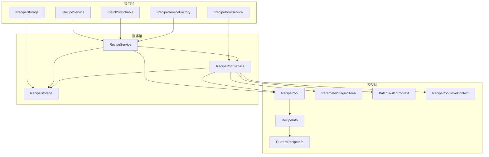
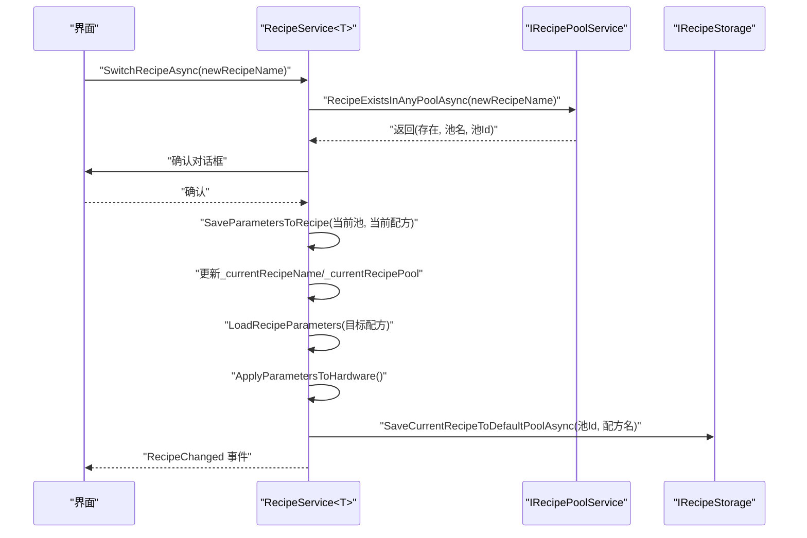
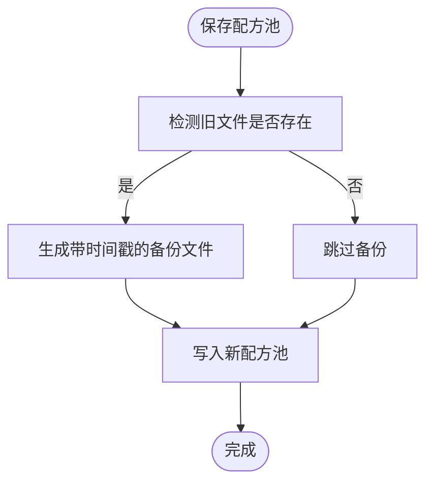
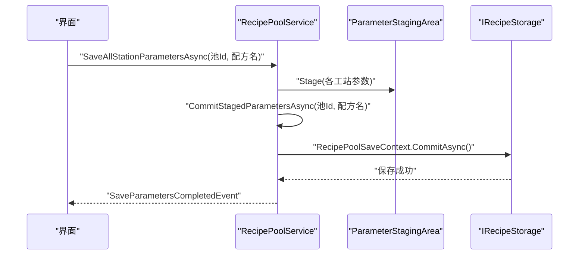
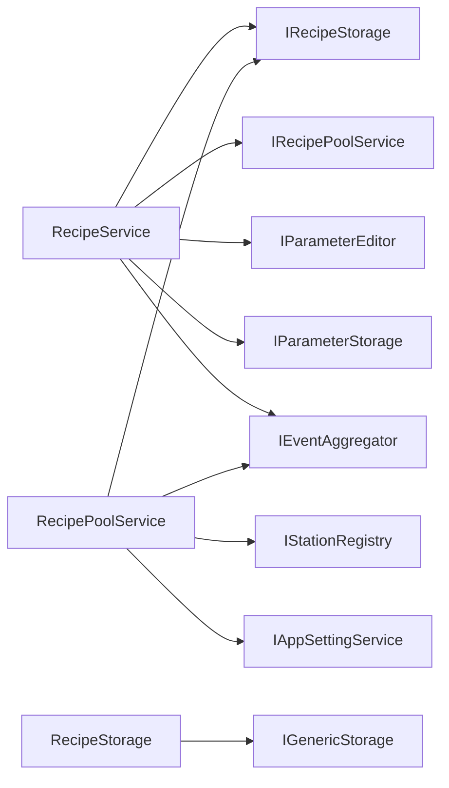

# 配方管理接口

<cite>
**本文引用的文件**
- [IRecipeService.cs](file://RecipeManagement/Interfaces/IRecipeService.cs)
- [IRecipeStorage.cs](file://RecipeManagement/Interfaces/IRecipeStorage.cs)
- [IRecipePoolService.cs](file://RecipeManagement/Interfaces/IRecipePoolService.cs)
- [IRecipeDataAccessor.cs](file://RecipeManagement/Interfaces/IRecipeDataAccessor.cs)
- [IRecipeServiceFactory.cs](file://RecipeManagement/Interfaces/IRecipeServiceFactory.cs)
- [IBatchSwitchable.cs](file://RecipeManagement/Interfaces/IBatchSwitchable.cs)
- [RecipeService.cs](file://RecipeManagement/Services/RecipeService.cs)
- [RecipeStorage.cs](file://RecipeManagement/Services/RecipeStorage.cs)
- [RecipePoolService.cs](file://RecipeManagement/Services/RecipePoolService.cs)
- [RecipePool.cs](file://RecipeManagement/Models/RecipePool.cs)
- [RecipeInfo.cs](file://RecipeManagement/Models/RecipeInfo.cs)
- [CurrentRecipeInfo.cs](file://RecipeManagement/Models/CurrentRecipeInfo.cs)
- [ParameterStagingArea.cs](file://RecipeManagement/Models/ParameterStagingArea.cs)
- [BatchSwitchContext.cs](file://RecipeManagement/Models/BatchSwitchContext.cs)
- [RecipePoolSaveContext.cs](file://RecipeManagement/Models/RecipePoolSaveContext.cs)
- [RecipeServiceExtensions.cs](file://RecipeManagement/Extensions/RecipeServiceExtensions.cs)
- [ServiceCollectionExtensions.cs](file://RecipeManagement/Extensions/ServiceCollectionExtensions.cs)
</cite>

## 目录
1. [简介](#简介)
2. [项目结构](#项目结构)
3. [核心组件](#核心组件)
4. [架构总览](#架构总览)
5. [详细组件分析](#详细组件分析)
6. [依赖关系分析](#依赖关系分析)
7. [性能与并发特性](#性能与并发特性)
8. [故障排查指南](#故障排查指南)
9. [最佳实践与常见问题](#最佳实践与常见问题)
10. [结论](#结论)

## 简介
本文件面向配方管理模块的接口API文档，聚焦以下核心接口与服务：
- IRecipeService：面向具体工站的配方服务接口，负责参数加载、保存、切换、事件发布等。
- IRecipeStorage：配方与配方池的持久化访问接口，提供增删改查与批量操作。
- IRecipePoolService：配方池级服务接口，负责池管理、全局变量、参数暂存与批量切换。
- 扩展与工厂：RecipeServiceExtensions、IRecipeServiceFactory、IBatchSwitchable 提升易用性与批量切换能力。

文档将详细说明接口设计规范、方法签名与参数定义，并结合实现流程图与序列图，帮助读者快速理解配方的创建、编辑、保存、加载、版本控制、批量编辑、配方切换与验证等关键操作。

## 项目结构
配方管理模块位于 RecipeManagement 目录，采用“接口-模型-服务”分层组织：
- Interfaces：对外暴露的领域接口（IRecipeService、IRecipeStorage、IRecipePoolService 等）
- Models：配方与配方池的数据模型（RecipePool、RecipeInfo、CurrentRecipeInfo、ParameterStagingArea、BatchSwitchContext、RecipePoolSaveContext）
- Services：接口的具体实现（RecipeService、RecipeStorage、RecipePoolService）
- Extensions：扩展方法与DI注册扩展（RecipeServiceExtensions、ServiceCollectionExtensions）

图表来源
- [IRecipeService.cs:1-69](file://RecipeManagement/Interfaces/IRecipeService.cs#L1-L69)
- [IRecipePoolService.cs:1-45](file://RecipeManagement/Interfaces/IRecipePoolService.cs#L1-L45)
- [IRecipeStorage.cs:1-34](file://RecipeManagement/Interfaces/IRecipeStorage.cs#L1-L34)
- [RecipeService.cs:22-109](file://RecipeManagement/Services/RecipeService.cs#L22-L109)
- [RecipePoolService.cs:19-92](file://RecipeManagement/Services/RecipePoolService.cs#L19-L92)
- [RecipeStorage.cs:11-22](file://RecipeManagement/Services/RecipeStorage.cs#L11-L22)
- [RecipePool.cs:12-180](file://RecipeManagement/Models/RecipePool.cs#L12-L180)
- [RecipeInfo.cs:8-73](file://RecipeManagement/Models/RecipeInfo.cs#L8-L73)
- [CurrentRecipeInfo.cs:9-23](file://RecipeManagement/Models/CurrentRecipeInfo.cs#L9-L23)
- [ParameterStagingArea.cs:5-78](file://RecipeManagement/Models/ParameterStagingArea.cs#L5-L78)
- [BatchSwitchContext.cs:3-18](file://RecipeManagement/Models/BatchSwitchContext.cs#L3-L18)
- [RecipePoolSaveContext.cs:9-80](file://RecipeManagement/Models/RecipePoolSaveContext.cs#L9-L80)

章节来源
- [IRecipeService.cs:1-69](file://RecipeManagement/Interfaces/IRecipeService.cs#L1-L69)
- [IRecipePoolService.cs:1-45](file://RecipeManagement/Interfaces/IRecipePoolService.cs#L1-L45)
- [IRecipeStorage.cs:1-34](file://RecipeManagement/Interfaces/IRecipeStorage.cs#L1-L34)
- [RecipeService.cs:22-109](file://RecipeManagement/Services/RecipeService.cs#L22-L109)
- [RecipePoolService.cs:19-92](file://RecipeManagement/Services/RecipePoolService.cs#L19-L92)
- [RecipeStorage.cs:11-22](file://RecipeManagement/Services/RecipeStorage.cs#L11-L22)

## 核心组件
- IRecipeService：面向工站的配方服务接口，提供参数对象、命令、事件与配方切换/保存/加载等方法。
- IRecipeStorage：配方与配方池的持久化接口，支持池与配方的 CRUD、搜索、分类、批量导入导出等。
- IRecipePoolService：配方池级服务，提供池管理、全局变量、参数暂存与批量切换、跨池查询等。
- 扩展与工厂：RecipeServiceExtensions 提供强类型参数与事件订阅扩展；IRecipeServiceFactory 负责服务实例创建；IBatchSwitchable 支持批量切换。

章节来源
- [IRecipeService.cs:13-68](file://RecipeManagement/Interfaces/IRecipeService.cs#L13-L68)
- [IRecipeStorage.cs:10-32](file://RecipeManagement/Interfaces/IRecipeStorage.cs#L10-L32)
- [IRecipePoolService.cs:6-43](file://RecipeManagement/Interfaces/IRecipePoolService.cs#L6-L43)
- [RecipeServiceExtensions.cs:8-49](file://RecipeManagement/Extensions/RecipeServiceExtensions.cs#L8-L49)
- [IRecipeServiceFactory.cs:9-13](file://RecipeManagement/Interfaces/IRecipeServiceFactory.cs#L9-L13)
- [IBatchSwitchable.cs:6-10](file://RecipeManagement/Interfaces/IBatchSwitchable.cs#L6-L10)

## 架构总览

```mermaid
classDiagram
class IRecipeService {
+string StationIdentifier
+string StationName
+string CurrentRecipeName
+string CurrentRecipePoolName
+object Parameters
+string[] AvailableRecipes
+Task InitializationTask
+ICommand EditParametersCommand
+ICommand SwitchRecipeCommand
+LoadRecipeParameters(poolName, recipeName)
+SaveCurrentParameters()
+SaveParametersToRecipe(poolName, recipeName)
+SwitchRecipeAsync(newRecipeName)
+SwitchToRecipe(recipeName, poolId)
+GetCurrentRecipeInfoAsync()
+event ParametersApplied
+event RecipeChanged
+event ParametersLoaded
}
class IRecipePoolService {
+string CurrentPoolId
+string CurrentPoolName
+string CurrentRecipeName
+GetAllRecipePoolsAsync()
+GetRecipePoolAsync(poolId)
+CopyRecipePoolAsync(...)
+CreateRecipePoolAsync(...)
+DeleteRecipePoolAsync(poolId)
+RenameRecipePoolAsync(...)
+SaveRecipePoolAsync(pool)
+SwitchToPoolAsync(poolId, saveCurrentPool)
+UpdateRecipePoolAsync(poolId, updateAction)
+LoadGlobalVariablesAsync(poolId)
+SaveGlobalVariablesAsync(poolId, variables)
+StageStationParameters(stationIdentifier, parameters)
+CommitStagedParametersAsync(poolId, recipeName)
+HasStagedChanges(stationIdentifier)
+SaveStationParametersAsync(...)
+SaveAllStationParametersAsync(...)
+SwitchAllStationsAsync(...)
+GetAllAvailableRecipesAsync(token)
+RecipeExistsInAnyPoolAsync(recipeId)
+LoadRecipeFromAnyPoolAsync(recipeName)
+GetExtensionDataAsync<T>(poolId, key)
+SetExtensionDataAsync<T>(poolId, key, data)
+ImportRecipePoolAsync(filePath)
+ExportRecipePoolAsync(poolId, filePath)
}
class IRecipeStorage {
+LoadRecipePoolAsync(poolId)
+SaveRecipePoolAsync(pool)
+RecipePoolExistsAsync(poolId)
+GetAvailableRecipePoolsAsync()
+DeleteRecipePoolAsync(poolId)
+LoadRecipeAsync(poolId, recipeId)
+SaveRecipeAsync(poolId, recipe)
+DeleteRecipeAsync(poolName, recipeId)
+SearchRecipesAsync(poolId, searchTerm)
+GetRecipeCategoriesAsync(poolId)
+LoadAllRecipesAsync(poolId)
+SaveAllRecipesAsync(poolId, recipes)
}
class RecipeService_T_ {
+LoadRecipeParameters(...)
+SaveParametersToRecipe(...)
+SwitchRecipeAsync(...)
+SwitchToRecipe(...)
+GetCurrentRecipeInfoAsync()
-ApplyParametersToHardware()
}
class RecipePoolService {
+SwitchAllStationsAsync(...)
+CommitStagedParametersAsync(...)
+SaveAllStationParametersAsync(...)
+ImportRecipePoolAsync(...)
+ExportRecipePoolAsync(...)
}
class RecipeStorage {
+LoadRecipePoolAsync(...)
+SaveRecipePoolAsync(...)
+LoadRecipeAsync(...)
+SaveRecipeAsync(...)
+SearchRecipesAsync(...)
+GetRecipeCategoriesAsync(...)
}
IRecipeService <|.. RecipeService_T_
IRecipePoolService <|.. RecipePoolService
IRecipeStorage <|.. RecipeStorage
RecipeService_T_ --> IRecipeStorage : "使用"
RecipeService_T_ --> IRecipePoolService : "使用"
RecipePoolService --> IRecipeStorage : "使用"
```

配方管理采用“接口抽象 + 服务实现 + 数据模型”的分层架构，围绕 RecipeService<T> 与 RecipePoolService 展开，通过 IRecipeStorage 完成持久化，通过事件总线与对话框服务协调UI交互。

图表来源
- [IRecipeService.cs:13-68](file://RecipeManagement/Interfaces/IRecipeService.cs#L13-L68)
- [IRecipePoolService.cs:6-43](file://RecipeManagement/Interfaces/IRecipePoolService.cs#L6-L43)
- [IRecipeStorage.cs:10-32](file://RecipeManagement/Interfaces/IRecipeStorage.cs#L10-L32)
- [RecipeService.cs:22-109](file://RecipeManagement/Services/RecipeService.cs#L22-L109)
- [RecipePoolService.cs:19-92](file://RecipeManagement/Services/RecipePoolService.cs#L19-L92)
- [RecipeStorage.cs:11-22](file://RecipeManagement/Services/RecipeStorage.cs#L11-L22)

## 详细组件分析

### IRecipeService 接口与 RecipeService<T> 实现
- 设计要点
  - 面向具体工站，暴露 StationIdentifier、StationName、CurrentRecipeName、CurrentRecipePoolName、Parameters 等属性。
  - 提供 EditParametersCommand、SwitchRecipeCommand 命令，统一入口触发参数编辑与配方切换。
  - 事件：ParametersApplied（参数已应用）、RecipeChanged（配方切换完成）、ParametersLoaded（参数加载完成）。
  - 方法族：LoadRecipeParameters、SaveCurrentParameters、SaveParametersToRecipe、SwitchRecipeAsync、SwitchToRecipe、GetCurrentRecipeInfoAsync。

- 关键流程
  - 参数加载：优先从配方系统加载，失败回退到本地文件；触发 ParametersLoaded 事件。
  - 参数保存：先写入配方系统（通过 IRecipePoolService），再写入本地文件；触发 ParametersApplied 事件。
  - 配方切换：保存当前参数 → 更新当前配方 → 加载目标配方 → 应用到硬件 → 发布事件 → 更新默认池记录。

图表来源
- [RecipeService.cs:543-634](file://RecipeManagement/Services/RecipeService.cs#L543-L634)
- [IRecipePoolService.cs:34-36](file://RecipeManagement/Interfaces/IRecipePoolService.cs#L34-L36)

章节来源
- [IRecipeService.cs:13-68](file://RecipeManagement/Interfaces/IRecipeService.cs#L13-L68)
- [RecipeService.cs:22-109](file://RecipeManagement/Services/RecipeService.cs#L22-L109)
- [RecipeService.cs:223-256](file://RecipeManagement/Services/RecipeService.cs#L223-L256)
- [RecipeService.cs:396-445](file://RecipeManagement/Services/RecipeService.cs#L396-L445)
- [RecipeService.cs:600-634](file://RecipeManagement/Services/RecipeService.cs#L600-L634)

### IRecipeStorage 接口与 RecipeStorage 实现
- 设计要点
  - 配方池：Load/Save/Delete/Exists/List，支持备份策略。
  - 配方：Load/Save/Delete/Search/Categories/LoadAll/SaveAll。
  - 通过 IGenericStorage 实现序列化与文件系统访问。

- 关键流程
  - SaveRecipePoolAsync：先备份旧文件，再保存新池。
  - SaveRecipeAsync：若配方已存在则替换，否则新增。
  - SearchRecipesAsync：按名称/描述模糊匹配。
  - GetRecipeCategoriesAsync：基于名称分段提取分类。

图表来源
- [RecipeStorage.cs:30-36](file://RecipeManagement/Services/RecipeStorage.cs#L30-L36)
- [RecipeStorage.cs:163-188](file://RecipeManagement/Services/RecipeStorage.cs#L163-L188)

章节来源
- [IRecipeStorage.cs:10-32](file://RecipeManagement/Interfaces/IRecipeStorage.cs#L10-L32)
- [RecipeStorage.cs:11-22](file://RecipeManagement/Services/RecipeStorage.cs#L11-L22)
- [RecipeStorage.cs:73-115](file://RecipeManagement/Services/RecipeStorage.cs#L73-L115)
- [RecipeStorage.cs:135-162](file://RecipeManagement/Services/RecipeStorage.cs#L135-L162)

### IRecipePoolService 接口与 RecipePoolService 实现
- 设计要点
  - 池管理：Create/Delete/Rename/Copy/SetDefault/Import/Export。
  - 全局变量：Load/Save。
  - 参数暂存：Stage/Commit，支持多工站聚合提交。
  - 批量切换：SwitchAllStationsAsync，配合 BatchSwitchContext。
  - 查询：GetAllAvailableRecipesAsync、RecipeExistsInAnyPoolAsync、LoadRecipeFromAnyPoolAsync。
  - 扩展数据：Get/Set ExtensionData。

- 关键流程
  - CommitStagedParametersAsync：加锁 + 聚合写入配方系统 + 清理暂存区 + 发布事件。
  - SwitchAllStationsAsync：遍历所有工站（实现 IBatchSwitchable），逐个切换并更新应用配置。

图表来源
- [RecipePoolService.cs:178-197](file://RecipeManagement/Services/RecipePoolService.cs#L178-L197)
- [RecipePoolService.cs:143-177](file://RecipeManagement/Services/RecipePoolService.cs#L143-L177)
- [RecipePoolSaveContext.cs:32-77](file://RecipeManagement/Models/RecipePoolSaveContext.cs#L32-L77)

章节来源
- [IRecipePoolService.cs:6-43](file://RecipeManagement/Interfaces/IRecipePoolService.cs#L6-L43)
- [RecipePoolService.cs:19-92](file://RecipeManagement/Services/RecipePoolService.cs#L19-L92)
- [RecipePoolService.cs:132-197](file://RecipeManagement/Services/RecipePoolService.cs#L132-L197)
- [RecipePoolService.cs:198-237](file://RecipeManagement/Services/RecipePoolService.cs#L198-L237)
- [RecipePoolService.cs:384-423](file://RecipeManagement/Services/RecipePoolService.cs#L384-L423)

### 数据模型与上下文
- RecipePool：配方池实体，包含 Id/Name/Description/CreatedTime/ModifiedTime/IsDefault/Recipes/GlobalVariables/ExtensionData 等。
- RecipeInfo：配方实体，包含 Id/Name/Description/CreatedTime/ModifiedTime/Category/Version/Tags/Author/Parameters 等。
- CurrentRecipeInfo：当前配方信息快照，用于默认池记录与查询。
- ParameterStagingArea：参数暂存区，支持脏标记与批量清理。
- BatchSwitchContext：批量切换上下文，携带目标配方与池信息。
- RecipePoolSaveContext：配方池保存上下文，封装聚合写入逻辑。

章节来源
- [RecipePool.cs:12-180](file://RecipeManagement/Models/RecipePool.cs#L12-L180)
- [RecipeInfo.cs:8-73](file://RecipeManagement/Models/RecipeInfo.cs#L8-L73)
- [CurrentRecipeInfo.cs:9-23](file://RecipeManagement/Models/CurrentRecipeInfo.cs#L9-L23)
- [ParameterStagingArea.cs:5-78](file://RecipeManagement/Models/ParameterStagingArea.cs#L5-L78)
- [BatchSwitchContext.cs:3-18](file://RecipeManagement/Models/BatchSwitchContext.cs#L3-L18)
- [RecipePoolSaveContext.cs:9-80](file://RecipeManagement/Models/RecipePoolSaveContext.cs#L9-L80)

### 扩展与工厂
- RecipeServiceExtensions：提供 GetParameters<T> 强类型参数访问与 ParametersApplied/Loaded 事件的强类型订阅扩展。
- IRecipeServiceFactory：创建带工站标识的 RecipeService 实例。
- IBatchSwitchable：工站实现以支持批量切换。

章节来源
- [RecipeServiceExtensions.cs:8-49](file://RecipeManagement/Extensions/RecipeServiceExtensions.cs#L8-L49)
- [IRecipeServiceFactory.cs:9-13](file://RecipeManagement/Interfaces/IRecipeServiceFactory.cs#L9-L13)
- [IBatchSwitchable.cs:6-10](file://RecipeManagement/Interfaces/IBatchSwitchable.cs#L6-L10)

## 依赖关系分析
- RecipeService<T> 依赖 IRecipeStorage、IRecipePoolService、IParameterEditor、IParameterStorage、IEventAggregator、IRecipeDialogService 等。
- RecipePoolService 依赖 IRecipeStorage、IEventAggregator、IStationRegistry、IAppSettingService、IRecipeDialogService 等。
- RecipeStorage 依赖 IGenericStorage 与日志服务。

图表来源
- [RecipeService.cs:81-105](file://RecipeManagement/Services/RecipeService.cs#L81-L105)
- [RecipePoolService.cs:76-92](file://RecipeManagement/Services/RecipePoolService.cs#L76-L92)
- [RecipeStorage.cs:18-22](file://RecipeManagement/Services/RecipeStorage.cs#L18-L22)

章节来源
- [RecipeService.cs:81-105](file://RecipeManagement/Services/RecipeService.cs#L81-L105)
- [RecipePoolService.cs:76-92](file://RecipeManagement/Services/RecipePoolService.cs#L76-L92)
- [RecipeStorage.cs:18-22](file://RecipeManagement/Services/RecipeStorage.cs#L18-L22)

## 性能与并发特性
- 并发控制
  - RecipeService<T> 与 RecipePoolService 内部使用 SemaphoreSlim 控制并发写入，确保 Save/Commit 等操作互斥。
  - 参数暂存区使用 lock 保护字典与脏标记集合，避免多线程竞态。
- 性能建议
  - 批量保存：优先使用 RecipePoolService 的暂存 + CommitStagedParametersAsync，减少多次IO。
  - 文件备份：RecipeStorage 与 RecipeService 在保存前进行备份，避免覆盖导致的数据丢失风险。
  - 事件驱动：通过事件总线解耦 UI 与业务，降低阻塞风险。

章节来源
- [RecipeService.cs:41](file://RecipeManagement/Services/RecipeService.cs#L41)
- [RecipePoolService.cs:31](file://RecipeManagement/Services/RecipePoolService.cs#L31)
- [ParameterStagingArea.cs:9](file://RecipeManagement/Models/ParameterStagingArea.cs#L9)
- [RecipeStorage.cs:33-35](file://RecipeManagement/Services/RecipeStorage.cs#L33-L35)
- [RecipeService.cs:356-373](file://RecipeManagement/Services/RecipeService.cs#L356-L373)

## 故障排查指南
- 配方切换失败
  - 检查 RecipeExistsInAnyPoolAsync 返回是否存在目标配方；确认 SwitchToRecipe 的参数传递正确。
  - 查看日志中“切换配方失败”异常堆栈，定位具体环节（保存当前参数、加载目标配方、应用硬件）。
- 参数保存未生效
  - 确认 SaveParametersToRecipe 已调用并成功写入配方系统与本地文件；检查 ParametersApplied 事件是否触发。
  - 若本地文件保存失败，查看备份目录是否存在以及权限问题。
- 批量切换无效
  - 确认所有工站均实现 IBatchSwitchable；检查 SwitchAllStationsAsync 是否被调用且对话框确认通过。
  - 检查应用配置更新 TryUpdateRecipeName 是否成功。
- 导入/导出配方池失败
  - 检查文件路径与权限；导入时注意 JSON 结构与字段大小写兼容；导出时确认序列化选项。

章节来源
- [RecipeService.cs:590-595](file://RecipeManagement/Services/RecipeService.cs#L590-L595)
- [RecipeService.cs:188-216](file://RecipeManagement/Services/RecipeService.cs#L188-L216)
- [RecipePoolService.cs:241-260](file://RecipeManagement/Services/RecipePoolService.cs#L241-L260)
- [RecipePoolService.cs:384-423](file://RecipeManagement/Services/RecipePoolService.cs#L384-L423)

## 最佳实践与常见问题
- 最佳实践
  - 参数编辑：通过 EditParametersCommand 打开参数编辑器，使用强类型扩展 GetParameters<T> 与 SubscribeParametersApplied<T> 简化开发。
  - 批量编辑：使用 RecipePoolService.StageStationParameters 与 CommitStagedParametersAsync，集中提交以提升一致性与性能。
  - 配方切换：优先使用 SwitchRecipeAsync 引导用户选择并确认；必要时使用 SwitchToRecipe 进行程序化切换。
  - 版本控制：利用 RecipeInfo 的 Version 与 ModifiedTime 字段记录版本；通过 RecipePool 的 ExtensionData 存储额外元数据。
  - 并发安全：避免在 UI 线程直接进行长时间IO；使用异步方法与事件通知。
- 常见问题
  - 默认池缺失：初始化时若默认池不存在，将回退到默认配方；可通过 SwitchToPoolAsync 设置默认池。
  - 文件名非法字符：保存前对文件名进行清理；备份文件带时间戳避免覆盖。
  - 事件未触发：确认事件订阅在初始化后进行；检查显式接口实现与事件发布顺序。

章节来源
- [RecipeServiceExtensions.cs:13-47](file://RecipeManagement/Extensions/RecipeServiceExtensions.cs#L13-L47)
- [RecipeService.cs:112-118](file://RecipeManagement/Services/RecipeService.cs#L112-L118)
- [RecipePoolService.cs:143-177](file://RecipeManagement/Services/RecipePoolService.cs#L143-L177)
- [RecipeService.cs:129-157](file://RecipeManagement/Services/RecipeService.cs#L129-L157)
- [RecipeStorage.cs:128-133](file://RecipeManagement/Services/RecipeStorage.cs#L128-L133)
- [RecipeService.cs:650-676](file://RecipeManagement/Services/RecipeService.cs#L650-L676)

## 结论
配方管理模块通过清晰的接口分层与完善的实现，提供了从参数编辑、保存、切换到批量管理与持久化的完整能力。IRecipeService、IRecipeStorage、IRecipePoolService 三者协同工作，辅以扩展与上下文对象，既满足单工站场景，也支持多工站批量操作。遵循本文的接口规范与最佳实践，可有效保障数据一致性、并发安全与用户体验。