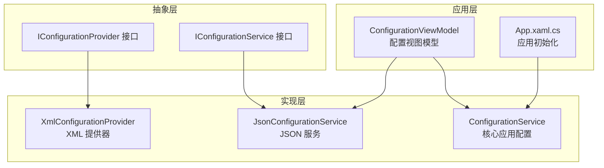
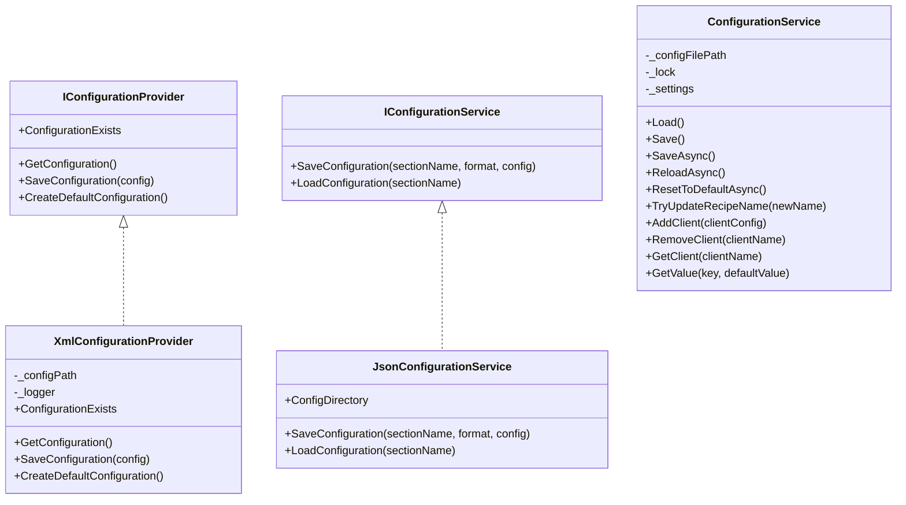
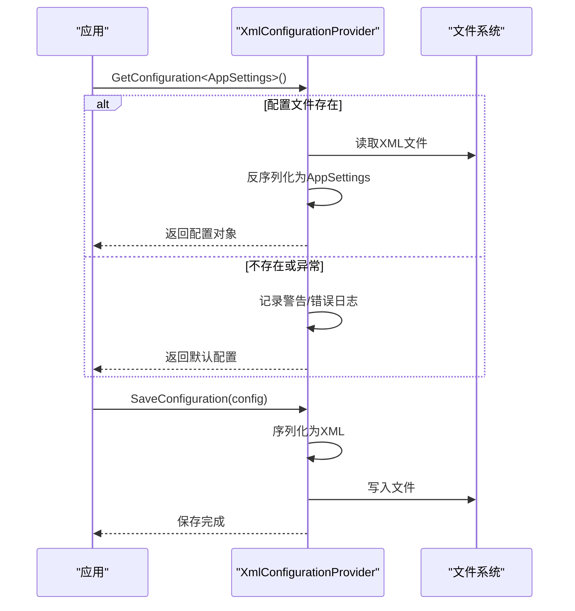
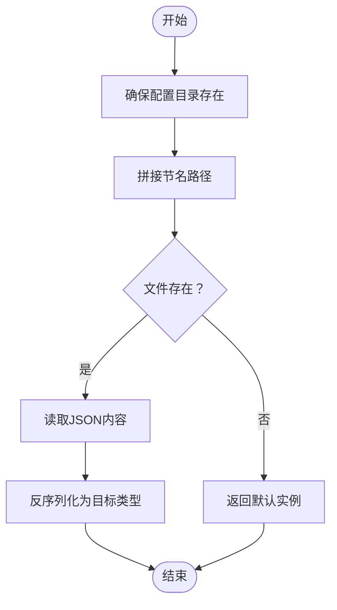
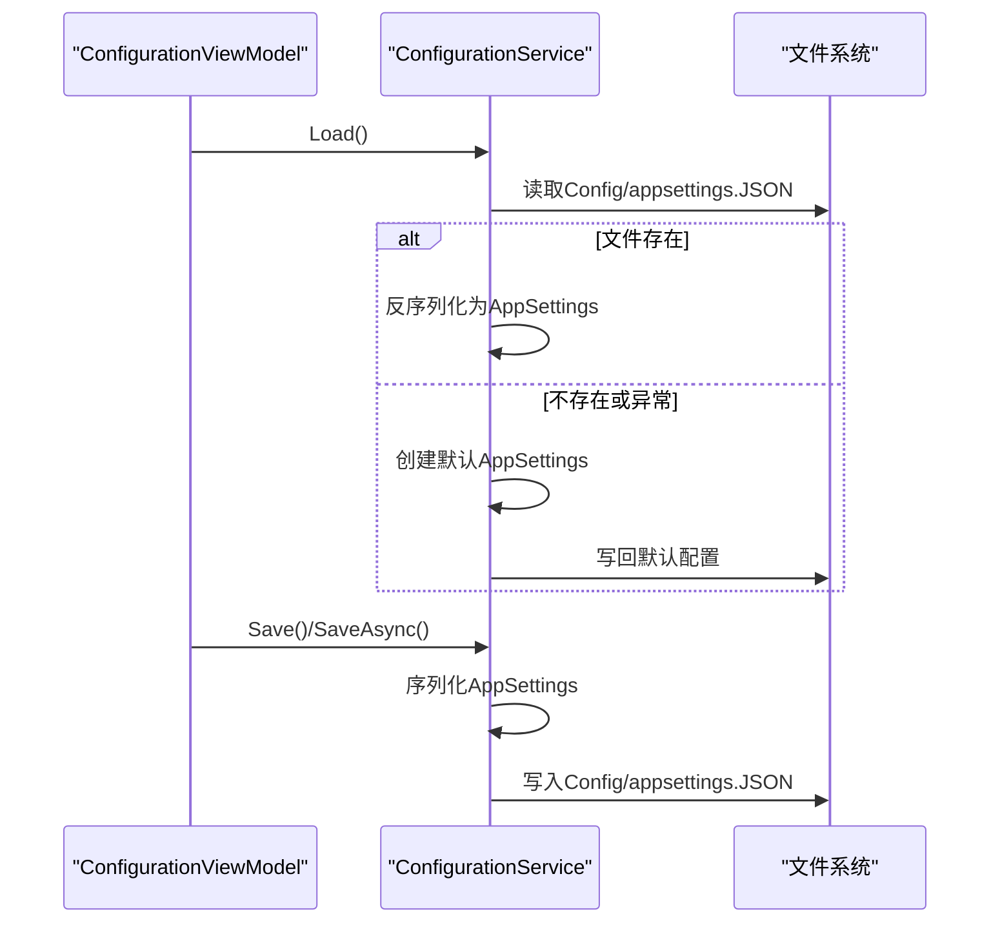
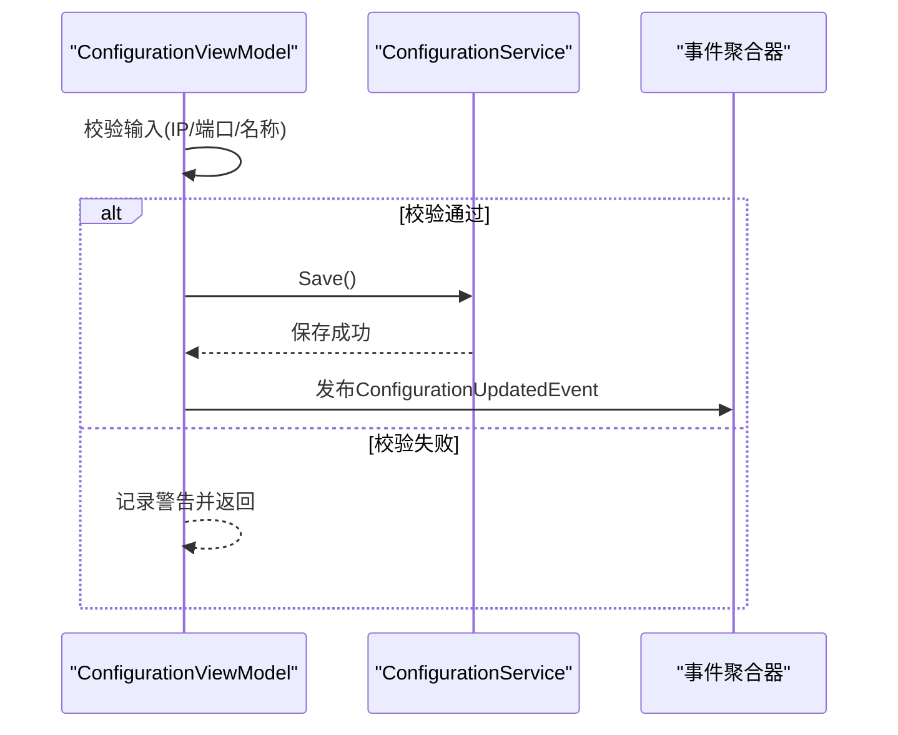
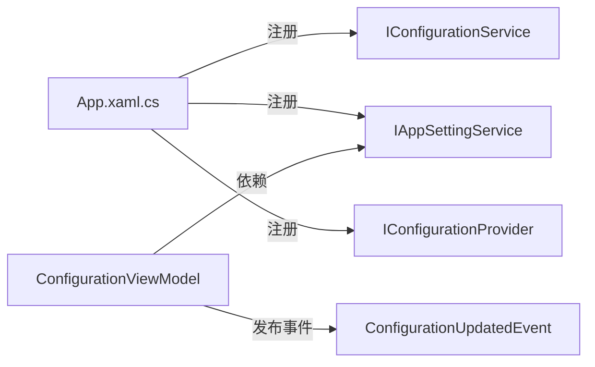

# 配置管理接口

<cite>
**本文引用的文件**
- [IConfigurationProvider.cs](file://Core/Abstraction/IConfigurationProvider.cs)
- [IConfigurationService.cs](file://Core/Abstraction/IConfigurationService.cs)
- [ConfigurationService.cs](file://Core/Services/ConfigurationService.cs)
- [XmlConfigurationProvider.cs](file://Core/XmlConfigurationProvider.cs)
- [JsonConfigurationService.cs](file://Core/Services/JsonConfigurationService.cs)
- [AppSettings.cs](file://Core/Configuration/AppSettings.cs)
- [ClientConfiguration.cs](file://Core/Models/ClientConfiguration.cs)
- [ConfigurationViewModel.cs](file://Framework/ViewModels/ConfigurationViewModel.cs)
- [ConfigurationView.xaml.cs](file://Framework/Views/ConfigurationView.xaml.cs)
- [App.xaml.cs](file://MainApp/App.xaml.cs)
- [EncryptService.cs](file://Core/Services/EncryptService.cs)
- [appsettings.json](file://Core/appsettings.json)
- [appsettings.json](file://MainApp/Properties/appsettings.json)
</cite>

## 目录
1. [简介](#简介)
2. [项目结构](#项目结构)
3. [核心组件](#核心组件)
4. [架构总览](#架构总览)
5. [详细组件分析](#详细组件分析)
6. [依赖关系分析](#依赖关系分析)
7. [性能考量](#性能考量)
8. [故障排查指南](#故障排查指南)
9. [结论](#结论)
10. [附录](#附录)

## 简介
本文件面向配置管理模块，围绕 IConfigurationProvider、IConfigurationService 等接口，系统梳理配置的读取、写入、监听、验证、序列化/反序列化、热更新、分层架构、默认值处理与安全优化等能力，并提供可操作的接口使用指导与最佳实践。

## 项目结构
配置管理涉及三层：
- 抽象层：定义 IConfigurationProvider、IConfigurationService 接口契约，统一配置提供与服务抽象。
- 实现层：提供 XML 与 JSON 两类配置提供器与服务实现，分别用于不同场景（如应用级全局配置、位置/参数等分段配置）。
- 应用层：通过视图模型与主应用初始化流程集成配置服务，提供 UI 编辑、保存与事件通知。

**图表来源**
- [IConfigurationProvider.cs:9-15](file://Core/Abstraction/IConfigurationProvider.cs#L9-L15)
- [IConfigurationService.cs:5-9](file://Core/Abstraction/IConfigurationService.cs#L5-L9)
- [XmlConfigurationProvider.cs:9-23](file://Core/XmlConfigurationProvider.cs#L9-L23)
- [JsonConfigurationService.cs:8-18](file://Core/Services/JsonConfigurationService.cs#L8-L18)
- [ConfigurationService.cs:15-50](file://Core/Services/ConfigurationService.cs#L15-L50)
- [ConfigurationViewModel.cs:13-42](file://Framework/ViewModels/ConfigurationViewModel.cs#L13-L42)
- [App.xaml.cs:110-133](file://MainApp/App.xaml.cs#L110-L133)

**章节来源**
- [IConfigurationProvider.cs:9-15](file://Core/Abstraction/IConfigurationProvider.cs#L9-L15)
- [IConfigurationService.cs:5-9](file://Core/Abstraction/IConfigurationService.cs#L5-L9)
- [XmlConfigurationProvider.cs:9-23](file://Core/XmlConfigurationProvider.cs#L9-L23)
- [JsonConfigurationService.cs:8-18](file://Core/Services/JsonConfigurationService.cs#L8-L18)
- [ConfigurationService.cs:15-50](file://Core/Services/ConfigurationService.cs#L15-L50)
- [ConfigurationViewModel.cs:13-42](file://Framework/ViewModels/ConfigurationViewModel.cs#L13-L42)
- [App.xaml.cs:110-133](file://MainApp/App.xaml.cs#L110-L133)

## 核心组件
- IConfigurationProvider：面向“提供器”的配置访问抽象，支持泛型读取、保存、存在性判断与默认配置创建。
- IConfigurationService：面向“服务”的配置访问抽象，按“分区/节”进行读写，适合模块化配置。
- XmlConfigurationProvider：基于 XML 的提供器实现，负责 AppSettings 的序列化/反序列化与默认配置创建。
- JsonConfigurationService：基于 JSON 的服务实现，按节名保存/加载对象配置，适合参数、位置等分段配置。
- ConfigurationService：核心应用配置服务，封装 AppSettings 的读写、异步加载/保存、客户端管理、扩展字段读取等。

**章节来源**
- [IConfigurationProvider.cs:9-15](file://Core/Abstraction/IConfigurationProvider.cs#L9-L15)
- [IConfigurationService.cs:5-9](file://Core/Abstraction/IConfigurationService.cs#L5-L9)
- [XmlConfigurationProvider.cs:9-23](file://Core/XmlConfigurationProvider.cs#L9-L23)
- [JsonConfigurationService.cs:8-18](file://Core/Services/JsonConfigurationService.cs#L8-L18)
- [ConfigurationService.cs:15-50](file://Core/Services/ConfigurationService.cs#L15-L50)

## 架构总览
配置系统采用“接口抽象 + 多实现 + 应用集成”的分层设计：
- 抽象层定义统一契约，隔离具体存储介质（XML/JSON）与业务域。
- 实现层针对不同场景提供专用提供器与服务，确保职责清晰。
- 应用层在启动时注册并解析配置服务，视图模型负责编辑与持久化，事件驱动配置变更传播。

**图表来源**
- [IConfigurationProvider.cs:9-15](file://Core/Abstraction/IConfigurationProvider.cs#L9-L15)
- [IConfigurationService.cs:5-9](file://Core/Abstraction/IConfigurationService.cs#L5-L9)
- [XmlConfigurationProvider.cs:9-23](file://Core/XmlConfigurationProvider.cs#L9-L23)
- [JsonConfigurationService.cs:8-18](file://Core/Services/JsonConfigurationService.cs#L8-L18)
- [ConfigurationService.cs:15-50](file://Core/Services/ConfigurationService.cs#L15-L50)

## 详细组件分析

### IConfigurationProvider 接口
- 设计理念：以“提供器”为核心，强调对单一配置实体的读写与默认创建能力，屏蔽底层存储细节。
- 方法定义与参数规格
  - GetConfiguration<T>：返回指定类型的配置实例，泛型约束要求非空构造函数。
  - SaveConfiguration<T>：保存配置对象，泛型约束要求为引用类型。
  - ConfigurationExists：布尔属性，指示配置文件是否存在。
  - CreateDefaultConfiguration：创建默认配置，用于首次运行或缺失配置时。
- 使用建议
  - 在应用启动阶段通过容器注册具体提供器，避免直接依赖具体实现。
  - 对于需要默认值兜底的场景，调用前先检查 ConfigurationExists，必要时调用 CreateDefaultConfiguration。

**章节来源**
- [IConfigurationProvider.cs:9-15](file://Core/Abstraction/IConfigurationProvider.cs#L9-L15)

### IConfigurationService 接口
- 设计理念：以“服务”为核心，面向“分区/节”的配置读写，适合模块化、分段配置管理。
- 方法定义与参数规格
  - SaveConfiguration(sectionName, format, config)：按节名保存配置；format 参数预留扩展（如 JSON/XML），当前实现中 JSON 服务内部使用。
  - LoadConfiguration<T>(sectionName)：按节名加载配置，若文件不存在或反序列化异常则返回默认实例。
- 使用建议
  - 节名应具备领域语义（如“Position”、“Vision”），避免跨域混用。
  - 对外部输入进行校验，防止非法节名导致路径拼接风险。

**章节来源**
- [IConfigurationService.cs:5-9](file://Core/Abstraction/IConfigurationService.cs#L5-L9)

### XmlConfigurationProvider（XML 提供器）
- 功能要点
  - 文件存在性检查与日志记录。
  - 基于 XML 的序列化/反序列化，支持 AppSettings 的完整结构与客户端列表。
  - 默认配置创建：包含服务器、客户端、配方名称等关键字段。
  - 向后兼容：支持旧版固定客户端字段迁移至动态客户端列表。
- 数据模型映射
  - AppSettings：包含配方名称、语言、主题、日志策略、服务器配置、客户端列表与扩展字段。
  - ClientConfiguration：包含客户端名称、模式、IP、端口、描述、启用状态。
- 错误处理
  - 加载/保存异常均记录日志并返回默认配置或抛出异常，保证健壮性。

**图表来源**
- [XmlConfigurationProvider.cs:25-58](file://Core/XmlConfigurationProvider.cs#L25-L58)
- [AppSettings.cs:10-36](file://Core/Configuration/AppSettings.cs#L10-L36)
- [ClientConfiguration.cs:4-21](file://Core/Models/ClientConfiguration.cs#L4-L21)

**章节来源**
- [XmlConfigurationProvider.cs:9-23](file://Core/XmlConfigurationProvider.cs#L9-L23)
- [XmlConfigurationProvider.cs:25-58](file://Core/XmlConfigurationProvider.cs#L25-L58)
- [XmlConfigurationProvider.cs:60-103](file://Core/XmlConfigurationProvider.cs#L60-L103)
- [XmlConfigurationProvider.cs:105-156](file://Core/XmlConfigurationProvider.cs#L105-L156)
- [XmlConfigurationProvider.cs:158-187](file://Core/XmlConfigurationProvider.cs#L158-L187)
- [XmlConfigurationProvider.cs:189-224](file://Core/XmlConfigurationProvider.cs#L189-L224)
- [AppSettings.cs:10-36](file://Core/Configuration/AppSettings.cs#L10-L36)
- [ClientConfiguration.cs:4-21](file://Core/Models/ClientConfiguration.cs#L4-L21)

### JsonConfigurationService（JSON 服务）
- 功能要点
  - 自动创建配置目录（Config/Position）。
  - 按节名保存/加载 JSON 文件，节名为文件名（带 .json 后缀）。
  - 异常包装为 InvalidOperationException，便于上层捕获与提示。
- 使用建议
  - 节名应唯一且符合文件命名规范。
  - 对于敏感信息，建议结合加密服务进行保护。

**图表来源**
- [JsonConfigurationService.cs:20-49](file://Core/Services/JsonConfigurationService.cs#L20-L49)

**章节来源**
- [JsonConfigurationService.cs:8-18](file://Core/Services/JsonConfigurationService.cs#L8-L18)
- [JsonConfigurationService.cs:20-49](file://Core/Services/JsonConfigurationService.cs#L20-L49)
- [JsonConfigurationService.cs:51-58](file://Core/Services/JsonConfigurationService.cs#L51-L58)

### ConfigurationService（核心应用配置）
- 功能要点
  - 负责 AppSettings 的读取、保存、异步加载/保存、重置为默认、配方名称更新、客户端增删查与扩展字段读取。
  - 文件路径位于应用基目录下的 Config/appsettings.JSON。
  - 使用锁保证并发安全，异常时回退到默认配置。
- 关键方法
  - Load/Save/SaveAsync/ReloadAsync/ResetToDefaultAsync：同步与异步生命周期管理。
  - TryUpdateRecipeName：安全更新配方名称，包含空值检查与异常捕获。
  - AddClient/RemoveClient/GetClient：客户端集合管理。
  - GetValue：从扩展字段读取键值，支持默认值。
- 默认值处理
  - AppSettings 中为各字段提供合理默认值；当 JSON 缺失字段时由反序列化填充默认值。
  - 扩展字段通过 JsonExtensionData 捕获，GetValue 提供兜底读取。

**图表来源**
- [ConfigurationService.cs:72-93](file://Core/Services/ConfigurationService.cs#L72-L93)
- [ConfigurationService.cs:153-175](file://Core/Services/ConfigurationService.cs#L153-L175)
- [ConfigurationService.cs:183-203](file://Core/Services/ConfigurationService.cs#L183-L203)

**章节来源**
- [ConfigurationService.cs:15-50](file://Core/Services/ConfigurationService.cs#L15-L50)
- [ConfigurationService.cs:72-93](file://Core/Services/ConfigurationService.cs#L72-L93)
- [ConfigurationService.cs:153-175](file://Core/Services/ConfigurationService.cs#L153-L175)
- [ConfigurationService.cs:183-203](file://Core/Services/ConfigurationService.cs#L183-L203)
- [ConfigurationService.cs:204-217](file://Core/Services/ConfigurationService.cs#L204-L217)

### 配置验证与监听
- 验证机制
  - 视图模型在保存前对服务器 IP 与端口进行格式与范围校验，不符合规则则记录警告并中止保存。
  - 客户端新增时校验名称唯一性与 IP/端口有效性。
- 监听与热更新
  - 主应用使用 Microsoft.Extensions.Configuration 的配置构建器，启用 reloadOnChange，实现 JSON 配置文件的自动重载。
  - 配置更新事件通过事件聚合器发布，订阅方可响应配置变更。

**图表来源**
- [ConfigurationViewModel.cs:194-257](file://Framework/ViewModels/ConfigurationViewModel.cs#L194-L257)
- [App.xaml.cs:90-98](file://MainApp/App.xaml.cs#L90-L98)
- [App.xaml.cs:96-108](file://MainApp/App.xaml.cs#L96-L108)

**章节来源**
- [ConfigurationViewModel.cs:194-257](file://Framework/ViewModels/ConfigurationViewModel.cs#L194-L257)
- [App.xaml.cs:90-98](file://MainApp/App.xaml.cs#L90-L98)
- [App.xaml.cs:96-108](file://MainApp/App.xaml.cs#L96-L108)

### 分层架构与默认值处理
- 分层架构
  - 抽象层：IConfigurationProvider、IConfigurationService 定义契约。
  - 实现层：XmlConfigurationProvider、JsonConfigurationService、ConfigurationService 提供具体实现。
  - 应用层：App.xaml.cs 注册服务，ConfigurationViewModel 负责 UI 编辑与保存。
- 默认值处理
  - AppSettings 字段提供默认值；JsonExtensionData 捕获未知字段，GetValue 提供兜底。
  - XmlConfigurationProvider 在文件缺失或异常时创建默认配置并保存。

**章节来源**
- [AppSettings.cs:10-36](file://Core/Configuration/AppSettings.cs#L10-L36)
- [XmlConfigurationProvider.cs:60-103](file://Core/XmlConfigurationProvider.cs#L60-L103)
- [ConfigurationService.cs:177-181](file://Core/Services/ConfigurationService.cs#L177-L181)

### 序列化与反序列化
- XML
  - 通过 LINQ to XML 进行序列化/反序列化，支持 AppSettings 与客户端列表的完整映射。
  - 支持旧版固定客户端字段迁移，向后兼容。
- JSON
  - 使用 System.Text.Json（ConfigurationService）与 Newtonsoft.Json（JsonConfigurationService）分别处理不同场景。
  - ConfigurationService 支持扩展字段读取；JsonConfigurationService 以节名作为文件名，便于模块化管理。

**章节来源**
- [XmlConfigurationProvider.cs:105-156](file://Core/XmlConfigurationProvider.cs#L105-L156)
- [XmlConfigurationProvider.cs:189-224](file://Core/XmlConfigurationProvider.cs#L189-L224)
- [ConfigurationService.cs:189-196](file://Core/Services/ConfigurationService.cs#L189-L196)
- [JsonConfigurationService.cs:20-49](file://Core/Services/JsonConfigurationService.cs#L20-L49)

### 安全性考虑
- 敏感信息保护
  - 使用 EncryptService 提供哈希与对称加解密能力，建议对密码、密钥等敏感字段进行加密存储。
  - 建议将密钥管理与环境变量/机密存储集成，避免硬编码。
- 访问控制
  - 配置文件路径与权限需限制，避免被非授权用户修改。
  - 对外部输入（如节名、IP、端口）进行严格校验，防止路径遍历与注入。

**章节来源**
- [EncryptService.cs:7-156](file://Core/Services/EncryptService.cs#L7-L156)

## 依赖关系分析
- 容器注册
  - App.xaml.cs 注册 IConfigurationService 为 JsonConfigurationService，IAppSettingService 为 ConfigurationService，IConfigurationProvider 为 XmlConfigurationProvider。
- 组件耦合
  - 视图模型依赖 IAppSettingService 与事件聚合器，降低对具体实现的耦合。
  - ConfigurationService 依赖 AppSettings 与 ClientConfiguration 数据模型。

**图表来源**
- [App.xaml.cs:121-133](file://MainApp/App.xaml.cs#L121-L133)
- [App.xaml.cs:141-161](file://MainApp/App.xaml.cs#L141-L161)
- [ConfigurationViewModel.cs:13-42](file://Framework/ViewModels/ConfigurationViewModel.cs#L13-L42)

**章节来源**
- [App.xaml.cs:121-133](file://MainApp/App.xaml.cs#L121-L133)
- [App.xaml.cs:141-161](file://MainApp/App.xaml.cs#L141-L161)
- [ConfigurationViewModel.cs:13-42](file://Framework/ViewModels/ConfigurationViewModel.cs#L13-L42)

## 性能考量
- I/O 与并发
  - ConfigurationService 使用锁保护文件读写，避免并发冲突；建议在高频写入场景下合并变更批次，减少频繁落盘。
- 异步化
  - 提供 SaveAsync/ReloadAsync/ResetToDefaultAsync，避免阻塞 UI 线程。
- 序列化开销
  - JSON 序列化选项包含缩进与大小写不敏感，兼顾可读性与兼容性；对于超大配置，可考虑二进制序列化或分片存储。
- 监听与热更新
  - 使用配置构建器的 reloadOnChange，注意文件系统事件风暴时的抖动与重载频率控制。

[本节为通用性能建议，无需特定文件引用]

## 故障排查指南
- 配置文件缺失或损坏
  - 现象：加载失败并回退默认配置。
  - 处理：检查文件路径与权限；确认 XmlConfigurationProvider/ConfigurationService 是否正确创建默认配置。
- 保存失败
  - 现象：保存异常被包装为 InvalidOperationException。
  - 处理：查看日志定位具体异常；确认磁盘空间与文件锁定状态。
- 输入校验失败
  - 现象：保存/新增客户端被拒绝并记录警告。
  - 处理：修正 IP 地址格式、端口范围与客户端名称唯一性。
- 热更新未生效
  - 现象：修改 JSON 后未触发重载。
  - 处理：确认 reloadOnChange 配置与文件写入方式（原子替换更稳妥）。

**章节来源**
- [XmlConfigurationProvider.cs:27-42](file://Core/XmlConfigurationProvider.cs#L27-L42)
- [ConfigurationService.cs:169-174](file://Core/Services/ConfigurationService.cs#L169-L174)
- [JsonConfigurationService.cs:23-31](file://Core/Services/JsonConfigurationService.cs#L23-L31)
- [ConfigurationViewModel.cs:200-212](file://Framework/ViewModels/ConfigurationViewModel.cs#L200-L212)

## 结论
配置管理模块通过抽象接口与多实现分离了存储介质与业务域，配合应用层的注册与视图模型编辑，形成了可扩展、可维护、可验证的配置体系。建议在生产环境中强化安全与性能措施（加密、异步批处理、缓存与事件去抖），并完善监控与告警，确保配置变更的可控与可观测。

## 附录

### 接口使用清单
- 读取应用配置
  - 通过 IAppSettingService 获取 AppSettings 并读取字段或扩展字段。
  - 示例路径：[ConfigurationService.cs:39-50](file://Core/Services/ConfigurationService.cs#L39-L50), [ConfigurationService.cs:204-217](file://Core/Services/ConfigurationService.cs#L204-L217)
- 保存应用配置
  - 调用 IAppSettingService.Save()/SaveAsync()，或使用 IConfigurationProvider.SaveConfiguration<T>()。
  - 示例路径：[ConfigurationService.cs:78-81](file://Core/Services/ConfigurationService.cs#L78-L81), [XmlConfigurationProvider.cs:45-57](file://Core/XmlConfigurationProvider.cs#L45-L57)
- 读取/保存模块化配置
  - 使用 IConfigurationService.SaveConfiguration()/LoadConfiguration<T>()，节名即文件名。
  - 示例路径：[JsonConfigurationService.cs:20-49](file://Core/Services/JsonConfigurationService.cs#L20-L49)
- 创建默认配置
  - 使用 IConfigurationProvider.CreateDefaultConfiguration() 或 ConfigurationService.ResetToDefaultAsync()。
  - 示例路径：[XmlConfigurationProvider.cs:60-103](file://Core/XmlConfigurationProvider.cs#L60-L103), [ConfigurationService.cs:96-103](file://Core/Services/ConfigurationService.cs#L96-L103)

### 配置文件与默认值参考
- 核心应用配置（JSON）
  - 默认路径：Config/appsettings.JSON
  - 默认值：配方名称、语言、主题、日志策略、服务器与客户端配置等。
  - 示例路径：[ConfigurationService.cs:52-69](file://Core/Services/ConfigurationService.cs#L52-L69), [AppSettings.cs:10-36](file://Core/Configuration/AppSettings.cs#L10-L36)
- 外部配置（Core/appsettings.json）
  - 示例键：AppSettings.*、ConnectionStrings.*。
  - 示例路径：[appsettings.json:1-13](file://Core/appsettings.json#L1-L13)
- 外部配置（MainApp/Properties/appsettings.json）
  - 示例键：ConnectionStrings.*。
  - 示例路径：[appsettings.json:1-6](file://MainApp/Properties/appsettings.json#L1-L6)