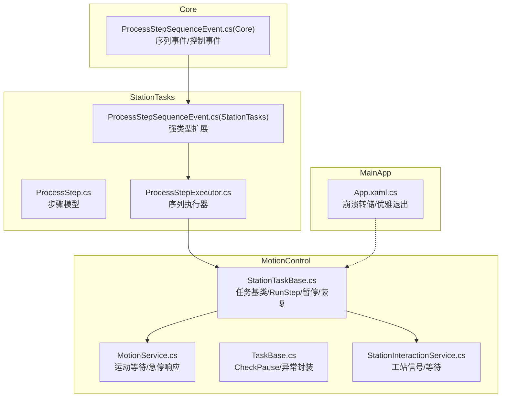
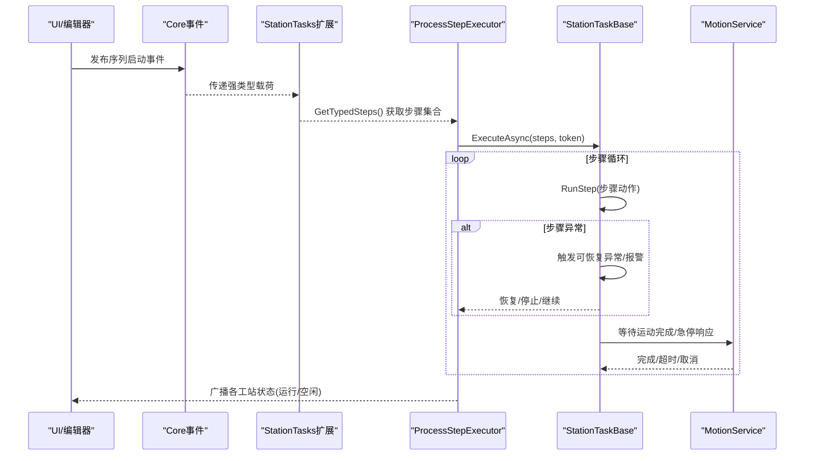
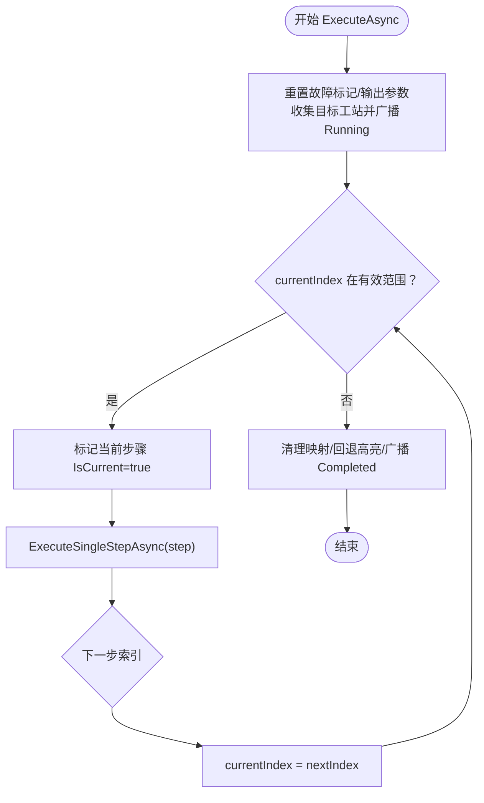
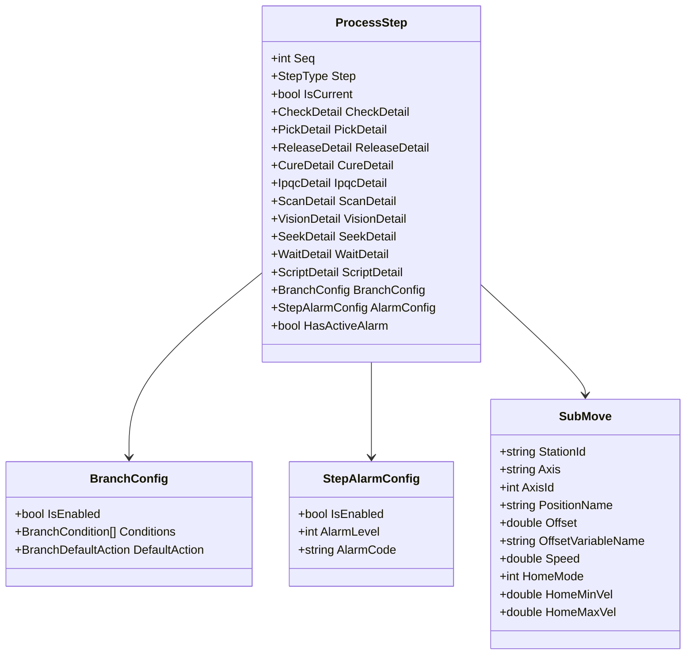
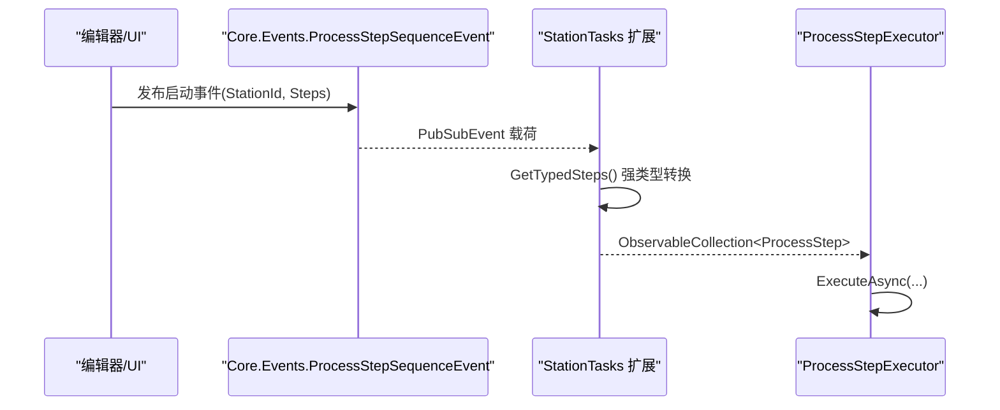
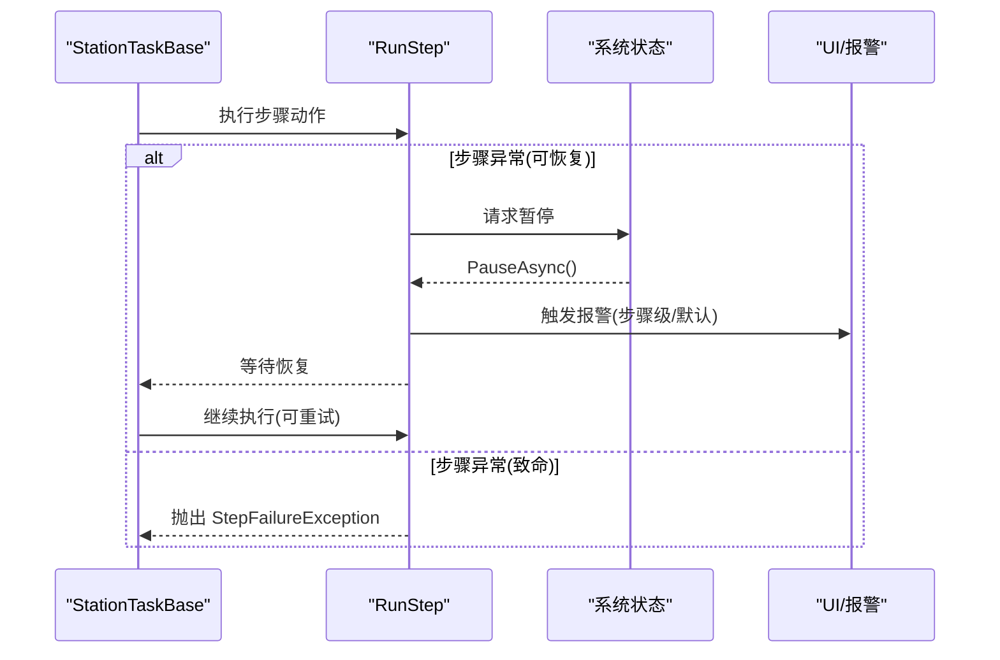
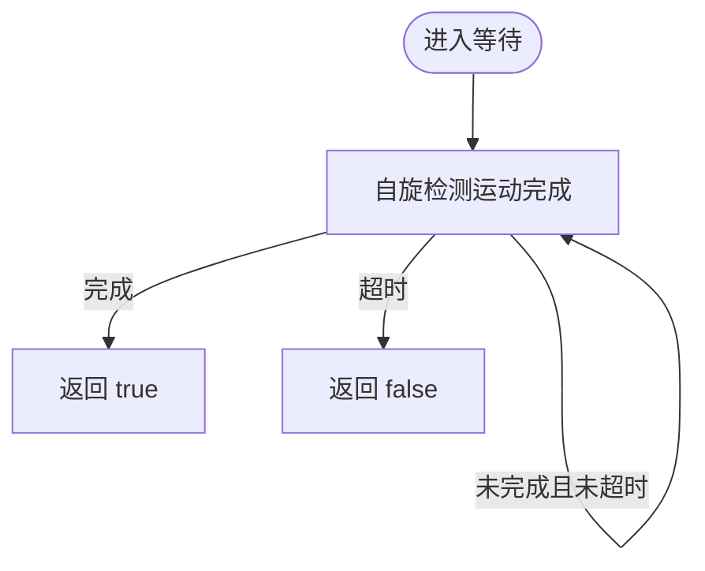
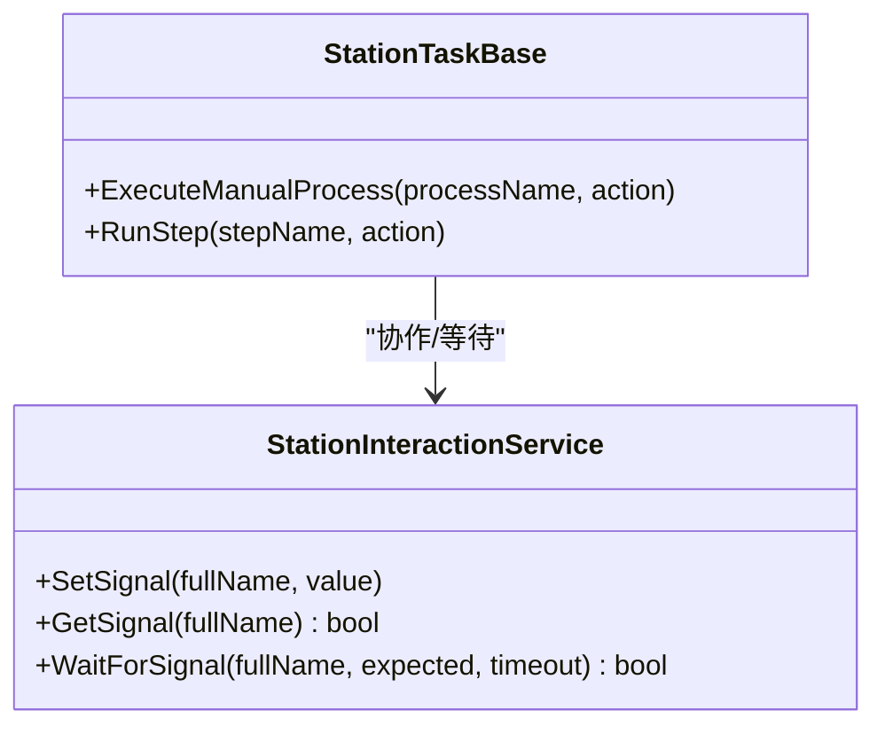
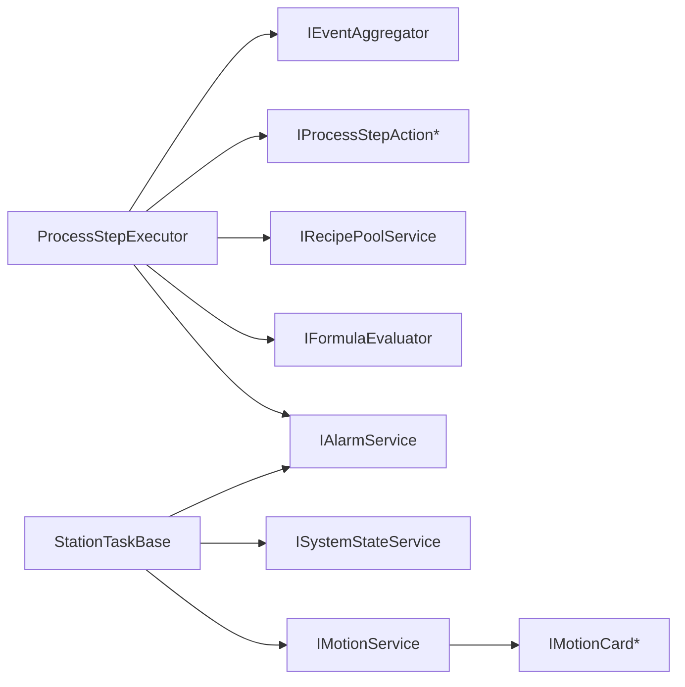

# 任务调度系统

<cite>
**本文引用的文件**
- [ProcessStepExecutor.cs](file://StationTasks/Actions/ProcessStepExecutor.cs)
- [ProcessStep.cs](file://StationTasks/Models/ProcessStep.cs)
- [ProcessStepSequenceEvent.cs（Core）](file://Core/Events/ProcessStepSequenceEvent.cs)
- [ProcessStepSequenceEvent.cs（StationTasks 扩展）](file://StationTasks/Events/ProcessStepSequenceEvent.cs)
- [StationTaskBase.cs](file://MotionControl/Services/StationTaskBase.cs)
- [TaskBase.cs](file://MotionControl/Services/TaskBase.cs)
- [MotionService.cs](file://MotionControl/Services/MotionService.cs)
- [StationInteractionService.cs](file://StationTasks/Services/StationInteractionService.cs)
- [SeekStepAction.cs](file://StationTasks/Actions/SeekStepAction.cs)
- [App.xaml.cs](file://MainApp/App.xaml.cs)
</cite>

## 目录
1. [简介](#简介)
2. [项目结构](#项目结构)
3. [核心组件](#核心组件)
4. [架构总览](#架构总览)
5. [详细组件分析](#详细组件分析)
6. [依赖关系分析](#依赖关系分析)
7. [性能考虑](#性能考虑)
8. [故障排查指南](#故障排查指南)
9. [结论](#结论)
10. [附录](#附录)

## 简介
本文件面向任务调度系统，聚焦“进程序列服务”的设计与实现，涵盖步骤队列管理、条件分支与跳转、并发控制与安全保护、异步执行与超时处理、错误恢复与报警联动、以及事件驱动的状态传播机制。同时给出性能优化、内存管理与资源清理建议，帮助读者在理解系统架构的同时，掌握关键实现细节与最佳实践。

## 项目结构
任务调度相关的核心代码分布在以下模块：
- StationTasks：步骤模型、执行器、动作扩展与事件扩展
- MotionControl：任务基类、运动服务、系统状态与暂停/恢复机制
- Core：跨模块事件契约（序列启动/控制）
- MainApp：应用生命周期与崩溃转储

**图示来源**
- [ProcessStep.cs](file://StationTasks/Models/ProcessStep.cs)
- [ProcessStepExecutor.cs](file://StationTasks/Actions/ProcessStepExecutor.cs)
- [ProcessStepSequenceEvent.cs（Core）](file://Core/Events/ProcessStepSequenceEvent.cs)
- [ProcessStepSequenceEvent.cs（StationTasks 扩展）](file://StationTasks/Events/ProcessStepSequenceEvent.cs)
- [StationTaskBase.cs](file://MotionControl/Services/StationTaskBase.cs)
- [MotionService.cs](file://MotionControl/Services/MotionService.cs)
- [StationInteractionService.cs](file://StationTasks/Services/StationInteractionService.cs)
- [App.xaml.cs](file://MainApp/App.xaml.cs)

**章节来源**
- [ProcessStepExecutor.cs](file://StationTasks/Actions/ProcessStepExecutor.cs)
- [ProcessStep.cs](file://StationTasks/Models/ProcessStep.cs)
- [ProcessStepSequenceEvent.cs（Core）](file://Core/Events/ProcessStepSequenceEvent.cs)
- [ProcessStepSequenceEvent.cs（StationTasks 扩展）](file://StationTasks/Events/ProcessStepSequenceEvent.cs)
- [StationTaskBase.cs](file://MotionControl/Services/StationTaskBase.cs)
- [MotionService.cs](file://MotionControl/Services/MotionService.cs)
- [StationInteractionService.cs](file://StationTasks/Services/StationInteractionService.cs)
- [App.xaml.cs](file://MainApp/App.xaml.cs)

## 核心组件
- 进程序列执行器：负责按序执行步骤、条件分支与跳转、CHECK 重试、跨工站状态广播、异常与报警联动。
- 步骤模型：统一承载步骤类型、参数配置、分支与报警配置，并提供 UI 绑定属性。
- 事件系统：序列启动/控制事件，配合强类型扩展，实现跨模块解耦。
- 任务基类与运行保护：RunStep 提供暂停/急停/单步/可恢复异常保护；暂停/恢复采用纯异步等待。
- 运动服务：提供运动完成等待与急停秒响应的高性能等待循环。
- 并发与信号：工站间信号与等待，保障跨站协作一致性。

**章节来源**
- [ProcessStepExecutor.cs](file://StationTasks/Actions/ProcessStepExecutor.cs)
- [ProcessStep.cs](file://StationTasks/Models/ProcessStep.cs)
- [ProcessStepSequenceEvent.cs（Core）](file://Core/Events/ProcessStepSequenceEvent.cs)
- [ProcessStepSequenceEvent.cs（StationTasks 扩展）](file://StationTasks/Events/ProcessStepSequenceEvent.cs)
- [StationTaskBase.cs](file://MotionControl/Services/StationTaskBase.cs)
- [MotionService.cs](file://MotionControl/Services/MotionService.cs)
- [StationInteractionService.cs](file://StationTasks/Services/StationInteractionService.cs)

## 架构总览
系统采用“事件驱动 + 执行器 + 任务基类”的分层架构：
- 事件层：Core 定义序列启动/控制事件，StationTasks 提供强类型扩展。
- 执行层：ProcessStepExecutor 负责序列执行、条件分支、跳转、重试与报警联动。
- 任务层：StationTaskBase 提供 RunStep 安全保护、暂停/恢复、异常恢复与报警触发。
- 服务层：MotionService 提供运动等待与急停响应；StationInteractionService 提供工站间信号与等待。
- 模型层：ProcessStep 统一步骤参数、分支与报警配置。

**图示来源**
- [ProcessStepSequenceEvent.cs（Core）](file://Core/Events/ProcessStepSequenceEvent.cs)
- [ProcessStepSequenceEvent.cs（StationTasks 扩展）](file://StationTasks/Events/ProcessStepSequenceEvent.cs)
- [ProcessStepExecutor.cs](file://StationTasks/Actions/ProcessStepExecutor.cs)
- [StationTaskBase.cs](file://MotionControl/Services/StationTaskBase.cs)
- [MotionService.cs](file://MotionControl/Services/MotionService.cs)

## 详细组件分析

### 进程序列执行器（ProcessStepExecutor）
职责与特性：
- 步骤队列管理：维护当前步骤标记、构建步骤标签→对象映射、跨工站状态广播。
- 条件分支与跳转：收集上下文变量（全局变量+输出参数）、评估表达式、解析目标索引、安全校验无效跳转。
- CHECK 步骤：支持重试次数、失败动作（重试/停止/跳转）、最大重试超限动作（报警/停止/继续）。
- 异步执行与取消：每步执行前检查取消令牌；异常捕获与报警联动；最终清理与回退。
- 跨工站协作：收集目标工站并广播运行/完成状态，确保 UI 与外部系统同步。

**图示来源**
- [ProcessStepExecutor.cs](file://StationTasks/Actions/ProcessStepExecutor.cs)

**章节来源**
- [ProcessStepExecutor.cs](file://StationTasks/Actions/ProcessStepExecutor.cs)

### 步骤模型（ProcessStep）
数据结构与设计要点：
- 步骤类型：统一枚举覆盖移动、视觉、检测、装配、点胶、固化、寻针、等待、脚本、看板、分支等。
- 参数配置：PickDetail、ReleaseDetail、CureDetail、IpqcDetail、ScanDetail、VisionDetail、SeekDetail、WaitDetail、ScriptDetail 等，均继承绑定基类，支持 UI 绑定与变更通知。
- 分支配置：BranchConfig 支持条件表达式、默认动作与目标步骤，实现通用流程控制。
- 报警配置：StepAlarmConfig 支持步骤级报警开关与级别，HasActiveAlarm 用于 UI 高亮。
- 子移动（SubMove）：描述跨工站子步骤的站点、轴、位置、偏移、速度与回零参数。

**图示来源**
- [ProcessStep.cs](file://StationTasks/Models/ProcessStep.cs)

**章节来源**
- [ProcessStep.cs](file://StationTasks/Models/ProcessStep.cs)

### 事件系统（发布/订阅）
- 序列启动事件：Core 定义事件与载荷，包含目标工站与步骤集合（object 类型）。
- 强类型扩展：StationTasks 提供扩展方法将 object 转为 ObservableCollection<ProcessStep>，避免跨项目类型依赖。
- 序列控制事件：支持暂停/恢复/停止，便于 UI 或外部系统干预执行。

**图示来源**
- [ProcessStepSequenceEvent.cs（Core）](file://Core/Events/ProcessStepSequenceEvent.cs)
- [ProcessStepSequenceEvent.cs（StationTasks 扩展）](file://StationTasks/Events/ProcessStepSequenceEvent.cs)
- [ProcessStepExecutor.cs](file://StationTasks/Actions/ProcessStepExecutor.cs)

**章节来源**
- [ProcessStepSequenceEvent.cs（Core）](file://Core/Events/ProcessStepSequenceEvent.cs)
- [ProcessStepSequenceEvent.cs（StationTasks 扩展）](file://StationTasks/Events/ProcessStepSequenceEvent.cs)

### 执行引擎与安全保护（StationTaskBase + TaskBase）
- RunStep 安全保护：提供暂停/急停/单步/可恢复异常保护；步骤异常时触发报警并请求暂停，等待操作员确认后恢复。
- 暂停/恢复：CheckPause 使用纯异步等待，永不阻塞线程；Resume 唤醒等待。
- 异常封装：StepFailureException 记录步骤名称与原始异常，便于诊断。

**图示来源**
- [StationTaskBase.cs](file://MotionControl/Services/StationTaskBase.cs)
- [TaskBase.cs](file://MotionControl/Services/TaskBase.cs)

**章节来源**
- [StationTaskBase.cs](file://MotionControl/Services/StationTaskBase.cs)
- [TaskBase.cs](file://MotionControl/Services/TaskBase.cs)

### 运动等待与超时处理（MotionService）
- 等待完成：WaitForCoordMotionCompletionAsync 使用自旋等待，结合急停令牌与运动卡状态检测，实现低 CPU、无抖动、秒级响应。
- 实时性：通过 Windows 多媒体定时器 API 提升系统定时器精度，改善等待循环响应性。

**图示来源**
- [MotionService.cs](file://MotionControl/Services/MotionService.cs)

**章节来源**
- [MotionService.cs](file://MotionControl/Services/MotionService.cs)

### 并发控制与跨站协作
- 工站信号：StationInteractionService 使用并发字典与 AutoResetEvent 实现信号设置/等待，支持超时。
- 手动流程：StationTaskBase 提供手动流程执行入口，使用信号量确保互斥，广播状态变化。

**图示来源**
- [StationInteractionService.cs](file://StationTasks/Services/StationInteractionService.cs)
- [StationTaskBase.cs](file://MotionControl/Services/StationTaskBase.cs)

**章节来源**
- [StationInteractionService.cs](file://StationTasks/Services/StationInteractionService.cs)
- [StationTaskBase.cs](file://MotionControl/Services/StationTaskBase.cs)

### 错误恢复与报警联动
- 步骤级报警：ProcessStepExecutor 订阅步骤报警事件，立即在 UI 层高亮对应步骤。
- 任务级报警：RunStep 根据步骤报警配置或默认策略触发报警，建议操作与等级可配置。
- 可恢复异常：异常被捕获后请求暂停，等待操作员确认，支持恢复继续执行。

**章节来源**
- [ProcessStepExecutor.cs](file://StationTasks/Actions/ProcessStepExecutor.cs)
- [StationTaskBase.cs](file://MotionControl/Services/StationTaskBase.cs)

### 示例：SEEK 步骤动作
- 遍历通道行读取力值，判定范围，写入全局变量，超限时触发报警。
- 与分支/输出参数联动，支持条件表达式引用 @Output: 前缀变量。

**章节来源**
- [SeekStepAction.cs](file://StationTasks/Actions/SeekStepAction.cs)

## 依赖关系分析
- 执行器依赖：事件聚合器、动作映射、配方池、公式求值器、报警服务。
- 任务基类依赖：系统状态、报警服务、事件发布、暂停/恢复机制。
- 运动服务依赖：运动卡接口与坐标映射，提供高实时等待。
- 工站交互服务：并发容器与事件，支撑跨站信号与等待。

**图示来源**
- [ProcessStepExecutor.cs](file://StationTasks/Actions/ProcessStepExecutor.cs)
- [StationTaskBase.cs](file://MotionControl/Services/StationTaskBase.cs)
- [MotionService.cs](file://MotionControl/Services/MotionService.cs)

**章节来源**
- [ProcessStepExecutor.cs](file://StationTasks/Actions/ProcessStepExecutor.cs)
- [StationTaskBase.cs](file://MotionControl/Services/StationTaskBase.cs)
- [MotionService.cs](file://MotionControl/Services/MotionService.cs)

## 性能考虑
- 异步等待与自旋：运动等待采用自旋+急停响应，避免线程阻塞，降低抖动；建议合理设置超时与日志级别，避免高频日志影响性能。
- 纯异步暂停：CheckPause 使用 WhenAny 与 Task.Delay，永不阻塞线程，提高响应性。
- 事件与映射：步骤标签→对象映射仅在执行期间构建与清理，避免长期持有导致内存压力。
- 全局变量与表达式：分支条件评估使用公式求值器，建议表达式简洁、变量缓存，减少重复加载。
- 跨站广播：仅在执行开始/结束广播状态，避免频繁事件风暴。
- 应用级稳定性：MainApp 提供崩溃转储与优雅退出，便于问题定位与资源回收。

**章节来源**
- [MotionService.cs](file://MotionControl/Services/MotionService.cs)
- [TaskBase.cs](file://MotionControl/Services/TaskBase.cs)
- [ProcessStepExecutor.cs](file://StationTasks/Actions/ProcessStepExecutor.cs)
- [App.xaml.cs](file://MainApp/App.xaml.cs)

## 故障排查指南
- 步骤异常高亮：若 UI 行背景变红，检查对应步骤的报警配置与最近一次异常；确认是否为可恢复异常并已请求暂停。
- 分支跳转无效：检查条件表达式与目标 Seq；无效目标将触发报警并终止序列，防止设备碰撞。
- CHECK 步骤反复重试：核对检查项阈值与最大重试次数；必要时调整 OnMaxExceeded 动作。
- 跨站执行卡滞：确认目标工站状态广播是否正常；检查 StationInteractionService 的信号等待与超时设置。
- 运动等待超时：检查运动卡状态与急停信号；适当增大超时或优化路径规划。
- 应用崩溃：查看崩溃转储目录与退出日志，关注内存与线程状态。

**章节来源**
- [ProcessStepExecutor.cs](file://StationTasks/Actions/ProcessStepExecutor.cs)
- [StationTaskBase.cs](file://MotionControl/Services/StationTaskBase.cs)
- [MotionService.cs](file://MotionControl/Services/MotionService.cs)
- [App.xaml.cs](file://MainApp/App.xaml.cs)

## 结论
本系统通过事件驱动与执行器分离、任务基类的安全保护、运动服务的高实时等待、以及跨站信号协作，实现了稳定可靠的进程序列调度。步骤模型统一了参数与配置，分支与报警机制提供了灵活的流程控制与可观测性。遵循本文的性能与故障排查建议，可在复杂工况下保持高效、安全与可维护性。

## 附录
- 关键实现路径参考
  - [执行器主流程](file://StationTasks/Actions/ProcessStepExecutor.cs)
  - [步骤模型定义](file://StationTasks/Models/ProcessStep.cs)
  - [序列事件契约](file://Core/Events/ProcessStepSequenceEvent.cs)
  - [序列事件强类型扩展](file://StationTasks/Events/ProcessStepSequenceEvent.cs)
  - [任务基类与暂停/恢复](file://MotionControl/Services/StationTaskBase.cs)
  - [运动等待与急停响应](file://MotionControl/Services/MotionService.cs)
  - [工站信号与等待](file://StationTasks/Services/StationInteractionService.cs)
  - [应用崩溃转储与优雅退出](file://MainApp/App.xaml.cs)