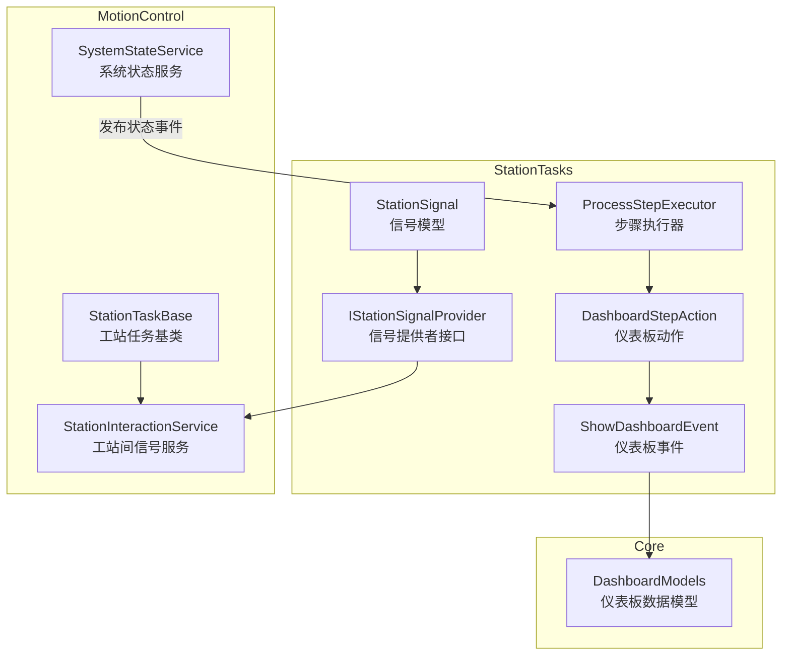
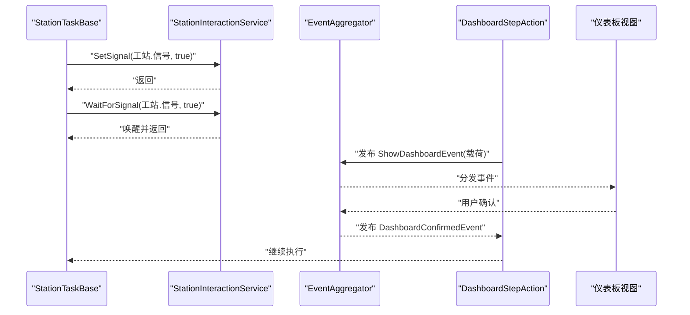
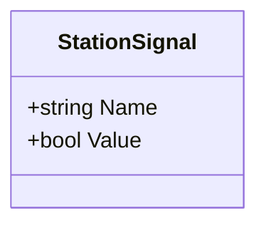
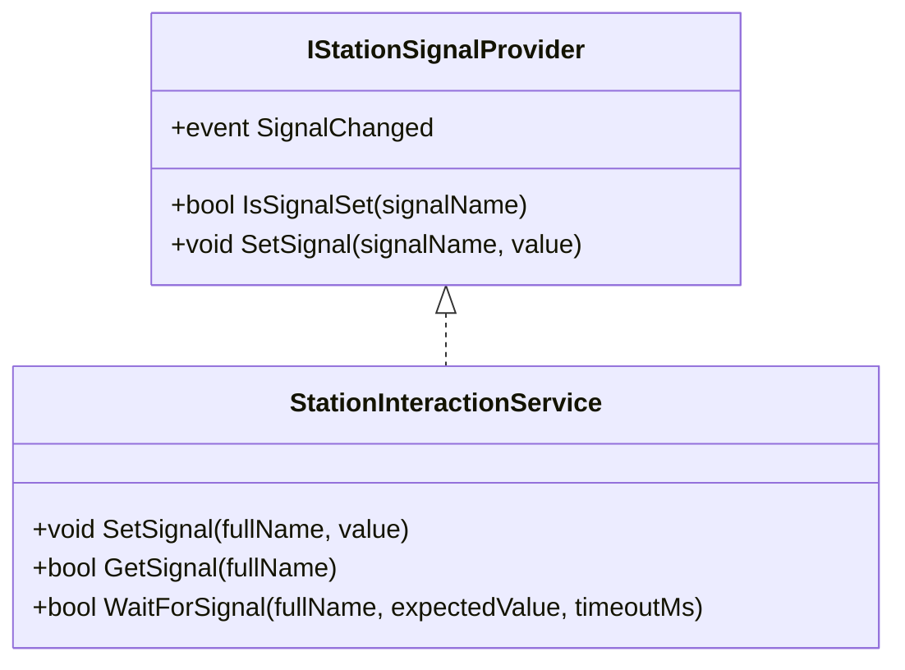
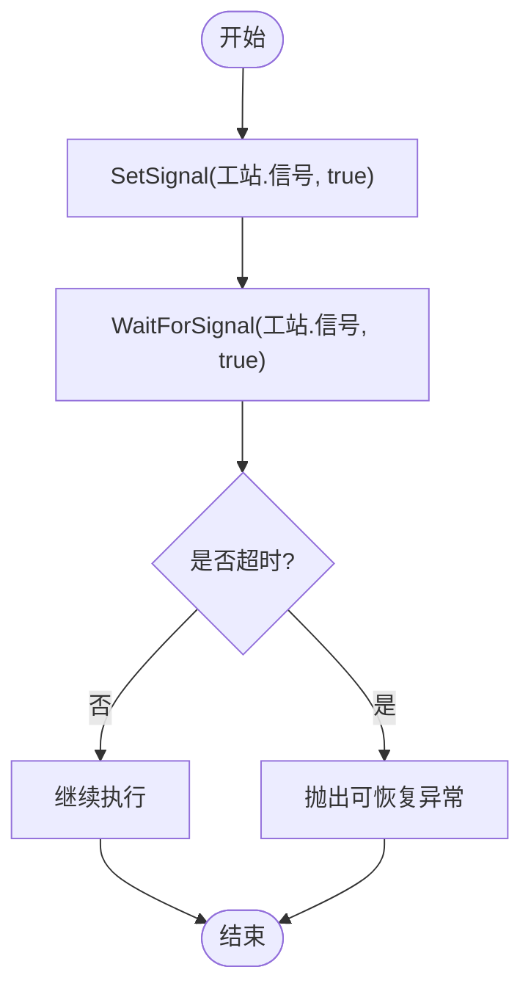
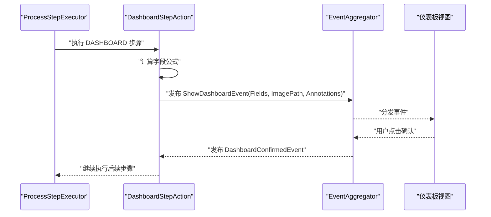
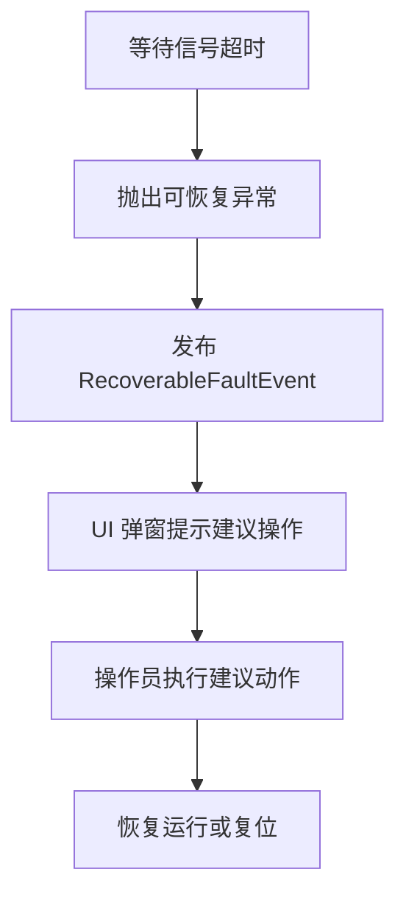
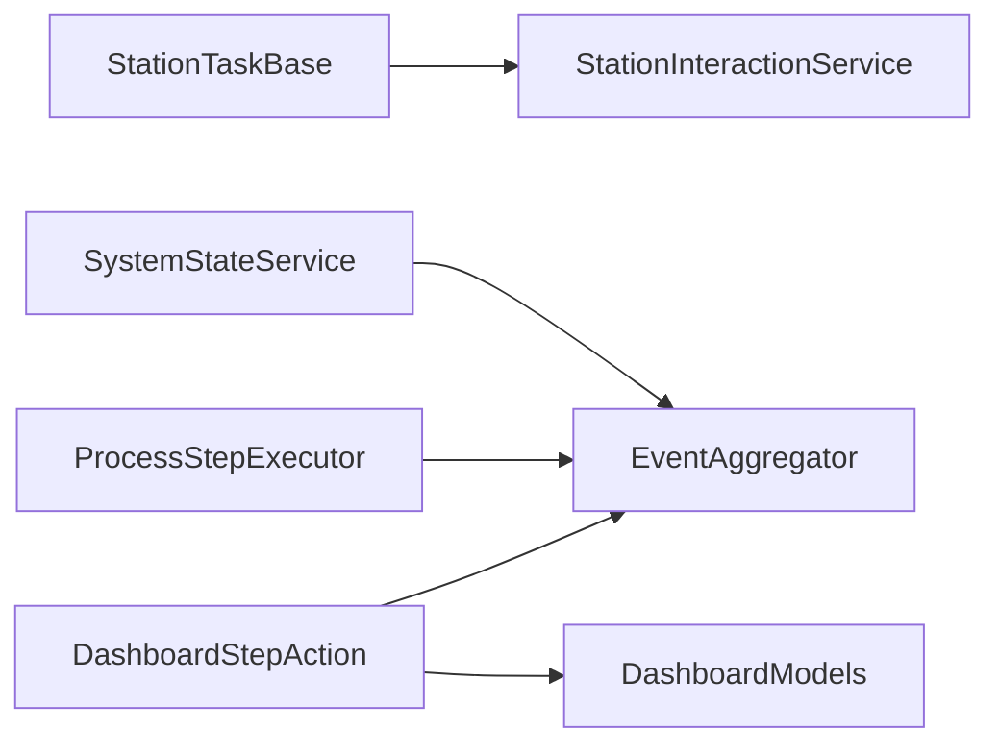

# 信号交互系统

<cite>
**本文引用的文件**
- [StationSignal.cs](file://StationTasks/Models/StationSignal.cs)
- [IStationSignalProvider.cs](file://StationTasks/Interfaces/IStationSignalProvider.cs)
- [StationInteractionService.cs](file://MotionControl/Services/StationInteractionService.cs)
- [StationTaskBase.cs](file://MotionControl/Services/StationTaskBase.cs)
- [DashboardStepAction.cs](file://StationTasks/Actions/DashboardStepAction.cs)
- [ShowDashboardEvent.cs](file://StationTasks/Events/ShowDashboardEvent.cs)
- [ShowDashboardEvent.cs（旧版迁移说明）](file://MotionControl/Events/ShowDashboardEvent.cs)
- [DashboardModels.cs](file://Core/Models/DashboardModels.cs)
- [ProcessStepExecutor.cs](file://StationTasks/Actions/ProcessStepExecutor.cs)
- [SystemStateService.cs](file://MotionControl/Services/SystemStateService.cs)
- [summary.md（模块加载与事件总线）](file://.trae/rules/summary.md)
- [版本修改记录.txt](file://版本修改记录.txt)
</cite>

## 目录
1. [简介](#简介)
2. [项目结构](#项目结构)
3. [核心组件](#核心组件)
4. [架构总览](#架构总览)
5. [详细组件分析](#详细组件分析)
6. [依赖关系分析](#依赖关系分析)
7. [性能考量](#性能考量)
8. [故障排查指南](#故障排查指南)
9. [结论](#结论)
10. [附录](#附录)

## 简介
本文件面向信号交互系统，围绕以下目标展开：深入解释 StationSignal 模型的设计与用途；阐述 IStationSignalProvider 接口的实现原理与职责边界；说明工站间信号交互的实现模式（同步等待、异步事件、状态共享）；给出信号过滤、路由规则与优先级处理的技术思路；总结可靠性保障、重连与故障恢复策略；最后解释与仪表板显示系统的集成方式与事件传播机制。

## 项目结构
信号交互系统横跨多个模块：
- StationTasks：包含信号模型、仪表板事件与动作执行器
- MotionControl：包含工站间信号交互服务、任务基类与系统状态服务
- Core：包含仪表板数据模型
- Prism.EventAggregator：作为跨模块事件总线

**图表来源**
- [StationSignal.cs:1-15](file://StationTasks/Models/StationSignal.cs#L1-L15)
- [IStationSignalProvider.cs:1-16](file://StationTasks/Interfaces/IStationSignalProvider.cs#L1-L16)
- [StationInteractionService.cs:1-46](file://MotionControl/Services/StationInteractionService.cs#L1-L46)
- [StationTaskBase.cs:1-41](file://MotionControl/Services/StationTaskBase.cs#L1-L41)
- [DashboardStepAction.cs:1-142](file://StationTasks/Actions/DashboardStepAction.cs#L1-L142)
- [ShowDashboardEvent.cs:1-25](file://StationTasks/Events/ShowDashboardEvent.cs#L1-L25)
- [DashboardModels.cs:1-144](file://Core/Models/DashboardModels.cs#L1-L144)
- [ProcessStepExecutor.cs:40-544](file://StationTasks/Actions/ProcessStepExecutor.cs#L40-L544)
- [SystemStateService.cs:408-441](file://MotionControl/Services/SystemStateService.cs#L408-L441)

**章节来源**
- [StationSignal.cs:1-15](file://StationTasks/Models/StationSignal.cs#L1-L15)
- [IStationSignalProvider.cs:1-16](file://StationTasks/Interfaces/IStationSignalProvider.cs#L1-L16)
- [StationInteractionService.cs:1-46](file://MotionControl/Services/StationInteractionService.cs#L1-L46)
- [StationTaskBase.cs:1-41](file://MotionControl/Services/StationTaskBase.cs#L1-L41)
- [DashboardStepAction.cs:1-142](file://StationTasks/Actions/DashboardStepAction.cs#L1-L142)
- [ShowDashboardEvent.cs:1-25](file://StationTasks/Events/ShowDashboardEvent.cs#L1-L25)
- [DashboardModels.cs:1-144](file://Core/Models/DashboardModels.cs#L1-L144)
- [ProcessStepExecutor.cs:40-544](file://StationTasks/Actions/ProcessStepExecutor.cs#L40-L544)
- [SystemStateService.cs:408-441](file://MotionControl/Services/SystemStateService.cs#L408-L441)

## 核心组件
- StationSignal：最小信号单元，包含名称与布尔值
- IStationSignalProvider：信号提供者接口，定义信号查询、设置与变更事件
- StationInteractionService：工站间信号服务，提供信号存储、等待与唤醒
- StationTaskBase：工站任务基类，封装信号交互与等待能力
- DashboardStepAction：仪表板步骤动作，负责计算字段、发布弹窗事件、等待确认
- ShowDashboardEvent：仪表板事件，承载弹窗所需的数据载荷
- DashboardModels：仪表板数据模型，定义字段、标注与显示逻辑
- ProcessStepExecutor：步骤执行器，协调跨工站执行与状态事件发布
- SystemStateService：系统状态服务，发布工站状态事件，驱动UI刷新

**章节来源**
- [StationSignal.cs:9-14](file://StationTasks/Models/StationSignal.cs#L9-L14)
- [IStationSignalProvider.cs:9-14](file://StationTasks/Interfaces/IStationSignalProvider.cs#L9-L14)
- [StationInteractionService.cs:6-45](file://MotionControl/Services/StationInteractionService.cs#L6-L45)
- [StationTaskBase.cs:22-41](file://MotionControl/Services/StationTaskBase.cs#L22-L41)
- [DashboardStepAction.cs:17-29](file://StationTasks/Actions/DashboardStepAction.cs#L17-L29)
- [ShowDashboardEvent.cs:7-24](file://StationTasks/Events/ShowDashboardEvent.cs#L7-L24)
- [DashboardModels.cs:9-25](file://Core/Models/DashboardModels.cs#L9-L25)
- [ProcessStepExecutor.cs:222-231](file://StationTasks/Actions/ProcessStepExecutor.cs#L222-L231)
- [SystemStateService.cs:408-441](file://MotionControl/Services/SystemStateService.cs#L408-L441)

## 架构总览
信号交互系统采用“事件总线 + 内存信号池”的轻量架构：
- 信号存储：以键值形式保存在并发字典中，键命名规范为“工站.信号”
- 信号等待：通过 AutoResetEvent 实现阻塞等待，支持超时
- 事件传播：通过 Prism.EventAggregator 在模块间解耦传递
- 仪表板集成：通过 ShowDashboardEvent 与 DashboardModels 协作，实现人机交互

**图表来源**
- [StationInteractionService.cs:20-44](file://MotionControl/Services/StationInteractionService.cs#L20-L44)
- [DashboardStepAction.cs:67-78](file://StationTasks/Actions/DashboardStepAction.cs#L67-L78)
- [ShowDashboardEvent.cs:20-23](file://StationTasks/Events/ShowDashboardEvent.cs#L20-L23)

**章节来源**
- [StationInteractionService.cs:15-46](file://MotionControl/Services/StationInteractionService.cs#L15-L46)
- [DashboardStepAction.cs:32-83](file://StationTasks/Actions/DashboardStepAction.cs#L32-L83)
- [ShowDashboardEvent.cs:19-24](file://StationTasks/Events/ShowDashboardEvent.cs#L19-L24)

## 详细组件分析

### StationSignal 模型设计
- 设计要点
  - 名称：字符串标识，建议采用“工站.信号”命名规范
  - 值：布尔值，表示高电平/低电平或激活/非激活
- 数据格式
  - 键：全名字符串
  - 值：布尔
- 传输协议
  - 内存共享：通过并发字典进行读写
  - 事件总线：通过事件聚合器进行跨模块通知

**图表来源**
- [StationSignal.cs:9-14](file://StationTasks/Models/StationSignal.cs#L9-L14)

**章节来源**
- [StationSignal.cs:9-14](file://StationTasks/Models/StationSignal.cs#L9-L14)

### IStationSignalProvider 接口实现原理
- 职责边界
  - 查询信号：IsSignalSet
  - 设置信号：SetSignal
  - 信号变更事件：SignalChanged
- 实现模式
  - 与 StationInteractionService 协同：前者面向业务语义，后者提供底层存储与等待
  - 事件发布：在设置信号后触发 SignalChanged，便于订阅方同步状态

**图表来源**
- [IStationSignalProvider.cs:9-14](file://StationTasks/Interfaces/IStationSignalProvider.cs#L9-L14)
- [StationInteractionService.cs:6-45](file://MotionControl/Services/StationInteractionService.cs#L6-L45)

**章节来源**
- [IStationSignalProvider.cs:9-14](file://StationTasks/Interfaces/IStationSignalProvider.cs#L9-L14)
- [StationInteractionService.cs:15-46](file://MotionControl/Services/StationInteractionService.cs#L15-L46)

### 工站间信号交互实现模式
- 同步通信
  - WaitForSignal：阻塞等待指定信号达到期望值，支持超时
  - 适用场景：前后工站串行协作、传感器触发
- 异步消息
  - 通过事件总线发布/订阅：如 DashboardConfirmedEvent
  - 适用场景：人机交互、跨模块通知
- 状态共享
  - 并发字典存储信号，键命名规范统一，避免冲突
  - 适用场景：全局状态查询、跨任务共享

**图表来源**
- [StationInteractionService.cs:30-44](file://MotionControl/Services/StationInteractionService.cs#L30-L44)
- [StationTaskBase.cs:434-449](file://MotionControl/Services/StationTaskBase.cs#L434-L449)

**章节来源**
- [StationInteractionService.cs:20-44](file://MotionControl/Services/StationInteractionService.cs#L20-L44)
- [StationTaskBase.cs:428-449](file://MotionControl/Services/StationTaskBase.cs#L428-L449)

### 信号过滤、路由规则与优先级处理
- 过滤
  - 命名规范：统一使用“工站.信号”，避免歧义
  - 类型约束：布尔值，确保语义清晰
- 路由
  - 通过事件总线进行跨模块路由：DashboardStepAction 发布 ShowDashboardEvent，UI 订阅并处理
- 优先级
  - 本系统未显式实现优先级队列；可通过扩展在事件总线或信号等待中引入优先级字段

**章节来源**
- [DashboardStepAction.cs:67-78](file://StationTasks/Actions/DashboardStepAction.cs#L67-L78)
- [ShowDashboardEvent.cs:20-23](file://StationTasks/Events/ShowDashboardEvent.cs#L20-L23)

### 与仪表板显示系统的集成与事件传播
- 集成方式
  - DashboardStepAction 计算字段值，构造 ShowDashboardPayload，发布 ShowDashboardEvent
  - UI 订阅事件并展示仪表板，用户确认后发布 DashboardConfirmedEvent
  - DashboardStepAction 等待确认事件，支持超时自动确认
- 事件传播
  - 事件总线：Prism.EventAggregator
  - 载荷模型：DashboardModels 提供字段、标注与显示逻辑

**图表来源**
- [ProcessStepExecutor.cs:88-123](file://StationTasks/Actions/ProcessStepExecutor.cs#L88-L123)
- [DashboardStepAction.cs:32-83](file://StationTasks/Actions/DashboardStepAction.cs#L32-L83)
- [ShowDashboardEvent.cs:20-23](file://StationTasks/Events/ShowDashboardEvent.cs#L20-L23)
- [DashboardModels.cs:9-25](file://Core/Models/DashboardModels.cs#L9-L25)

**章节来源**
- [ProcessStepExecutor.cs:88-123](file://StationTasks/Actions/ProcessStepExecutor.cs#L88-L123)
- [DashboardStepAction.cs:32-83](file://StationTasks/Actions/DashboardStepAction.cs#L32-L83)
- [ShowDashboardEvent.cs:7-24](file://StationTasks/Events/ShowDashboardEvent.cs#L7-L24)
- [DashboardModels.cs:37-91](file://Core/Models/DashboardModels.cs#L37-L91)

### 可靠性保障、重连机制与故障恢复
- 可靠性保障
  - 信号等待支持超时，超时抛出可恢复异常，指导操作员排查
  - 事件订阅在完成后及时取消，避免内存泄漏
- 重连机制
  - 本系统未实现网络重连；若需 TCP/网络重连，请参考 TCPIPModule 的相关实现与报警集成
- 故障恢复策略
  - 可恢复异常通过事件总线发布，UI 弹窗提示建议操作
  - 系统状态服务发布状态事件，驱动 UI 刷新

**图表来源**
- [StationTaskBase.cs:442-449](file://MotionControl/Services/StationTaskBase.cs#L442-L449)
- [TaskBase.cs:230-240](file://MotionControl/Services/TaskBase.cs#L230-L240)
- [SystemStateService.cs:408-441](file://MotionControl/Services/SystemStateService.cs#L408-L441)

**章节来源**
- [StationTaskBase.cs:434-449](file://MotionControl/Services/StationTaskBase.cs#L434-L449)
- [TaskBase.cs:226-240](file://MotionControl/Services/TaskBase.cs#L226-L240)
- [SystemStateService.cs:408-441](file://MotionControl/Services/SystemStateService.cs#L408-L441)

## 依赖关系分析
- 组件耦合
  - StationTaskBase 依赖 StationInteractionService 进行信号交互
  - DashboardStepAction 依赖事件聚合器与公式求值器
  - ProcessStepExecutor 协调跨工站执行并发布状态事件
- 外部依赖
  - Prism.EventAggregator：事件总线
  - 并发容器：ConcurrentDictionary、AutoResetEvent

**图表来源**
- [StationTaskBase.cs:24-30](file://MotionControl/Services/StationTaskBase.cs#L24-L30)
- [DashboardStepAction.cs:21-29](file://StationTasks/Actions/DashboardStepAction.cs#L21-L29)
- [ProcessStepExecutor.cs:60-62](file://StationTasks/Actions/ProcessStepExecutor.cs#L60-L62)
- [SystemStateService.cs:408-441](file://MotionControl/Services/SystemStateService.cs#L408-L441)
- [DashboardModels.cs:9-25](file://Core/Models/DashboardModels.cs#L9-L25)

**章节来源**
- [StationTaskBase.cs:24-30](file://MotionControl/Services/StationTaskBase.cs#L24-L30)
- [DashboardStepAction.cs:21-29](file://StationTasks/Actions/DashboardStepAction.cs#L21-L29)
- [ProcessStepExecutor.cs:60-62](file://StationTasks/Actions/ProcessStepExecutor.cs#L60-L62)
- [SystemStateService.cs:408-441](file://MotionControl/Services/SystemStateService.cs#L408-L441)
- [DashboardModels.cs:9-25](file://Core/Models/DashboardModels.cs#L9-L25)

## 性能考量
- 并发访问
  - 使用并发字典与 AutoResetEvent，避免锁竞争
- 等待策略
  - 等待超时与无超时两种模式，平衡实时性与稳定性
- 事件订阅
  - 使用一次性订阅并在 finally 中取消，避免资源泄漏

[本节为通用性能讨论，无需列出具体文件来源]

## 故障排查指南
- 信号等待超时
  - 现象：等待信号超时并抛出可恢复异常
  - 排查：检查对应工站传感器状态、连线与配置
- 仪表板确认未触发
  - 现象：DashboardStepAction 未继续执行
  - 排查：确认 UI 是否正确发布 DashboardConfirmedEvent
- 状态事件未刷新
  - 现象：UI 未显示最新状态
  - 排查：确认 SystemStateService 是否发布状态事件

**章节来源**
- [StationTaskBase.cs:442-449](file://MotionControl/Services/StationTaskBase.cs#L442-L449)
- [DashboardStepAction.cs:113-132](file://StationTasks/Actions/DashboardStepAction.cs#L113-L132)
- [SystemStateService.cs:408-441](file://MotionControl/Services/SystemStateService.cs#L408-L441)

## 结论
信号交互系统通过“内存信号池 + 事件总线”的组合，实现了工站间轻量、解耦的信号传递与状态同步。结合仪表板事件，系统支持人机交互与可视化反馈。对于更复杂的网络通信与重连需求，可参考 TCPIPModule 的实现进行扩展。

[本节为总结性内容，无需列出具体文件来源]

## 附录
- 命名规范
  - 信号键：工站.信号
  - 事件：ShowDashboardEvent、DashboardConfirmedEvent
- 相关模块加载与事件总线说明
  - 参考模块加载顺序与事件总线清单

**章节来源**
- [summary.md（模块加载与事件总线）:96-132](file://.trae/rules/summary.md#L96-L132)
- [版本修改记录.txt:229-253](file://版本修改记录.txt#L229-L253)