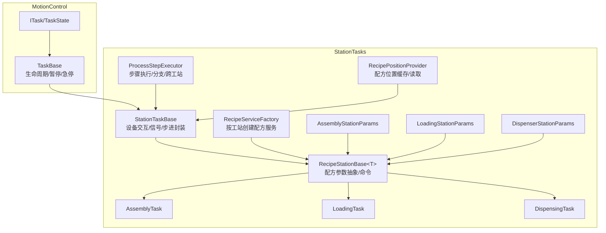
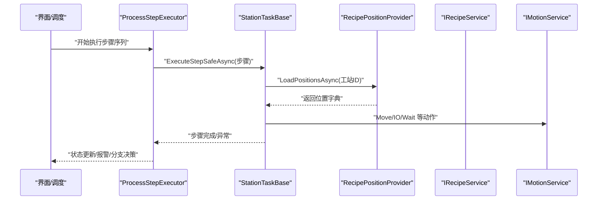
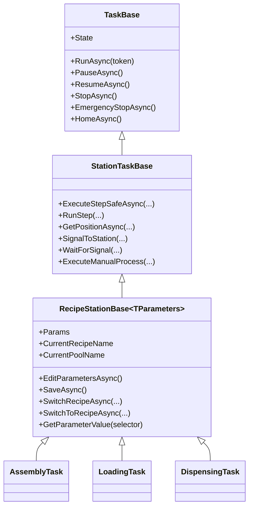
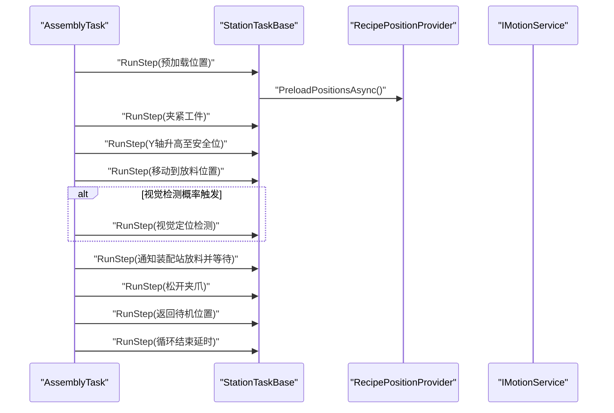
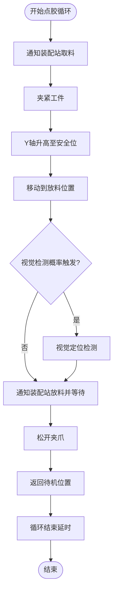
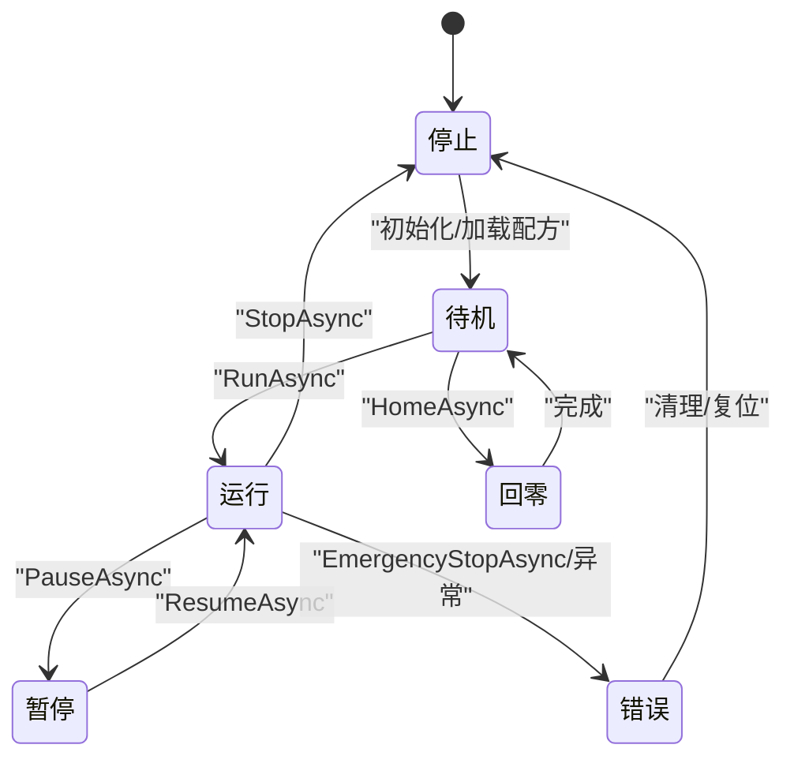
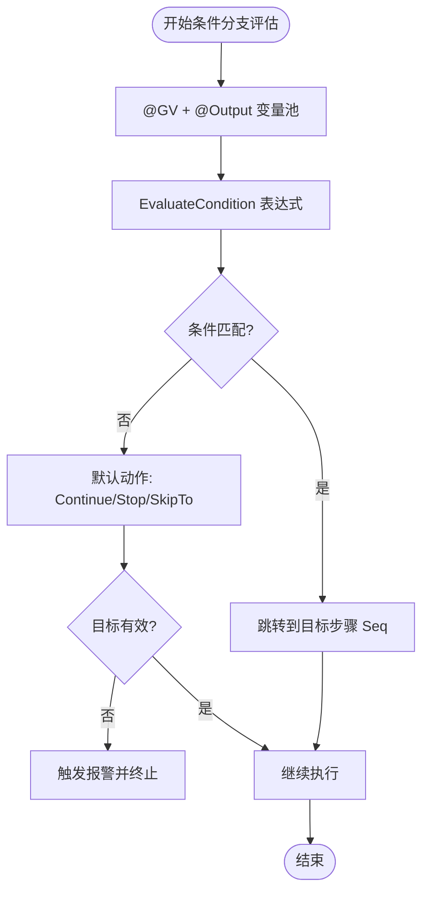
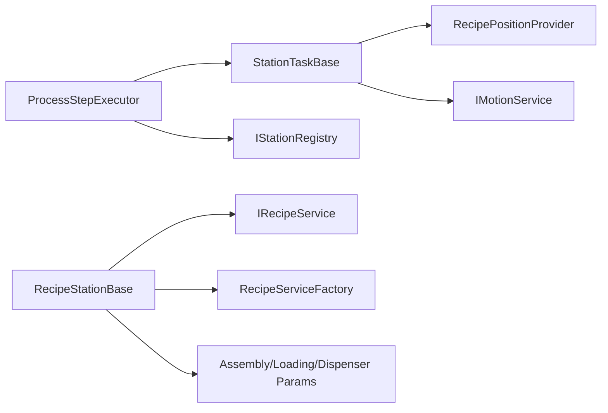

# 工站任务实现

<cite>
**本文档引用的文件**
- [RecipeStationBase.cs](file://StationTasks/Tasks/RecipeStationBase.cs)
- [AssemblyTask.cs](file://StationTasks/Tasks/AssemblyTask.cs)
- [LoadingTask.cs](file://StationTasks/Tasks/LoadingTask.cs)
- [DispensingTask.cs](file://StationTasks/Tasks/DispensingTask.cs)
- [StationTaskBase.cs](file://MotionControl/Services/StationTaskBase.cs)
- [TaskBase.cs](file://MotionControl/Services/TaskBase.cs)
- [IStationTask.cs](file://StationTasks/Interfaces/IStationTask.cs)
- [AssemblyStationParams.cs](file://StationTasks/Params/AssemblyStationParams.cs)
- [LoadingStationParams.cs](file://StationTasks/Params/LoadingStationParams.cs)
- [DispenserStationParams.cs](file://StationTasks/Params/DispenserStationParams.cs)
- [ProcessStepExecutor.cs](file://StationTasks/Actions/ProcessStepExecutor.cs)
- [RecipeServiceFactory.cs](file://StationTasks/Services/RecipeServiceFactory.cs)
- [RecipePositionProvider.cs](file://StationTasks/Services/RecipePositionProvider.cs)
- [ITask.cs](file://MotionControl/Interfaces/ITask.cs)
</cite>

## 目录
1. [简介](#简介)
2. [项目结构](#项目结构)
3. [核心组件](#核心组件)
4. [架构总览](#架构总览)
5. [详细组件分析](#详细组件分析)
6. [依赖关系分析](#依赖关系分析)
7. [性能考虑](#性能考虑)
8. [故障排查指南](#故障排查指南)
9. [结论](#结论)
10. [附录](#附录)

## 简介
本文件面向工站任务实现，系统性阐述装配、点胶、装载三类工站任务的设计与实现，重点解析 RecipeStationBase 基类的模板方法模式与通用抽象，以及任务生命周期（初始化、执行、暂停、恢复、终止）的控制流。同时给出任务参数配置、设备交互、数据采集的技术实现要点，并总结任务间协调机制、同步策略与冲突解决方案。

## 项目结构
围绕“工站任务”模块，核心代码分布在以下命名空间与目录：
- StationTasks.Tasks：各类工站任务（装配、点胶、装载）与 RecipeStationBase 基类
- StationTasks.Params：各工站参数模型（装配、点胶、装载）
- StationTasks.Services：配方服务工厂、位置提供器等
- StationTasks.Actions：步骤执行器（流程编排、条件分支、跨工站协作）
- MotionControl.Services：任务基类（TaskBase、StationTaskBase）
- MotionControl.Interfaces：任务状态枚举与接口定义

图示来源
- [StationTaskBase.cs:17-613](file://MotionControl/Services/StationTaskBase.cs#L17-L613)
- [TaskBase.cs:14-255](file://MotionControl/Services/TaskBase.cs#L14-L255)
- [RecipeStationBase.cs:20-187](file://StationTasks/Tasks/RecipeStationBase.cs#L20-L187)
- [AssemblyTask.cs:12-110](file://StationTasks/Tasks/AssemblyTask.cs#L12-L110)
- [LoadingTask.cs:12-110](file://StationTasks/Tasks/LoadingTask.cs#L12-L110)
- [DispensingTask.cs:12-123](file://StationTasks/Tasks/DispensingTask.cs#L12-L123)
- [ProcessStepExecutor.cs:29-826](file://StationTasks/Actions/ProcessStepExecutor.cs#L29-L826)
- [RecipeServiceFactory.cs:17-90](file://StationTasks/Services/RecipeServiceFactory.cs#L17-L90)
- [RecipePositionProvider.cs:16-174](file://StationTasks/Services/RecipePositionProvider.cs#L16-L174)
- [ITask.cs:7-31](file://MotionControl/Interfaces/ITask.cs#L7-L31)

章节来源
- [StationTaskBase.cs:17-613](file://MotionControl/Services/StationTaskBase.cs#L17-L613)
- [TaskBase.cs:14-255](file://MotionControl/Services/TaskBase.cs#L14-L255)
- [RecipeStationBase.cs:20-187](file://StationTasks/Tasks/RecipeStationBase.cs#L20-L187)

## 核心组件
- 任务生命周期基类
  - TaskBase：统一的任务生命周期（运行、暂停、恢复、停止、急停、回零），并发布状态事件
  - StationTaskBase：在 TaskBase 基础上增加设备交互、信号交互、位置加载、单步调试、手动流程等能力
- 配方参数抽象
  - RecipeStationBase：泛型参数绑定、配方加载/切换、参数编辑/保存、配方事件订阅
- 工站任务实现
  - AssemblyTask、LoadingTask、DispensingTask：继承 RecipeStationBase，重写执行循环与回零逻辑
- 步骤执行与协调
  - ProcessStepExecutor：顺序执行步骤、条件分支、跨工站状态广播、输出参数收集
- 参数与位置
  - AssemblyStationParams、LoadingStationParams、DispenserStationParams：各自工站的参数模型
  - RecipePositionProvider：从配方池/配方中提取并缓存位置数据
  - RecipeServiceFactory：按工站标识创建对应参数类型的配方服务

章节来源
- [TaskBase.cs:14-255](file://MotionControl/Services/TaskBase.cs#L14-L255)
- [StationTaskBase.cs:22-613](file://MotionControl/Services/StationTaskBase.cs#L22-L613)
- [RecipeStationBase.cs:20-187](file://StationTasks/Tasks/RecipeStationBase.cs#L20-L187)
- [ProcessStepExecutor.cs:29-826](file://StationTasks/Actions/ProcessStepExecutor.cs#L29-L826)
- [RecipeServiceFactory.cs:17-90](file://StationTasks/Services/RecipeServiceFactory.cs#L17-L90)
- [RecipePositionProvider.cs:16-174](file://StationTasks/Services/RecipePositionProvider.cs#L16-L174)

## 架构总览
工站任务采用“模板方法 + 配方参数 + 步骤编排”的分层设计：
- 模板方法：TaskBase/StationTaskBase 提供生命周期与通用能力；RecipeStationBase 抽象配方参数；各工站任务仅实现具体执行流程
- 配方参数：通过 RecipeServiceFactory 创建对应参数类型，RecipePositionProvider 提供位置数据缓存
- 步骤编排：ProcessStepExecutor 串联步骤，支持条件分支、跨工站协作与输出参数传播

图示来源
- [ProcessStepExecutor.cs:88-188](file://StationTasks/Actions/ProcessStepExecutor.cs#L88-L188)
- [StationTaskBase.cs:301-400](file://MotionControl/Services/StationTaskBase.cs#L301-L400)
- [RecipePositionProvider.cs:50-73](file://StationTasks/Services/RecipePositionProvider.cs#L50-L73)

## 详细组件分析

### RecipeStationBase 基类设计
- 泛型参数抽象
  - 通过类型参数约束 TParameters : TaskParametersBase，确保参数模型具备统一能力
  - 暴露 Params、CurrentRecipeName、CurrentPoolName 等属性，便于任务读取当前配方参数
- 配方服务集成
  - 通过 RecipeServiceFactory 创建 IRecipeService，订阅参数应用、配方切换、参数加载事件
  - 提供 EditParametersAsync、SaveAsync、SwitchRecipeAsync、SwitchToRecipeAsync 等配方操作
- 生命周期与注册
  - 构造时自动注册到 IStationRegistry，便于跨工站协作
  - 异步初始化配方参数，加载当前配方并缓存到内部参数对象

图示来源
- [TaskBase.cs:14-255](file://MotionControl/Services/TaskBase.cs#L14-L255)
- [StationTaskBase.cs:22-613](file://MotionControl/Services/StationTaskBase.cs#L22-L613)
- [RecipeStationBase.cs:20-187](file://StationTasks/Tasks/RecipeStationBase.cs#L20-L187)
- [AssemblyTask.cs:12-110](file://StationTasks/Tasks/AssemblyTask.cs#L12-L110)
- [LoadingTask.cs:12-110](file://StationTasks/Tasks/LoadingTask.cs#L12-L110)
- [DispensingTask.cs:12-123](file://StationTasks/Tasks/DispensingTask.cs#L12-L123)

章节来源
- [RecipeStationBase.cs:20-187](file://StationTasks/Tasks/RecipeStationBase.cs#L20-L187)
- [RecipeServiceFactory.cs:17-90](file://StationTasks/Services/RecipeServiceFactory.cs#L17-L90)

### 装配任务（AssemblyTask）
- 设计要点
  - 继承 RecipeStationBase<AssemblyStationParams>，重写 ExecuteCycleAsync 实现装配循环
  - 回零 HomeAsync：预加载位置、依次回零 X/Z/Ry 轴，进入待机
  - 执行循环包含通知取料、夹紧、升高、移动、可选视觉检测、通知放料、松开、返回待机等步骤
- 参数与位置
  - 使用 AssemblyStationParams 中的节拍、夹紧/释放位置、扭矩范围、运动速度等参数
  - 通过 RecipePositionProvider 获取配方位置，结合 ResolveAxisId 解析轴ID

图示来源
- [AssemblyTask.cs:33-80](file://StationTasks/Tasks/AssemblyTask.cs#L33-L80)
- [StationTaskBase.cs:301-400](file://MotionControl/Services/StationTaskBase.cs#L301-L400)
- [RecipePositionProvider.cs:36-48](file://StationTasks/Services/RecipePositionProvider.cs#L36-L48)

章节来源
- [AssemblyTask.cs:12-110](file://StationTasks/Tasks/AssemblyTask.cs#L12-L110)
- [AssemblyStationParams.cs:11-677](file://StationTasks/Params/AssemblyStationParams.cs#L11-L677)

### 点胶任务（DispensingTask）
- 设计要点
  - 继承 RecipeStationBase<DispenserStationParams>，重写 ExecuteCycleAsync 实现点胶循环
  - 回零 HomeAsync：预加载位置、延时若干次后进入待机
  - 提供 MoveToPosition：按配方位置名与轴名组合读取坐标并执行多轴联动
- 参数与位置
  - 使用 DispenserStationParams 中的相机参数、点胶阀参数、运动控制参数、IPQC参数等
  - 通过 RecipePositionProvider 获取 Dx/Dy/Dz1/Dz2/Dz3 等轴位置

图示来源
- [DispensingTask.cs:38-85](file://StationTasks/Tasks/DispensingTask.cs#L38-L85)
- [DispenserStationParams.cs:13-852](file://StationTasks/Params/DispenserStationParams.cs#L13-L852)

章节来源
- [DispensingTask.cs:12-123](file://StationTasks/Tasks/DispensingTask.cs#L12-L123)
- [DispenserStationParams.cs:13-852](file://StationTasks/Params/DispenserStationParams.cs#L13-L852)

### 装载任务（LoadingTask）
- 设计要点
  - 继承 RecipeStationBase<LoadingStationParams>，重写 ExecuteCycleAsync 实现上下料循环
  - 回零 HomeAsync：预加载位置、依次回零 Y/Rx/Rz 轴，进入待机
- 参数与位置
  - 使用 LoadingStationParams 中的时间参数、速度参数、超时参数、传送带参数、真空控制模式等
  - 通过 RecipePositionProvider 获取配方位置，结合 ResolveAxisId 解析轴ID

章节来源
- [LoadingTask.cs:12-110](file://StationTasks/Tasks/LoadingTask.cs#L12-L110)
- [LoadingStationParams.cs:11-268](file://StationTasks/Params/LoadingStationParams.cs#L11-L268)

### 任务生命周期管理
- 状态流转
  - 任务状态枚举：Idle、Running、Paused、Stopped、Completed、Error、Homing
  - TaskBase.RunAsync：循环执行 ExecuteCycleAsync，捕获异常并发布急停事件
  - StationTaskBase.RunStep：单步执行包装，支持暂停/恢复、单步模式、可恢复异常处理
- 关键操作
  - PauseAsync/ResumeAsync：异步暂停/恢复，内部使用 TaskCompletionSource 协调
  - StopAsync/EmergencyStopAsync：停止轴、取消任务循环、发布状态事件
  - HomeAsync：按需回零，进入 Idle/Homing 状态

图示来源
- [ITask.cs:7-16](file://MotionControl/Interfaces/ITask.cs#L7-L16)
- [TaskBase.cs:44-201](file://MotionControl/Services/TaskBase.cs#L44-L201)
- [StationTaskBase.cs:149-400](file://MotionControl/Services/StationTaskBase.cs#L149-L400)

章节来源
- [ITask.cs:7-31](file://MotionControl/Interfaces/ITask.cs#L7-L31)
- [TaskBase.cs:14-255](file://MotionControl/Services/TaskBase.cs#L14-L255)
- [StationTaskBase.cs:22-613](file://MotionControl/Services/StationTaskBase.cs#L22-L613)

### 任务参数配置、设备交互与数据采集
- 参数配置
  - 通过 RecipeServiceFactory 按工站标识创建对应参数类型（AssemblyStationParams、LoadingStationParams、DispenserStationParams）
  - RecipeStationBase 统一提供 EditParametersAsync、SaveAsync、SwitchRecipeAsync 等操作
- 设备交互
  - StationTaskBase 提供 MoveToAsync、ExecuteMoveAsync、TriggerCylinderAsync、WaitForDiAsync 等高频动作
  - 信号交互：SignalToStation、WaitForSignal、WaitForSignalAsync
- 数据采集
  - 通过 RecipePositionProvider 缓存位置数据，减少重复读取
  - 步骤执行器收集输出参数，供后续步骤或条件分支使用

章节来源
- [RecipeServiceFactory.cs:17-90](file://StationTasks/Services/RecipeServiceFactory.cs#L17-L90)
- [RecipeStationBase.cs:135-177](file://StationTasks/Tasks/RecipeStationBase.cs#L135-L177)
- [StationTaskBase.cs:452-494](file://MotionControl/Services/StationTaskBase.cs#L452-L494)
- [RecipePositionProvider.cs:36-174](file://StationTasks/Services/RecipePositionProvider.cs#L36-L174)

### 任务间协调机制、同步策略与冲突解决方案
- 协调机制
  - ProcessStepExecutor 支持跨工站执行：收集目标工站并发布 Running/Completed 状态事件
  - 通过 IStationRegistry 查找目标工站，实现信号交互与状态同步
- 同步策略
  - 单步模式：EnableSingleStep/DisableSingleStep/StepNext，RunStep 在单步模式下阻塞直至下一步
  - 暂停/恢复：CheckPauseAsync 基于 WhenAny 响应取消与恢复
- 冲突解决方案
  - 条件分支：EvaluateCondition 使用公式求值，支持 @GV/@Output 变量，首个匹配即生效
  - 跳转安全：当目标步骤 Seq 无效时触发报警并终止，避免撞机风险
  - 可恢复异常：步骤级报警配置，触发报警并请求暂停，等待操作员处理

图示来源
- [ProcessStepExecutor.cs:565-800](file://StationTasks/Actions/ProcessStepExecutor.cs#L565-L800)

章节来源
- [ProcessStepExecutor.cs:29-826](file://StationTasks/Actions/ProcessStepExecutor.cs#L29-L826)

## 依赖关系分析
- 组件耦合
  - 各工站任务强依赖 RecipeStationBase 与 StationTaskBase，弱依赖具体参数模型
  - ProcessStepExecutor 依赖 StationTaskBase 与 IStationRegistry，实现跨工站协作
- 外部依赖
  - 配方系统：IRecipeService、IRecipePoolService、RecipeServiceFactory
  - 位置系统：IPositionProvider、RecipePositionProvider
  - 事件系统：IEventAggregator、TaskStatusChangedEvent、StepFaultedEvent 等

图示来源
- [ProcessStepExecutor.cs:31-67](file://StationTasks/Actions/ProcessStepExecutor.cs#L31-L67)
- [StationTaskBase.cs:24-143](file://MotionControl/Services/StationTaskBase.cs#L24-L143)
- [RecipePositionProvider.cs:16-34](file://StationTasks/Services/RecipePositionProvider.cs#L16-L34)
- [RecipeServiceFactory.cs:17-87](file://StationTasks/Services/RecipeServiceFactory.cs#L17-L87)

章节来源
- [ProcessStepExecutor.cs:29-826](file://StationTasks/Actions/ProcessStepExecutor.cs#L29-L826)
- [RecipePositionProvider.cs:16-174](file://StationTasks/Services/RecipePositionProvider.cs#L16-L174)
- [RecipeServiceFactory.cs:17-90](file://StationTasks/Services/RecipeServiceFactory.cs#L17-L90)

## 性能考虑
- 位置缓存：RecipePositionProvider 对配方位置进行缓存，避免频繁访问配方存储
- 异步优先：RunAsync 使用 Task.Yield 让出执行权，提高响应性；RunStep 使用 Stopwatch 记录步骤耗时
- 单步调试：单步模式下使用 TaskCompletionSource 阻塞，避免忙等
- 配方事件：订阅参数应用/配方切换事件，及时刷新内部参数，减少重复加载

## 故障排查指南
- 步骤级报警
  - RunStep 捕获 RecoverableException：记录 LastFaultStepName，发布 StepFaultedEvent，触发报警并请求暂停
- 轴报警
  - TaskBase.OnAxisAlarm：收到轴报警时触发报警记录并自动暂停
- 急停与恢复
  - EmergencyStopAsync：立即急停所有轴并发布错误状态；恢复需手动处理并 ResumeAsync
- 跨工站异常
  - ProcessStepExecutor：捕获异常时标记步骤高亮，发布 Completed 状态，避免 UI 混乱

章节来源
- [StationTaskBase.cs:330-395](file://MotionControl/Services/StationTaskBase.cs#L330-L395)
- [TaskBase.cs:210-240](file://MotionControl/Services/TaskBase.cs#L210-L240)
- [ProcessStepExecutor.cs:144-187](file://StationTasks/Actions/ProcessStepExecutor.cs#L144-L187)

## 结论
本实现以 RecipeStationBase 为核心，结合 StationTaskBase 的设备交互能力与 ProcessStepExecutor 的流程编排，形成“模板方法 + 配方参数 + 步骤执行”的清晰架构。装配、点胶、装载三类任务通过统一基类实现差异化执行逻辑，配合参数模型、位置缓存与事件驱动，达成高效、可维护、可扩展的工站任务体系。

## 附录
- 接口与状态
  - ITask/TaskState：统一任务接口与状态枚举
  - IStationTask：当前文件中存在占位声明，实际使用由具体任务实现

章节来源
- [ITask.cs:7-31](file://MotionControl/Interfaces/ITask.cs#L7-L31)
- [IStationTask.cs:9-13](file://StationTasks/Interfaces/IStationTask.cs#L9-L13)