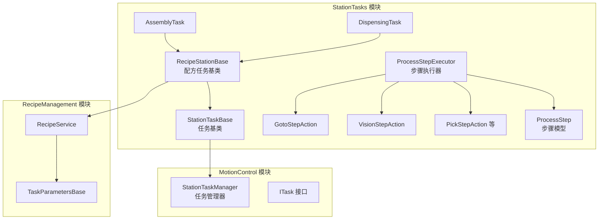
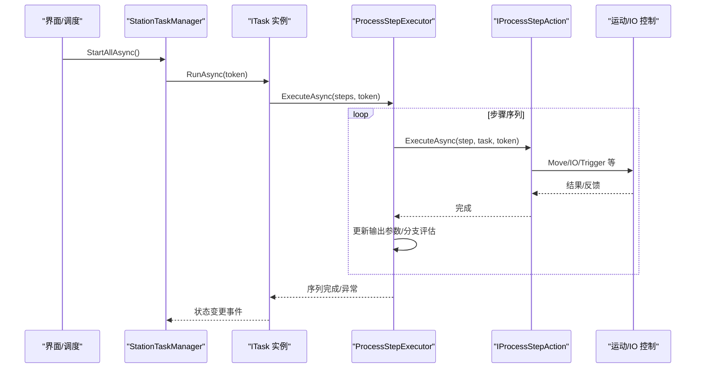
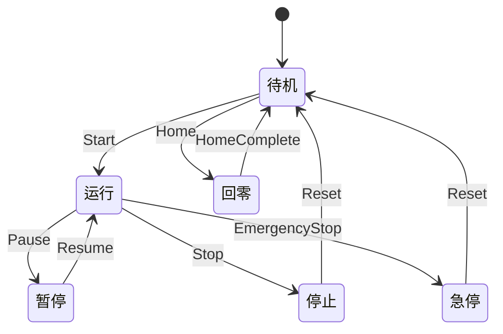
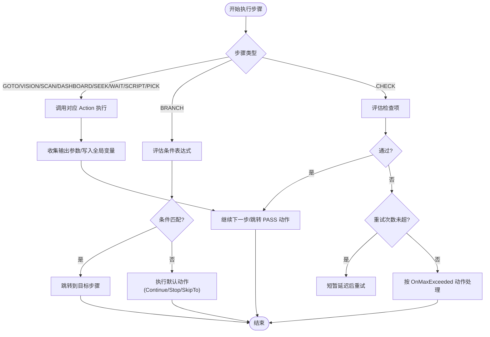
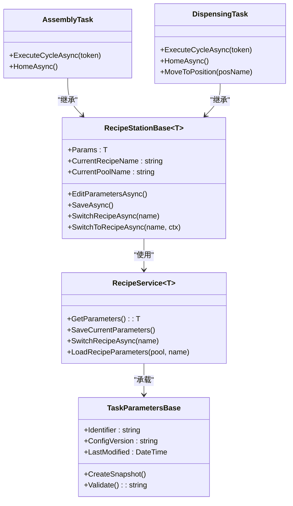
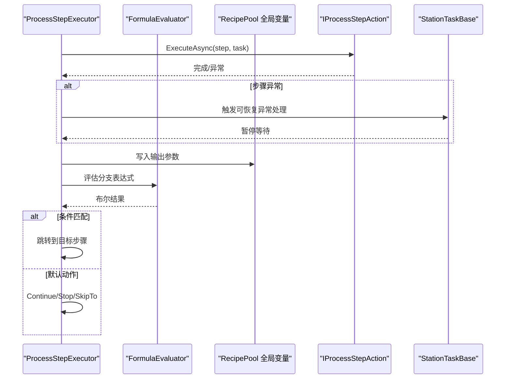
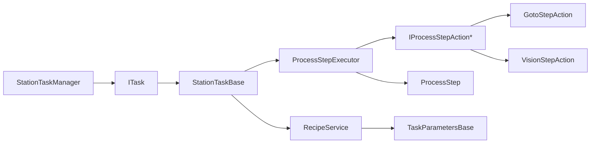

# 工站任务系统

<cite>
**本文引用的文件**
- [StationTasks.csproj](file://StationTasks/StationTasks.csproj)
- [StationTasksModule.cs](file://StationTasks/StationTasksModule.cs)
- [AssemblyTask.cs](file://StationTasks/Tasks/AssemblyTask.cs)
- [DispensingTask.cs](file://StationTasks/Tasks/DispensingTask.cs)
- [RecipeStationBase.cs](file://StationTasks/Tasks/RecipeStationBase.cs)
- [ProcessStep.cs](file://StationTasks/Models/ProcessStep.cs)
- [IProcessStepAction.cs](file://StationTasks/Actions/IProcessStepAction.cs)
- [ProcessStepExecutor.cs](file://StationTasks/Actions/ProcessStepExecutor.cs)
- [GotoStepAction.cs](file://StationTasks/Actions/GotoStepAction.cs)
- [VisionStepAction.cs](file://StationTasks/Actions/VisionStepAction.cs)
- [ITask.cs](file://MotionControl/Interfaces/ITask.cs)
- [StationTaskManager.cs](file://MotionControl/Services/StationTaskManager.cs)
- [StationTaskBase.cs](file://MotionControl/Services/StationTaskBase.cs)
- [TaskParametersBase.cs](file://Core/Abstraction/Parameters/TaskParametersBase.cs)
- [RecipeService.cs](file://RecipeManagement/Services/RecipeService.cs)
</cite>

## 目录
1. [简介](#简介)
2. [项目结构](#项目结构)
3. [核心组件](#核心组件)
4. [架构总览](#架构总览)
5. [详细组件分析](#详细组件分析)
6. [依赖关系分析](#依赖关系分析)
7. [性能考虑](#性能考虑)
8. [故障排查指南](#故障排查指南)
9. [结论](#结论)
10. [附录](#附录)

## 简介
本文件面向工站任务系统，围绕任务调度、步骤执行控制、状态跟踪与信号交互协议展开，系统性阐述装配、点胶、视觉检测等典型工站任务的实现模式，以及任务序列编排、条件分支、异常恢复策略。同时给出任务监控界面、执行日志与性能统计的技术实现思路，并覆盖任务模板设计、参数传递与跨工站协调的架构细节。

## 项目结构
工站任务系统位于 StationTasks 模块，采用“任务 + 步骤动作 + 执行器”的分层设计，结合配方参数与运动控制能力，形成可扩展的任务执行框架。核心模块间关系如下：

图示来源
- [StationTasksModule.cs:20-50](file://StationTasks/StationTasksModule.cs#L20-L50)
- [RecipeStationBase.cs:48-81](file://StationTasks/Tasks/RecipeStationBase.cs#L48-L81)
- [ProcessStepExecutor.cs:29-71](file://StationTasks/Actions/ProcessStepExecutor.cs#L29-L71)
- [GotoStepAction.cs:20-36](file://StationTasks/Actions/GotoStepAction.cs#L20-L36)
- [VisionStepAction.cs:22-44](file://StationTasks/Actions/VisionStepAction.cs#L22-L44)
- [StationTaskManager.cs:13-30](file://MotionControl/Services/StationTaskManager.cs#L13-L30)
- [ITask.cs:18-30](file://MotionControl/Interfaces/ITask.cs#L18-L30)
- [RecipeService.cs:22-109](file://RecipeManagement/Services/RecipeService.cs#L22-L109)
- [TaskParametersBase.cs:10-25](file://Core/Abstraction/Parameters/TaskParametersBase.cs#L10-L25)

章节来源
- [StationTasks.csproj:1-36](file://StationTasks/StationTasks.csproj#L1-L36)
- [StationTasksModule.cs:16-64](file://StationTasks/StationTasksModule.cs#L16-L64)

## 核心组件
- 任务接口与状态机
  - ITask 定义任务生命周期与状态枚举，统一对外暴露 Run/Pause/Stop/Home/EmergencyStop 等能力。
- 任务基类与配方集成
  - StationTaskBase 提供步骤执行包装、单步模式、信号交互、IO快捷操作、跨工站状态发布等能力。
  - RecipeStationBase<T> 将配方参数与任务绑定，提供参数编辑、保存、批量切换等能力。
- 步骤模型与动作
  - ProcessStep 描述步骤类型、子移动、报警与分支配置等；IProcessStepAction 定义每类步骤的动作接口。
  - ProcessStepExecutor 负责按序执行步骤，支持条件分支、CHECK 重试、跨工站状态广播。
- 工站任务实现
  - AssemblyTask、DispensingTask 等具体工站任务继承 RecipeStationBase<T>，实现 ExecuteCycleAsync 与 HomeAsync。

章节来源
- [ITask.cs:7-30](file://MotionControl/Interfaces/ITask.cs#L7-L30)
- [StationTaskBase.cs:22-143](file://MotionControl/Services/StationTaskBase.cs#L22-L143)
- [RecipeStationBase.cs:20-81](file://StationTasks/Tasks/RecipeStationBase.cs#L20-L81)
- [ProcessStep.cs:11-296](file://StationTasks/Models/ProcessStep.cs#L11-L296)
- [IProcessStepAction.cs:11-23](file://StationTasks/Actions/IProcessStepAction.cs#L11-L23)
- [ProcessStepExecutor.cs:29-88](file://StationTasks/Actions/ProcessStepExecutor.cs#L29-L88)

## 架构总览
系统通过模块化装配实现任务注册与自发现，利用配方服务提供参数化配置，借助执行器完成步骤级控制与异常恢复，配合任务管理器实现全系统并行运行与统一控制。

图示来源
- [StationTaskManager.cs:32-57](file://MotionControl/Services/StationTaskManager.cs#L32-L57)
- [ProcessStepExecutor.cs:88-188](file://StationTasks/Actions/ProcessStepExecutor.cs#L88-L188)
- [GotoStepAction.cs:42-121](file://StationTasks/Actions/GotoStepAction.cs#L42-L121)
- [VisionStepAction.cs:46-75](file://StationTasks/Actions/VisionStepAction.cs#L46-L75)

## 详细组件分析

### 任务调度与状态跟踪
- 任务状态机
  - 状态包括 Idle、Running、Paused、Stopped、Completed、Error、Homing，贯穿任务生命周期。
- 任务管理器
  - 并行启动/停止/暂停/恢复所有工站任务，HomeAllAsync 并行回零并汇总结果。
- 步骤执行包装
  - StationTaskBase.RunStep 提供暂停/急停/单步/可恢复异常保护；跨工站执行时通过事件发布状态，供监控界面刷新。

图示来源
- [ITask.cs:7-16](file://MotionControl/Interfaces/ITask.cs#L7-L16)
- [StationTaskManager.cs:32-91](file://MotionControl/Services/StationTaskManager.cs#L32-L91)
- [StationTaskBase.cs:301-400](file://MotionControl/Services/StationTaskBase.cs#L301-L400)

章节来源
- [ITask.cs:7-30](file://MotionControl/Interfaces/ITask.cs#L7-L30)
- [StationTaskManager.cs:13-111](file://MotionControl/Services/StationTaskManager.cs#L13-L111)
- [StationTaskBase.cs:149-203](file://MotionControl/Services/StationTaskBase.cs#L149-L203)

### 步骤执行控制与信号交互协议
- 步骤动作接口
  - IProcessStepAction 定义 SupportedStepType 与 ExecuteAsync，便于扩展新步骤类型。
- 执行器
  - ProcessStepExecutor 负责：
    - 按序执行步骤，标记当前步骤，发布跨工站状态；
    - 支持 BRANCH 条件分支（表达式求值、默认动作、安全跳转）；
    - 支持 CHECK 步骤（重试、超限动作 Alarm/Stop/Continue）；
    - 收集步骤输出参数并写入全局变量。
- 信号交互
  - StationTaskBase 提供 SignalToStation、WaitForSignal/Async，实现工站间同步与异步等待。

图示来源
- [ProcessStepExecutor.cs:262-306](file://StationTasks/Actions/ProcessStepExecutor.cs#L262-L306)
- [ProcessStepExecutor.cs:565-614](file://StationTasks/Actions/ProcessStepExecutor.cs#L565-L614)
- [ProcessStepExecutor.cs:370-440](file://StationTasks/Actions/ProcessStepExecutor.cs#L370-L440)
- [ProcessStepExecutor.cs:787-800](file://StationTasks/Actions/ProcessStepExecutor.cs#L787-L800)

章节来源
- [IProcessStepAction.cs:11-23](file://StationTasks/Actions/IProcessStepAction.cs#L11-L23)
- [ProcessStepExecutor.cs:29-188](file://StationTasks/Actions/ProcessStepExecutor.cs#L29-L188)
- [StationTaskBase.cs:416-449](file://MotionControl/Services/StationTaskBase.cs#L416-L449)

### 不同类型工站任务的实现模式
- 装配任务（AssemblyTask）
  - 通过 RecipeStationBase<T> 继承配方参数，实现装配循环与回零流程。
- 点胶任务（DispensingTask）
  - 同样继承配方参数，实现点胶相关运动与回零流程。
- 任务模板与参数传递
  - 通过 RecipeStationBase<T> 与 RecipeService<T> 绑定参数类型 TaskParametersBase<T>，实现参数编辑、保存与批量切换。

图示来源
- [AssemblyTask.cs:12-31](file://StationTasks/Tasks/AssemblyTask.cs#L12-L31)
- [DispensingTask.cs:12-36](file://StationTasks/Tasks/DispensingTask.cs#L12-L36)
- [RecipeStationBase.cs:20-81](file://StationTasks/Tasks/RecipeStationBase.cs#L20-L81)
- [RecipeService.cs:22-109](file://RecipeManagement/Services/RecipeService.cs#L22-L109)
- [TaskParametersBase.cs:10-144](file://Core/Abstraction/Parameters/TaskParametersBase.cs#L10-L144)

章节来源
- [AssemblyTask.cs:33-106](file://StationTasks/Tasks/AssemblyTask.cs#L33-L106)
- [DispensingTask.cs:38-111](file://StationTasks/Tasks/DispensingTask.cs#L38-L111)
- [RecipeStationBase.cs:83-184](file://StationTasks/Tasks/RecipeStationBase.cs#L83-L184)
- [RecipeService.cs:223-256](file://RecipeManagement/Services/RecipeService.cs#L223-L256)

### 任务序列编排、条件分支与异常恢复
- 条件分支（BRANCH）
  - 支持基于全局变量与步骤输出参数的表达式评估，首个匹配条件生效；默认动作支持 Continue/Stop/SkipTo，SkipTo 无效时触发安全报警并终止。
- CHECK 步骤
  - 支持多检查项、重试次数、最大超限动作（Alarm/Stop/Continue），失败时按 OnFailAction 决策（Retry/Stop/SkipTo）。
- 异常恢复
  - 步骤级可恢复异常通过 RecoverableException 触发报警、暂停并等待操作员处理；致命异常封装为 StepFailureException，触发任务级急停并广播全局急停。

图示来源
- [ProcessStepExecutor.cs:312-364](file://StationTasks/Actions/ProcessStepExecutor.cs#L312-L364)
- [ProcessStepExecutor.cs:565-614](file://StationTasks/Actions/ProcessStepExecutor.cs#L565-L614)
- [ProcessStepExecutor.cs:719-743](file://StationTasks/Actions/ProcessStepExecutor.cs#L719-L743)
- [ProcessStepExecutor.cs:751-781](file://StationTasks/Actions/ProcessStepExecutor.cs#L751-L781)

章节来源
- [ProcessStepExecutor.cs:565-800](file://StationTasks/Actions/ProcessStepExecutor.cs#L565-L800)

### 任务监控界面、执行日志与性能统计
- 监控界面
  - ProcessStepExecutor 在跨工站执行时发布 TaskStatusChangedEvent，StationTaskBase.PublishStepStatus/CompleteStepStatus 提供步骤级状态上报，供 TaskMonitorView 刷新。
- 执行日志
  - 通过 ILoggerService 记录步骤开始/完成、异常、报警等信息；RunStep 包装内记录耗时。
- 性能统计
  - 建议在 RunStep 内部使用 Stopwatch 记录步骤耗时，结合事件聚合器上报统计指标（平均/最值/失败率）。

章节来源
- [StationTaskBase.cs:591-610](file://MotionControl/Services/StationTaskBase.cs#L591-L610)
- [ProcessStepExecutor.cs:136-167](file://StationTasks/Actions/ProcessStepExecutor.cs#L136-L167)

### 跨工站协调与信号交互
- 跨工站移动
  - GotoStepAction 支持 SubMove 指定 StationId，ResolveTargetTask 通过 IStationRegistry 查找目标工站并执行 Move/GoHome。
- 信号交互
  - StationTaskBase.SignalToStation 与 WaitForSignal/Async 提供工站间同步与异步等待，支持超时与建议处理。

章节来源
- [GotoStepAction.cs:126-138](file://StationTasks/Actions/GotoStepAction.cs#L126-L138)
- [GotoStepAction.cs:69-120](file://StationTasks/Actions/GotoStepAction.cs#L69-L120)
- [StationTaskBase.cs:416-449](file://MotionControl/Services/StationTaskBase.cs#L416-L449)

## 依赖关系分析
- 模块依赖
  - StationTasks 依赖 AlarmModule、MotionControl、RecipeManagement、TCPIPModule。
- 运行时依赖
  - StationTasksModule 在 OnInitialized 时解析 ITask 单例并触发自注册，确保任务在 IStationRegistry 中可用。
- 执行链路
  - StationTaskManager 并行调度 ITask；每个任务内部通过 ProcessStepExecutor 调度 IProcessStepAction；动作通过 StationTaskBase 与运动/IO/信号交互。

图示来源
- [StationTasksModule.cs:20-62](file://StationTasks/StationTasksModule.cs#L20-L62)
- [StationTaskManager.cs:23-30](file://MotionControl/Services/StationTaskManager.cs#L23-L30)
- [ProcessStepExecutor.cs:46-67](file://StationTasks/Actions/ProcessStepExecutor.cs#L46-L67)
- [GotoStepAction.cs:28-36](file://StationTasks/Actions/GotoStepAction.cs#L28-L36)
- [VisionStepAction.cs:32-44](file://StationTasks/Actions/VisionStepAction.cs#L32-L44)
- [RecipeService.cs:92-109](file://RecipeManagement/Services/RecipeService.cs#L92-L109)
- [TaskParametersBase.cs:10-25](file://Core/Abstraction/Parameters/TaskParametersBase.cs#L10-L25)

章节来源
- [StationTasks.csproj:16-25](file://StationTasks/StationTasks.csproj#L16-L25)
- [StationTasksModule.cs:20-62](file://StationTasks/StationTasksModule.cs#L20-L62)

## 性能考虑
- 并行与串行
  - StationTaskManager 并行启动所有工站任务；跨工站移动时通过事件广播避免 UI 阻塞。
- 步骤粒度
  - 将长流程拆分为细粒度步骤，充分利用 RunStep 的暂停/单步能力，降低调试成本。
- 资源访问
  - RecipeService 使用信号量保证参数保存的互斥；全局变量读写尽量批量进行，减少 I/O 次数。
- 异常短路
  - 可恢复异常触发暂停与报警，避免无效重试造成资源浪费；必要时引入退避策略。

## 故障排查指南
- 步骤异常
  - 若出现可恢复异常，查看 LastFaultStepName 与报警记录，确认是否已触发报警与暂停；根据建议动作处理后恢复运行。
- 超时与跳转
  - BRANCH/WaitForSignal/Async 超时会抛出可恢复异常，检查目标工站信号状态与连接配置。
- CHECK 步骤
  - 若重试超限，依据 OnMaxExceeded 动作决定 Alarm/Stop/Continue；检查检查项阈值与测量数据。
- 回零失败
  - HomeAllAsync 汇总所有工站状态，失败时检查轴状态与硬件配置。

章节来源
- [StationTaskBase.cs:330-395](file://MotionControl/Services/StationTaskBase.cs#L330-L395)
- [ProcessStepExecutor.cs:114-187](file://StationTasks/Actions/ProcessStepExecutor.cs#L114-L187)
- [VisionStepAction.cs:115-143](file://StationTasks/Actions/VisionStepAction.cs#L115-L143)

## 结论
工站任务系统以“任务基类 + 步骤动作 + 执行器”为核心，结合配方参数与信号交互，实现了可扩展、可观测、可恢复的任务调度体系。通过并行任务管理、细粒度步骤控制与条件分支/异常恢复机制，系统能够高效支撑装配、点胶、视觉检测等多样化工站场景，并为跨工站协调与监控提供清晰的架构路径。

## 附录
- 术语
  - 工站：指具备特定功能的自动化工位，如装配、点胶、视觉检测等。
  - 步骤：工艺流程中的最小执行单元，包含类型、参数与可选的报警/分支配置。
  - 分支：基于表达式的条件跳转，支持安全校验与默认动作。
  - 可恢复异常：步骤级异常，触发报警与暂停，允许人工干预后恢复。
- 扩展建议
  - 新增步骤类型：实现 IProcessStepAction 并在 StationTasksModule 注册；
  - 新增工站任务：继承 RecipeStationBase<T> 并在模块中注册；
  - 性能优化：引入步骤耗时统计与可视化面板，结合日志与报警联动分析瓶颈。