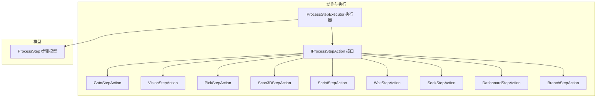
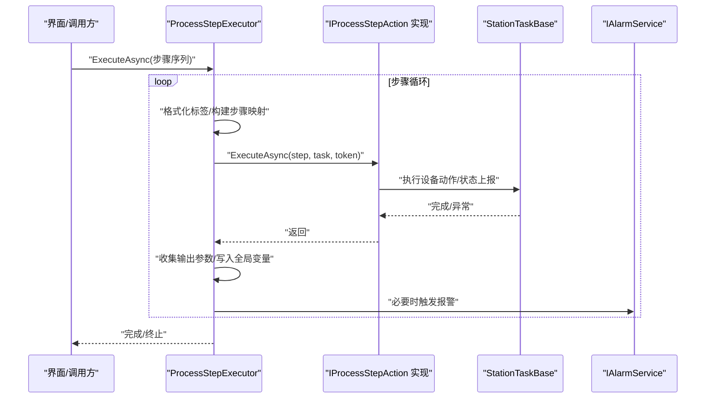
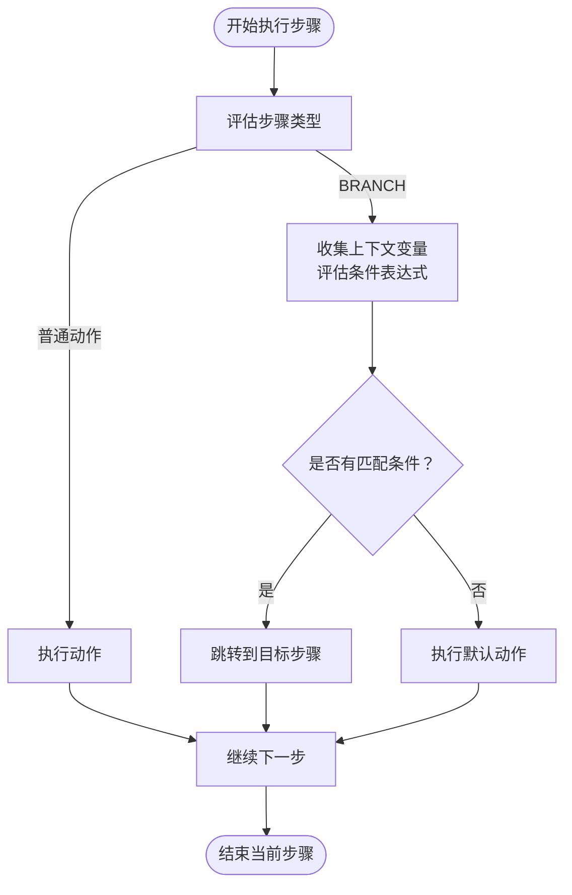
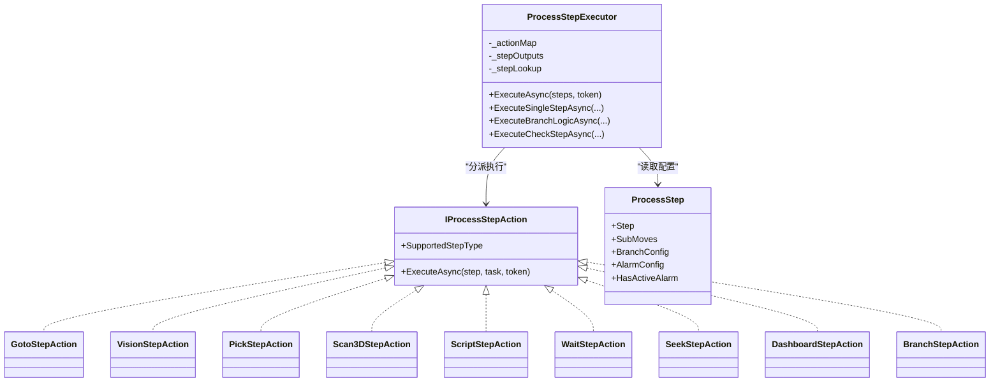

# 步骤执行动作

<cite>
**本文引用的文件**
- [IProcessStepAction.cs](file://StationTasks/Actions/IProcessStepAction.cs)
- [ProcessStepExecutor.cs](file://StationTasks/Actions/ProcessStepExecutor.cs)
- [BranchStepAction.cs](file://StationTasks/Actions/BranchStepAction.cs)
- [GotoStepAction.cs](file://StationTasks/Actions/GotoStepAction.cs)
- [VisionStepAction.cs](file://StationTasks/Actions/VisionStepAction.cs)
- [PickStepAction.cs](file://StationTasks/Actions/PickStepAction.cs)
- [ScriptStepAction.cs](file://StationTasks/Actions/ScriptStepAction.cs)
- [WaitStepAction.cs](file://StationTasks/Actions/WaitStepAction.cs)
- [SeekStepAction.cs](file://StationTasks/Actions/SeekStepAction.cs)
- [DashboardStepAction.cs](file://StationTasks/Actions/DashboardStepAction.cs)
- [Scan3DStepAction.cs](file://StationTasks/Actions/Scan3DStepAction.cs)
- [ProcessStep.cs](file://StationTasks/Models/ProcessStep.cs)
</cite>

## 目录
1. [简介](#简介)
2. [项目结构](#项目结构)
3. [核心组件](#核心组件)
4. [架构总览](#架构总览)
5. [详细组件分析](#详细组件分析)
6. [依赖关系分析](#依赖关系分析)
7. [性能考量](#性能考量)
8. [故障排查指南](#故障排查指南)
9. [结论](#结论)
10. [附录](#附录)

## 简介
本文件围绕“步骤执行动作”的技术实现展开，系统性阐述 IProcessStepAction 接口的设计理念、动作抽象与参数传递机制、执行回调与异常处理策略；并深入解析各类具体动作（视觉检测、抓取、分支、跳转等）的实现细节、动作链式调用与条件判断、参数校验与执行状态跟踪、结果反馈与可扩展性设计，以及性能监控指标建议。

## 项目结构
- 动作接口与执行器位于 StationTasks/Actions，负责将步骤模型 ProcessStep 映射为具体可执行的动作。
- 步骤模型位于 StationTasks/Models，包含步骤类型、参数详情、报警与分支配置等。
- 各动作类实现 IProcessStepAction，由 ProcessStepExecutor 统一调度与执行，支持跨工站、条件分支、检查重试、报警联动与状态上报。

图表来源
- [IProcessStepAction.cs](file://StationTasks/Actions/IProcessStepAction.cs)
- [ProcessStepExecutor.cs](file://StationTasks/Actions/ProcessStepExecutor.cs)
- [GotoStepAction.cs](file://StationTasks/Actions/GotoStepAction.cs)
- [VisionStepAction.cs](file://StationTasks/Actions/VisionStepAction.cs)
- [PickStepAction.cs](file://StationTasks/Actions/PickStepAction.cs)
- [Scan3DStepAction.cs](file://StationTasks/Actions/Scan3DStepAction.cs)
- [ScriptStepAction.cs](file://StationTasks/Actions/ScriptStepAction.cs)
- [WaitStepAction.cs](file://StationTasks/Actions/WaitStepAction.cs)
- [SeekStepAction.cs](file://StationTasks/Actions/SeekStepAction.cs)
- [DashboardStepAction.cs](file://StationTasks/Actions/DashboardStepAction.cs)
- [BranchStepAction.cs](file://StationTasks/Actions/BranchStepAction.cs)
- [ProcessStep.cs](file://StationTasks/Models/ProcessStep.cs)

章节来源
- [IProcessStepAction.cs](file://StationTasks/Actions/IProcessStepAction.cs)
- [ProcessStepExecutor.cs](file://StationTasks/Actions/ProcessStepExecutor.cs)
- [ProcessStep.cs](file://StationTasks/Models/ProcessStep.cs)

## 核心组件
- IProcessStepAction：定义步骤动作的统一接口，约束 SupportedStepType 与 ExecuteAsync 方法签名，实现“动作抽象 + 参数传递 + 执行回调”三要素。
- ProcessStepExecutor：序列执行器，负责动作调度、条件分支、检查重试、跨工站状态广播、报警联动与异常处理。
- 各具体动作：针对不同 StepType 提供专用实现，封装设备交互、数据解析、全局变量映射与状态上报。

章节来源
- [IProcessStepAction.cs](file://StationTasks/Actions/IProcessStepAction.cs)
- [ProcessStepExecutor.cs](file://StationTasks/Actions/ProcessStepExecutor.cs)

## 架构总览
执行器通过字典将 StepType 与具体动作关联，按顺序执行步骤，支持：
- 条件分支（BRANCH）：基于表达式与上下文变量（全局变量、输出参数）判断跳转。
- 检查（CHECK）：对一组检查项进行评估，支持重试、超限动作（报警/停止/继续）。
- 跨工站：向目标工站发布运行/完成状态事件，便于 UI 与监控同步。
- 异常与报警：捕获可恢复异常，联动报警服务与步骤级报警配置。

图表来源
- [ProcessStepExecutor.cs](file://StationTasks/Actions/ProcessStepExecutor.cs)
- [IProcessStepAction.cs](file://StationTasks/Actions/IProcessStepAction.cs)

## 详细组件分析

### IProcessStepAction 接口与执行回调机制
- 设计要点
  - SupportedStepType：限定动作支持的步骤类型，保证执行器按类型分派。
  - ExecuteAsync：统一的异步执行入口，参数包含步骤数据、所属任务、取消令牌，确保可中断与可观察。
- 执行回调
  - 执行器在 ExecuteAsync 前后进行状态上报与日志记录，部分动作通过任务对象发布状态事件，供 UI 或监控刷新。
  - 分支与检查动作不直接执行物理动作，而是由执行器集中处理跳转与评估逻辑。

章节来源
- [IProcessStepAction.cs](file://StationTasks/Actions/IProcessStepAction.cs)
- [ProcessStepExecutor.cs](file://StationTasks/Actions/ProcessStepExecutor.cs)

### 动作链式调用与条件判断
- 顺序执行
  - 执行器维护 currentIndex，按序执行，遇到 CHECK/BRANCH 等特殊步骤时进入相应逻辑分支。
- 条件分支（BRANCH）
  - 收集上下文变量（全局变量 + 输出参数），按顺序评估条件表达式，首个匹配即跳转；否则执行默认动作（继续/停止/SkipTo）。
  - SkipTo 若目标无效，触发紧急报警并终止序列，防止撞机风险。
- 检查（CHECK）
  - 评估检查项集合，全部通过才算 PASS；支持重试与最大重试超限动作（Alarm/Stop/Continue）。
  - 结果写入输出参数字典，供后续步骤引用。

图表来源
- [ProcessStepExecutor.cs](file://StationTasks/Actions/ProcessStepExecutor.cs)

章节来源
- [ProcessStepExecutor.cs](file://StationTasks/Actions/ProcessStepExecutor.cs)

### 视觉检测动作（VISION）
- 流程
  - 通过 TCPIP 发送触发命令 → 等待响应（带重试与超时）→ 解析原始数据（默认解析器或脚本解析器）→ 映射到全局变量并持久化。
- 异常处理
  - 超时/解析失败抛出可恢复异常，由上层统一处理，支持提示与重试策略。
- 参数与结果
  - 支持自定义解析脚本与变量映射，结果写入配方池的全局变量集合。

章节来源
- [VisionStepAction.cs](file://StationTasks/Actions/VisionStepAction.cs)

### 抓取动作（PICK）
- 流程
  - 执行取料运动序列 → 夹紧 → 保压延时（受 CancellationToken 控制）→ 真空检测（可选）。
- 跨工站与偏移
  - 支持跨工站路由与轴解析，偏移支持固定值与全局变量。
- 异常处理
  - 夹爪未初始化时抛出可恢复异常，提示系统复位。

章节来源
- [PickStepAction.cs](file://StationTasks/Actions/PickStepAction.cs)

### 分支动作（BRANCH）
- 说明
  - 纯逻辑步骤，不执行物理动作；跳转逻辑由执行器集中处理。
- 作用
  - 将条件表达式与上下文变量结合，实现灵活的流程控制。

章节来源
- [BranchStepAction.cs](file://StationTasks/Actions/BranchStepAction.cs)
- [ProcessStepExecutor.cs](file://StationTasks/Actions/ProcessStepExecutor.cs)

### 跳转动作（GOTO）
- 流程
  - 遍历 SubMoves，解析轴与位置，支持 HOME 模式与绝对定位；支持跨工站路由。
- 偏移与速度
  - 支持固定偏移与全局变量偏移；速度可配置。
- HOME 检查
  - 回零前检查是否已回零，已回零则跳过。

章节来源
- [GotoStepAction.cs](file://StationTasks/Actions/GotoStepAction.cs)

### 3D 扫描动作（SCAN）
- 流程
  - 七步工作流：Z 抬升 → X 起始 → Z 下降 → IO 触发（异步复位）→ X 终点 + TCP 实时接收 → Z 安全 → X 待机。
- 数据处理
  - 移动过程中订阅相机消息，收集原始数据；解析后映射到全局变量并持久化。
- 异常处理
  - 未收到数据时抛出可恢复异常，提示检查连接与触发信号。

章节来源
- [Scan3DStepAction.cs](file://StationTasks/Actions/Scan3DStepAction.cs)

### 脚本动作（SCRIPT）
- 流程
  - 动态编译 C# 脚本（约定类名与方法签名），执行后将变更写回全局变量并发布事件通知 UI。
- 编译与缓存
  - 使用 Natasha 引擎，仅当脚本内容变化时重新编译，减少运行时开销。
- 参数与输出
  - 通过 ScriptContext 读取/写入全局变量与输出参数字典。

章节来源
- [ScriptStepAction.cs](file://StationTasks/Actions/ScriptStepAction.cs)

### 等待动作（WAIT）
- 流程
  - 读取延时配置，异步等待指定时长，支持取消令牌中断。
- 适用场景
  - 延时、节拍控制、等待设备稳定。

章节来源
- [WaitStepAction.cs](file://StationTasks/Actions/WaitStepAction.cs)

### 寻针动作（SEEK）
- 流程
  - 逐通道读取模拟量力值 → 判定范围 → 写入全局变量 → 超限时发布步骤故障事件并按配置触发报警。
- 报警联动
  - 依据步骤报警配置决定报警级别与代码。

章节来源
- [SeekStepAction.cs](file://StationTasks/Actions/SeekStepAction.cs)

### 看板动作（DASHBOARD）
- 流程
  - 计算字段公式与条件 → 发布弹窗事件 → 等待用户确认（支持超时自动确认）。
- 事件驱动
  - 通过 Prism 事件与 UI 协作，实现人机交互。

章节来源
- [DashboardStepAction.cs](file://StationTasks/Actions/DashboardStepAction.cs)

## 依赖关系分析

图表来源
- [IProcessStepAction.cs](file://StationTasks/Actions/IProcessStepAction.cs)
- [ProcessStepExecutor.cs](file://StationTasks/Actions/ProcessStepExecutor.cs)
- [GotoStepAction.cs](file://StationTasks/Actions/GotoStepAction.cs)
- [VisionStepAction.cs](file://StationTasks/Actions/VisionStepAction.cs)
- [PickStepAction.cs](file://StationTasks/Actions/PickStepAction.cs)
- [Scan3DStepAction.cs](file://StationTasks/Actions/Scan3DStepAction.cs)
- [ScriptStepAction.cs](file://StationTasks/Actions/ScriptStepAction.cs)
- [WaitStepAction.cs](file://StationTasks/Actions/WaitStepAction.cs)
- [SeekStepAction.cs](file://StationTasks/Actions/SeekStepAction.cs)
- [DashboardStepAction.cs](file://StationTasks/Actions/DashboardStepAction.cs)
- [BranchStepAction.cs](file://StationTasks/Actions/BranchStepAction.cs)
- [ProcessStep.cs](file://StationTasks/Models/ProcessStep.cs)

章节来源
- [ProcessStepExecutor.cs](file://StationTasks/Actions/ProcessStepExecutor.cs)
- [ProcessStep.cs](file://StationTasks/Models/ProcessStep.cs)

## 性能考量
- 动作编译缓存
  - SCRIPT 动作采用 Natasha 动态编译并缓存委托，仅在脚本内容变化时重新编译，降低重复编译开销。
- 异步与取消
  - 所有长时间操作均支持 CancellationToken，避免阻塞与资源浪费。
- 数据解析与通信
  - VISION/SCAN 使用脚本解析器或专用解析器，尽量减少解析成本；通信超时与重试策略平衡可靠性与吞吐。
- 跨工站广播
  - 执行器仅对涉及的目标工站发布状态事件，避免冗余广播。

## 故障排查指南
- 常见问题与定位
  - 步骤未执行：检查步骤类型是否注册动作、步骤配置是否完整。
  - 超时/解析失败：核对通信配置、超时时间与数据格式；查看可恢复异常提示。
  - 报警未触发：确认步骤报警配置是否启用、报警服务可用。
  - 跳转异常：检查 BRANCH 目标步骤 Seq 是否有效，避免无效跳转导致终止。
- 日志与状态
  - 执行器与动作均输出详细日志，结合 HasActiveAlarm 标记与报警服务可快速定位问题。

章节来源
- [ProcessStepExecutor.cs](file://StationTasks/Actions/ProcessStepExecutor.cs)
- [VisionStepAction.cs](file://StationTasks/Actions/VisionStepAction.cs)
- [Scan3DStepAction.cs](file://StationTasks/Actions/Scan3DStepAction.cs)
- [SeekStepAction.cs](file://StationTasks/Actions/SeekStepAction.cs)

## 结论
本方案通过 IProcessStepAction 接口实现动作抽象，配合 ProcessStepExecutor 的统一调度，形成清晰的步骤执行链路。动作间通过参数字典与全局变量实现解耦与复用，条件分支与检查机制提供强大的流程控制能力。异常与报警联动确保问题可发现、可处置，跨工站状态广播保障系统一致性。整体设计具备良好的可扩展性与可维护性。

## 附录

### 动作参数验证与执行状态跟踪
- 参数验证
  - 动作内部对关键配置进行校验（如 VISION/SCAN 的通信配置、SCRIPT 的脚本约定、PICK 的夹爪初始化），异常时抛出可恢复异常。
- 执行状态跟踪
  - 执行器维护当前步骤标记、步骤输出字典、步骤标签映射与报警状态，支持 UI 高亮与报警标识。
- 结果反馈
  - 动作执行结果写入输出参数字典与全局变量池，供后续步骤引用与 UI 展示。

章节来源
- [ProcessStepExecutor.cs](file://StationTasks/Actions/ProcessStepExecutor.cs)
- [ProcessStep.cs](file://StationTasks/Models/ProcessStep.cs)

### 新动作类型的添加方法
- 实现步骤
  - 新建类实现 IProcessStepAction，声明 SupportedStepType。
  - 在构造函数中注入所需服务（日志、配方、事件、运动等）。
  - 在 ExecuteAsync 中实现动作逻辑，遵循取消令牌与异常处理规范。
  - 在执行器构造函数中注册动作实例，确保按类型分派。
- 注意事项
  - 保持 ExecuteAsync 的幂等性与可中断性。
  - 对外设与通信进行超时与重试控制，必要时抛出可恢复异常。
  - 将结果写入输出参数字典或全局变量池，便于后续步骤使用。

章节来源
- [IProcessStepAction.cs](file://StationTasks/Actions/IProcessStepAction.cs)
- [ProcessStepExecutor.cs](file://StationTasks/Actions/ProcessStepExecutor.cs)