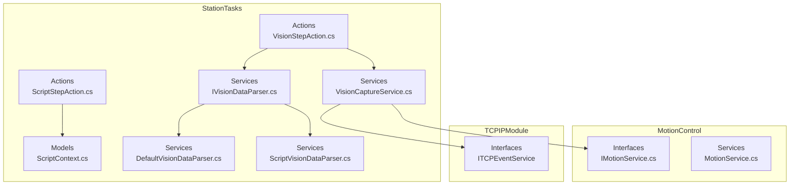
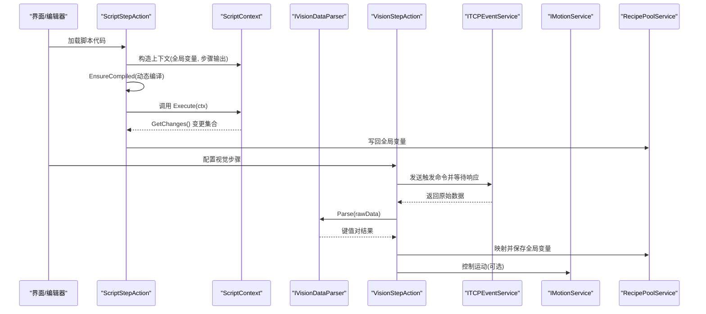
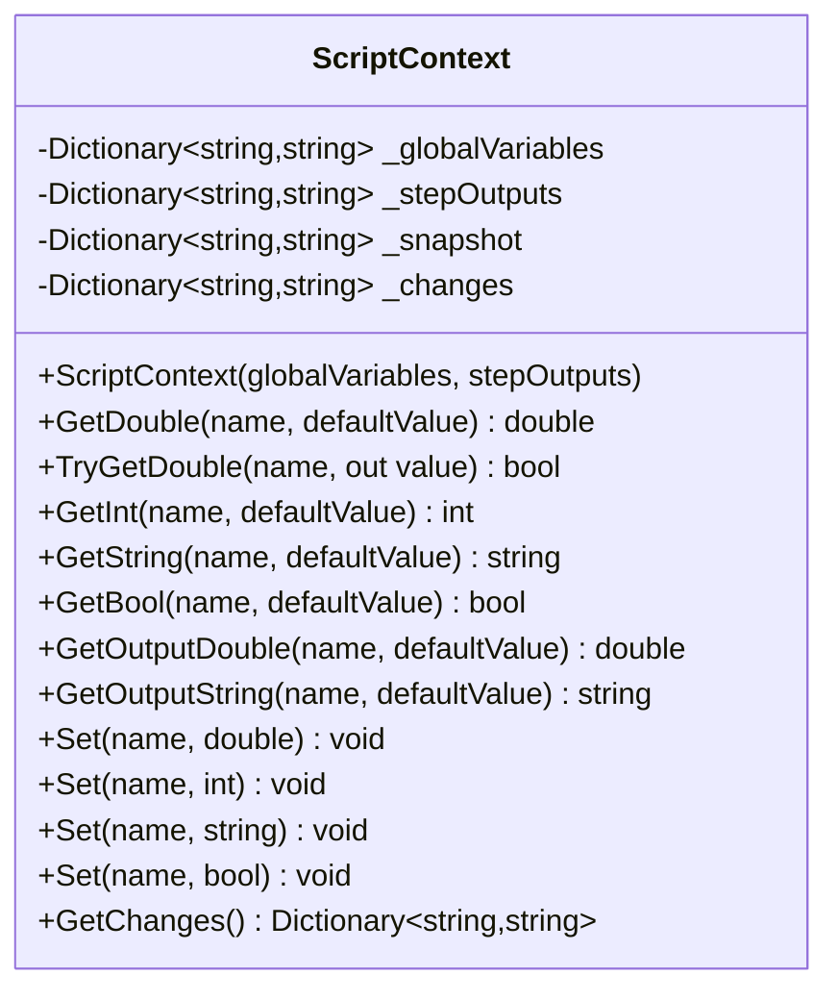
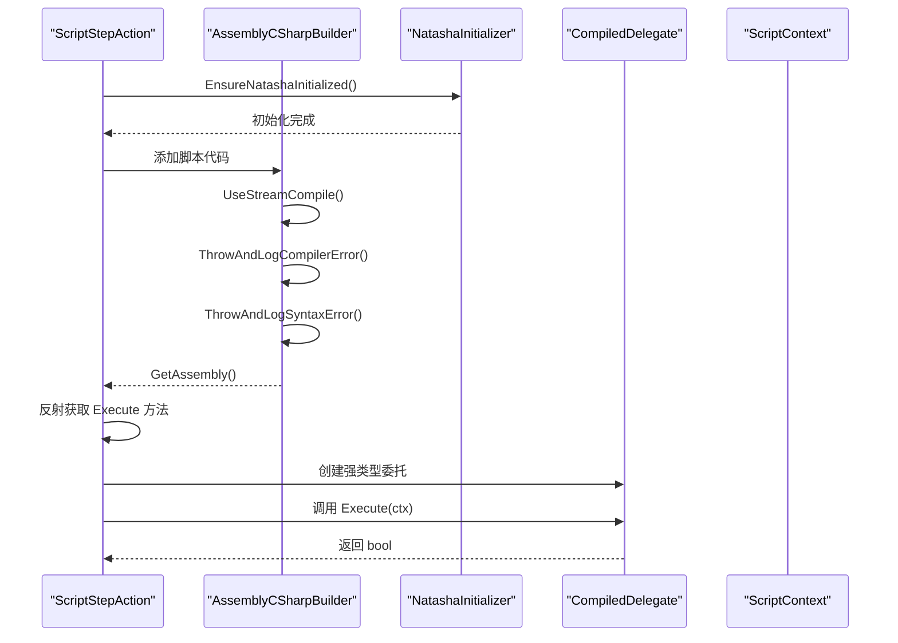
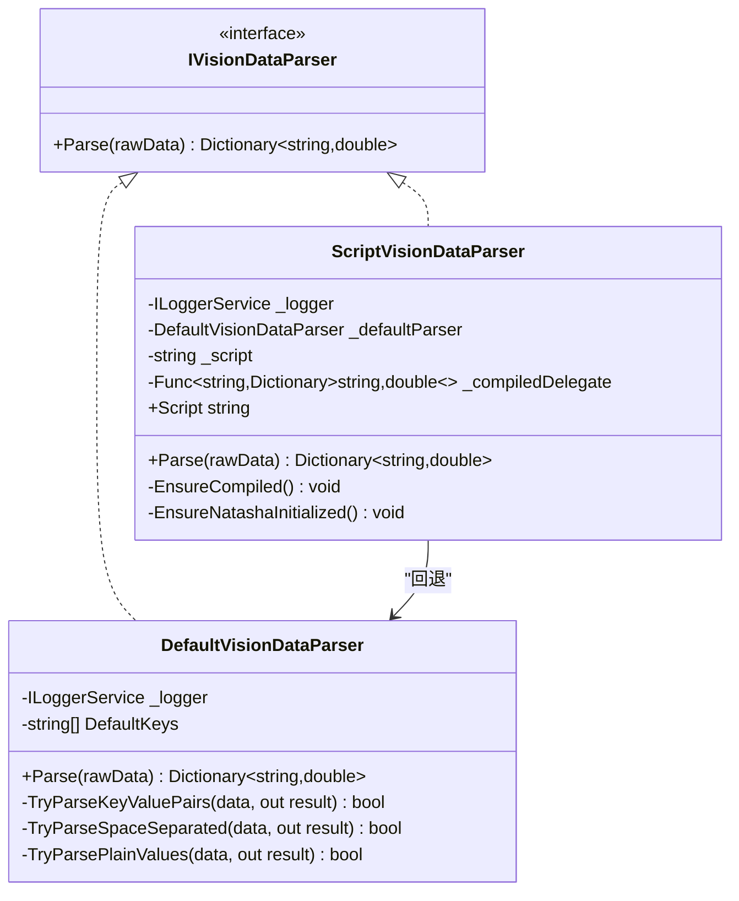
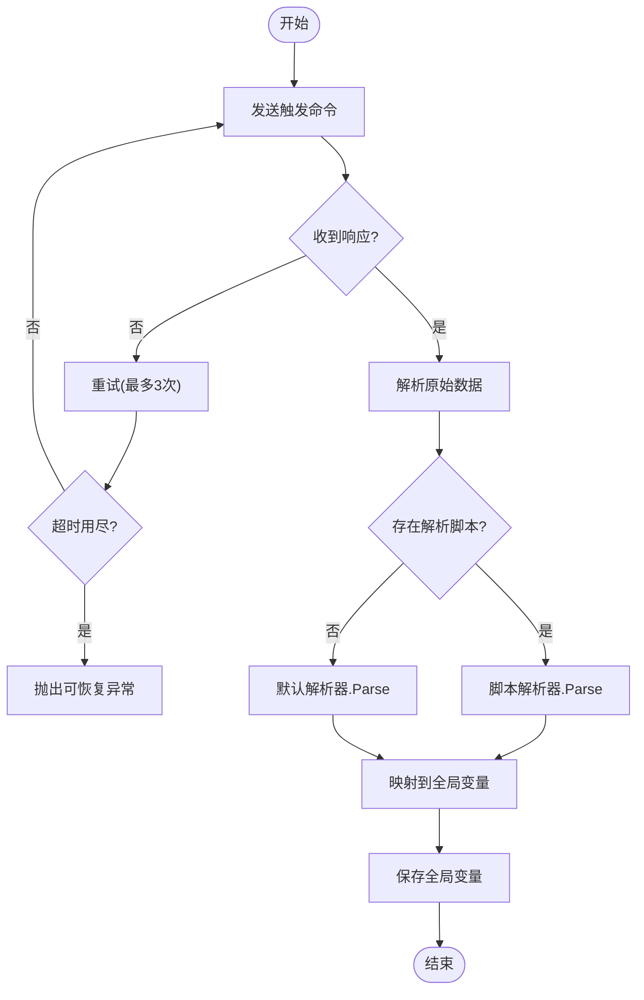
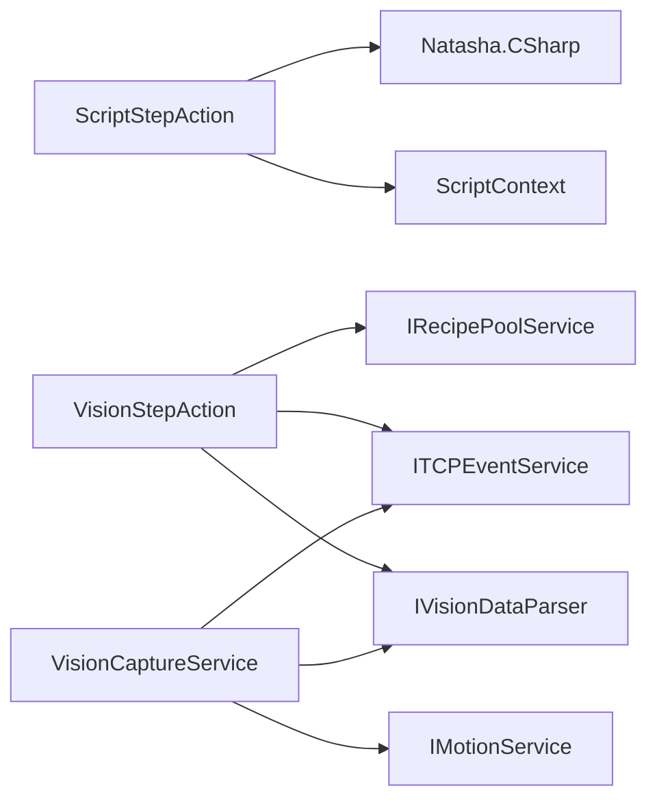

# 脚本上下文管理

<cite>
**本文档引用的文件**
- [ScriptContext.cs](file://StationTasks/Models/ScriptContext.cs)
- [ScriptStepAction.cs](file://StationTasks/Actions/ScriptStepAction.cs)
- [VisionStepAction.cs](file://StationTasks/Actions/VisionStepAction.cs)
- [IVisionDataParser.cs](file://StationTasks/Services/IVisionDataParser.cs)
- [DefaultVisionDataParser.cs](file://StationTasks/Services/DefaultVisionDataParser.cs)
- [ScriptVisionDataParser.cs](file://StationTasks/Services/ScriptVisionDataParser.cs)
- [VisionCaptureService.cs](file://StationTasks/Services/VisionCaptureService.cs)
- [Strings.zh-CN.xaml](file://MainApp/Languages/Strings.zh-CN.xaml)
- [Strings.en-US.xaml](file://MainApp/Languages/Strings.en-US.xaml)
- [App.xaml.cs](file://MainApp/App.xaml.cs)
- [MotionService.cs](file://MotionControl/Services/MotionService.cs)
- [IMotionService.cs](file://MotionControl/Interfaces/IMotionService.cs)
</cite>

## 目录
1. [简介](#简介)
2. [项目结构](#项目结构)
3. [核心组件](#核心组件)
4. [架构总览](#架构总览)
5. [详细组件分析](#详细组件分析)
6. [依赖关系分析](#依赖关系分析)
7. [性能考量](#性能考量)
8. [故障排查指南](#故障排查指南)
9. [结论](#结论)

## 简介
本文件系统性阐述脚本上下文管理的设计与实现，围绕以下主题展开：
- ScriptContext 的设计原理：上下文状态管理、变量存储、作用域控制
- 脚本执行环境搭建：数据解析器、函数库、内置对象
- 视觉数据解析器：默认解析器与脚本专用解析器的差异与应用场景
- 脚本安全执行机制：沙箱隔离、资源限制、超时控制
- 调试支持、错误定位、性能分析
- 脚本与硬件设备的交互方式与数据流转

## 项目结构
本项目采用模块化分层架构，脚本上下文管理主要涉及 StationTasks 模块中的模型、动作与服务层，以及与 MotionControl 和 TCPIPModule 的交互。

**图表来源**
- [ScriptStepAction.cs:1-206](file://StationTasks/Actions/ScriptStepAction.cs#L1-L206)
- [VisionStepAction.cs:1-223](file://StationTasks/Actions/VisionStepAction.cs#L1-L223)
- [ScriptContext.cs:1-147](file://StationTasks/Models/ScriptContext.cs#L1-L147)
- [IVisionDataParser.cs:1-18](file://StationTasks/Services/IVisionDataParser.cs#L1-L18)
- [DefaultVisionDataParser.cs:1-135](file://StationTasks/Services/DefaultVisionDataParser.cs#L1-L135)
- [ScriptVisionDataParser.cs:1-133](file://StationTasks/Services/ScriptVisionDataParser.cs#L1-L133)
- [VisionCaptureService.cs:1-193](file://StationTasks/Services/VisionCaptureService.cs#L1-L193)
- [IMotionService.cs:31-65](file://MotionControl/Interfaces/IMotionService.cs#L31-L65)
- [MotionService.cs:163-592](file://MotionControl/Services/MotionService.cs#L163-L592)

**章节来源**
- [ScriptContext.cs:1-147](file://StationTasks/Models/ScriptContext.cs#L1-L147)
- [ScriptStepAction.cs:1-206](file://StationTasks/Actions/ScriptStepAction.cs#L1-L206)
- [VisionStepAction.cs:1-223](file://StationTasks/Actions/VisionStepAction.cs#L1-L223)
- [IVisionDataParser.cs:1-18](file://StationTasks/Services/IVisionDataParser.cs#L1-L18)
- [DefaultVisionDataParser.cs:1-135](file://StationTasks/Services/DefaultVisionDataParser.cs#L1-L135)
- [ScriptVisionDataParser.cs:1-133](file://StationTasks/Services/ScriptVisionDataParser.cs#L1-L133)
- [VisionCaptureService.cs:1-193](file://StationTasks/Services/VisionCaptureService.cs#L1-L193)
- [IMotionService.cs:31-65](file://MotionControl/Interfaces/IMotionService.cs#L31-L65)
- [MotionService.cs:163-592](file://MotionControl/Services/MotionService.cs#L163-L592)

## 核心组件
- ScriptContext：封装全局变量与步骤输出参数的读写，提供类型安全的读取与变更检测能力
- ScriptStepAction：基于 Natasha 动态编译执行 C# 脚本，遵循约定类名与方法签名
- 视觉数据解析器族：IVisionDataParser 接口及其实现，支持默认解析器与脚本解析器
- VisionStepAction：负责视觉触发、数据解析与全局变量映射
- VisionCaptureService：封装运动控制与视觉捕获流程，提供统一的捕获结果

**章节来源**
- [ScriptContext.cs:11-147](file://StationTasks/Models/ScriptContext.cs#L11-L147)
- [ScriptStepAction.cs:22-206](file://StationTasks/Actions/ScriptStepAction.cs#L22-L206)
- [IVisionDataParser.cs:8-16](file://StationTasks/Services/IVisionDataParser.cs#L8-L16)
- [DefaultVisionDataParser.cs:14-135](file://StationTasks/Services/DefaultVisionDataParser.cs#L14-L135)
- [ScriptVisionDataParser.cs:14-133](file://StationTasks/Services/ScriptVisionDataParser.cs#L14-L133)
- [VisionStepAction.cs:22-223](file://StationTasks/Actions/VisionStepAction.cs#L22-L223)
- [VisionCaptureService.cs:19-193](file://StationTasks/Services/VisionCaptureService.cs#L19-L193)

## 架构总览
脚本上下文管理贯穿“读取全局变量 → 动态编译脚本 → 执行脚本 → 写回全局变量”的闭环，并与视觉数据解析、硬件交互紧密耦合。

**图表来源**
- [ScriptStepAction.cs:48-131](file://StationTasks/Actions/ScriptStepAction.cs#L48-L131)
- [ScriptContext.cs:23-144](file://StationTasks/Models/ScriptContext.cs#L23-L144)
- [VisionStepAction.cs:46-75](file://StationTasks/Actions/VisionStepAction.cs#L46-L75)
- [IVisionDataParser.cs:10-15](file://StationTasks/Services/IVisionDataParser.cs#L10-L15)
- [DefaultVisionDataParser.cs:27-53](file://StationTasks/Services/DefaultVisionDataParser.cs#L27-L53)
- [ScriptVisionDataParser.cs:41-59](file://StationTasks/Services/ScriptVisionDataParser.cs#L41-L59)
- [VisionCaptureService.cs:37-147](file://StationTasks/Services/VisionCaptureService.cs#L37-L147)

## 详细组件分析

### ScriptContext 设计与实现
- 上下文状态管理
  - 维护全局变量字典与步骤输出字典
  - 构造时生成快照，便于后续变更检测
- 变量存储与作用域
  - 读取：提供 GetDouble/GetInt/GetString/GetBool 系列方法，支持默认值与类型转换
  - 写入：提供 Set(string/double/int/bool) 重载，自动转换为字符串并记录变更
  - 作用域：通过构造参数注入，限定在单次脚本执行周期内有效
- 变更检测
  - GetChanges() 比较快照与当前全局变量，返回所有变更项，支持直接修改未通过 Set 的回写

**图表来源**
- [ScriptContext.cs:11-147](file://StationTasks/Models/ScriptContext.cs#L11-L147)

**章节来源**
- [ScriptContext.cs:11-147](file://StationTasks/Models/ScriptContext.cs#L11-L147)

### 脚本执行环境与安全机制
- 执行环境搭建
  - 使用 Natasha.CSharp 进行动态编译，支持流式编译与错误日志
  - 严格约定类名与方法签名：ScriptAction.Execute(ScriptContext ctx) 必须存在且返回 bool
- 安全执行机制
  - 沙箱隔离：编译域使用随机域，避免跨脚本污染
  - 资源限制：通过编译器错误与语法错误拦截，防止非法代码进入运行期
  - 超时控制：脚本执行本身不内置超时，但可通过外部取消令牌中断长时间运行（见脚本调用处）

**图表来源**
- [ScriptStepAction.cs:136-190](file://StationTasks/Actions/ScriptStepAction.cs#L136-L190)
- [ScriptStepAction.cs:195-204](file://StationTasks/Actions/ScriptStepAction.cs#L195-L204)

**章节来源**
- [ScriptStepAction.cs:136-190](file://StationTasks/Actions/ScriptStepAction.cs#L136-L190)
- [ScriptStepAction.cs:195-204](file://StationTasks/Actions/ScriptStepAction.cs#L195-L204)

### 视觉数据解析器体系
- 接口定义
  - IVisionDataParser：统一 Parse 契约，返回键值对
- 默认解析器
  - 支持三种格式：key=value、空格分隔 key value、纯逗号分隔值
  - 自动映射默认键名（X, Y, U, Distance），并进行类型转换
- 脚本解析器
  - 用户编写完整 C# 类 VisionParseScript，包含静态 Parse(string) 方法
  - 与默认解析器互斥：无脚本时走默认解析器，有脚本时动态编译执行

**图表来源**
- [IVisionDataParser.cs:8-16](file://StationTasks/Services/IVisionDataParser.cs#L8-L16)
- [DefaultVisionDataParser.cs:14-135](file://StationTasks/Services/DefaultVisionDataParser.cs#L14-L135)
- [ScriptVisionDataParser.cs:14-133](file://StationTasks/Services/ScriptVisionDataParser.cs#L14-L133)

**章节来源**
- [IVisionDataParser.cs:8-16](file://StationTasks/Services/IVisionDataParser.cs#L8-L16)
- [DefaultVisionDataParser.cs:14-135](file://StationTasks/Services/DefaultVisionDataParser.cs#L14-L135)
- [ScriptVisionDataParser.cs:14-133](file://StationTasks/Services/ScriptVisionDataParser.cs#L14-L133)

### 脚本与硬件交互流程
- 视觉触发与数据解析
  - VisionStepAction 通过 TCPIP 发送触发命令并等待响应，支持超时重试
  - 解析阶段根据是否存在自定义解析脚本选择默认解析器或脚本解析器
- 全局变量映射与持久化
  - 将解析结果映射到全局变量，写回配方池
- 运动控制集成
  - VisionCaptureService 在捕获前后控制轴运动，确保安全高度与待机位

**图表来源**
- [VisionStepAction.cs:81-143](file://StationTasks/Actions/VisionStepAction.cs#L81-L143)
- [VisionStepAction.cs:148-172](file://StationTasks/Actions/VisionStepAction.cs#L148-L172)
- [DefaultVisionDataParser.cs:27-53](file://StationTasks/Services/DefaultVisionDataParser.cs#L27-L53)
- [ScriptVisionDataParser.cs:41-59](file://StationTasks/Services/ScriptVisionDataParser.cs#L41-L59)
- [VisionCaptureService.cs:37-147](file://StationTasks/Services/VisionCaptureService.cs#L37-L147)

**章节来源**
- [VisionStepAction.cs:81-143](file://StationTasks/Actions/VisionStepAction.cs#L81-L143)
- [VisionStepAction.cs:148-172](file://StationTasks/Actions/VisionStepAction.cs#L148-L172)
- [VisionCaptureService.cs:37-147](file://StationTasks/Services/VisionCaptureService.cs#L37-L147)

## 依赖关系分析
- 组件耦合
  - ScriptStepAction 依赖 ScriptContext 与 Natasha 编译器
  - VisionStepAction 依赖 IVisionDataParser、ITCPEventService、IRecipePoolService
  - VisionCaptureService 依赖 IMotionService、ITCPEventService、IVisionDataParser
- 外部依赖
  - Natasha.CSharp：动态编译
  - TCPIPModule：网络通信
  - MotionControl：运动控制

**图表来源**
- [ScriptStepAction.cs:3-14](file://StationTasks/Actions/ScriptStepAction.cs#L3-L14)
- [VisionStepAction.cs:1-14](file://StationTasks/Actions/VisionStepAction.cs#L1-L14)
- [VisionCaptureService.cs:1-9](file://StationTasks/Services/VisionCaptureService.cs#L1-L9)

**章节来源**
- [ScriptStepAction.cs:3-14](file://StationTasks/Actions/ScriptStepAction.cs#L3-L14)
- [VisionStepAction.cs:1-14](file://StationTasks/Actions/VisionStepAction.cs#L1-L14)
- [VisionCaptureService.cs:1-9](file://StationTasks/Services/VisionCaptureService.cs#L1-L9)

## 性能考量
- 编译缓存与复用
  - ScriptStepAction 与 ScriptVisionDataParser 仅在脚本内容变化时重新编译，避免重复编译开销
- 类型转换与解析策略
  - ScriptContext 的读取方法采用文化无关的解析，减少异常与回退成本
  - 默认解析器优先尝试 key=value 格式，失败后再尝试其他格式，提升命中率
- 异常与日志
  - 统一使用可恢复异常（RecoverableException）传递错误信息，便于上层处理
  - 应用级未捕获异常通过 App.xaml.cs 统一处理，生成错误报告并优雅关闭

**章节来源**
- [ScriptStepAction.cs:136-190](file://StationTasks/Actions/ScriptStepAction.cs#L136-L190)
- [ScriptVisionDataParser.cs:63-118](file://StationTasks/Services/ScriptVisionDataParser.cs#L63-L118)
- [DefaultVisionDataParser.cs:27-53](file://StationTasks/Services/DefaultVisionDataParser.cs#L27-L53)
- [App.xaml.cs:350-387](file://MainApp/App.xaml.cs#L350-L387)

## 故障排查指南
- 脚本编译失败
  - 现象：编译失败或找不到约定类/方法
  - 排查：确认类名与方法签名符合约定；查看日志中的编译错误
  - 参考路径：[ScriptStepAction.cs:145-189](file://StationTasks/Actions/ScriptStepAction.cs#L145-L189)
- 脚本运行时异常
  - 现象：脚本执行抛出异常
  - 排查：检查变量名、类型转换、返回值；查看日志建议
  - 参考路径：[ScriptStepAction.cs:70-86](file://StationTasks/Actions/ScriptStepAction.cs#L70-L86)
- 视觉解析失败
  - 现象：解析器无法识别数据格式
  - 排查：检查原始数据格式；必要时使用默认解析器；查看日志提示
  - 参考路径：[DefaultVisionDataParser.cs:27-53](file://StationTasks/Services/DefaultVisionDataParser.cs#L27-L53)，[ScriptVisionDataParser.cs:41-59](file://StationTasks/Services/ScriptVisionDataParser.cs#L41-L59)
- 视觉超时与重试
  - 现象：等待响应超时，自动重试
  - 排查：检查网络连接、超时设置；确认视觉系统在线
  - 参考路径：[VisionStepAction.cs:81-143](file://StationTasks/Actions/VisionStepAction.cs#L81-L143)
- 全局变量映射失败
  - 现象：映射键不存在或全局变量不存在
  - 排查：核对映射配置与解析结果键名；确认全局变量存在
  - 参考路径：[VisionStepAction.cs:177-220](file://StationTasks/Actions/VisionStepAction.cs#L177-L220)

**章节来源**
- [ScriptStepAction.cs:70-86](file://StationTasks/Actions/ScriptStepAction.cs#L70-L86)
- [ScriptStepAction.cs:145-189](file://StationTasks/Actions/ScriptStepAction.cs#L145-L189)
- [DefaultVisionDataParser.cs:27-53](file://StationTasks/Services/DefaultVisionDataParser.cs#L27-L53)
- [ScriptVisionDataParser.cs:41-59](file://StationTasks/Services/ScriptVisionDataParser.cs#L41-L59)
- [VisionStepAction.cs:81-143](file://StationTasks/Actions/VisionStepAction.cs#L81-L143)
- [VisionStepAction.cs:177-220](file://StationTasks/Actions/VisionStepAction.cs#L177-L220)

## 结论
脚本上下文管理通过 ScriptContext 提供了类型安全、易用的变量访问与变更检测能力；结合 Natasha 的动态编译与严格的约定，实现了安全可控的脚本执行环境。视觉数据解析器体系兼顾通用性与扩展性，默认解析器覆盖常见格式，脚本解析器满足复杂场景需求。与 MotionControl 和 TCPIPModule 的集成确保了脚本与硬件的协同工作。通过完善的错误处理与日志体系，系统具备良好的可维护性与可诊断性。