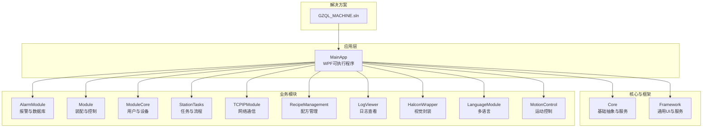
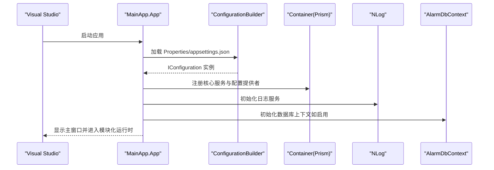
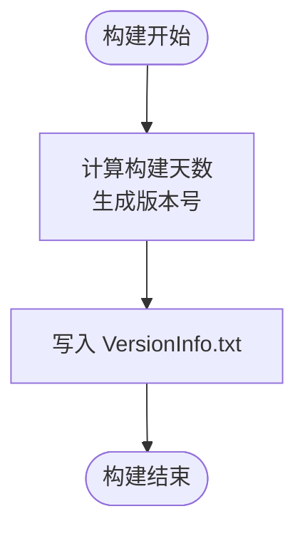
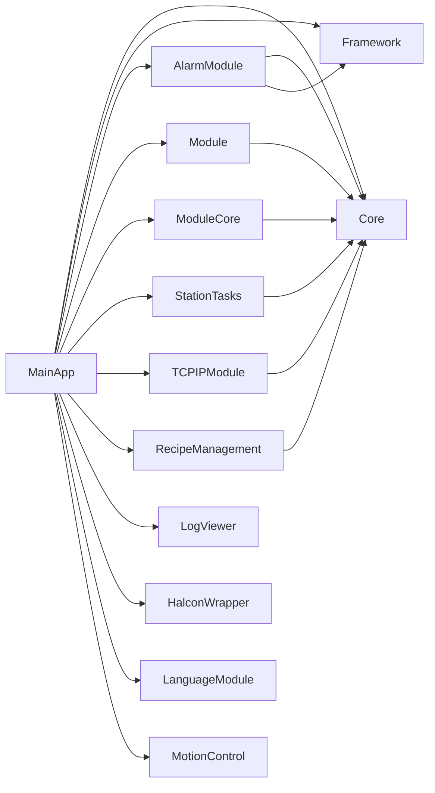

# 开发环境配置

<cite>
**本文档引用的文件**
- [Directory.Build.props](file://Directory.Build.props)
- [GZQL_MACHINE.sln](file://GZQL_MACHINE.sln)
- [MainApp.csproj](file://MainApp/MainApp.csproj)
- [Core.csproj](file://Core/Core.csproj)
- [Framework.csproj](file://Framework/Framework.csproj)
- [AlarmModule.csproj](file://AlarmModule/AlarmModule.csproj)
- [launchSettings.json](file://MainApp/Properties/launchSettings.json)
- [appsettings.json](file://MainApp/Properties/appsettings.json)
- [appsettings.json](file://Core/appsettings.json)
- [NLog.config](file://MainApp/NLog.config)
- [App.xaml.cs](file://MainApp/App.xaml.cs)
- [README.md](file://README.md)
- [build_result.txt](file://build_result.txt)
</cite>

## 目录
1. [简介](#简介)
2. [项目结构](#项目结构)
3. [核心组件](#核心组件)
4. [架构总览](#架构总览)
5. [详细组件分析](#详细组件分析)
6. [依赖关系分析](#依赖关系分析)
7. [性能考虑](#性能考虑)
8. [故障排除指南](#故障排除指南)
9. [结论](#结论)
10. [附录](#附录)

## 简介
本指南面向GZQL_MACHINE项目的开发者，提供从安装到调试的完整开发环境配置说明。内容涵盖：
- Visual Studio与.NET 9.0的安装要求与工具链配置
- 项目构建属性、版本管理策略与NuGet包管理
- 调试与启动配置、环境变量设置
- IDE设置建议、插件推荐与代码格式化配置
- 数据库连接、日志输出与断点调试技巧
- 常见环境问题排查与解决方案

## 项目结构
项目采用多项目解决方案组织，主应用为WPF桌面应用，核心逻辑与模块化功能分布在独立工程中。关键特性包括：
- 目标框架统一为.NET 9.0（Windows/WPF支持）
- 使用Prism进行模块化与依赖注入
- NLog用于日志记录
- Entity Framework Core用于数据库访问（AlarmModule）

**图表来源**
- [GZQL_MACHINE.sln:1-279](file://GZQL_MACHINE.sln#L1-L279)
- [MainApp.csproj:27-40](file://MainApp/MainApp.csproj#L27-L40)

**章节来源**
- [GZQL_MACHINE.sln:1-279](file://GZQL_MACHINE.sln#L1-L279)
- [MainApp.csproj:1-83](file://MainApp/MainApp.csproj#L1-L83)

## 核心组件
- 目标框架与平台
  - 主应用与核心库统一使用 net9.0-windows7.0，确保WPF与Windows特定能力可用
  - 部分模块使用 net9.0-windows，保持兼容性
- 构建属性
  - Debug配置默认 x64 平台，便于本地调试与硬件交互
  - 输出类型为 WinExe，入口程序集名称为主应用
- 版本管理
  - 通过 Directory.Build.props 计算自动版本号，基于自定义起始日期计算构建天数
  - 项目在构建后生成 VersionInfo.txt，记录版本与构建信息
- 日志系统
  - NLog 配置按级别拆分文件，支持归档与大小限制
  - 应用启动时注册日志服务，并在全局异常处理中生成崩溃转储与错误报告

**章节来源**
- [MainApp.csproj:2-12](file://MainApp/MainApp.csproj#L2-L12)
- [Core.csproj:3-9](file://Core/Core.csproj#L3-L9)
- [AlarmModule.csproj:3-8](file://AlarmModule/AlarmModule.csproj#L3-L8)
- [Directory.Build.props:7-16](file://Directory.Build.props#L7-L16)
- [MainApp.csproj:60-73](file://MainApp/MainApp.csproj#L60-L73)
- [NLog.config:1-88](file://MainApp/NLog.config#L1-L88)
- [App.xaml.cs:121-133](file://MainApp/App.xaml.cs#L121-L133)

## 架构总览
下图展示应用启动时的关键组件交互与配置加载流程。

**图表来源**
- [App.xaml.cs:86-94](file://MainApp/App.xaml.cs#L86-L94)
- [App.xaml.cs:110-133](file://MainApp/App.xaml.cs#L110-L133)
- [App.xaml.cs:141-161](file://MainApp/App.xaml.cs#L141-L161)
- [appsettings.json:1-6](file://MainApp/Properties/appsettings.json#L1-L6)
- [NLog.config:1-88](file://MainApp/NLog.config#L1-L88)

## 详细组件分析

### 构建属性与版本管理
- 自动版本策略
  - 通过 BeforeBuild 阶段计算自定义版本号，包含主版本、次版本与构建天数
  - 生成的版本信息写入 VersionInfo.txt，便于发布追踪
- 平台与优化
  - Debug 默认 x64，避免跨平台兼容性问题
  - 未启用优化，便于调试符号与断点命中

**图表来源**
- [Directory.Build.props:7-16](file://Directory.Build.props#L7-L16)
- [MainApp.csproj:60-73](file://MainApp/MainApp.csproj#L60-L73)

**章节来源**
- [Directory.Build.props:1-18](file://Directory.Build.props#L1-L18)
- [MainApp.csproj:60-73](file://MainApp/MainApp.csproj#L60-L73)

### NuGet 包管理与依赖
- 关键包概览
  - Prism.Wpf/Prism.DryIoc/Prism.Unity：模块化与依赖注入
  - MaterialDesignThemes/MaterialDesignColors：主题与UI
  - NLog：日志记录
  - Microsoft.Extensions.Configuration/DependencyInjection.Abstractions：配置与DI
  - Newtonsoft.Json：序列化
  - MathNet.Numerics、OpenCvSharp4、EPPlus、CsvHelper 等：算法与数据处理
- 版本冲突提示
  - 构建结果中出现 Newtonsoft.Json 版本不一致警告，需统一版本或调整包引用

**章节来源**
- [Core.csproj:11-18](file://Core/Core.csproj#L11-L18)
- [Framework.csproj:12-21](file://Framework/Framework.csproj#L12-L21)
- [MainApp.csproj:18-26](file://MainApp/MainApp.csproj#L18-L26)
- [AlarmModule.csproj:10-15](file://AlarmModule/AlarmModule.csproj#L10-L15)
- [build_result.txt:34-113](file://build_result.txt#L34-L113)

### 调试与启动配置
- 启动配置
  - launchSettings.json 指定工作目录与项目启动方式，未启用本机调试
- 调试建议
  - 在 Debug 配置下使用 x64 平台，确保与硬件驱动匹配
  - 设置断点于 App.xaml.cs 的全局异常处理与模块注册处，便于定位启动问题

**章节来源**
- [launchSettings.json:1-9](file://MainApp/Properties/launchSettings.json#L1-L9)
- [MainApp.csproj:9-12](file://MainApp/MainApp.csproj#L9-L12)

### 环境变量与配置文件
- 应用配置
  - MainApp/Properties/appsettings.json 提供数据库连接字符串（AlarmModule）
  - Core/appsettings.json 提供应用设置与数据库连接字符串（Core）
- 配置加载
  - 应用启动时通过 ConfigurationBuilder 加载 JSON 配置文件，支持热重载

**章节来源**
- [appsettings.json:1-6](file://MainApp/Properties/appsettings.json#L1-L6)
- [appsettings.json:1-13](file://Core/appsettings.json#L1-L13)
- [App.xaml.cs:86-94](file://MainApp/App.xaml.cs#L86-L94)

### 日志系统与输出
- NLog 配置
  - 按 Error/Warn/Info/Debug/Trace 分级输出至不同文件
  - 支持单文件大小归档与最大归档数量
  - 忽略 Microsoft/System 命名空间日志，减少噪音
- 应用内日志
  - 启动时记录系统信息与命令行参数
  - 全局异常处理生成崩溃转储与错误报告

**章节来源**
- [NLog.config:1-88](file://MainApp/NLog.config#L1-L88)
- [App.xaml.cs:315-331](file://MainApp/App.xaml.cs#L315-L331)
- [App.xaml.cs:241-298](file://MainApp/App.xaml.cs#L241-L298)
- [App.xaml.cs:379-400](file://MainApp/App.xaml.cs#L379-L400)

### 数据库连接配置
- AlarmModule
  - 连接字符串指向本地 SQL Server 实例，包含信任证书选项
- Core
  - 连接字符串指向本地 SQLite 文件路径
- 建议
  - 如使用 SQLite，请确保文件路径存在且具备读写权限
  - 如使用 SQL Server，请确认凭据与网络连通性

**章节来源**
- [appsettings.json:2-4](file://MainApp/Properties/appsettings.json#L2-L4)
- [appsettings.json:10-12](file://Core/appsettings.json#L10-L12)

### IDE 设置与插件推荐
- Visual Studio
  - 安装 .NET 9.0 SDK 与 WPF/WinForms 工作负载
  - 安装 Prism、Material Design、NLog 等相关扩展（按需）
- 代码格式化
  - 使用 .editorconfig 统一缩进、行尾与命名约定（部分项目包含）
  - 建议启用“格式化文档”与“保存时格式化”
- 调试增强
  - 启用“仅我的代码”以便聚焦业务代码
  - 设置条件断点与数据断点，结合日志快速定位问题

[本节为通用实践建议，不直接分析具体文件，故无章节来源]

## 依赖关系分析
项目采用显式项目引用与NuGet包引用相结合的方式组织依赖。

**图表来源**
- [MainApp.csproj:27-40](file://MainApp/MainApp.csproj#L27-L40)
- [AlarmModule.csproj:17-20](file://AlarmModule/AlarmModule.csproj#L17-L20)
- [Framework.csproj:27-29](file://Framework/Framework.csproj#L27-L29)

**章节来源**
- [MainApp.csproj:27-40](file://MainApp/MainApp.csproj#L27-L40)
- [AlarmModule.csproj:17-20](file://AlarmModule/AlarmModule.csproj#L17-L20)
- [Framework.csproj:27-29](file://Framework/Framework.csproj#L27-L29)

## 性能考虑
- 日志开销
  - NLog 分级输出与归档策略有助于降低磁盘压力，建议在生产环境适当提高日志级别
- 启动性能
  - 模块化加载与延迟初始化可减少启动时间；避免在 App.OnInitialized 中执行阻塞操作
- 调试优化
  - Debug 配置下启用 x64，避免不必要的平台切换成本

[本节为通用指导，不直接分析具体文件，故无章节来源]

## 故障排除指南
- 版本冲突（Newtonsoft.Json）
  - 现象：构建警告提示版本不一致
  - 解决：统一项目中 Newtonsoft.Json 版本，或调整包引用以消除冲突
- 数据库连接失败
  - 检查 appsettings.json 中的连接字符串是否正确
  - 确认数据库服务已启动且凭据有效
- 日志文件未生成
  - 确认 NLog.config 配置正确，工作目录具有写权限
  - 检查日志级别与规则映射
- 启动异常
  - 查看全局异常处理生成的崩溃转储与错误报告
  - 结合 NLog 中的 Trace/Error 日志定位问题

**章节来源**
- [build_result.txt:34-113](file://build_result.txt#L34-L113)
- [appsettings.json:2-4](file://MainApp/Properties/appsettings.json#L2-L4)
- [NLog.config:1-88](file://MainApp/NLog.config#L1-L88)
- [App.xaml.cs:241-298](file://MainApp/App.xaml.cs#L241-L298)
- [App.xaml.cs:379-400](file://MainApp/App.xaml.cs#L379-L400)

## 结论
本指南提供了GZQL_MACHINE项目从安装到调试的完整开发环境配置方法。遵循本文档的步骤，可确保：
- 正确安装与配置 Visual Studio 与 .NET 9.0
- 项目构建属性、版本管理与NuGet包管理符合预期
- 调试与启动配置、日志输出与数据库连接满足开发需求
- 常见问题能够快速定位与解决

## 附录

### 安装与工具链要求
- Visual Studio 2022（版本 17.12+）
- .NET 9.0 SDK
- Windows 10/11（WPF支持）
- 可选：SQL Server/SQLite（根据模块需求）

**章节来源**
- [README.md:1-66](file://README.md#L1-L66)

### 关键文件清单与用途
- Directory.Build.props：自动版本号计算
- GZQL_MACHINE.sln：解决方案文件
- MainApp.csproj：主应用项目
- Core.csproj：核心库
- Framework.csproj：通用UI与服务
- AlarmModule.csproj：报警与数据库模块
- launchSettings.json：启动配置
- appsettings.json（MainApp）：数据库连接字符串
- appsettings.json（Core）：应用设置与数据库连接
- NLog.config：日志配置
- App.xaml.cs：应用启动与服务注册

**章节来源**
- [Directory.Build.props:1-18](file://Directory.Build.props#L1-L18)
- [GZQL_MACHINE.sln:1-279](file://GZQL_MACHINE.sln#L1-L279)
- [MainApp.csproj:1-83](file://MainApp/MainApp.csproj#L1-L83)
- [Core.csproj:1-44](file://Core/Core.csproj#L1-L44)
- [Framework.csproj:1-38](file://Framework/Framework.csproj#L1-L38)
- [AlarmModule.csproj:1-23](file://AlarmModule/AlarmModule.csproj#L1-L23)
- [launchSettings.json:1-9](file://MainApp/Properties/launchSettings.json#L1-L9)
- [appsettings.json:1-6](file://MainApp/Properties/appsettings.json#L1-L6)
- [appsettings.json:1-13](file://Core/appsettings.json#L1-L13)
- [NLog.config:1-88](file://MainApp/NLog.config#L1-L88)
- [App.xaml.cs:1-460](file://MainApp/App.xaml.cs#L1-L460)