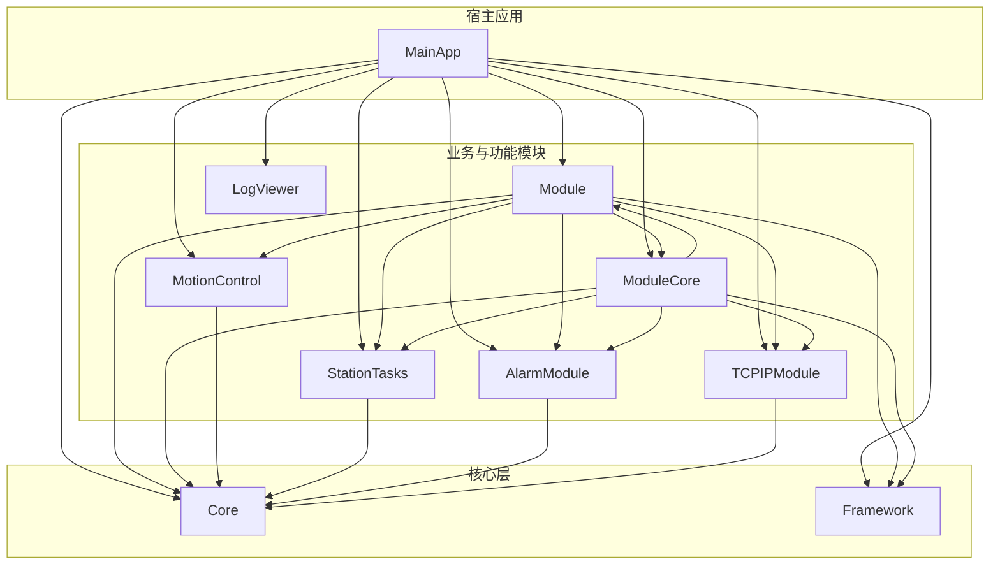
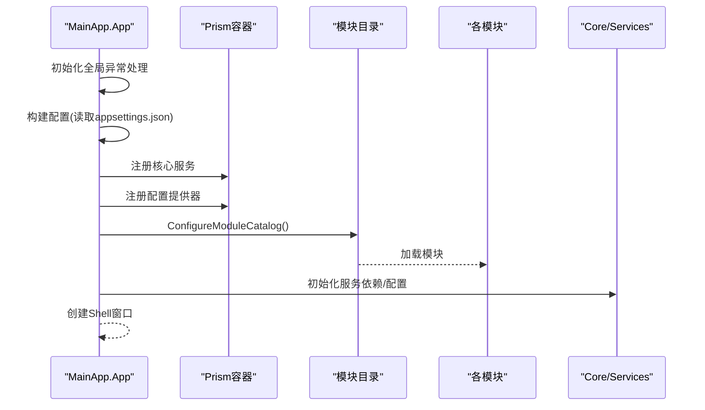
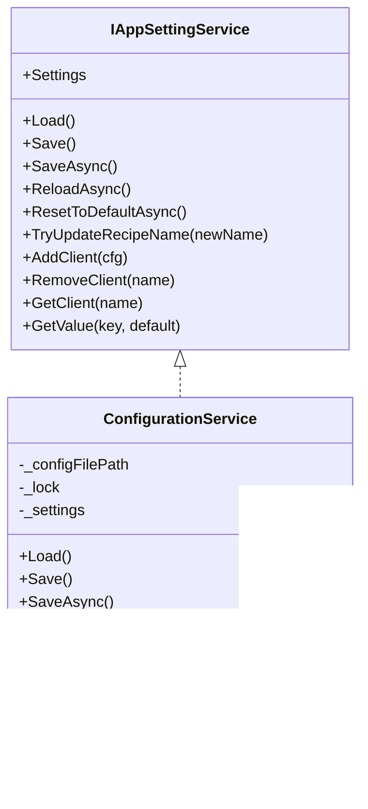
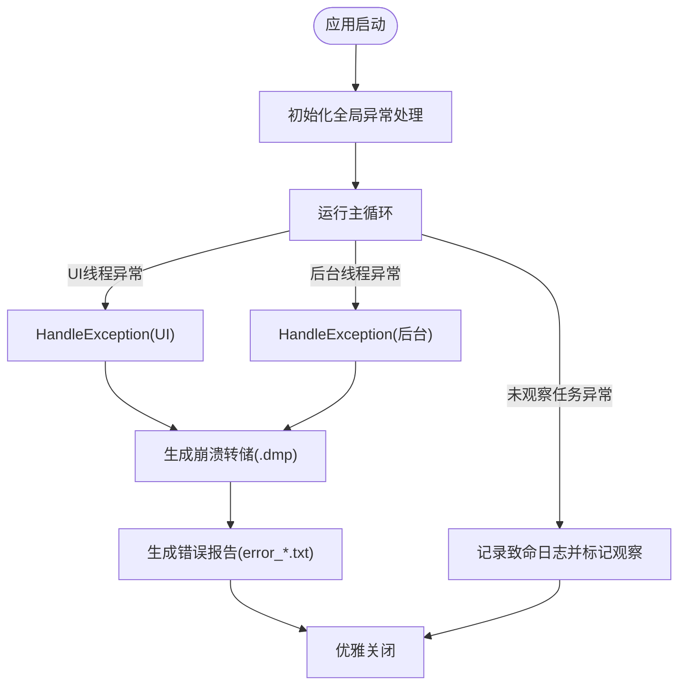
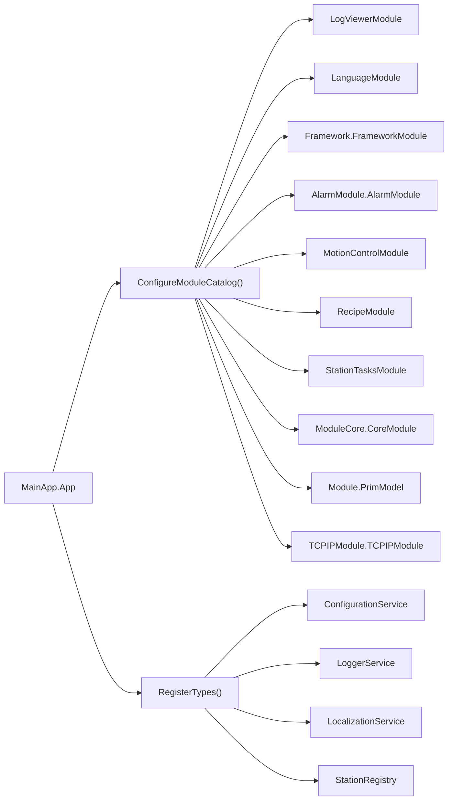
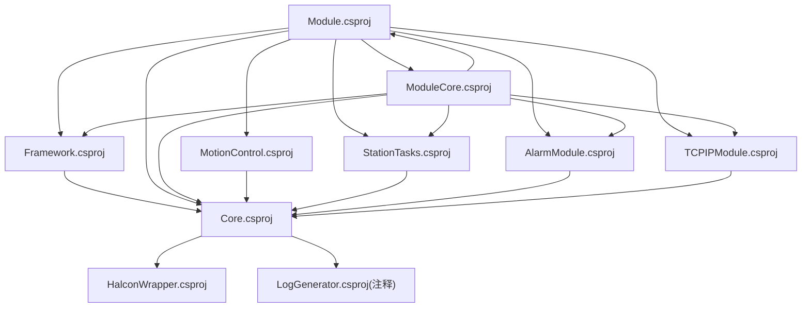

# 开发者指南

<cite>
**本文引用的文件**
- [README.md](file://README.md)
- [Directory.Build.props](file://Directory.Build.props)
- [GZQL_MACHINE.sln](file://GZQL_MACHINE.sln)
- [MainApp/App.xaml.cs](file://MainApp/App.xaml.cs)
- [Core/Core.csproj](file://Core/Core.csproj)
- [Module/Module.csproj](file://Module/Module.csproj)
- [MotionControl/MotionControl.csproj](file://MotionControl/MotionControl.csproj)
- [AlarmModule/AlarmModule.csproj](file://AlarmModule/AlarmModule.csproj)
- [Framework/Framework.csproj](file://Framework/Framework.csproj)
- [ModuleCore/ModuleCore.csproj](file://ModuleCore/ModuleCore.csproj)
- [StationTasks/StationTasks.csproj](file://StationTasks/StationTasks.csproj)
- [Core/Services/ConfigurationService.cs](file://Core/Services/ConfigurationService.cs)
- [Core/Abstraction/IAppSettingService.cs](file://Core/Abstraction/IAppSettingService.cs)
</cite>

## 目录
1. [简介](#简介)
2. [项目结构](#项目结构)
3. [核心组件](#核心组件)
4. [架构总览](#架构总览)
5. [详细组件分析](#详细组件分析)
6. [依赖关系分析](#依赖关系分析)
7. [性能考虑](#性能考虑)
8. [调试与故障排查](#调试与故障排查)
9. [结论](#结论)
10. [附录](#附录)

## 简介
本指南面向GZQL_MACHINE项目的开发者，系统性阐述项目结构、编码规范、调试技巧、构建与依赖管理、版本控制策略、测试与质量保障、代码评审与CI/CD、部署自动化以及常见问题与最佳实践。项目采用WPF与Prism模块化架构，结合多模块协同（运动控制、视觉、配方、报警、语言等），并使用NLog进行日志管理。

## 项目结构
项目采用多工程（多模块）组织方式，通过主应用工程加载各功能模块，形成松耦合的插件式架构。核心模块包括：
- Core：跨模块抽象与通用能力（配置、事件、模型、服务、工具）
- Framework：通用UI与对话框、MVVM基类、转换器等
- Module：业务功能模块（装配、点胶、视觉、IO、对话框等）
- ModuleCore：核心界面与通用控件
- MotionControl：运动控制与状态监控
- StationTasks：工艺步骤执行与脚本化任务
- AlarmModule：报警记录与通知
- TCPIPModule：网络通信
- LogViewer：日志查看
- MainApp：宿主应用，负责模块装载与全局异常处理

图表来源
- [GZQL_MACHINE.sln:1-279](file://GZQL_MACHINE.sln#L1-L279)
- [MainApp/App.xaml.cs:179-191](file://MainApp/App.xaml.cs#L179-L191)

章节来源
- [GZQL_MACHINE.sln:1-279](file://GZQL_MACHINE.sln#L1-L279)
- [README.md:1-66](file://README.md#L1-L66)

## 核心组件
- 配置服务：集中管理应用配置，支持JSON持久化、异步保存与客户端管理
- 日志与异常：统一NLog记录，全局未捕获异常处理与崩溃转储
- 模块化加载：Prism模块目录注册，按需加载各功能模块
- 视觉与相机：OpenCvSharp、Halcon、Basler/MVS相机运行时集成
- 运动控制：多轴卡抽象与状态监控
- 报警与通知：基于数据库的报警记录与通知服务
- 网络通信：TCP客户端/服务器封装
- 语言与本地化：多语言资源与切换

章节来源
- [Core/Services/ConfigurationService.cs:1-220](file://Core/Services/ConfigurationService.cs#L1-L220)
- [Core/Abstraction/IAppSettingService.cs:1-51](file://Core/Abstraction/IAppSettingService.cs#L1-L51)
- [MainApp/App.xaml.cs:179-208](file://MainApp/App.xaml.cs#L179-L208)

## 架构总览
应用启动流程概览如下：

图表来源
- [MainApp/App.xaml.cs:54-72](file://MainApp/App.xaml.cs#L54-L72)
- [MainApp/App.xaml.cs:110-177](file://MainApp/App.xaml.cs#L110-L177)
- [MainApp/App.xaml.cs:179-191](file://MainApp/App.xaml.cs#L179-L191)

章节来源
- [MainApp/App.xaml.cs:54-72](file://MainApp/App.xaml.cs#L54-L72)
- [MainApp/App.xaml.cs:110-177](file://MainApp/App.xaml.cs#L110-L177)
- [MainApp/App.xaml.cs:179-191](file://MainApp/App.xaml.cs#L179-L191)

## 详细组件分析

### 配置服务与应用设置
- 职责：集中管理应用设置（配方名、客户端列表、服务器配置等），提供同步/异步加载与保存
- 关键点：线程安全（锁）、默认配置创建、扩展字段读取、客户端增删查
- 与宿主交互：由App在初始化阶段解析并注入

图表来源
- [Core/Abstraction/IAppSettingService.cs:1-51](file://Core/Abstraction/IAppSettingService.cs#L1-L51)
- [Core/Services/ConfigurationService.cs:1-220](file://Core/Services/ConfigurationService.cs#L1-L220)

章节来源
- [Core/Services/ConfigurationService.cs:1-220](file://Core/Services/ConfigurationService.cs#L1-L220)
- [Core/Abstraction/IAppSettingService.cs:1-51](file://Core/Abstraction/IAppSettingService.cs#L1-L51)

### 全局异常处理与崩溃转储
- 目标：捕获未处理异常，生成崩溃转储与错误报告，优雅关闭
- 机制：WPF Dispatcher、AppDomain、TaskScheduler三类异常捕获；生成.dmp与文本报告；内存监控定时器

图表来源
- [MainApp/App.xaml.cs:234-298](file://MainApp/App.xaml.cs#L234-L298)
- [MainApp/App.xaml.cs:343-415](file://MainApp/App.xaml.cs#L343-L415)
- [MainApp/App.xaml.cs:417-455](file://MainApp/App.xaml.cs#L417-L455)

章节来源
- [MainApp/App.xaml.cs:234-298](file://MainApp/App.xaml.cs#L234-L298)
- [MainApp/App.xaml.cs:343-415](file://MainApp/App.xaml.cs#L343-L415)
- [MainApp/App.xaml.cs:417-455](file://MainApp/App.xaml.cs#L417-L455)

### 模块化加载与依赖注入
- Prism模块目录注册：日志、语言、框架、报警、运动控制、配方、站点任务、核心模块、TCPIP等
- 容器注册：配置服务、日志服务、本地化服务、站注册表等
- 依赖关系：各模块对Core/Framework的引用，部分模块间交叉引用（如ModuleCore依赖多个模块）

图表来源
- [MainApp/App.xaml.cs:179-191](file://MainApp/App.xaml.cs#L179-L191)
- [MainApp/App.xaml.cs:110-177](file://MainApp/App.xaml.cs#L110-L177)

章节来源
- [MainApp/App.xaml.cs:110-177](file://MainApp/App.xaml.cs#L110-L177)
- [MainApp/App.xaml.cs:179-191](file://MainApp/App.xaml.cs#L179-L191)

### 依赖与版本管理
- 目标框架：.NET 9.0（Windows 7+）
- 自动版本生成：基于Build日期的版本号生成逻辑
- 包管理：各模块通过NuGet引入Prism、MaterialDesign、NLog、OpenCvSharp、Halcon等
- 本地运行时：相机SDK（Basler/MVS）与OpenCV运行时通过工程资源或外部目录提供

章节来源
- [Directory.Build.props:1-18](file://Directory.Build.props#L1-L18)
- [Core/Core.csproj:1-44](file://Core/Core.csproj#L1-L44)
- [Module/Module.csproj:1-630](file://Module/Module.csproj#L1-L630)
- [MotionControl/MotionControl.csproj:1-23](file://MotionControl/MotionControl.csproj#L1-L23)
- [AlarmModule/AlarmModule.csproj:1-23](file://AlarmModule/AlarmModule.csproj#L1-L23)
- [Framework/Framework.csproj:1-38](file://Framework/Framework.csproj#L1-L38)
- [ModuleCore/ModuleCore.csproj:1-83](file://ModuleCore/ModuleCore.csproj#L1-L83)
- [StationTasks/StationTasks.csproj:1-36](file://StationTasks/StationTasks.csproj#L1-L36)

## 依赖关系分析
- 模块间依赖：Module与ModuleCore对Core/Framework依赖最深；MotionControl、StationTasks、AlarmModule、TCPIPModule均依赖Core
- 项目引用：通过.csproj中的ProjectReference声明，形成清晰的层次化依赖
- 外部依赖：NLog、Prism、MaterialDesign、OpenCvSharp、Halcon、Newtonsoft.Json等

图表来源
- [Module/Module.csproj:619-629](file://Module/Module.csproj#L619-L629)
- [ModuleCore/ModuleCore.csproj:39-48](file://ModuleCore/ModuleCore.csproj#L39-L48)
- [MotionControl/MotionControl.csproj:17-20](file://MotionControl/MotionControl.csproj#L17-L20)
- [StationTasks/StationTasks.csproj:16-25](file://StationTasks/StationTasks.csproj#L16-L25)
- [AlarmModule/AlarmModule.csproj:17-20](file://AlarmModule/AlarmModule.csproj#L17-L20)
- [Core/Core.csproj:20-41](file://Core/Core.csproj#L20-L41)

章节来源
- [Module/Module.csproj:619-629](file://Module/Module.csproj#L619-L629)
- [ModuleCore/ModuleCore.csproj:39-48](file://ModuleCore/ModuleCore.csproj#L39-L48)
- [MotionControl/MotionControl.csproj:17-20](file://MotionControl/MotionControl.csproj#L17-L20)
- [StationTasks/StationTasks.csproj:16-25](file://StationTasks/StationTasks.csproj#L16-L25)
- [AlarmModule/AlarmModule.csproj:17-20](file://AlarmModule/AlarmModule.csproj#L17-L20)
- [Core/Core.csproj:20-41](file://Core/Core.csproj#L20-L41)

## 性能考虑
- 内存监控：启动定时器每分钟记录工作集，便于定位内存泄漏
- 异常处理：未观察任务异常记录致命日志并避免UI阻塞
- I/O与序列化：配置服务使用异步保存，避免阻塞主线程
- 图像与相机：相机运行时与OpenCV/Halcon库的加载与释放需谨慎，避免资源泄露

章节来源
- [MainApp/App.xaml.cs:333-341](file://MainApp/App.xaml.cs#L333-L341)
- [MainApp/App.xaml.cs:357-361](file://MainApp/App.xaml.cs#L357-L361)
- [Core/Services/ConfigurationService.cs:84-93](file://Core/Services/ConfigurationService.cs#L84-L93)

## 调试与故障排查
- 快速定位
  - 查看NLog输出目录与错误报告文件夹
  - 检查崩溃转储（CrashDumps）与错误报告（ErrorReports）
- 常见问题
  - 相机运行时缺失：根据README指引准备Basler/MVS与OpenCV运行时
  - 配置加载失败：确认Config/appsettings.JSON存在且格式正确
  - 模块未加载：检查ConfigureModuleCatalog注册项与模块项目引用
- 调试建议
  - 使用内存监控日志判断内存增长趋势
  - 在异常处理中增加更详细的上下文信息（如设备状态、配方名等）

章节来源
- [README.md:28-66](file://README.md#L28-L66)
- [MainApp/App.xaml.cs:259-298](file://MainApp/App.xaml.cs#L259-L298)
- [MainApp/App.xaml.cs:396-400](file://MainApp/App.xaml.cs#L396-L400)
- [Core/Services/ConfigurationService.cs:153-175](file://Core/Services/ConfigurationService.cs#L153-L175)

## 结论
本指南提供了从架构到实现、从开发到运维的全链路参考。建议团队在日常开发中遵循统一的模块化约定、日志与异常处理规范，并在CI/CD流水线中加入静态分析与基础回归测试，确保多模块协同的稳定性与可维护性。

## 附录

### 编码规范与最佳实践
- 命名与分层
  - 接口以“I”前缀，服务以“Service”后缀，视图模型以“ViewModel”后缀
  - 模块内按功能域划分目录（ViewModels/Views/Services/Converters等）
- 配置与资源
  - 配置文件集中于Config与Properties，避免硬编码
  - 多语言资源使用XAML资源字典管理
- 日志与异常
  - 统一使用NLog，关键路径记录Info/Debug/Warn/Error/Fatal
  - 未捕获异常必须生成转储与报告
- 模块化
  - 通过Prism模块目录注册新模块，保持低耦合
  - 模块间通信尽量通过事件总线或服务接口

### 测试策略
- 单元测试
  - 针对纯函数与服务类（如ConfigurationService）编写单元测试，覆盖加载/保存/客户端管理等场景
- 集成测试
  - 模拟模块加载与配置初始化，验证模块间依赖与事件传递
- 性能测试
  - 记录内存与CPU曲线，识别长时运行风险点

### 代码评审清单
- 依赖与引用：是否仅引用必要模块，避免循环依赖
- 异常处理：是否覆盖所有可能异常路径并记录日志
- 资源管理：相机/图像/Halcon句柄是否正确释放
- 配置健壮性：默认配置创建、字段校验、扩展字段读取
- 可测试性：服务是否可通过接口替换，便于注入测试

### 持续集成与部署
- 版本号生成：基于构建日期自动计算版本号，确保可追溯
- 构建平台：支持Debug/Release与x64/x86，注意相机运行时与OpenCV库的打包
- 部署要点：确保相机SDK与OpenCV运行时随应用发布，避免运行时缺失

章节来源
- [Directory.Build.props:7-16](file://Directory.Build.props#L7-L16)
- [Module/Module.csproj:7-11](file://Module/Module.csproj#L7-L11)
- [README.md:28-66](file://README.md#L28-L66)