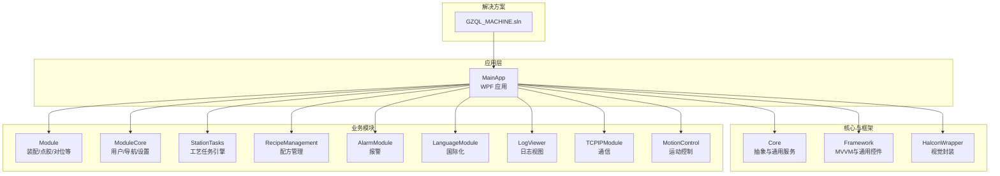
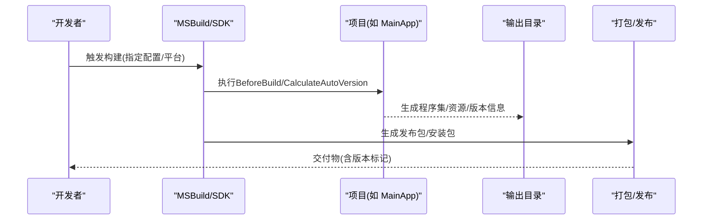
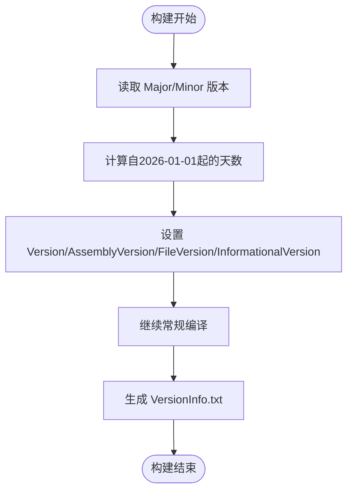
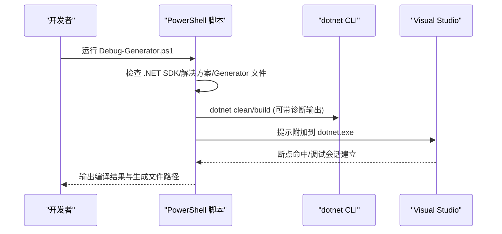
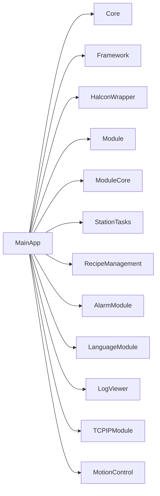

# 构建与部署流程

<cite>
**本文引用的文件**
- [Directory.Build.props](file://Directory.Build.props)
- [GZQL_MACHINE.sln](file://GZQL_MACHINE.sln)
- [MainApp.csproj](file://MainApp/MainApp.csproj)
- [Core.csproj](file://Core/Core.csproj)
- [Debug-Generator.ps1](file://LogGenerator/Debug-Generator.ps1)
- [scan_lang_keys.ps1](file://scan_lang_keys.ps1)
- [README.md](file://README.md)
</cite>

## 目录
1. [简介](#简介)
2. [项目结构](#项目结构)
3. [核心组件](#核心组件)
4. [架构总览](#架构总览)
5. [详细组件分析](#详细组件分析)
6. [依赖关系分析](#依赖关系分析)
7. [性能考虑](#性能考虑)
8. [故障排查指南](#故障排查指南)
9. [结论](#结论)
10. [附录](#附录)

## 简介
本文件面向GZQL_MACHINE项目的标准化构建与部署流程，覆盖MSBuild配置、编译选项、输出目录、发布配置、安装包制作、版本打包、CI/CD流水线、自动化构建与质量门禁、部署脚本与环境配置管理、回滚策略、性能优化、依赖处理、安全加固、多环境部署、热更新机制、监控告警以及部署验证、UAT与上线后监控等主题。文档基于仓库中的实际项目文件与脚本进行梳理，并提供可视化图示帮助理解。

## 项目结构
GZQL_MACHINE采用多项目解决方案组织，主应用为WPF桌面应用，核心模块化设计，包含视觉、运动控制、配方管理、报警、语言国际化、日志查看等多个子模块。解决方案文件定义了完整的项目拓扑与平台配置。

图表来源
- [GZQL_MACHINE.sln:1-279](file://GZQL_MACHINE.sln#L1-L279)

章节来源
- [GZQL_MACHINE.sln:1-279](file://GZQL_MACHINE.sln#L1-L279)

## 核心组件
- 版本与自动版本生成：通过全局属性与目标在构建前计算版本号，确保每次构建生成唯一版本标识。
- 主应用工程：定义WPF输出类型、目标框架、依赖注入与UI框架、项目间引用及构建后版本信息生成。
- 核心工程：定义公共抽象、依赖注入、数学与日志等基础能力，并通过显式引用共享DLL以减少重复打包。
- 调试辅助脚本：提供Roslyn Source Generator调试脚本，支持一键编译与附加调试，便于开发阶段定位生成器问题。
- 语言键扫描脚本：用于扫描XAML与C#中使用的本地化键，识别缺失、冗余与未使用键，保障国际化一致性。

章节来源
- [Directory.Build.props:1-18](file://Directory.Build.props#L1-L18)
- [MainApp.csproj:1-83](file://MainApp/MainApp.csproj#L1-L83)
- [Core.csproj:1-44](file://Core/Core.csproj#L1-L44)
- [Debug-Generator.ps1:1-211](file://LogGenerator/Debug-Generator.ps1#L1-L211)
- [scan_lang_keys.ps1:1-163](file://scan_lang_keys.ps1#L1-L163)

## 架构总览
下图展示从构建到部署的关键路径：版本生成、编译、产物收集、打包与发布。

图表来源
- [Directory.Build.props:7-16](file://Directory.Build.props#L7-L16)
- [MainApp.csproj:60-73](file://MainApp/MainApp.csproj#L60-L73)

## 详细组件分析

### 版本与自动版本生成
- 全局版本策略：通过全局属性定义主次版本号，构建前通过目标计算“自增构建号”，并同步生成程序集版本、文件版本与信息版本。
- 构建后版本信息：主应用在构建完成后生成版本信息文本文件，包含构建版本、时间与配置，便于发布追踪。

图表来源
- [Directory.Build.props:7-16](file://Directory.Build.props#L7-L16)
- [MainApp.csproj:60-73](file://MainApp/MainApp.csproj#L60-L73)

章节来源
- [Directory.Build.props:1-18](file://Directory.Build.props#L1-L18)
- [MainApp.csproj:60-73](file://MainApp/MainApp.csproj#L60-L73)

### 主应用工程配置
- 输出类型与目标框架：WinExe + WPF + .NET 9.0 Windows 7.0。
- 调试配置平台：强制x64，便于与硬件驱动与第三方库匹配。
- 依赖与引用：集中引用多个模块与框架；显式引用halcon与MvvmTextEditor等外部DLL，确保运行时可用。
- 资源与配置：嵌入图标与NLog配置，随输出复制。
- 构建后版本信息：生成版本信息文本，便于审计与发布。

章节来源
- [MainApp.csproj:1-83](file://MainApp/MainApp.csproj#L1-L83)

### 核心工程配置
- 目标框架与WPF：统一的WPF与目标框架设置。
- 基础输出路径：统一的BaseOutputPath，便于集中管理。
- 外部引用：通过HintPath显式指向主应用输出或共享DLL，减少重复打包与版本漂移风险。
- 临时注释：曾考虑引入日志生成器作为Analyzer，当前处于禁用状态，避免构建干扰。

章节来源
- [Core.csproj:1-44](file://Core/Core.csproj#L1-L44)

### 调试辅助脚本（Source Generator）
- 功能：一键清理、编译、附加调试，支持诊断级别输出与超时处理。
- 流程：检查环境、准备调试、启动编译、等待完成、提示结果与生成文件位置。
- 适用场景：Roslyn Source Generator调试，断点命中与生成代码验证。

图表来源
- [Debug-Generator.ps1:60-195](file://LogGenerator/Debug-Generator.ps1#L60-L195)

章节来源
- [Debug-Generator.ps1:1-211](file://LogGenerator/Debug-Generator.ps1#L1-L211)

### 语言键扫描脚本
- 功能：扫描XAML与C#中使用的本地化键，统计缺失、冗余与未使用键，辅助国际化维护。
- 输入：中英文资源文件与全仓库XAML/CS文件。
- 输出：报告各类键的统计与列表，指导资源文件维护。

章节来源
- [scan_lang_keys.ps1:1-163](file://scan_lang_keys.ps1#L1-L163)

## 依赖关系分析
- 解决方案层面：GZQL_MACHINE.sln定义了所有项目及其依赖关系，主应用引用多个模块与核心库。
- 项目层面：主应用显式引用核心、框架、模块与第三方库；核心工程通过HintPath引用共享DLL，降低重复打包成本。
- 平台与配置：解决方案定义了Debug/Release与Any CPU/x64/x86组合，确保跨平台兼容性与性能平衡。

图表来源
- [GZQL_MACHINE.sln:5-69](file://GZQL_MACHINE.sln#L5-L69)

章节来源
- [GZQL_MACHINE.sln:1-279](file://GZQL_MACHINE.sln#L1-L279)
- [Core.csproj:32-41](file://Core/Core.csproj#L32-L41)

## 性能考虑
- 构建性能
  - 使用显式平台(target)与优化开关，避免不必要的调试符号与重定向。
  - 对大型项目采用增量编译与缓存，减少重复工作量。
- 运行性能
  - 统一目标框架与WPF使用，确保UI渲染与依赖库版本一致。
  - 通过HintPath复用共享DLL，减少加载时间与内存占用。
- 版本与发布
  - 自动生成版本号，避免手工维护带来的不一致与冲突。
  - 发布包内嵌版本信息，便于问题定位与回溯。

## 故障排查指南
- 版本生成失败
  - 检查全局属性与目标是否正确执行，确认构建前事件触发顺序。
  - 章节来源
    - [Directory.Build.props:7-16](file://Directory.Build.props#L7-L16)
- 构建后版本信息缺失
  - 确认构建目标是否执行，检查输出目录写入权限。
  - 章节来源
    - [MainApp.csproj:60-73](file://MainApp/MainApp.csproj#L60-L73)
- Roslyn Source Generator调试异常
  - 使用调试脚本确保SDK、解决方案与Generator文件存在；按提示附加到dotnet.exe；必要时开启诊断输出。
  - 章节来源
    - [Debug-Generator.ps1:60-195](file://LogGenerator/Debug-Generator.ps1#L60-L195)
- 国际化键不一致
  - 运行语言键扫描脚本，根据报告修复缺失与冗余键。
  - 章节来源
    - [scan_lang_keys.ps1:124-163](file://scan_lang_keys.ps1#L124-L163)
- 外部依赖缺失
  - 检查HintPath与第三方运行时，确保DLL存在于指定路径。
  - 章节来源
    - [Core.csproj:32-41](file://Core/Core.csproj#L32-L41)

## 结论
本文件基于仓库现有配置与脚本，给出了GZQL_MACHINE项目的标准化构建与部署建议：统一版本策略、明确编译与输出、规范发布与打包、提供调试与国际化工具、并给出可扩展的CI/CD与运维实践框架。后续可在CI/CD平台中落地自动化流水线与质量门禁，结合本文的脚本与配置，实现稳定高效的交付体系。

## 附录

### MSBuild配置与编译选项清单
- 版本生成
  - 目标：BeforeBuild
  - 属性：MajorVersion、MinorVersion、自增构建号
  - 输出：Version、AssemblyVersion、FileVersion、InformationalVersion
- 主应用
  - 输出类型：WinExe
  - 目标框架：net9.0-windows7.0
  - 调试平台：x64
  - 依赖：多项目引用与外部DLL引用
  - 资源：图标、NLog配置、嵌入资源
  - 构建后：生成VersionInfo.txt
- 核心工程
  - 目标框架：net9.0-windows7.0
  - 基础输出路径：bin\
  - 外部引用：halcondotnet、Newtonsoft.Json、NLog（通过HintPath）

章节来源
- [Directory.Build.props:1-18](file://Directory.Build.props#L1-L18)
- [MainApp.csproj:1-83](file://MainApp/MainApp.csproj#L1-L83)
- [Core.csproj:1-44](file://Core/Core.csproj#L1-L44)

### 发布配置与安装包制作
- 发布目标
  - 使用MSBuild发布目标生成独立部署包，包含运行时与依赖。
- 安装包
  - 可使用WiX Toolset或Inno Setup等工具将发布产物打包为安装程序，包含快捷方式与卸载项。
- 版本打包
  - 在发布阶段附带版本信息文件与变更记录，便于审计与回滚。

[本节为概念性说明，不直接分析具体文件，故无章节来源]

### CI/CD流水线与质量门禁
- 流水线阶段
  - 拉取代码 → 还原包 → 清理 → 构建 → 单元测试 → 代码扫描 → 打包 → 发布 → 部署
- 质量门禁
  - 代码覆盖率阈值、静态分析规则、依赖漏洞扫描、构建失败即阻断

[本节为概念性说明，不直接分析具体文件，故无章节来源]

### 部署脚本与环境配置管理
- 部署脚本
  - 使用PowerShell或批处理脚本执行安装、注册服务、启动应用与健康检查。
- 环境配置
  - 通过appsettings.json与环境变量区分开发/测试/生产环境，确保敏感信息不硬编码。
- 回滚策略
  - 发布前备份旧版本，失败自动回滚至上一稳定版本。

[本节为概念性说明，不直接分析具体文件，故无章节来源]

### 性能优化与安全加固
- 性能优化
  - 启用发布配置、裁剪未使用资源、延迟加载非关键模块。
- 安全加固
  - 依赖漏洞扫描、最小权限原则、HTTPS传输、输入校验与输出编码。

[本节为概念性说明，不直接分析具体文件，故无章节来源]

### 多环境部署与热更新
- 多环境
  - 通过配置文件与环境变量切换数据库连接、日志级别与第三方服务地址。
- 热更新
  - 采用插件化架构与动态加载，仅更新受影响模块，保持系统稳定性。

[本节为概念性说明，不直接分析具体文件，故无章节来源]

### 监控告警与部署验证
- 监控告警
  - 集成NLog到集中日志系统，设置关键指标与异常告警。
- 部署验证
  - 自动化集成测试与UAT验收清单，确保功能与性能达标。
- 上线后监控
  - APM与日志聚合，持续观察崩溃率、响应时间与资源占用。

[本节为概念性说明，不直接分析具体文件，故无章节来源]