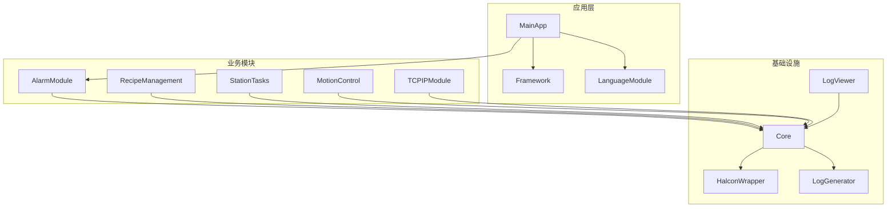
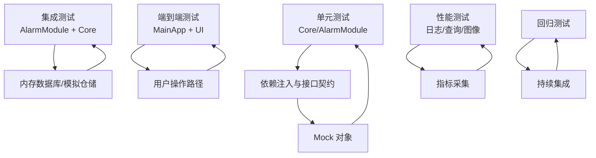
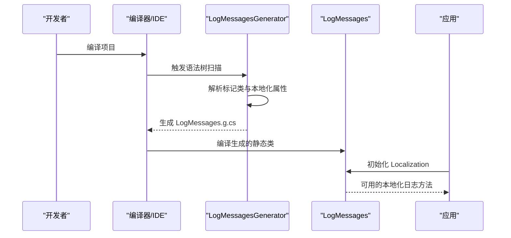
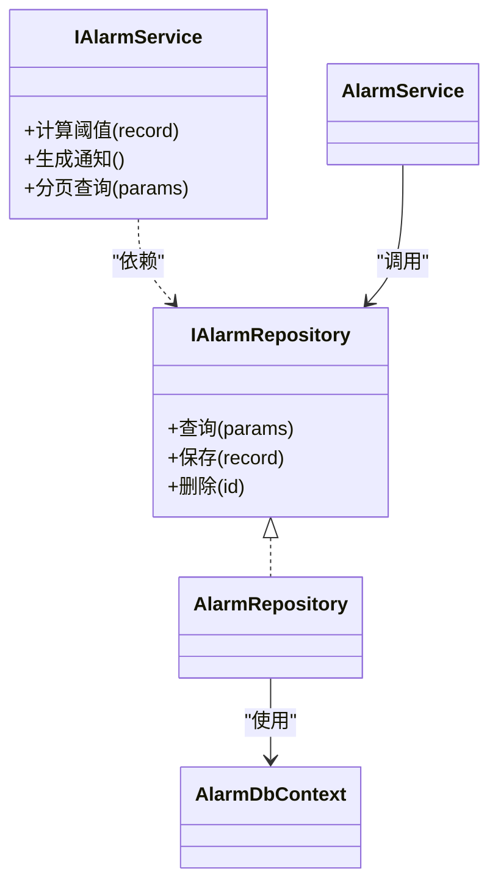
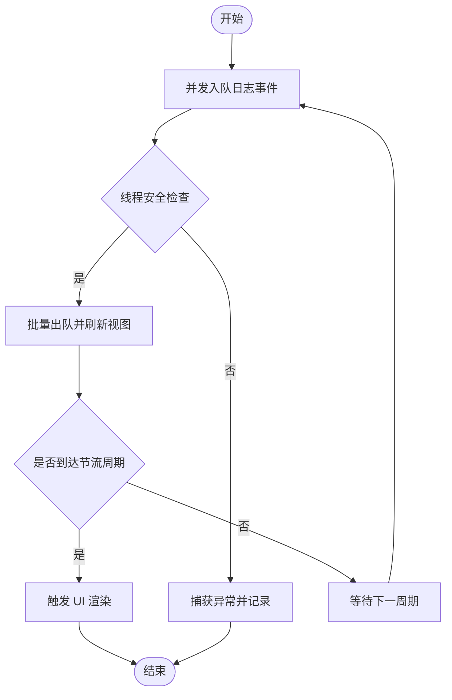
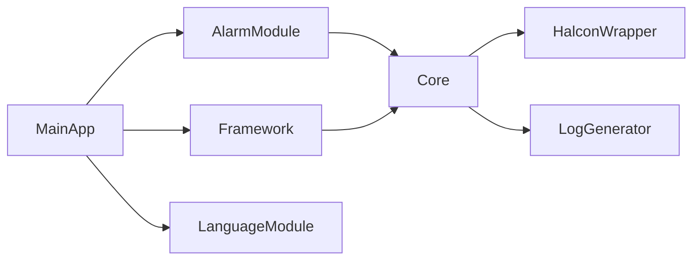

# 测试策略与实施

<cite>
**本文引用的文件**
- [README.md](file://README.md)
- [Directory.Build.props](file://Directory.Build.props)
- [.gitignore](file://.gitignore)
- [MainApp.csproj](file://MainApp/MainApp.csproj)
- [Core.csproj](file://Core/Core.csproj)
- [AlarmModule.csproj](file://AlarmModule/AlarmModule.csproj)
- [LogGenerator.csproj](file://LogGenerator/LogGenerator.csproj)
- [LogMessages.cs](file://Core/Logging/LogMessages.cs)
- [LogMessagesGenerator.cs](file://LogGenerator/LogMessagesGenerator.cs)
- [TestGenerator.cs](file://LogGenerator/TestGenerator.cs)
- [LogViewerViewModel.cs](file://LogViewer/ViewModels/LogViewerViewModel.cs)
- [LogViewer.xaml.cs](file://LogViewer/Views/LogViewer.xaml.cs)
- [GlobalLogCache.cs](file://Core/Utilities/GlobalLogCache.cs)
- [NLog.xsd](file://MainApp/NLog.xsd)
- [NLog.xsd](file://ModuleCore/NLog.xsd)
- [版本修改记录.txt](file://版本修改记录.txt)
</cite>

## 目录
1. [简介](#简介)
2. [项目结构](#项目结构)
3. [核心组件](#核心组件)
4. [架构总览](#架构总览)
5. [详细组件分析](#详细组件分析)
6. [依赖关系分析](#依赖关系分析)
7. [性能考虑](#性能考虑)
8. [故障排查指南](#故障排查指南)
9. [结论](#结论)
10. [附录](#附录)

## 简介
本文件为 GZQL_MACHINE 项目制定系统化的测试策略与实施方案，覆盖单元测试、集成测试、端到端测试、UI 自动化测试、性能基准与压力测试、回归测试、测试数据与环境管理、持续测试集成、测试覆盖率与缺陷跟踪、测试报告生成，以及日志测试生成器与测试辅助工具的使用方法。文档同时结合项目现有结构与技术栈（WPF、Prism、EF Core、NLog、Roslyn Source Generator 等），给出可操作的落地建议。

## 项目结构
项目采用多模块解决方案，核心模块包括 Core、AlarmModule、MainApp、Framework、LogViewer、LogGenerator、MotionControl、RecipeManagement、StationTasks、TCPIPModule 等。测试策略需围绕以下关键点展开：
- 模块边界清晰，便于进行单元测试与集成测试隔离
- 日志系统基于 NLog，具备可观测性与可测试性
- 使用 Prism 进行依赖注入与模块化，利于 Mock 与替换
- EF Core 用于 AlarmModule 数据访问，便于内存数据库或 Mock 测试
- Roslyn Source Generator 用于日志消息生成，便于测试生成代码与资源键一致性

图表来源
- [MainApp.csproj:1-31](file://MainApp/MainApp.csproj#L1-L31)
- [Core.csproj:1-44](file://Core/Core.csproj#L1-L44)
- [AlarmModule.csproj:1-23](file://AlarmModule/AlarmModule.csproj#L1-L23)

章节来源
- [README.md:1-66](file://README.md#L1-L66)
- [MainApp.csproj:1-31](file://MainApp/MainApp.csproj#L1-L31)
- [Core.csproj:1-44](file://Core/Core.csproj#L1-L44)
- [AlarmModule.csproj:1-23](file://AlarmModule/AlarmModule.csproj#L1-L23)

## 核心组件
- 日志系统与生成器
  - Core.Logging.LogMessages 提供日志消息初始化与本地化服务接口；LogMessagesGenerator 基于 Roslyn Source Generator 在编译期生成日志消息方法，支持多语言参数化输出。
  - LogGenerator.csproj 定义为 Roslyn Analyzer 组件，便于在编译阶段注入生成逻辑。
- 日志查看器与缓存
  - LogViewer 提供实时日志查看能力；GlobalLogCache 通过线程安全队列保障高并发场景下的稳定性。
- 应用与模块装配
  - MainApp 作为 WPF 应用入口，依赖 Prism 进行模块注册与依赖注入；各模块通过项目引用与接口契约解耦。

章节来源
- [LogMessages.cs:1-37](file://Core/Logging/LogMessages.cs#L1-L37)
- [LogMessagesGenerator.cs:1-252](file://LogGenerator/LogMessagesGenerator.cs#L1-L252)
- [LogGenerator.csproj:1-14](file://LogGenerator/LogGenerator.csproj#L1-L14)
- [LogViewerViewModel.cs](file://LogViewer/ViewModels/LogViewerViewModel.cs)
- [LogViewer.xaml.cs](file://LogViewer/Views/LogViewer.xaml.cs)
- [GlobalLogCache.cs](file://Core/Utilities/GlobalLogCache.cs)
- [MainApp.csproj:1-31](file://MainApp/MainApp.csproj#L1-L31)

## 架构总览
测试策略需与现有架构保持一致：
- 单元测试聚焦 Core、AlarmModule 业务逻辑与服务层，利用接口契约与依赖注入进行 Mock。
- 集成测试覆盖模块间交互（如 AlarmModule 与 Core 的仓储与服务）、EF Core 内存数据库。
- 端到端测试通过 MainApp 启动，模拟用户操作路径，验证 UI 与后台服务协同。
- 性能测试关注日志写入、数据查询、图像处理等热点路径。
- 回归测试确保新增功能不影响既有模块行为。

图表来源
- [Core.csproj:1-44](file://Core/Core.csproj#L1-L44)
- [AlarmModule.csproj:1-23](file://AlarmModule/AlarmModule.csproj#L1-L23)
- [MainApp.csproj:1-31](file://MainApp/MainApp.csproj#L1-L31)

## 详细组件分析

### 日志消息生成器与测试策略
- 生成器工作原理
  - LogMessagesGenerator 通过语法树接收标记类，解析字段上的本地化属性，生成静态方法以返回本地化字符串，并支持参数化格式化。
  - LogMessages.cs 提供初始化入口与本地化服务注入，确保生成方法在运行时可用。
- 测试要点
  - 单元测试：验证生成方法签名、参数数量推断、默认值回退逻辑。
  - 集成测试：验证 Localization 服务返回资源键时的回退与格式化行为。
  - 资源键一致性：通过生成器输出文件与资源文件同步校验，避免运行时找不到资源键导致的异常。
- 辅助工具
  - TestGenerator.cs 展示了基础 Source Generator 模板，可用于快速创建测试生成器或验证生成流程。

图表来源
- [LogMessagesGenerator.cs:1-252](file://LogGenerator/LogMessagesGenerator.cs#L1-L252)
- [LogMessages.cs:1-37](file://Core/Logging/LogMessages.cs#L1-L37)

章节来源
- [LogMessagesGenerator.cs:1-252](file://LogGenerator/LogMessagesGenerator.cs#L1-L252)
- [LogMessages.cs:1-37](file://Core/Logging/LogMessages.cs#L1-L37)
- [TestGenerator.cs:1-18](file://LogGenerator/TestGenerator.cs#L1-L18)

### AlarmModule 数据访问与服务测试
- 模块特性
  - AlarmModule 使用 EF Core SQLite 进行数据持久化，适合在测试中使用内存数据库或 Mock 仓储接口。
  - 通过接口 IAlarmRepository/IAlarmService 解耦，便于注入替身对象。
- 测试策略
  - 单元测试：对 AlarmService 的业务逻辑进行参数化测试，使用 MockRepository/MockService 验证状态转换、阈值判断、分页查询等。
  - 集成测试：使用 InMemoryDatabase 或 SQLite InMemory，验证仓储与服务的组合行为，包括事务、并发与异常场景。
  - 端到端测试：通过 MainApp 启动，模拟报警触发、查询、导出等用户路径，验证 UI 与服务链路。

图表来源
- [AlarmModule.csproj:1-23](file://AlarmModule/AlarmModule.csproj#L1-L23)

章节来源
- [AlarmModule.csproj:1-23](file://AlarmModule/AlarmModule.csproj#L1-L23)

### 日志查看器与全局缓存的稳定性测试
- 关键点
  - GlobalLogCache 使用线程安全队列，避免多线程并发添加/移除导致的数据损坏。
  - LogViewer 通过节流滚动与虚拟化优化，减少 UI 渲染开销。
- 测试策略
  - 单元测试：验证队列入队/出队的线程安全性与边界条件。
  - 集成测试：模拟高频日志写入，验证 UI 刷新频率与内存占用。
  - 性能测试：对比启用/关闭虚拟化、节流滚动前后的渲染耗时与帧率。

图表来源
- [GlobalLogCache.cs](file://Core/Utilities/GlobalLogCache.cs)
- [LogViewer.xaml.cs](file://LogViewer/Views/LogViewer.xaml.cs)
- [版本修改记录.txt:160-183](file://版本修改记录.txt#L160-L183)

章节来源
- [GlobalLogCache.cs](file://Core/Utilities/GlobalLogCache.cs)
- [LogViewer.xaml.cs](file://LogViewer/Views/LogViewer.xaml.cs)
- [版本修改记录.txt:160-183](file://版本修改记录.txt#L160-L183)

### NLog 配置与测试集成
- 配置要点
  - NLog.xsd 描述了 NLog 配置的 XML Schema，支持多种 Target（控制台、文件、数据库、性能计数器等）。
  - 在测试环境中可将日志输出重定向至内存或临时文件，便于断言与收集。
- 测试策略
  - 单元测试：通过 MemoryTarget 或 TempFileTarget 验证日志级别、格式与内容。
  - 集成测试：验证不同模块的日志聚合与过滤规则。
  - 性能测试：对比不同 Target 的吞吐量与延迟。

章节来源
- [NLog.xsd:669-2299](file://MainApp/NLog.xsd#L669-L2299)
- [NLog.xsd:669-2299](file://ModuleCore/NLog.xsd#L669-L2299)

## 依赖关系分析
- 模块依赖
  - MainApp 依赖 Core、AlarmModule、Framework、LanguageModule。
  - AlarmModule 依赖 Core 与 Framework。
  - Core 依赖 HalconWrapper、NLog、Prism 等。
- 测试耦合与内聚
  - 通过接口契约降低模块间耦合，提升测试内聚度。
  - 建议为每个模块建立独立的测试项目，避免跨模块测试污染。

图表来源
- [MainApp.csproj:1-31](file://MainApp/MainApp.csproj#L1-L31)
- [Core.csproj:1-44](file://Core/Core.csproj#L1-L44)
- [AlarmModule.csproj:1-23](file://AlarmModule/AlarmModule.csproj#L1-L23)

章节来源
- [MainApp.csproj:1-31](file://MainApp/MainApp.csproj#L1-L31)
- [Core.csproj:1-44](file://Core/Core.csproj#L1-L44)
- [AlarmModule.csproj:1-23](file://AlarmModule/AlarmModule.csproj#L1-L23)

## 性能考虑
- 日志性能
  - 使用 NLog 的异步 Target 与缓冲区，减少主线程阻塞。
  - 控制日志粒度，避免高频细粒度日志影响性能。
- 查询性能
  - AlarmModule 使用 EF Core，建议在测试中使用 InMemoryDatabase 并对复杂查询进行索引与分页优化。
- UI 性能
  - LogViewer 已启用列虚拟化、行回收复用与固定行高，测试中应关注大数据量下的滚动与渲染表现。

章节来源
- [版本修改记录.txt:160-183](file://版本修改记录.txt#L160-L183)
- [AlarmModule.csproj:1-23](file://AlarmModule/AlarmModule.csproj#L1-L23)

## 故障排查指南
- 日志初始化异常
  - 若出现“LogMessages 未初始化”错误，检查应用启动流程中是否调用了 LogMessages.Initialize。
- 资源键缺失
  - 生成器未找到定义类或属性时，不会生成对应方法，需确认标记类名称与属性格式。
- UI 卡顿
  - 检查是否启用了虚拟化与节流滚动；必要时调整刷新周期与批处理大小。

章节来源
- [LogMessages.cs:1-37](file://Core/Logging/LogMessages.cs#L1-L37)
- [LogMessagesGenerator.cs:1-252](file://LogGenerator/LogMessagesGenerator.cs#L1-L252)
- [LogViewer.xaml.cs](file://LogViewer/Views/LogViewer.xaml.cs)
- [版本修改记录.txt:160-183](file://版本修改记录.txt#L160-L183)

## 结论
本测试策略以模块化与接口契约为基础，结合 Roslyn Source Generator 与 NLog，形成从单元到端到端的完整测试闭环。通过合理的 Mock 设计、内存数据库与 UI 虚拟化优化，既能保证测试效率，又能覆盖真实场景下的性能与稳定性问题。建议在持续集成中引入覆盖率统计与缺陷跟踪流程，确保质量可度量、问题可追溯。

## 附录

### 测试框架与工具选型建议
- 单元测试：xUnit/MSTest（推荐 xUnit，生态成熟）
- Mock：Moq（接口契约友好）
- 集成测试：SQLite InMemory（EF Core）
- UI 自动化：WinAppDriver（WPF 应用）
- 性能测试：BenchmarkDotNet（基准）、LoadRunner/JMeter（压力）
- 覆盖率：Coverlet（.NET）

章节来源
- [.gitignore:145-153](file://.gitignore#L145-L153)

### 测试用例设计原则
- 单一职责：每个测试只验证一个行为或边界条件
- 可重复性：测试数据与环境隔离，避免随机性
- 可读性：测试命名清晰表达前置条件、动作与期望结果
- 可维护性：优先使用接口与工厂模式，便于替换与扩展

### Mock 对象使用规范
- 优先 Mock 接口而非具体类
- 使用构造函数注入依赖，便于注入替身对象
- 对外部依赖（数据库、网络）统一抽象，便于替换

### 集成测试策略
- AlarmModule：使用 InMemoryDatabase 验证仓储与服务组合
- Core：验证日志生成器与本地化服务协作
- MainApp：通过模块加载验证依赖注入与导航

### 端到端测试流程
- 启动 MainApp
- 执行关键用户路径（如报警查询、参数编辑、日志查看）
- 断言 UI 状态与后台服务响应
- 记录性能指标与错误日志

### UI 自动化测试方法
- WinAppDriver：定位控件、执行操作、断言结果
- 截图与视频录制：记录失败场景
- 数据驱动：通过配置文件或 Excel 驱动多组用例

### 性能测试基准与压力方案
- 基准：使用 BenchmarkDotNet 对热点方法进行微基准测试
- 压力：模拟高并发日志写入、大量报警事件与 UI 刷新，观察 CPU、内存、FPS 指标

### 回归测试流程
- 每次提交后自动运行单元与集成测试
- 大版本发布前执行端到端测试与性能回归
- 缺陷修复后补充针对性用例并回归

### 测试数据管理与环境配置
- 测试数据：使用内存数据库或轻量级 SQLite 文件
- 环境变量：通过 appsettings.Test.json 或环境变量隔离测试配置
- 日志重定向：测试期间将 NLog 输出到临时目录或内存

### 持续测试集成
- CI：在构建流水线中加入测试与覆盖率统计
- 报告：生成 HTML/XML 报告并上传 Artifacts
- 门禁：设定覆盖率阈值与失败阈值，阻止不达标合并

### 测试覆盖率要求
- 业务核心模块（Core、AlarmModule）：语句覆盖率 ≥ 80%，分支覆盖率 ≥ 60%
- 工具与生成器：语句覆盖率 ≥ 70%
- UI：关键路径覆盖率 ≥ 70%

### 缺陷跟踪流程
- 提交缺陷：附带复现步骤、日志与截图
- 分类分级：按严重程度与影响范围分类
- 跟踪闭环：修复后回归验证，关闭缺陷并更新测试用例

### 测试报告生成
- 单元/集成：xUnit XML + Coverlet JSON
- UI：Selenium/WinAppDriver 截图 + 视频
- 性能：BenchmarkDotNet HTML + CSV 指标

### 日志测试生成器使用方法
- 修改 Core.Logging.LogMessageDefinitions 后重新编译，生成 LogMessages.g.cs
- 在测试中调用生成的静态方法，验证本地化与格式化结果
- 如需调试生成过程，可参考 Debug.g.cs 输出

章节来源
- [LogMessagesGenerator.cs:1-252](file://LogGenerator/LogMessagesGenerator.cs#L1-L252)
- [LogMessages.cs:1-37](file://Core/Logging/LogMessages.cs#L1-L37)