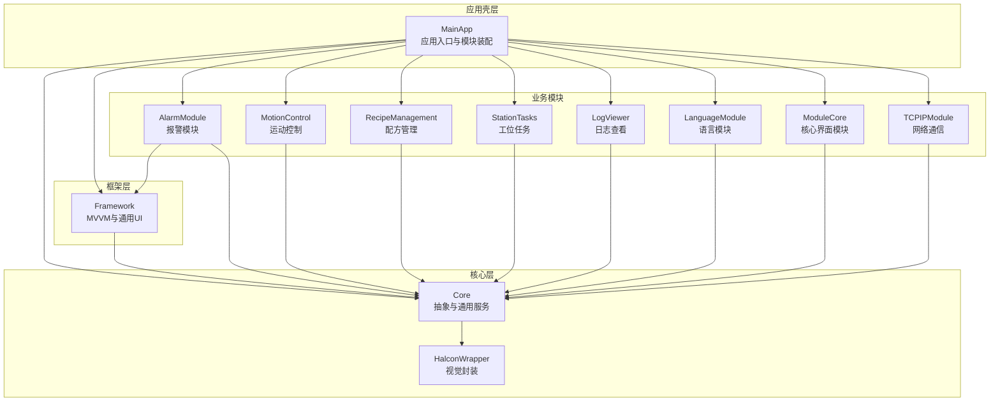
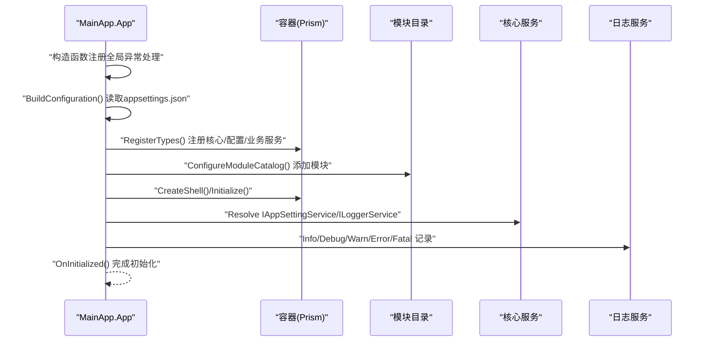
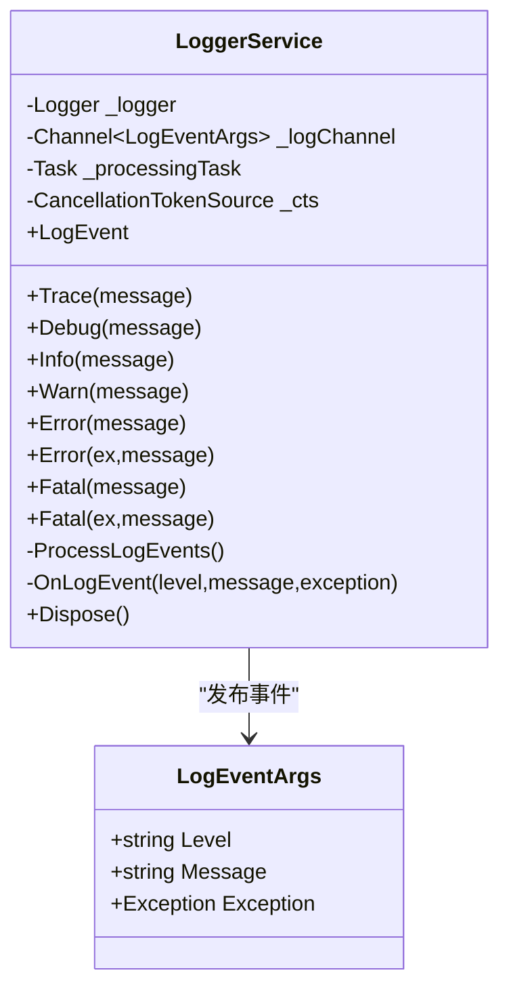
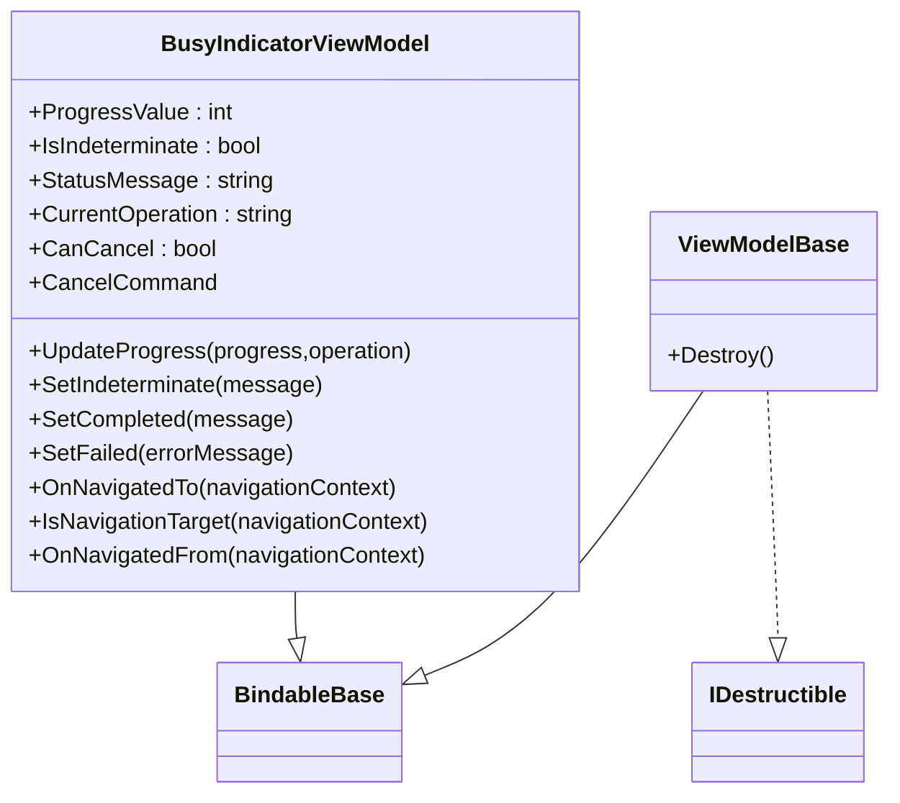
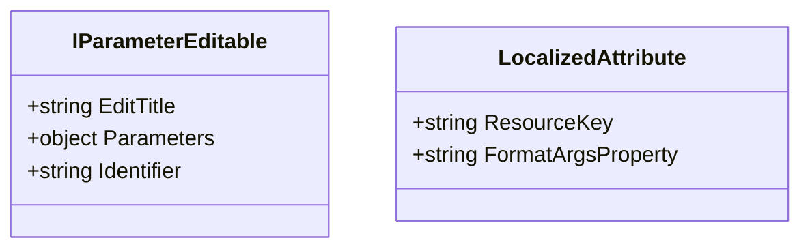
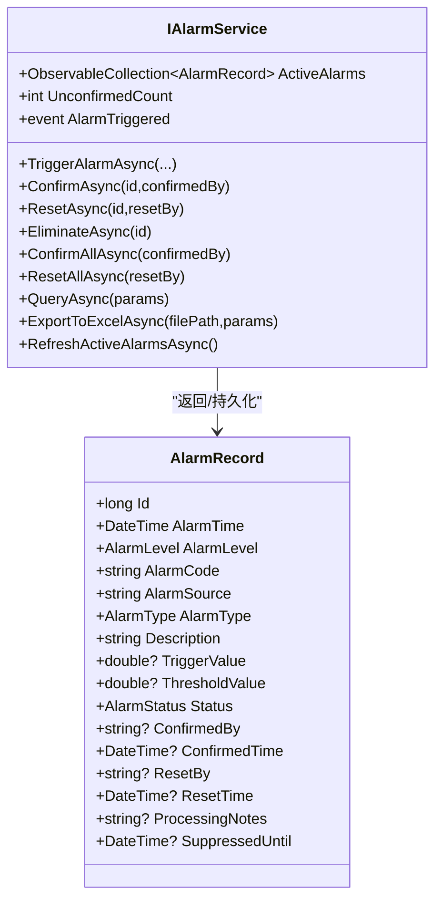
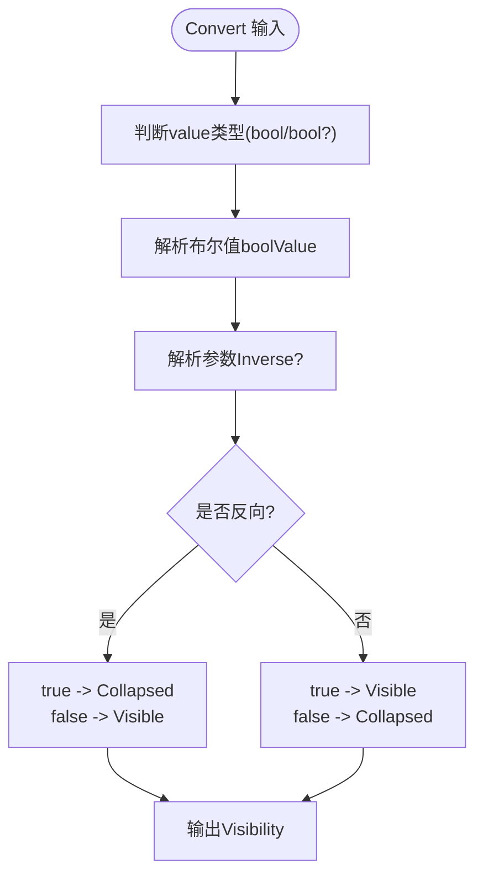
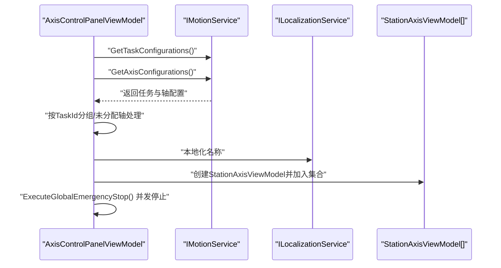
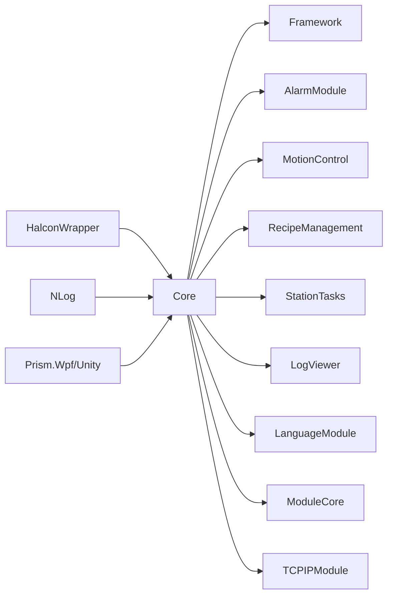
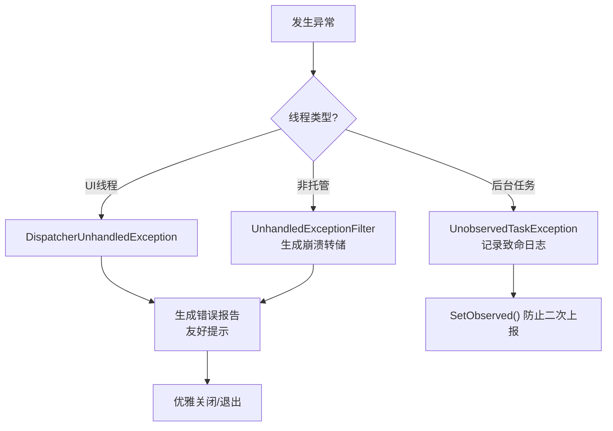

# 编码规范与约定

<cite>
**本文引用的文件**   
- [MainApp/App.xaml.cs](file://MainApp/App.xaml.cs)
- [Core/Core.csproj](file://Core/Core.csproj)
- [Framework/Framework.csproj](file://Framework/Framework.csproj)
- [AlarmModule/AlarmModule.csproj](file://AlarmModule/AlarmModule.csproj)
- [README.md](file://README.md)
- [Core/Utilities/LoggerService.cs](file://Core/Utilities/LoggerService.cs)
- [Framework/Mvvm/ViewModelBase.cs](file://Framework/Mvvm/ViewModelBase.cs)
- [Core/Abstraction/IParameterEditable.cs](file://Core/Abstraction/IParameterEditable.cs)
- [AlarmModule/Interfaces/IAlarmService.cs](file://AlarmModule/Interfaces/IAlarmService.cs)
- [MainApp/ViewModels/MainWindowViewModel.cs](file://MainApp/ViewModels/MainWindowViewModel.cs)
- [Framework/Converters/BooleanToVisibilityConverter.cs](file://Framework/Converters/BooleanToVisibilityConverter.cs)
- [AlarmModule/Models/AlarmRecord.cs](file://AlarmModule/Models/AlarmRecord.cs)
- [Framework/ViewModels/BusyIndicatorViewModel.cs](file://Framework/ViewModels/BusyIndicatorViewModel.cs)
- [Core/Attributes/LocalizedAttribute.cs](file://Core/Attributes/LocalizedAttribute.cs)
- [MotionControl/ViewModels/AxisControlPanelViewModel.cs](file://MotionControl/ViewModels/AxisControlPanelViewModel.cs)
</cite>

## 目录
1. [简介](#简介)
2. [项目结构](#项目结构)
3. [核心组件](#核心组件)
4. [架构总览](#架构总览)
5. [详细组件分析](#详细组件分析)
6. [依赖分析](#依赖分析)
7. [性能考虑](#性能考虑)
8. [故障排查指南](#故障排查指南)
9. [结论](#结论)
10. [附录](#附录)

## 简介
本规范面向GZQL_MACHINE项目，旨在统一C#编码风格、命名约定、代码组织结构，明确类设计原则、接口定义规范、异常处理模式，规范MVVM模式实现、WPF绑定规则与依赖注入使用准则，并提供代码注释标准、XML文档注释模板、日志记录规范，以及性能优化、内存管理与线程安全建议，最后给出代码审查检查清单与质量保证流程。

## 项目结构
项目采用多模块分层架构，核心层(Core)提供抽象与通用能力；框架层(Framework)提供UI基础与MVVM支撑；各业务模块(AlarmModule、MotionControl、RecipeManagement等)围绕具体业务场景扩展；主应用(MainApp)负责启动、模块装配与全局异常处理。

图表来源
- [MainApp/App.xaml.cs:179-191](file://MainApp/App.xaml.cs#L179-L191)
- [Core/Core.csproj:1-44](file://Core/Core.csproj#L1-L44)
- [Framework/Framework.csproj:1-38](file://Framework/Framework.csproj#L1-L38)
- [AlarmModule/AlarmModule.csproj:1-23](file://AlarmModule/AlarmModule.csproj#L1-L23)

章节来源
- [MainApp/App.xaml.cs:179-191](file://MainApp/App.xaml.cs#L179-L191)
- [Core/Core.csproj:11-41](file://Core/Core.csproj#L11-L41)
- [Framework/Framework.csproj:12-29](file://Framework/Framework.csproj#L12-L29)
- [AlarmModule/AlarmModule.csproj:10-20](file://AlarmModule/AlarmModule.csproj#L10-L20)

## 核心组件
- 依赖注入与模块化：应用通过Prism进行模块注册与容器管理，MainApp集中注册核心服务、配置服务、模块等。
- 日志系统：基于NLog，提供异步日志通道与全局缓存，支持事件广播与磁盘落盘。
- MVVM基类：Framework提供ViewModelBase，MainApp与各模块ViewModel继承该基类实现属性变更通知与销毁清理。
- 接口契约：Core定义参数编辑、本地化、配置等抽象，AlarmModule定义报警领域接口与实体模型。

章节来源
- [MainApp/App.xaml.cs:110-177](file://MainApp/App.xaml.cs#L110-L177)
- [Core/Utilities/LoggerService.cs:1-120](file://Core/Utilities/LoggerService.cs#L1-L120)
- [Framework/Mvvm/ViewModelBase.cs:1-16](file://Framework/Mvvm/ViewModelBase.cs#L1-L16)
- [Core/Abstraction/IParameterEditable.cs:1-16](file://Core/Abstraction/IParameterEditable.cs#L1-L16)
- [AlarmModule/Interfaces/IAlarmService.cs:1-77](file://AlarmModule/Interfaces/IAlarmService.cs#L1-L77)

## 架构总览
下图展示应用启动、模块装配、服务注册与异常处理的关键流程。

图表来源
- [MainApp/App.xaml.cs:86-119](file://MainApp/App.xaml.cs#L86-L119)
- [MainApp/App.xaml.cs:179-191](file://MainApp/App.xaml.cs#L179-L191)
- [MainApp/App.xaml.cs:121-133](file://MainApp/App.xaml.cs#L121-L133)

章节来源
- [MainApp/App.xaml.cs:42-84](file://MainApp/App.xaml.cs#L42-L84)
- [MainApp/App.xaml.cs:343-455](file://MainApp/App.xaml.cs#L343-L455)

## 详细组件分析

### 组件一：日志服务与异常处理
- 设计要点
  - 异步日志通道：使用有界通道与单读者，避免内存膨胀；满载时丢弃最旧消息。
  - 事件广播：日志事件同时写入全局缓存与事件订阅者。
  - 全局异常处理：捕获UI线程、非托管与未观察任务异常，生成崩溃转储与错误报告。
- 性能与线程安全
  - 单后台任务顺序消费通道，避免锁竞争；通道满载策略降低峰值内存占用。
  - 异常过滤器与崩溃转储确保问题可复现与定位。

图表来源
- [Core/Utilities/LoggerService.cs:5-120](file://Core/Utilities/LoggerService.cs#L5-L120)

章节来源
- [Core/Utilities/LoggerService.cs:14-120](file://Core/Utilities/LoggerService.cs#L14-L120)
- [MainApp/App.xaml.cs:234-455](file://MainApp/App.xaml.cs#L234-L455)

### 组件二：MVVM基类与视图模型
- 设计要点
  - ViewModelBase继承BindableBase并实现IDestructible，统一属性变更通知与销毁清理。
  - BusyIndicatorViewModel展示进度、可取消性与导航感知，体现MVVM交互模式。
- 命名与职责
  - 视图模型以ViewModel结尾，职责单一，避免跨域依赖。

图表来源
- [Framework/Mvvm/ViewModelBase.cs:6-16](file://Framework/Mvvm/ViewModelBase.cs#L6-L16)
- [Framework/ViewModels/BusyIndicatorViewModel.cs:9-161](file://Framework/ViewModels/BusyIndicatorViewModel.cs#L9-L161)

章节来源
- [Framework/Mvvm/ViewModelBase.cs:1-16](file://Framework/Mvvm/ViewModelBase.cs#L1-L16)
- [Framework/ViewModels/BusyIndicatorViewModel.cs:15-161](file://Framework/ViewModels/BusyIndicatorViewModel.cs#L15-L161)
- [MainApp/ViewModels/MainWindowViewModel.cs:1-20](file://MainApp/ViewModels/MainWindowViewModel.cs#L1-L20)

### 组件三：参数编辑接口与本地化属性
- 设计要点
  - IParameterEditable定义参数标题、参数对象与标识符，便于统一参数编辑与存储。
  - LocalizedAttribute标注需本地化的属性，支持自定义资源键与格式化参数属性。
- 实践建议
  - 参数编辑器通过Identifier区分存储位置，避免冲突。
  - 资源键优先显式指定，便于维护与翻译。

图表来源
- [Core/Abstraction/IParameterEditable.cs:5-14](file://Core/Abstraction/IParameterEditable.cs#L5-L14)
- [Core/Attributes/LocalizedAttribute.cs:9-27](file://Core/Attributes/LocalizedAttribute.cs#L9-L27)

章节来源
- [Core/Abstraction/IParameterEditable.cs:1-16](file://Core/Abstraction/IParameterEditable.cs#L1-L16)
- [Core/Attributes/LocalizedAttribute.cs:1-28](file://Core/Attributes/LocalizedAttribute.cs#L1-L28)

### 组件四：报警服务与模型
- 设计要点
  - IAlarmService定义报警触发、确认、复位、消除、查询与导出等完整生命周期方法与事件。
  - AlarmRecord实体映射数据库表，包含报警级别、类型、状态、确认/复位信息与防抖时间戳。
- 数据一致性
  - 使用数据库自增主键与必填字段约束，配合枚举类型保障状态一致性。

图表来源
- [AlarmModule/Interfaces/IAlarmService.cs:11-75](file://AlarmModule/Interfaces/IAlarmService.cs#L11-L75)
- [AlarmModule/Models/AlarmRecord.cs:12-60](file://AlarmModule/Models/AlarmRecord.cs#L12-L60)

章节来源
- [AlarmModule/Interfaces/IAlarmService.cs:1-77](file://AlarmModule/Interfaces/IAlarmService.cs#L1-L77)
- [AlarmModule/Models/AlarmRecord.cs:1-62](file://AlarmModule/Models/AlarmRecord.cs#L1-L62)

### 组件五：WPF转换器与绑定规则
- 设计要点
  - BooleanToVisibilityConverter支持正向/反向转换，兼容bool与nullable bool，提供ConvertBack以满足双向绑定需求。
- 绑定建议
  - 在XAML中尽量使用OneWay绑定，仅在必要时使用TwoWay；对复杂逻辑使用转换器而非代码隐藏。

图表来源
- [Framework/Converters/BooleanToVisibilityConverter.cs:14-44](file://Framework/Converters/BooleanToVisibilityConverter.cs#L14-L44)

章节来源
- [Framework/Converters/BooleanToVisibilityConverter.cs:1-47](file://Framework/Converters/BooleanToVisibilityConverter.cs#L1-L47)

### 组件六：运动控制面板视图模型
- 设计要点
  - AxisControlPanelViewModel按任务(TaskId)分组创建工站视图模型，支持全局紧急停止与资源释放。
  - 通过IMotionService与ILocalizationService注入，保持低耦合。
- 错误处理
  - 初始化过程中捕获异常并输出调试信息，避免影响主流程。

图表来源
- [MotionControl/ViewModels/AxisControlPanelViewModel.cs:43-132](file://MotionControl/ViewModels/AxisControlPanelViewModel.cs#L43-L132)

章节来源
- [MotionControl/ViewModels/AxisControlPanelViewModel.cs:1-134](file://MotionControl/ViewModels/AxisControlPanelViewModel.cs#L1-L134)

## 依赖分析
- 项目依赖关系
  - Core引用HalconWrapper与第三方库(NLog、Prism、PropertyChanged)，作为公共基础设施。
  - Framework引用Core并提供UI与MVVM基础。
  - 各业务模块依赖Core与Framework，形成清晰的分层。
- 包管理与目标框架
  - 目标框架为net9.0-windows7.0，启用WPF与隐式using，提升开发效率。

图表来源
- [Core/Core.csproj:12-41](file://Core/Core.csproj#L12-L41)
- [Framework/Framework.csproj:12-29](file://Framework/Framework.csproj#L12-L29)
- [AlarmModule/AlarmModule.csproj:10-20](file://AlarmModule/AlarmModule.csproj#L10-L20)

章节来源
- [Core/Core.csproj:1-44](file://Core/Core.csproj#L1-L44)
- [Framework/Framework.csproj:1-38](file://Framework/Framework.csproj#L1-L38)
- [AlarmModule/AlarmModule.csproj:1-23](file://AlarmModule/AlarmModule.csproj#L1-L23)
- [README.md:7-26](file://README.md#L7-L26)

## 性能考虑
- 日志性能
  - 使用有界通道与单读者，满载丢弃最旧消息，避免内存峰值。
  - 异步写入通道，减少主线程阻塞。
- 内存管理
  - ViewModelBase实现IDestructible，视图关闭时调用Destroy清理订阅与定时器。
  - MainApp在退出前延迟等待与保存设置，确保资源有序释放。
- 线程安全
  - 异常处理覆盖UI线程、非托管与未观察任务异常，防止崩溃与资源泄漏。
  - 通道消费在单任务中进行，避免并发写入竞争。

章节来源
- [Core/Utilities/LoggerService.cs:18-30](file://Core/Utilities/LoggerService.cs#L18-L30)
- [Framework/Mvvm/ViewModelBase.cs:12-15](file://Framework/Mvvm/ViewModelBase.cs#L12-L15)
- [MainApp/App.xaml.cs:79-84](file://MainApp/App.xaml.cs#L79-L84)
- [MainApp/App.xaml.cs:343-415](file://MainApp/App.xaml.cs#L343-L415)

## 故障排查指南
- 异常处理流程
  - UI线程异常：DispatcherUnhandledException捕获并生成错误报告。
  - 非托管异常：设置UnhandledExceptionFilter生成崩溃转储。
  - 未观察任务异常：记录致命日志并标记为已观察。
- 日志与诊断
  - LoggerService提供异步事件广播，便于实时日志查看与持久化。
  - MainApp记录启动/关闭信息与内存监控，辅助定位性能问题。

图表来源
- [MainApp/App.xaml.cs:343-455](file://MainApp/App.xaml.cs#L343-L455)
- [Core/Utilities/LoggerService.cs:78-100](file://Core/Utilities/LoggerService.cs#L78-L100)

章节来源
- [MainApp/App.xaml.cs:234-455](file://MainApp/App.xaml.cs#L234-L455)
- [Core/Utilities/LoggerService.cs:1-120](file://Core/Utilities/LoggerService.cs#L1-L120)

## 结论
本规范结合项目现有实现，明确了编码风格、命名约定、MVVM实践、依赖注入与异常处理策略，并给出了性能与线程安全建议。建议在后续开发中严格遵循，持续完善文档注释与质量流程，确保系统稳定性与可维护性。

## 附录

### A. C#编码风格与命名约定
- 命名
  - 类型：PascalCase；接口以I开头；枚举项首字母大写；常量全大写。
  - 方法/属性：PascalCase；布尔属性以Is/Can/Has等语义词开头。
  - 私有字段以下划线前缀或使用this.访问，避免混淆。
- 文件与命名空间
  - 命名空间与项目/目录一致；ViewModel以ViewModel结尾；View以View结尾；Converter以Converter结尾。
- 代码组织
  - 字段/属性/方法按“私有字段 → 受保护成员 → 公共成员”分组；内部类按职责分组。

### B. 接口定义规范
- 单一职责：接口方法聚焦于单一能力域；跨域能力通过组合多个接口实现。
- 明确契约：方法签名与返回类型清晰表达意图；异常与空值行为在注释中说明。
- 可测试性：接口方法尽量无副作用或提供可控副作用；必要时提供回调/令牌。

### C. MVVM模式实现规范
- 视图模型
  - 继承BindableBase或ViewModelBase；公开可绑定属性与命令；实现IDestructible并在Destroy中清理。
  - 避免在ViewModel中直接访问UI控件；通过命令与事件与视图交互。
- 命令
  - 使用DelegateCommand；通过ObservesProperty绑定命令可用性。
- 绑定
  - 优先OneWay；双向绑定仅在必要时使用；避免复杂逻辑进入XAML。

### D. WPF绑定规则
- 转换器
  - 保持无副作用；输入类型健壮性检查；ConvertBack与Convert对称。
- 资源与样式
  - 将常用样式与模板放入ResourceDictionary；避免硬编码颜色与尺寸。

### E. 依赖注入使用准则
- 注册
  - 在App.RegisterTypes中集中注册；核心服务使用Singleton；对话框/临时对象使用Transient。
- 解析
  - 通过构造函数注入；避免使用静态工厂或手动new；在ViewModel中注入所需服务。
- 生命周期
  - 长生命周期服务避免持有短生命周期服务的引用；及时释放事件订阅。

### F. 代码注释标准与XML文档注释模板
- XML注释
  - 类/接口/方法/属性均提供summary；参数与返回值使用param/returns；异常使用exception。
- 注释内容
  - 说明用途、前置条件、后置条件、边界情况与性能特征；对外部依赖与线程安全进行声明。

### G. 日志记录规范
- 日志级别
  - Trace/Debug：开发调试；Info：常规流程；Warn：潜在问题；Error/Fatal：错误与致命异常。
- 异步日志
  - 使用LoggerService异步通道；避免在日志回调中做重操作。
- 异常记录
  - 记录异常类型、消息与堆栈；必要时附加上下文信息。

### H. 性能优化建议
- 减少UI线程阻塞：长耗时操作使用后台线程；使用异步API。
- 内存管理：及时释放事件订阅与定时器；ViewModel销毁时清理集合。
- 日志与诊断：合理设置日志级别；避免高频小粒度日志。

### I. 线程安全考虑
- 异常处理：覆盖UI线程、非托管与未观察任务异常；生成转储文件便于分析。
- 通道与事件：使用单读者通道与事件聚合；避免在回调中进行阻塞操作。

### J. 代码审查检查清单
- 结构与命名：命名是否符合约定；目录与命名空间是否一致。
- 接口与契约：接口是否单一职责；注释是否完整。
- MVVM：命令是否正确绑定；ViewModel是否实现IDestructible。
- 日志与异常：是否使用LoggerService；异常是否被妥善处理与记录。
- 性能：是否存在阻塞UI线程的操作；日志与集合是否高效。
- 文档：XML注释是否完整；关键流程是否有说明。