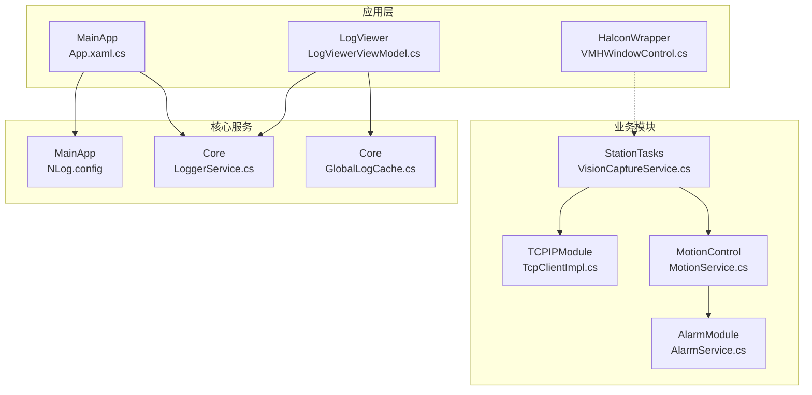
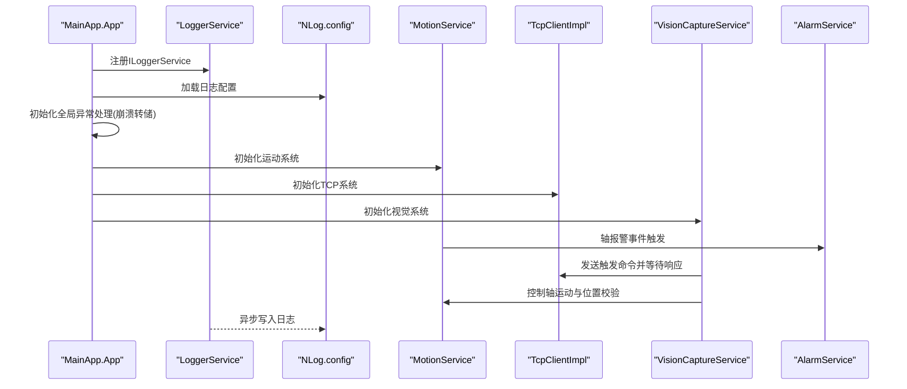
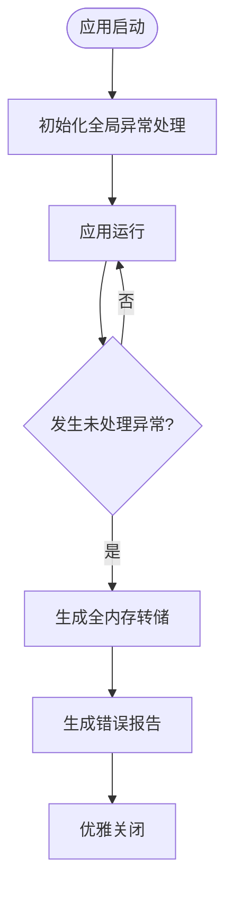
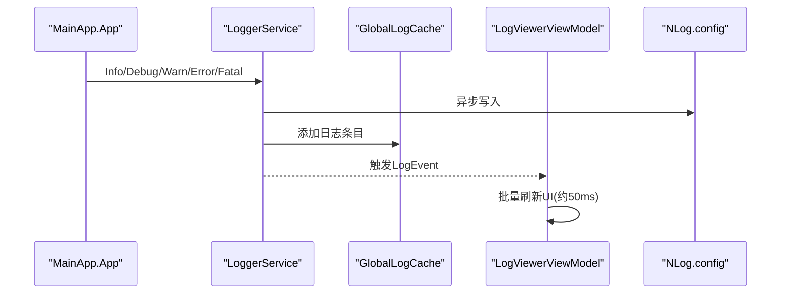
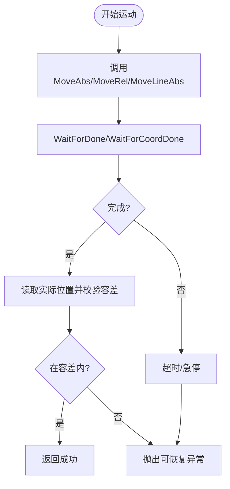
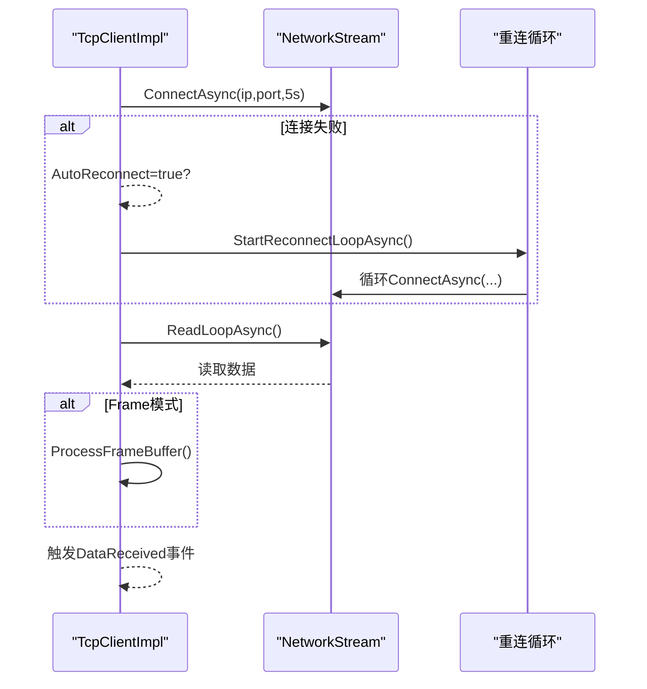
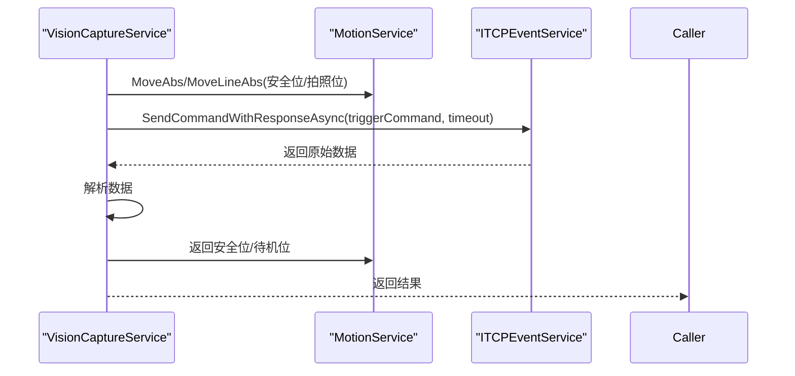
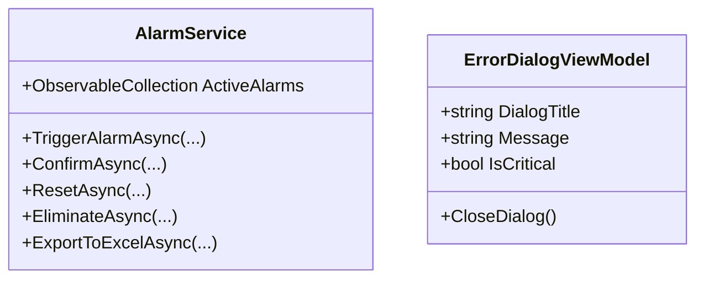
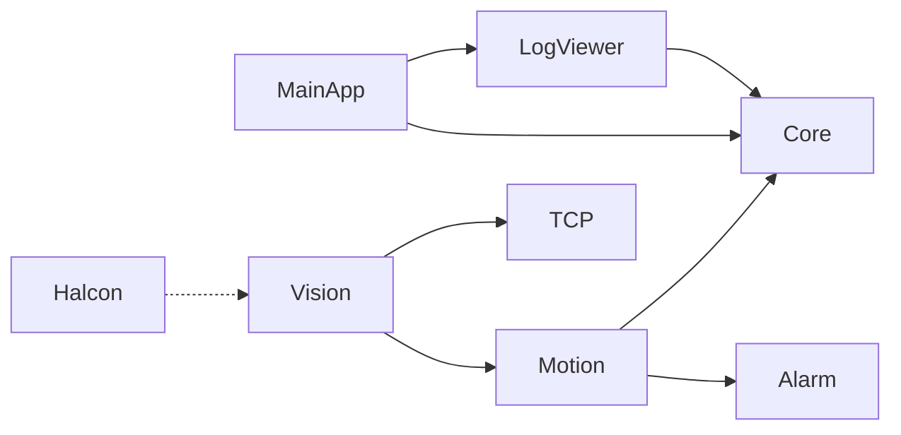

# 调试技巧与故障排除

<cite>
**本文档引用的文件**
- [MainApp/App.xaml.cs](file://MainApp/App.xaml.cs)
- [Core/Utilities/LoggerService.cs](file://Core/Utilities/LoggerService.cs)
- [Core/Utilities/GlobalLogCache.cs](file://Core/Utilities/GlobalLogCache.cs)
- [LogViewer/ViewModels/LogViewerViewModel.cs](file://LogViewer/ViewModels/LogViewerViewModel.cs)
- [MainApp/NLog.config](file://MainApp/NLog.config)
- [MotionControl/Services/MotionService.cs](file://MotionControl/Services/MotionService.cs)
- [TCPIPModule/Services/TcpClientImpl.cs](file://TCPIPModule/Services/TcpClientImpl.cs)
- [StationTasks/Services/VisionCaptureService.cs](file://StationTasks/Services/VisionCaptureService.cs)
- [AlarmModule/Services/AlarmService.cs](file://AlarmModule/Services/AlarmService.cs)
- [ModuleCore/ViewModels/ErrorDialogViewModel.cs](file://ModuleCore/ViewModels/ErrorDialogViewModel.cs)
- [HalconWrapper/VMHWindowControl.cs](file://HalconWrapper/VMHWindowControl.cs)
</cite>

## 目录
1. [简介](#简介)
2. [项目结构](#项目结构)
3. [核心组件](#核心组件)
4. [架构总览](#架构总览)
5. [详细组件分析](#详细组件分析)
6. [依赖关系分析](#依赖关系分析)
7. [性能考虑](#性能考虑)
8. [故障排除指南](#故障排除指南)
9. [结论](#结论)
10. [附录](#附录)

## 简介
本指南面向GZQL_MACHINE项目的开发与运维人员，围绕Visual Studio调试、断点设置、变量监视、调用堆栈分析，系统化梳理日志体系、错误追踪与异常处理调试方法，并扩展到网络通信、运动控制、视觉处理的专项调试技巧。文档还提供常见问题诊断流程、性能瓶颈分析与内存泄漏检测建议、远程调试配置、生产环境问题定位与用户反馈处理策略，以及调试工具推荐与第三方调试器使用要点。

## 项目结构
GZQL_MACHINE采用模块化WPF应用架构，核心模块包括：
- MainApp：应用壳与全局异常处理、日志启动信息记录、内存使用监控、崩溃转储生成
- Core：通用抽象、日志基础设施、全局日志缓存
- LogViewer：日志查看器UI，支持批量刷新与历史日志展示
- MotionControl：运动控制服务，包含轮询线程、事件驱动状态发布、报警与急停处理
- TCPIPModule：TCP客户端/服务器实现，支持自动重连、帧协议、超时控制
- StationTasks：站点任务与视觉采集服务，串联运动控制与TCP通信
- AlarmModule：报警触发、状态管理、通知与导出
- HalconWrapper：Halcon图像显示与交互控件
- ModuleCore：错误对话框等基础模块

**图表来源**
- [MainApp/App.xaml.cs:1-460](file://MainApp/App.xaml.cs#L1-L460)
- [Core/Utilities/LoggerService.cs:1-120](file://Core/Utilities/LoggerService.cs#L1-L120)
- [Core/Utilities/GlobalLogCache.cs:1-38](file://Core/Utilities/GlobalLogCache.cs#L1-L38)
- [LogViewer/ViewModels/LogViewerViewModel.cs:1-160](file://LogViewer/ViewModels/LogViewerViewModel.cs#L1-L160)
- [MainApp/NLog.config:1-88](file://MainApp/NLog.config#L1-L88)
- [MotionControl/Services/MotionService.cs:1-741](file://MotionControl/Services/MotionService.cs#L1-L741)
- [TCPIPModule/Services/TcpClientImpl.cs:1-427](file://TCPIPModule/Services/TcpClientImpl.cs#L1-L427)
- [StationTasks/Services/VisionCaptureService.cs:1-193](file://StationTasks/Services/VisionCaptureService.cs#L1-L193)
- [AlarmModule/Services/AlarmService.cs:1-308](file://AlarmModule/Services/AlarmService.cs#L1-L308)
- [HalconWrapper/VMHWindowControl.cs:1-894](file://HalconWrapper/VMHWindowControl.cs#L1-L894)

**章节来源**
- [MainApp/App.xaml.cs:1-460](file://MainApp/App.xaml.cs#L1-L460)
- [MainApp/NLog.config:1-88](file://MainApp/NLog.config#L1-L88)

## 核心组件
- 全局异常与崩溃转储：在应用启动阶段注册非托管异常过滤器，捕获未处理异常并生成全内存转储，同时记录启动/关闭信息与内存使用情况，便于后续分析。
- 日志系统：LoggerService基于NLog，采用有界通道异步写入，支持Trace/Debug/Info/Warn/Error/Fatal；GlobalLogCache提供线程安全滑动窗口缓存，LogViewer批量刷新UI。
- 运动控制：MotionService使用高优先级轮询线程与事件驱动（IObservable）发布轴状态，支持急停/报警检测、位置校验与插补等待，具备工业级实时性。
- 网络通信：TcpClientImpl支持Raw/Frame两种数据模式、自动重连、超时收发、事件驱动接收队列与信号量通知。
- 视觉采集：VisionCaptureService串联运动控制与TCP事件服务，负责拍照位移动、触发命令发送与响应解析，异常包装为可恢复异常。
- 报警管理：AlarmService维护活跃报警集合，支持防抖、确认/复位/消除、批量操作与Excel导出。
- 错误对话框：ModuleCore提供错误对话框视图模型，承载错误标题、消息与是否关键错误的标识。

**章节来源**
- [MainApp/App.xaml.cs:210-456](file://MainApp/App.xaml.cs#L210-L456)
- [Core/Utilities/LoggerService.cs:1-120](file://Core/Utilities/LoggerService.cs#L1-L120)
- [Core/Utilities/GlobalLogCache.cs:1-38](file://Core/Utilities/GlobalLogCache.cs#L1-L38)
- [LogViewer/ViewModels/LogViewerViewModel.cs:1-160](file://LogViewer/ViewModels/LogViewerViewModel.cs#L1-L160)
- [MotionControl/Services/MotionService.cs:26-741](file://MotionControl/Services/MotionService.cs#L26-L741)
- [TCPIPModule/Services/TcpClientImpl.cs:19-427](file://TCPIPModule/Services/TcpClientImpl.cs#L19-L427)
- [StationTasks/Services/VisionCaptureService.cs:19-193](file://StationTasks/Services/VisionCaptureService.cs#L19-L193)
- [AlarmModule/Services/AlarmService.cs:16-308](file://AlarmModule/Services/AlarmService.cs#L16-L308)
- [ModuleCore/ViewModels/ErrorDialogViewModel.cs:8-70](file://ModuleCore/ViewModels/ErrorDialogViewModel.cs#L8-L70)

## 架构总览
下图展示了应用启动、日志与异常处理、运动控制、网络通信与视觉采集的关键交互路径。

**图表来源**
- [MainApp/App.xaml.cs:96-208](file://MainApp/App.xaml.cs#L96-L208)
- [Core/Utilities/LoggerService.cs:14-120](file://Core/Utilities/LoggerService.cs#L14-L120)
- [MainApp/NLog.config:9-86](file://MainApp/NLog.config#L9-L86)
- [MotionControl/Services/MotionService.cs:126-203](file://MotionControl/Services/MotionService.cs#L126-L203)
- [TCPIPModule/Services/TcpClientImpl.cs:79-153](file://TCPIPModule/Services/TcpClientImpl.cs#L79-L153)
- [StationTasks/Services/VisionCaptureService.cs:37-147](file://StationTasks/Services/VisionCaptureService.cs#L37-L147)
- [AlarmModule/Services/AlarmService.cs:48-91](file://AlarmModule/Services/AlarmService.cs#L48-L91)

## 详细组件分析

### 全局异常与崩溃转储（MainApp/App.xaml.cs）
- 注册非托管异常过滤器，捕获后生成全内存转储文件，记录异常上下文并优雅关闭。
- 记录启动/关闭信息与内存使用，定期监控内存占用，便于定位内存泄漏。
- 处理UI线程与后台线程未处理异常，生成错误报告并友好提示。

**图表来源**
- [MainApp/App.xaml.cs:234-456](file://MainApp/App.xaml.cs#L234-L456)

**章节来源**
- [MainApp/App.xaml.cs:210-456](file://MainApp/App.xaml.cs#L210-L456)

### 日志系统（LoggerService、NLog.config、LogViewer）
- LoggerService：有界通道异步写日志，避免UI阻塞；同时推送LogEvent事件到LogViewer；GlobalLogCache维持固定容量滑动窗口。
- NLog.config：按级别分文件输出（Error/Warn/Info/Debug/Trace），支持归档与大小限制。
- LogViewer：批量定时刷新（约50ms批次），限制最大日志条目，高亮最新日志，支持历史回放。

**图表来源**
- [Core/Utilities/LoggerService.cs:78-120](file://Core/Utilities/LoggerService.cs#L78-L120)
- [Core/Utilities/GlobalLogCache.cs:16-36](file://Core/Utilities/GlobalLogCache.cs#L16-L36)
- [LogViewer/ViewModels/LogViewerViewModel.cs:83-130](file://LogViewer/ViewModels/LogViewerViewModel.cs#L83-L130)
- [MainApp/NLog.config:9-86](file://MainApp/NLog.config#L9-L86)

**章节来源**
- [Core/Utilities/LoggerService.cs:1-120](file://Core/Utilities/LoggerService.cs#L1-L120)
- [Core/Utilities/GlobalLogCache.cs:1-38](file://Core/Utilities/GlobalLogCache.cs#L1-L38)
- [LogViewer/ViewModels/LogViewerViewModel.cs:1-160](file://LogViewer/ViewModels/LogViewerViewModel.cs#L1-L160)
- [MainApp/NLog.config:1-88](file://MainApp/NLog.config#L1-L88)

### 运动控制调试（MotionService）
- 轮询线程：高优先级线程，快速报警检查与完整状态轮询（每3次完整轮询一次），发布轴状态事件。
- 位置校验：运动完成后读取实际位置并与目标比较，超出容差抛出可恢复异常，便于定位碰撞、限位或伺服异常。
- 插补等待：WaitForCoordMotionCompletionAsync采用SpinWait自旋等待，支持急停令牌中断与超时控制。
- IO与AD：支持DI/DO读写、模拟量通道读取与批量转换，便于传感器与力控调试。

**图表来源**
- [MotionControl/Services/MotionService.cs:221-387](file://MotionControl/Services/MotionService.cs#L221-L387)
- [MotionControl/Services/MotionService.cs:440-579](file://MotionControl/Services/MotionService.cs#L440-L579)

**章节来源**
- [MotionControl/Services/MotionService.cs:26-741](file://MotionControl/Services/MotionService.cs#L26-L741)

### 网络通信调试（TcpClientImpl）
- 连接：支持5秒连接超时，失败自动重连（可配置间隔），事件通知连接状态变化。
- 数据模式：Raw直接收发；Frame使用4字节长度前缀帧，防粘包/拆包。
- 接收：信号量+队列，支持ReceiveAsync超时等待；错误事件回调。
- 重连：断线后按间隔重连，成功后恢复读循环。

**图表来源**
- [TCPIPModule/Services/TcpClientImpl.cs:79-153](file://TCPIPModule/Services/TcpClientImpl.cs#L79-L153)
- [TCPIPModule/Services/TcpClientImpl.cs:248-295](file://TCPIPModule/Services/TcpClientImpl.cs#L248-L295)
- [TCPIPModule/Services/TcpClientImpl.cs:359-393](file://TCPIPModule/Services/TcpClientImpl.cs#L359-L393)

**章节来源**
- [TCPIPModule/Services/TcpClientImpl.cs:19-427](file://TCPIPModule/Services/TcpClientImpl.cs#L19-L427)

### 视觉处理调试（VisionCaptureService）
- 流程：移动至安全位→移动至拍照位→下降至拍照位→发送触发命令→解析响应→返回安全位/待机位。
- 异常：超时包装为可恢复异常，包含建议操作；取消时优先抬起Z轴至安全位。
- 位置校验：严格校验配方位置键是否存在，缺失时报错。

**图表来源**
- [StationTasks/Services/VisionCaptureService.cs:37-147](file://StationTasks/Services/VisionCaptureService.cs#L37-L147)

**章节来源**
- [StationTasks/Services/VisionCaptureService.cs:19-193](file://StationTasks/Services/VisionCaptureService.cs#L19-L193)

### 报警与错误对话框（AlarmService、ErrorDialogViewModel）
- AlarmService：活跃报警集合、防抖抑制、状态流转（未确认→已确认→复位→消除）、批量操作与Excel导出。
- ErrorDialogViewModel：承载错误标题、消息与关键错误标识，支持对话框关闭。

**图表来源**
- [AlarmModule/Services/AlarmService.cs:16-308](file://AlarmModule/Services/AlarmService.cs#L16-L308)
- [ModuleCore/ViewModels/ErrorDialogViewModel.cs:8-70](file://ModuleCore/ViewModels/ErrorDialogViewModel.cs#L8-L70)

**章节来源**
- [AlarmModule/Services/AlarmService.cs:16-308](file://AlarmModule/Services/AlarmService.cs#L16-L308)
- [ModuleCore/ViewModels/ErrorDialogViewModel.cs:8-70](file://ModuleCore/ViewModels/ErrorDialogViewModel.cs#L8-L70)

### Halcon图像显示调试（VMHWindowControl）
- 支持适应窗口/图片、十字线绘制、鼠标移动显示坐标与灰度值、保存图像/截图、打开图像。
- 绘制模式下禁用缩放与右键菜单，避免干扰。
- 异常捕获与调试输出，便于定位图像处理问题。

**章节来源**
- [HalconWrapper/VMHWindowControl.cs:1-894](file://HalconWrapper/VMHWindowControl.cs#L1-L894)

## 依赖关系分析
- MainApp依赖Core日志与配置，依赖LogViewer模块展示日志。
- MotionService依赖AlarmModule进行报警记录，依赖ILoggerService输出状态。
- VisionCaptureService串联MotionService与TCPIPModule的ITCPEventService。
- LogViewer依赖Core的GlobalLogCache与LoggerService事件。
- HalconWrapper独立于业务模块，作为可视化辅助。

**图表来源**
- [MainApp/App.xaml.cs:110-191](file://MainApp/App.xaml.cs#L110-L191)
- [MotionControl/Services/MotionService.cs:32-33](file://MotionControl/Services/MotionService.cs#L32-L33)
- [StationTasks/Services/VisionCaptureService.cs:21-35](file://StationTasks/Services/VisionCaptureService.cs#L21-L35)
- [LogViewer/ViewModels/LogViewerViewModel.cs:29-44](file://LogViewer/ViewModels/LogViewerViewModel.cs#L29-L44)

**章节来源**
- [MainApp/App.xaml.cs:110-191](file://MainApp/App.xaml.cs#L110-L191)

## 性能考虑
- 日志异步化：LoggerService使用有界通道与后台处理任务，避免UI线程阻塞；LogViewer批量刷新降低UI重绘频率。
- 运动控制实时性：轮询线程优先级高，WaitForDone/WaitForCoordDone采用SpinWait自旋等待，结合急停令牌实现微秒级响应。
- TCP读取循环：ReadLoopAsync持续读取，Frame模式解析在缓冲区中完成，减少多次分配。
- 内存监控：应用启动后定时记录内存使用，便于发现内存泄漏趋势。

**章节来源**
- [Core/Utilities/LoggerService.cs:78-120](file://Core/Utilities/LoggerService.cs#L78-L120)
- [LogViewer/ViewModels/LogViewerViewModel.cs:37-130](file://LogViewer/ViewModels/LogViewerViewModel.cs#L37-L130)
- [MotionControl/Services/MotionService.cs:440-579](file://MotionControl/Services/MotionService.cs#L440-L579)
- [TCPIPModule/Services/TcpClientImpl.cs:248-295](file://TCPIPModule/Services/TcpClientImpl.cs#L248-L295)
- [MainApp/App.xaml.cs:333-341](file://MainApp/App.xaml.cs#L333-L341)

## 故障排除指南

### Visual Studio调试与断点设置
- 启动配置：在项目属性的“调试”页设置启动对象为MainApp，确保NLog.config位于输出目录。
- 断点策略：
  - 在LoggerService.OnLogEvent与LogViewerViewModel.OnLogEvent中设置断点，验证日志事件链路。
  - 在MotionService.WaitForDone/WaitForCoordDone中设置断点，观察位置校验与容差判断。
  - 在TcpClientImpl.ReadLoopAsync中设置断点，观察数据接收与帧解析。
  - 在VisionCaptureService.ExecuteCaptureAsync中设置断点，跟踪拍照流程与异常包装。
- 变量监视：监视LoggerService的_logChannel.Writer、LogViewer的_pendingEntries、MotionService的_axisStates、TCP的_isConnected与_frameBuffer。

**章节来源**
- [Core/Utilities/LoggerService.cs:102-111](file://Core/Utilities/LoggerService.cs#L102-L111)
- [LogViewer/ViewModels/LogViewerViewModel.cs:83-97](file://LogViewer/ViewModels/LogViewerViewModel.cs#L83-L97)
- [MotionControl/Services/MotionService.cs:332-354](file://MotionControl/Services/MotionService.cs#L332-L354)
- [TCPIPModule/Services/TcpClientImpl.cs:248-295](file://TCPIPModule/Services/TcpClientImpl.cs#L248-L295)
- [StationTasks/Services/VisionCaptureService.cs:37-147](file://StationTasks/Services/VisionCaptureService.cs#L37-L147)

### 调用堆栈分析
- 全局异常：在UnhandledExceptionFilter中设置断点，查看GenerateCrashDump生成的转储文件路径，结合NLog错误日志定位根因。
- UI异常：在App_DispatcherUnhandledException中设置断点，查看异常堆栈与线程上下文。
- 未观察到的任务异常：在TaskScheduler_UnobservedTaskException中设置断点，记录FATAL日志。

**章节来源**
- [MainApp/App.xaml.cs:241-361](file://MainApp/App.xaml.cs#L241-L361)

### 日志系统使用与错误追踪
- 查看日志：通过LogViewer查看最近日志，关注错误/警告级别；利用历史日志回放定位问题发生时间点。
- 日志级别：根据需要调整NLog.config规则，确保关键路径（如运动控制、TCP通信、视觉采集）有足够的日志粒度。
- 错误报告：应用崩溃时会在程序目录生成ErrorReports文件夹，包含错误时间、消息、类型与调用堆栈。

**章节来源**
- [LogViewer/ViewModels/LogViewerViewModel.cs:47-62](file://LogViewer/ViewModels/LogViewerViewModel.cs#L47-L62)
- [MainApp/NLog.config:68-86](file://MainApp/NLog.config#L68-L86)
- [MainApp/App.xaml.cs:379-400](file://MainApp/App.xaml.cs#L379-L400)

### 异常处理调试
- 可恢复异常：MotionService与VisionCaptureService在位置校验与超时场景抛出可恢复异常，包含建议操作，便于快速定位与处置。
- 报警联动：MotionService检测到报警时触发AlarmModule记录，便于集中管理与导出。

**章节来源**
- [MotionControl/Services/MotionService.cs:349-352](file://MotionControl/Services/MotionService.cs#L349-L352)
- [StationTasks/Services/VisionCaptureService.cs:95-105](file://StationTasks/Services/VisionCaptureService.cs#L95-L105)
- [AlarmModule/Services/AlarmService.cs:48-91](file://AlarmModule/Services/AlarmService.cs#L48-L91)

### 网络通信调试
- 连接状态：观察TcpClientImpl.ConnectionStateChanged事件，确认远端IP/端口与自动重连行为。
- 帧协议：切换DataMode.Frame模式，使用ProcessFrameBuffer解析长度前缀帧，排查粘包/拆包问题。
- 超时控制：合理设置SendAsync/ReceiveAsync超时，避免阻塞；在VisionCaptureService中适当增大超时以应对视觉系统响应延迟。

**章节来源**
- [TCPIPModule/Services/TcpClientImpl.cs:51-58](file://TCPIPModule/Services/TcpClientImpl.cs#L51-L58)
- [TCPIPModule/Services/TcpClientImpl.cs:297-340](file://TCPIPModule/Services/TcpClientImpl.cs#L297-L340)
- [StationTasks/Services/VisionCaptureService.cs:236-241](file://StationTasks/Services/VisionCaptureService.cs#L236-L241)

### 运动控制调试
- 轴状态：订阅AxisStateChangedEvent，观察IsAlarmed、IsMoving、ActualPosition等字段变化。
- 位置校验：在WaitForDone中设置断点，检查目标与实际位置差值与容差设置。
- 插补运动：在WaitForCoordMotionCompletionAsync中设置断点，验证急停令牌与超时逻辑。

**章节来源**
- [MotionControl/Services/MotionService.cs:59-111](file://MotionControl/Services/MotionService.cs#L59-L111)
- [MotionControl/Services/MotionService.cs:332-387](file://MotionControl/Services/MotionService.cs#L332-L387)
- [MotionControl/Services/MotionService.cs:686-712](file://MotionControl/Services/MotionService.cs#L686-L712)

### 视觉处理调试
- 触发命令：在VisionCaptureService中设置断点，检查triggerCommand与超时设置；若返回空数据，包装为可恢复异常。
- 坐标与像素：结合Halcon控件VMHWindowControl的鼠标移动事件，验证图像坐标与灰度值显示。

**章节来源**
- [StationTasks/Services/VisionCaptureService.cs:87-108](file://StationTasks/Services/VisionCaptureService.cs#L87-L108)
- [HalconWrapper/VMHWindowControl.cs:469-540](file://HalconWrapper/VMHWindowControl.cs#L469-L540)

### 常见问题诊断流程
- 应用崩溃：检查CrashDumps目录转储文件与NLog错误日志，定位未处理异常与堆栈。
- 日志过多/卡顿：调整NLog级别与批量刷新间隔，必要时降低日志粒度。
- 运动不到位：检查WaitForDone位置校验与容差设置，确认急停/报警状态。
- TCP通信失败：检查连接状态事件、自动重连与帧协议解析，必要时增大超时。
- 视觉无响应：检查触发命令、超时与解析结果，必要时提高超时或优化视觉系统性能。

**章节来源**
- [MainApp/App.xaml.cs:259-298](file://MainApp/App.xaml.cs#L259-L298)
- [LogViewer/ViewModels/LogViewerViewModel.cs:103-130](file://LogViewer/ViewModels/LogViewerViewModel.cs#L103-L130)
- [MotionControl/Services/MotionService.cs:332-354](file://MotionControl/Services/MotionService.cs#L332-L354)
- [TCPIPModule/Services/TcpClientImpl.cs:79-153](file://TCPIPModule/Services/TcpClientImpl.cs#L79-L153)
- [StationTasks/Services/VisionCaptureService.cs:95-105](file://StationTasks/Services/VisionCaptureService.cs#L95-L105)

### 性能瓶颈分析
- 日志写入：检查LoggerService通道背压与LogViewer批量刷新频率，避免UI线程阻塞。
- 运动轮询：确认轮询线程优先级与周期设置，避免抢占UI线程资源。
- TCP读取：监控ReadLoopAsync吞吐与帧缓冲区增长，避免内存膨胀。

**章节来源**
- [Core/Utilities/LoggerService.cs:78-120](file://Core/Utilities/LoggerService.cs#L78-L120)
- [LogViewer/ViewModels/LogViewerViewModel.cs:37-130](file://LogViewer/ViewModels/LogViewerViewModel.cs#L37-L130)
- [MotionControl/Services/MotionService.cs:440-468](file://MotionControl/Services/MotionService.cs#L440-L468)
- [TCPIPModule/Services/TcpClientImpl.cs:248-295](file://TCPIPModule/Services/TcpClientImpl.cs#L248-L295)

### 内存泄漏检测
- 启用内存监控：应用启动后每分钟记录一次内存使用，观察趋势。
- 日志缓存：GlobalLogCache限制最大容量，避免无限增长；LogViewer也限制最大日志条目。
- 资源释放：确保TcpClientImpl与Halcon图像资源在断开/清理时正确Dispose。

**章节来源**
- [MainApp/App.xaml.cs:333-341](file://MainApp/App.xaml.cs#L333-L341)
- [Core/Utilities/GlobalLogCache.cs:16-36](file://Core/Utilities/GlobalLogCache.cs#L16-L36)
- [LogViewer/ViewModels/LogViewerViewModel.cs:119-127](file://LogViewer/ViewModels/LogViewerViewModel.cs#L119-L127)
- [TCPIPModule/Services/TcpClientImpl.cs:395-413](file://TCPIPModule/Services/TcpClientImpl.cs#L395-L413)
- [HalconWrapper/VMHWindowControl.cs:542-566](file://HalconWrapper/VMHWindowControl.cs#L542-L566)

### 远程调试配置
- 远程桌面：通过Windows远程桌面连接目标机器，使用Visual Studio附加进程进行调试。
- 进程附加：在“调试/附加到进程”中选择MainApp.exe，注意权限与管理员身份。
- 生产环境注意事项：避免在生产机上长期开启调试器，建议仅在问题复现时进行短时调试。

**章节来源**
- [MainApp/App.xaml.cs:1-460](file://MainApp/App.xaml.cs#L1-L460)

### 生产环境问题定位
- 崩溃转储：确保CrashDumps目录可写，定期归档转储文件供离线分析。
- 错误报告：检查ErrorReports目录，结合NLog日志定位问题根因。
- 报警导出：使用AlarmService导出Excel，统计活跃报警与处理状态。

**章节来源**
- [MainApp/App.xaml.cs:259-298](file://MainApp/App.xaml.cs#L259-L298)
- [MainApp/App.xaml.cs:379-400](file://MainApp/App.xaml.cs#L379-L400)
- [AlarmModule/Services/AlarmService.cs:208-255](file://AlarmModule/Services/AlarmService.cs#L208-L255)

### 用户反馈处理
- 错误对话框：通过ModuleCore的ErrorDialogViewModel承载错误信息，支持关键错误标识与关闭操作。
- 报警管理：集中管理报警状态，便于用户确认与复位。

**章节来源**
- [ModuleCore/ViewModels/ErrorDialogViewModel.cs:8-70](file://ModuleCore/ViewModels/ErrorDialogViewModel.cs#L8-L70)
- [AlarmModule/Services/AlarmService.cs:96-155](file://AlarmModule/Services/AlarmService.cs#L96-L155)

### 调试工具推荐与第三方调试器
- Visual Studio：断点、调用堆栈、变量监视、即时窗口、性能探查器。
- WinDbg/CDB：分析崩溃转储，定位非托管异常与内存问题。
- PerfView：分析CPU与内存使用，识别热点与泄漏。
- Wireshark：抓取TCP通信数据，验证帧协议与粘包/拆包问题。
- Halcon Tool：配合VMHWindowControl进行图像处理算法调试。

**章节来源**
- [MainApp/App.xaml.cs:259-298](file://MainApp/App.xaml.cs#L259-L298)
- [TCPIPModule/Services/TcpClientImpl.cs:297-340](file://TCPIPModule/Services/TcpClientImpl.cs#L297-L340)
- [HalconWrapper/VMHWindowControl.cs:1-894](file://HalconWrapper/VMHWindowControl.cs#L1-L894)

## 结论
通过对GZQL_MACHINE的日志体系、异常处理、运动控制、网络通信与视觉采集的深入分析，本指南提供了从Visual Studio调试到生产环境问题定位的完整方法论。建议在日常开发中充分利用日志与报警机制，结合断点与调用堆栈分析，快速定位问题根因；在性能敏感场景中，关注日志异步化、运动轮询与TCP读取循环的优化；在生产环境中，妥善管理崩溃转储与错误报告，确保问题可追溯、可复现、可修复。

## 附录
- 关键文件清单与职责概览
  - MainApp/App.xaml.cs：全局异常处理、崩溃转储、内存监控、日志启动信息
  - Core/Utilities/LoggerService.cs：异步日志写入、事件推送
  - Core/Utilities/GlobalLogCache.cs：日志滑动窗口缓存
  - LogViewer/ViewModels/LogViewerViewModel.cs：日志批量刷新与UI展示
  - MainApp/NLog.config：日志级别与输出配置
  - MotionControl/Services/MotionService.cs：运动控制与实时性保障
  - TCPIPModule/Services/TcpClientImpl.cs：TCP通信与自动重连
  - StationTasks/Services/VisionCaptureService.cs：视觉采集流程与异常包装
  - AlarmModule/Services/AlarmService.cs：报警管理与导出
  - ModuleCore/ViewModels/ErrorDialogViewModel.cs：错误对话框承载
  - HalconWrapper/VMHWindowControl.cs：图像显示与交互调试

**章节来源**
- [MainApp/App.xaml.cs:1-460](file://MainApp/App.xaml.cs#L1-L460)
- [Core/Utilities/LoggerService.cs:1-120](file://Core/Utilities/LoggerService.cs#L1-L120)
- [Core/Utilities/GlobalLogCache.cs:1-38](file://Core/Utilities/GlobalLogCache.cs#L1-L38)
- [LogViewer/ViewModels/LogViewerViewModel.cs:1-160](file://LogViewer/ViewModels/LogViewerViewModel.cs#L1-L160)
- [MainApp/NLog.config:1-88](file://MainApp/NLog.config#L1-L88)
- [MotionControl/Services/MotionService.cs:1-741](file://MotionControl/Services/MotionService.cs#L1-L741)
- [TCPIPModule/Services/TcpClientImpl.cs:1-427](file://TCPIPModule/Services/TcpClientImpl.cs#L1-L427)
- [StationTasks/Services/VisionCaptureService.cs:1-193](file://StationTasks/Services/VisionCaptureService.cs#L1-L193)
- [AlarmModule/Services/AlarmService.cs:1-308](file://AlarmModule/Services/AlarmService.cs#L1-L308)
- [ModuleCore/ViewModels/ErrorDialogViewModel.cs:1-70](file://ModuleCore/ViewModels/ErrorDialogViewModel.cs#L1-L70)
- [HalconWrapper/VMHWindowControl.cs:1-894](file://HalconWrapper/VMHWindowControl.cs#L1-L894)