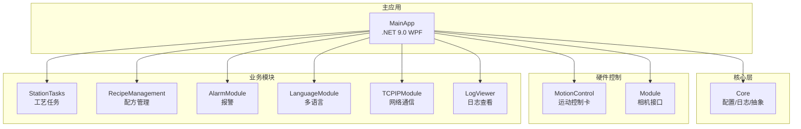
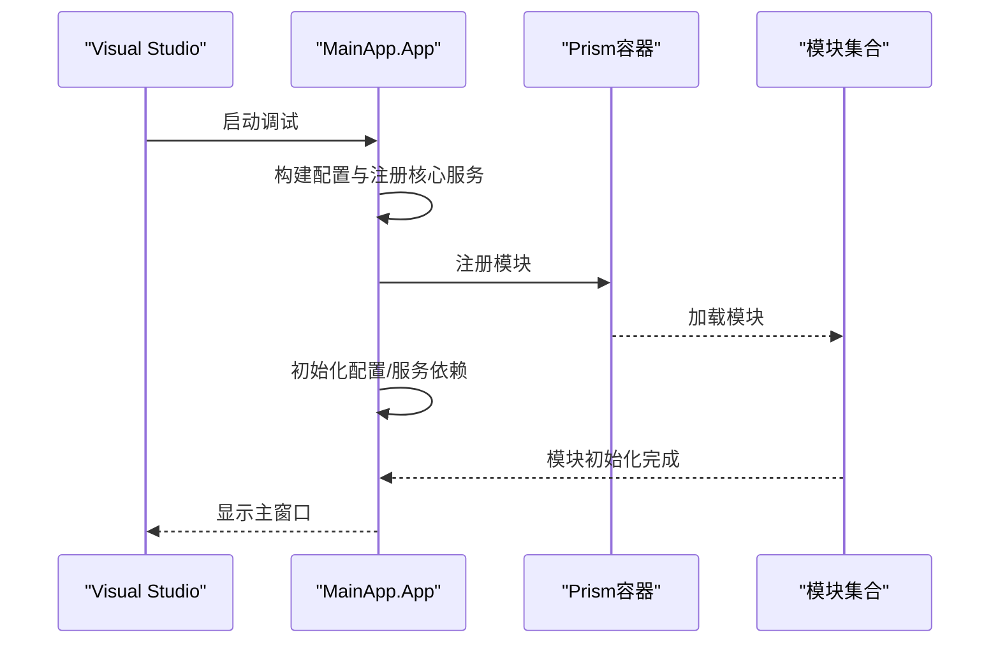
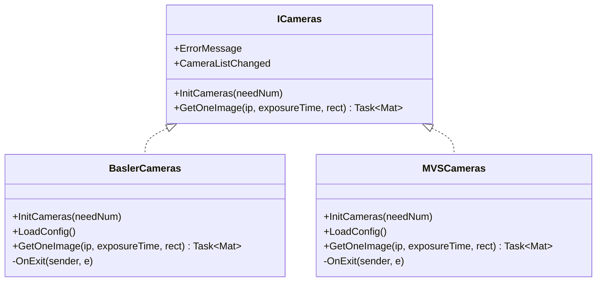
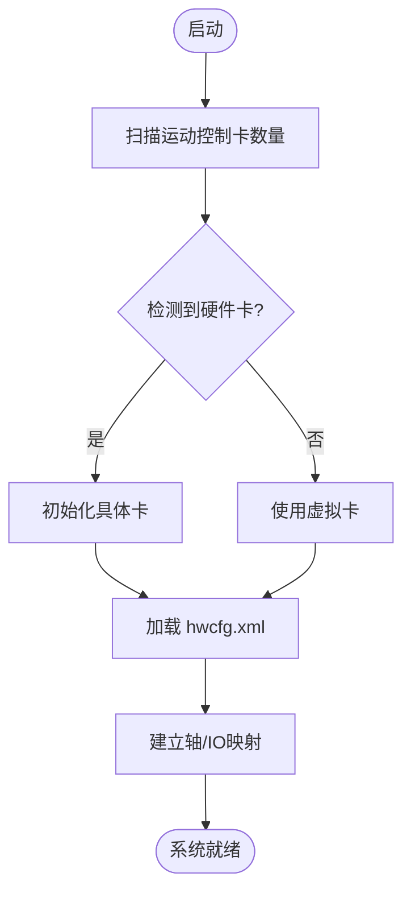
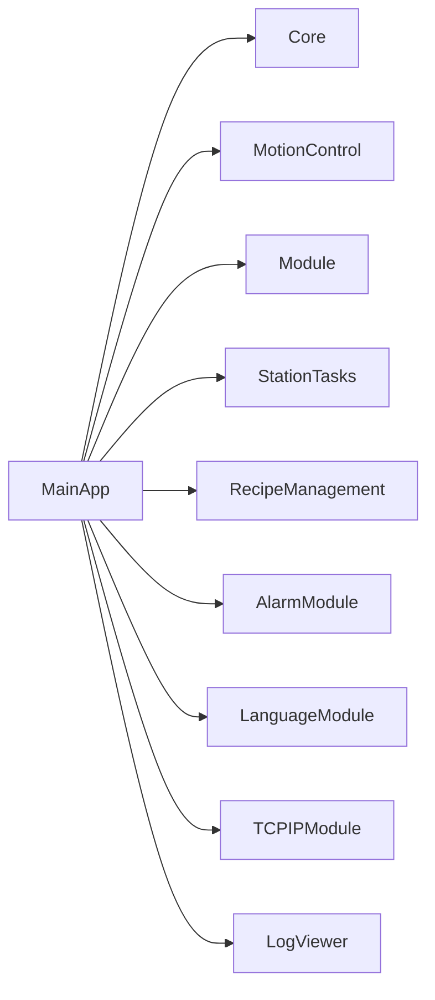

# 快速开始

<cite>
**本文引用的文件**
- [README.md](file://README.md)
- [MainApp.csproj](file://MainApp/MainApp.csproj)
- [Directory.Build.props](file://Directory.Build.props)
- [App.xaml.cs](file://MainApp/App.xaml.cs)
- [appsettings.json](file://Core/appsettings.json)
- [BaslerCameras.cs](file://Module/Devices/BaslerCameras.cs)
- [MVSCameras.cs](file://Module/Devices/MVSCameras.cs)
- [ICameras.cs](file://Module/Devices/ICameras.cs)
- [MotionCardFactory.cs](file://MotionControl/Card/MotionCardFactory.cs)
- [hwcfg.xml](file://MainApp/bin/Debug/net9.0-windows7.0/Config/HWConfig/hwcfg.xml)
- [launchSettings.json](file://MainApp/Properties/launchSettings.json)
- [AppSettings.cs](file://Core/Configuration/AppSettings.cs)
- [AxisParameterService.cs](file://MotionControl/Services/AxisParameterService.cs)
- [MotionService.cs](file://MotionControl/Services/MotionService.cs)
</cite>

## 目录
1. [简介](#简介)
2. [项目结构](#项目结构)
3. [核心组件](#核心组件)
4. [架构概览](#架构概览)
5. [详细组件分析](#详细组件分析)
6. [依赖关系分析](#依赖关系分析)
7. [性能考虑](#性能考虑)
8. [故障排除指南](#故障排除指南)
9. [结论](#结论)
10. [附录](#附录)

## 简介
本指南面向首次接触 GZQL_MACHINE 项目的用户，帮助您在最短时间内完成环境准备、硬件连接、软件安装与首次运行配置，并验证系统是否成功启动。内容涵盖：
- 环境要求（.NET 9.0、Visual Studio 等）
- 硬件依赖（相机 SDK、运动控制卡等）
- 安装步骤与首次运行配置
- 相机运行时库的下载与配置
- 硬件设备的连接设置
- 基本的系统启动流程
- 常见安装问题的解决方案与验证方法

## 项目结构
GZQL_MACHINE 是一个基于 WPF 和 .NET 9.0 的多模块工业自动化应用，采用 Prism 模块化架构，主要模块包括：
- MainApp：主应用入口，负责应用生命周期、模块装载与全局配置
- Core：通用抽象层、配置与日志服务
- MotionControl：运动控制卡驱动与轴/IO映射
- Module：相机接口与业务功能模块
- StationTasks：工艺流程与任务执行
- RecipeManagement：配方管理
- LogViewer：日志查看
- AlarmModule：报警管理
- LanguageModule：多语言支持
- TCPIPModule：网络通信

**图表来源**
- [MainApp.csproj:1-83](file://MainApp/MainApp.csproj#L1-L83)
- [App.xaml.cs:179-191](file://MainApp/App.xaml.cs#L179-L191)

**章节来源**
- [MainApp.csproj:1-83](file://MainApp/MainApp.csproj#L1-L83)
- [App.xaml.cs:179-191](file://MainApp/App.xaml.cs#L179-L191)

## 核心组件
- 应用入口与模块装载：MainApp 通过 Prism 加载多个模块，包括 MotionControl、StationTasks、RecipeManagement、AlarmModule、LanguageModule、TCPIPModule、LogViewer 等。
- 配置系统：Core 提供 IAppSettingService、JsonConfigurationService 等，支持从 appsettings.json 与 XML 配置文件加载。
- 日志系统：NLog 集成，提供全局异常捕获与崩溃转储。
- 相机接口：Module 定义 ICameras 接口，分别实现 Basler 与 MVS 海康相机接入。
- 运动控制：MotionControl 通过 MotionCardFactory 扫描并初始化运动控制卡，AxisParameterService 与 MotionService 负责轴与 IO 映射。

**章节来源**
- [App.xaml.cs:110-191](file://MainApp/App.xaml.cs#L110-L191)
- [AppSettings.cs:10-39](file://Core/Configuration/AppSettings.cs#L10-L39)
- [ICameras.cs:7-29](file://Module/Devices/ICameras.cs#L7-L29)
- [MotionCardFactory.cs:6-57](file://MotionControl/Card/MotionCardFactory.cs#L6-L57)

## 架构概览
系统启动流程（简化）：
1. MainApp 启动，构建 IConfiguration 并注册核心服务
2. 注册模块（LogViewer、Language、Framework、Alarm、MotionControl、Recipe、StationTasks、ModuleCore、Module、TCPIP）
3. 初始化配置与服务依赖
4. 模块按需初始化相机、运动控制卡与业务逻辑
5. 应用进入主窗口，等待用户交互

**图表来源**
- [App.xaml.cs:54-78](file://MainApp/App.xaml.cs#L54-L78)
- [App.xaml.cs:110-191](file://MainApp/App.xaml.cs#L110-L191)

**章节来源**
- [App.xaml.cs:54-78](file://MainApp/App.xaml.cs#L54-L78)
- [App.xaml.cs:110-191](file://MainApp/App.xaml.cs#L110-L191)

## 详细组件分析

### 环境与工具要求
- 目标框架：.NET 9.0（Windows 7+）
- 开发工具：Visual Studio（推荐最新稳定版）
- 运行时依赖：相机运行时库（见“相机运行时库”小节）

**章节来源**
- [MainApp.csproj:2-8](file://MainApp/MainApp.csproj#L2-L8)
- [Directory.Build.props:1-18](file://Directory.Build.props#L1-L18)

### 相机运行时库与配置
- 运行时库下载与放置位置
  - README 指示不再集成相机运行时，需另行下载并放置到指定目录，解压到对应子目录
  - Basler：pylon 运行时（若已安装则无需重复下载）
  - 海康（MVS）：MVS 运行时（若已安装 MVS 则无需重复下载）
- 相机接口与实现
  - ICameras 定义了相机初始化与图像采集接口
  - BaslerCameras 与 MVSCameras 分别封装了 Basler 与海康相机的初始化、参数配置与图像采集
- 验证相机可用性
  - 初始化过程中会触发 ErrorMessage 事件，若提示“运行时未安装”或“未找到相机”，请检查运行时库是否正确安装与路径配置

**图表来源**
- [ICameras.cs:7-29](file://Module/Devices/ICameras.cs#L7-L29)
- [BaslerCameras.cs:10-201](file://Module/Devices/BaslerCameras.cs#L10-L201)
- [MVSCameras.cs:11-389](file://Module/Devices/MVSCameras.cs#L11-L389)

**章节来源**
- [README.md:28-43](file://README.md#L28-L43)
- [ICameras.cs:7-29](file://Module/Devices/ICameras.cs#L7-L29)
- [BaslerCameras.cs:22-48](file://Module/Devices/BaslerCameras.cs#L22-L48)
- [MVSCameras.cs:24-55](file://Module/Devices/MVSCameras.cs#L24-L55)

### 硬件设备连接与配置
- 运动控制卡
  - MotionCardFactory 会在启动时扫描硬件卡数量并初始化具体卡
  - 若未检测到真实卡，系统会回退到虚拟卡以保证轴/IO映射正常
- 硬件配置文件
  - 系统通过 hwcfg.xml 定义轴、IO、插补系统、任务等配置
  - AxisParameterService 与 MotionService 负责从 hwcfg.xml 加载轴与插补系统配置，并建立轴/IO到卡的映射

**图表来源**
- [MotionCardFactory.cs:42-55](file://MotionControl/Card/MotionCardFactory.cs#L42-L55)
- [AxisParameterService.cs:41-77](file://MotionControl/Services/AxisParameterService.cs#L41-L77)
- [MotionService.cs:163-195](file://MotionControl/Services/MotionService.cs#L163-L195)

**章节来源**
- [MotionCardFactory.cs:6-57](file://MotionControl/Card/MotionCardFactory.cs#L6-L57)
- [hwcfg.xml:1-211](file://MainApp/bin/Debug/net9.0-windows7.0/Config/HWConfig/hwcfg.xml#L1-L211)
- [AxisParameterService.cs:233-283](file://MotionControl/Services/AxisParameterService.cs#L233-L283)
- [MotionService.cs:163-195](file://MotionControl/Services/MotionService.cs#L163-L195)

### 首次运行配置
- 应用配置
  - Core/appsettings.json 提供语言、主题、日志保留策略与硬件配置路径等基础设置
  - AppSettings.cs 定义了可序列化的应用设置模型
- 启动流程
  - MainApp 在 OnInitialized 中调用 InitializeConfiguration、InitializeTCPSystem、InitializeVisionSystem 等初始化步骤
  - 通过 Prism 注册模块，模块在自身 Initialize 方法中完成相机与硬件初始化

**章节来源**
- [appsettings.json:1-13](file://Core/appsettings.json#L1-L13)
- [AppSettings.cs:10-39](file://Core/Configuration/AppSettings.cs#L10-L39)
- [App.xaml.cs:65-72](file://MainApp/App.xaml.cs#L65-L72)
- [App.xaml.cs:110-191](file://MainApp/App.xaml.cs#L110-L191)

## 依赖关系分析
- 主应用 MainApp 依赖 Core、MotionControl、Module、StationTasks、RecipeManagement、AlarmModule、LanguageModule、TCPIPModule、LogViewer 等模块
- 模块间通过 Prism 的 IModuleCatalog 进行声明式装载
- 相机接口与实现解耦，便于替换不同厂商相机

**图表来源**
- [MainApp.csproj:28-40](file://MainApp/MainApp.csproj#L28-L40)
- [App.xaml.cs:179-191](file://MainApp/App.xaml.cs#L179-L191)

**章节来源**
- [MainApp.csproj:28-40](file://MainApp/MainApp.csproj#L28-L40)
- [App.xaml.cs:179-191](file://MainApp/App.xaml.cs#L179-L191)

## 性能考虑
- 相机采集优化：MVS 相机实现中包含 AOI 切换与像素格式判断，减少不必要的内存拷贝与转换
- 运动控制映射：通过 hwcfg.xml 将逻辑轴/IO 映射到实际卡，避免硬编码带来的维护成本
- 日志与异常：NLog 记录与全局异常捕获，有助于定位性能瓶颈与问题根因

**章节来源**
- [MVSCameras.cs:190-277](file://Module/Devices/MVSCameras.cs#L190-L277)
- [AxisParameterService.cs:41-77](file://MotionControl/Services/AxisParameterService.cs#L41-L77)
- [App.xaml.cs:210-298](file://MainApp/App.xaml.cs#L210-L298)

## 故障排除指南
- 无法找到相机
  - 症状：初始化时提示“运行时未安装”或“未找到相机”
  - 处理：根据 README 下载并安装对应相机运行时库，确保运行时库路径正确
- 运行时库路径问题
  - 症状：应用启动后相机模块初始化失败
  - 处理：确认运行时库已解压至指定目录，且与 README 中的路径一致
- 未检测到运动控制卡
  - 症状：系统回退到虚拟卡，轴/IO不可用
  - 处理：检查硬件连接与驱动安装，确认 MotionCardFactory 可扫描到卡
- 配置文件路径错误
  - 症状：应用无法加载硬件配置或数据库连接字符串
  - 处理：核对 Core/appsettings.json 与 MainApp/Properties/appsettings.json 中的路径与连接字符串
- 启动崩溃与异常
  - 症状：应用崩溃并生成转储文件
  - 处理：查看 CrashDumps 目录中的 dmp 文件与 ErrorReports 目录中的错误报告，结合日志定位问题

**章节来源**
- [README.md:28-43](file://README.md#L28-L43)
- [BaslerCameras.cs:38-42](file://Module/Devices/BaslerCameras.cs#L38-L42)
- [MVSCameras.cs:43-48](file://Module/Devices/MVSCameras.cs#L43-L48)
- [MotionCardFactory.cs:42-55](file://MotionControl/Card/MotionCardFactory.cs#L42-L55)
- [appsettings.json:1-13](file://Core/appsettings.json#L1-L13)
- [App.xaml.cs:210-298](file://MainApp/App.xaml.cs#L210-L298)

## 结论
通过本快速开始指南，您应已完成：
- 环境与工具准备（.NET 9.0、Visual Studio）
- 相机运行时库的下载与配置
- 硬件设备（相机、运动控制卡）的连接与识别
- 应用的首次运行与基本配置
- 常见问题的排查与验证方法

现在您可以启动 MainApp 并进入主界面，开始进一步的业务配置与调试。

## 附录

### 安装步骤清单
- 安装 .NET 9.0 SDK 与 Visual Studio
- 克隆/下载仓库并打开解决方案
- 根据 README 下载并安装相机运行时库（Basler 或 MVS）
- 连接相机与运动控制卡，确保驱动安装正确
- 设置工作目录与启动配置（参考 launchSettings.json）
- 运行 MainApp，观察日志与异常提示
- 如遇问题，检查 CrashDumps 与 ErrorReports 目录

**章节来源**
- [launchSettings.json:1-9](file://MainApp/Properties/launchSettings.json#L1-L9)
- [README.md:28-43](file://README.md#L28-L43)