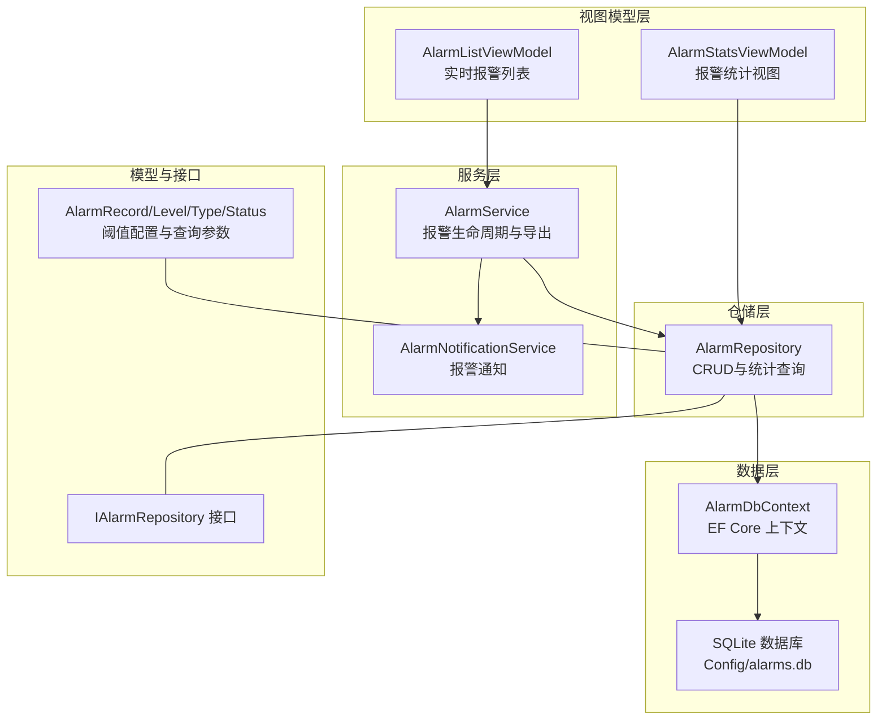
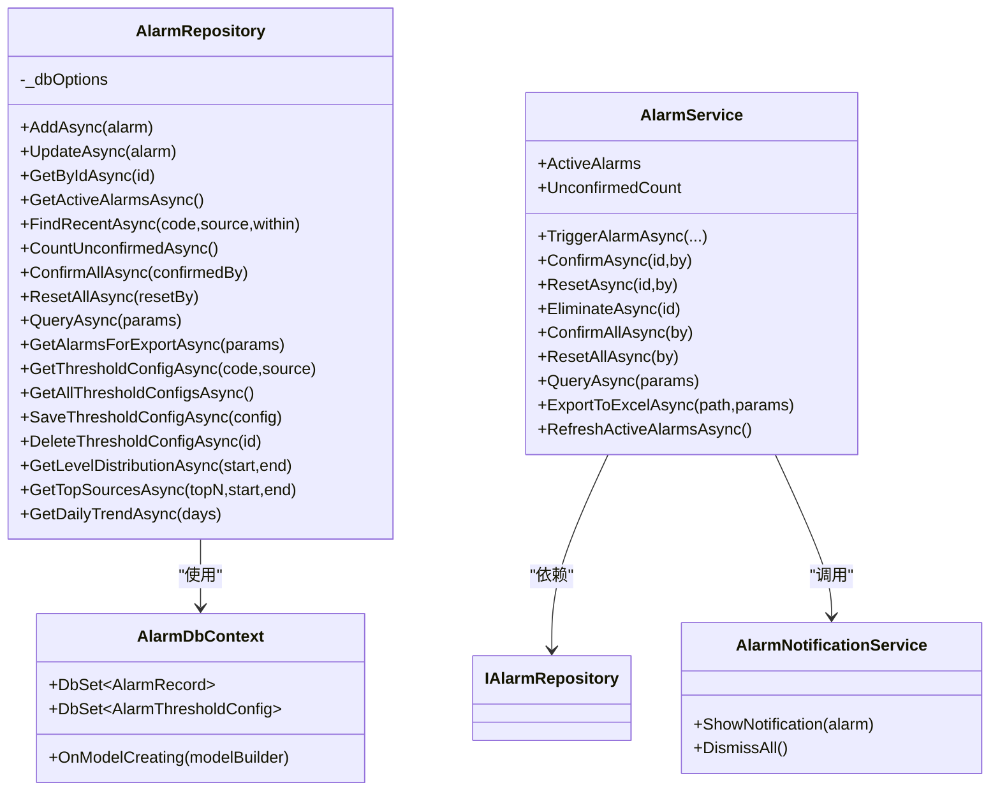
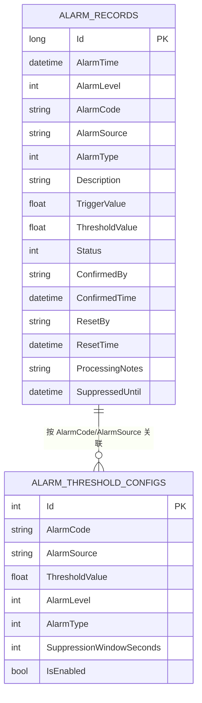
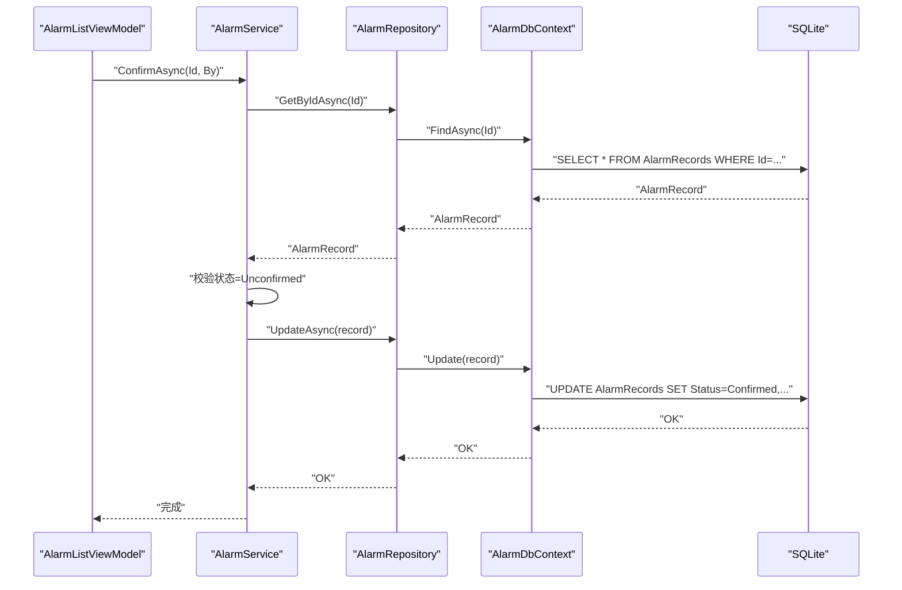
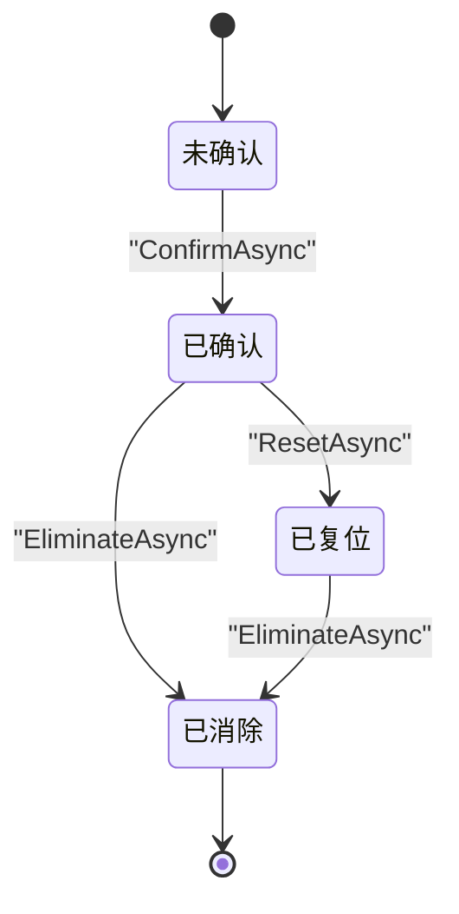
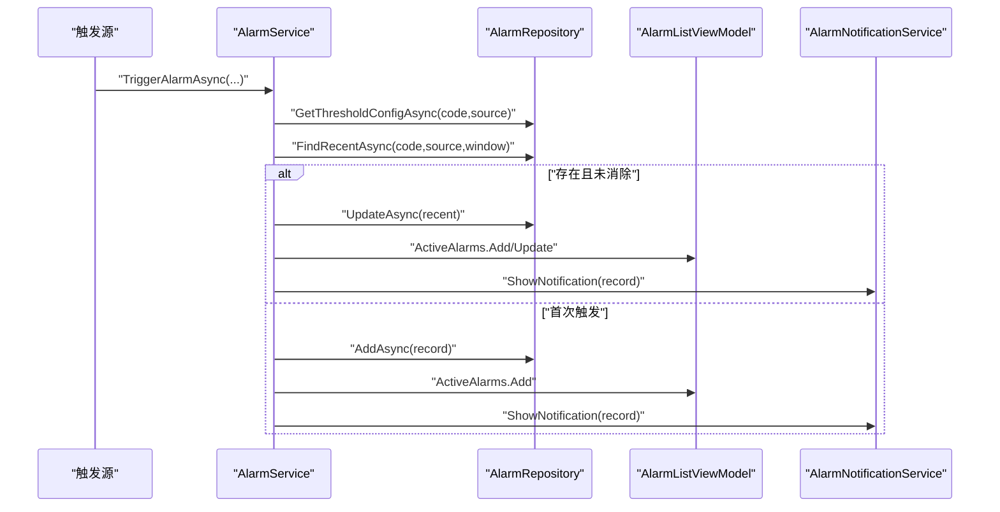
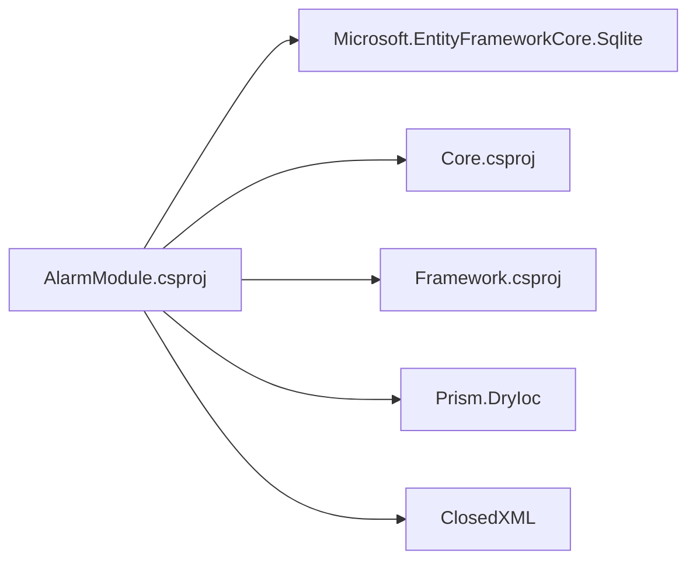

# 报警数据管理

<cite>
**本文引用的文件**
- [AlarmDbContext.cs](file://AlarmModule/Data/AlarmDbContext.cs)
- [AlarmRepository.cs](file://AlarmModule/Data/AlarmRepository.cs)
- [AlarmRecord.cs](file://AlarmModule/Models/AlarmRecord.cs)
- [AlarmLevel.cs](file://AlarmModule/Models/AlarmLevel.cs)
- [AlarmType.cs](file://AlarmModule/Models/AlarmType.cs)
- [AlarmStatus.cs](file://AlarmModule/Models/AlarmStatus.cs)
- [AlarmThresholdConfig.cs](file://AlarmModule/Models/AlarmThresholdConfig.cs)
- [AlarmQueryParams.cs](file://AlarmModule/Models/AlarmQueryParams.cs)
- [IAlarmRepository.cs](file://AlarmModule/Interfaces/IAlarmRepository.cs)
- [AlarmService.cs](file://AlarmModule/Services/AlarmService.cs)
- [AlarmNotificationService.cs](file://AlarmModule/Services/AlarmNotificationService.cs)
- [AlarmListViewModel.cs](file://AlarmModule/ViewModels/AlarmListViewModel.cs)
- [AlarmStatsViewModel.cs](file://AlarmModule/ViewModels/AlarmStatsViewModel.cs)
- [AlarmModule.csproj](file://AlarmModule/AlarmModule.csproj)
</cite>

## 目录
1. [简介](#简介)
2. [项目结构](#项目结构)
3. [核心组件](#核心组件)
4. [架构总览](#架构总览)
5. [详细组件分析](#详细组件分析)
6. [依赖分析](#依赖分析)
7. [性能考虑](#性能考虑)
8. [故障排查指南](#故障排查指南)
9. [结论](#结论)
10. [附录](#附录)

## 简介
本技术文档围绕报警数据管理模块进行系统性梳理，涵盖数据库设计与迁移、实体模型与索引、仓储模式实现、报警级别与状态管理、服务层与通知机制、以及数据访问层最佳实践与运维建议。目标是帮助开发者与运维人员快速理解并高效维护该模块。

## 项目结构
报警模块采用分层架构：数据层（EF Core + SQLite）、仓储层、服务层、视图模型层与通知层，配合 Prism MVVM 模式组织界面交互。

图表来源
- [AlarmListViewModel.cs:16-95](file://AlarmModule/ViewModels/AlarmListViewModel.cs#L16-L95)
- [AlarmStatsViewModel.cs:17-93](file://AlarmModule/ViewModels/AlarmStatsViewModel.cs#L17-L93)
- [AlarmService.cs:16-46](file://AlarmModule/Services/AlarmService.cs#L16-L46)
- [AlarmNotificationService.cs:19-30](file://AlarmModule/Services/AlarmNotificationService.cs#L19-L30)
- [AlarmRepository.cs:15-25](file://AlarmModule/Data/AlarmRepository.cs#L15-L25)
- [AlarmDbContext.cs:10-16](file://AlarmModule/Data/AlarmDbContext.cs#L10-L16)
- [AlarmModule.csproj:10-20](file://AlarmModule/AlarmModule.csproj#L10-L20)

章节来源
- [AlarmModule.csproj:1-23](file://AlarmModule/AlarmModule.csproj#L1-L23)

## 核心组件
- 数据库上下文：集中定义实体、索引与枚举转换，确保 SQLite 存储一致性与查询效率。
- 仓储实现：提供报警记录与阈值配置的 CRUD、分页查询、统计分析与批量状态变更。
- 业务服务：封装报警触发、状态流转、导出 Excel、活跃报警集合管理与通知联动。
- 视图模型：绑定 UI 与服务，提供命令与状态展示。
- 通知服务：按等级弹出不同视觉与声音反馈，保障关键报警及时可见。

章节来源
- [AlarmDbContext.cs:10-44](file://AlarmModule/Data/AlarmDbContext.cs#L10-L44)
- [AlarmRepository.cs:15-265](file://AlarmModule/Data/AlarmRepository.cs#L15-L265)
- [AlarmService.cs:16-307](file://AlarmModule/Services/AlarmService.cs#L16-L307)
- [AlarmNotificationService.cs:19-308](file://AlarmModule/Services/AlarmNotificationService.cs#L19-L308)
- [AlarmListViewModel.cs:16-261](file://AlarmModule/ViewModels/AlarmListViewModel.cs#L16-L261)
- [AlarmStatsViewModel.cs:17-217](file://AlarmModule/ViewModels/AlarmStatsViewModel.cs#L17-L217)

## 架构总览
报警模块遵循“仓储 + 服务 + 视图模型 + 通知”的分层设计，数据持久化基于 EF Core + SQLite，支持本地文件数据库与轻量部署。

图表来源
- [AlarmDbContext.cs:10-44](file://AlarmModule/Data/AlarmDbContext.cs#L10-L44)
- [AlarmRepository.cs:15-265](file://AlarmModule/Data/AlarmRepository.cs#L15-L265)
- [AlarmService.cs:16-307](file://AlarmModule/Services/AlarmService.cs#L16-L307)
- [AlarmNotificationService.cs:19-308](file://AlarmModule/Services/AlarmNotificationService.cs#L19-L308)
- [IAlarmRepository.cs:11-32](file://AlarmModule/Interfaces/IAlarmRepository.cs#L11-L32)

## 详细组件分析

### 数据库上下文与实体关系
- AlarmDbContext
  - 定义两个 DbSet：AlarmRecords、AlarmThresholdConfigs。
  - 在 OnModelCreating 中：
    - 对 AlarmRecord 设置复合索引与枚举转换（整型存储），提升查询效率并避免 SQLite 索引 IComparable 异常。
    - 对 AlarmThresholdConfig 设置唯一索引（AlarmCode + AlarmSource），保证阈值配置唯一性。
- 实体关系
  - AlarmRecord：报警主表，包含触发时间、等级、类型、来源、描述、阈值、状态、确认/复位信息、处理备注、抑制截止时间等。
  - AlarmThresholdConfig：阈值配置表，支持按 AlarmCode 与 AlarmSource 维度配置阈值、等级、类型、抑制窗口与启用状态。

图表来源
- [AlarmDbContext.cs:18-43](file://AlarmModule/Data/AlarmDbContext.cs#L18-L43)
- [AlarmRecord.cs:12-60](file://AlarmModule/Models/AlarmRecord.cs#L12-L60)
- [AlarmThresholdConfig.cs:10-35](file://AlarmModule/Models/AlarmThresholdConfig.cs#L10-L35)

章节来源
- [AlarmDbContext.cs:10-44](file://AlarmModule/Data/AlarmDbContext.cs#L10-L44)
- [AlarmRecord.cs:11-60](file://AlarmModule/Models/AlarmRecord.cs#L11-L60)
- [AlarmThresholdConfig.cs:9-35](file://AlarmModule/Models/AlarmThresholdConfig.cs#L9-L35)

### 报警数据模型与字段约束
- AlarmRecord 字段要点
  - 主键自增 Id；AlarmTime 默认当前时间；AlarmCode/AlarmSource/Description 有长度限制；TriggerValue/ThresholdValue 可空；状态默认未确认。
  - ConfirmedBy/ResetBy 最大长度 50；ProcessingNotes 最大长度 1000；SuppressedUntil 用于防抖抑制。
- 约束与索引
  - AlarmRecord：对 AlarmTime、AlarmLevel、AlarmCode、AlarmSource、Status 建立索引；复合索引（AlarmCode, AlarmSource）。
  - AlarmThresholdConfig：对 AlarmCode 建立索引；复合唯一索引（AlarmCode, AlarmSource）。
- 枚举存储
  - 使用 HasConversion<int>() 将枚举以整数形式存储，避免 SQLite 索引创建时的比较器问题。

章节来源
- [AlarmRecord.cs:12-60](file://AlarmModule/Models/AlarmRecord.cs#L12-L60)
- [AlarmThresholdConfig.cs:10-35](file://AlarmModule/Models/AlarmThresholdConfig.cs#L10-L35)
- [AlarmDbContext.cs:18-43](file://AlarmModule/Data/AlarmDbContext.cs#L18-L43)

### 仓储模式实现（AlarmRepository）
- 设计原则
  - 每次数据库操作新建 DbContext 实例，避免在 Singleton 场景下上下文被释放导致的异常。
  - 所有查询均返回不可变集合或异步执行，保证线程安全与响应性。
- 核心能力
  - 报警记录：新增、更新、按 Id 查询、活跃报警查询、最近报警查询（含抑制窗口）、未确认计数、批量确认/复位。
  - 报表统计：按等级分布、Top 来源、近 N 日趋势。
  - 导出：支持按查询参数导出为 Excel。
  - 阈值配置：按 Code/Source 获取、全量查询、保存（存在则更新，否则新增）、删除。
- 查询优化
  - 使用 Where + OrderBy + Skip/Take 实现分页；关键字搜索同时匹配描述与代码。
  - 复合索引与枚举整型存储降低查询成本。

图表来源
- [AlarmListViewModel.cs:113-126](file://AlarmModule/ViewModels/AlarmListViewModel.cs#L113-L126)
- [AlarmService.cs:96-111](file://AlarmModule/Services/AlarmService.cs#L96-L111)
- [AlarmRepository.cs:42-46](file://AlarmModule/Data/AlarmRepository.cs#L42-L46)
- [AlarmRepository.cs:35-40](file://AlarmModule/Data/AlarmRepository.cs#L35-L40)

章节来源
- [AlarmRepository.cs:15-265](file://AlarmModule/Data/AlarmRepository.cs#L15-L265)
- [IAlarmRepository.cs:11-32](file://AlarmModule/Interfaces/IAlarmRepository.cs#L11-L32)

### 报警级别、类型与状态管理
- 报警级别（AlarmLevel）
  - 紧急（Emergency）、严重（Serious）、一般（General）、提示（Prompt），对应工业 4 级分类。
- 报警类型（AlarmType）
  - 硬件故障、参数超限、通讯错误、工艺错误。
- 状态生命周期（AlarmStatus）
  - Unconfirmed → Confirmed → Reset → Eliminated，支持批量状态变更与单条消除。

图表来源
- [AlarmStatus.cs:6-16](file://AlarmModule/Models/AlarmStatus.cs#L6-L16)
- [AlarmService.cs:96-155](file://AlarmModule/Services/AlarmService.cs#L96-L155)

章节来源
- [AlarmLevel.cs:6-16](file://AlarmModule/Models/AlarmLevel.cs#L6-L16)
- [AlarmType.cs:6-16](file://AlarmModule/Models/AlarmType.cs#L6-L16)
- [AlarmStatus.cs:6-16](file://AlarmModule/Models/AlarmStatus.cs#L6-L16)

### 服务层与通知机制
- AlarmService
  - 防抖抑制：根据阈值配置的抑制窗口判断是否更新最近报警而非重复创建。
  - 状态流转：严格的前置校验，防止非法状态变更。
  - 导出：使用 ClosedXML 生成 Excel 文件，包含完整字段。
  - 活跃报警集合：ObservableCollection，支持 UI 实时刷新。
- AlarmNotificationService
  - 等级化通知：紧急（红色模态+持续蜂鸣）、严重（橙色模态+单次蜂鸣）、一般（黄色 Toast，5 秒）、提示（蓝色 Toast，3 秒）。
  - 资源管理：持续蜂鸣使用 CancellationTokenSource 控制停止。

图表来源
- [AlarmService.cs:52-91](file://AlarmModule/Services/AlarmService.cs#L52-L91)
- [AlarmNotificationService.cs:35-55](file://AlarmModule/Services/AlarmNotificationService.cs#L35-L55)
- [AlarmListViewModel.cs:80-95](file://AlarmModule/ViewModels/AlarmListViewModel.cs#L80-L95)

章节来源
- [AlarmService.cs:16-307](file://AlarmModule/Services/AlarmService.cs#L16-L307)
- [AlarmNotificationService.cs:19-308](file://AlarmModule/Services/AlarmNotificationService.cs#L19-L308)
- [AlarmListViewModel.cs:16-261](file://AlarmModule/ViewModels/AlarmListViewModel.cs#L16-L261)

### 统计与报表
- AlarmStatsViewModel
  - 等级分布：按 AlarmLevel 分组计数，支持日期范围筛选。
  - Top 来源：按 AlarmSource 分组取前 N。
  - 每日趋势：近 N 天的每日计数，填充缺失日期为 0。
- AlarmRepository 提供相应聚合查询方法，返回可绑定的数据结构。

章节来源
- [AlarmStatsViewModel.cs:17-217](file://AlarmModule/ViewModels/AlarmStatsViewModel.cs#L17-L217)
- [AlarmRepository.cs:186-241](file://AlarmModule/Data/AlarmRepository.cs#L186-L241)

## 依赖分析
- 外部依赖
  - EF Core 9 与 SQLite Provider：提供 ORM 能力与本地数据库支持。
  - ClosedXML：用于导出 Excel。
  - Prism.DryIoc：依赖注入与 MVVM 框架。
- 内部依赖
  - AlarmModule 依赖 Core 与 Framework，提供日志与通用工具。

图表来源
- [AlarmModule.csproj:10-20](file://AlarmModule/AlarmModule.csproj#L10-L20)

章节来源
- [AlarmModule.csproj:1-23](file://AlarmModule/AlarmModule.csproj#L1-L23)

## 性能考虑
- 查询性能
  - 利用索引：AlarmRecord 的 AlarmTime、AlarmLevel、AlarmCode、AlarmSource、Status 与复合索引（AlarmCode, AlarmSource）。
  - 枚举整型存储：避免 SQLite 索引比较异常，减少存储与比较开销。
  - 分页查询：使用 Skip/Take，避免一次性加载大量数据。
- 写入性能
  - 每次操作新建 DbContext，避免长生命周期上下文带来的跟踪与内存压力。
  - 批量操作：ConfirmAllAsync/ResetAllAsync 先查询再批量更新，减少多次往返。
- 导出性能
  - 导出使用 ClosedXML，建议在后台线程执行，避免阻塞 UI。
- 并发与线程
  - UI 更新通过 Dispatcher.Invoke，确保线程安全。
  - 通知服务的持续蜂鸣使用后台任务与取消令牌，避免资源泄漏。

## 故障排查指南
- 常见问题
  - “上下文已被释放”：确认仓储每次操作使用独立 DbContext 实例。
  - “状态流转异常”：检查 AlarmService 的前置校验逻辑，确保只在合法状态下调用 Confirm/Reset/Eliminate。
  - “Excel 导出失败”：确认 ClosedXML 可用与目标路径可写。
  - “通知无声音/无弹窗”：检查系统声音权限与 UI 线程调度。
- 日志与诊断
  - 服务层广泛使用日志记录关键操作与异常，便于定位问题。
  - 统计视图与列表视图均有错误捕获与日志输出。

章节来源
- [AlarmService.cs:96-155](file://AlarmModule/Services/AlarmService.cs#L96-L155)
- [AlarmListViewModel.cs:115-126](file://AlarmModule/ViewModels/AlarmListViewModel.cs#L115-L126)
- [AlarmStatsViewModel.cs:98-110](file://AlarmModule/ViewModels/AlarmStatsViewModel.cs#L98-L110)

## 结论
报警数据管理模块以 EF Core + SQLite 为基础，结合仓储与服务层实现了完整的报警生命周期管理、统计分析与可视化展示。通过合理的索引设计、枚举整型存储与分页查询，兼顾了易用性与性能。建议在生产环境中进一步完善连接池配置、备份策略与监控指标，以满足长期稳定运行需求。

## 附录

### 数据访问层最佳实践
- 连接池与并发
  - 使用 SQLite 时，建议在应用启动阶段统一配置 SQLite 连接字符串与参数，避免频繁创建连接。
  - 仓储层已通过每次操作新建 DbContext 的方式规避上下文并发问题。
- 错误处理
  - 所有异步方法均包含 try/catch 与日志记录，建议在上层统一处理异常并提示用户。
- 事务管理
  - 当前仓储未显式使用事务；若需要跨多个实体的强一致写入，可在仓储中引入显式事务块。

### 数据备份与恢复
- 备份
  - SQLite 数据库为单一文件，可直接复制 Config/alarms.db 进行备份。
  - 建议在应用空闲时段执行备份，或使用定时任务定期生成快照。
- 恢复
  - 停止应用后替换 Config/alarms.db 为备份文件，重启应用验证数据完整性。
- 归档
  - 对历史数据可定期导出 Excel 或迁移到归档数据库，减少主库体积。

### 性能监控指标
- 查询指标
  - 分页查询耗时、活跃报警加载耗时、统计聚合耗时。
- 写入指标
  - 报警触发频率、批量确认/复位耗时、阈值配置保存耗时。
- 资源指标
  - SQLite 文件大小、内存占用、UI 响应延迟。
- 建议
  - 使用日志或外部监控系统采集上述指标，结合报警阈值告警，提前发现性能退化。