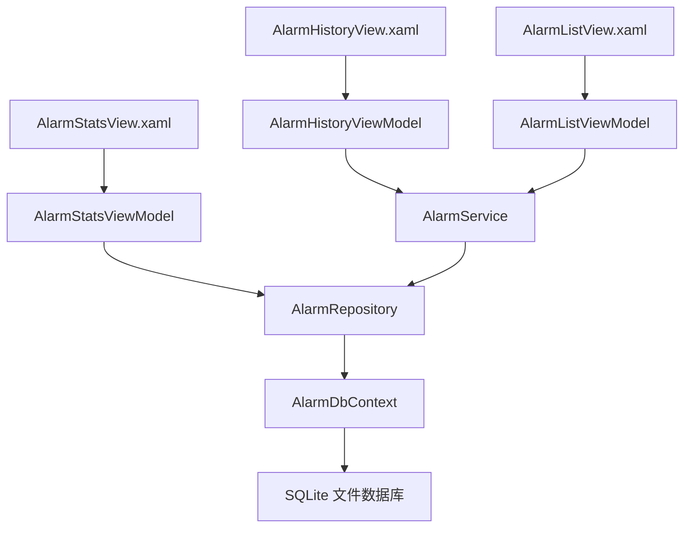
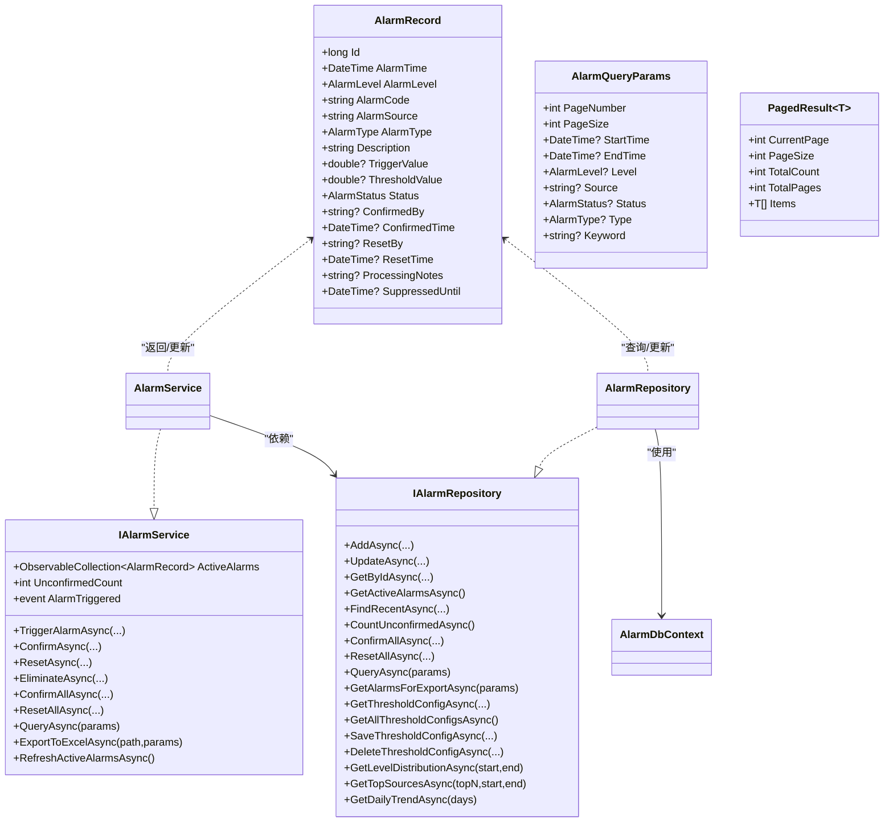
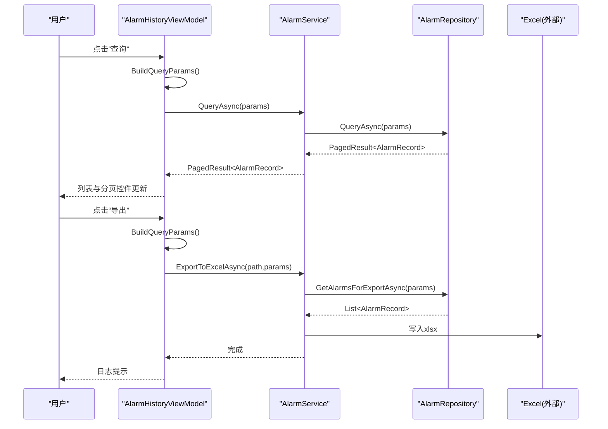
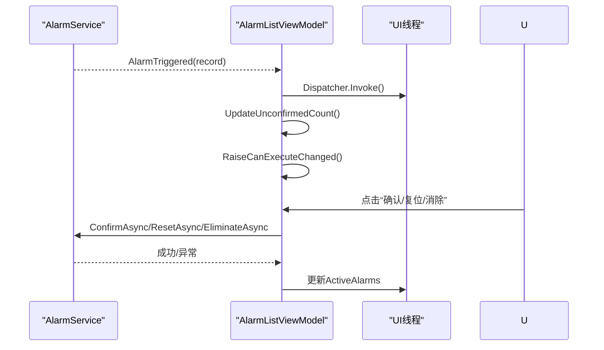
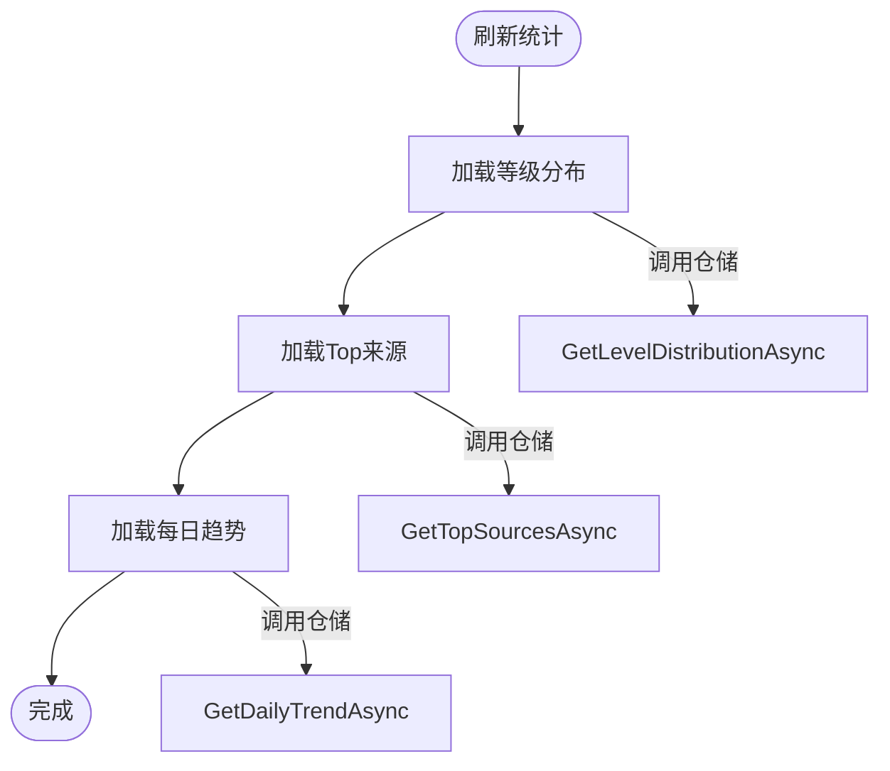
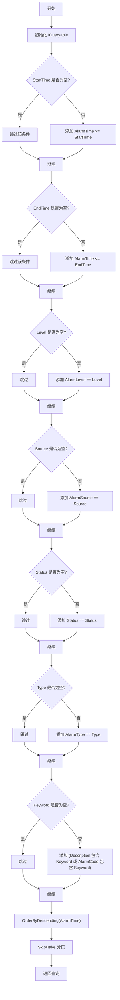
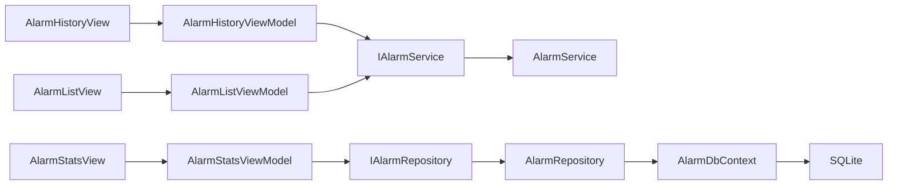

# 报警查询与统计

<cite>
**本文引用的文件**
- [AlarmQueryParams.cs](file://AlarmModule/Models/AlarmQueryParams.cs)
- [AlarmRecord.cs](file://AlarmModule/Models/AlarmRecord.cs)
- [AlarmLevel.cs](file://AlarmModule/Models/AlarmLevel.cs)
- [AlarmStatus.cs](file://AlarmModule/Models/AlarmStatus.cs)
- [AlarmType.cs](file://AlarmModule/Models/AlarmType.cs)
- [AlarmHistoryViewModel.cs](file://AlarmModule/ViewModels/AlarmHistoryViewModel.cs)
- [AlarmListViewModel.cs](file://AlarmModule/ViewModels/AlarmListViewModel.cs)
- [AlarmStatsViewModel.cs](file://AlarmModule/ViewModels/AlarmStatsViewModel.cs)
- [AlarmRepository.cs](file://AlarmModule/Data/AlarmRepository.cs)
- [AlarmService.cs](file://AlarmModule/Services/AlarmService.cs)
- [IAlarmService.cs](file://AlarmModule/Interfaces/IAlarmService.cs)
- [IAlarmRepository.cs](file://AlarmModule/Interfaces/IAlarmRepository.cs)
- [AlarmDbContext.cs](file://AlarmModule/Data/AlarmDbContext.cs)
- [AlarmHistoryView.xaml](file://AlarmModule/Views/AlarmHistoryView.xaml)
- [AlarmListView.xaml](file://AlarmModule/Views/AlarmListView.xaml)
</cite>

## 目录
1. [简介](#简介)
2. [项目结构](#项目结构)
3. [核心组件](#核心组件)
4. [架构总览](#架构总览)
5. [详细组件分析](#详细组件分析)
6. [依赖关系分析](#依赖关系分析)
7. [性能考虑](#性能考虑)
8. [故障排查指南](#故障排查指南)
9. [结论](#结论)
10. [附录](#附录)

## 简介
本技术文档围绕报警查询与统计功能展开，系统性阐述 AlarmQueryParams 参数模型、查询条件构建、分页机制；AlarmHistoryViewModel 的历史查询能力（时间范围、类型、状态筛选）；AlarmListViewModel 的实时列表展示（数据刷新、排序、搜索）；AlarmStatsViewModel 的统计分析（趋势、类型分布、Top来源）。同时给出查询性能优化策略（索引、缓存、异步查询），以及统计图表与导出的技术细节。

## 项目结构
报警模块采用 MVVM + EF Core + SQLite 的分层设计：
- 视图层：XAML 页面绑定对应 ViewModel
- 视图模型层：负责业务交互、命令与状态管理
- 服务层：封装业务流程与外部集成（仓储、通知、日志）
- 数据访问层：基于 EF Core 的仓储实现与数据库上下文
- 模型层：实体与查询参数、枚举定义

**图表来源**
- [AlarmHistoryView.xaml:1-187](file://AlarmModule/Views/AlarmHistoryView.xaml#L1-L187)
- [AlarmListView.xaml:1-181](file://AlarmModule/Views/AlarmListView.xaml#L1-L181)
- [AlarmHistoryViewModel.cs:1-281](file://AlarmModule/ViewModels/AlarmHistoryViewModel.cs#L1-L281)
- [AlarmListViewModel.cs:1-262](file://AlarmModule/ViewModels/AlarmListViewModel.cs#L1-L262)
- [AlarmStatsViewModel.cs:1-218](file://AlarmModule/ViewModels/AlarmStatsViewModel.cs#L1-L218)
- [AlarmService.cs:1-308](file://AlarmModule/Services/AlarmService.cs#L1-L308)
- [AlarmRepository.cs:1-266](file://AlarmModule/Data/AlarmRepository.cs#L1-L266)
- [AlarmDbContext.cs:1-46](file://AlarmModule/Data/AlarmDbContext.cs#L1-L46)

**章节来源**
- [AlarmHistoryView.xaml:1-187](file://AlarmModule/Views/AlarmHistoryView.xaml#L1-L187)
- [AlarmListView.xaml:1-181](file://AlarmModule/Views/AlarmListView.xaml#L1-L181)
- [AlarmHistoryViewModel.cs:1-281](file://AlarmModule/ViewModels/AlarmHistoryViewModel.cs#L1-L281)
- [AlarmListViewModel.cs:1-262](file://AlarmModule/ViewModels/AlarmListViewModel.cs#L1-L262)
- [AlarmStatsViewModel.cs:1-218](file://AlarmModule/ViewModels/AlarmStatsViewModel.cs#L1-L218)
- [AlarmService.cs:1-308](file://AlarmModule/Services/AlarmService.cs#L1-L308)
- [AlarmRepository.cs:1-266](file://AlarmModule/Data/AlarmRepository.cs#L1-L266)
- [AlarmDbContext.cs:1-46](file://AlarmModule/Data/AlarmDbContext.cs#L1-L46)

## 核心组件
- 参数模型与实体
  - AlarmQueryParams：分页参数与多条件过滤字段
  - PagedResult<T>：分页结果容器
  - AlarmRecord：报警实体，包含时间、等级、类型、状态、阈值、处理信息等
  - AlarmLevel/AlarmStatus/AlarmType：枚举定义
- 服务与仓储
  - IAlarmService：对外暴露触发、生命周期管理、查询、导出、活跃列表刷新
  - IAlarmRepository：仓储接口，提供查询、统计、阈值配置 CRUD
  - AlarmService：实现报警生命周期、防抖、活跃列表维护、Excel导出
  - AlarmRepository：EF Core 实现，构建过滤查询、分页、统计聚合
- 视图模型
  - AlarmHistoryViewModel：历史查询、分页、导出
  - AlarmListViewModel：实时列表、确认/复位/消除、刷新
  - AlarmStatsViewModel：统计分析（等级分布、Top来源、每日趋势）

**章节来源**
- [AlarmQueryParams.cs:1-34](file://AlarmModule/Models/AlarmQueryParams.cs#L1-L34)
- [AlarmRecord.cs:1-62](file://AlarmModule/Models/AlarmRecord.cs#L1-L62)
- [AlarmLevel.cs:1-18](file://AlarmModule/Models/AlarmLevel.cs#L1-L18)
- [AlarmStatus.cs:1-18](file://AlarmModule/Models/AlarmStatus.cs#L1-L18)
- [AlarmType.cs:1-18](file://AlarmModule/Models/AlarmType.cs#L1-L18)
- [IAlarmService.cs:1-77](file://AlarmModule/Interfaces/IAlarmService.cs#L1-L77)
- [IAlarmRepository.cs:1-34](file://AlarmModule/Interfaces/IAlarmRepository.cs#L1-L34)
- [AlarmService.cs:1-308](file://AlarmModule/Services/AlarmService.cs#L1-L308)
- [AlarmRepository.cs:1-266](file://AlarmModule/Data/AlarmRepository.cs#L1-L266)

## 架构总览
系统遵循清晰的分层与职责分离：
- 视图层通过 Prism 绑定 ViewModel，ViewModel 调用服务接口
- 服务层协调仓储与通知、日志
- 仓储层基于 EF Core 对 SQLite 进行查询与聚合
- 数据库上下文定义索引与枚举转换，保障查询效率与稳定性

**图表来源**
- [AlarmRecord.cs:1-62](file://AlarmModule/Models/AlarmRecord.cs#L1-L62)
- [AlarmQueryParams.cs:1-34](file://AlarmModule/Models/AlarmQueryParams.cs#L1-L34)
- [PagedResult~T~:25-32](file://AlarmModule/Models/AlarmQueryParams.cs#L25-L32)
- [IAlarmService.cs:1-77](file://AlarmModule/Interfaces/IAlarmService.cs#L1-L77)
- [IAlarmRepository.cs:1-34](file://AlarmModule/Interfaces/IAlarmRepository.cs#L1-L34)
- [AlarmService.cs:1-308](file://AlarmModule/Services/AlarmService.cs#L1-L308)
- [AlarmRepository.cs:1-266](file://AlarmModule/Data/AlarmRepository.cs#L1-L266)
- [AlarmDbContext.cs:1-46](file://AlarmModule/Data/AlarmDbContext.cs#L1-L46)

## 详细组件分析

### AlarmQueryParams 参数模型与分页
- 字段覆盖：页码、页大小、时间范围、等级、来源、状态、类型、关键词
- 分页结果：包含当前页、页大小、总数、总页数与条目集合
- 使用场景：历史查询、导出、统计

**章节来源**
- [AlarmQueryParams.cs:1-34](file://AlarmModule/Models/AlarmQueryParams.cs#L1-L34)

### AlarmHistoryViewModel 历史查询与分页
- 查询条件：时间范围、等级、来源、状态、类型、关键词
- 分页机制：当前页、总页数、上一页/下一页命令
- 导出功能：弹出保存对话框，调用服务导出 Excel
- 错误处理：统一记录日志

**图表来源**
- [AlarmHistoryViewModel.cs:1-281](file://AlarmModule/ViewModels/AlarmHistoryViewModel.cs#L1-L281)
- [AlarmService.cs:1-308](file://AlarmModule/Services/AlarmService.cs#L1-L308)
- [AlarmRepository.cs:1-266](file://AlarmModule/Data/AlarmRepository.cs#L1-L266)

**章节来源**
- [AlarmHistoryViewModel.cs:1-281](file://AlarmModule/ViewModels/AlarmHistoryViewModel.cs#L1-L281)
- [AlarmHistoryView.xaml:1-187](file://AlarmModule/Views/AlarmHistoryView.xaml#L1-L187)

### AlarmListViewModel 实时列表与操作
- 实时性：订阅 AlarmTriggered 事件，使用 Dispatcher 在 UI 线程更新
- 操作：单条确认/复位/消除、批量确认/复位、手动刷新
- 状态联动：未确认计数变化驱动命令可用性

**图表来源**
- [AlarmListViewModel.cs:1-262](file://AlarmModule/ViewModels/AlarmListViewModel.cs#L1-L262)
- [AlarmService.cs:1-308](file://AlarmModule/Services/AlarmService.cs#L1-L308)

**章节来源**
- [AlarmListViewModel.cs:1-262](file://AlarmModule/ViewModels/AlarmListViewModel.cs#L1-L262)
- [AlarmListView.xaml:1-181](file://AlarmModule/Views/AlarmListView.xaml#L1-L181)

### AlarmStatsViewModel 统计分析
- 时间范围：默认近30天
- 统计维度：
  - 等级分布：按 AlarmLevel 聚合，映射颜色与名称
  - Top 10 来源：按 AlarmSource 聚合
  - 近7日趋势：按 AlarmTime.Date 聚合
- 最大值：用于进度条 Maximum 绑定

**图表来源**
- [AlarmStatsViewModel.cs:1-218](file://AlarmModule/ViewModels/AlarmStatsViewModel.cs#L1-L218)
- [AlarmRepository.cs:1-266](file://AlarmModule/Data/AlarmRepository.cs#L1-L266)

**章节来源**
- [AlarmStatsViewModel.cs:1-218](file://AlarmModule/ViewModels/AlarmStatsViewModel.cs#L1-L218)

### 查询条件构建与过滤
- AlarmRepository.BuildFilterQuery 将 AlarmQueryParams 映射为 LINQ 查询：
  - 时间范围：AlarmTime >= startTime 且 AlarmTime <= endTime
  - 等级/状态/类型：精确匹配
  - 来源：AlarmSource 精确匹配
  - 关键词：Description 或 AlarmCode 包含
- 分页：OrderByDescending(AlarmTime)，Skip/Take 实现

**图表来源**
- [AlarmRepository.cs:243-263](file://AlarmModule/Data/AlarmRepository.cs#L243-L263)

**章节来源**
- [AlarmRepository.cs:110-130](file://AlarmModule/Data/AlarmRepository.cs#L110-L130)
- [AlarmRepository.cs:243-263](file://AlarmModule/Data/AlarmRepository.cs#L243-L263)

### 统计图表与导出
- 统计图表：AlarmStatsViewModel 提供集合绑定，前端可直接绑定到柱状图/饼图控件
- 导出功能：AlarmService.ExportToExcelAsync 使用 ClosedXML 生成 Excel，包含标题行与数据行，自动调整列宽并保存

**章节来源**
- [AlarmStatsViewModel.cs:1-218](file://AlarmModule/ViewModels/AlarmStatsViewModel.cs#L1-L218)
- [AlarmService.cs:208-255](file://AlarmModule/Services/AlarmService.cs#L208-L255)

## 依赖关系分析
- ViewModel 依赖服务接口，便于替换实现与单元测试
- 服务依赖仓储接口，隔离数据访问
- 仓储依赖 EF Core 上下文，上下文定义索引与枚举转换
- 视图通过 Prism 自动绑定 ViewModel，减少耦合

**图表来源**
- [AlarmHistoryView.xaml:1-187](file://AlarmModule/Views/AlarmHistoryView.xaml#L1-L187)
- [AlarmListView.xaml:1-181](file://AlarmModule/Views/AlarmListView.xaml#L1-L181)
- [AlarmHistoryViewModel.cs:1-281](file://AlarmModule/ViewModels/AlarmHistoryViewModel.cs#L1-L281)
- [AlarmListViewModel.cs:1-262](file://AlarmModule/ViewModels/AlarmListViewModel.cs#L1-L262)
- [AlarmStatsViewModel.cs:1-218](file://AlarmModule/ViewModels/AlarmStatsViewModel.cs#L1-L218)
- [IAlarmService.cs:1-77](file://AlarmModule/Interfaces/IAlarmService.cs#L1-L77)
- [IAlarmRepository.cs:1-34](file://AlarmModule/Interfaces/IAlarmRepository.cs#L1-L34)
- [AlarmService.cs:1-308](file://AlarmModule/Services/AlarmService.cs#L1-L308)
- [AlarmRepository.cs:1-266](file://AlarmModule/Data/AlarmRepository.cs#L1-L266)
- [AlarmDbContext.cs:1-46](file://AlarmModule/Data/AlarmDbContext.cs#L1-L46)

**章节来源**
- [IAlarmService.cs:1-77](file://AlarmModule/Interfaces/IAlarmService.cs#L1-L77)
- [IAlarmRepository.cs:1-34](file://AlarmModule/Interfaces/IAlarmRepository.cs#L1-L34)
- [AlarmDbContext.cs:18-43](file://AlarmModule/Data/AlarmDbContext.cs#L18-L43)

## 性能考虑
- 索引设计
  - AlarmRecord：AlarmTime、AlarmLevel、AlarmCode、AlarmSource、Status、复合索引 (AlarmCode, AlarmSource)
  - AlarmThresholdConfig：AlarmCode、唯一复合索引 (AlarmCode, AlarmSource)
  - 作用：加速历史查询、来源过滤、状态筛选、阈值配置查找
- 查询优化
  - BuildFilterQuery 动态拼接条件，避免不必要的查询
  - 分页使用 Skip/Take，避免一次性加载全量数据
  - 统计使用 GroupBy 与 ToDictionaryAsync，减少往返
- 缓存机制
  - 建议：对高频统计（如等级分布）增加内存缓存，设置合理过期时间
  - 注意：缓存需与刷新命令联动，避免脏读
- 异步查询
  - 所有查询与导出均使用 async/await，避免阻塞 UI
  - AlarmService 在 UI 线程更新集合时使用 Dispatcher.Invoke
- 防抖与去重
  - AlarmService 触发时根据阈值配置进行抑制，减少重复写入与 UI 抖动

**章节来源**
- [AlarmDbContext.cs:18-43](file://AlarmModule/Data/AlarmDbContext.cs#L18-L43)
- [AlarmRepository.cs:243-263](file://AlarmModule/Data/AlarmRepository.cs#L243-L263)
- [AlarmService.cs:52-91](file://AlarmModule/Services/AlarmService.cs#L52-L91)

## 故障排查指南
- 历史查询失败
  - 检查日志输出，定位异常位置
  - 确认时间范围、关键词是否为空导致条件拼接异常
- 分页不可用
  - 确认 CurrentPage 与 TotalPages 变更后命令 CanExecuteChanged 已触发
- 实时列表不更新
  - 检查 AlarmTriggered 事件是否正确订阅
  - 确认 Dispatcher.Invoke 是否在 UI 线程执行
- 导出 Excel 失败
  - 检查文件保存路径权限与文件占用
  - 确认查询参数构建是否正确
- 统计异常
  - 核对时间范围边界与聚合逻辑
  - 检查枚举转换与颜色映射

**章节来源**
- [AlarmHistoryViewModel.cs:172-247](file://AlarmModule/ViewModels/AlarmHistoryViewModel.cs#L172-L247)
- [AlarmListViewModel.cs:92-108](file://AlarmModule/ViewModels/AlarmListViewModel.cs#L92-L108)
- [AlarmService.cs:208-255](file://AlarmModule/Services/AlarmService.cs#L208-L255)
- [AlarmStatsViewModel.cs:98-110](file://AlarmModule/ViewModels/AlarmStatsViewModel.cs#L98-L110)

## 结论
报警查询与统计模块通过清晰的分层与接口设计，实现了高效的历史查询、实时列表与统计分析。结合 SQLite 索引与 EF Core 聚合查询，满足中等规模数据的查询与统计需求。建议进一步引入内存缓存与批量操作优化，以提升高并发与大数据量场景下的性能表现。

## 附录
- XAML 绑定要点
  - 历史视图：查询面板字段与 ViewModel 属性双向绑定，分页控件与命令绑定
  - 实时视图：ActiveAlarms 作为数据源，操作按钮绑定命令
  - 统计视图：等级分布、Top来源、趋势集合绑定图表控件
- 命令可用性
  - 通过 RaiseCanExecuteChanged 与条件命令保持 UI 一致性
- 日志与错误处理
  - 统一使用 ILoggerService 输出错误与成功信息，便于运维与排障

**章节来源**
- [AlarmHistoryView.xaml:44-184](file://AlarmModule/Views/AlarmHistoryView.xaml#L44-L184)
- [AlarmListView.xaml:68-178](file://AlarmModule/Views/AlarmListView.xaml#L68-L178)
- [AlarmStatsViewModel.cs:84-110](file://AlarmModule/ViewModels/AlarmStatsViewModel.cs#L84-L110)