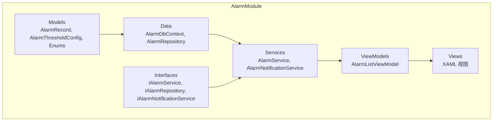
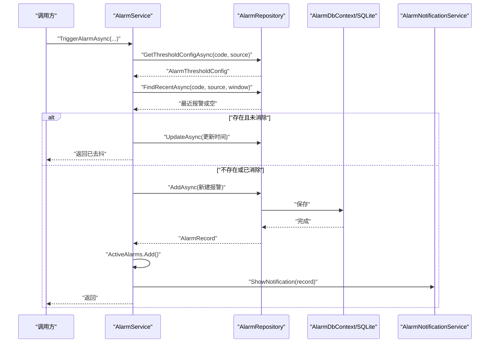
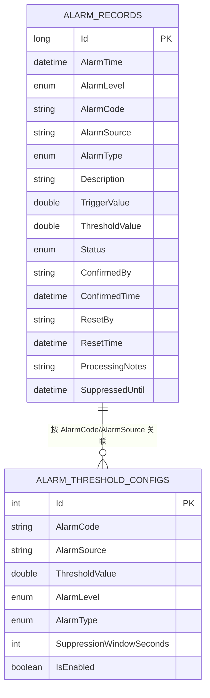
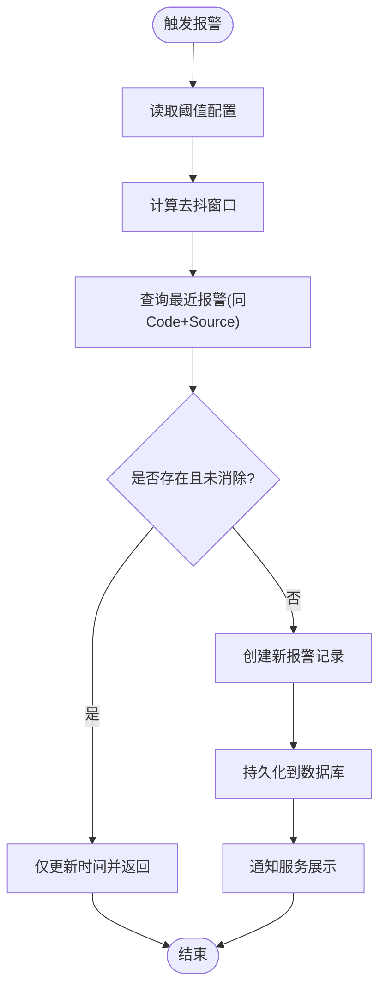
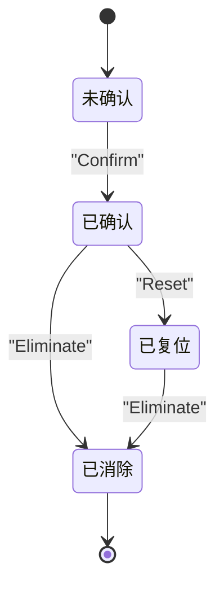
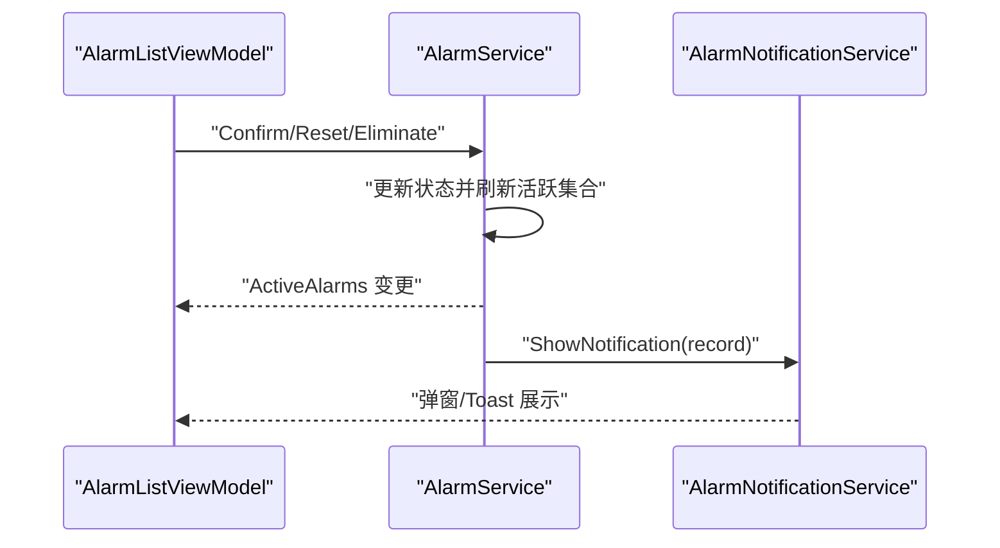
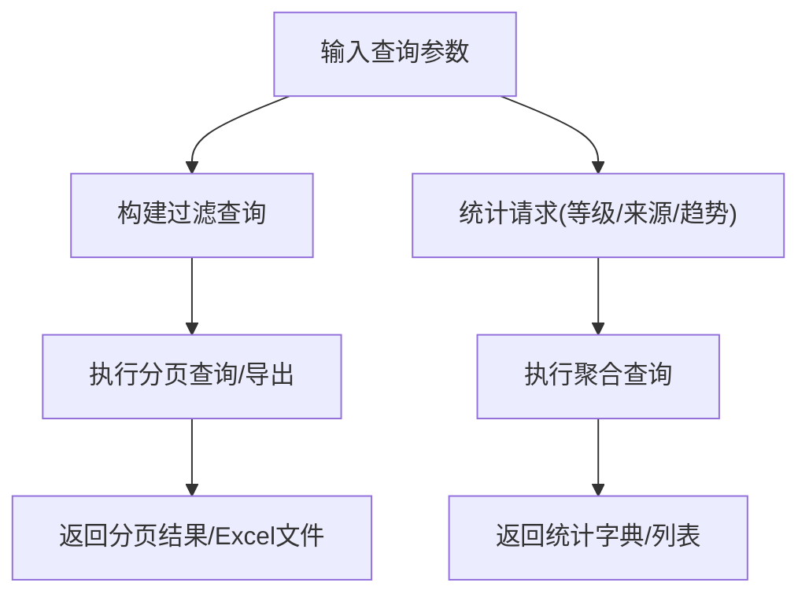
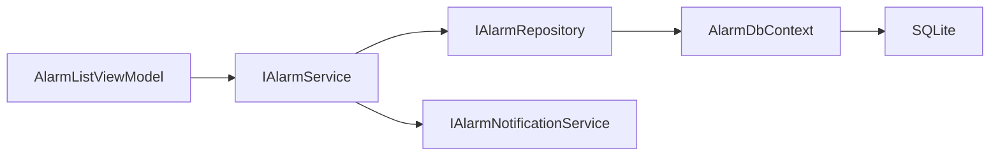

# 报警管理系统

<cite>
**本文引用的文件**
- [AlarmModule.csproj](file://AlarmModule/AlarmModule.csproj)
- [AlarmRecord.cs](file://AlarmModule/Models/AlarmRecord.cs)
- [AlarmThresholdConfig.cs](file://AlarmModule/Models/AlarmThresholdConfig.cs)
- [AlarmDbContext.cs](file://AlarmModule/Data/AlarmDbContext.cs)
- [AlarmRepository.cs](file://AlarmModule/Data/AlarmRepository.cs)
- [AlarmService.cs](file://AlarmModule/Services/AlarmService.cs)
- [AlarmNotificationService.cs](file://AlarmModule/Services/AlarmNotificationService.cs)
- [IAlarmService.cs](file://AlarmModule/Interfaces/IAlarmService.cs)
- [IAlarmRepository.cs](file://AlarmModule/Interfaces/IAlarmRepository.cs)
- [IAlarmNotificationService.cs](file://AlarmModule/Interfaces/IAlarmNotificationService.cs)
- [AlarmLevel.cs](file://AlarmModule/Models/AlarmLevel.cs)
- [AlarmStatus.cs](file://AlarmModule/Models/AlarmStatus.cs)
- [AlarmType.cs](file://AlarmModule/Models/AlarmType.cs)
- [AlarmQueryParams.cs](file://AlarmModule/Models/AlarmQueryParams.cs)
- [AlarmListViewModel.cs](file://AlarmModule/ViewModels/AlarmListViewModel.cs)
</cite>

## 目录
1. [简介](#简介)
2. [项目结构](#项目结构)
3. [核心组件](#核心组件)
4. [架构总览](#架构总览)
5. [详细组件分析](#详细组件分析)
6. [依赖关系分析](#依赖关系分析)
7. [性能考虑](#性能考虑)
8. [故障排查指南](#故障排查指南)
9. [结论](#结论)
10. [附录](#附录)

## 简介
本文件为报警管理系统的技术文档，覆盖报警触发机制、分类分级策略、通知传播流程；报警记录的数据模型与数据库设计、历史查询功能；阈值配置管理、报警去抖动算法与重复报警抑制机制；以及报警可视化界面、实时监控面板与历史统计报表的实现要点。同时提供报警处理流程、响应策略与审计日志的技术规范，帮助开发者与运维人员快速理解与维护系统。

## 项目结构
AlarmModule 采用分层与模块化组织，包含模型、数据访问、业务服务、通知服务、接口与 WPF 视图模型/视图等层次，配合 Prism 依赖注入与 Entity Framework Core 进行数据持久化与查询统计。

图表来源
- [AlarmModule.csproj:1-23](file://AlarmModule/AlarmModule.csproj#L1-L23)
- [AlarmRecord.cs:1-62](file://AlarmModule/Models/AlarmRecord.cs#L1-L62)
- [AlarmThresholdConfig.cs:1-37](file://AlarmModule/Models/AlarmThresholdConfig.cs#L1-L37)
- [AlarmDbContext.cs:1-46](file://AlarmModule/Data/AlarmDbContext.cs#L1-L46)
- [AlarmRepository.cs:1-266](file://AlarmModule/Data/AlarmRepository.cs#L1-L266)
- [AlarmService.cs:1-308](file://AlarmModule/Services/AlarmService.cs#L1-L308)
- [AlarmNotificationService.cs:1-309](file://AlarmModule/Services/AlarmNotificationService.cs#L1-L309)
- [IAlarmService.cs:1-77](file://AlarmModule/Interfaces/IAlarmService.cs#L1-L77)
- [IAlarmRepository.cs:1-34](file://AlarmModule/Interfaces/IAlarmRepository.cs#L1-L34)
- [IAlarmNotificationService.cs:1-23](file://AlarmModule/Interfaces/IAlarmNotificationService.cs#L1-L23)
- [AlarmListViewModel.cs:1-262](file://AlarmModule/ViewModels/AlarmListViewModel.cs#L1-L262)

章节来源
- [AlarmModule.csproj:1-23](file://AlarmModule/AlarmModule.csproj#L1-L23)

## 核心组件
- 报警记录模型：包含报警时间、等级、代码、来源、类型、描述、触发值、阈值、状态、确认/复位信息、处理备注、去抖抑制截止时间等字段，支撑完整的报警生命周期与查询统计。
- 阈值配置模型：支持按报警代码与来源配置阈值、等级、类型、去抖窗口与启用状态，便于动态调整报警策略。
- 数据库上下文与仓储：基于 EF Core + SQLite，提供报警记录与阈值配置的增删改查、分页查询、导出、统计分布与趋势分析。
- 报警服务：提供单行代码触发报警、状态流转（确认/复位/消除）、批量处理、活跃报警集合管理、导出 Excel、刷新活跃列表与事件发布。
- 通知服务：根据报警等级展示不同通知形式（紧急/严重弹窗+蜂鸣、一般/提示 Toast+定时消失），并提供统一关闭接口。
- 视图模型：绑定实时报警列表，提供确认、复位、消除、批量确认/复位、刷新等命令与未确认计数更新。

章节来源
- [AlarmRecord.cs:1-62](file://AlarmModule/Models/AlarmRecord.cs#L1-L62)
- [AlarmThresholdConfig.cs:1-37](file://AlarmModule/Models/AlarmThresholdConfig.cs#L1-L37)
- [AlarmDbContext.cs:1-46](file://AlarmModule/Data/AlarmDbContext.cs#L1-L46)
- [AlarmRepository.cs:1-266](file://AlarmModule/Data/AlarmRepository.cs#L1-L266)
- [AlarmService.cs:1-308](file://AlarmModule/Services/AlarmService.cs#L1-L308)
- [AlarmNotificationService.cs:1-309](file://AlarmModule/Services/AlarmNotificationService.cs#L1-L309)
- [AlarmListViewModel.cs:1-262](file://AlarmModule/ViewModels/AlarmListViewModel.cs#L1-L262)

## 架构总览
系统采用“接口隔离 + 依赖注入 + 分层架构”设计，核心交互如下：

图表来源
- [AlarmService.cs:52-91](file://AlarmModule/Services/AlarmService.cs#L52-L91)
- [AlarmRepository.cs:57-65](file://AlarmModule/Data/AlarmRepository.cs#L57-L65)
- [AlarmDbContext.cs:10-16](file://AlarmModule/Data/AlarmDbContext.cs#L10-L16)
- [AlarmNotificationService.cs:35-55](file://AlarmModule/Services/AlarmNotificationService.cs#L35-L55)

## 详细组件分析

### 数据模型与数据库设计
- 报警记录实体：主键自增、必填字段（时间、等级、代码、来源、类型、描述、状态）、可选字段（触发值、阈值、确认/复位人与时间、处理备注、去抖截止时间）。
- 阈值配置实体：唯一索引组合（代码+来源）、可选来源匹配、阈值、等级、类型、去抖窗口与启用标志。
- 数据库上下文：对枚举进行整型转换以适配 SQLite 索引；为常用查询字段建立索引；提供 DbSet 定义。
- 统计与查询：提供按等级分布、按来源 TopN、按自然日趋势等聚合查询方法。

图表来源
- [AlarmRecord.cs:11-60](file://AlarmModule/Models/AlarmRecord.cs#L11-L60)
- [AlarmThresholdConfig.cs:9-35](file://AlarmModule/Models/AlarmThresholdConfig.cs#L9-L35)
- [AlarmDbContext.cs:18-43](file://AlarmModule/Data/AlarmDbContext.cs#L18-L43)

章节来源
- [AlarmRecord.cs:1-62](file://AlarmModule/Models/AlarmRecord.cs#L1-L62)
- [AlarmThresholdConfig.cs:1-37](file://AlarmModule/Models/AlarmThresholdConfig.cs#L1-L37)
- [AlarmDbContext.cs:1-46](file://AlarmModule/Data/AlarmDbContext.cs#L1-L46)

### 阈值配置管理与去抖动/重复抑制
- 配置项：按报警代码与来源唯一配置阈值、等级、类型、去抖窗口与启用状态。
- 去抖逻辑：触发时先查询相同 Code+Source 在去抖窗口内的最近报警；若存在且未消除，则仅更新时间而不新增记录。
- 重复抑制：通过 SuppressedUntil 字段与最近一次记录的时间戳控制，避免短时间内重复写入。

图表来源
- [AlarmService.cs:52-91](file://AlarmModule/Services/AlarmService.cs#L52-L91)
- [AlarmRepository.cs:57-65](file://AlarmModule/Data/AlarmRepository.cs#L57-L65)

章节来源
- [AlarmService.cs:52-91](file://AlarmModule/Services/AlarmService.cs#L52-L91)
- [AlarmRepository.cs:57-65](file://AlarmModule/Data/AlarmRepository.cs#L57-L65)

### 报警生命周期与状态流转
- 状态机：未确认 → 已确认 → 已复位 → 已消除；提供单条与批量的状态变更接口，并同步更新活跃报警集合。
- 活跃报警集合：仅包含未消除的报警，供 UI 实时展示与操作。
- 事件发布：触发报警后发布 AlarmTriggered 事件，视图模型订阅以更新未确认计数与命令可用性。

图表来源
- [AlarmStatus.cs:6-16](file://AlarmModule/Models/AlarmStatus.cs#L6-L16)
- [AlarmService.cs:96-155](file://AlarmModule/Services/AlarmService.cs#L96-L155)

章节来源
- [AlarmStatus.cs:1-18](file://AlarmModule/Models/AlarmStatus.cs#L1-L18)
- [AlarmService.cs:96-155](file://AlarmModule/Services/AlarmService.cs#L96-L155)

### 通知传播与可视化
- 通知策略：
  - 紧急（Level 1）：红色模态弹窗 + 持续蜂鸣，需人工确认后关闭。
  - 严重（Level 2）：橙色模态弹窗 + 单次蜂鸣。
  - 一般（Level 3）：黄色 Toast，5 秒自动消失。
  - 提示（Level 4）：蓝色 Toast，3 秒自动消失。
- 通知服务：在 UI 线程中构建弹窗/Toast，使用 Popup 与 DialogHost 展示；蜂鸣通过后台任务循环播放，支持统一停止。
- 视图模型：绑定 ActiveAlarms 集合，提供确认/复位/消除命令与批量操作命令，订阅 AlarmTriggered 事件更新 UI。

图表来源
- [AlarmListViewModel.cs:45-95](file://AlarmModule/ViewModels/AlarmListViewModel.cs#L45-L95)
- [AlarmService.cs:25-46](file://AlarmModule/Services/AlarmService.cs#L25-L46)
- [AlarmNotificationService.cs:35-55](file://AlarmModule/Services/AlarmNotificationService.cs#L35-L55)

章节来源
- [AlarmNotificationService.cs:1-309](file://AlarmModule/Services/AlarmNotificationService.cs#L1-L309)
- [AlarmListViewModel.cs:1-262](file://AlarmModule/ViewModels/AlarmListViewModel.cs#L1-L262)

### 历史查询与统计报表
- 查询参数：支持起止时间、等级、来源、状态、类型、关键词与分页。
- 仓储查询：构建多条件过滤查询，支持导出全量数据到 Excel。
- 统计接口：按等级分布、按来源 TopN、按自然日趋势统计，用于生成报表与看板。

图表来源
- [AlarmQueryParams.cs:9-34](file://AlarmModule/Models/AlarmQueryParams.cs#L9-L34)
- [AlarmRepository.cs:110-137](file://AlarmModule/Data/AlarmRepository.cs#L110-L137)
- [AlarmRepository.cs:186-241](file://AlarmModule/Data/AlarmRepository.cs#L186-L241)

章节来源
- [AlarmQueryParams.cs:1-34](file://AlarmModule/Models/AlarmQueryParams.cs#L1-L34)
- [AlarmRepository.cs:110-137](file://AlarmModule/Data/AlarmRepository.cs#L110-L137)
- [AlarmRepository.cs:186-241](file://AlarmModule/Data/AlarmRepository.cs#L186-L241)

### 接口契约与依赖注入
- IAlarmService：对外暴露触发、状态变更、查询、导出、活跃集合与事件。
- IAlarmRepository：对内封装数据访问，提供 CRUD、查询、统计与导出。
- IAlarmNotificationService：抽象通知策略，便于替换实现。
- AlarmModule.csproj 引入 Prism、EF Core 与 ClosedXML，支持 DI、ORM 与报表导出。

章节来源
- [IAlarmService.cs:1-77](file://AlarmModule/Interfaces/IAlarmService.cs#L1-L77)
- [IAlarmRepository.cs:1-34](file://AlarmModule/Interfaces/IAlarmRepository.cs#L1-L34)
- [IAlarmNotificationService.cs:1-23](file://AlarmModule/Interfaces/IAlarmNotificationService.cs#L1-L23)
- [AlarmModule.csproj:10-20](file://AlarmModule/AlarmModule.csproj#L10-L20)

## 依赖关系分析
- 组件耦合：AlarmService 依赖 IAlarmRepository 与 IAlarmNotificationService；AlarmRepository 依赖 AlarmDbContext；ViewModel 依赖 IAlarmService。
- 外部依赖：EF Core + SQLite 用于本地数据库；ClosedXML 用于 Excel 导出；Prism 用于命令与 DI；MaterialDesignThemes 用于对话框宿主。
- 循环依赖：未发现循环依赖，接口隔离良好。

图表来源
- [AlarmListViewModel.cs:16-95](file://AlarmModule/ViewModels/AlarmListViewModel.cs#L16-L95)
- [IAlarmService.cs:11-77](file://AlarmModule/Interfaces/IAlarmService.cs#L11-L77)
- [IAlarmRepository.cs:11-34](file://AlarmModule/Interfaces/IAlarmRepository.cs#L11-L34)
- [AlarmDbContext.cs:10-16](file://AlarmModule/Data/AlarmDbContext.cs#L10-L16)

章节来源
- [AlarmListViewModel.cs:1-262](file://AlarmModule/ViewModels/AlarmListViewModel.cs#L1-L262)
- [IAlarmService.cs:1-77](file://AlarmModule/Interfaces/IAlarmService.cs#L1-L77)
- [IAlarmRepository.cs:1-34](file://AlarmModule/Interfaces/IAlarmRepository.cs#L1-L34)
- [AlarmDbContext.cs:1-46](file://AlarmModule/Data/AlarmDbContext.cs#L1-L46)

## 性能考虑
- 数据库层面：为常用查询字段建立索引，枚举使用整型存储避免索引异常；分页查询与聚合统计分离，避免一次性加载大量数据。
- 仓储模式：每次数据库操作创建新 DbContext 实例，避免跨请求共享上下文导致的并发问题。
- UI 线程：通知与集合更新均在 Dispatcher 中执行，保证 UI 响应性。
- 导出性能：使用 ClosedXML 流式写入，建议限制导出范围与分批处理大批量数据。
- 去抖优化：通过最近记录查询与时间窗口控制，减少重复写入与 UI 刷新次数。

## 故障排查指南
- 触发无效或重复：检查阈值配置是否存在、去抖窗口是否过短、最近报警状态是否为已消除；查看日志输出定位抑制原因。
- 状态变更异常：确认当前报警状态是否满足变更前置条件（如仅未确认可确认、仅已确认可复位）。
- 通知未出现：检查通知服务是否正确初始化、UI 线程调度是否生效、蜂鸣任务是否被取消。
- 导出失败：确认导出路径可写、查询参数合理、内存充足；必要时缩小导出范围。
- 日志审计：服务层在关键操作处记录 Info/Warn/Error 日志，便于回溯报警生命周期与操作轨迹。

章节来源
- [AlarmService.cs:96-155](file://AlarmModule/Services/AlarmService.cs#L96-L155)
- [AlarmNotificationService.cs:60-64](file://AlarmModule/Services/AlarmNotificationService.cs#L60-L64)
- [AlarmRepository.cs:110-137](file://AlarmModule/Data/AlarmRepository.cs#L110-L137)

## 结论
报警管理系统通过清晰的分层架构、完善的生命周期管理、灵活的通知策略与强大的查询统计能力，实现了从触发、确认、复位到消除的全链路闭环。结合 SQLite 本地存储与 ClosedXML 报表导出，既满足实时监控需求，又便于历史追溯与审计。建议在生产环境中结合业务场景进一步完善阈值配置界面、通知策略扩展与性能监控。

## 附录
- 分类分级策略：工业4级分类（紧急、严重、一般、提示），分别对应不同的响应优先级与通知方式。
- 响应策略建议：
  - 紧急：立即停机并启动应急流程，通知值班主管。
  - 严重：停止相关产线，安排维修，跟踪处理进度。
  - 一般：纳入当日维修计划，班后处理。
  - 提示：纳入保养计划，预防性维护。
- 审计日志规范：记录操作人、操作类型、时间、报警标识与前后状态，支持导出与检索。