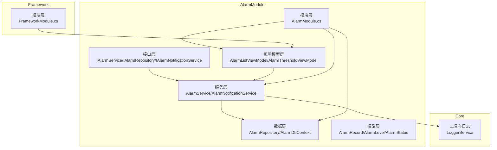
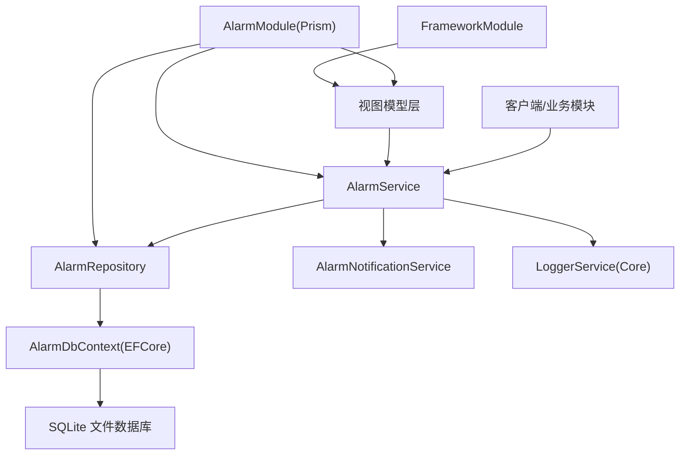
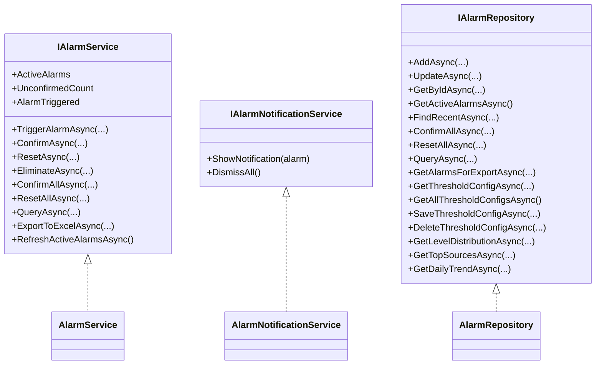
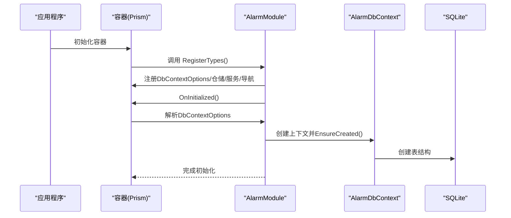
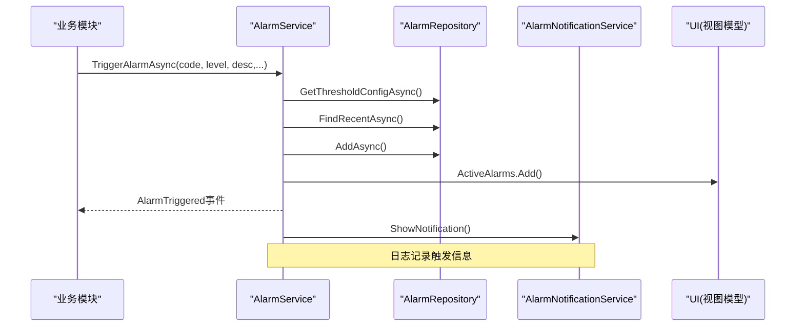
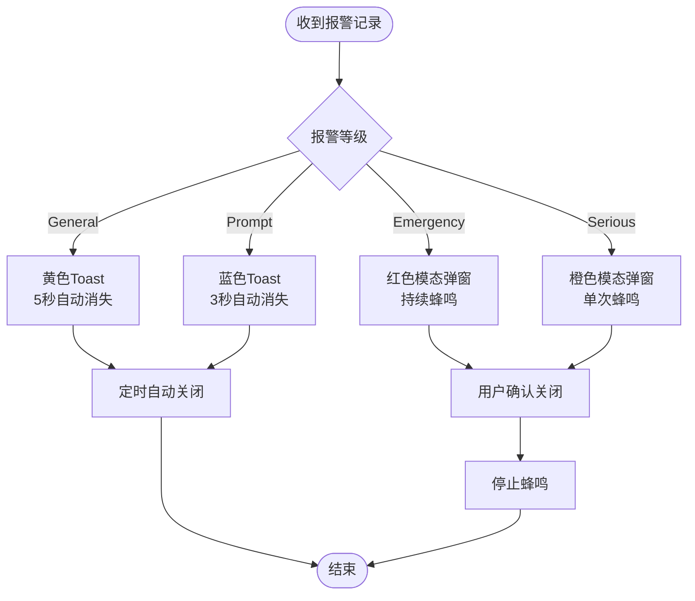
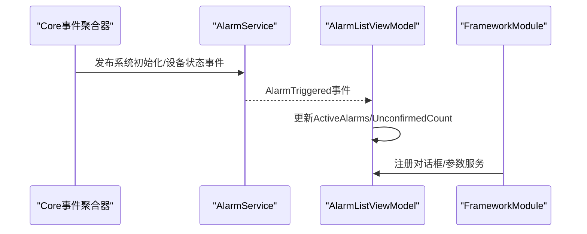
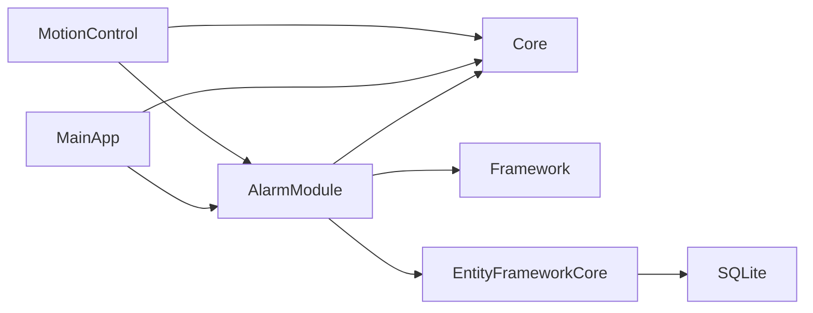

# 报警系统架构设计

<cite>
**本文档引用的文件**
- [AlarmModule.cs](file://AlarmModule/AlarmModule.cs)
- [IAlarmService.cs](file://AlarmModule/Interfaces/IAlarmService.cs)
- [IAlarmNotificationService.cs](file://AlarmModule/Interfaces/IAlarmNotificationService.cs)
- [IAlarmRepository.cs](file://AlarmModule/Interfaces/IAlarmRepository.cs)
- [AlarmService.cs](file://AlarmModule/Services/AlarmService.cs)
- [AlarmNotificationService.cs](file://AlarmModule/Services/AlarmNotificationService.cs)
- [AlarmRepository.cs](file://AlarmModule/Data/AlarmRepository.cs)
- [AlarmDbContext.cs](file://AlarmModule/Data/AlarmDbContext.cs)
- [AlarmRecord.cs](file://AlarmModule/Models/AlarmRecord.cs)
- [AlarmLevel.cs](file://AlarmModule/Models/AlarmLevel.cs)
- [AlarmStatus.cs](file://AlarmModule/Models/AlarmStatus.cs)
- [AlarmListViewModel.cs](file://AlarmModule/ViewModels/AlarmListViewModel.cs)
- [AlarmThresholdViewModel.cs](file://AlarmModule/ViewModels/AlarmThresholdViewModel.cs)
- [LoggerService.cs](file://Core/Utilities/LoggerService.cs)
- [FrameworkModule.cs](file://Framework/FrameworkModule.cs)
- [MainApp.csproj](file://MainApp/MainApp.csproj)
- [MotionControl.csproj](file://MotionControl/MotionControl.csproj)
</cite>

## 目录
1. [简介](#简介)
2. [项目结构](#项目结构)
3. [核心组件](#核心组件)
4. [架构总览](#架构总览)
5. [详细组件分析](#详细组件分析)
6. [依赖关系分析](#依赖关系分析)
7. [性能考量](#性能考量)
8. [故障处理指南](#故障处理指南)
9. [结论](#结论)
10. [附录](#附录)

## 简介
本文件面向报警系统架构设计，围绕Prism模块化框架下的服务层设计、接口抽象、依赖注入配置进行深入解析。重点阐述报警服务的核心职责、通知服务的实现机制、模块间通信协议；说明Prism模块注册、生命周期管理与事件传播机制；并给出与Core模块、Framework模块的协作方式。同时提供架构图表与组件交互流程，涵盖系统扩展性设计、性能优化与故障处理策略。

## 项目结构
报警系统位于AlarmModule目录，采用分层清晰的模块化组织：
- 接口层：定义服务与仓储契约，隔离业务逻辑与实现细节
- 服务层：实现报警生命周期管理、通知展示、查询导出等功能
- 数据层：基于EF Core + SQLite，提供仓储实现与数据库上下文
- 视图模型层：MVVM绑定，负责UI交互与命令处理
- 模块层：Prism模块注册与初始化，完成依赖注入与导航注册

**图表来源**
- [AlarmModule.cs:16-57](file://AlarmModule/AlarmModule.cs#L16-L57)
- [AlarmService.cs:16-46](file://AlarmModule/Services/AlarmService.cs#L16-L46)
- [AlarmRepository.cs:15-22](file://AlarmModule/Data/AlarmRepository.cs#L15-L22)
- [AlarmDbContext.cs:10-16](file://AlarmModule/Data/AlarmDbContext.cs#L10-L16)
- [LoggerService.cs:5-30](file://Core/Utilities/LoggerService.cs#L5-L30)
- [FrameworkModule.cs:15-55](file://Framework/FrameworkModule.cs#L15-L55)

**章节来源**
- [AlarmModule.cs:16-57](file://AlarmModule/AlarmModule.cs#L16-L57)
- [AlarmService.cs:16-46](file://AlarmModule/Services/AlarmService.cs#L16-L46)
- [AlarmRepository.cs:15-22](file://AlarmModule/Data/AlarmRepository.cs#L15-L22)
- [AlarmDbContext.cs:10-16](file://AlarmModule/Data/AlarmDbContext.cs#L10-L16)
- [LoggerService.cs:5-30](file://Core/Utilities/LoggerService.cs#L5-L30)
- [FrameworkModule.cs:15-55](file://Framework/FrameworkModule.cs#L15-L55)

## 核心组件
- 报警服务接口与实现：提供触发报警、生命周期管理（确认/复位/消除）、批量操作、查询导出、活跃报警集合与事件发布
- 通知服务接口与实现：按报警等级展示不同级别通知（模态弹窗/Toast），支持蜂鸣控制
- 仓储接口与实现：基于EF Core + SQLite，提供报警记录与阈值配置的CRUD与统计查询
- 数据库上下文：定义实体索引与枚举转换，保证SQLite兼容性
- 视图模型：实时报警列表与阈值配置管理，绑定UI命令与服务

**章节来源**
- [IAlarmService.cs:11-75](file://AlarmModule/Interfaces/IAlarmService.cs#L11-L75)
- [AlarmService.cs:16-308](file://AlarmModule/Services/AlarmService.cs#L16-L308)
- [IAlarmNotificationService.cs:10-21](file://AlarmModule/Interfaces/IAlarmNotificationService.cs#L10-L21)
- [AlarmNotificationService.cs:19-309](file://AlarmModule/Services/AlarmNotificationService.cs#L19-L309)
- [IAlarmRepository.cs:11-32](file://AlarmModule/Interfaces/IAlarmRepository.cs#L11-L32)
- [AlarmRepository.cs:15-266](file://AlarmModule/Data/AlarmRepository.cs#L15-L266)
- [AlarmDbContext.cs:10-44](file://AlarmModule/Data/AlarmDbContext.cs#L10-L44)
- [AlarmRecord.cs:12-60](file://AlarmModule/Models/AlarmRecord.cs#L12-L60)
- [AlarmLevel.cs:6-16](file://AlarmModule/Models/AlarmLevel.cs#L6-L16)
- [AlarmStatus.cs:6-16](file://AlarmModule/Models/AlarmStatus.cs#L6-L16)
- [AlarmListViewModel.cs:16-262](file://AlarmModule/ViewModels/AlarmListViewModel.cs#L16-L262)
- [AlarmThresholdViewModel.cs:17-298](file://AlarmModule/ViewModels/AlarmThresholdViewModel.cs#L17-L298)

## 架构总览
报警系统采用Prism模块化架构，通过依赖注入容器统一管理服务与仓储，模块在初始化阶段完成数据库创建与导航注册。服务层负责业务编排，通知服务负责用户交互，仓储层负责数据持久化，视图模型负责UI绑定与命令处理。

**图表来源**
- [AlarmModule.cs:21-56](file://AlarmModule/AlarmModule.cs#L21-L56)
- [AlarmService.cs:40-46](file://AlarmModule/Services/AlarmService.cs#L40-L46)
- [AlarmRepository.cs:19-22](file://AlarmModule/Data/AlarmRepository.cs#L19-L22)
- [AlarmDbContext.cs:10-16](file://AlarmModule/Data/AlarmDbContext.cs#L10-L16)
- [LoggerService.cs:5-30](file://Core/Utilities/LoggerService.cs#L5-L30)
- [FrameworkModule.cs:15-55](file://Framework/FrameworkModule.cs#L15-L55)

## 详细组件分析

### 服务层设计与接口抽象
- IAlarmService：定义报警触发、生命周期管理、批量操作、查询导出、活跃报警集合与事件发布
- IAlarmNotificationService：定义通知展示与关闭
- IAlarmRepository：定义报警记录与阈值配置的CRUD与统计查询

**图表来源**
- [IAlarmService.cs:11-75](file://AlarmModule/Interfaces/IAlarmService.cs#L11-L75)
- [IAlarmNotificationService.cs:10-21](file://AlarmModule/Interfaces/IAlarmNotificationService.cs#L10-L21)
- [IAlarmRepository.cs:11-32](file://AlarmModule/Interfaces/IAlarmRepository.cs#L11-L32)
- [AlarmService.cs:16-46](file://AlarmModule/Services/AlarmService.cs#L16-L46)
- [AlarmNotificationService.cs:19-30](file://AlarmModule/Services/AlarmNotificationService.cs#L19-L30)
- [AlarmRepository.cs:15-22](file://AlarmModule/Data/AlarmRepository.cs#L15-L22)

**章节来源**
- [IAlarmService.cs:11-75](file://AlarmModule/Interfaces/IAlarmService.cs#L11-L75)
- [IAlarmNotificationService.cs:10-21](file://AlarmModule/Interfaces/IAlarmNotificationService.cs#L10-L21)
- [IAlarmRepository.cs:11-32](file://AlarmModule/Interfaces/IAlarmRepository.cs#L11-L32)

### 依赖注入配置与Prism模块化
- AlarmModule.RegisterTypes：注册DbContextOptions为实例（避免Singleton DbContext在fire-and-forget场景被释放）、仓储与服务为Singleton、导航视图
- AlarmModule.OnInitialized：确保数据库表结构创建
- FrameworkModule：注册Framework相关服务与对话框，支撑UI层交互
- 项目工程引用：MainApp与MotionControl均引用AlarmModule与Core，体现跨模块协作

**图表来源**
- [AlarmModule.cs:21-56](file://AlarmModule/AlarmModule.cs#L21-L56)
- [AlarmDbContext.cs:10-16](file://AlarmModule/Data/AlarmDbContext.cs#L10-L16)

**章节来源**
- [AlarmModule.cs:21-56](file://AlarmModule/AlarmModule.cs#L21-L56)
- [FrameworkModule.cs:31-55](file://Framework/FrameworkModule.cs#L31-L55)
- [MainApp.csproj:28-31](file://MainApp/MainApp.csproj#L28-L31)
- [MotionControl.csproj:18-20](file://MotionControl/MotionControl.csproj#L18-L20)

### 报警服务核心职责与处理流程
- 防抖抑制：根据阈值配置的时间窗口，避免相同Code+Source重复触发
- 生命周期管理：Unconfirmed→Confirmed→Reset→Eliminated，状态流转严格校验
- 通知联动：触发报警后同步更新活跃报警集合、发布事件并展示通知
- 批量操作：支持批量确认与批量复位，保持UI一致性
- 查询导出：分页查询与Excel导出，便于审计与报表

**图表来源**
- [AlarmService.cs:52-91](file://AlarmModule/Services/AlarmService.cs#L52-L91)
- [AlarmRepository.cs:57-65](file://AlarmModule/Data/AlarmRepository.cs#L57-L65)
- [AlarmNotificationService.cs:35-55](file://AlarmModule/Services/AlarmNotificationService.cs#L35-L55)

**章节来源**
- [AlarmService.cs:52-91](file://AlarmModule/Services/AlarmService.cs#L52-L91)
- [AlarmRepository.cs:57-65](file://AlarmModule/Data/AlarmRepository.cs#L57-L65)

### 通知服务实现机制
- 等级化通知：Emergency/Serious采用模态弹窗+蜂鸣；General/Prompt采用Toast通知
- 持续蜂鸣：后台任务循环播放系统提示音，支持停止
- UI集成：使用MaterialDesignThemes.DialogHost与Popup实现弹窗与Toast

**图表来源**
- [AlarmNotificationService.cs:35-306](file://AlarmModule/Services/AlarmNotificationService.cs#L35-L306)

**章节来源**
- [AlarmNotificationService.cs:35-306](file://AlarmModule/Services/AlarmNotificationService.cs#L35-L306)

### 模块间通信协议与事件传播
- Prism事件聚合器：用于跨模块事件传递（如系统初始化、设备状态变更等）
- AlarmService事件：AlarmTriggered事件向UI层推送实时报警
- FrameworkModule：注册对话框与参数服务，支撑UI交互

**图表来源**
- [AlarmListViewModel.cs:92-108](file://AlarmModule/ViewModels/AlarmListViewModel.cs#L92-L108)
- [FrameworkModule.cs:19-29](file://Framework/FrameworkModule.cs#L19-L29)

**章节来源**
- [AlarmListViewModel.cs:92-108](file://AlarmModule/ViewModels/AlarmListViewModel.cs#L92-L108)
- [FrameworkModule.cs:19-29](file://Framework/FrameworkModule.cs#L19-L29)

### 与Core模块、Framework模块协作
- Core.LoggerService：统一日志输出与事件广播，保障报警操作的可观测性
- Framework.FrameworkModule：提供参数编辑、对话框等通用UI能力，支撑报警界面的参数配置与交互

**章节来源**
- [LoggerService.cs:5-120](file://Core/Utilities/LoggerService.cs#L5-L120)
- [FrameworkModule.cs:31-55](file://Framework/FrameworkModule.cs#L31-L55)

## 依赖关系分析
- AlarmModule对Core的依赖：日志服务接口与实现
- AlarmModule对Framework的依赖：MVVM基类、对话框服务等
- AlarmModule内部：服务依赖仓储，仓储依赖数据库上下文
- 项目工程：MainApp与MotionControl均引用AlarmModule与Core，体现跨模块复用

**图表来源**
- [AlarmModule.cs:2-7](file://AlarmModule/AlarmModule.cs#L2-L7)
- [MainApp.csproj:28-31](file://MainApp/MainApp.csproj#L28-L31)
- [MotionControl.csproj:18-20](file://MotionControl/MotionControl.csproj#L18-L20)

**章节来源**
- [AlarmModule.cs:2-7](file://AlarmModule/AlarmModule.cs#L2-L7)
- [MainApp.csproj:28-31](file://MainApp/MainApp.csproj#L28-L31)
- [MotionControl.csproj:18-20](file://MotionControl/MotionControl.csproj#L18-L20)

## 性能考量
- 数据库上下文生命周期：AlarmDbContextOptions注册为实例，仓储每次操作创建新上下文，避免Singleton上下文在并发场景被释放
- 索引与枚举转换：数据库上下文对枚举使用整型存储，实体建立多字段索引，提升查询效率
- 日志异步化：LoggerService使用有界通道与后台任务异步处理日志事件，降低UI阻塞
- UI线程调度：服务层与视图模型通过Dispatcher.Invoke确保UI线程安全更新
- Excel导出：使用ClosedXML批量写入，避免逐行写入带来的性能问题

**章节来源**
- [AlarmModule.cs:23-35](file://AlarmModule/AlarmModule.cs#L23-L35)
- [AlarmDbContext.cs:18-43](file://AlarmModule/Data/AlarmDbContext.cs#L18-L43)
- [LoggerService.cs:78-111](file://Core/Utilities/LoggerService.cs#L78-L111)
- [AlarmService.cs:83-89](file://AlarmModule/Services/AlarmService.cs#L83-L89)
- [AlarmListViewModel.cs:102-107](file://AlarmModule/ViewModels/AlarmListViewModel.cs#L102-L107)

## 故障处理指南
- 状态流转异常：确认/复位/消除前进行状态校验，抛出明确异常信息
- 防抖抑制：相同Code+Source在时间窗口内仅更新时间，避免重复创建
- 通知蜂鸣：持续蜂鸣通过CancellationTokenSource控制，确保资源正确释放
- 数据库初始化：模块初始化阶段EnsureCreated，确保表结构存在
- UI线程访问：所有UI更新通过Dispatcher.Invoke，避免跨线程异常

**章节来源**
- [AlarmService.cs:96-155](file://AlarmModule/Services/AlarmService.cs#L96-L155)
- [AlarmNotificationService.cs:275-306](file://AlarmModule/Services/AlarmNotificationService.cs#L275-L306)
- [AlarmModule.cs:51-56](file://AlarmModule/AlarmModule.cs#L51-L56)
- [AlarmService.cs:83-89](file://AlarmModule/Services/AlarmService.cs#L83-L89)

## 结论
报警系统以Prism模块化为核心，通过清晰的接口抽象与依赖注入配置，实现了报警触发、生命周期管理、通知展示与数据持久化的完整闭环。服务层承担业务编排，通知服务负责用户交互，仓储层保证数据一致性，视图模型实现UI绑定与命令处理。配合Core的日志服务与Framework的通用UI能力，系统具备良好的扩展性、性能与可靠性。

## 附录
- 扩展建议：引入事件总线替代部分事件聚合器，增强模块解耦；增加报警统计与趋势分析的后台任务；对Excel导出增加进度反馈与错误重试机制
- 兼容性：EFCore + SQLite方案适合中小规模部署；若需要高并发与复杂查询，可评估替换为关系型数据库并引入连接池与读写分离