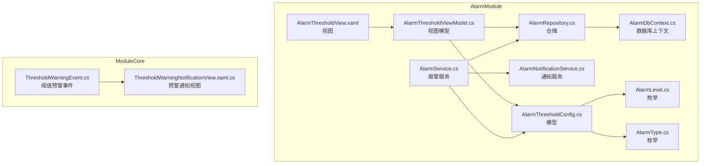
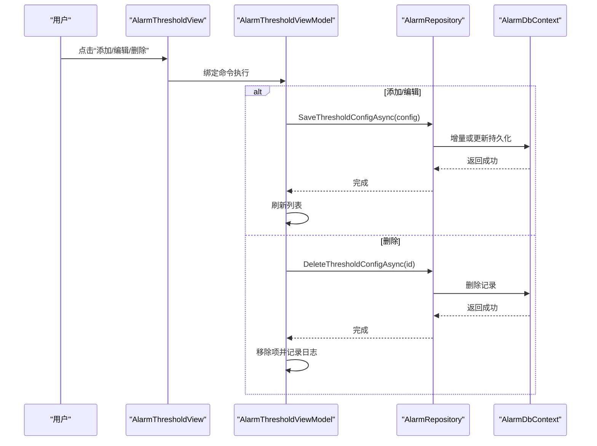
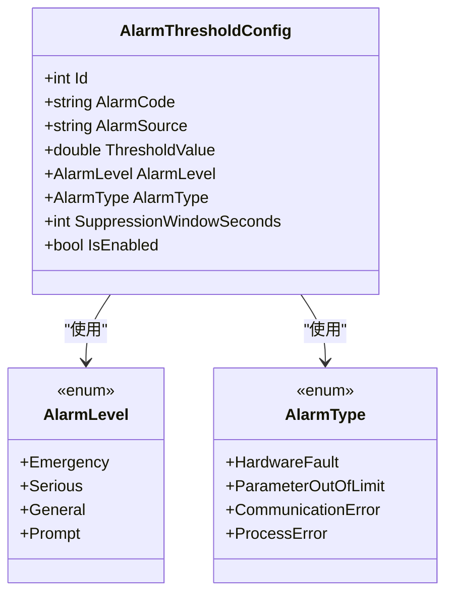
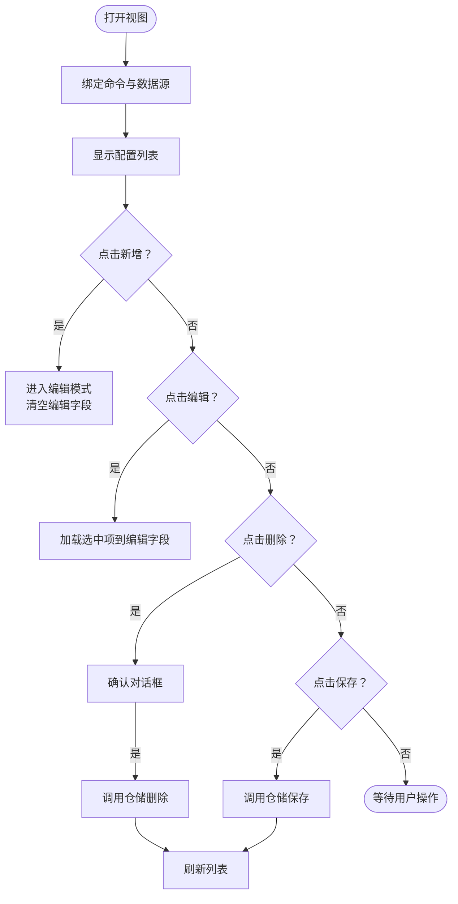
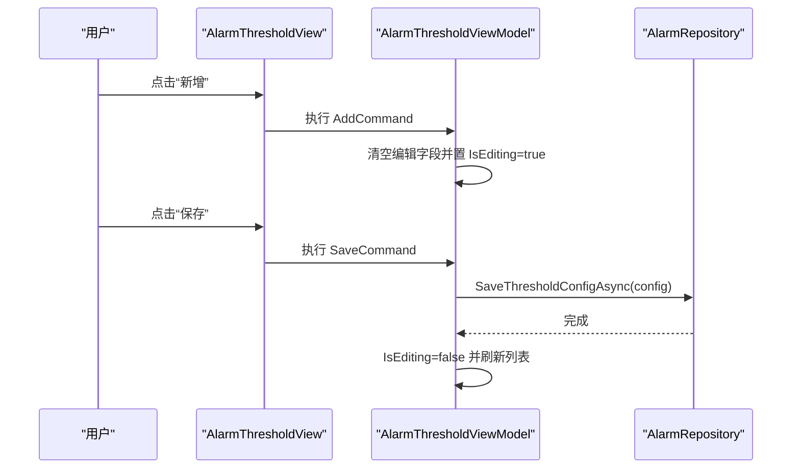
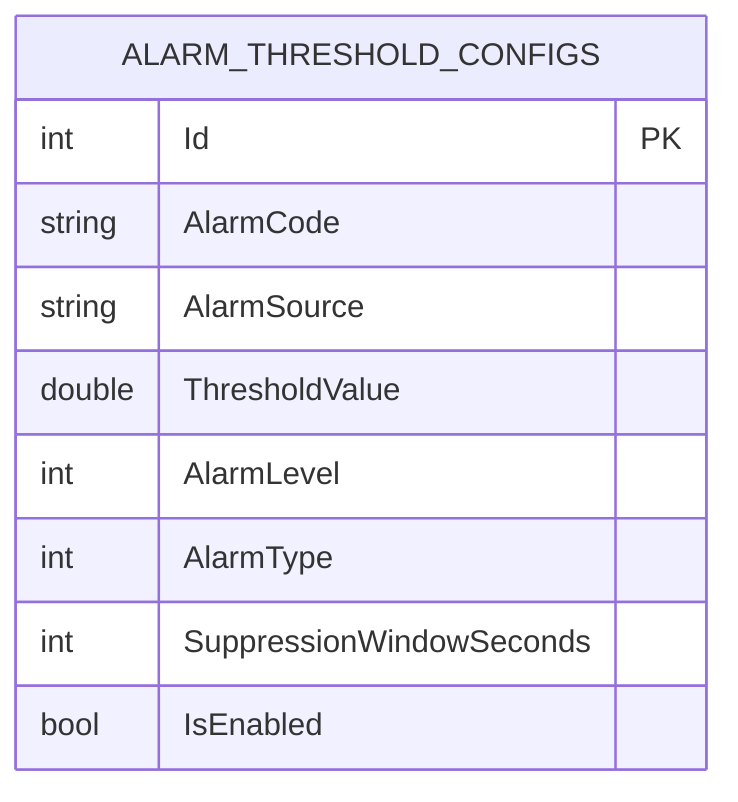
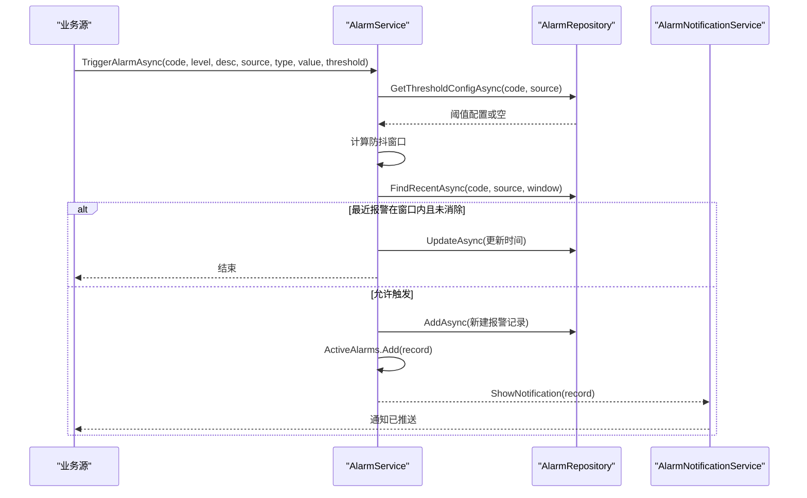
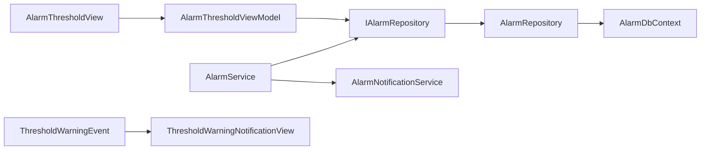

# 报警阈值配置

<cite>
**本文引用的文件**
- [AlarmThresholdConfig.cs](file://AlarmModule/Models/AlarmThresholdConfig.cs)
- [AlarmThresholdViewModel.cs](file://AlarmModule/ViewModels/AlarmThresholdViewModel.cs)
- [AlarmThresholdView.xaml](file://AlarmModule/Views/AlarmThresholdView.xaml)
- [AlarmThresholdView.xaml.cs](file://AlarmModule/Views/AlarmThresholdView.xaml.cs)
- [AlarmDbContext.cs](file://AlarmModule/Data/AlarmDbContext.cs)
- [AlarmRepository.cs](file://AlarmModule/Data/AlarmRepository.cs)
- [IAlarmRepository.cs](file://AlarmModule/Interfaces/IAlarmRepository.cs)
- [AlarmLevel.cs](file://AlarmModule/Models/AlarmLevel.cs)
- [AlarmType.cs](file://AlarmModule/Models/AlarmType.cs)
- [AlarmService.cs](file://AlarmModule/Services/AlarmService.cs)
- [IAlarmNotificationService.cs](file://AlarmModule/Interfaces/IAlarmNotificationService.cs)
- [AlarmNotificationService.cs](file://AlarmModule/Services/AlarmNotificationService.cs)
- [ThresholdWarningEvent.cs](file://ModuleCore/ThresholdWarningEvent.cs)
- [ThresholdWarningNotificationView.xaml.cs](file://ModuleCore/Views/ThresholdWarningNotificationView.xaml.cs)
</cite>

## 目录
1. [简介](#简介)
2. [项目结构](#项目结构)
3. [核心组件](#核心组件)
4. [架构总览](#架构总览)
5. [详细组件分析](#详细组件分析)
6. [依赖关系分析](#依赖关系分析)
7. [性能考虑](#性能考虑)
8. [故障排查指南](#故障排查指南)
9. [结论](#结论)
10. [附录](#附录)

## 简介
本技术文档围绕“报警阈值配置”功能展开，系统性阐述阈值配置的业务逻辑、数据模型、界面实现、管理流程、变更通知与生效策略、异常处理以及导入导出与批量管理能力。该功能允许用户在不修改代码的前提下，灵活地为不同报警源设置阈值、等级、类型、防抖窗口与启用状态，从而驱动报警触发与通知策略。

## 项目结构
报警阈值配置位于 AlarmModule 子模块中，采用 MVVM 架构，结合 Prism 命令与 Entity Framework Core 进行数据持久化。界面层通过 XAML 实现，视图模型负责业务交互与数据绑定，仓储层封装数据库访问，服务层提供报警触发与通知能力。

图表来源
- [AlarmThresholdView.xaml:1-123](file://AlarmModule/Views/AlarmThresholdView.xaml#L1-L123)
- [AlarmThresholdViewModel.cs:1-298](file://AlarmModule/ViewModels/AlarmThresholdViewModel.cs#L1-L298)
- [AlarmThresholdConfig.cs:1-37](file://AlarmModule/Models/AlarmThresholdConfig.cs#L1-L37)
- [AlarmRepository.cs:1-266](file://AlarmModule/Data/AlarmRepository.cs#L1-L266)
- [AlarmDbContext.cs:1-46](file://AlarmModule/Data/AlarmDbContext.cs#L1-L46)
- [AlarmService.cs:1-308](file://AlarmModule/Services/AlarmService.cs#L1-L308)
- [AlarmNotificationService.cs:1-309](file://AlarmModule/Services/AlarmNotificationService.cs#L1-L309)
- [AlarmLevel.cs:1-18](file://AlarmModule/Models/AlarmLevel.cs#L1-L18)
- [AlarmType.cs:1-18](file://AlarmModule/Models/AlarmType.cs#L1-L18)
- [ThresholdWarningEvent.cs:1-71](file://ModuleCore/ThresholdWarningEvent.cs#L1-L71)
- [ThresholdWarningNotificationView.xaml.cs:1-17](file://ModuleCore/Views/ThresholdWarningNotificationView.xaml.cs#L1-L17)

章节来源
- [AlarmThresholdView.xaml:1-123](file://AlarmModule/Views/AlarmThresholdView.xaml#L1-L123)
- [AlarmThresholdViewModel.cs:1-298](file://AlarmModule/ViewModels/AlarmThresholdViewModel.cs#L1-L298)
- [AlarmThresholdConfig.cs:1-37](file://AlarmModule/Models/AlarmThresholdConfig.cs#L1-L37)
- [AlarmRepository.cs:1-266](file://AlarmModule/Data/AlarmRepository.cs#L1-L266)
- [AlarmDbContext.cs:1-46](file://AlarmModule/Data/AlarmDbContext.cs#L1-L46)
- [AlarmService.cs:1-308](file://AlarmModule/Services/AlarmService.cs#L1-L308)
- [AlarmNotificationService.cs:1-309](file://AlarmModule/Services/AlarmNotificationService.cs#L1-L309)
- [AlarmLevel.cs:1-18](file://AlarmModule/Models/AlarmLevel.cs#L1-L18)
- [AlarmType.cs:1-18](file://AlarmModule/Models/AlarmType.cs#L1-L18)
- [ThresholdWarningEvent.cs:1-71](file://ModuleCore/ThresholdWarningEvent.cs#L1-L71)
- [ThresholdWarningNotificationView.xaml.cs:1-17](file://ModuleCore/Views/ThresholdWarningNotificationView.xaml.cs#L1-L17)

## 核心组件
- 阈值配置模型：定义报警阈值的关键字段，包括报警代码、来源、阈值、等级、类型、防抖窗口与启用状态。
- 视图模型：提供 CRUD 操作命令、编辑状态管理、数据加载与刷新。
- 视图：基于 DataGrid 展示配置列表，支持添加、编辑、删除与刷新操作。
- 仓储与数据库上下文：提供阈值配置的增删改查与唯一性约束。
- 报警服务：根据阈值配置触发报警、防抖抑制、状态流转与通知。
- 通知服务：按等级弹出模态对话框或 Toast 通知。
- 预警事件与视图：用于针头使用量等阈值预警场景的事件发布与展示。

章节来源
- [AlarmThresholdConfig.cs:1-37](file://AlarmModule/Models/AlarmThresholdConfig.cs#L1-L37)
- [AlarmThresholdViewModel.cs:1-298](file://AlarmModule/ViewModels/AlarmThresholdViewModel.cs#L1-L298)
- [AlarmThresholdView.xaml:1-123](file://AlarmModule/Views/AlarmThresholdView.xaml#L1-L123)
- [AlarmRepository.cs:1-266](file://AlarmModule/Data/AlarmRepository.cs#L1-L266)
- [AlarmDbContext.cs:1-46](file://AlarmModule/Data/AlarmDbContext.cs#L1-L46)
- [AlarmService.cs:1-308](file://AlarmModule/Services/AlarmService.cs#L1-L308)
- [AlarmNotificationService.cs:1-309](file://AlarmModule/Services/AlarmNotificationService.cs#L1-L309)
- [ThresholdWarningEvent.cs:1-71](file://ModuleCore/ThresholdWarningEvent.cs#L1-L71)

## 架构总览
报警阈值配置遵循分层架构：
- 表现层：XAML 视图 + Prism 自动绑定视图模型
- 业务层：视图模型聚合命令与编辑状态；报警服务协调触发与通知
- 数据访问层：EF Core + SQLite，仓储封装查询与持久化
- 事件与通知：Prism 事件与通知服务按等级推送

图表来源
- [AlarmThresholdView.xaml:1-123](file://AlarmModule/Views/AlarmThresholdView.xaml#L1-L123)
- [AlarmThresholdViewModel.cs:1-298](file://AlarmModule/ViewModels/AlarmThresholdViewModel.cs#L1-L298)
- [AlarmRepository.cs:1-266](file://AlarmModule/Data/AlarmRepository.cs#L1-L266)
- [AlarmDbContext.cs:1-46](file://AlarmModule/Data/AlarmDbContext.cs#L1-L46)

## 详细组件分析

### 阈值配置模型（AlarmThresholdConfig）
- 字段说明
  - Id：自增主键
  - AlarmCode：报警代码（必填，长度限制）
  - AlarmSource：报警来源（可空，长度限制）
  - ThresholdValue：阈值数值
  - AlarmLevel：报警等级（默认一般）
  - AlarmType：报警类型（默认参数超限）
  - SuppressionWindowSeconds：防抖时间窗口（秒，默认60）
  - IsEnabled：是否启用（默认启用）
- 约束与索引
  - 唯一性：AlarmCode + AlarmSource 组合唯一
  - 索引：AlarmCode、(AlarmCode, AlarmSource) 唯一索引
  - 枚举存储：AlarmLevel、AlarmType 以整型存储，避免 SQLite 索引兼容问题

图表来源
- [AlarmThresholdConfig.cs:1-37](file://AlarmModule/Models/AlarmThresholdConfig.cs#L1-L37)
- [AlarmLevel.cs:1-18](file://AlarmModule/Models/AlarmLevel.cs#L1-L18)
- [AlarmType.cs:1-18](file://AlarmModule/Models/AlarmType.cs#L1-L18)

章节来源
- [AlarmThresholdConfig.cs:1-37](file://AlarmModule/Models/AlarmThresholdConfig.cs#L1-L37)
- [AlarmDbContext.cs:35-43](file://AlarmModule/Data/AlarmDbContext.cs#L35-L43)
- [AlarmLevel.cs:1-18](file://AlarmModule/Models/AlarmLevel.cs#L1-L18)
- [AlarmType.cs:1-18](file://AlarmModule/Models/AlarmType.cs#L1-L18)

### 阈值配置界面（XAML + 数据绑定）
- 布局结构
  - 标题栏：包含“刷新”“保存”按钮
  - 分隔线：视觉分组
  - DataGrid：展示 AlarmCode、AlarmSource、ThresholdValue、AlarmLevel、AlarmType、DebounceWindowSec、Enabled、操作列（编辑、删除）
  - 底部操作栏：包含“新增配置”按钮
- 数据绑定
  - ItemsSource 绑定到阈值配置集合
  - SelectedItem 绑定到当前选中项
  - 列模板使用转换器显示 AlarmLevel 文本
  - Enabled 列为只读勾选框
  - 操作列按钮绑定到 ViewModel 的 EditCommand 与 DeleteCommand
- 命令绑定
  - ViewModel 注入 AddCommand、EditCommand、DeleteCommand、SaveCommand、RefreshCommand
  - AutoWireViewModel 启用，视图自动连接到对应 ViewModel

图表来源
- [AlarmThresholdView.xaml:1-123](file://AlarmModule/Views/AlarmThresholdView.xaml#L1-L123)
- [AlarmThresholdViewModel.cs:1-298](file://AlarmModule/ViewModels/AlarmThresholdViewModel.cs#L1-L298)

章节来源
- [AlarmThresholdView.xaml:1-123](file://AlarmModule/Views/AlarmThresholdView.xaml#L1-L123)
- [AlarmThresholdView.xaml.cs:1-11](file://AlarmModule/Views/AlarmThresholdView.xaml.cs#L1-L11)
- [AlarmThresholdViewModel.cs:1-298](file://AlarmModule/ViewModels/AlarmThresholdViewModel.cs#L1-L298)

### 视图模型（AlarmThresholdViewModel）
- 职责
  - 维护阈值配置集合与当前选中项
  - 管理编辑状态与编辑字段
  - 提供命令：Add、Edit、Delete、Save、Refresh
  - 加载与刷新配置列表
- 编辑字段
  - AlarmCode、AlarmSource、ThresholdValue、AlarmLevel、AlarmType、SuppressionWindowSeconds、IsEnabled
- 命令行为
  - Add：清空编辑字段并置为编辑模式
  - Edit：将选中项映射到编辑字段
  - Delete：弹出确认对话框，调用仓储删除并移除项
  - Save：构建配置对象，调用仓储保存，刷新列表并记录日志
  - Refresh：从仓储加载全部配置

图表来源
- [AlarmThresholdViewModel.cs:1-298](file://AlarmModule/ViewModels/AlarmThresholdViewModel.cs#L1-L298)
- [AlarmRepository.cs:152-173](file://AlarmModule/Data/AlarmRepository.cs#L152-L173)

章节来源
- [AlarmThresholdViewModel.cs:1-298](file://AlarmModule/ViewModels/AlarmThresholdViewModel.cs#L1-L298)
- [AlarmRepository.cs:146-184](file://AlarmModule/Data/AlarmRepository.cs#L146-L184)

### 仓储与数据库上下文（AlarmRepository + AlarmDbContext）
- 仓储职责
  - 获取、保存、删除阈值配置
  - 基于 AlarmCode + AlarmSource 唯一性进行更新或新增
  - 提供全部阈值配置列表查询
- 数据库上下文
  - 配置实体索引与枚举存储转换
  - 阈值配置表：唯一索引 (AlarmCode, AlarmSource)，枚举整型存储

图表来源
- [AlarmDbContext.cs:35-43](file://AlarmModule/Data/AlarmDbContext.cs#L35-L43)
- [AlarmRepository.cs:146-184](file://AlarmModule/Data/AlarmRepository.cs#L146-L184)

章节来源
- [AlarmRepository.cs:1-266](file://AlarmModule/Data/AlarmRepository.cs#L1-L266)
- [AlarmDbContext.cs:1-46](file://AlarmModule/Data/AlarmDbContext.cs#L1-L46)

### 报警触发与通知（AlarmService + AlarmNotificationService）
- 报警触发
  - 读取阈值配置，计算防抖窗口
  - 若最近一次同源报警仍在防抖窗口内且未消除，则更新时间而不重复创建
  - 否则创建新报警记录，加入活跃报警集合，触发事件并推送通知
- 通知策略
  - 等级 1（紧急）：红色模态弹窗 + 持续蜂鸣
  - 等级 2（严重）：橙色模态弹窗 + 单次蜂鸣
  - 等级 3（一般）：黄色 Toast，5 秒自动消失
  - 等级 4（提示）：蓝色 Toast，3 秒自动消失

图表来源
- [AlarmService.cs:52-91](file://AlarmModule/Services/AlarmService.cs#L52-L91)
- [AlarmRepository.cs:139-144](file://AlarmModule/Data/AlarmRepository.cs#L139-L144)
- [AlarmNotificationService.cs:35-55](file://AlarmModule/Services/AlarmNotificationService.cs#L35-L55)

章节来源
- [AlarmService.cs:1-308](file://AlarmModule/Services/AlarmService.cs#L1-L308)
- [AlarmNotificationService.cs:1-309](file://AlarmModule/Services/AlarmNotificationService.cs#L1-L309)
- [IAlarmNotificationService.cs:1-23](file://AlarmModule/Interfaces/IAlarmNotificationService.cs#L1-L23)

### 预警事件与通知视图（ModuleCore）
- 预警事件模型：包含针头编号、当前使用次数、最大使用次数、触发时间、使用百分比、阻断状态等属性
- 事件发布：通过 Prism PubSubEvent 发布预警通知
- 视图：用于展示预警消息与阻断状态

章节来源
- [ThresholdWarningEvent.cs:1-71](file://ModuleCore/ThresholdWarningEvent.cs#L1-L71)
- [ThresholdWarningNotificationView.xaml.cs:1-17](file://ModuleCore/Views/ThresholdWarningNotificationView.xaml.cs#L1-L17)

## 依赖关系分析
- 视图依赖视图模型（Prism AutoWireViewModel）
- 视图模型依赖仓储接口与日志服务
- 仓储依赖数据库上下文与 EF Core
- 报警服务依赖仓储、通知服务与日志服务
- 通知服务依赖系统声音与 WPF Popup/DialogHost
- 预警事件与视图属于 ModuleCore，与 AlarmModule 解耦

图表来源
- [AlarmThresholdView.xaml:1-123](file://AlarmModule/Views/AlarmThresholdView.xaml#L1-L123)
- [AlarmThresholdViewModel.cs:1-298](file://AlarmModule/ViewModels/AlarmThresholdViewModel.cs#L1-L298)
- [IAlarmRepository.cs:1-34](file://AlarmModule/Interfaces/IAlarmRepository.cs#L1-L34)
- [AlarmRepository.cs:1-266](file://AlarmModule/Data/AlarmRepository.cs#L1-L266)
- [AlarmDbContext.cs:1-46](file://AlarmModule/Data/AlarmDbContext.cs#L1-L46)
- [AlarmService.cs:1-308](file://AlarmModule/Services/AlarmService.cs#L1-L308)
- [AlarmNotificationService.cs:1-309](file://AlarmModule/Services/AlarmNotificationService.cs#L1-L309)
- [ThresholdWarningEvent.cs:1-71](file://ModuleCore/ThresholdWarningEvent.cs#L1-L71)

章节来源
- [IAlarmRepository.cs:1-34](file://AlarmModule/Interfaces/IAlarmRepository.cs#L1-L34)
- [AlarmRepository.cs:1-266](file://AlarmModule/Data/AlarmRepository.cs#L1-L266)
- [AlarmService.cs:1-308](file://AlarmModule/Services/AlarmService.cs#L1-L308)

## 性能考虑
- 数据库层面
  - 阈值配置表对 (AlarmCode, AlarmSource) 建有唯一索引，保证写入一致性与查询效率
  - 枚举以整型存储，避免 SQLite 索引比较异常
- 内存与 UI
  - 视图模型使用 ObservableCollection，减少 UI 刷新成本
  - 报警服务使用 Dispatcher 在 UI 线程更新活跃报警集合
- 防抖策略
  - 通过最近报警查询与时间窗口控制，降低重复触发与数据库压力

章节来源
- [AlarmDbContext.cs:35-43](file://AlarmModule/Data/AlarmDbContext.cs#L35-L43)
- [AlarmRepository.cs:57-65](file://AlarmModule/Data/AlarmRepository.cs#L57-L65)
- [AlarmService.cs:48-91](file://AlarmModule/Services/AlarmService.cs#L48-L91)

## 故障排查指南
- 保存失败
  - 检查 AlarmCode + AlarmSource 组合是否违反唯一性
  - 查看日志输出，定位仓储保存异常
- 删除失败
  - 确认记录是否存在且未被并发修改
  - 查看日志输出，定位删除异常
- 刷新失败
  - 确认数据库连接与上下文创建正常
  - 查看日志输出，定位加载异常
- 防抖无效
  - 检查 SuppressionWindowSeconds 设置
  - 确认最近报警记录未被消除
- 通知异常
  - 确认 AlarmLevel 对应的通知策略
  - 检查系统声音与 WPF 主窗口可见性

章节来源
- [AlarmThresholdViewModel.cs:214-237](file://AlarmModule/ViewModels/AlarmThresholdViewModel.cs#L214-L237)
- [AlarmThresholdViewModel.cs:242-267](file://AlarmModule/ViewModels/AlarmThresholdViewModel.cs#L242-L267)
- [AlarmThresholdViewModel.cs:272-282](file://AlarmModule/ViewModels/AlarmThresholdViewModel.cs#L272-L282)
- [AlarmRepository.cs:152-173](file://AlarmModule/Data/AlarmRepository.cs#L152-L173)
- [AlarmService.cs:48-91](file://AlarmModule/Services/AlarmService.cs#L48-L91)
- [AlarmNotificationService.cs:35-55](file://AlarmModule/Services/AlarmNotificationService.cs#L35-L55)

## 结论
报警阈值配置功能通过清晰的分层设计与完善的命令机制，实现了灵活、可维护的阈值管理能力。结合防抖策略与多级通知，既能满足生产现场对报警的即时响应需求，又能在配置层面提供足够的灵活性。建议在后续迭代中扩展批量导入导出与复制能力，进一步提升运维效率。

## 附录

### 阈值配置管理流程
- 创建：清空编辑字段 → 进入编辑模式 → 输入参数 → 保存
- 编辑：选择配置 → 加载到编辑字段 → 修改参数 → 保存
- 删除：选择配置 → 弹出确认 → 调用仓储删除 → 刷新列表
- 刷新：拉取全部配置 → 替换集合

章节来源
- [AlarmThresholdViewModel.cs:180-295](file://AlarmModule/ViewModels/AlarmThresholdViewModel.cs#L180-L295)

### 配置生效策略
- 保存即生效：仓储保存后立即影响报警触发逻辑
- 防抖生效：根据 SuppressionWindowSeconds 控制重复触发
- 状态生效：IsEnabled 控制是否参与报警判断

章节来源
- [AlarmThresholdViewModel.cs:242-267](file://AlarmModule/ViewModels/AlarmThresholdViewModel.cs#L242-L267)
- [AlarmService.cs:48-91](file://AlarmModule/Services/AlarmService.cs#L48-L91)

### 导入导出与批量管理
- 报警记录导出：AlarmService 提供 Excel 导出能力，包含完整字段与格式化
- 阈值配置：当前未提供专用的阈值配置导入/导出功能，建议后续扩展

章节来源
- [AlarmService.cs:208-255](file://AlarmModule/Services/AlarmService.cs#L208-L255)