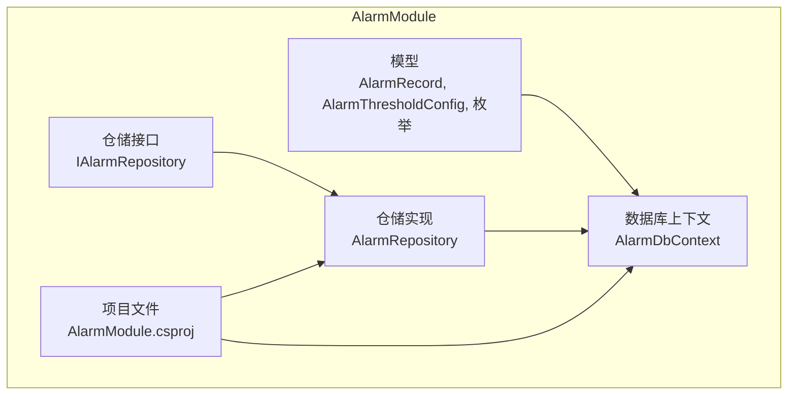
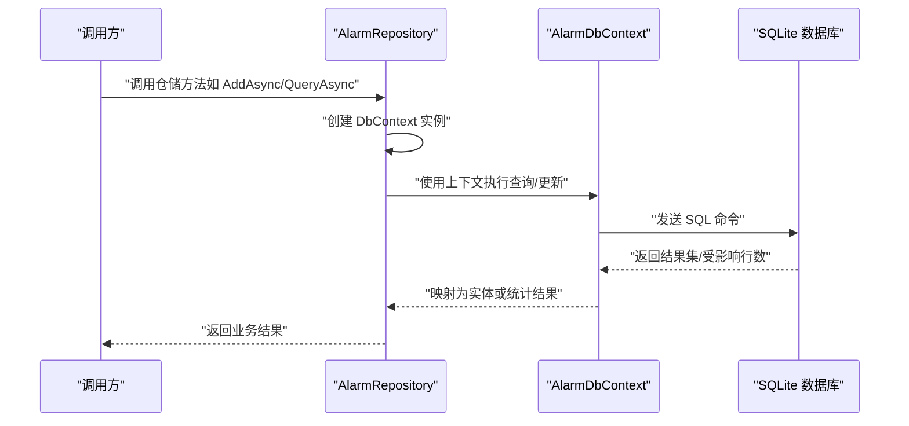
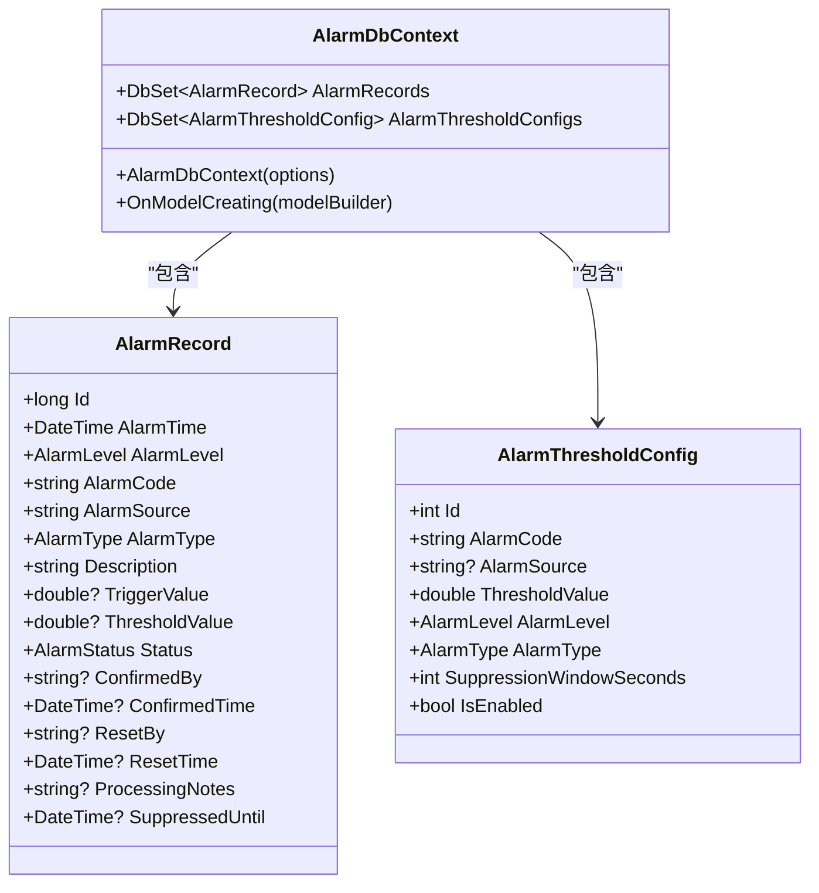
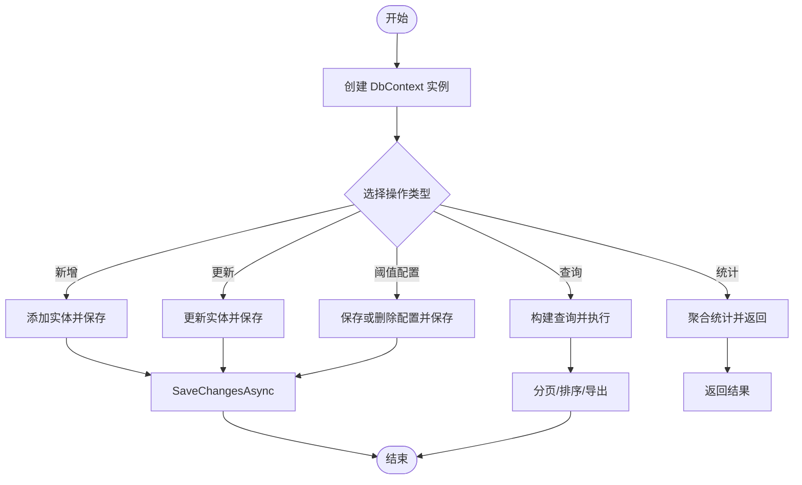
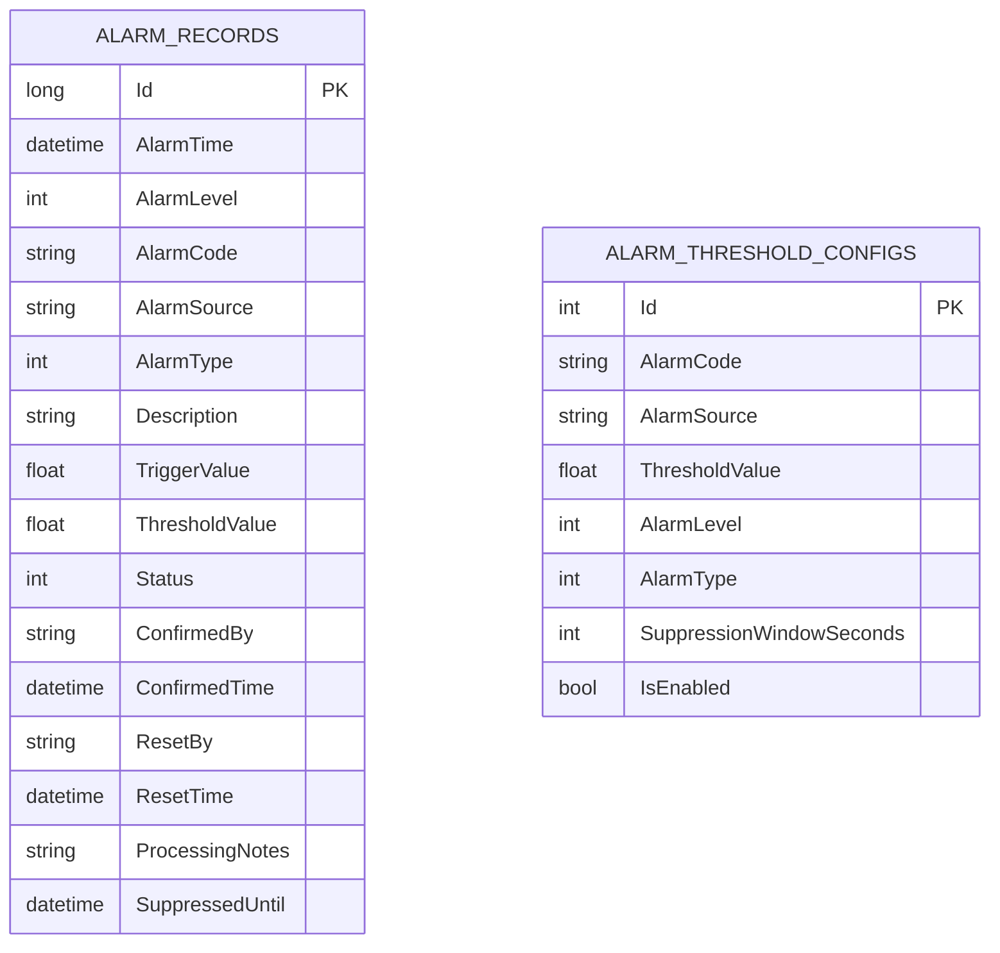
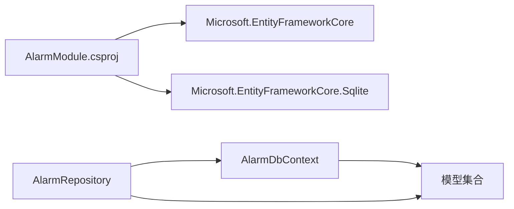

# 数据库架构设计

<cite>
**本文引用的文件**
- [AlarmDbContext.cs](file://AlarmModule/Data/AlarmDbContext.cs)
- [AlarmRepository.cs](file://AlarmModule/Data/AlarmRepository.cs)
- [IAlarmRepository.cs](file://AlarmModule/Interfaces/IAlarmRepository.cs)
- [AlarmRecord.cs](file://AlarmModule/Models/AlarmRecord.cs)
- [AlarmThresholdConfig.cs](file://AlarmModule/Models/AlarmThresholdConfig.cs)
- [AlarmLevel.cs](file://AlarmModule/Models/AlarmLevel.cs)
- [AlarmStatus.cs](file://AlarmModule/Models/AlarmStatus.cs)
- [AlarmType.cs](file://AlarmModule/Models/AlarmType.cs)
- [AlarmQueryParams.cs](file://AlarmModule/Models/AlarmQueryParams.cs)
- [AlarmModule.csproj](file://AlarmModule/AlarmModule.csproj)
- [AlarmModule.cs](file://AlarmModule/AlarmModule.cs)
</cite>

## 目录
1. [简介](#简介)
2. [项目结构](#项目结构)
3. [核心组件](#核心组件)
4. [架构总览](#架构总览)
5. [详细组件分析](#详细组件分析)
6. [依赖关系分析](#依赖关系分析)
7. [性能考量](#性能考量)
8. [故障排查指南](#故障排查指南)
9. [结论](#结论)
10. [附录](#附录)

## 简介
本文件面向数据库架构设计，围绕 AlarmModule 的数据库层进行系统化梳理，重点覆盖以下方面：
- AlarmDbContext 的数据库连接配置与 Entity Framework Core 使用模式
- 数据库迁移策略与版本演进
- AlarmRepository 的数据访问模式与仓储模式实现原理
- SQLite 选择原因、表结构设计原则与索引优化策略
- 数据库性能调优、并发控制与事务管理策略
- 备份恢复方案、版本升级策略与数据一致性保障

## 项目结构
AlarmModule 的数据库相关代码采用“领域模型 + EF Core 上下文 + 仓储实现”的分层组织方式，核心文件如下：
- 数据库上下文：AlarmDbContext
- 仓储接口与实现：IAlarmRepository、AlarmRepository
- 领域模型：AlarmRecord、AlarmThresholdConfig 及其枚举类型
- 查询参数与分页结果：AlarmQueryParams
- 项目依赖：AlarmModule.csproj 中对 Microsoft.EntityFrameworkCore.Sqlite 的引用

**图表来源**
- [AlarmDbContext.cs:10-44](file://AlarmModule/Data/AlarmDbContext.cs#L10-L44)
- [AlarmRepository.cs:15-26](file://AlarmModule/Data/AlarmRepository.cs#L15-L26)
- [IAlarmRepository.cs:11-32](file://AlarmModule/Interfaces/IAlarmRepository.cs#L11-L32)
- [AlarmModule.csproj:10-15](file://AlarmModule/AlarmModule.csproj#L10-L15)

**章节来源**
- [AlarmDbContext.cs:10-44](file://AlarmModule/Data/AlarmDbContext.cs#L10-L44)
- [AlarmRepository.cs:15-26](file://AlarmModule/Data/AlarmRepository.cs#L15-L26)
- [IAlarmRepository.cs:11-32](file://AlarmModule/Interfaces/IAlarmRepository.cs#L11-L32)
- [AlarmModule.csproj:10-15](file://AlarmModule/AlarmModule.csproj#L10-L15)

## 核心组件
- AlarmDbContext：定义两个 DbSet（AlarmRecords、AlarmThresholdConfigs），在 OnModelCreating 中配置索引与枚举转换，指定 SQLite 本地文件数据库路径为 Config/alarms.db。
- AlarmRepository：实现 IAlarmRepository 接口，提供报警记录与阈值配置的 CRUD、统计与分页查询；每次数据库操作均创建新 DbContext 实例，避免单例上下文生命周期问题。
- 领域模型：AlarmRecord 表示完整的报警生命周期数据；AlarmThresholdConfig 提供可配置的阈值与抑制窗口；枚举 AlarmLevel、AlarmStatus、AlarmType 明确业务语义。

**章节来源**
- [AlarmDbContext.cs:10-44](file://AlarmModule/Data/AlarmDbContext.cs#L10-L44)
- [AlarmRepository.cs:15-266](file://AlarmModule/Data/AlarmRepository.cs#L15-L266)
- [IAlarmRepository.cs:11-32](file://AlarmModule/Interfaces/IAlarmRepository.cs#L11-L32)
- [AlarmRecord.cs:11-60](file://AlarmModule/Models/AlarmRecord.cs#L11-L60)
- [AlarmThresholdConfig.cs:9-35](file://AlarmModule/Models/AlarmThresholdConfig.cs#L9-L35)
- [AlarmLevel.cs:6-16](file://AlarmModule/Models/AlarmLevel.cs#L6-L16)
- [AlarmStatus.cs:6-16](file://AlarmModule/Models/AlarmStatus.cs#L6-L16)
- [AlarmType.cs:6-16](file://AlarmModule/Models/AlarmType.cs#L6-L16)

## 架构总览
AlarmModule 的数据库层采用 EF Core + SQLite 的轻量级方案，结合仓储模式实现清晰的职责分离。下图展示模块内组件交互与数据流：

**图表来源**
- [AlarmRepository.cs:27-130](file://AlarmModule/Data/AlarmRepository.cs#L27-L130)
- [AlarmDbContext.cs:10-44](file://AlarmModule/Data/AlarmDbContext.cs#L10-L44)

## 详细组件分析

### AlarmDbContext 数据库上下文
- 数据库类型与路径：使用 SQLite，数据库文件位于 Config/alarms.db。
- DbSet 定义：AlarmRecords、AlarmThresholdConfigs。
- 索引设计：
  - AlarmRecords：按 AlarmTime、AlarmLevel、AlarmCode、AlarmSource、Status 建立索引；复合索引 (AlarmCode, AlarmSource)。
  - AlarmThresholdConfigs：按 AlarmCode 建立索引；复合索引 (AlarmCode, AlarmSource) 且唯一。
- 枚举持久化：将 AlarmLevel、AlarmType、Status 转换为整数存储，避免 SQLite 索引创建时的 IComparable 异常。
- 生命周期：通过带参构造函数注入 DbContextOptions，遵循 DI 工厂预配置。

**图表来源**
- [AlarmDbContext.cs:10-44](file://AlarmModule/Data/AlarmDbContext.cs#L10-L44)
- [AlarmRecord.cs:11-60](file://AlarmModule/Models/AlarmRecord.cs#L11-L60)
- [AlarmThresholdConfig.cs:9-35](file://AlarmModule/Models/AlarmThresholdConfig.cs#L9-L35)

**章节来源**
- [AlarmDbContext.cs:7-44](file://AlarmModule/Data/AlarmDbContext.cs#L7-L44)

### AlarmRepository 仓储实现
- 设计要点：
  - 每次操作创建新 AlarmDbContext 实例，避免单例上下文被释放后继续使用的问题。
  - 提供报警记录的新增、更新、查询、分页、导出、统计等能力。
  - 提供阈值配置的增删改查与唯一性约束下的合并保存。
- 关键方法与流程：
  - 新增/更新：AddAsync/UpdateAsync，保存更改后返回实体。
  - 查询：GetByIdAsync、GetActiveAlarmsAsync、FindRecentAsync、CountUnconfirmedAsync。
  - 批量处理：ConfirmAllAsync、ResetAllAsync。
  - 分页与导出：QueryAsync 返回 PagedResult，GetAlarmsForExportAsync 导出满足条件的全部记录。
  - 统计：按等级分布、按来源 TopN、按自然日趋势统计。
  - 阈值配置：GetThresholdConfigAsync、GetAllThresholdConfigsAsync、SaveThresholdConfigAsync、DeleteThresholdConfigAsync。
- 过滤与排序：BuildFilterQuery 支持多条件过滤，并按 AlarmTime 降序排列。

**图表来源**
- [AlarmRepository.cs:27-263](file://AlarmModule/Data/AlarmRepository.cs#L27-L263)

**章节来源**
- [AlarmRepository.cs:15-266](file://AlarmModule/Data/AlarmRepository.cs#L15-L266)
- [IAlarmRepository.cs:11-32](file://AlarmModule/Interfaces/IAlarmRepository.cs#L11-L32)

### 数据模型与表结构设计
- AlarmRecord 表：
  - 主键：自增长整型 Id。
  - 时间字段：AlarmTime 记录报警发生时刻。
  - 分类字段：AlarmLevel、AlarmType、Status 对应枚举。
  - 标识字段：AlarmCode、AlarmSource 唯一标识报警来源与类别。
  - 描述与数值：Description、TriggerValue、ThresholdValue。
  - 生命周期字段：ConfirmedBy/ConfirmedTime、ResetBy/ResetTime、ProcessingNotes。
  - 抑制字段：SuppressedUntil 用于防抖抑制。
- AlarmThresholdConfig 表：
  - 主键：自增整型 Id。
  - 唯一性：(AlarmCode, AlarmSource) 唯一。
  - 配置项：ThresholdValue、AlarmLevel、AlarmType、SuppressionWindowSeconds、IsEnabled。

**图表来源**
- [AlarmRecord.cs:11-60](file://AlarmModule/Models/AlarmRecord.cs#L11-L60)
- [AlarmThresholdConfig.cs:9-35](file://AlarmModule/Models/AlarmThresholdConfig.cs#L9-L35)

**章节来源**
- [AlarmRecord.cs:11-60](file://AlarmModule/Models/AlarmRecord.cs#L11-L60)
- [AlarmThresholdConfig.cs:9-35](file://AlarmModule/Models/AlarmThresholdConfig.cs#L9-L35)

### EF Core 使用模式与枚举转换
- 枚举转换：在 OnModelCreating 中将 AlarmLevel、AlarmType、Status 转换为整数存储，避免 SQLite 索引创建时的比较器异常。
- 索引策略：针对高频查询字段建立单列与复合索引，提升查询效率。
- 上下文生命周期：通过构造函数注入 DbContextOptions，每次仓储操作创建新上下文，避免跨线程与跨请求共享上下文导致的状态混乱。

**章节来源**
- [AlarmDbContext.cs:18-43](file://AlarmModule/Data/AlarmDbContext.cs#L18-L43)

### SQLite 选择原因与表设计原则
- 选择原因（基于仓库实现与配置）：
  - SQLite 作为嵌入式数据库，适合桌面应用与本地数据存储，部署简单、零配置。
  - 项目文件中明确引用 Microsoft.EntityFrameworkCore.Sqlite，表明采用 EF Core + SQLite 方案。
  - 数据库文件路径为 Config/alarms.db，符合本地化部署需求。
- 表设计原则：
  - 主键统一采用自增主键，简化关联与查询。
  - 枚举统一转换为整数存储，减少字符串比较与索引开销。
  - 唯一性约束用于阈值配置的 (AlarmCode, AlarmSource)，避免重复配置。
  - 针对高频过滤字段建立索引，平衡写入性能与查询性能。

**章节来源**
- [AlarmModule.csproj:12-13](file://AlarmModule/AlarmModule.csproj#L12-L13)
- [AlarmDbContext.cs:7-43](file://AlarmModule/Data/AlarmDbContext.cs#L7-L43)
- [AlarmModule.cs](file://AlarmModule/AlarmModule.cs#L24)

## 依赖关系分析
- AlarmModule.csproj 引用 Microsoft.EntityFrameworkCore 与 Microsoft.EntityFrameworkCore.Sqlite，确保 EF Core 与 SQLite 提供程序可用。
- AlarmRepository 依赖 AlarmDbContext 与模型集合，实现数据访问逻辑。
- AlarmDbContext 依赖模型定义与 EF Core 的 ModelBuilder。

**图表来源**
- [AlarmModule.csproj:10-15](file://AlarmModule/AlarmModule.csproj#L10-L15)
- [AlarmRepository.cs:15-26](file://AlarmModule/Data/AlarmRepository.cs#L15-L26)
- [AlarmDbContext.cs:10-13](file://AlarmModule/Data/AlarmDbContext.cs#L10-L13)

**章节来源**
- [AlarmModule.csproj:10-15](file://AlarmModule/AlarmModule.csproj#L10-L15)
- [AlarmRepository.cs:15-26](file://AlarmModule/Data/AlarmRepository.cs#L15-L26)
- [AlarmDbContext.cs:10-13](file://AlarmModule/Data/AlarmDbContext.cs#L10-L13)

## 性能考量
- 索引优化：
  - AlarmRecords：对 AlarmTime、AlarmLevel、AlarmCode、AlarmSource、Status 建立索引；复合索引 (AlarmCode, AlarmSource) 有助于精确匹配。
  - AlarmThresholdConfigs：对 AlarmCode 建立索引，复合索引 (AlarmCode, AlarmSource) 唯一，提升配置查询与去重效率。
- 枚举整数化：避免字符串比较带来的索引与排序成本。
- 分页与排序：QueryAsync 使用 OrderByDescending + Skip/Take，建议在高并发场景下配合合适的索引与缓存策略。
- 写入批处理：批量确认/复位操作在内存中更新后再一次性保存，减少往返次数。
- 防抖抑制：SuppressedUntil 字段用于抑制重复触发，降低无效写入与查询压力。

**章节来源**
- [AlarmDbContext.cs:20-42](file://AlarmModule/Data/AlarmDbContext.cs#L20-L42)
- [AlarmRepository.cs:74-108](file://AlarmModule/Data/AlarmRepository.cs#L74-L108)

## 故障排查指南
- 数据库文件路径确认：数据库文件位于 Config/alarms.db，若应用启动后仍无法访问，请检查该路径是否存在以及权限是否正确。
- 上下文生命周期问题：仓储每次操作创建新 DbContext 实例，若出现“上下文已被释放”类错误，检查是否在外部持有上下文实例。
- 索引异常：若遇到 SQLite 索引创建时的比较器异常，确认枚举已转换为整数存储。
- 查询性能问题：对于高频过滤字段（AlarmCode、AlarmSource、AlarmTime、Status），确保对应索引存在；必要时调整复合索引顺序以匹配查询模式。
- 阈值配置冲突：由于 (AlarmCode, AlarmSource) 唯一，保存时会合并更新，若出现重复配置，请检查输入参数。

**章节来源**
- [AlarmDbContext.cs:7-43](file://AlarmModule/Data/AlarmDbContext.cs#L7-L43)
- [AlarmRepository.cs:15-266](file://AlarmModule/Data/AlarmRepository.cs#L15-L266)

## 结论
AlarmModule 的数据库层以 EF Core + SQLite 为核心，采用仓储模式实现清晰的数据访问层，结合合理的索引与枚举整数化策略，在保证查询效率的同时兼顾了部署与维护的简易性。通过分页、统计与阈值配置等功能，满足报警系统的日常运维与分析需求。后续可在高并发场景下引入连接池与缓存策略，并完善迁移与备份方案以进一步提升稳定性与可维护性。

## 附录

### 数据库迁移策略与版本演进
- 迁移工具链：项目使用 EF Core，可借助迁移命令生成与应用迁移脚本，实现数据库结构版本演进。
- 迁移生成：在开发环境中生成迁移，记录模型变更历史。
- 应用迁移：在部署前应用迁移，确保目标环境数据库结构与当前模型一致。
- 回滚策略：谨慎回滚，优先采用新增字段或非破坏性变更；必要时通过逆向迁移或手动修复。

[本节为通用实践说明，不直接分析具体文件，故无“章节来源”]

### 并发控制与事务管理
- 并发控制：SQLite 在单文件模式下具备基本的并发控制能力；对于高并发写入场景，建议引入连接池与重试机制。
- 事务管理：仓储方法内部通过 SaveChangesAsync 提交事务；对于批量更新（如 ConfirmAllAsync、ResetAllAsync），在内存中批量修改后一次性提交，减少事务开销。

**章节来源**
- [AlarmRepository.cs:74-108](file://AlarmModule/Data/AlarmRepository.cs#L74-L108)

### 备份恢复与版本升级
- 备份：定期复制 Config/alarms.db 文件至安全位置；建议在应用空闲时段执行备份。
- 恢复：停止应用后替换 Config/alarms.db 文件，验证应用启动与查询功能正常。
- 版本升级：通过 EF Core 迁移管理数据库结构变更；升级前先备份数据库，升级后验证数据完整性与查询性能。

**章节来源**
- [AlarmModule.cs](file://AlarmModule/AlarmModule.cs#L24)