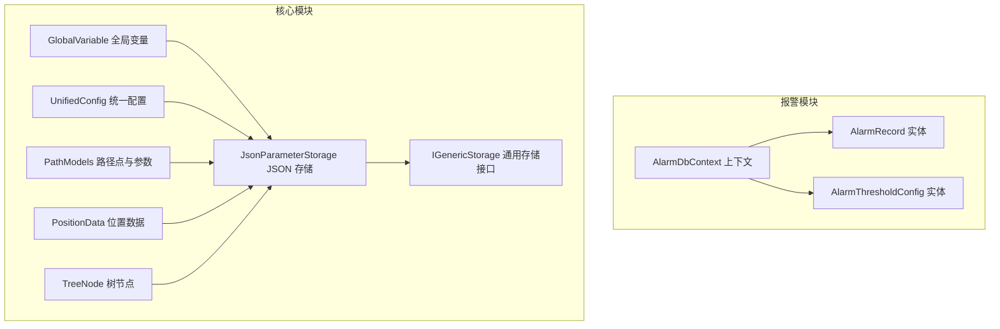
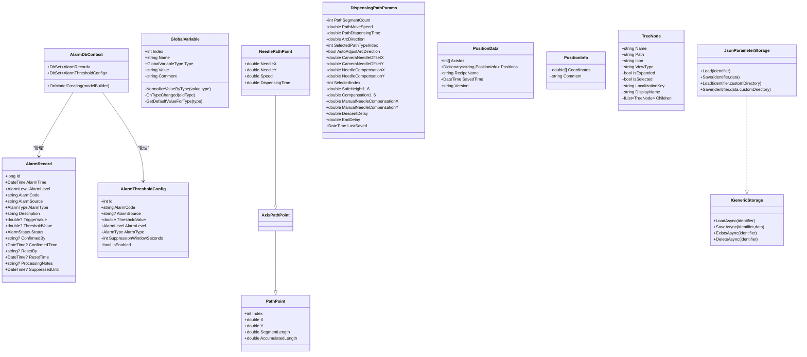
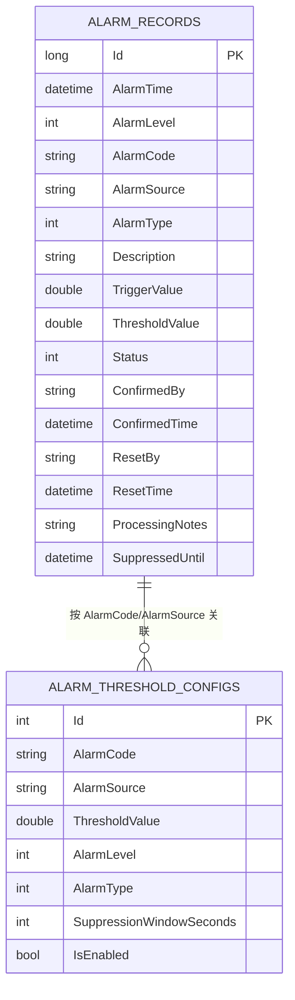
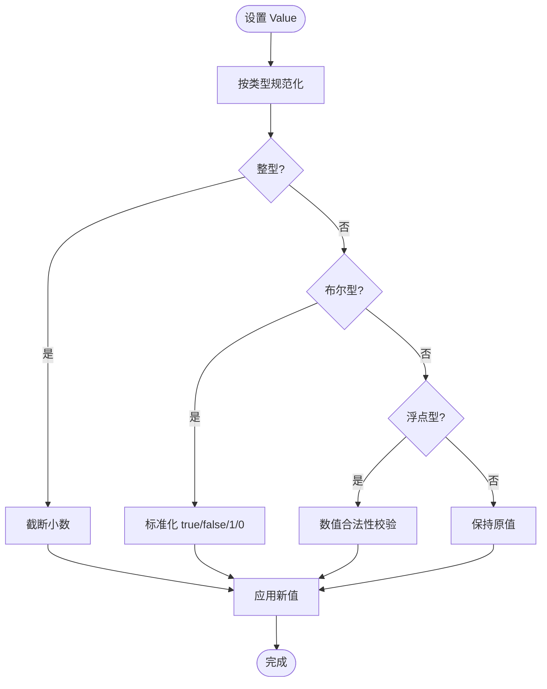
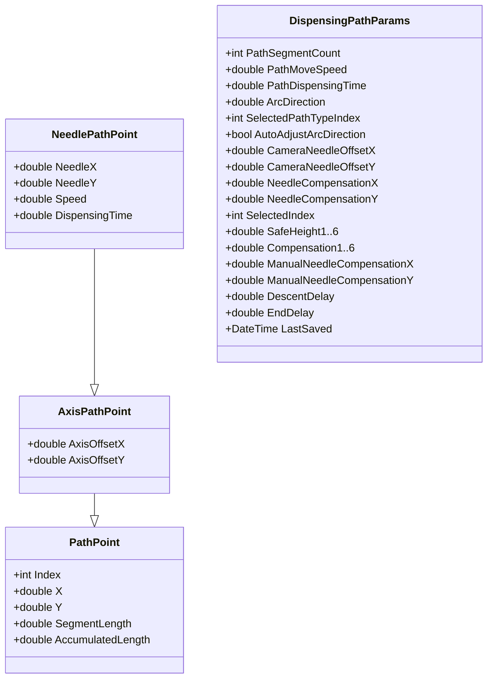
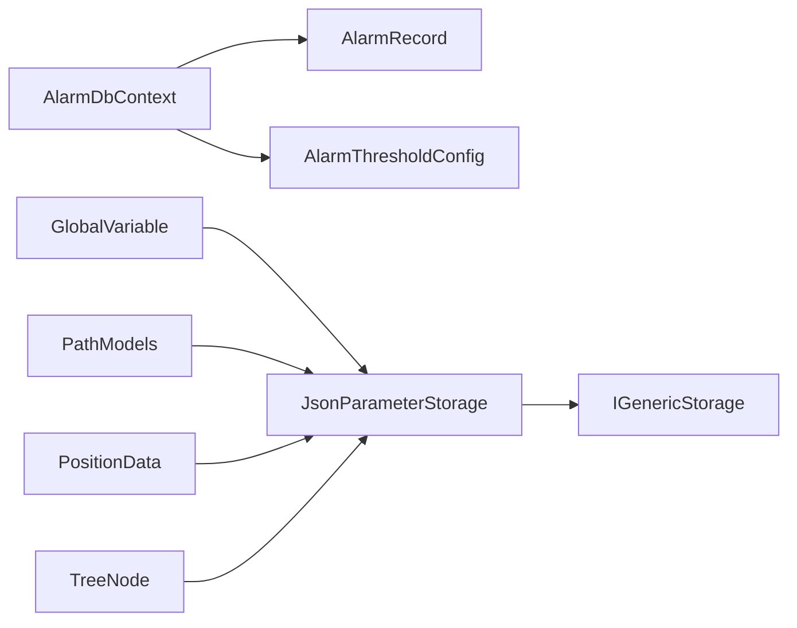

# 数据模型与数据库

<cite>
**本文引用的文件**
- [AlarmRecord.cs](file://AlarmModule/Models/AlarmRecord.cs)
- [AlarmThresholdConfig.cs](file://AlarmModule/Models/AlarmThresholdConfig.cs)
- [AlarmLevel.cs](file://AlarmModule/Models/AlarmLevel.cs)
- [AlarmType.cs](file://AlarmModule/Models/AlarmType.cs)
- [AlarmStatus.cs](file://AlarmModule/Models/AlarmStatus.cs)
- [AlarmDbContext.cs](file://AlarmModule/Data/AlarmDbContext.cs)
- [GlobalVariable.cs](file://Core/Models/GlobalVariable.cs)
- [UnifiedConfig.cs](file://Core/Models/UnifiedConfig.cs)
- [PathModels.cs](file://Core/Models/PathModels.cs)
- [PositionData.cs](file://Core/Models/PositionData.cs)
- [TreeNode.cs](file://Core/Models/TreeNode.cs)
- [JsonParameterStorage.cs](file://Core/Services/JsonParameterStorage.cs)
- [IGenericStorage.cs](file://Core/Abstraction/Storages/IGenericStorage.cs)
</cite>

## 目录
1. [简介](#简介)
2. [项目结构](#项目结构)
3. [核心组件](#核心组件)
4. [架构总览](#架构总览)
5. [详细组件分析](#详细组件分析)
6. [依赖关系分析](#依赖关系分析)
7. [性能考虑](#性能考虑)
8. [故障排查指南](#故障排查指南)
9. [结论](#结论)
10. [附录](#附录)

## 简介
本文件面向数据模型与数据库设计，系统性梳理报警记录、全局变量、统一配置、路径点与位置数据等核心实体的设计原则与实现要点；阐述数据库架构选择（EF Core + SQLite）、表结构与索引策略；明确数据验证规则、业务约束与完整性保障；给出数据访问模式、缓存策略与性能优化建议，并提供数据迁移、版本管理与备份恢复的实施指南。

## 项目结构
围绕数据模型与持久化的相关模块与文件分布如下：
- 报警模块（AlarmModule）：包含报警实体、阈值配置、EF Core 上下文与索引策略
- 核心模块（Core）：包含全局变量、路径点、位置数据、树节点、JSON 参数存储与通用存储接口
- 数据访问抽象：定义异步加载/保存/存在性检查/删除等通用能力

**图表来源**
- [AlarmDbContext.cs:10-44](file://AlarmModule/Data/AlarmDbContext.cs#L10-L44)
- [AlarmRecord.cs:11-60](file://AlarmModule/Models/AlarmRecord.cs#L11-L60)
- [AlarmThresholdConfig.cs:9-35](file://AlarmModule/Models/AlarmThresholdConfig.cs#L9-L35)
- [GlobalVariable.cs:14-147](file://Core/Models/GlobalVariable.cs#L14-L147)
- [UnifiedConfig.cs:9-13](file://Core/Models/UnifiedConfig.cs#L9-L13)
- [PathModels.cs:40-222](file://Core/Models/PathModels.cs#L40-L222)
- [PositionData.cs:6-44](file://Core/Models/PositionData.cs#L6-L44)
- [TreeNode.cs:10-112](file://Core/Models/TreeNode.cs#L10-L112)
- [JsonParameterStorage.cs:10-85](file://Core/Services/JsonParameterStorage.cs#L10-L85)
- [IGenericStorage.cs:4-11](file://Core/Abstraction/Storages/IGenericStorage.cs#L4-L11)

**章节来源**
- [AlarmDbContext.cs:10-44](file://AlarmModule/Data/AlarmDbContext.cs#L10-L44)
- [AlarmRecord.cs:11-60](file://AlarmModule/Models/AlarmRecord.cs#L11-L60)
- [AlarmThresholdConfig.cs:9-35](file://AlarmModule/Models/AlarmThresholdConfig.cs#L9-L35)
- [GlobalVariable.cs:14-147](file://Core/Models/GlobalVariable.cs#L14-L147)
- [UnifiedConfig.cs:9-13](file://Core/Models/UnifiedConfig.cs#L9-L13)
- [PathModels.cs:40-222](file://Core/Models/PathModels.cs#L40-L222)
- [PositionData.cs:6-44](file://Core/Models/PositionData.cs#L6-L44)
- [TreeNode.cs:10-112](file://Core/Models/TreeNode.cs#L10-L112)
- [JsonParameterStorage.cs:10-85](file://Core/Services/JsonParameterStorage.cs#L10-L85)
- [IGenericStorage.cs:4-11](file://Core/Abstraction/Storages/IGenericStorage.cs#L4-L11)

## 核心组件
- 报警记录实体：完整记录报警生命周期，支持等级、类型、状态、确认/复位信息与阈值关联
- 报警阈值配置：按报警码与来源维度配置阈值、等级、类型与防抖窗口
- EF Core 上下文：SQLite 本地数据库，集中定义索引与枚举映射
- 全局变量：统一字符串存储，按类型进行规范化与默认值管理
- 路径点与参数：点胶轨迹点、轴偏移、针尖坐标、速度、延时与多高度/补偿配置
- 位置数据：配方位置集合、坐标与注释
- 树节点：界面树形结构数据模型
- JSON 参数存储：基于文件系统的参数持久化，支持自定义目录与序列化设置
- 通用存储接口：抽象异步读写能力

**章节来源**
- [AlarmRecord.cs:11-60](file://AlarmModule/Models/AlarmRecord.cs#L11-L60)
- [AlarmThresholdConfig.cs:9-35](file://AlarmModule/Models/AlarmThresholdConfig.cs#L9-L35)
- [AlarmDbContext.cs:18-43](file://AlarmModule/Data/AlarmDbContext.cs#L18-L43)
- [GlobalVariable.cs:14-147](file://Core/Models/GlobalVariable.cs#L14-L147)
- [PathModels.cs:40-222](file://Core/Models/PathModels.cs#L40-L222)
- [PositionData.cs:6-44](file://Core/Models/PositionData.cs#L6-L44)
- [TreeNode.cs:10-112](file://Core/Models/TreeNode.cs#L10-L112)
- [JsonParameterStorage.cs:10-85](file://Core/Services/JsonParameterStorage.cs#L10-L85)
- [IGenericStorage.cs:4-11](file://Core/Abstraction/Storages/IGenericStorage.cs#L4-L11)

## 架构总览
系统采用“实体驱动 + EF Core + SQLite”的报警数据持久化方案，结合“JSON 文件”作为参数与配置的轻量存储。核心数据模型以强类型与验证规则为基础，确保跨模块一致性与可维护性。

**图表来源**
- [AlarmRecord.cs:11-60](file://AlarmModule/Models/AlarmRecord.cs#L11-L60)
- [AlarmThresholdConfig.cs:9-35](file://AlarmModule/Models/AlarmThresholdConfig.cs#L9-L35)
- [AlarmDbContext.cs:10-44](file://AlarmModule/Data/AlarmDbContext.cs#L10-L44)
- [GlobalVariable.cs:14-147](file://Core/Models/GlobalVariable.cs#L14-L147)
- [PathModels.cs:40-222](file://Core/Models/PathModels.cs#L40-L222)
- [PositionData.cs:6-44](file://Core/Models/PositionData.cs#L6-L44)
- [TreeNode.cs:10-112](file://Core/Models/TreeNode.cs#L10-L112)
- [JsonParameterStorage.cs:10-85](file://Core/Services/JsonParameterStorage.cs#L10-L85)
- [IGenericStorage.cs:4-11](file://Core/Abstraction/Storages/IGenericStorage.cs#L4-L11)

## 详细组件分析

### 报警记录与阈值配置
- 设计原则
  - 报警记录覆盖完整生命周期：产生、确认、复位、消除；支持触发值与阈值记录，便于回溯分析
  - 阈值配置按报警码与来源唯一化，支持启用/禁用、等级/类型、防抖窗口
  - 枚举统一映射为整数存储，避免 SQLite 索引比较问题
- 索引策略
  - 报警记录：按时间、等级、编码、来源、状态建立索引；复合索引加速常用查询
  - 阈值配置：按报警码与(报警码,来源)建立索引，后者唯一化
- 数据验证与约束
  - 必填字段强制校验；字符串长度限制；可空字段用于确认/复位信息与处理备注
- 业务约束
  - 防抖窗口：同一报警码+来源在指定秒数内不重复触发
  - 等级与类型：工业4级分类，便于分级响应与统计

**图表来源**
- [AlarmRecord.cs:11-60](file://AlarmModule/Models/AlarmRecord.cs#L11-L60)
- [AlarmThresholdConfig.cs:9-35](file://AlarmModule/Models/AlarmThresholdConfig.cs#L9-L35)
- [AlarmDbContext.cs:18-43](file://AlarmModule/Data/AlarmDbContext.cs#L18-L43)

**章节来源**
- [AlarmRecord.cs:11-60](file://AlarmModule/Models/AlarmRecord.cs#L11-L60)
- [AlarmThresholdConfig.cs:9-35](file://AlarmModule/Models/AlarmThresholdConfig.cs#L9-L35)
- [AlarmLevel.cs:6-17](file://AlarmModule/Models/AlarmLevel.cs#L6-L17)
- [AlarmType.cs:6-17](file://AlarmModule/Models/AlarmType.cs#L6-L17)
- [AlarmStatus.cs:6-17](file://AlarmModule/Models/AlarmStatus.cs#L6-L17)
- [AlarmDbContext.cs:18-43](file://AlarmModule/Data/AlarmDbContext.cs#L18-L43)

### 全局变量
- 设计原则
  - 统一字符串存储，按类型进行规范化与默认值管理
  - 类型变更时自动校正或重置值，保证一致性
- 规则与约束
  - 整型：自动截断小数
  - 浮点型：允许数值合法性（解析失败时保持原样）
  - 布尔型：接受 true/false 或 1/0
  - 字符串：无约束
- 性能与可用性
  - 值变更即时规范化，减少运行期类型转换开销

**图表来源**
- [GlobalVariable.cs:73-109](file://Core/Models/GlobalVariable.cs#L73-L109)

**章节来源**
- [GlobalVariable.cs:14-147](file://Core/Models/GlobalVariable.cs#L14-L147)

### 路径点与点胶参数
- 设计原则
  - 分层继承：基础路径点 → 轴偏移路径点 → 针尖路径点，逐步扩展
  - 点胶参数集中管理：段数、移动速度、点胶时间、弧线方向、相机与针头偏移、多高度/补偿、延时与最后保存时间
- 数据完整性
  - 关键参数提供合理默认值，避免空值引发异常
  - 通过枚举与常量控制取值范围

**图表来源**
- [PathModels.cs:40-222](file://Core/Models/PathModels.cs#L40-L222)

**章节来源**
- [PathModels.cs:40-222](file://Core/Models/PathModels.cs#L40-L222)

### 位置数据与树节点
- 位置数据
  - 以配方名为键，存储各轴坐标与注释，支持版本字段便于迁移
- 树节点
  - 支持本地化键、展开/选中状态与子节点集合，适配界面展示

**章节来源**
- [PositionData.cs:6-44](file://Core/Models/PositionData.cs#L6-L44)
- [TreeNode.cs:10-112](file://Core/Models/TreeNode.cs#L10-L112)

### 统一配置与参数存储
- 统一配置
  - 当前为空模型占位，后续可扩展为全局配置聚合器
- JSON 参数存储
  - 基于文件系统，支持自定义目录、驼峰命名、缩进格式、忽略空值、类型名处理
  - 提供同步与异步接口，便于不同场景使用

**章节来源**
- [UnifiedConfig.cs:9-13](file://Core/Models/UnifiedConfig.cs#L9-L13)
- [JsonParameterStorage.cs:10-85](file://Core/Services/JsonParameterStorage.cs#L10-L85)
- [IGenericStorage.cs:4-11](file://Core/Abstraction/Storages/IGenericStorage.cs#L4-L11)

## 依赖关系分析
- 报警模块依赖 EF Core 进行 SQLite 持久化，上下文集中定义索引与枚举映射
- 核心模块通过 JSON 存储服务提供参数与配置的文件化持久化
- 通用存储接口抽象出异步读写能力，便于替换实现

**图表来源**
- [AlarmDbContext.cs:10-44](file://AlarmModule/Data/AlarmDbContext.cs#L10-L44)
- [AlarmRecord.cs:11-60](file://AlarmModule/Models/AlarmRecord.cs#L11-L60)
- [AlarmThresholdConfig.cs:9-35](file://AlarmModule/Models/AlarmThresholdConfig.cs#L9-L35)
- [JsonParameterStorage.cs:10-85](file://Core/Services/JsonParameterStorage.cs#L10-L85)
- [IGenericStorage.cs:4-11](file://Core/Abstraction/Storages/IGenericStorage.cs#L4-L11)

**章节来源**
- [AlarmDbContext.cs:10-44](file://AlarmModule/Data/AlarmDbContext.cs#L10-L44)
- [JsonParameterStorage.cs:10-85](file://Core/Services/JsonParameterStorage.cs#L10-L85)
- [IGenericStorage.cs:4-11](file://Core/Abstraction/Storages/IGenericStorage.cs#L4-L11)

## 性能考虑
- 索引策略
  - 报警记录：按时间、等级、编码、来源、状态建立单列索引；复合索引加速常用过滤组合
  - 阈值配置：按报警码建立索引；(报警码,来源)唯一索引保证唯一性与查询效率
- 枚举映射
  - 将枚举转换为整数存储，避免 SQLite 对枚举比较的兼容性问题，提升索引与排序性能
- 查询优化
  - 建议在高频查询字段上使用索引；避免 SELECT *，仅返回必要字段
  - 对历史报警查询采用分页与时间范围限定
- 缓存策略
  - 对热点阈值配置与常用参数进行内存缓存，降低磁盘访问频率
  - JSON 参数缓存于内存，定期持久化，避免频繁 IO
- I/O 优化
  - JSON 写入使用缩进与驼峰命名，便于人工阅读与工具解析
  - 批量写入时合并操作，减少文件系统压力

[本节为通用性能指导，不直接分析具体文件]

## 故障排查指南
- 报警记录缺失或查询缓慢
  - 检查对应索引是否存在；确认查询条件是否命中索引
  - 核对枚举映射是否正确（整数存储）
- 阈值配置冲突
  - 检查(报警码,来源)唯一索引是否被违反；确认 IsEnabled 状态
- 全局变量值异常
  - 检查类型变更时的默认值与规范化逻辑；确认输入值是否符合类型约束
- JSON 参数加载失败
  - 检查文件路径与权限；查看反序列化异常日志；确认文件格式与版本字段

**章节来源**
- [AlarmDbContext.cs:18-43](file://AlarmModule/Data/AlarmDbContext.cs#L18-L43)
- [AlarmThresholdConfig.cs:9-35](file://AlarmModule/Models/AlarmThresholdConfig.cs#L9-L35)
- [GlobalVariable.cs:73-109](file://Core/Models/GlobalVariable.cs#L73-L109)
- [JsonParameterStorage.cs:36-78](file://Core/Services/JsonParameterStorage.cs#L36-L78)

## 结论
本系统以清晰的数据模型与严格的约束规则为基础，结合 EF Core + SQLite 的报警数据持久化与 JSON 文件的参数配置存储，实现了高内聚、低耦合且易于维护的数据层架构。通过合理的索引与枚举映射策略，兼顾了查询性能与兼容性；通过类型规范化与默认值机制，提升了运行时稳定性。建议在生产环境中配合缓存与分页策略进一步优化性能，并完善版本迁移与备份恢复流程。

[本节为总结性内容，不直接分析具体文件]

## 附录

### 数据库架构与表结构
- 数据库：SQLite（EF Core）
- 表与字段
  - 报警记录表：主键、时间、等级、编码、来源、类型、描述、触发值、阈值、状态、确认/复位信息、处理备注、防抖截止时间
  - 阈值配置表：主键、报警码、来源、阈值、等级、类型、防抖窗口、启用状态
- 索引
  - 报警记录：时间、等级、编码、来源、状态；复合索引(编码,来源)
  - 阈值配置：编码；唯一复合索引(编码,来源)

**章节来源**
- [AlarmDbContext.cs:18-43](file://AlarmModule/Data/AlarmDbContext.cs#L18-L43)
- [AlarmRecord.cs:11-60](file://AlarmModule/Models/AlarmRecord.cs#L11-L60)
- [AlarmThresholdConfig.cs:9-35](file://AlarmModule/Models/AlarmThresholdConfig.cs#L9-L35)

### 数据访问模式与缓存策略
- 数据访问模式
  - 报警：使用 EF Core 上下文进行增删改查，结合索引与分页
  - 参数：使用 JSON 存储服务进行读写，支持自定义目录
- 缓存策略
  - 热点阈值与参数缓存于内存，定期持久化
  - 失效策略：按时间或版本字段触发刷新

**章节来源**
- [AlarmDbContext.cs:10-16](file://AlarmModule/Data/AlarmDbContext.cs#L10-L16)
- [JsonParameterStorage.cs:23-78](file://Core/Services/JsonParameterStorage.cs#L23-L78)
- [IGenericStorage.cs:4-11](file://Core/Abstraction/Storages/IGenericStorage.cs#L4-L11)

### 性能优化技术方案
- 索引与查询
  - 为高频过滤字段建立索引；避免全表扫描
  - 使用投影查询，减少网络与解析开销
- 枚举与类型
  - 枚举整数化存储，提升索引与排序性能
  - 全局变量类型规范化，减少运行期转换
- I/O 与缓存
  - JSON 写入使用合适格式化选项；批量写入合并
  - 参数与阈值配置缓存，降低磁盘访问

**章节来源**
- [AlarmDbContext.cs:29-42](file://AlarmModule/Data/AlarmDbContext.cs#L29-L42)
- [GlobalVariable.cs:73-109](file://Core/Models/GlobalVariable.cs#L73-L109)
- [JsonParameterStorage.cs:69-77](file://Core/Services/JsonParameterStorage.cs#L69-L77)

### 数据迁移、版本管理与备份恢复
- 版本管理
  - JSON 参数与位置数据包含版本字段，便于迁移脚本识别目标格式
- 迁移策略
  - 新增字段时提供默认值；变更字段时进行兼容性处理
  - 报警记录与阈值配置迁移时，注意枚举映射与索引重建
- 备份与恢复
  - SQLite 数据库文件定期备份；JSON 参数目录整体备份
  - 恢复时先恢复数据库文件，再恢复参数目录，最后验证索引与数据一致性

**章节来源**
- [PositionData.cs:10-12](file://Core/Models/PositionData.cs#L10-L12)
- [AlarmDbContext.cs:18-43](file://AlarmModule/Data/AlarmDbContext.cs#L18-L43)
- [JsonParameterStorage.cs:14-21](file://Core/Services/JsonParameterStorage.cs#L14-L21)