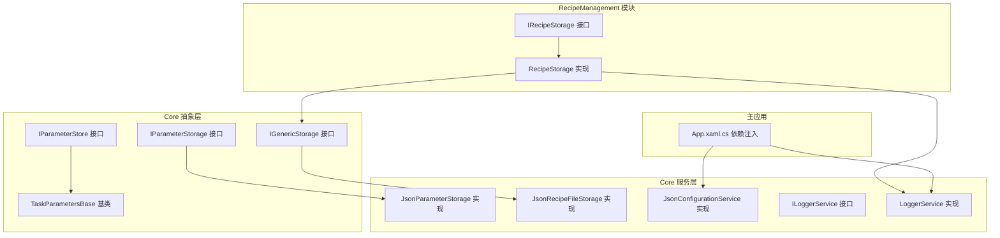
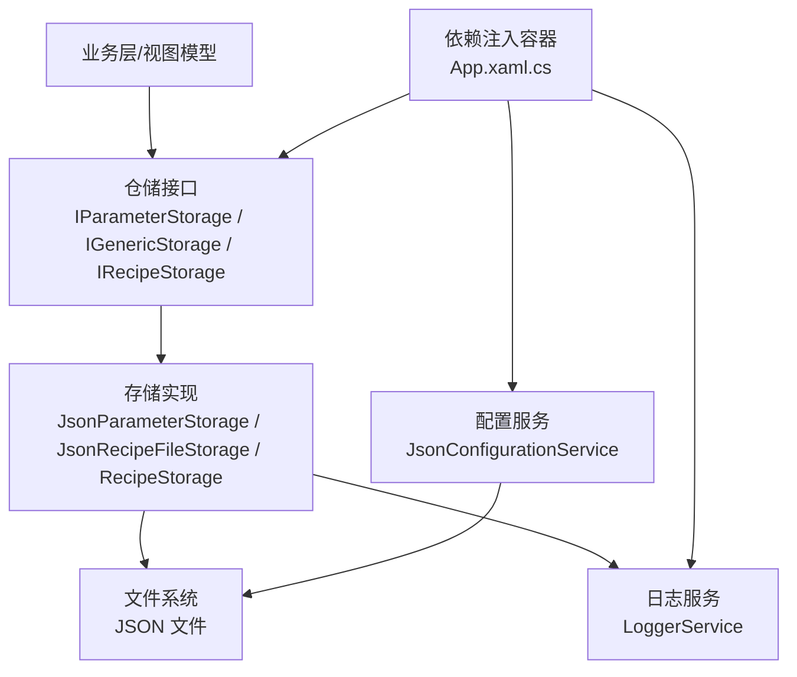
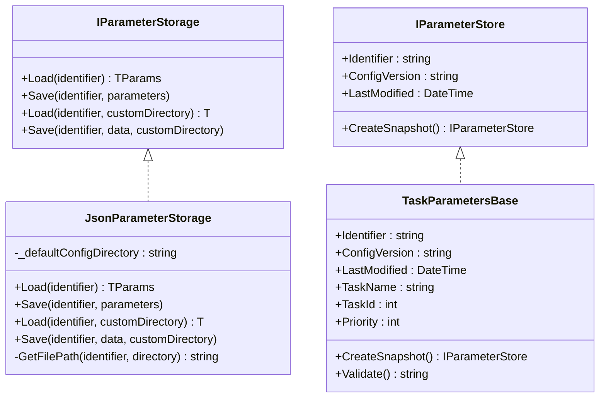
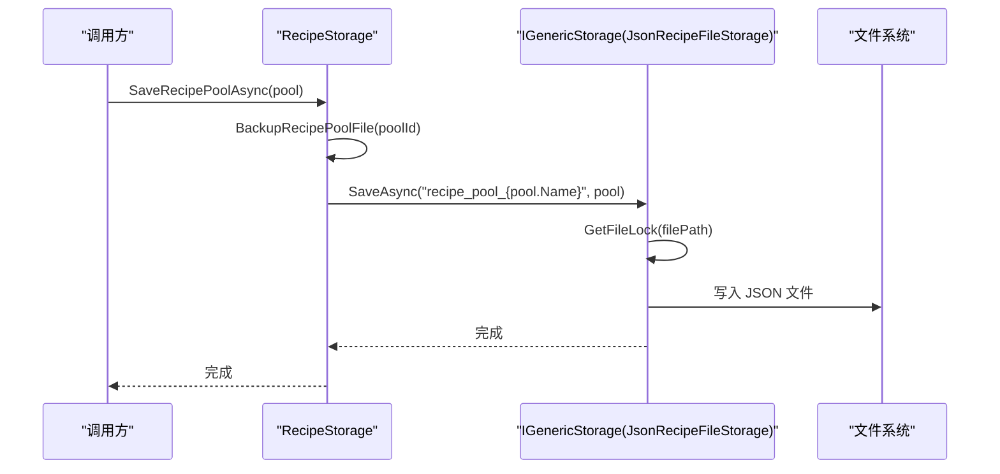
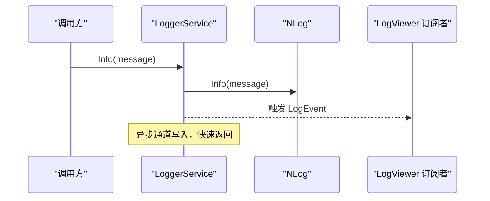
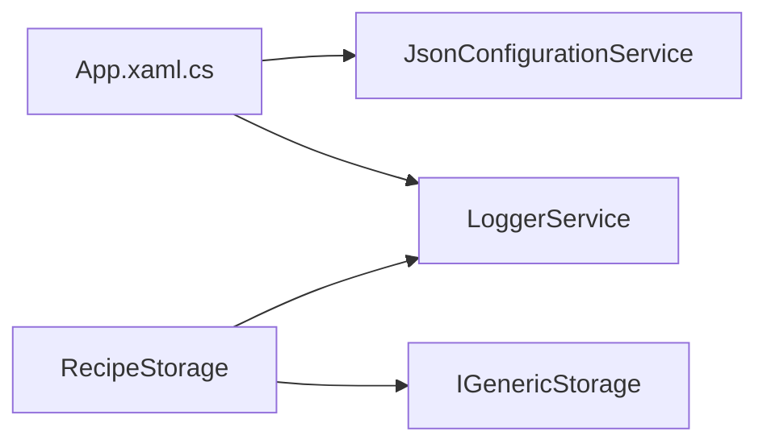
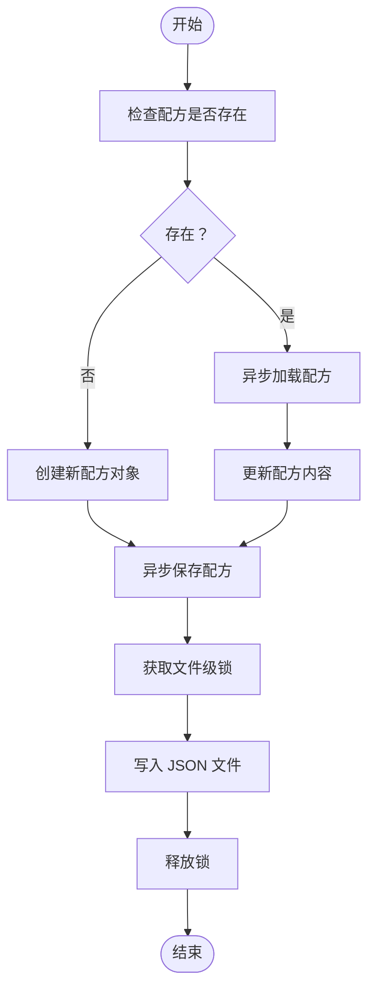
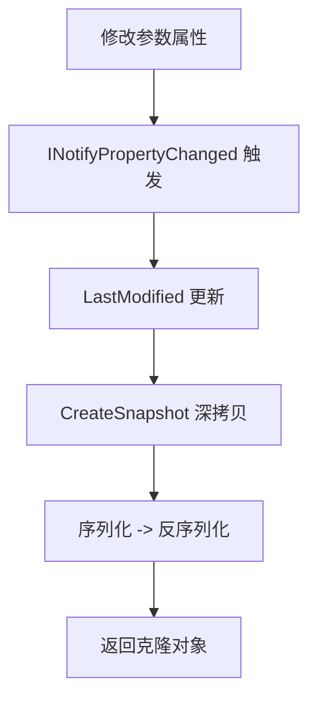

# 数据访问模式

<cite>
**本文引用的文件**
- [IParameterStorage.cs](file://Core/Abstraction/IParameterStorage.cs)
- [IGenericStorage.cs](file://Core/Abstraction/Storages/IGenericStorage.cs)
- [JsonParameterStorage.cs](file://Core/Services/JsonParameterStorage.cs)
- [JsonRecipeFileStorage.cs](file://Core/Services/JsonRecipeFileStorage.cs)
- [JsonConfigurationService.cs](file://Core/Services/JsonConfigurationService.cs)
- [IParameterStore.cs](file://Core/Abstraction/IParameterStore.cs)
- [TaskParametersBase.cs](file://Core/Abstraction/Parameters/TaskParametersBase.cs)
- [IRecipeStorage.cs](file://RecipeManagement/Interfaces/IRecipeStorage.cs)
- [RecipeStorage.cs](file://RecipeManagement/Services/RecipeStorage.cs)
- [ILoggerService.cs](file://Core/Utilities/ILoggerService.cs)
- [LoggerService.cs](file://Core/Utilities/LoggerService.cs)
- [App.xaml.cs](file://MainApp/App.xaml.cs)
</cite>

## 目录
1. [引言](#引言)
2. [项目结构](#项目结构)
3. [核心组件](#核心组件)
4. [架构总览](#架构总览)
5. [详细组件分析](#详细组件分析)
6. [依赖关系分析](#依赖关系分析)
7. [性能考虑](#性能考虑)
8. [故障排查指南](#故障排查指南)
9. [结论](#结论)
10. [附录](#附录)

## 引言
本技术文档聚焦于仓库中的数据访问模式与实现，系统性阐述仓储模式（Repository Pattern）在本项目中的落地方式，涵盖以下要点：
- 接口设计：IParameterStorage、IGenericStorage 等接口的职责边界与设计理念
- JSON 存储服务：序列化机制、配置数据与配方数据的持久化策略
- 异步数据访问：基于 IGenericStorage 的异步读写流程与并发控制
- 缓存与同步：参数快照与变更通知、日志服务的异步事件分发
- 错误处理与最佳实践：容错策略、异常传播与恢复
- 单元测试与依赖注入：模拟对象使用与容器注册建议

## 项目结构
围绕“数据访问”主题，相关代码主要分布在 Core 抽象层与服务层、RecipeManagement 的配方管理模块，以及主应用的依赖注入配置中。

图表来源
- [IParameterStorage.cs:1-18](file://Core/Abstraction/IParameterStorage.cs#L1-L18)
- [IGenericStorage.cs:1-12](file://Core/Abstraction/Storages/IGenericStorage.cs#L1-L12)
- [IParameterStore.cs:1-31](file://Core/Abstraction/IParameterStore.cs#L1-L31)
- [TaskParametersBase.cs:1-144](file://Core/Abstraction/Parameters/TaskParametersBase.cs#L1-L144)
- [JsonParameterStorage.cs:1-86](file://Core/Services/JsonParameterStorage.cs#L1-L86)
- [JsonRecipeFileStorage.cs:1-125](file://Core/Services/JsonRecipeFileStorage.cs#L1-L125)
- [JsonConfigurationService.cs:1-60](file://Core/Services/JsonConfigurationService.cs#L1-L60)
- [IRecipeStorage.cs:1-34](file://RecipeManagement/Interfaces/IRecipeStorage.cs#L1-L34)
- [RecipeStorage.cs:1-190](file://RecipeManagement/Services/RecipeStorage.cs#L1-L190)
- [ILoggerService.cs:1-35](file://Core/Utilities/ILoggerService.cs#L1-L35)
- [LoggerService.cs:1-120](file://Core/Utilities/LoggerService.cs#L1-L120)
- [App.xaml.cs:110-177](file://MainApp/App.xaml.cs#L110-L177)

章节来源
- [IParameterStorage.cs:1-18](file://Core/Abstraction/IParameterStorage.cs#L1-L18)
- [IGenericStorage.cs:1-12](file://Core/Abstraction/Storages/IGenericStorage.cs#L1-L12)
- [JsonParameterStorage.cs:1-86](file://Core/Services/JsonParameterStorage.cs#L1-L86)
- [JsonRecipeFileStorage.cs:1-125](file://Core/Services/JsonRecipeFileStorage.cs#L1-L125)
- [JsonConfigurationService.cs:1-60](file://Core/Services/JsonConfigurationService.cs#L1-L60)
- [IParameterStore.cs:1-31](file://Core/Abstraction/IParameterStore.cs#L1-L31)
- [TaskParametersBase.cs:1-144](file://Core/Abstraction/Parameters/TaskParametersBase.cs#L1-L144)
- [IRecipeStorage.cs:1-34](file://RecipeManagement/Interfaces/IRecipeStorage.cs#L1-L34)
- [RecipeStorage.cs:1-190](file://RecipeManagement/Services/RecipeStorage.cs#L1-L190)
- [ILoggerService.cs:1-35](file://Core/Utilities/ILoggerService.cs#L1-L35)
- [LoggerService.cs:1-120](file://Core/Utilities/LoggerService.cs#L1-L120)
- [App.xaml.cs:110-177](file://MainApp/App.xaml.cs#L110-L177)

## 核心组件
- IParameterStorage：面向任务参数的同步存储接口，支持通用类型与自定义目录的读写
- IGenericStorage：面向通用数据的异步存储接口，提供存在性检查与删除能力
- JsonParameterStorage：基于 Newtonsoft.Json 的参数存储实现，统一参数目录，提供序列化选项
- JsonRecipeFileStorage：基于 System.Text.Json 的配方文件存储实现，采用文件级异步锁保证并发安全
- JsonConfigurationService：配置数据的同步存储实现，集中管理配置目录
- IParameterStore/TaskParametersBase：参数实体的契约与基类，提供快照、变更通知与版本控制
- IRecipeStorage/RecipeStorage：配方域的仓储接口与实现，封装配方池与配方的 CRUD、搜索与分类
- ILoggerService/LoggerService：日志接口与实现，提供异步事件分发与环形缓冲

章节来源
- [IParameterStorage.cs:1-18](file://Core/Abstraction/IParameterStorage.cs#L1-L18)
- [IGenericStorage.cs:1-12](file://Core/Abstraction/Storages/IGenericStorage.cs#L1-L12)
- [JsonParameterStorage.cs:1-86](file://Core/Services/JsonParameterStorage.cs#L1-L86)
- [JsonRecipeFileStorage.cs:1-125](file://Core/Services/JsonRecipeFileStorage.cs#L1-L125)
- [JsonConfigurationService.cs:1-60](file://Core/Services/JsonConfigurationService.cs#L1-L60)
- [IParameterStore.cs:1-31](file://Core/Abstraction/IParameterStore.cs#L1-L31)
- [TaskParametersBase.cs:1-144](file://Core/Abstraction/Parameters/TaskParametersBase.cs#L1-L144)
- [IRecipeStorage.cs:1-34](file://RecipeManagement/Interfaces/IRecipeStorage.cs#L1-L34)
- [RecipeStorage.cs:1-190](file://RecipeManagement/Services/RecipeStorage.cs#L1-L190)
- [ILoggerService.cs:1-35](file://Core/Utilities/ILoggerService.cs#L1-L35)
- [LoggerService.cs:1-120](file://Core/Utilities/LoggerService.cs#L1-L120)

## 架构总览
下图展示了数据访问层的整体交互：上层业务通过仓储接口进行数据操作，底层由具体存储实现负责序列化与文件系统访问；日志服务以异步通道分发事件，保障性能与可观测性。

图表来源
- [App.xaml.cs:110-177](file://MainApp/App.xaml.cs#L110-L177)
- [JsonParameterStorage.cs:1-86](file://Core/Services/JsonParameterStorage.cs#L1-L86)
- [JsonRecipeFileStorage.cs:1-125](file://Core/Services/JsonRecipeFileStorage.cs#L1-L125)
- [RecipeStorage.cs:1-190](file://RecipeManagement/Services/RecipeStorage.cs#L1-L190)
- [JsonConfigurationService.cs:1-60](file://Core/Services/JsonConfigurationService.cs#L1-L60)
- [LoggerService.cs:1-120](file://Core/Utilities/LoggerService.cs#L1-L120)

## 详细组件分析

### 参数存储接口与实现
- IParameterStorage 提供两类读写能力：
  - 泛型参数类型（继承 TaskParametersBase）的读写
  - 任意类型数据的读写，并支持自定义目录
- JsonParameterStorage 的序列化策略：
  - 使用 Newtonsoft.Json，格式化缩进、驼峰命名、忽略空值、自动类型处理
  - 自动创建默认参数目录，确保路径存在
  - 加载失败或文件不存在时返回空实例，避免异常传播
- TaskParametersBase 的参数契约：
  - 统一的 Identifier、ConfigVersion、LastModified 字段
  - 支持 CreateSnapshot 进行深拷贝（序列化+反序列化）
  - INotifyPropertyChanged 用于 UI 绑定与变更通知

图表来源
- [IParameterStorage.cs:1-18](file://Core/Abstraction/IParameterStorage.cs#L1-L18)
- [JsonParameterStorage.cs:1-86](file://Core/Services/JsonParameterStorage.cs#L1-L86)
- [IParameterStore.cs:1-31](file://Core/Abstraction/IParameterStore.cs#L1-L31)
- [TaskParametersBase.cs:1-144](file://Core/Abstraction/Parameters/TaskParametersBase.cs#L1-L144)

章节来源
- [IParameterStorage.cs:1-18](file://Core/Abstraction/IParameterStorage.cs#L1-L18)
- [JsonParameterStorage.cs:1-86](file://Core/Services/JsonParameterStorage.cs#L1-L86)
- [IParameterStore.cs:1-31](file://Core/Abstraction/IParameterStore.cs#L1-L31)
- [TaskParametersBase.cs:1-144](file://Core/Abstraction/Parameters/TaskParametersBase.cs#L1-L144)

### 配方存储接口与实现
- IGenericStorage 定义异步读写、存在性检查与删除
- JsonRecipeFileStorage：
  - 使用 System.Text.Json，启用缩进、大小写不敏感、放宽转义
  - 以文件级 SemaphoreSlim 实现并发互斥，避免同一配方文件的竞态
  - 路径组织按类型名小写 + identifier，确保命名安全
- RecipeStorage：
  - 将业务语义映射到 IGenericStorage，如配方池前缀、配方搜索与分类
  - 在保存配方池前执行备份（按日期与时间戳命名），提升可靠性
  - 通过日志服务输出关键事件

图表来源
- [RecipeStorage.cs:18-36](file://RecipeManagement/Services/RecipeStorage.cs#L18-L36)
- [JsonRecipeFileStorage.cs:64-81](file://Core/Services/JsonRecipeFileStorage.cs#L64-L81)

章节来源
- [IGenericStorage.cs:1-12](file://Core/Abstraction/Storages/IGenericStorage.cs#L1-L12)
- [JsonRecipeFileStorage.cs:1-125](file://Core/Services/JsonRecipeFileStorage.cs#L1-L125)
- [IRecipeStorage.cs:1-34](file://RecipeManagement/Interfaces/IRecipeStorage.cs#L1-L34)
- [RecipeStorage.cs:1-190](file://RecipeManagement/Services/RecipeStorage.cs#L1-L190)

### 配置数据存储
- JsonConfigurationService：
  - 统一配置目录（Config/Position），确保目录存在
  - 使用 Newtonsoft.Json 进行序列化与反序列化
  - 读取失败返回空实例，写入失败抛出包装后的异常，便于上层捕获

章节来源
- [JsonConfigurationService.cs:1-60](file://Core/Services/JsonConfigurationService.cs#L1-L60)

### 日志与事件分发
- ILoggerService：定义日志级别与事件发布
- LoggerService：
  - 使用 NLog 输出日志
  - 采用有界通道与单后台任务异步分发，防止阻塞调用线程
  - 将日志事件同时写入全局缓存与事件订阅者

图表来源
- [LoggerService.cs:78-111](file://Core/Utilities/LoggerService.cs#L78-L111)
- [ILoggerService.cs:12-16](file://Core/Utilities/ILoggerService.cs#L12-L16)

章节来源
- [ILoggerService.cs:1-35](file://Core/Utilities/ILoggerService.cs#L1-L35)
- [LoggerService.cs:1-120](file://Core/Utilities/LoggerService.cs#L1-L120)

## 依赖关系分析
- 依赖注入注册集中在 App.xaml.cs 中：
  - 注册 IConfigurationService、ILoggerService、IAppSettingService 等核心服务
  - 注册 IConfigurationProvider（XML 配置提供者）
  - 未在该处注册数据库相关服务，表明本项目采用文件系统+JSON 的本地存储策略
- RecipeStorage 依赖 IGenericStorage 与 ILoggerService，体现关注点分离与可替换性

图表来源
- [App.xaml.cs:110-177](file://MainApp/App.xaml.cs#L110-L177)
- [RecipeStorage.cs:18-22](file://RecipeManagement/Services/RecipeStorage.cs#L18-L22)

章节来源
- [App.xaml.cs:110-177](file://MainApp/App.xaml.cs#L110-L177)
- [RecipeStorage.cs:18-22](file://RecipeManagement/Services/RecipeStorage.cs#L18-L22)

## 性能考虑
- 异步 I/O 与并发控制
  - IGenericStorage 的异步接口与 JsonRecipeFileStorage 的文件级锁，避免阻塞与竞态
- 序列化策略
  - 参数存储使用 Newtonsoft.Json，配方存储使用 System.Text.Json；两者均开启缩进与属性名处理，兼顾可读性与兼容性
- 日志吞吐
  - LoggerService 使用有界通道与单消费者后台任务，限制内存占用并避免阻塞
- 目录与路径
  - 统一的默认目录策略减少 IO 开销，路径安全处理避免非法字符引发异常

## 故障排查指南
- 参数加载失败
  - 现象：读取返回空实例
  - 排查：确认文件是否存在、权限是否足够、JSON 是否有效
  - 参考：JsonParameterStorage 的 Load<T>(identifier, customDirectory)
- 配方保存冲突
  - 现象：并发写入导致文件损坏或丢失
  - 排查：确认是否使用 IGenericStorage 的异步接口；检查文件级锁是否正确释放
  - 参考：JsonRecipeFileStorage 的 SaveAsync 与 GetFileLock
- 配方池备份未生成
  - 现象：保存配方池后无备份文件
  - 排查：确认备份目录可写、时间戳命名逻辑是否触发
  - 参考：RecipeStorage 的 BackupRecipePoolFile
- 配置写入异常
  - 现象：写入抛出包装异常
  - 排查：查看异常消息中的文件路径，检查磁盘空间与权限
  - 参考：JsonConfigurationService 的 SaveConfiguration
- 日志未显示
  - 现象：LogViewer 无事件
  - 排查：确认 LoggerService 是否启动、事件订阅是否建立、通道是否被取消
  - 参考：LoggerService 的构造与 ProcessLogEvents

章节来源
- [JsonParameterStorage.cs:36-54](file://Core/Services/JsonParameterStorage.cs#L36-L54)
- [JsonRecipeFileStorage.cs:64-81](file://Core/Services/JsonRecipeFileStorage.cs#L64-L81)
- [RecipeStorage.cs:163-188](file://RecipeManagement/Services/RecipeStorage.cs#L163-L188)
- [JsonConfigurationService.cs:20-32](file://Core/Services/JsonConfigurationService.cs#L20-L32)
- [LoggerService.cs:78-111](file://Core/Utilities/LoggerService.cs#L78-L111)

## 结论
本项目通过清晰的接口分层与具体实现，构建了稳定、可扩展的数据访问层：
- IParameterStorage/IGenericStorage 明确了参数与通用数据的读写边界
- JsonParameterStorage/JsonRecipeFileStorage 提供可靠的序列化与并发控制
- TaskParametersBase 与 IParameterStore 为参数实体提供了契约与快照能力
- RecipeStorage 将业务语义与存储解耦，增强可维护性
- LoggerService 以异步通道实现高性能日志分发

## 附录

### 异步数据访问流程（配方）

图表来源
- [JsonRecipeFileStorage.cs:41-81](file://Core/Services/JsonRecipeFileStorage.cs#L41-L81)

### 参数快照与变更通知

图表来源
- [TaskParametersBase.cs:109-125](file://Core/Abstraction/Parameters/TaskParametersBase.cs#L109-L125)
- [TaskParametersBase.cs:69-105](file://Core/Abstraction/Parameters/TaskParametersBase.cs#L69-L105)

### 单元测试与模拟对象建议
- 模拟对象
  - IGenericStorage：模拟 LoadAsync/SaveAsync/ExistsAsync/DeleteAsync 的行为，断言文件路径与序列化内容
  - IParameterStorage：模拟 Load/Save 行为，验证目录与文件名安全处理
  - ILoggerService：验证日志级别与事件触发次数
- 依赖注入
  - 在测试中使用轻量容器或直接构造仓储实现，注入模拟的日志与存储依赖
  - 对 RecipeStorage，可注入 JsonRecipeFileStorage 并设置测试专用的 basePath，避免污染真实文件

[本节为通用指导，无需列出章节来源]