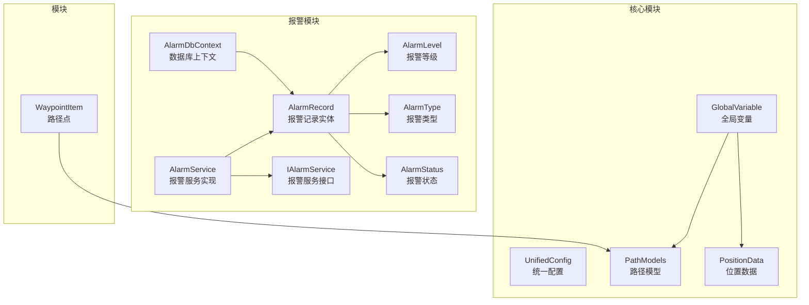
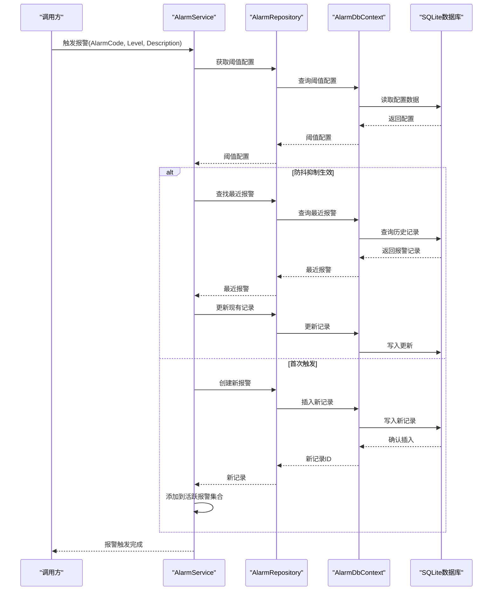
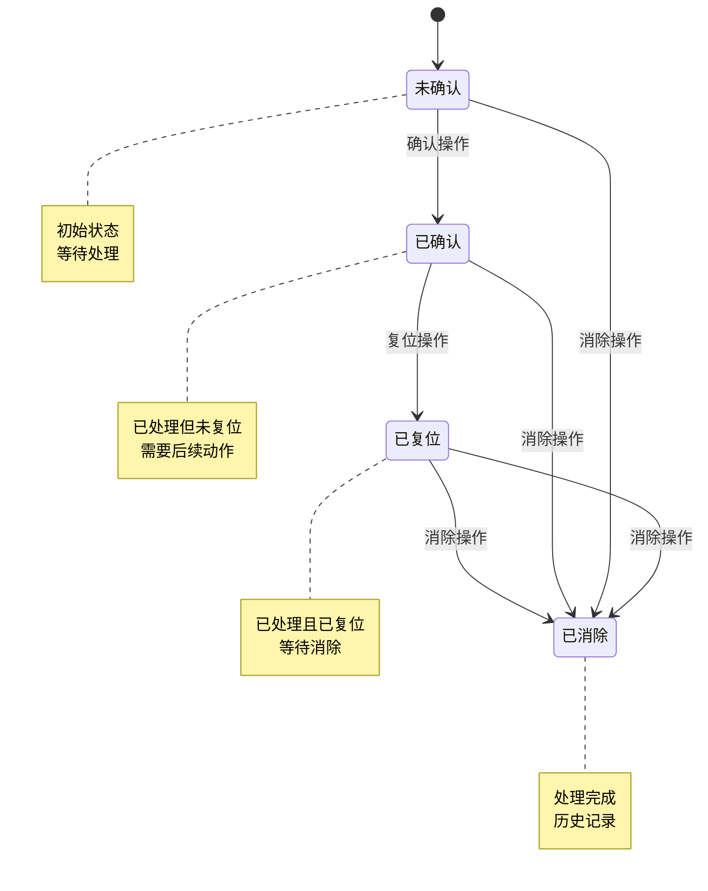
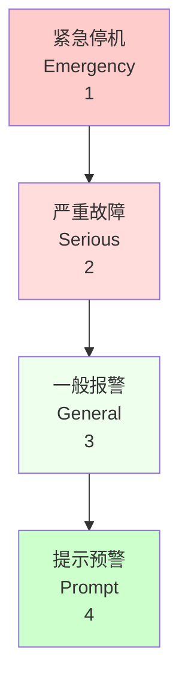
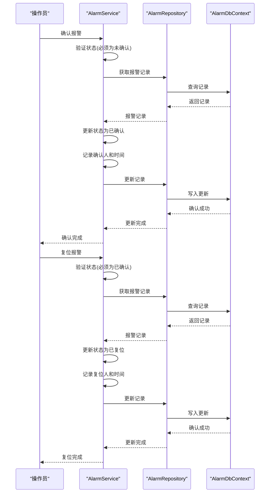
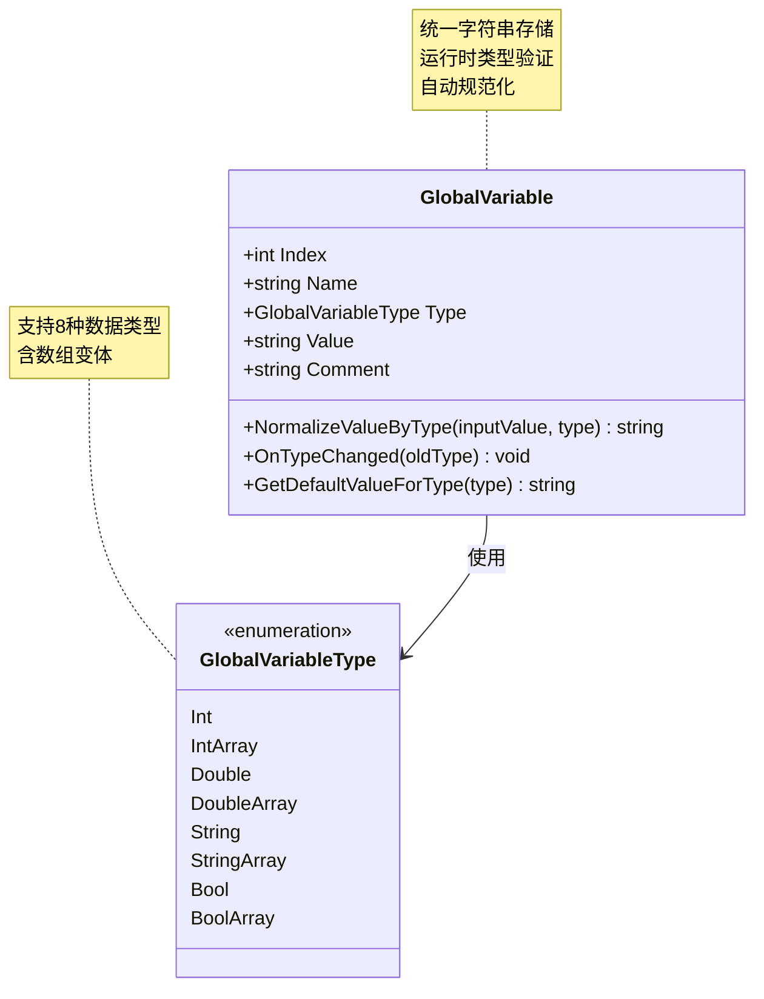
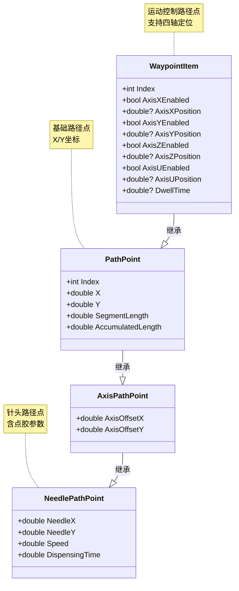
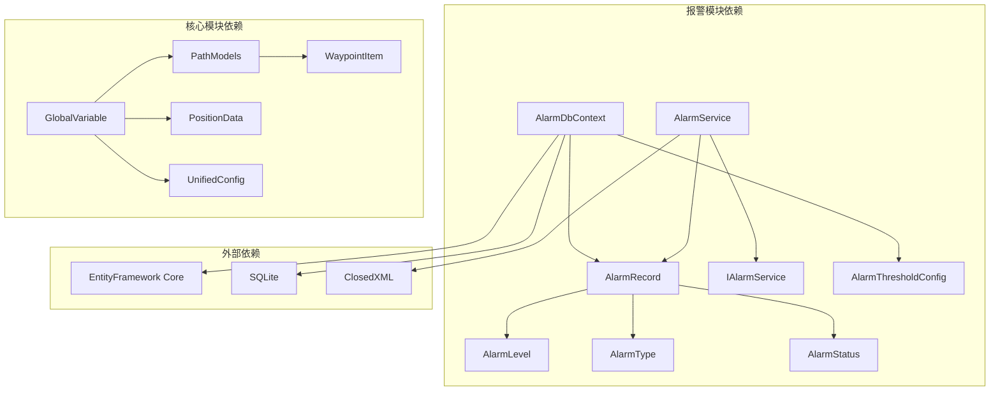

# 核心数据模型

<cite>
**本文档引用的文件**
- [AlarmRecord.cs](file://AlarmModule/Models/AlarmRecord.cs)
- [AlarmLevel.cs](file://AlarmModule/Models/AlarmLevel.cs)
- [AlarmType.cs](file://AlarmModule/Models/AlarmType.cs)
- [AlarmStatus.cs](file://AlarmModule/Models/AlarmStatus.cs)
- [IAlarmService.cs](file://AlarmModule/Interfaces/IAlarmService.cs)
- [AlarmService.cs](file://AlarmModule/Services/AlarmService.cs)
- [AlarmDbContext.cs](file://AlarmModule/Data/AlarmDbContext.cs)
- [GlobalVariable.cs](file://Core/Models/GlobalVariable.cs)
- [UnifiedConfig.cs](file://Core/Models/UnifiedConfig.cs)
- [WaypointItem.cs](file://Module/Models/WaypointItem.cs)
- [PathModels.cs](file://Core/Models/PathModels.cs)
- [PositionData.cs](file://Core/Models/PositionData.cs)
</cite>

## 目录
1. [简介](#简介)
2. [项目结构](#项目结构)
3. [核心组件](#核心组件)
4. [架构概览](#架构概览)
5. [详细组件分析](#详细组件分析)
6. [依赖分析](#依赖分析)
7. [性能考虑](#性能考虑)
8. [故障排除指南](#故障排除指南)
9. [结论](#结论)

## 简介
本文件深入解析核心数据模型，重点涵盖报警记录实体AlarmRecord的设计原理、工业4级分类体系、报警生命周期管理、确认/复位流程；全局变量GlobalVariable的存储机制、统一配置UnifiedConfig的数据结构、路径点WaypointItem的坐标系统；以及枚举类型AlarmLevel、AlarmType、AlarmStatus的业务含义和使用场景。同时提供数据模型之间的关系图和实际使用示例，包括数据验证规则、字段约束、默认值设置。

## 项目结构
核心数据模型分布在多个模块中：
- 报警模块：AlarmModule 提供报警记录、服务、仓储、数据库上下文
- 核心模块：Core 提供全局变量、统一配置、路径模型、位置数据
- 模块：Module 提供路径点模型

**图表来源**
- [AlarmRecord.cs:11-60](file://AlarmModule/Models/AlarmRecord.cs#L11-L60)
- [AlarmLevel.cs:6-16](file://AlarmModule/Models/AlarmLevel.cs#L6-L16)
- [AlarmType.cs:6-16](file://AlarmModule/Models/AlarmType.cs#L6-L16)
- [AlarmStatus.cs:6-16](file://AlarmModule/Models/AlarmStatus.cs#L6-L16)
- [IAlarmService.cs:11-75](file://AlarmModule/Interfaces/IAlarmService.cs#L11-L75)
- [AlarmService.cs:16-46](file://AlarmModule/Services/AlarmService.cs#L16-L46)
- [AlarmDbContext.cs:10-44](file://AlarmModule/Data/AlarmDbContext.cs#L10-L44)
- [GlobalVariable.cs:14-147](file://Core/Models/GlobalVariable.cs#L14-L147)
- [UnifiedConfig.cs:9-12](file://Core/Models/UnifiedConfig.cs#L9-L12)
- [WaypointItem.cs:5-36](file://Module/Models/WaypointItem.cs#L5-L36)
- [PathModels.cs:8-223](file://Core/Models/PathModels.cs#L8-L223)
- [PositionData.cs:6-44](file://Core/Models/PositionData.cs#L6-L44)

**章节来源**
- [AlarmRecord.cs:1-62](file://AlarmModule/Models/AlarmRecord.cs#L1-L62)
- [AlarmLevel.cs:1-18](file://AlarmModule/Models/AlarmLevel.cs#L1-L18)
- [AlarmType.cs:1-18](file://AlarmModule/Models/AlarmType.cs#L1-L18)
- [AlarmStatus.cs:1-18](file://AlarmModule/Models/AlarmStatus.cs#L1-L18)
- [IAlarmService.cs:1-77](file://AlarmModule/Interfaces/IAlarmService.cs#L1-L77)
- [AlarmService.cs:1-308](file://AlarmModule/Services/AlarmService.cs#L1-L308)
- [AlarmDbContext.cs:1-46](file://AlarmModule/Data/AlarmDbContext.cs#L1-L46)
- [GlobalVariable.cs:1-148](file://Core/Models/GlobalVariable.cs#L1-L148)
- [UnifiedConfig.cs:1-14](file://Core/Models/UnifiedConfig.cs#L1-L14)
- [WaypointItem.cs:1-38](file://Module/Models/WaypointItem.cs#L1-L38)
- [PathModels.cs:1-224](file://Core/Models/PathModels.cs#L1-L224)
- [PositionData.cs:1-44](file://Core/Models/PositionData.cs#L1-L44)

## 核心组件

### 报警记录实体 AlarmRecord
AlarmRecord 是报警系统的核心实体，承载完整的报警生命周期数据，支持工业4级分类、确认/复位流程、阈值记录、防抖抑制等功能。

**关键特性：**
- 主键自增标识，确保唯一性
- 完整的时间戳记录（触发时间、确认时间、复位时间）
- 工业4级分类体系集成
- 状态机管理（未确认→已确认→已复位→已消除）
- 阈值监控支持（触发值、阈值）

**字段约束与默认值：**
- Id：自增主键
- AlarmTime：必填，默认当前时间
- AlarmLevel：必填，默认一般报警
- AlarmCode：必填，长度限制50字符
- AlarmSource：必填，长度限制100字符
- AlarmType：必填，默认硬件故障
- Description：必填，长度限制500字符
- TriggerValue/ThresholdValue：可选数值
- Status：必填，默认未确认
- ConfirmedBy/ResetBy：可选字符串，长度限制50字符
- ProcessingNotes：可选字符串，长度限制1000字符
- SuppressedUntil：可选时间戳

**章节来源**
- [AlarmRecord.cs:11-60](file://AlarmModule/Models/AlarmRecord.cs#L11-L60)

### 全局变量 GlobalVariable
GlobalVariable 提供统一的全局变量存储机制，支持多种数据类型和数组存储。

**数据类型支持：**
- 数值类型：Int、Double（含数组形式）
- 字符串类型：String、StringArray
- 布尔类型：Bool、BoolArray

**存储机制：**
- 统一以字符串形式存储
- 运行时根据类型进行约束验证
- 类型变更时自动规范化现有值

**验证规则：**
- Int/IntArray：只允许整数，自动截断小数部分
- Double/DoubleArray：验证是否为合法数值
- Bool/BoolArray：只允许true/false（不区分大小写），支持1/0自动转换
- String/StringArray：无约束

**默认值策略：**
- Int/Double：默认"0"
- Bool：默认"false"
- String：默认空字符串
- 数组类型：默认空字符串

**章节来源**
- [GlobalVariable.cs:6-147](file://Core/Models/GlobalVariable.cs#L6-L147)

### 统一配置 UnifiedConfig
UnifiedConfig 作为统一配置的基础容器，目前定义为空，为未来的配置扩展预留空间。

**设计考虑：**
- 采用轻量级设计，便于扩展
- 支持集中式配置管理
- 与全局变量系统协同工作

**章节来源**
- [UnifiedConfig.cs:9-12](file://Core/Models/UnifiedConfig.cs#L9-L12)

### 路径点 WaypointItem
WaypointItem 定义了运动控制中的路径点坐标系统，支持多轴定位和停留时间控制。

**坐标系统：**
- 支持X、Y、Z、U四轴定位
- 每个轴可独立启用/禁用
- 支持双精度浮点数坐标
- 可选的停留时间设置

**字段设计：**
- Index：路径点索引
- AxisX/Y/Z/UEnabled：各轴启用状态
- AxisX/Y/Z/UPosition：各轴目标位置
- DwellTime：停留时间（毫秒）

**章节来源**
- [WaypointItem.cs:5-36](file://Module/Models/WaypointItem.cs#L5-L36)

## 架构概览
报警系统的整体架构采用分层设计，实现了数据模型、服务层、仓储层的清晰分离。

**图表来源**
- [AlarmService.cs:52-91](file://AlarmModule/Services/AlarmService.cs#L52-L91)
- [AlarmDbContext.cs:10-44](file://AlarmModule/Data/AlarmDbContext.cs#L10-L44)

**章节来源**
- [AlarmService.cs:16-91](file://AlarmModule/Services/AlarmService.cs#L16-L91)
- [AlarmDbContext.cs:10-44](file://AlarmModule/Data/AlarmDbContext.cs#L10-L44)

## 详细组件分析

### 报警生命周期管理
报警状态机实现了严格的生命周期管理，确保报警处理的规范性和可追溯性。

**图表来源**
- [AlarmStatus.cs:6-16](file://AlarmModule/Models/AlarmStatus.cs#L6-L16)

**状态流转规则：**
- 未确认 → 已确认：仅允许对未确认状态进行确认
- 已确认 → 已复位：仅允许对已确认状态进行复位
- 已复位 → 已消除：复位后自动进入消除状态
- 任何状态 → 已消除：支持直接消除操作

**章节来源**
- [AlarmStatus.cs:1-18](file://AlarmModule/Models/AlarmStatus.cs#L1-L18)
- [AlarmService.cs:96-155](file://AlarmModule/Services/AlarmService.cs#L96-L155)

### 工业4级分类体系
工业4级分类体系提供了标准化的报警严重程度分级，便于不同层级的管理和响应。

**图表来源**
- [AlarmLevel.cs:6-16](file://AlarmModule/Models/AlarmLevel.cs#L6-L16)

**各级别含义：**
- 紧急停机（Emergency）：危及人身/设备安全，立即停机
- 严重故障（Serious）：无法生产，需立刻处理
- 一般报警（General）：可维持生产，需当班处理
- 提示预警（Prompt）：保养提醒、临近阈值，无需紧急处理

**章节来源**
- [AlarmLevel.cs:1-18](file://AlarmModule/Models/AlarmLevel.cs#L1-L18)

### 确认/复位流程
确认和复位流程确保了报警处理的规范性和可追溯性。

**图表来源**
- [AlarmService.cs:96-131](file://AlarmModule/Services/AlarmService.cs#L96-L131)

**章节来源**
- [AlarmService.cs:96-131](file://AlarmModule/Services/AlarmService.cs#L96-L131)

### 全局变量存储机制
全局变量系统提供了灵活的数据存储和类型验证机制。

**图表来源**
- [GlobalVariable.cs:14-147](file://Core/Models/GlobalVariable.cs#L14-L147)

**类型转换规则：**
- Int/IntArray：数值截断，小数部分丢弃
- Double/DoubleArray：数值验证，无效输入保持原样
- Bool/BoolArray：布尔验证，支持"true"/"false"和"1"/"0"
- String/StringArray：无约束

**章节来源**
- [GlobalVariable.cs:73-129](file://Core/Models/GlobalVariable.cs#L73-L129)

### 路径点坐标系统
路径点模型定义了运动控制中的坐标系统，支持多轴联动和精确控制。

**图表来源**
- [WaypointItem.cs:5-36](file://Module/Models/WaypointItem.cs#L5-L36)
- [PathModels.cs:40-133](file://Core/Models/PathModels.cs#L40-L133)

**坐标系统特点：**
- 支持独立轴启用/禁用
- 双精度浮点数提供高精度
- 可选停留时间控制运动节拍
- 扩展支持针头路径点的特殊需求

**章节来源**
- [WaypointItem.cs:1-38](file://Module/Models/WaypointItem.cs#L1-L38)
- [PathModels.cs:85-133](file://Core/Models/PathModels.cs#L85-L133)

## 依赖分析

**图表来源**
- [AlarmDbContext.cs:1-46](file://AlarmModule/Data/AlarmDbContext.cs#L1-L46)
- [AlarmService.cs:1-308](file://AlarmModule/Services/AlarmService.cs#L1-L308)
- [GlobalVariable.cs:1-148](file://Core/Models/GlobalVariable.cs#L1-L148)
- [PathModels.cs:1-224](file://Core/Models/PathModels.cs#L1-L224)

**依赖关系：**
- AlarmDbContext 依赖 EntityFramework Core 和 SQLite
- AlarmService 依赖 ClosedXML 进行 Excel 导出
- GlobalVariable 依赖 Prism.Mvvm 进行属性变更通知
- 路径模型之间存在继承关系，形成层次化的坐标系统

**章节来源**
- [AlarmDbContext.cs:1-46](file://AlarmModule/Data/AlarmDbContext.cs#L1-L46)
- [AlarmService.cs:1-308](file://AlarmModule/Services/AlarmService.cs#L1-L308)
- [GlobalVariable.cs:1-148](file://Core/Models/GlobalVariable.cs#L1-L148)
- [PathModels.cs:1-224](file://Core/Models/PathModels.cs#L1-L224)

## 性能考虑
- 数据库索引优化：AlarmRecord 对 AlarmTime、AlarmLevel、AlarmCode、AlarmSource、Status 建立索引，提升查询性能
- 防抖抑制：通过阈值配置的抑制窗口减少重复报警的数据库写入
- 批量操作：提供批量确认和批量复位功能，减少多次数据库交互
- 内存管理：活跃报警集合使用 ObservableCollection，支持 UI 绑定和实时更新

## 故障排除指南

### 常见问题及解决方案

**报警状态流转异常：**
- 症状：尝试确认非未确认状态的报警失败
- 原因：状态机验证失败
- 解决：检查报警当前状态，确保只能对未确认状态进行确认

**全局变量类型转换错误：**
- 症状：设置布尔值时出现异常
- 原因：输入值不符合布尔格式
- 解决：使用"true"/"false"或"1"/"0"格式，系统会自动转换

**路径点坐标无效：**
- 症状：运动控制执行异常
- 原因：坐标轴未启用但设置了位置值
- 解决：确保启用相应轴后再设置位置值

**章节来源**
- [AlarmService.cs:96-131](file://AlarmModule/Services/AlarmService.cs#L96-L131)
- [GlobalVariable.cs:73-109](file://Core/Models/GlobalVariable.cs#L73-L109)
- [WaypointItem.cs:1-38](file://Module/Models/WaypointItem.cs#L1-L38)

## 结论
本核心数据模型文档深入解析了报警系统、全局变量、路径点等关键组件的设计原理和实现细节。通过工业4级分类体系、严格的报警生命周期管理、灵活的全局变量存储机制，以及标准化的路径点坐标系统，为整个系统的稳定运行提供了坚实的数据基础。建议在实际使用中重点关注数据验证规则、字段约束和默认值设置，确保数据的一致性和完整性。