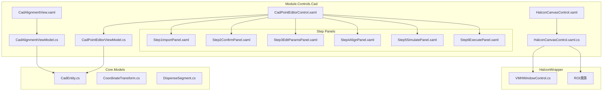
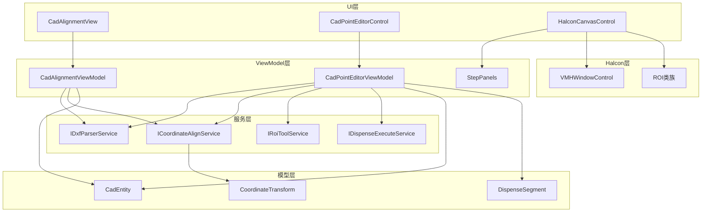
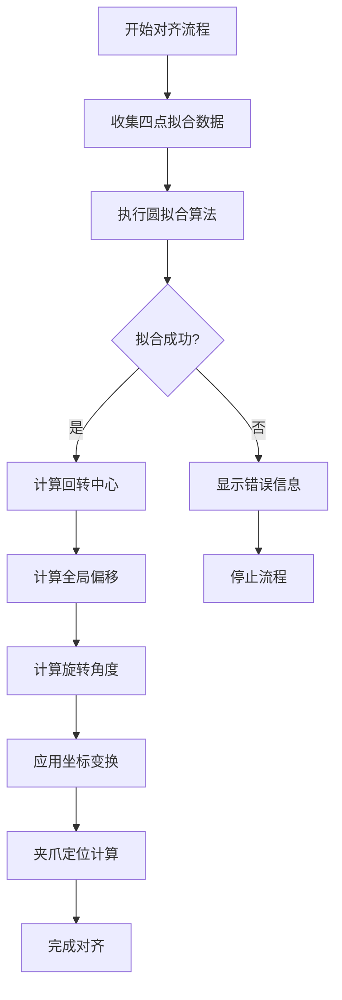
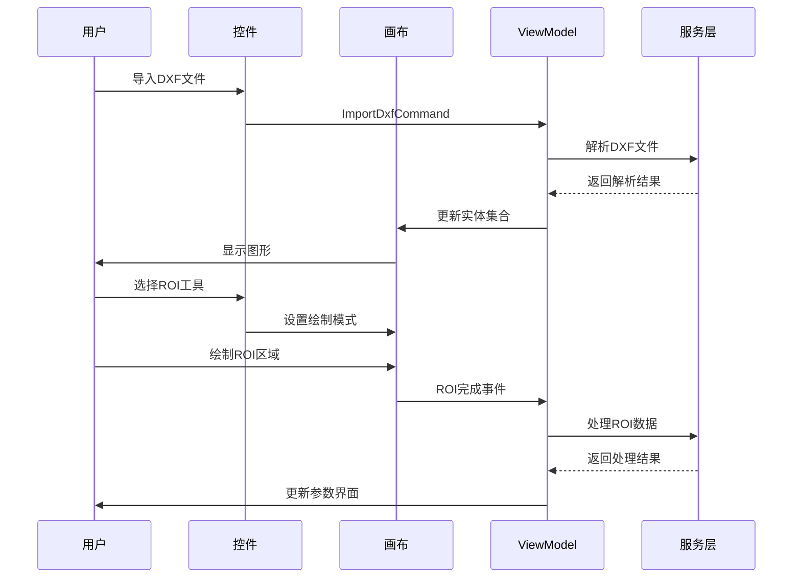
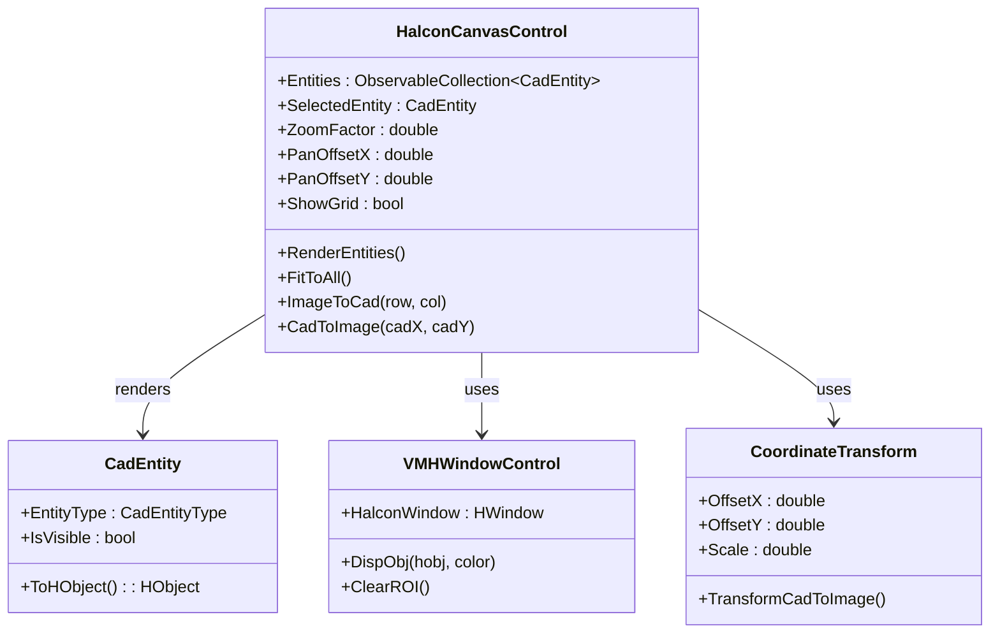
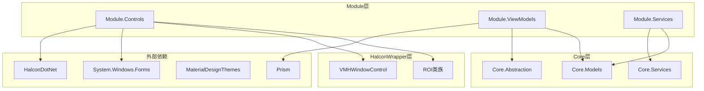

# CAD编辑控件系统

<cite>
**本文档引用的文件**
- [CadAlignmentView.xaml](file://Module/Controls/Cad/CadAlignmentView.xaml)
- [CadAlignmentView.xaml.cs](file://Module/Controls/Cad/CadAlignmentView.xaml.cs)
- [CadAlignmentViewModel.cs](file://Module/Controls/Cad/CadAlignmentViewModel.cs)
- [CadPointEditorView.xaml](file://Module/Controls/Cad/CadPointEditorView.xaml)
- [CadPointEditorView.xaml.cs](file://Module/Controls/Cad/CadPointEditorView.xaml.cs)
- [CadPointEditorControl.xaml](file://Module/Controls/Cad/CadPointEditorControl.xaml)
- [CadPointEditorControl.xaml.cs](file://Module/Controls/Cad/CadPointEditorControl.xaml.cs)
- [CadPointEditorViewModel.cs](file://Module/Controls/Cad/CadPointEditorViewModel.cs)
- [HalconCanvasControl.xaml](file://Module/Controls/Cad/HalconCanvasControl.xaml)
- [HalconCanvasControl.xaml.cs](file://Module/Controls/Cad/HalconCanvasControl.xaml.cs)
- [Step1ImportPanel.xaml](file://Module/Controls/Cad/Step1ImportPanel.xaml)
- [Step2ConfirmPanel.xaml](file://Module/Controls/Cad/Step2ConfirmPanel.xaml)
</cite>

## 目录
1. [简介](#简介)
2. [项目结构](#项目结构)
3. [核心组件](#核心组件)
4. [架构概览](#架构概览)
5. [详细组件分析](#详细组件分析)
6. [依赖关系分析](#依赖关系分析)
7. [性能考虑](#性能考虑)
8. [故障排除指南](#故障排除指南)
9. [结论](#结论)

## 简介

CAD编辑控件系统是一个完整的计算机辅助设计数据处理和可视化平台，专为点胶装配工艺设计。该系统提供了从CAD文件导入、几何实体编辑、坐标对齐、特征提取到仿真验证和执行控制的完整工作流程。

系统采用模块化设计，包含三个主要功能模块：
- **CAD对齐控件**：提供精确的坐标变换和对齐功能
- **CAD点编辑控件**：支持复杂的轨迹编辑和参数配置
- **Halcon画布控件**：基于Halcon图形库的强大可视化引擎

该系统支持多种CAD格式（主要是DXF），具备实时坐标变换、批量更新优化、ROI工具集等功能，能够满足工业自动化中对精度和性能的严格要求。

## 项目结构

CAD编辑控件系统采用清晰的层次化组织结构：

**图表来源**
- [CadAlignmentView.xaml:1-1321](file://Module/Controls/Cad/CadAlignmentView.xaml#L1-L1321)
- [CadPointEditorControl.xaml:1-164](file://Module/Controls/Cad/CadPointEditorControl.xaml#L1-L164)
- [HalconCanvasControl.xaml.cs:1-2144](file://Module/Controls/Cad/HalconCanvasControl.xaml.cs#L1-L2144)

**章节来源**
- [CadAlignmentView.xaml:1-1321](file://Module/Controls/Cad/CadAlignmentView.xaml#L1-L1321)
- [CadPointEditorControl.xaml:1-164](file://Module/Controls/Cad/CadPointEditorControl.xaml#L1-L164)

## 核心组件

### CAD对齐控件（CadAlignmentView）

CAD对齐控件是系统的核心组件之一，提供五步标准对齐流程：

1. **回转中心拟合**：使用四点圆拟合法确定旋转中心
2. **全局偏移计算**：计算CAD坐标系与机械坐标系的平移偏移
3. **旋转角度计算**：基于CAD向量方向角确定旋转角度
4. **坐标变换应用**：实施平移和旋转变换
5. **夹爪定位**：计算最终的装配位置

该控件采用Material Design设计语言，提供直观的步骤指示器和丰富的视觉反馈。

**章节来源**
- [CadAlignmentView.xaml:1-1321](file://Module/Controls/Cad/CadAlignmentView.xaml#L1-L1321)
- [CadAlignmentViewModel.cs:1-2320](file://Module/Controls/Cad/CadAlignmentViewModel.cs#L1-L2320)

### CAD点编辑控件（CadPointEditorControl）

CAD点编辑控件是一个完整的轨迹编辑平台，包含六个步骤的工作流程：

1. **导入图纸**：支持DXF文件导入和解析
2. **确认轨迹**：图层过滤和轨迹段确认
3. **编辑参数**：ROI工具和参数配置
4. **坐标对齐**：精确的坐标变换
5. **预览仿真**：轨迹仿真和验证
6. **执行走胶**：实际的点胶执行

控件采用响应式设计，左侧为Halcon画布，右侧为动态步骤面板，底部为全局状态栏。

**章节来源**
- [CadPointEditorControl.xaml:1-164](file://Module/Controls/Cad/CadPointEditorControl.xaml#L1-L164)
- [CadPointEditorControl.xaml.cs:1-440](file://Module/Controls/Cad/CadPointEditorControl.xaml.cs#L1-L440)
- [CadPointEditorViewModel.cs:1-2674](file://Module/Controls/Cad/CadPointEditorViewModel.cs#L1-L2674)

### Halcon画布控件（HalconCanvasControl）

Halcon画布控件是系统的基础可视化组件，基于Halcon图形库构建：

- **7种ROI绘制模式**：矩形、圆形、线段、折线、圆弧、涂抹、擦除
- **实时坐标变换**：CAD坐标与图像坐标的双向转换
- **批量更新优化**：减少频繁重绘导致的闪烁
- **交互式缩放和平移**：支持滚轮缩放和鼠标拖拽

该控件提供了强大的图形渲染能力和灵活的交互体验。

**章节来源**
- [HalconCanvasControl.xaml.cs:1-2144](file://Module/Controls/Cad/HalconCanvasControl.xaml.cs#L1-L2144)

## 架构概览

系统采用MVVM架构模式，结合事件驱动的设计：

**图表来源**
- [CadAlignmentViewModel.cs:1-2320](file://Module/Controls/Cad/CadAlignmentViewModel.cs#L1-L2320)
- [CadPointEditorViewModel.cs:1-2674](file://Module/Controls/Cad/CadPointEditorViewModel.cs#L1-L2674)
- [HalconCanvasControl.xaml.cs:1-2144](file://Module/Controls/Cad/HalconCanvasControl.xaml.cs#L1-L2144)

系统的关键特性包括：

1. **模块化设计**：各组件职责明确，便于维护和扩展
2. **事件驱动通信**：通过CLR事件和路由事件实现松耦合通信
3. **依赖注入**：通过Prism容器实现服务的注入和管理
4. **异步处理**：支持长时间运行的操作，避免UI阻塞
5. **错误处理**：完善的异常处理和状态管理机制

## 详细组件分析

### CAD对齐控件详细分析

#### 核心算法实现

CAD对齐控件实现了多个关键算法：

**四点圆拟合算法**：
- 使用最小二乘法（Kåsa方法）
- 支持3个以上点的拟合
- 提供拟合半径和中心坐标

**坐标变换算法**：
- 全局平移变换：ΔX = P1_Mx - P1_Cx, ΔY = P1_My - P1_Cy
- 旋转角度计算：θ = α_基准 - α_目标
- 仿射变换矩阵计算

**图表来源**
- [CadAlignmentViewModel.cs:605-652](file://Module/Controls/Cad/CadAlignmentViewModel.cs#L605-L652)

#### 用户界面设计

控件采用Material Design设计规范，提供：

- **步骤指示器**：显示当前步骤和完成状态
- **数据表格**：用于输入和显示测量数据
- **结果展示**：以卡片形式展示计算结果
- **操作按钮**：提供清晰的功能入口

**章节来源**
- [CadAlignmentView.xaml:1-1321](file://Module/Controls/Cad/CadAlignmentView.xaml#L1-L1321)
- [CadAlignmentViewModel.cs:1-2320](file://Module/Controls/Cad/CadAlignmentViewModel.cs#L1-L2320)

### CAD点编辑控件详细分析

#### 6步工作流程

控件实现了完整的点胶轨迹编辑工作流程：

**Step 1 - 导入图纸**：
- DXF文件选择和导入
- 图元解析和实体生成
- 错误处理和状态反馈

**Step 2 - 确认轨迹**：
- 图层过滤和可见性控制
- 轨迹段统计和摘要
- 图元选择和高亮

**Step 3 - 编辑参数**：
- ROI工具激活和配置
- 参数调整和验证
- 实时预览和反馈

**Step 4 - 坐标对齐**：
- 基准点设置
- 变换矩阵计算
- 对齐效果验证

**Step 5 - 预览仿真**：
- 轨迹仿真运行
- 性能评估和优化
- 错误检测和报告

**Step 6 - 执行走胶**：
- 最终确认和检查
- 实际执行控制
- 执行结果记录

**图表来源**
- [CadPointEditorControl.xaml.cs:288-350](file://Module/Controls/Cad/CadPointEditorControl.xaml.cs#L288-L350)
- [CadPointEditorViewModel.cs:1-2674](file://Module/Controls/Cad/CadPointEditorViewModel.cs#L1-L2674)

#### ROI工具系统

控件提供了完整的ROI（感兴趣区域）工具集：

**支持的ROI类型**：
- 线段ROI：用于边缘检测和路径规划
- 折线ROI：用于复杂轮廓的定义
- 圆弧ROI：用于弯曲路径的建模
- 矩形ROI：用于区域扫描和检测
- 圆形ROI：用于点状特征的识别
- 涂抹ROI：用于手动区域编辑
- 擦除ROI：用于区域删除和修正

**ROI处理流程**：
1. 用户激活ROI工具
2. 画布进入绘制模式
3. 用户在图形上绘制ROI
4. ROI完成后转换为CAD坐标
5. 更新ViewModel中的ROI参数

**章节来源**
- [HalconCanvasControl.xaml.cs:23-33](file://Module/Controls/Cad/HalconCanvasControl.xaml.cs#L23-L33)
- [CadPointEditorControl.xaml.cs:288-350](file://Module/Controls/Cad/CadPointEditorControl.xaml.cs#L288-L350)

### Halcon画布控件详细分析

#### 图形渲染系统

Halcon画布控件实现了高效的图形渲染系统：

**坐标变换机制**：
- CAD坐标系到图像坐标系的转换
- 支持缩放、平移和旋转
- 实时坐标变换计算

**渲染优化策略**：
- 坐标变换结果缓存
- 批量更新机制
- 按需重绘策略

**图表来源**
- [HalconCanvasControl.xaml.cs:115-205](file://Module/Controls/Cad/HalconCanvasControl.xaml.cs#L115-L205)
- [HalconCanvasControl.xaml.cs:468-502](file://Module/Controls/Cad/HalconCanvasControl.xaml.cs#L468-L502)

#### 交互式功能

控件提供了丰富的交互式功能：

**鼠标事件处理**：
- 实时坐标跟踪
- 图元选择和高亮
- ROI绘制和编辑
- 双击编辑功能

**键盘快捷键**：
- Ctrl+C/V 复制粘贴
- Delete 删除选中元素
- F 适应视口
- R 重置视图

**状态管理**：
- 绘制模式状态
- 选中状态管理
- 编辑状态跟踪
- 错误状态显示

**章节来源**
- [HalconCanvasControl.xaml.cs:574-581](file://Module/Controls/Cad/HalconCanvasControl.xaml.cs#L574-L581)

## 依赖关系分析

系统采用清晰的依赖层次结构：

**图表来源**
- [HalconCanvasControl.xaml.cs:1-16](file://Module/Controls/Cad/HalconCanvasControl.xaml.cs#L1-L16)
- [CadPointEditorControl.xaml.cs:1-15](file://Module/Controls/Cad/CadPointEditorControl.xaml.cs#L1-L15)

### 关键依赖关系

1. **Halcon集成**：通过VMHWindowControl集成Halcon图形库
2. **MVVM框架**：使用Prism实现MVVM架构和依赖注入
3. **样式系统**：采用Material Design主题提供一致的用户体验
4. **Windows Forms互操作**：通过WindowsFormsHost嵌入WinForms控件

**章节来源**
- [CadAlignmentView.xaml.cs:1-115](file://Module/Controls/Cad/CadAlignmentView.xaml.cs#L1-L115)
- [CadPointEditorControl.xaml.cs:103-135](file://Module/Controls/Cad/CadPointEditorControl.xaml.cs#L103-L135)

## 性能考虑

系统在多个层面实现了性能优化：

### 渲染性能优化

**批量更新机制**：
- BeginBatchUpdate/EndBatchUpdate方法
- 减少频繁重绘导致的闪烁
- 一次性完整渲染提高效率

**坐标变换缓存**：
- TransformCadToImageWithCache方法
- 避免重复的坐标变换计算
- 基于实体哈希值的缓存管理

**增量渲染**：
- 只重绘可见图元
- 按需更新视口适配
- 优化的重绘策略

### 内存管理

**资源释放**：
- 实现IDisposable接口
- 及时释放Halcon对象
- 避免内存泄漏

**对象池模式**：
- Reusable HObject实例
- 减少垃圾回收压力
- 提高对象复用效率

### 算法优化

**时间复杂度优化**：
- 坐标变换O(n)复杂度
- ROI绘制O(m)复杂度（m为顶点数）
- 缓存命中率优化

**空间复杂度优化**：
- 按需加载DXF数据
- 分页显示大量图元
- 智能内存管理

## 故障排除指南

### 常见问题及解决方案

**Halcon许可证问题**：
- 症状：启动时出现许可证错误
- 解决方案：检查Halcon安装和许可证配置
- 预防措施：确保开发环境和生产环境的许可证一致

**DXF文件解析失败**：
- 症状：导入DXF文件时报错
- 解决方案：检查DXF文件格式兼容性
- 预防措施：使用标准DXF格式，避免复杂实体

**画布渲染异常**：
- 症状：图形显示不完整或空白
- 解决方案：检查坐标变换参数
- 预防措施：验证CAD数据的有效性

**内存使用过高**：
- 症状：应用程序占用内存持续增长
- 解决方案：定期调用Dispose方法
- 预防措施：实现适当的生命周期管理

### 调试技巧

**日志记录**：
- 使用Debug.WriteLine输出调试信息
- 记录关键操作的时间戳
- 跟踪异常发生的具体位置

**性能监控**：
- 监控渲染帧率
- 跟踪内存使用情况
- 分析算法执行时间

**用户反馈**：
- 收集用户操作日志
- 记录常见问题场景
- 建立问题反馈机制

**章节来源**
- [HalconCanvasControl.xaml.cs:497-501](file://Module/Controls/Cad/HalconCanvasControl.xaml.cs#L497-L501)
- [CadAlignmentView.xaml.cs:74-94](file://Module/Controls/Cad/CadAlignmentView.xaml.cs#L74-L94)

## 结论

CAD编辑控件系统是一个功能完整、架构清晰的工业级图形处理平台。系统的主要优势包括：

1. **功能完整性**：覆盖从CAD导入到执行的完整工作流程
2. **性能优化**：通过多种技术手段确保高效运行
3. **用户体验**：采用现代化的设计语言和交互模式
4. **可扩展性**：模块化设计便于功能扩展和维护
5. **稳定性**：完善的错误处理和异常管理机制

该系统特别适用于需要精确CAD数据处理和可视化的企业应用场景，为点胶装配、质量检测等工业自动化任务提供了强有力的技术支撑。

通过合理的架构设计和实现细节，系统能够在保证功能完整性的同时，满足工业应用对精度、性能和稳定性的严格要求。未来可以进一步增强机器学习集成、云端协作等功能，以适应工业4.0的发展趋势。