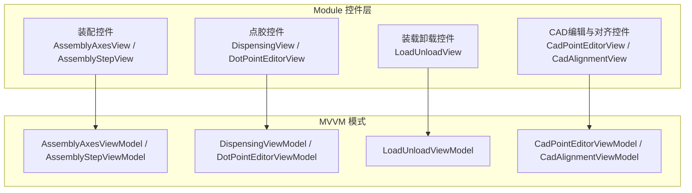
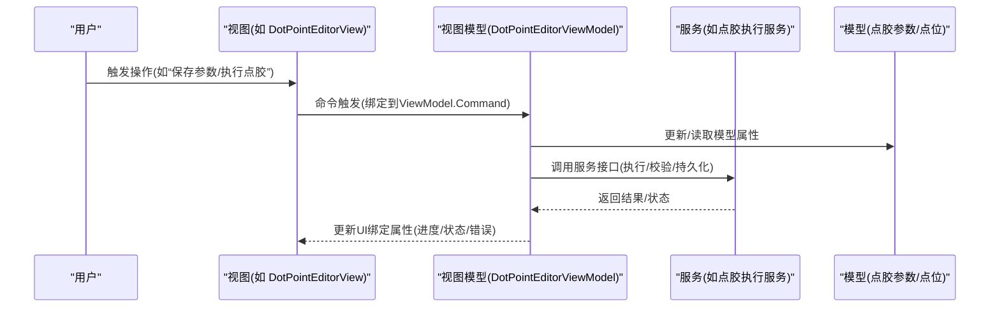
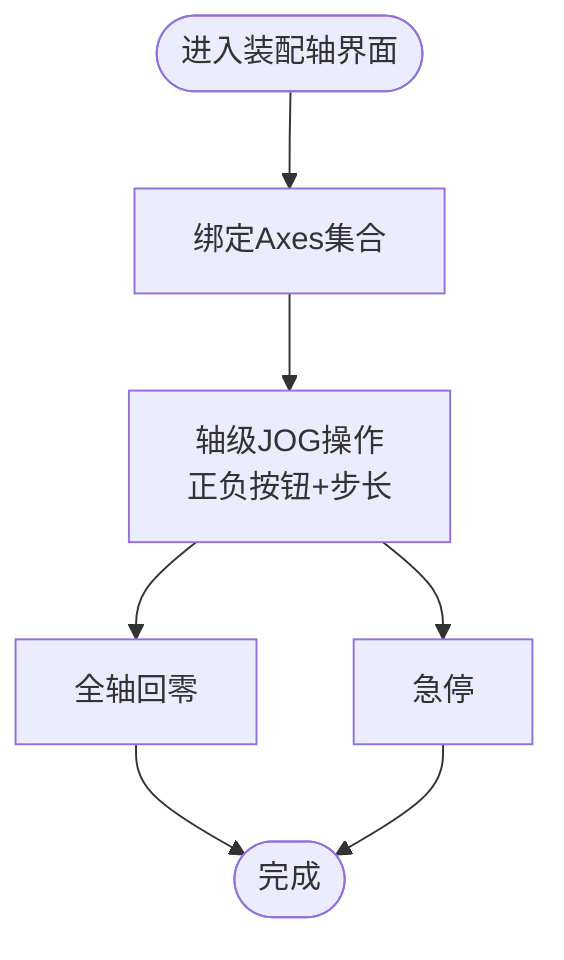
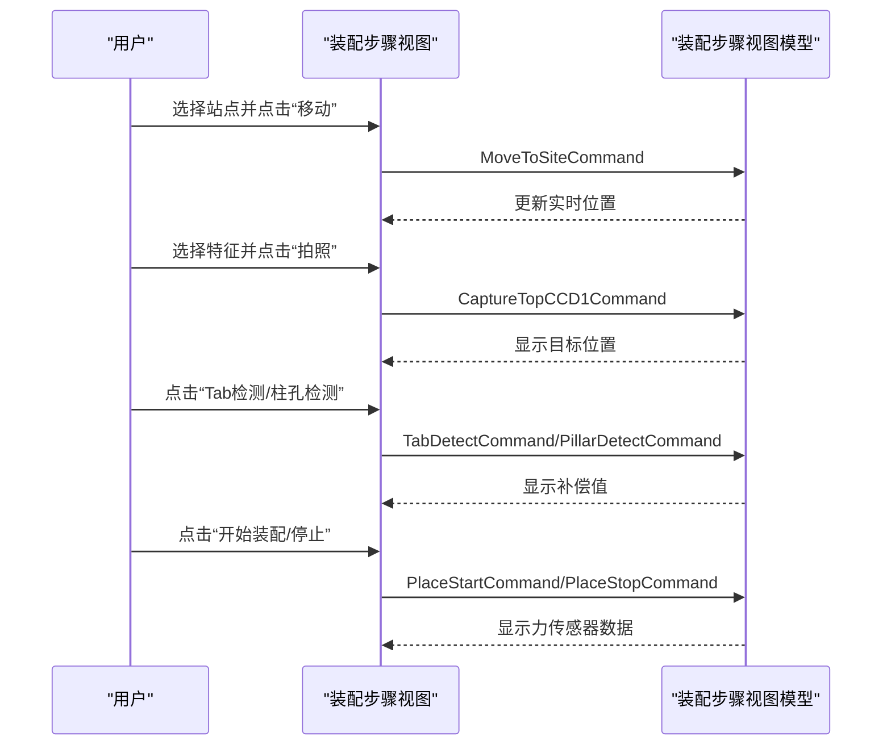
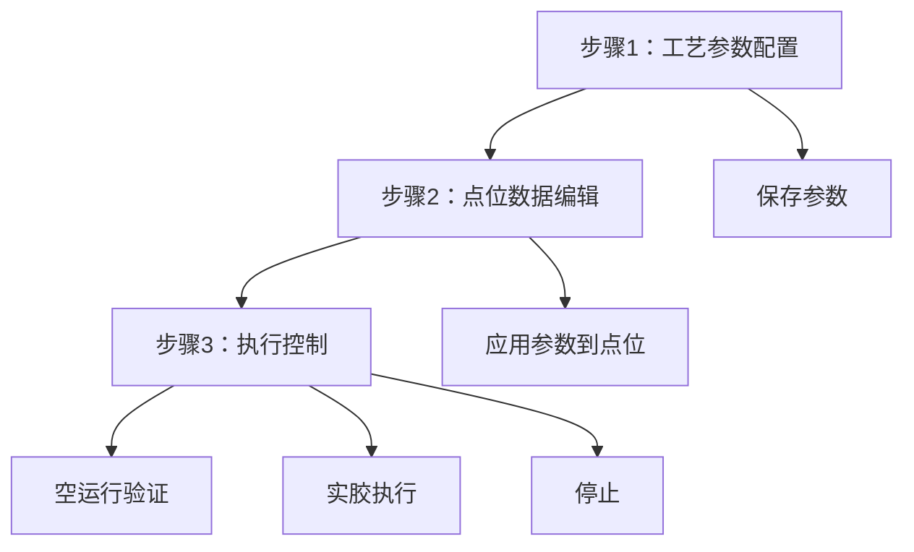
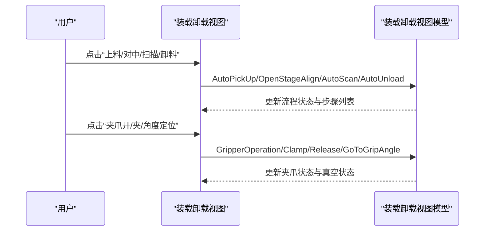
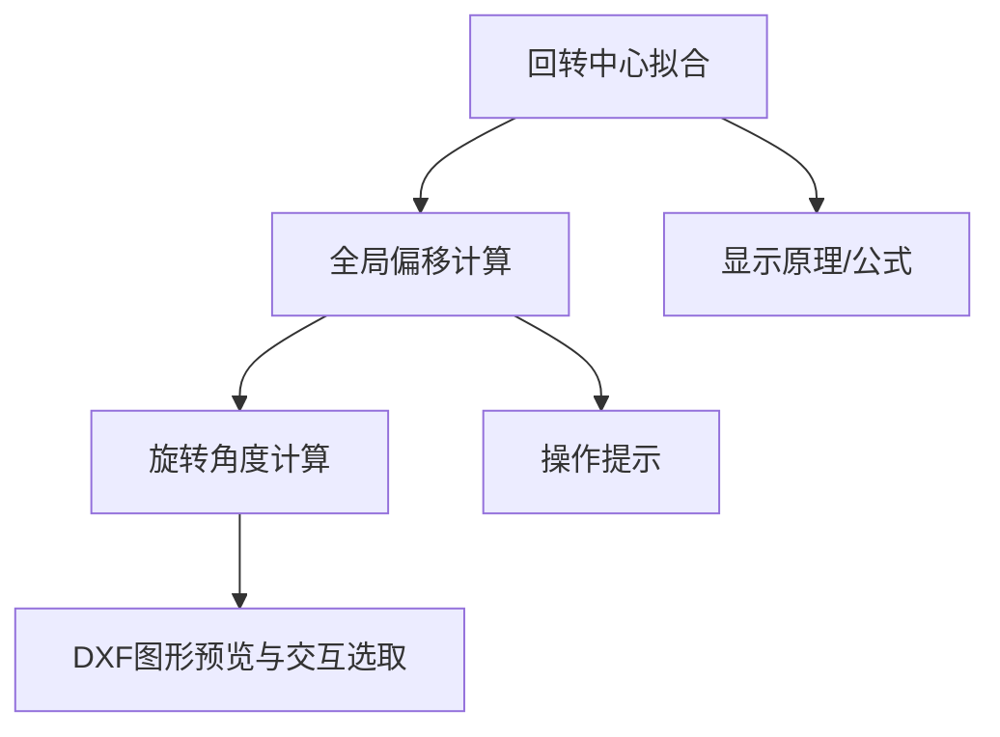
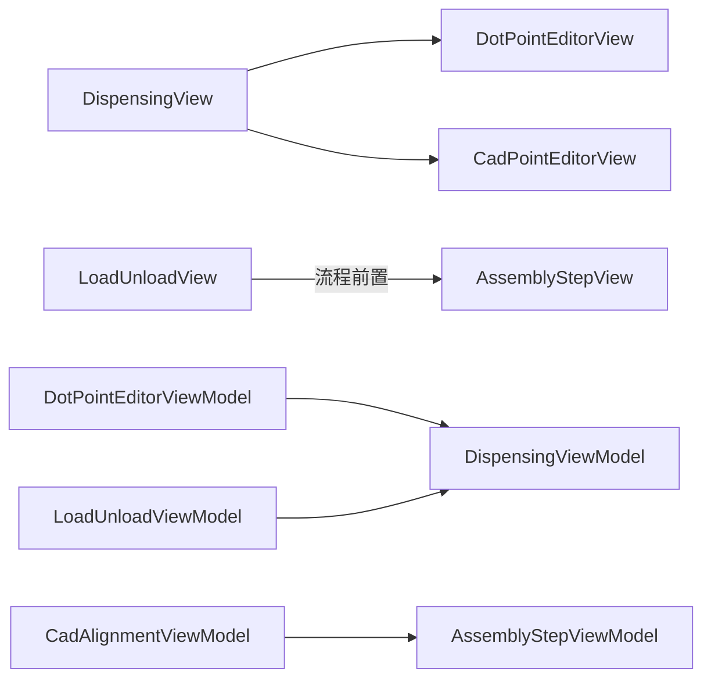

# 业务控件系统

<cite>
**本文引用的文件**
- [AssemblyAxesView.xaml](file://Module/Controls/Assembly/AssemblyAxesView.xaml)
- [AssemblyAxesView.xaml.cs](file://Module/Controls/Assembly/AssemblyAxesView.xaml.cs)
- [AssemblyAxesViewModel.cs](file://Module/Controls/Assembly/AssemblyAxesViewModel.cs)
- [AssemblyStepView.xaml](file://Module/Controls/Assembly/AssemblyStepView.xaml)
- [AssemblyStepView.xaml.cs](file://Module/Controls/Assembly/AssemblyStepView.xaml.cs)
- [AssemblyStepViewModel.cs](file://Module/Controls/Assembly/AssemblyStepViewModel.cs)
- [DispensingView.xaml](file://Module/Controls/Dispense/DispensingView.xaml)
- [DispensingView.xaml.cs](file://Module/Controls/Dispense/DispensingView.xaml.cs)
- [DispensingViewModel.cs](file://Module/Controls/Dispense/DispensingViewModel.cs)
- [DotPointEditorView.xaml](file://Module/Controls/Dispense/DotPointEditorView.xaml)
- [DotPointEditorView.xaml.cs](file://Module/Controls/Dispense/DotPointEditorView.xaml.cs)
- [DotPointEditorViewModel.cs](file://Module/Controls/Dispense/DotPointEditorViewModel.cs)
- [CadPointEditorView.xaml](file://Module/Controls/Cad/CadPointEditorView.xaml)
- [CadPointEditorView.xaml.cs](file://Module/Controls/Cad/CadPointEditorView.xaml.cs)
- [CadPointEditorViewModel.cs](file://Module/Controls/Cad/CadPointEditorViewModel.cs)
- [CadAlignmentView.xaml](file://Module/Controls/Cad/CadAlignmentView.xaml)
- [CadAlignmentView.xaml.cs](file://Module/Controls/Cad/CadAlignmentView.xaml.cs)
- [CadAlignmentViewModel.cs](file://Module/Controls/Cad/CadAlignmentViewModel.cs)
- [LoadUnloadView.xaml](file://Module/Controls/Loading/LoadUnloadView.xaml)
- [LoadUnloadView.xaml.cs](file://Module/Controls/Loading/LoadUnloadView.xaml.cs)
- [LoadUnloadViewModel.cs](file://Module/Controls/Loading/LoadUnloadViewModel.cs)
</cite>

## 目录
1. [简介](#简介)
2. [项目结构](#项目结构)
3. [核心组件](#核心组件)
4. [架构总览](#架构总览)
5. [详细组件分析](#详细组件分析)
6. [依赖关系分析](#依赖关系分析)
7. [性能考虑](#性能考虑)
8. [故障排查指南](#故障排查指南)
9. [结论](#结论)
10. [附录](#附录)

## 简介
本文件面向Module模块中的业务控件系统，聚焦装配、点胶、装载卸载、CAD编辑与对齐等核心业务场景，系统性梳理各控件的功能特性、使用方法、配置参数、数据绑定机制与事件处理模式，并给出自定义开发指南、样式定制方法与性能优化建议。读者可据此快速掌握控件的装配方式、运行流程与扩展路径。

## 项目结构
Module模块采用“按功能域划分”的组织方式，业务控件集中于Module/Controls目录下，分为Assembly（装配）、Dispense（点胶）、Loading（装载卸载）、Cad（CAD编辑与对齐）等子域。每个子域包含XAML视图与对应的ViewModel，遵循Prism的自动绑定约定，通过ViewModelLocator.AutoWireViewModel实现视图与VM的自动关联。

图表来源
- [AssemblyAxesView.xaml:1-119](file://Module/Controls/Assembly/AssemblyAxesView.xaml#L1-L119)
- [AssemblyStepView.xaml:1-444](file://Module/Controls/Assembly/AssemblyStepView.xaml#L1-L444)
- [DispensingView.xaml:1-129](file://Module/Controls/Dispense/DispensingView.xaml#L1-L129)
- [DotPointEditorView.xaml:1-642](file://Module/Controls/Dispense/DotPointEditorView.xaml#L1-L642)
- [LoadUnloadView.xaml:1-689](file://Module/Controls/Loading/LoadUnloadView.xaml#L1-L689)
- [CadPointEditorView.xaml:1-15](file://Module/Controls/Cad/CadPointEditorView.xaml#L1-L15)
- [CadAlignmentView.xaml:1-800](file://Module/Controls/Cad/CadAlignmentView.xaml#L1-L800)

章节来源
- [AssemblyAxesView.xaml:1-119](file://Module/Controls/Assembly/AssemblyAxesView.xaml#L1-L119)
- [AssemblyStepView.xaml:1-444](file://Module/Controls/Assembly/AssemblyStepView.xaml#L1-L444)
- [DispensingView.xaml:1-129](file://Module/Controls/Dispense/DispensingView.xaml#L1-L129)
- [DotPointEditorView.xaml:1-642](file://Module/Controls/Dispense/DotPointEditorView.xaml#L1-L642)
- [LoadUnloadView.xaml:1-689](file://Module/Controls/Loading/LoadUnloadView.xaml#L1-L689)
- [CadPointEditorView.xaml:1-15](file://Module/Controls/Cad/CadPointEditorView.xaml#L1-L15)
- [CadAlignmentView.xaml:1-800](file://Module/Controls/Cad/CadAlignmentView.xaml#L1-L800)

## 核心组件
本节从功能维度概述各业务控件的核心职责与典型配置要点：
- 装配轴控件（AssemblyAxesView）：提供全局速度设置、轴列表（位置/速度/步长/正负方向运动）、全轴回零与急停等操作入口。
- 装配步骤控件（AssemblyStepView）：覆盖“移动到工位—相机定位—对齐检测—执行装配—UV固化—检测输出”全流程，支持失败重试策略、力传感器数据展示与导出。
- 点胶控件（DispensingView + DotPointEditorView）：以多Tab组织“点胶参数—2D线段—视觉引导”，DotPointEditorView内部含步骤指示器与三阶段工作流（工艺参数配置—点位编辑—执行控制）。
- 装载卸载控件（LoadUnloadView）：提供真空/夹爪控制、快速定位、自动流程控制、实时轴状态与流程步骤状态监控。
- CAD编辑与对齐控件（CadPointEditorView + CadAlignmentView）：前者封装为薄包装，后者提供“回转中心—全局偏移—旋转角度”三步法对齐流程，支持DXF导入、图形交互选取与变换摘要展示。

章节来源
- [AssemblyAxesView.xaml:1-119](file://Module/Controls/Assembly/AssemblyAxesView.xaml#L1-L119)
- [AssemblyStepView.xaml:1-444](file://Module/Controls/Assembly/AssemblyStepView.xaml#L1-L444)
- [DispensingView.xaml:1-129](file://Module/Controls/Dispense/DispensingView.xaml#L1-L129)
- [DotPointEditorView.xaml:1-642](file://Module/Controls/Dispense/DotPointEditorView.xaml#L1-L642)
- [LoadUnloadView.xaml:1-689](file://Module/Controls/Loading/LoadUnloadView.xaml#L1-L689)
- [CadPointEditorView.xaml:1-15](file://Module/Controls/Cad/CadPointEditorView.xaml#L1-L15)
- [CadAlignmentView.xaml:1-800](file://Module/Controls/Cad/CadAlignmentView.xaml#L1-L800)

## 架构总览
控件系统遵循MVVM模式，XAML视图通过Prism自动绑定到对应ViewModel，ViewModel负责：
- 数据模型与状态管理（命令、属性、集合）
- 与服务层交互（如设备、任务序列、参数存储）
- 事件与通知（状态变更、进度、错误）

图表来源
- [DotPointEditorView.xaml:1-642](file://Module/Controls/Dispense/DotPointEditorView.xaml#L1-L642)
- [DotPointEditorViewModel.cs](file://Module/Controls/Dispense/DotPointEditorViewModel.cs)
- [DispensingViewModel.cs](file://Module/Controls/Dispense/DispensingViewModel.cs)

## 详细组件分析

### 装配轴控件（AssemblyAxesView）
- 功能特性
  - 全局速度滑块与文本框联动，支持毫米每秒单位显示
  - 轴列表网格：轴名、当前位置、轴速度、步长选项、正负运动按钮
  - 全轴回零与急停按钮，统一操作入口
- 数据绑定与事件
  - 使用ItemsControl绑定Axes集合，DataTemplate渲染轴行
  - 每轴项绑定MoveNegativeCommand/MovePositiveCommand，支持步长选择
  - 全局命令：HomeAllCommand、EmergencyStopCommand
- 配置参数
  - GlobalSpeed：全局速度
  - Axes：轴集合（AxisName、Position、Speed、StepSizeOptions、StepSize）
- 使用建议
  - 在进入JOG前检查急停状态
  - 设置合理的步长与速度上限，避免碰撞

图表来源
- [AssemblyAxesView.xaml:1-119](file://Module/Controls/Assembly/AssemblyAxesView.xaml#L1-L119)
- [AssemblyAxesViewModel.cs](file://Module/Controls/Assembly/AssemblyAxesViewModel.cs)

章节来源
- [AssemblyAxesView.xaml:1-119](file://Module/Controls/Assembly/AssemblyAxesView.xaml#L1-L119)

### 装配步骤控件（AssemblyStepView）
- 功能特性
  - 移动到工位：选择站点并执行移动
  - 相机定位：Top/Side/Bottom CCD特征选择、移动与拍照
  - 对齐流程：Tab/Pin检测、实时补偿显示、失败重试与最大次数
  - 执行装配：目标装配位选择、自动/单步模式、力传感器数据展示与导出
  - UV固化：时间、强度与强度曲线配置、启动/停止
  - 检测输出：统计总数、合格数、失败数、最后测量时间、查看明细与导出
- 数据绑定与事件
  - 多处ComboBox绑定站点/特征/相机/UV头
  - 多个Command绑定到ViewModel：MoveToSiteCommand、各相机移动/拍照、Tab/Pin检测、PlaceStart/Stop、导出力数据、UV固化等
  - DataGrid用于显示强度曲线
- 配置参数
  - StationNumbers、TopCCDFeatures、SideCCDFeatures、BottomCCDFeatures、UVHeads
  - MaxRetries、CureTime、Intensity、IntensityProfile
- 使用建议
  - 先进行机械引导与相机定位，再进行对齐与装配
  - 关注力传感器数据趋势，异常时及时干预

图表来源
- [AssemblyStepView.xaml:1-444](file://Module/Controls/Assembly/AssemblyStepView.xaml#L1-L444)
- [AssemblyStepViewModel.cs](file://Module/Controls/Assembly/AssemblyStepViewModel.cs)

章节来源
- [AssemblyStepView.xaml:1-444](file://Module/Controls/Assembly/AssemblyStepView.xaml#L1-L444)

### 点胶控件（DispensingView + DotPointEditorView）
- 功能特性
  - DispensingView作为容器，内含三个Tab：点胶（类型A）、2D线段（类型B）、视觉引导（类型D）
  - DotPointEditorView内部三步法：工艺参数配置—点位数据编辑—执行控制；包含步骤指示器、状态消息、执行进度与状态栏
- 数据绑定与事件
  - DotPointEditorView中使用多个Visibility绑定控制三阶段切换
  - 参数面板：ProcessParams（运动/出胶/高度）与保存/加载命令
  - 点位编辑：FilteredPoints/DataGrid、全选/反选、应用参数、逐点Teach
  - 执行控制：DryRun/Real Dispense/Stop、进度条与状态文本
- 配置参数
  - ProcessParams：JumpSpeed、SafeHeight、ApproachHeight、CornerDecel、DispenseTime、PostDelay、StartDistance、Pressure、SuctionTime、TeachHeight、HeightCompensation、EffectiveZHeight
  - 点位字段：Group、PointId、Dx/Dy/Dz2/Dz3、Rx/Ry、Dz2Comp/Dz3Comp
- 使用建议
  - 先在参数面板配置并保存，再批量应用到点位
  - 执行前先DryRun确认路径与高度

图表来源
- [DispensingView.xaml:1-129](file://Module/Controls/Dispense/DispensingView.xaml#L1-L129)
- [DotPointEditorView.xaml:1-642](file://Module/Controls/Dispense/DotPointEditorView.xaml#L1-L642)
- [DotPointEditorViewModel.cs](file://Module/Controls/Dispense/DotPointEditorViewModel.cs)

章节来源
- [DispensingView.xaml:1-129](file://Module/Controls/Dispense/DispensingView.xaml#L1-L129)
- [DotPointEditorView.xaml:1-642](file://Module/Controls/Dispense/DotPointEditorView.xaml#L1-L642)

### 装载卸载控件（LoadUnloadView）
- 功能特性
  - 设备状态监控：各轴就绪状态、实时位置
  - 真空控制：载台真空开/关/检查
  - 位置控制：快速定位Pick/Scan/Unload、Home All、装配位选择与移动
  - 夹爪控制：夹爪真空、状态提示、夹取/释放、角度定位、参数编辑
  - 自动流程：自动上料、对中、扫描、3D数据查看、自动卸料
  - 流程步骤状态：步骤列表与当前步骤高亮
- 数据绑定与事件
  - 多个Command绑定：VacuumOn/VacuumOff/VacuumCheck、GoToPick/GoToScan/GoToUnload/HomeAll、Gripper操作、自动流程按钮
  - 状态栏：VacuumStatus、ProcessStatus、GripperStatus
- 配置参数
  - AssySites、SelectedSite、Gripper相关参数
- 使用建议
  - 先检查轴状态与真空状态，再执行自动流程
  - 夹爪动作前后确认安全距离

图表来源
- [LoadUnloadView.xaml:1-689](file://Module/Controls/Loading/LoadUnloadView.xaml#L1-L689)
- [LoadUnloadViewModel.cs](file://Module/Controls/Loading/LoadUnloadViewModel.cs)

章节来源
- [LoadUnloadView.xaml:1-689](file://Module/Controls/Loading/LoadUnloadView.xaml#L1-L689)

### CAD编辑与对齐控件（CadPointEditorView + CadAlignmentView）
- 功能特性
  - CadPointEditorView：薄包装，将Segments/CurrentStep/FilePath传递给内部的CadPointEditorControl
  - CadAlignmentView：三步法对齐
    - 回转中心：四点拟合、旋转中心计算、拟合结果展示
    - 全局偏移：P1机械/CAD坐标输入，计算ΔX/ΔY
    - 旋转角度：DXF导入、基线/目标线段选取、计算Theta与Alpha
- 数据绑定与事件
  - 多个Tab与步骤指示器：Steps、CurrentStep双向绑定
  - DataGrid用于拟合点、DXF点集与变换摘要
  - 多个Command：FitRotationCenter、ComputeGlobalOffset、ComputeCadRotationAngle、ShowPrinciple、ImportDxf等
- 配置参数
  - FitPoints、P1Mx/P1My/P1Cx/P1Cy、Baseline/Targetline、CadFilePath、CanvasDisplayEntities
- 使用建议
  - 先完成回转中心拟合，再进行全局偏移与旋转角度计算
  - DXF导入后优先智能推荐线段，再手动微调

图表来源
- [CadPointEditorView.xaml:1-15](file://Module/Controls/Cad/CadPointEditorView.xaml#L1-L15)
- [CadAlignmentView.xaml:1-800](file://Module/Controls/Cad/CadAlignmentView.xaml#L1-L800)
- [CadAlignmentViewModel.cs](file://Module/Controls/Cad/CadAlignmentViewModel.cs)

章节来源
- [CadPointEditorView.xaml:1-15](file://Module/Controls/Cad/CadPointEditorView.xaml#L1-L15)
- [CadAlignmentView.xaml:1-800](file://Module/Controls/Cad/CadAlignmentView.xaml#L1-L800)

## 依赖关系分析
- 视图与ViewModel
  - 各XAML视图均启用AutoWireViewModel，通过命名约定自动绑定同名ViewModel
  - DotPointEditorView/CadAlignmentView等复杂视图内部进一步组合子控件或子视图
- 控件间耦合
  - DispensingView内嵌DotPointEditorView与CadPointEditorView，形成“容器-子控件”关系
  - LoadUnloadView与装配/点胶/对齐等流程存在业务上的前后顺序依赖
- 数据与服务
  - ViewModel通过服务接口访问设备状态、执行任务、读写参数与配方
  - 强依赖参数存储与任务序列服务，确保跨控件的状态一致性

图表来源
- [DispensingView.xaml:1-129](file://Module/Controls/Dispense/DispensingView.xaml#L1-L129)
- [DotPointEditorView.xaml:1-642](file://Module/Controls/Dispense/DotPointEditorView.xaml#L1-L642)
- [CadPointEditorView.xaml:1-15](file://Module/Controls/Cad/CadPointEditorView.xaml#L1-L15)
- [LoadUnloadView.xaml:1-689](file://Module/Controls/Loading/LoadUnloadView.xaml#L1-L689)
- [AssemblyStepView.xaml:1-444](file://Module/Controls/Assembly/AssemblyStepView.xaml#L1-L444)

章节来源
- [DispensingView.xaml:1-129](file://Module/Controls/Dispense/DispensingView.xaml#L1-L129)
- [LoadUnloadView.xaml:1-689](file://Module/Controls/Loading/LoadUnloadView.xaml#L1-L689)
- [AssemblyStepView.xaml:1-444](file://Module/Controls/Assembly/AssemblyStepView.xaml#L1-L444)

## 性能考虑
- 列表与数据网格
  - DotPointEditorView的DataGrid开启虚拟化（Row/Column Virtualization），提升大数据量下的滚动与渲染性能
- 动画与状态
  - DotPointEditorView在执行态使用旋转动画指示器，注意在低性能设备上的帧率影响
- 图形绘制
  - CadAlignmentView的HalconCanvasControl在DXF导入后进行实体渲染，建议在导入完成后延迟初始化或异步渲染
- 命令与状态更新
  - ViewModel应避免频繁触发大范围属性变更，建议合并UI更新批次，减少主线程压力

## 故障排查指南
- 装配轴/点胶执行无响应
  - 检查急停是否复位、轴状态是否就绪
  - 查看DotPointEditorView的状态栏与错误标记，确认IsError状态
- 真空/夹爪异常
  - LoadUnloadView中真空与夹爪状态颜色与文本需一致，若不一致，检查对应布尔转换器
- 对齐失败
  - CadAlignmentView中拟合/偏移/角度计算需满足前提条件（DXF已导入、点位已选取），查看状态消息与提示
- 导出与报表
  - 装配步骤中的CSV导出与力数据导出按钮需确认当前站点与数据可用性

章节来源
- [DotPointEditorView.xaml:1-642](file://Module/Controls/Dispense/DotPointEditorView.xaml#L1-L642)
- [LoadUnloadView.xaml:1-689](file://Module/Controls/Loading/LoadUnloadView.xaml#L1-L689)
- [CadAlignmentView.xaml:1-800](file://Module/Controls/Cad/CadAlignmentView.xaml#L1-L800)
- [AssemblyStepView.xaml:1-444](file://Module/Controls/Assembly/AssemblyStepView.xaml#L1-L444)

## 结论
业务控件系统以清晰的功能域划分与MVVM架构实现了高内聚、低耦合的模块化设计。通过统一的命令驱动与数据绑定，控件能够高效地串联设备状态、参数配置与执行流程。建议在二次开发中遵循现有命名与绑定规范，充分利用服务层能力，确保扩展性与稳定性。

## 附录
- 自定义开发指南
  - 新增控件：创建XAML视图与ViewModel，启用AutoWireViewModel，按需引入Converters与Styles
  - 命令设计：ViewModel公开ICommand属性，避免直接在XAML中编写复杂逻辑
  - 数据绑定：优先使用OneWay/TwoWay绑定，必要时使用UpdateSourceTrigger=LostFocus降低抖动
- 样式定制方法
  - 使用MaterialDesign主题资源与自定义Brush/Style，保持全局风格一致
  - 通过Converter实现状态到颜色/可见性的映射，避免在代码背后设置样式
- 最佳实践
  - 将耗时操作放入后台线程，避免阻塞UI
  - 对关键流程增加确认对话与错误提示，提升可操作性
  - 对复杂视图拆分子控件，明确职责边界，便于测试与维护