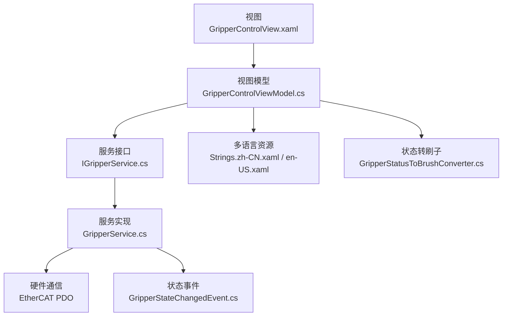
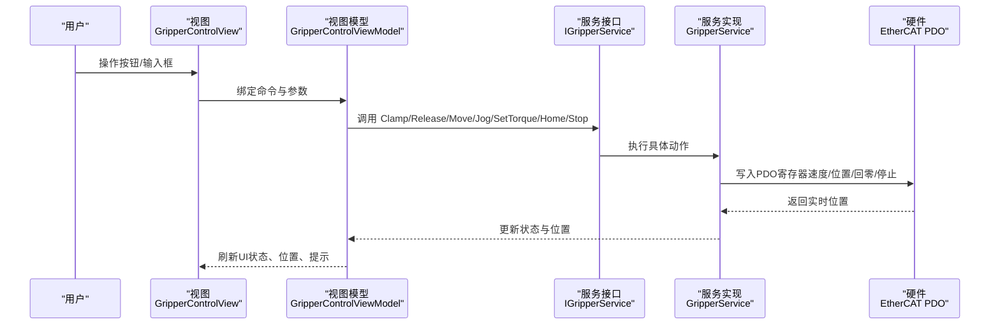
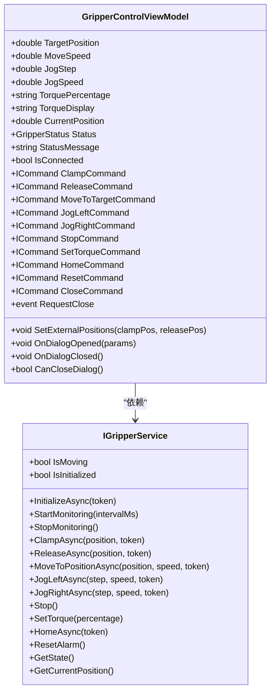
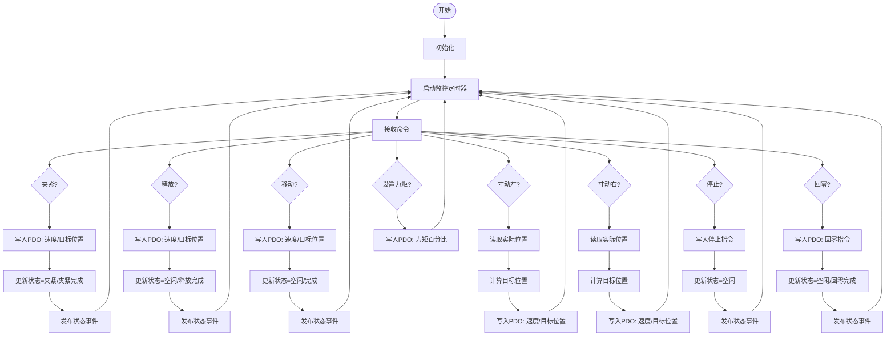
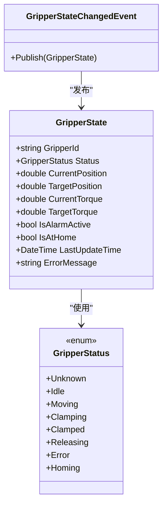
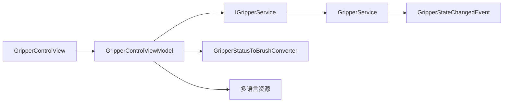

# 夹爪控件系统

<cite>
**本文引用的文件**
- [GripperControlView.xaml](file://Module/Controls/Grippers/GripperControlView.xaml)
- [GripperControlView.xaml.cs](file://Module/Controls/Grippers/GripperControlView.xaml.cs)
- [GripperControlViewModel.cs](file://Module/Controls/Grippers/GripperControlViewModel.cs)
- [IGripperService.cs](file://MotionControl/Interfaces/IGripperService.cs)
- [GripperService.cs](file://MotionControl/Services/GripperService.cs)
- [GripperState.cs](file://MotionControl/Models/GripperState.cs)
- [GripperStateChangedEvent.cs](file://MotionControl/Events/GripperStateChangedEvent.cs)
- [GripperStatusToBrushConverter.cs](file://MotionControl/Converters/GripperStatusToBrushConverter.cs)
- [Strings.zh-CN.xaml](file://MainApp/Languages/Strings.zh-CN.xaml)
- [Strings.en-US.xaml](file://MainApp/Languages/Strings.en-US.xaml)
- [PickDetailView.xaml](file://Module/Controls/StepDetails/PickDetailView.xaml)
- [PickDetailViewModel.cs](file://Module/Controls/StepDetails/PickDetailViewModel.cs)
</cite>

## 目录
1. [简介](#简介)
2. [项目结构](#项目结构)
3. [核心组件](#核心组件)
4. [架构总览](#架构总览)
5. [详细组件分析](#详细组件分析)
6. [依赖关系分析](#依赖关系分析)
7. [性能考量](#性能考量)
8. [故障排查指南](#故障排查指南)
9. [结论](#结论)
10. [附录](#附录)

## 简介
本文件为夹爪控件系统的完整技术文档，围绕夹爪控制主界面（GripperControlView）及其背后的服务层进行深入剖析。内容涵盖：
- 夹爪开合控制、位置移动、寸动操作、力矩调节、回零与停止等核心功能
- 实时状态监控、状态指示与颜色映射
- 参数配置入口、安全检查与错误处理机制
- 使用规范、维护建议与异常处理流程
- 不同夹爪类型的控制示例与操作技巧

## 项目结构
夹爪控件系统由三层组成：
- 视图层（View）：GripperControlView 提供用户交互界面
- 视图模型层（ViewModel）：GripperControlViewModel 负责业务逻辑与UI绑定
- 服务层（Service）：GripperService 封装夹爪硬件通信与状态管理

**图表来源**
- [GripperControlView.xaml:1-258](file://Module/Controls/Grippers/GripperControlView.xaml#L1-L258)
- [GripperControlViewModel.cs:1-397](file://Module/Controls/Grippers/GripperControlViewModel.cs#L1-L397)
- [IGripperService.cs:1-46](file://MotionControl/Interfaces/IGripperService.cs#L1-L46)
- [GripperService.cs:1-341](file://MotionControl/Services/GripperService.cs#L1-L341)
- [GripperStateChangedEvent.cs:1-8](file://MotionControl/Events/GripperStateChangedEvent.cs#L1-L8)
- [GripperStatusToBrushConverter.cs:1-37](file://MotionControl/Converters/GripperStatusToBrushConverter.cs#L1-L37)
- [Strings.zh-CN.xaml:2637-2674](file://MainApp/Languages/Strings.zh-CN.xaml#L2637-L2674)
- [Strings.en-US.xaml:2617-2631](file://MainApp/Languages/Strings.en-US.xaml#L2617-L2631)

**章节来源**
- [GripperControlView.xaml:1-258](file://Module/Controls/Grippers/GripperControlView.xaml#L1-L258)
- [GripperControlViewModel.cs:1-397](file://Module/Controls/Grippers/GripperControlViewModel.cs#L1-L397)

## 核心组件
- 夹爪控制视图（GripperControlView）：提供“目标位置+移动”、“寸动（夹/停/开）”、“力矩设置”、“回零/复位”、“快速夹紧/释放”以及“实时位置显示”等交互控件。
- 夹爪控制视图模型（GripperControlViewModel）：封装命令、参数绑定、定时刷新UI、安全检查、错误对话框与日志记录。
- 夹爪服务接口（IGripperService）：定义夹爪生命周期、运动控制、力矩设置、系统操作与状态查询等契约。
- 夹爪服务实现（GripperService）：基于EtherCAT PDO与驱动接口（LTDMC）与硬件通信，维护内部状态并发布状态事件。
- 状态模型（GripperState）：描述夹爪当前状态、位置、目标位置、扭矩、报警、回零状态与最后更新时间等。
- 状态事件（GripperStateChangedEvent）：通过事件总线向订阅者广播状态变化。
- 状态到画刷转换器（GripperStatusToBrushConverter）：将状态枚举映射为视觉颜色。
- 多语言资源（Strings.zh-CN.xaml / en-US.xaml）：提供界面文案与提示语。

**章节来源**
- [GripperControlView.xaml:1-258](file://Module/Controls/Grippers/GripperControlView.xaml#L1-L258)
- [GripperControlViewModel.cs:1-397](file://Module/Controls/Grippers/GripperControlViewModel.cs#L1-L397)
- [IGripperService.cs:1-46](file://MotionControl/Interfaces/IGripperService.cs#L1-L46)
- [GripperService.cs:1-341](file://MotionControl/Services/GripperService.cs#L1-L341)
- [GripperState.cs:1-40](file://MotionControl/Models/GripperState.cs#L1-L40)
- [GripperStateChangedEvent.cs:1-8](file://MotionControl/Events/GripperStateChangedEvent.cs#L1-L8)
- [GripperStatusToBrushConverter.cs:1-37](file://MotionControl/Converters/GripperStatusToBrushConverter.cs#L1-L37)
- [Strings.zh-CN.xaml:2637-2674](file://MainApp/Languages/Strings.zh-CN.xaml#L2637-L2674)
- [Strings.en-US.xaml:2617-2631](file://MainApp/Languages/Strings.en-US.xaml#L2617-L2631)

## 架构总览
下图展示从用户操作到硬件执行的端到端流程，以及状态回传路径：

**图表来源**
- [GripperControlView.xaml:1-258](file://Module/Controls/Grippers/GripperControlView.xaml#L1-L258)
- [GripperControlViewModel.cs:1-397](file://Module/Controls/Grippers/GripperControlViewModel.cs#L1-L397)
- [IGripperService.cs:1-46](file://MotionControl/Interfaces/IGripperService.cs#L1-L46)
- [GripperService.cs:1-341](file://MotionControl/Services/GripperService.cs#L1-L341)

## 详细组件分析

### 视图层：GripperControlView
- 标题栏与关闭按钮：提供标题与关闭对话框能力
- 状态栏：显示连接状态与状态提示
- 位置与寸动区域：
  - 目标位置输入与移动按钮
  - 寸动按钮（夹紧/停止/释放）
  - 寸动步长与寸动速度
- 力矩设置区域：
  - 力矩百分比输入与确认
  - 实时显示换算后的力矩值
  - 回零与复位按钮
- 快速操作区域：
  - 夹紧与释放按钮
- 实时状态区域：
  - 当前位置显示与刷新频率标注

该视图通过数据绑定与命令与视图模型交互，所有文本均来自多语言资源文件，支持中英文切换。

**章节来源**
- [GripperControlView.xaml:1-258](file://Module/Controls/Grippers/GripperControlView.xaml#L1-L258)
- [Strings.zh-CN.xaml:2637-2674](file://MainApp/Languages/Strings.zh-CN.xaml#L2637-L2674)
- [Strings.en-US.xaml:2617-2631](file://MainApp/Languages/Strings.en-US.xaml#L2617-L2631)

### 视图模型层：GripperControlViewModel
- 参数与属性
  - 目标位置、移动速度、寸动步长、寸动速度、力矩百分比、当前位置、状态、状态消息、连接状态
  - 状态到画刷的颜色映射
- 命令
  - 夹紧、释放、移动到目标、寸动左（夹）、寸动右（开）、停止、设置力矩、回零、复位、关闭
- 定时刷新
  - 启动定时器以固定周期（默认200ms）读取服务状态并更新UI
  - 初始化时启动监控，关闭时停止监控
- 安全检查与错误处理
  - 执行前检查服务是否已初始化
  - 捕获异常并弹出通知对话框，同时记录日志
- 外部参数支持
  - 支持外部调用传入夹紧/释放位置参数，优先使用外部参数

**图表来源**
- [GripperControlViewModel.cs:1-397](file://Module/Controls/Grippers/GripperControlViewModel.cs#L1-L397)
- [IGripperService.cs:1-46](file://MotionControl/Interfaces/IGripperService.cs#L1-L46)

**章节来源**
- [GripperControlViewModel.cs:1-397](file://Module/Controls/Grippers/GripperControlViewModel.cs#L1-L397)

### 服务层：GripperService
- 生命周期
  - 初始化：读取硬件状态，标记初始化完成
  - 监控：定时读取实时位置并发布状态事件
  - 停止：停止监控
- 快速操作
  - 夹紧/释放：设置目标位置与速度，更新状态，记录日志
- 运动控制
  - 移动到目标位置：设置速度与目标位置，完成后进入空闲
  - 寸动：读取当前实际位置，计算目标位置并下发
  - 停止：立即停止
- 力矩控制
  - 设置力矩百分比（0-100），写入PDO寄存器
- 系统操作
  - 回零：触发回零指令，完成后置空闲并更新当前位置
  - 报警复位：预留接口（当前为空）
- 状态查询
  - 获取状态对象与当前实时位置
- 错误处理
  - 捕获异常并设置错误状态，抛出可恢复异常以便上层处理

**图表来源**
- [GripperService.cs:1-341](file://MotionControl/Services/GripperService.cs#L1-L341)

**章节来源**
- [GripperService.cs:1-341](file://MotionControl/Services/GripperService.cs#L1-L341)

### 状态模型与事件
- 状态枚举（GripperStatus）：未知、空闲、移动中、夹紧中、已夹紧、释放中、错误、回零中
- 状态对象（GripperState）：包含ID、状态、当前位置、目标位置、当前/目标扭矩、报警、回零、最后更新时间与错误信息
- 状态事件（GripperStateChangedEvent）：通过事件总线发布状态对象，供订阅者更新UI或执行后续动作

**图表来源**
- [GripperState.cs:1-40](file://MotionControl/Models/GripperState.cs#L1-L40)
- [GripperStateChangedEvent.cs:1-8](file://MotionControl/Events/GripperStateChangedEvent.cs#L1-L8)

**章节来源**
- [GripperState.cs:1-40](file://MotionControl/Models/GripperState.cs#L1-L40)
- [GripperStateChangedEvent.cs:1-8](file://MotionControl/Events/GripperStateChangedEvent.cs#L1-L8)

### 多语言与状态可视化
- 多语言资源：界面文本、状态提示、对话框标题与消息均来自多语言资源文件，支持中英文
- 状态到画刷转换器：根据状态返回对应颜色，用于状态栏指示灯与主题色

**章节来源**
- [Strings.zh-CN.xaml:2637-2674](file://MainApp/Languages/Strings.zh-CN.xaml#L2637-L2674)
- [Strings.en-US.xaml:2617-2631](file://MainApp/Languages/Strings.en-US.xaml#L2617-L2631)
- [GripperStatusToBrushConverter.cs:1-37](file://MotionControl/Converters/GripperStatusToBrushConverter.cs#L1-L37)

### 与其他模块的集成
- PickDetailView 配置夹爪参数（如张口、夹紧位置、释放位置等），可在执行Pick流程时直接调用夹爪快速操作
- 夹爪控件作为独立对话框打开，内部启动监控并在关闭时停止监控，避免资源泄漏

**章节来源**
- [PickDetailView.xaml:27-53](file://Module/Controls/StepDetails/PickDetailView.xaml#L27-L53)
- [PickDetailViewModel.cs:63-97](file://Module/Controls/StepDetails/PickDetailViewModel.cs#L63-L97)
- [GripperControlViewModel.cs:352-387](file://Module/Controls/Grippers/GripperControlViewModel.cs#L352-L387)

## 依赖关系分析
- 视图依赖视图模型（数据绑定与命令）
- 视图模型依赖服务接口（解耦硬件细节）
- 服务实现依赖硬件通信（EtherCAT PDO）与事件总线
- 状态事件被订阅以实现跨模块状态同步
- 状态到画刷转换器用于UI颜色映射

**图表来源**
- [GripperControlView.xaml:1-258](file://Module/Controls/Grippers/GripperControlView.xaml#L1-L258)
- [GripperControlViewModel.cs:1-397](file://Module/Controls/Grippers/GripperControlViewModel.cs#L1-L397)
- [IGripperService.cs:1-46](file://MotionControl/Interfaces/IGripperService.cs#L1-L46)
- [GripperService.cs:1-341](file://MotionControl/Services/GripperService.cs#L1-L341)
- [GripperStateChangedEvent.cs:1-8](file://MotionControl/Events/GripperStateChangedEvent.cs#L1-L8)
- [GripperStatusToBrushConverter.cs:1-37](file://MotionControl/Converters/GripperStatusToBrushConverter.cs#L1-L37)

**章节来源**
- [GripperControlViewModel.cs:1-397](file://Module/Controls/Grippers/GripperControlViewModel.cs#L1-L397)
- [GripperService.cs:1-341](file://MotionControl/Services/GripperService.cs#L1-L341)

## 性能考量
- UI刷新频率：默认200ms，平衡了实时性与CPU占用；可根据设备性能调整
- 监控轮询：服务层定时读取硬件状态，异常时仅记录警告日志，避免阻塞主线程
- 命令执行：所有动作均在异步任务中执行，防止UI冻结
- 事件发布：状态变化通过事件总线发布，订阅方按需更新，降低耦合

[本节为通用性能讨论，不直接分析具体文件]

## 故障排查指南
- 未初始化错误
  - 现象：执行任何操作前弹出“服务未初始化”
  - 处理：确保先调用初始化流程后再进行操作
- 操作失败
  - 现象：弹出“操作失败”对话框并记录错误日志
  - 处理：查看日志定位具体异常原因，必要时重试或检查硬件连接
- 力矩设置范围错误
  - 现象：输入非数字或超出0-100范围时弹出输入/参数错误提示
  - 处理：修正输入范围后重试
- 回零失败
  - 现象：回零过程中出现错误状态
  - 处理：检查夹爪机械结构与传感器状态，重试回零
- 停止无效
  - 现象：停止命令未生效
  - 处理：确认当前状态允许停止，重新发送停止指令

**章节来源**
- [GripperControlViewModel.cs:306-331](file://Module/Controls/Grippers/GripperControlViewModel.cs#L306-L331)
- [GripperService.cs:250-279](file://MotionControl/Services/GripperService.cs#L250-L279)

## 结论
夹爪控件系统采用MVVM架构，通过视图模型与服务接口解耦UI与硬件，具备完善的参数配置、安全检查、状态监控与错误处理机制。其核心优势在于：
- 可靠的状态同步与事件发布
- 清晰的命令式操作与实时反馈
- 易于扩展的多语言与主题支持
- 适中的UI刷新频率与健壮的异常处理

## 附录

### 操作流程示例
- 快速夹紧/释放
  - 在“快速操作”区域点击“夹紧/释放”，系统自动使用外部传入或目标位置参数
- 移动到目标位置
  - 输入目标位置与移动速度，点击“移动”按钮
- 寸动操作
  - 设置寸动步长与寸动速度，点击“夹”或“开”进行微调
- 力矩设置
  - 输入0-100之间的百分比，点击“设置”，系统会显示换算后的力矩值
- 回零与停止
  - 点击“回零”执行回零动作；点击“停止”立即停止当前动作

**章节来源**
- [GripperControlView.xaml:62-228](file://Module/Controls/Grippers/GripperControlView.xaml#L62-L228)
- [GripperControlViewModel.cs:166-281](file://Module/Controls/Grippers/GripperControlViewModel.cs#L166-L281)

### 使用规范与维护建议
- 使用规范
  - 操作前确保夹爪服务已初始化
  - 设置合理的力矩与速度，避免过载
  - 寸动操作时注意周围环境，防止碰撞
- 维护建议
  - 定期检查硬件连接与传感器状态
  - 监控日志，及时发现异常
  - 回零前确认工作区安全
- 异常处理
  - 出现错误时先停止操作，查看状态提示与日志
  - 必要时执行回零或复位（若适用）

**章节来源**
- [GripperService.cs:39-47](file://MotionControl/Services/GripperService.cs#L39-L47)
- [GripperControlViewModel.cs:306-331](file://Module/Controls/Grippers/GripperControlViewModel.cs#L306-L331)