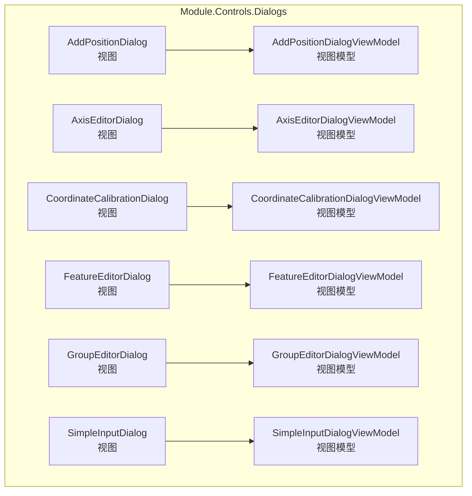
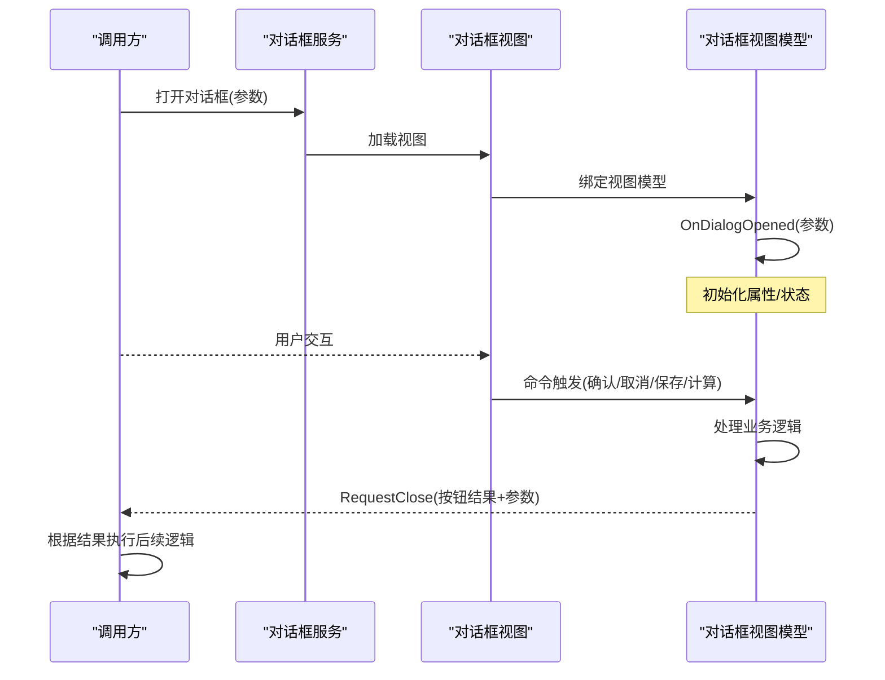
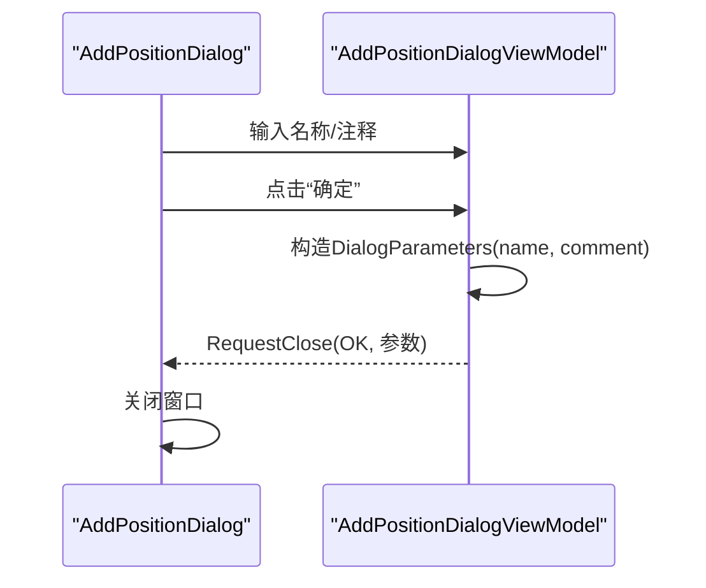
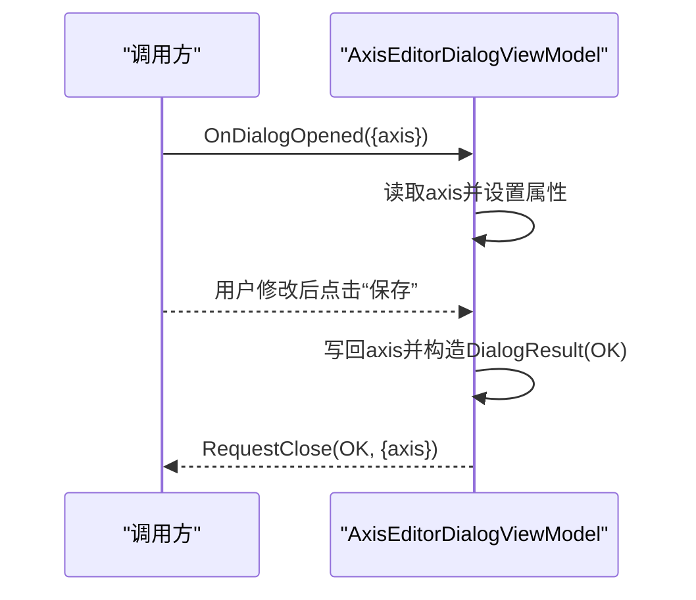
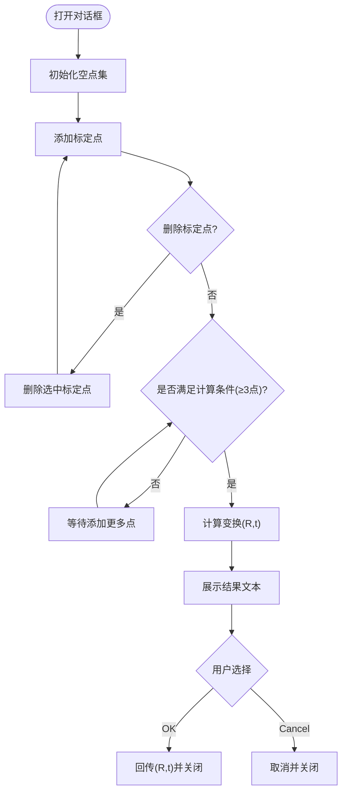
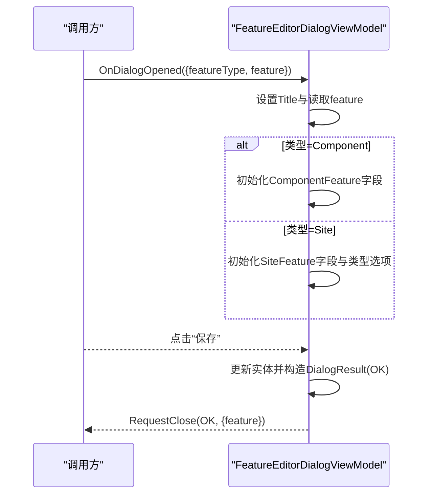
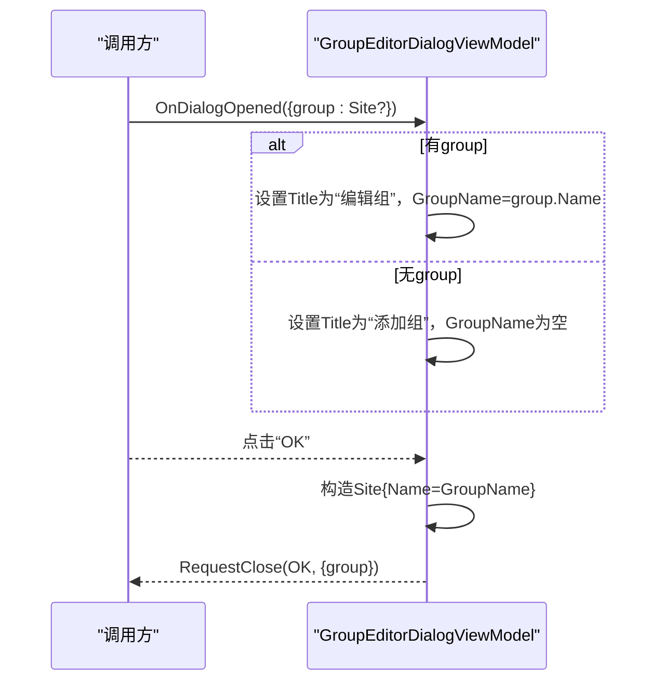
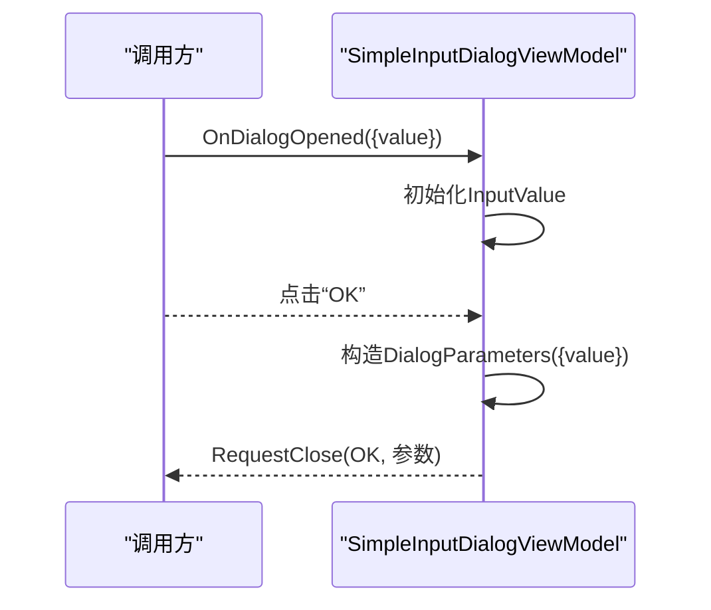
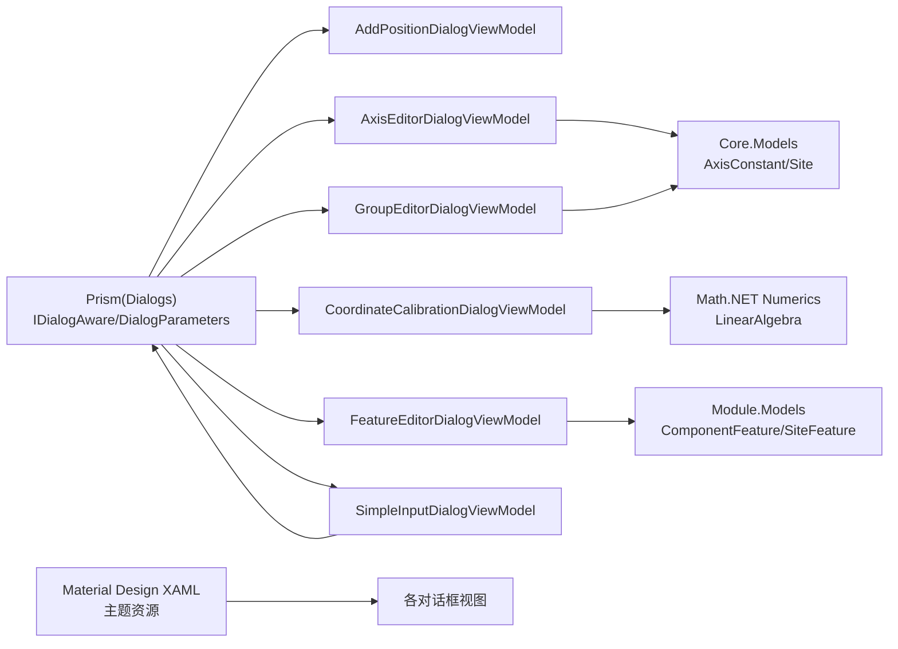

# 对话框控件系统

<cite>
**本文档引用的文件**
- [AddPositionDialog.xaml](file://Module/Controls/Dialogs/AddPositionDialog.xaml)
- [AddPositionDialog.xaml.cs](file://Module/Controls/Dialogs/AddPositionDialog.xaml.cs)
- [AddPositionDialogViewModel.cs](file://Module/Controls/Dialogs/AddPositionDialogViewModel.cs)
- [AxisEditorDialog.xaml](file://Module/Controls/Dialogs/AxisEditorDialog.xaml)
- [AxisEditorDialog.xaml.cs](file://Module/Controls/Dialogs/AxisEditorDialog.xaml.cs)
- [AxisEditorDialogViewModel.cs](file://Module/Controls/Dialogs/AxisEditorDialogViewModel.cs)
- [CoordinateCalibrationDialog.xaml](file://Module/Controls/Dialogs/CoordinateCalibrationDialog.xaml)
- [CoordinateCalibrationDialog.xaml.cs](file://Module/Controls/Dialogs/CoordinateCalibrationDialog.xaml.cs)
- [CoordinateCalibrationDialogViewModel.cs](file://Module/Controls/Dialogs/CoordinateCalibrationDialogViewModel.cs)
- [FeatureEditorDialog.xaml](file://Module/Controls/Dialogs/FeatureEditorDialog.xaml)
- [FeatureEditorDialog.xaml.cs](file://Module/Controls/Dialogs/FeatureEditorDialog.xaml.cs)
- [FeatureEditorDialogViewModel.cs](file://Module/Controls/Dialogs/FeatureEditorDialogViewModel.cs)
- [GroupEditorDialog.xaml](file://Module/Controls/Dialogs/GroupEditorDialog.xaml)
- [GroupEditorDialog.xaml.cs](file://Module/Controls/Dialogs/GroupEditorDialog.xaml.cs)
- [GroupEditorDialogViewModel.cs](file://Module/Controls/Dialogs/GroupEditorDialogViewModel.cs)
- [SimpleInputDialog.xaml](file://Module/Controls/Dialogs/SimpleInputDialog.xaml)
- [SimpleInputDialog.xaml.cs](file://Module/Controls/Dialogs/SimpleInputDialog.xaml.cs)
- [SimpleInputDialogViewModel.cs](file://Module/Controls/Dialogs/SimpleInputDialogViewModel.cs)
</cite>

## 目录
1. [简介](#简介)
2. [项目结构](#项目结构)
3. [核心组件](#核心组件)
4. [架构总览](#架构总览)
5. [详细组件分析](#详细组件分析)
6. [依赖关系分析](#依赖关系分析)
7. [性能考虑](#性能考虑)
8. [故障排除指南](#故障排除指南)
9. [结论](#结论)
10. [附录](#附录)

## 简介
本文件为对话框控件系统的综合技术文档，覆盖位置添加对话框（AddPositionDialog）、轴编辑对话框（AxisEditorDialog）、坐标标定对话框（CoordinateCalibrationDialog）、特征编辑对话框（FeatureEditorDialog）、组编辑对话框（GroupEditorDialog）、简单输入对话框（SimpleInputDialog）等通用对话框控件的实现与使用说明。文档重点解析以下方面：
- 数据绑定与参数传递机制
- 验证与确认/取消逻辑
- 错误处理与边界条件
- 模态管理与焦点控制
- 键盘快捷键支持与用户体验优化
- 自定义开发指南、样式定制方法与交互设计规范
- 常见使用场景与最佳实践

## 项目结构
对话框控件位于 Module 控制器层的 Dialogs 子目录中，采用“视图 + 视图模型”的 Prism MVVM 架构组织，所有对话框均实现 Prism 的 IDialogAware 接口，通过统一的服务进行打开与结果回调。

**图表来源**
- [AddPositionDialog.xaml:1-54](file://Module/Controls/Dialogs/AddPositionDialog.xaml#L1-L54)
- [AxisEditorDialog.xaml:1-44](file://Module/Controls/Dialogs/AxisEditorDialog.xaml#L1-L44)
- [CoordinateCalibrationDialog.xaml:1-62](file://Module/Controls/Dialogs/CoordinateCalibrationDialog.xaml#L1-L62)
- [FeatureEditorDialog.xaml:1-85](file://Module/Controls/Dialogs/FeatureEditorDialog.xaml#L1-L85)
- [GroupEditorDialog.xaml:1-38](file://Module/Controls/Dialogs/GroupEditorDialog.xaml#L1-L38)
- [SimpleInputDialog.xaml:1-16](file://Module/Controls/Dialogs/SimpleInputDialog.xaml#L1-L16)

**章节来源**
- [AddPositionDialog.xaml:1-54](file://Module/Controls/Dialogs/AddPositionDialog.xaml#L1-L54)
- [AxisEditorDialog.xaml:1-44](file://Module/Controls/Dialogs/AxisEditorDialog.xaml#L1-L44)
- [CoordinateCalibrationDialog.xaml:1-62](file://Module/Controls/Dialogs/CoordinateCalibrationDialog.xaml#L1-L62)
- [FeatureEditorDialog.xaml:1-85](file://Module/Controls/Dialogs/FeatureEditorDialog.xaml#L1-L85)
- [GroupEditorDialog.xaml:1-38](file://Module/Controls/Dialogs/GroupEditorDialog.xaml#L1-L38)
- [SimpleInputDialog.xaml:1-16](file://Module/Controls/Dialogs/SimpleInputDialog.xaml#L1-L16)

## 核心组件
- 统一接口：所有对话框视图模型实现 Prism 的 IDialogAware 接口，提供标题、参数打开、关闭判断、关闭回调等标准能力。
- 参数传递：通过 Prism 的 DialogParameters 在打开时传入初始数据，在确认时回传结果数据。
- 命令体系：使用 Prism.Commands.DelegateCommand 实现确认、取消、保存、计算等命令，确保 UI 事件与业务逻辑解耦。
- 数据绑定：WPF 绑定到视图模型属性，支持双向更新与即时验证提示。
- 样式与主题：统一使用 Material Design XAML 主题资源，保证视觉一致性与可定制性。

**章节来源**
- [AddPositionDialogViewModel.cs:10-54](file://Module/Controls/Dialogs/AddPositionDialogViewModel.cs#L10-L54)
- [AxisEditorDialogViewModel.cs:10-57](file://Module/Controls/Dialogs/AxisEditorDialogViewModel.cs#L10-L57)
- [CoordinateCalibrationDialogViewModel.cs:30-112](file://Module/Controls/Dialogs/CoordinateCalibrationDialogViewModel.cs#L30-L112)
- [FeatureEditorDialogViewModel.cs:11-148](file://Module/Controls/Dialogs/FeatureEditorDialogViewModel.cs#L11-L148)
- [GroupEditorDialogViewModel.cs:10-69](file://Module/Controls/Dialogs/GroupEditorDialogViewModel.cs#L10-L69)
- [SimpleInputDialogViewModel.cs:12-40](file://Module/Controls/Dialogs/SimpleInputDialogViewModel.cs#L12-L40)

## 架构总览
对话框系统遵循 Prism Dialog 服务的调用流程：调用方通过对话框服务打开指定对话框，传入参数；对话框在视图模型中接收参数并初始化界面；用户操作触发命令，命令封装结果并通过 RequestClose 回传给调用方；调用方根据 ButtonResult 和参数执行后续逻辑。

**图表来源**
- [AddPositionDialogViewModel.cs:34-46](file://Module/Controls/Dialogs/AddPositionDialogViewModel.cs#L34-L46)
- [AxisEditorDialogViewModel.cs:34-55](file://Module/Controls/Dialogs/AxisEditorDialogViewModel.cs#L34-L55)
- [CoordinateCalibrationDialogViewModel.cs:64-106](file://Module/Controls/Dialogs/CoordinateCalibrationDialogViewModel.cs#L64-L106)
- [FeatureEditorDialogViewModel.cs:100-141](file://Module/Controls/Dialogs/FeatureEditorDialogViewModel.cs#L100-L141)
- [GroupEditorDialogViewModel.cs:41-62](file://Module/Controls/Dialogs/GroupEditorDialogViewModel.cs#L41-L62)
- [SimpleInputDialogViewModel.cs:25-31](file://Module/Controls/Dialogs/SimpleInputDialogViewModel.cs#L25-L31)

## 详细组件分析

### 位置添加对话框（AddPositionDialog）
- 功能概述：用于添加新的位置，包含名称与注释输入，提供确认与取消按钮。
- 数据绑定：名称与注释字段双向绑定至视图模型属性。
- 命令逻辑：确认命令收集名称与注释，封装为 DialogParameters 并以 OK 结果回传；取消命令以 Cancel 结果回传。
- 可扩展点：可增加输入验证、必填校验、长度限制等。

**图表来源**
- [AddPositionDialog.xaml:29-38](file://Module/Controls/Dialogs/AddPositionDialog.xaml#L29-L38)
- [AddPositionDialogViewModel.cs:34-46](file://Module/Controls/Dialogs/AddPositionDialogViewModel.cs#L34-L46)

**章节来源**
- [AddPositionDialog.xaml:1-54](file://Module/Controls/Dialogs/AddPositionDialog.xaml#L1-L54)
- [AddPositionDialog.xaml.cs:16-28](file://Module/Controls/Dialogs/AddPositionDialog.xaml.cs#L16-L28)
- [AddPositionDialogViewModel.cs:10-54](file://Module/Controls/Dialogs/AddPositionDialogViewModel.cs#L10-L54)

### 轴编辑对话框（AxisEditorDialog）
- 功能概述：编辑轴的分组、名称与描述信息，支持保存与取消。
- 数据绑定：Group、Name、Description 字段绑定至视图模型属性。
- 打开参数：从参数中读取 AxisConstant 对象，初始化表单字段。
- 保存逻辑：将修改后的值写回 AxisConstant，并通过参数回传。

**图表来源**
- [AxisEditorDialog.xaml:19-29](file://Module/Controls/Dialogs/AxisEditorDialog.xaml#L19-L29)
- [AxisEditorDialogViewModel.cs:34-50](file://Module/Controls/Dialogs/AxisEditorDialogViewModel.cs#L34-L50)

**章节来源**
- [AxisEditorDialog.xaml:1-44](file://Module/Controls/Dialogs/AxisEditorDialog.xaml#L1-L44)
- [AxisEditorDialog.xaml.cs:16-28](file://Module/Controls/Dialogs/AxisEditorDialog.xaml.cs#L16-L28)
- [AxisEditorDialogViewModel.cs:10-57](file://Module/Controls/Dialogs/AxisEditorDialogViewModel.cs#L10-L57)

### 坐标标定对话框（CoordinateCalibrationDialog）
- 功能概述：提供标定点列表（相机坐标与抓取器坐标），支持增删、计算变换矩阵与平移向量，并回传结果。
- 数据结构：CalibrationPoint 表示单个标定点，包含名称与三组坐标；视图模型维护 ObservableCollection<CalibrationPoint>。
- 计算逻辑：至少三个点才能计算；调用计算函数生成旋转矩阵与平移向量，并格式化结果显示。
- 结果回传：OK 时回传旋转矩阵与平移向量；Cancel 直接取消。

**图表来源**
- [CoordinateCalibrationDialog.xaml:22-44](file://Module/Controls/Dialogs/CoordinateCalibrationDialog.xaml#L22-L44)
- [CoordinateCalibrationDialogViewModel.cs:69-106](file://Module/Controls/Dialogs/CoordinateCalibrationDialogViewModel.cs#L69-L106)

**章节来源**
- [CoordinateCalibrationDialog.xaml:1-62](file://Module/Controls/Dialogs/CoordinateCalibrationDialog.xaml#L1-L62)
- [CoordinateCalibrationDialog.xaml.cs:16-28](file://Module/Controls/Dialogs/CoordinateCalibrationDialog.xaml.cs#L16-L28)
- [CoordinateCalibrationDialogViewModel.cs:15-112](file://Module/Controls/Dialogs/CoordinateCalibrationDialogViewModel.cs#L15-L112)

### 特征编辑对话框（FeatureEditorDialog）
- 功能概述：根据特征类型（Component/Site）动态呈现不同表单，支持编辑 ID、名称、描述或类型等字段。
- 动态模板：通过 DataTrigger 切换 ContentControl 的 DataTemplate，实现按类型渲染不同输入项。
- 打开参数：featureType 与 feature（ComponentFeature 或 SiteFeature）作为参数传入。
- 保存逻辑：根据类型分别更新对应实体，并将实体回传。

**图表来源**
- [FeatureEditorDialog.xaml:20-69](file://Module/Controls/Dialogs/FeatureEditorDialog.xaml#L20-L69)
- [FeatureEditorDialogViewModel.cs:100-141](file://Module/Controls/Dialogs/FeatureEditorDialogViewModel.cs#L100-L141)

**章节来源**
- [FeatureEditorDialog.xaml:1-85](file://Module/Controls/Dialogs/FeatureEditorDialog.xaml#L1-L85)
- [FeatureEditorDialog.xaml.cs:16-28](file://Module/Controls/Dialogs/FeatureEditorDialog.xaml.cs#L16-L28)
- [FeatureEditorDialogViewModel.cs:11-148](file://Module/Controls/Dialogs/FeatureEditorDialogViewModel.cs#L11-L148)

### 组编辑对话框（GroupEditorDialog）
- 功能概述：编辑站点分组名称，支持新增与编辑两种模式。
- 打开参数：若传入现有 Site 对象则进入编辑模式，否则进入新增模式。
- 保存逻辑：构造新的 Site 对象并回传。

**图表来源**
- [GroupEditorDialog.xaml:19-23](file://Module/Controls/Dialogs/GroupEditorDialog.xaml#L19-L23)
- [GroupEditorDialogViewModel.cs:41-62](file://Module/Controls/Dialogs/GroupEditorDialogViewModel.cs#L41-L62)

**章节来源**
- [GroupEditorDialog.xaml:1-38](file://Module/Controls/Dialogs/GroupEditorDialog.xaml#L1-L38)
- [GroupEditorDialog.xaml.cs:16-28](file://Module/Controls/Dialogs/GroupEditorDialog.xaml.cs#L16-L28)
- [GroupEditorDialogViewModel.cs:10-69](file://Module/Controls/Dialogs/GroupEditorDialogViewModel.cs#L10-L69)

### 简单输入对话框（SimpleInputDialog）
- 功能概述：最简输入对话框，仅提供单行文本输入与确认/取消按钮。
- 参数：支持传入默认值，确认时回传输入值。
- 使用场景：快速输入名称、编号等简单文本。

**图表来源**
- [SimpleInputDialog.xaml:9-12](file://Module/Controls/Dialogs/SimpleInputDialog.xaml#L9-L12)
- [SimpleInputDialogViewModel.cs:25-31](file://Module/Controls/Dialogs/SimpleInputDialogViewModel.cs#L25-L31)

**章节来源**
- [SimpleInputDialog.xaml:1-16](file://Module/Controls/Dialogs/SimpleInputDialog.xaml#L1-L16)
- [SimpleInputDialog.xaml.cs:16-28](file://Module/Controls/Dialogs/SimpleInputDialog.xaml.cs#L16-L28)
- [SimpleInputDialogViewModel.cs:12-40](file://Module/Controls/Dialogs/SimpleInputDialogViewModel.cs#L12-L40)

## 依赖关系分析
- 视图与视图模型：每个对话框的 XAML 与对应的 ViewModel 一一对应，通过 DataContext 绑定。
- Prism 集成：所有视图模型实现 IDialogAware，依赖 Prism 的 DialogParameters 与 DialogResult 进行参数传递与结果回传。
- 外部依赖：
  - Material Design XAML：统一主题与样式资源。
  - Math.NET Numerics：坐标标定中的矩阵与向量运算（在坐标标定对话框中体现）。
- 数据模型：
  - Core.Models：如 AxisConstant、Site、Point3D、Matrix3x3、Vector3 等。
  - Module.Models：如 ComponentFeature、SiteFeature、Site 等。

**图表来源**
- [CoordinateCalibrationDialogViewModel.cs:92-96](file://Module/Controls/Dialogs/CoordinateCalibrationDialogViewModel.cs#L92-L96)
- [AxisEditorDialogViewModel.cs:36-40](file://Module/Controls/Dialogs/AxisEditorDialogViewModel.cs#L36-L40)
- [FeatureEditorDialogViewModel.cs:102-119](file://Module/Controls/Dialogs/FeatureEditorDialogViewModel.cs#L102-L119)
- [GroupEditorDialogViewModel.cs:43-53](file://Module/Controls/Dialogs/GroupEditorDialogViewModel.cs#L43-L53)

**章节来源**
- [CoordinateCalibrationDialogViewModel.cs:1-112](file://Module/Controls/Dialogs/CoordinateCalibrationDialogViewModel.cs#L1-L112)
- [AxisEditorDialogViewModel.cs:1-57](file://Module/Controls/Dialogs/AxisEditorDialogViewModel.cs#L1-L57)
- [FeatureEditorDialogViewModel.cs:1-148](file://Module/Controls/Dialogs/FeatureEditorDialogViewModel.cs#L1-L148)
- [GroupEditorDialogViewModel.cs:1-69](file://Module/Controls/Dialogs/GroupEditorDialogViewModel.cs#L1-L69)
- [SimpleInputDialogViewModel.cs:1-40](file://Module/Controls/Dialogs/SimpleInputDialogViewModel.cs#L1-L40)

## 性能考虑
- 数据集合：坐标标定对话框使用 ObservableCollection 管理标定点，注意避免频繁大批量增删导致 UI 卡顿；建议在批量操作时使用临时集合或批处理方式。
- 计算复杂度：坐标标定涉及矩阵求解，点数越多计算越重；建议限制最大点数或提供异步计算与进度反馈。
- 绑定更新：大量文本框绑定时，避免过度触发属性变更通知；可考虑延迟提交或手动触发更新。
- 资源加载：Material Design 资源字典合并较多时，首次加载可能较慢；可在应用启动阶段预热资源。

## 故障排除指南
- 确认/取消无效
  - 检查命令是否正确绑定到视图模型属性，命令构造是否成功。
  - 确认 RequestClose 是否被调用且传入了正确的 ButtonResult。
- 参数未生效
  - 打开对话框时检查传入的参数键名与类型是否匹配；在 OnDialogOpened 中确认已正确读取。
  - 回传参数时确保键名一致且类型正确。
- 界面不显示或空白
  - 检查视图 XAML 的 DataContext 绑定与 ViewModelLocator 设置。
  - 确认资源字典合并路径正确，Material Design 资源可用。
- 计算失败或结果异常
  - 确保至少三点；检查坐标数据有效性与数值范围。
  - 注意计算过程中的数值稳定性问题，必要时进行归一化或误差控制。

**章节来源**
- [AddPositionDialogViewModel.cs:34-46](file://Module/Controls/Dialogs/AddPositionDialogViewModel.cs#L34-L46)
- [AxisEditorDialogViewModel.cs:34-55](file://Module/Controls/Dialogs/AxisEditorDialogViewModel.cs#L34-L55)
- [CoordinateCalibrationDialogViewModel.cs:79-90](file://Module/Controls/Dialogs/CoordinateCalibrationDialogViewModel.cs#L79-L90)
- [FeatureEditorDialogViewModel.cs:100-141](file://Module/Controls/Dialogs/FeatureEditorDialogViewModel.cs#L100-L141)
- [GroupEditorDialogViewModel.cs:41-62](file://Module/Controls/Dialogs/GroupEditorDialogViewModel.cs#L41-L62)
- [SimpleInputDialogViewModel.cs:25-35](file://Module/Controls/Dialogs/SimpleInputDialogViewModel.cs#L25-L35)

## 结论
该对话框控件系统以 Prism MVVM 为核心，实现了统一的参数传递、确认/取消与结果回传机制。各对话框在职责上清晰分离，具备良好的可扩展性与可维护性。通过统一的主题与命令体系，系统在保证一致性的同时提供了灵活的定制空间。建议在实际使用中结合业务需求完善输入验证、异步计算与错误提示，持续提升用户体验与系统稳定性。

## 附录
- 自定义开发指南
  - 新建对话框：创建 XAML 视图与对应 ViewModel，实现 IDialogAware；在 XAML 中绑定命令与属性。
  - 参数传递：在打开前构造 DialogParameters，包含必需键；在 OnDialogOpened 中读取并初始化。
  - 结果回传：在命令处理中构造 DialogResult，包含 ButtonResult 与参数；调用 RequestClose。
- 样式定制方法
  - 使用 Material Design 主题资源，统一按钮、输入框与布局风格。
  - 通过 ResourceDictionary 合并与样式覆盖实现品牌化定制。
- 交互设计规范
  - 明确标题与提示文案，保持语言简洁一致。
  - 提供清晰的确认/取消按钮位置与默认焦点。
  - 对于复杂输入（如坐标标定），提供帮助信息与示例数据。
- 常见使用场景与最佳实践
  - 快速输入：使用 SimpleInputDialog，减少界面复杂度。
  - 编辑实体：使用 AxisEditorDialog、FeatureEditorDialog、GroupEditorDialog，统一编辑体验。
  - 标定流程：使用 CoordinateCalibrationDialog，确保点数充足与数据质量。
  - 错误处理：对非法输入与异常计算提供明确提示与回退方案。