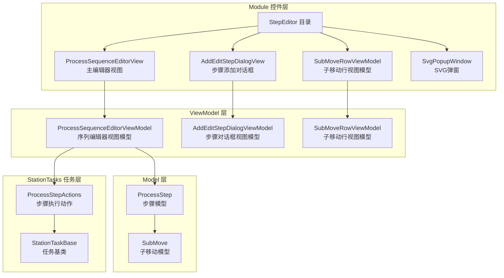
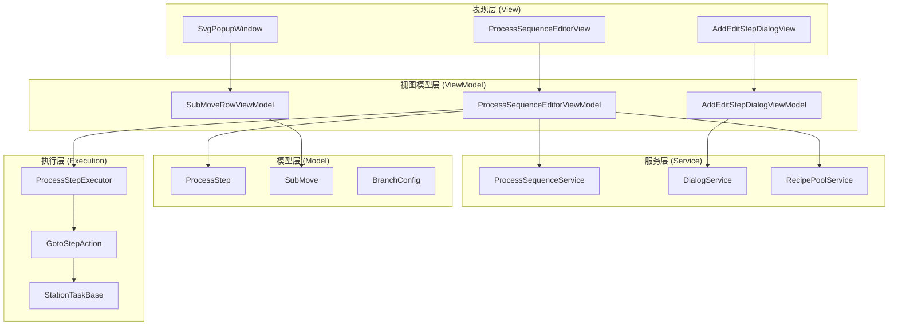
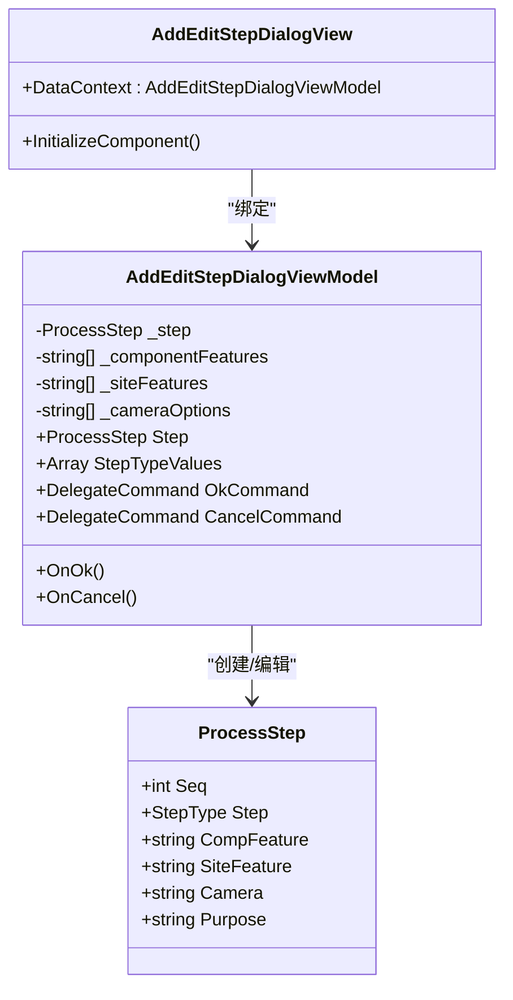
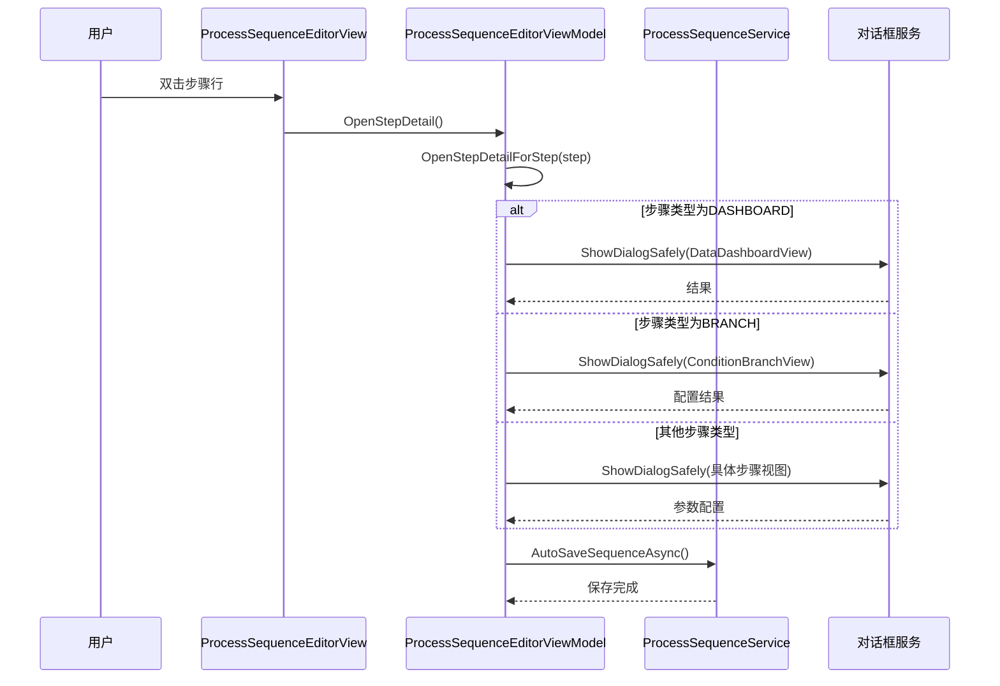
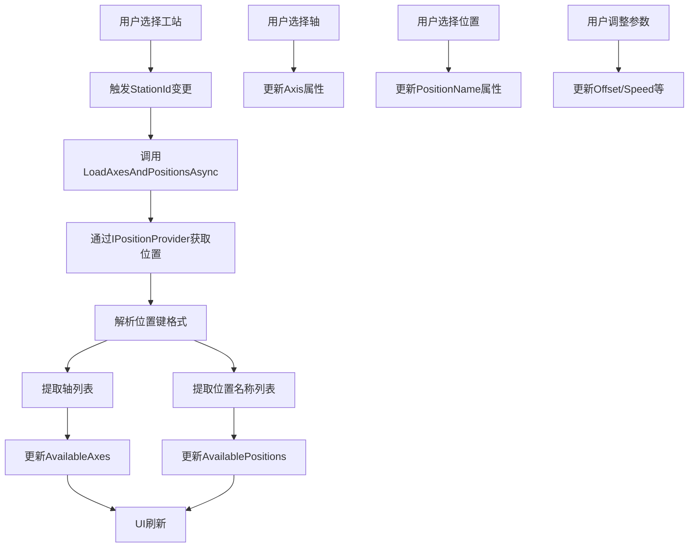
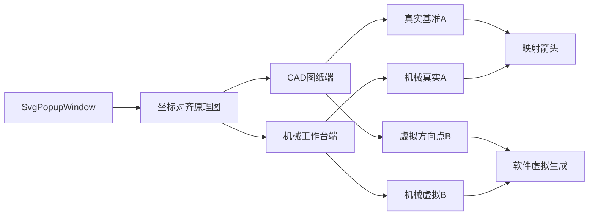
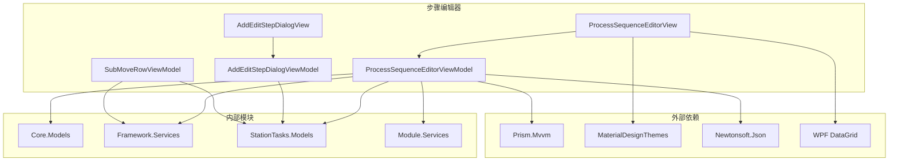

# 步骤编辑控件系统

<cite>
**本文档引用的文件**
- [ProcessSequenceEditorView.xaml.cs](file://Module/Controls/StepEditor/ProcessSequenceEditorView.xaml.cs)
- [ProcessSequenceEditorViewModel.cs](file://Module/Controls/StepEditor/ProcessSequenceEditorViewModel.cs)
- [AddEditStepDialogView.xaml.cs](file://Module/Controls/StepEditor/AddEditStepDialogView.xaml.cs)
- [AddEditStepDialogViewModel.cs](file://Module/Controls/StepEditor/AddEditStepDialogViewModel.cs)
- [SubMoveRowViewModel.cs](file://Module/Controls/StepEditor/SubMoveRowViewModel.cs)
- [SvgPopupWindow.xaml.cs](file://Module/Controls/StepEditor/SvgPopupWindow.xaml.cs)
- [SvgPopupWindow.xaml](file://Module/Controls/StepEditor/SvgPopupWindow.xaml)
- [ProcessSequenceEditorView.xaml](file://Module/Controls/StepEditor/ProcessSequenceEditorView.xaml)
- [AddEditStepDialogView.xaml](file://Module/Controls/StepEditor/AddEditStepDialogView.xaml)
- [ProcessStep.cs](file://StationTasks/Models/ProcessStep.cs)
</cite>

## 目录
1. [简介](#简介)
2. [项目结构](#项目结构)
3. [核心组件](#核心组件)
4. [架构概览](#架构概览)
5. [详细组件分析](#详细组件分析)
6. [依赖关系分析](#依赖关系分析)
7. [性能考虑](#性能考虑)
8. [故障排除指南](#故障排除指南)
9. [结论](#结论)
10. [附录](#附录)

## 简介
本文件详细介绍了步骤编辑控件系统，这是一个用于创建、编辑、管理和执行工艺步骤的完整解决方案。系统包含以下核心功能模块：

- **步骤添加编辑对话框**：提供统一的步骤创建和编辑界面
- **工艺序列编辑器**：支持步骤的可视化编辑、拖拽排序和实时验证
- **子移动行视图模型**：处理复杂的多轴运动配置
- **SVG弹窗**：提供图形化的工艺流程说明和对齐原理展示

该系统支持多种步骤类型（GOTO、VISION、SCAN、SEEK、WAIT、SCRIPT、DASHBOARD、BRANCH等），具备条件分支、报警配置、参数验证等高级功能。

## 项目结构
步骤编辑控件系统采用MVVM架构模式，主要分布在以下目录结构中：

**图表来源**
- [ProcessSequenceEditorView.xaml.cs:1-65](file://Module/Controls/StepEditor/ProcessSequenceEditorView.xaml.cs#L1-L65)
- [ProcessSequenceEditorViewModel.cs:1-740](file://Module/Controls/StepEditor/ProcessSequenceEditorViewModel.cs#L1-L740)
- [ProcessStep.cs:1-890](file://StationTasks/Models/ProcessStep.cs#L1-L890)

**章节来源**
- [ProcessSequenceEditorView.xaml.cs:1-65](file://Module/Controls/StepEditor/ProcessSequenceEditorView.xaml.cs#L1-L65)
- [ProcessSequenceEditorViewModel.cs:1-740](file://Module/Controls/StepEditor/ProcessSequenceEditorViewModel.cs#L1-L740)
- [ProcessStep.cs:1-890](file://StationTasks/Models/ProcessStep.cs#L1-L890)

## 核心组件
系统包含四个主要组件，每个都承担特定的功能职责：

### 1. 步骤添加编辑对话框 (AddEditStepDialogView)
提供统一的步骤创建界面，支持步骤类型选择、特征参数配置和相机设置。

### 2. 工艺序列编辑器 (ProcessSequenceEditorView)
完整的步骤管理界面，支持步骤的增删改查、排序、验证和执行控制。

### 3. 子移动行视图模型 (SubMoveRowViewModel)
处理复杂的多轴运动配置，解决DataGrid多行共享数据源的问题。

### 4. SVG弹窗 (SvgPopupWindow)
提供图形化的工艺流程说明，特别是坐标对齐原理的可视化展示。

**章节来源**
- [AddEditStepDialogView.xaml.cs:1-29](file://Module/Controls/StepEditor/AddEditStepDialogView.xaml.cs#L1-L29)
- [ProcessSequenceEditorView.xaml.cs:1-65](file://Module/Controls/StepEditor/ProcessSequenceEditorView.xaml.cs#L1-L65)
- [SubMoveRowViewModel.cs:1-104](file://Module/Controls/StepEditor/SubMoveRowViewModel.cs#L1-L104)
- [SvgPopupWindow.xaml.cs:1-13](file://Module/Controls/StepEditor/SvgPopupWindow.xaml.cs#L1-L13)

## 架构概览
系统采用分层架构设计，确保关注点分离和代码的可维护性：

**图表来源**
- [ProcessSequenceEditorViewModel.cs:1-740](file://Module/Controls/StepEditor/ProcessSequenceEditorViewModel.cs#L1-L740)
- [ProcessStep.cs:1-890](file://StationTasks/Models/ProcessStep.cs#L1-L890)

## 详细组件分析

### 步骤添加编辑对话框 (AddEditStepDialogView)
这是用户创建新步骤的主要入口点，提供直观的表单界面：

**图表来源**
- [AddEditStepDialogView.xaml.cs:1-29](file://Module/Controls/StepEditor/AddEditStepDialogView.xaml.cs#L1-L29)
- [AddEditStepDialogViewModel.cs:1-92](file://Module/Controls/StepEditor/AddEditStepDialogViewModel.cs#L1-L92)
- [ProcessStep.cs:17-38](file://StationTasks/Models/ProcessStep.cs#L17-L38)

**章节来源**
- [AddEditStepDialogView.xaml.cs:1-29](file://Module/Controls/StepEditor/AddEditStepDialogView.xaml.cs#L1-L29)
- [AddEditStepDialogViewModel.cs:1-92](file://Module/Controls/StepEditor/AddEditStepDialogViewModel.cs#L1-L92)

### 工艺序列编辑器 (ProcessSequenceEditorView)
这是系统的核心界面，提供完整的步骤管理功能：

**图表来源**
- [ProcessSequenceEditorView.xaml.cs:25-48](file://Module/Controls/StepEditor/ProcessSequenceEditorView.xaml.cs#L25-L48)
- [ProcessSequenceEditorViewModel.cs:186-221](file://Module/Controls/StepEditor/ProcessSequenceEditorViewModel.cs#L186-L221)

**章节来源**
- [ProcessSequenceEditorView.xaml.cs:1-65](file://Module/Controls/StepEditor/ProcessSequenceEditorView.xaml.cs#L1-L65)
- [ProcessSequenceEditorViewModel.cs:186-221](file://Module/Controls/StepEditor/ProcessSequenceEditorViewModel.cs#L186-L221)

### 子移动行视图模型 (SubMoveRowViewModel)
专门处理复杂的多轴运动配置，解决DataGrid数据绑定问题：

**图表来源**
- [SubMoveRowViewModel.cs:76-101](file://Module/Controls/StepEditor/SubMoveRowViewModel.cs#L76-L101)

**章节来源**
- [SubMoveRowViewModel.cs:1-104](file://Module/Controls/StepEditor/SubMoveRowViewModel.cs#L1-L104)

### SVG弹窗 (SvgPopupWindow)
提供图形化的工艺流程说明：

**图表来源**
- [SvgPopupWindow.xaml:10-82](file://Module/Controls/StepEditor/SvgPopupWindow.xaml#L10-L82)

**章节来源**
- [SvgPopupWindow.xaml.cs:1-13](file://Module/Controls/StepEditor/SvgPopupWindow.xaml.cs#L1-L13)
- [SvgPopupWindow.xaml:1-84](file://Module/Controls/StepEditor/SvgPopupWindow.xaml#L1-L84)

## 依赖关系分析

**图表来源**
- [ProcessSequenceEditorViewModel.cs:1-22](file://Module/Controls/StepEditor/ProcessSequenceEditorViewModel.cs#L1-L22)
- [ProcessSequenceEditorView.xaml.cs:1-7](file://Module/Controls/StepEditor/ProcessSequenceEditorView.xaml.cs#L1-L7)

**章节来源**
- [ProcessSequenceEditorViewModel.cs:1-22](file://Module/Controls/StepEditor/ProcessSequenceEditorViewModel.cs#L1-L22)
- [ProcessSequenceEditorView.xaml.cs:1-7](file://Module/Controls/StepEditor/ProcessSequenceEditorView.xaml.cs#L1-L7)

## 性能考虑
系统在设计时充分考虑了性能优化：

### 1. 虚拟化支持
- DataGrid启用行虚拟化和列虚拟化
- Recycling虚拟化模式提高大数据集滚动性能
- EnableRowVirtualization="True" 启用行虚拟化

### 2. 异步加载
- 子移动轴和位置列表异步加载
- 避免UI阻塞，提升响应速度
- 使用ConfigureAwait(false)防止死锁

### 3. 内存优化
- ObservableCollection用于数据绑定
- 避免不必要的对象创建
- 及时清理事件订阅

### 4. 缓存机制
- 最近文件列表缓存
- 配方池切换时的异步处理
- 对话框安全打开机制

## 故障排除指南

### 常见问题及解决方案

#### 1. 对话框无法打开问题
**症状**：调用ShowDialogSafely时出现"DialogHost is already open"异常
**解决方案**：系统已内置安全机制，自动检测并关闭现有对话框

#### 2. DataGrid数据绑定问题
**症状**：多行ComboBox选项不正确
**解决方案**：使用SubMoveRowViewModel为每行创建独立的轴和位置列表

#### 3. 步骤验证失败
**症状**：序列验证结果显示错误
**解决方案**：检查步骤参数配置，确保必需字段完整

#### 4. 运行时执行问题
**症状**：步骤执行失败或异常
**解决方案**：检查报警配置和条件分支设置

**章节来源**
- [ProcessSequenceEditorViewModel.cs:345-354](file://Module/Controls/StepEditor/ProcessSequenceEditorViewModel.cs#L345-L354)
- [SubMoveRowViewModel.cs:76-101](file://Module/Controls/StepEditor/SubMoveRowViewModel.cs#L76-L101)

## 结论
步骤编辑控件系统是一个功能完整、架构清晰的工艺步骤管理解决方案。系统具有以下特点：

1. **模块化设计**：各组件职责明确，便于维护和扩展
2. **用户体验优秀**：直观的界面设计和流畅的操作体验
3. **功能全面**：支持多种步骤类型和高级配置功能
4. **性能优化**：采用虚拟化和异步处理技术
5. **可扩展性强**：基于MVVM架构，易于添加新功能

该系统为复杂的工艺流程提供了强大的编辑和执行能力，是现代制造业自动化的重要工具。

## 附录

### 步骤类型支持
系统支持以下步骤类型：
- GOTO：位置移动
- VISION：视觉检测
- SCAN：扫描测量
- SEEK：力控寻针
- WAIT：等待延迟
- SCRIPT：脚本执行
- DASHBOARD：数据看板
- BRANCH：条件分支

### 配置模板
系统提供预设的步骤模板，包括：
- 默认DASHBOARD字段配置
- 条件分支的初始设置
- 常用步骤参数的推荐值

### 批量编辑技巧
- 使用DataGrid的批量编辑功能
- 支持整列参数的快速修改
- 批量导入导出步骤序列
- 模板化配置复用