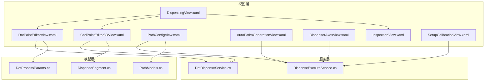
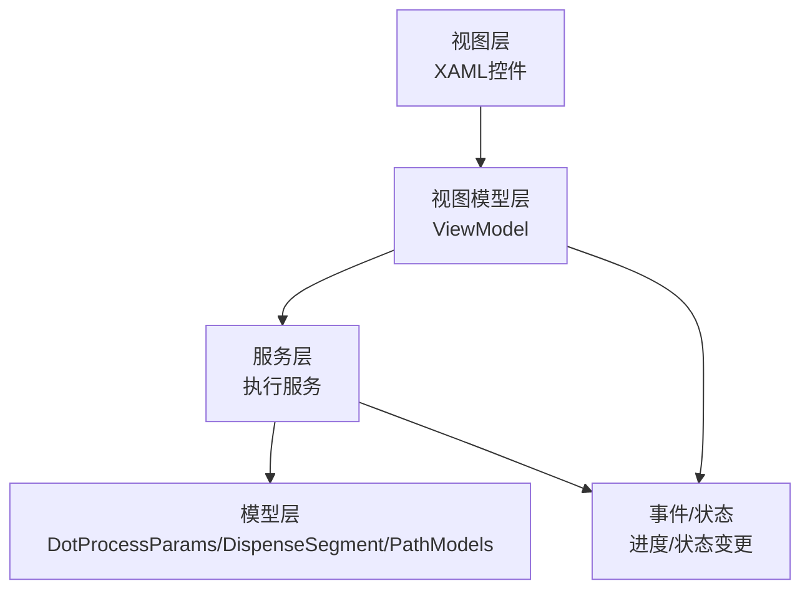
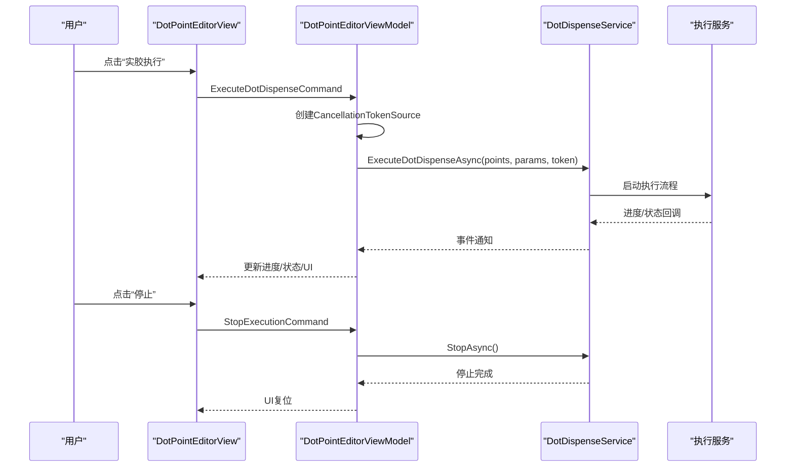
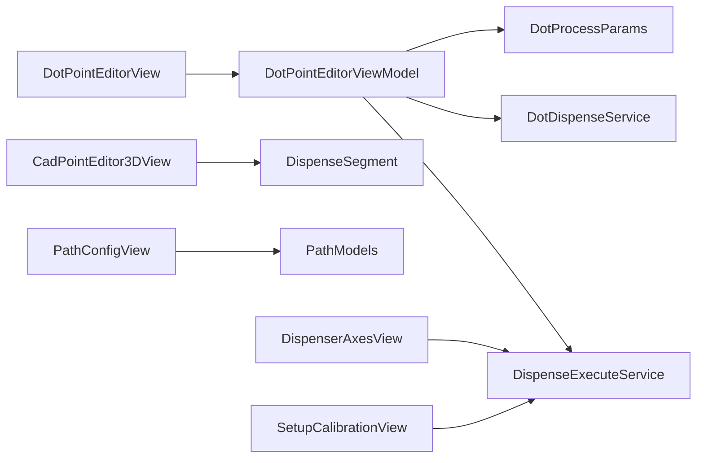

# 点胶控件系统

<cite>
**本文档引用的文件**
- [DispensingView.xaml](file://Module/Controls/Dispense/DispensingView.xaml)
- [DotPointEditorView.xaml](file://Module/Controls/Dispense/DotPointEditorView.xaml)
- [InspectionView.xaml](file://Module/Controls/Dispense/InspectionView.xaml)
- [PathConfigView.xaml](file://Module/Controls/Dispense/PathConfigView.xaml)
- [AutoPathsGenerationView.xaml](file://Module/Controls/Dispense/AutoPathsGenerationView.xaml)
- [DispenserAxesView.xaml](file://Module/Controls/Dispense/DispenserAxesView.xaml)
- [CadPointEditor3DView.xaml](file://Module/Controls/Dispense/CadPointEditor3DView.xaml)
- [SetupCalibrationView.xaml](file://Module/Controls/Dispense/SetupCalibrationView.xaml)
- [DotProcessParams.cs](file://Core/Models/DotProcessParams.cs)
- [DispenseSegment.cs](file://Core/Models/DispenseSegment.cs)
- [PathModels.cs](file://Core/Models/PathModels.cs)
- [DotPointEditorViewModel.cs](file://Module/Controls/Dispense/DotPointEditorViewModel.cs)
- [DispenseExecuteService.cs](file://Module/Services/DispenseExecuteService.cs)
- [DotDispenseService.cs](file://Module/Services/DotDispenseService.cs)
</cite>

## 目录
1. [引言](#引言)
2. [项目结构](#项目结构)
3. [核心组件](#核心组件)
4. [架构概览](#架构概览)
5. [详细组件分析](#详细组件分析)
6. [依赖关系分析](#依赖关系分析)
7. [性能考虑](#性能考虑)
8. [故障排查指南](#故障排查指南)
9. [结论](#结论)
10. [附录](#附录)

## 引言
本文件面向点胶控件系统的使用者与开发者，系统性梳理点胶执行控件（DispensingView）、点胶轨迹编辑控件（DotPointEditorView）、质量检测控件（InspectionView）、路径配置控件（PathConfigView）、自动路径生成控件（AutoPathsGenerationView）、点胶轴控件（DispenserAxesView）、3D CAD点编辑控件（CadPointEditor3DView）、校准设置控件（SetupCalibrationView）等核心功能模块。文档从架构、数据流、处理逻辑、集成点、错误处理与性能特性等方面进行深入解析，并提供参数调优、故障诊断与效率提升建议。

## 项目结构
点胶控件系统位于 Module/Controls/Dispense 目录下，采用基于功能域的组织方式，每个控件由 XAML 视图与对应的 ViewModel 组成；核心数据模型位于 Core/Models；执行服务位于 Module/Services。整体结构清晰、职责分离明确，便于扩展与维护。

图表来源
- [DispensingView.xaml:1-129](file://Module/Controls/Dispense/DispensingView.xaml#L1-L129)
- [DotPointEditorView.xaml:1-642](file://Module/Controls/Dispense/DotPointEditorView.xaml#L1-L642)
- [InspectionView.xaml:1-103](file://Module/Controls/Dispense/InspectionView.xaml#L1-L103)
- [PathConfigView.xaml:1-201](file://Module/Controls/Dispense/PathConfigView.xaml#L1-L201)
- [AutoPathsGenerationView.xaml:1-199](file://Module/Controls/Dispense/AutoPathsGenerationView.xaml#L1-L199)
- [DispenserAxesView.xaml:1-97](file://Module/Controls/Dispense/DispenserAxesView.xaml#L1-L97)
- [CadPointEditor3DView.xaml:1-250](file://Module/Controls/Dispense/CadPointEditor3DView.xaml#L1-L250)
- [SetupCalibrationView.xaml:1-69](file://Module/Controls/Dispense/SetupCalibrationView.xaml#L1-L69)
- [DotProcessParams.cs:1-121](file://Core/Models/DotProcessParams.cs#L1-L121)
- [DispenseSegment.cs:1-236](file://Core/Models/DispenseSegment.cs#L1-L236)
- [PathModels.cs:1-224](file://Core/Models/PathModels.cs#L1-L224)
- [DispenseExecuteService.cs:37-59](file://Module/Services/DispenseExecuteService.cs#L37-L59)
- [DotDispenseService.cs](file://Module/Services/DotDispenseService.cs)

章节来源
- [DispensingView.xaml:1-129](file://Module/Controls/Dispense/DispensingView.xaml#L1-L129)
- [DotPointEditorView.xaml:1-642](file://Module/Controls/Dispense/DotPointEditorView.xaml#L1-L642)
- [DotProcessParams.cs:1-121](file://Core/Models/DotProcessParams.cs#L1-L121)
- [DispenseSegment.cs:1-236](file://Core/Models/DispenseSegment.cs#L1-L236)
- [PathModels.cs:1-224](file://Core/Models/PathModels.cs#L1-L224)

## 核心组件
- 点胶执行控件（DispensingView）：作为入口面板，提供点胶相关子控件的导航与状态展示，包含顶部工具栏、Tab页切换与底部状态栏。
- 点胶轨迹编辑控件（DotPointEditorView）：支持点胶参数配置、点位数据编辑、执行控制与进度反馈，具备三步式工作流与可视化状态提示。
- 质量检测控件（InspectionView）：提供视觉检测、站点选择、测量与结果展示，支持导出检测记录。
- 路径配置控件（PathConfigView）：集中管理喷嘴配置、通用参数、运动与安全逻辑、启动逻辑等，提供参数保存能力。
- 自动路径生成控件（AutoPathsGenerationView）：支持Jog与捕获、相机扫描、捕获点编辑、自动生成路径、Z修正与执行。
- 点胶轴控件（DispenserAxesView）：提供轴位姿显示、速度、步进与正负方向控制，以及回零与急停功能。
- 3D CAD点编辑控件（CadPointEditor3DView）：支持DXF导入、可视化绘制、路径编辑、基准点示教、校准文件导入与执行。
- 校准设置控件（SetupCalibrationView）：提供头选择、压力与速度设置、配方保存等校准相关配置。

章节来源
- [DispensingView.xaml:1-129](file://Module/Controls/Dispense/DispensingView.xaml#L1-L129)
- [DotPointEditorView.xaml:1-642](file://Module/Controls/Dispense/DotPointEditorView.xaml#L1-L642)
- [InspectionView.xaml:1-103](file://Module/Controls/Dispense/InspectionView.xaml#L1-L103)
- [PathConfigView.xaml:1-201](file://Module/Controls/Dispense/PathConfigView.xaml#L1-L201)
- [AutoPathsGenerationView.xaml:1-199](file://Module/Controls/Dispense/AutoPathsGenerationView.xaml#L1-L199)
- [DispenserAxesView.xaml:1-97](file://Module/Controls/Dispense/DispenserAxesView.xaml#L1-L97)
- [CadPointEditor3DView.xaml:1-250](file://Module/Controls/Dispense/CadPointEditor3DView.xaml#L1-L250)
- [SetupCalibrationView.xaml:1-69](file://Module/Controls/Dispense/SetupCalibrationView.xaml#L1-L69)

## 架构概览
点胶控件系统遵循MVVM模式，视图通过绑定与命令与ViewModel交互，ViewModel协调服务层完成具体业务逻辑。核心数据模型在Core层定义，服务层封装执行细节，确保UI与业务逻辑解耦。

图表来源
- [DotPointEditorViewModel.cs:224-499](file://Module/Controls/Dispense/DotPointEditorViewModel.cs#L224-L499)
- [DispenseExecuteService.cs:37-59](file://Module/Services/DispenseExecuteService.cs#L37-L59)
- [DotDispenseService.cs](file://Module/Services/DotDispenseService.cs)
- [DotProcessParams.cs:1-121](file://Core/Models/DotProcessParams.cs#L1-L121)
- [DispenseSegment.cs:1-236](file://Core/Models/DispenseSegment.cs#L1-L236)
- [PathModels.cs:1-224](file://Core/Models/PathModels.cs#L1-L224)

## 详细组件分析

### 点胶执行控件（DispensingView）
- 功能定位：作为点胶主面板，承载多个子控件，提供统一的导航与状态展示。
- 关键特性：
  - 顶部工具栏：包含工站标识与运行状态指示。
  - Tab页：点涂（类型A）、2D线条（类型B）、视觉引导（类型D）三个子页面。
  - 底部状态栏：显示主状态、轴状态与模式信息。
- 设计要点：采用Material Design风格，布局清晰，便于用户在不同模式间切换。

章节来源
- [DispensingView.xaml:1-129](file://Module/Controls/Dispense/DispensingView.xaml#L1-L129)

### 点胶轨迹编辑控件（DotPointEditorView）
- 工作流：三步式（工艺参数配置 → 点位数据编辑 → 执行控制），配合步骤指示器与状态消息。
- 参数配置区：涵盖运动参数（空移速度、安全高度、逼近高度、拐角减速）、出胶参数（出胶时间、后延时、触发距离）、阀控参数（气压、回吸时间）、高度参数（示教高度、高度补偿、有效工作高度）。
- 数据编辑区：支持分组过滤、全选/反选、批量应用工艺参数、逐点示教。
- 执行控制区：提供空跑、实胶执行、停止按钮，进度条与状态文本实时反馈。
- 事件与状态：订阅服务层进度与状态事件，统一更新UI。

图表来源
- [DotPointEditorView.xaml:522-554](file://Module/Controls/Dispense/DotPointEditorView.xaml#L522-L554)
- [DotPointEditorViewModel.cs:446-495](file://Module/Controls/Dispense/DotPointEditorViewModel.cs#L446-L495)
- [DotDispenseService.cs](file://Module/Services/DotDispenseService.cs)

章节来源
- [DotPointEditorView.xaml:1-642](file://Module/Controls/Dispense/DotPointEditorView.xaml#L1-L642)
- [DotPointEditorViewModel.cs:224-499](file://Module/Controls/Dispense/DotPointEditorViewModel.cs#L224-L499)

### 质量检测控件（InspectionView）
- 功能：提供视觉检测、站点选择、相机移动、连续性测量、检测结果展示与CSV导出。
- 使用场景：对已执行的点胶轨迹进行宽度一致性等指标的质量评估。

章节来源
- [InspectionView.xaml:1-103](file://Module/Controls/Dispense/InspectionView.xaml#L1-L103)

### 路径配置控件（PathConfigView）
- 功能：集中配置喷嘴数量与头选择、通用参数（目标线宽、出胶时间、出胶速度）、运动与安全逻辑（全局安全高度、接近高度、局部路径高度、中间路径点编辑）、启动逻辑（接近速度、接近距离、预出胶延时）。
- 价值：标准化路径执行前的关键参数，降低人为误差。

章节来源
- [PathConfigView.xaml:1-201](file://Module/Controls/Dispense/PathConfigView.xaml#L1-L201)

### 自动路径生成控件（AutoPathsGenerationView）
- 流程：Jog与捕获 → 相机扫描 → 捕获点编辑 → 自动生成路径（2D/3D）→ Z修正 → 执行点胶。
- 适用：快速生成复杂轨迹，结合Z-Scan进行高度修正，提高效率与一致性。

章节来源
- [AutoPathsGenerationView.xaml:1-199](file://Module/Controls/Dispense/AutoPathsGenerationView.xaml#L1-L199)

### 点胶轴控件（DispenserAxesView）
- 功能：显示各轴当前位置、速度、步进，提供正负方向移动按钮、回零与急停。
- 价值：直观掌控点胶轴状态，保障操作安全与精度。

章节来源
- [DispenserAxesView.xaml:1-97](file://Module/Controls/Dispense/DispenserAxesView.xaml#L1-L97)

### 3D CAD点编辑控件（CadPointEditor3DView）
- 能力：DXF文件导入、可视化绘制、路径点编辑、基准点示教（Map/Dispensing）、校准文件导入、Dry Run与执行。
- 价值：将CAD设计直接转化为可执行的3D路径，支持Z修正与多站点执行。

章节来源
- [CadPointEditor3DView.xaml:1-250](file://Module/Controls/Dispense/CadPointEditor3DView.xaml#L1-L250)

### 校准设置控件（SetupCalibrationView）
- 能力：头选择（Head 1/2）、压力与速度设置、配方保存。
- 价值：为不同头配置独立参数，确保出胶一致性与质量稳定。

章节来源
- [SetupCalibrationView.xaml:1-69](file://Module/Controls/Dispense/SetupCalibrationView.xaml#L1-L69)

## 依赖关系分析
- 视图与ViewModel：通过Prism的ViewModelLocator自动关联，实现松耦合。
- ViewModel与服务：DotPointEditorViewModel订阅DotDispenseService的进度与状态事件，驱动UI更新。
- 服务与模型：DispenseExecuteService与DotDispenseService依赖Core层模型（DotProcessParams、DispenseSegment、PathModels）进行参数约束与轨迹描述。
- 控件协作：DispensingView作为容器，承载各子控件；PathConfigView/AutoPathsGenerationView/DispenserAxesView/SetupCalibrationView为执行前准备与辅助功能。

图表来源
- [DotPointEditorView.xaml:1-642](file://Module/Controls/Dispense/DotPointEditorView.xaml#L1-L642)
- [DotPointEditorViewModel.cs:224-499](file://Module/Controls/Dispense/DotPointEditorViewModel.cs#L224-L499)
- [DispenseExecuteService.cs:37-59](file://Module/Services/DispenseExecuteService.cs#L37-L59)
- [DotDispenseService.cs](file://Module/Services/DotDispenseService.cs)
- [DotProcessParams.cs:1-121](file://Core/Models/DotProcessParams.cs#L1-L121)
- [DispenseSegment.cs:1-236](file://Core/Models/DispenseSegment.cs#L1-L236)
- [PathModels.cs:1-224](file://Core/Models/PathModels.cs#L1-L224)

## 性能考虑
- UI虚拟化：DotPointEditorView的数据网格启用了行/列虚拟化与回收模式，适合大数据集滚动与编辑。
- 异步执行：执行命令均采用异步方法，避免阻塞UI线程；支持取消令牌中断执行。
- 参数约束：DotProcessParams与DispenseSegment对输入参数进行范围约束，减少无效计算与异常重试。
- 事件驱动：通过事件回调更新UI，避免轮询带来的CPU占用。

章节来源
- [DotPointEditorView.xaml:444-501](file://Module/Controls/Dispense/DotPointEditorView.xaml#L444-L501)
- [DotPointEditorViewModel.cs:446-495](file://Module/Controls/Dispense/DotPointEditorViewModel.cs#L446-L495)
- [DotProcessParams.cs:14-116](file://Core/Models/DotProcessParams.cs#L14-L116)
- [DispenseSegment.cs:130-214](file://Core/Models/DispenseSegment.cs#L130-L214)

## 故障排查指南
- 执行异常：查看DotPointEditorViewModel中异常捕获与状态更新逻辑，确认异常消息是否正确显示。
- 停止无效：检查StopExecutionCommand是否正确取消CancellationToken并调用StopAsync。
- 参数越界：确认DotProcessParams与DispenseSegment的参数范围约束是否生效。
- 服务未响应：核对DispenseExecuteService/DotDispenseService的事件订阅与回调链路。

章节来源
- [DotPointEditorViewModel.cs:446-495](file://Module/Controls/Dispense/DotPointEditorViewModel.cs#L446-L495)
- [DispenseExecuteService.cs:37-59](file://Module/Services/DispenseExecuteService.cs#L37-L59)

## 结论
点胶控件系统以清晰的层次化架构与完善的参数模型为基础，实现了从参数配置、轨迹编辑、自动路径生成到执行与质量检测的完整闭环。通过事件驱动与异步执行，系统在保证稳定性的同时兼顾了良好的用户体验。建议在实际部署中结合设备特性持续优化参数范围与默认值，并完善日志与报警机制以提升可运维性。

## 附录
- 参数调优建议
  - 点胶时间与后延时：根据胶体粘度与基材材质微调，避免拉丝与滴漏。
  - 触发距离：在保证触发稳定的前提下尽量减小，提升轨迹精度。
  - 安全高度与逼近高度：兼顾效率与安全性，避免碰撞与抖动。
  - 拐角减速：在高速路径中适当增大，降低震动对胶量的影响。
- 故障诊断方法
  - 使用InspectionView进行连续性检测，定位异常点。
  - 通过Dry Run验证路径可行性，再进行实胶执行。
  - 校准设置控件用于头差异补偿，确保多头一致性。
- 生产效率提升策略
  - 使用AutoPathsGenerationView快速生成复杂轨迹，减少手工编程时间。
  - 在PathConfigView中统一参数，减少重复配置成本。
  - 利用分组与批量应用功能，加速点位编辑与参数下发。