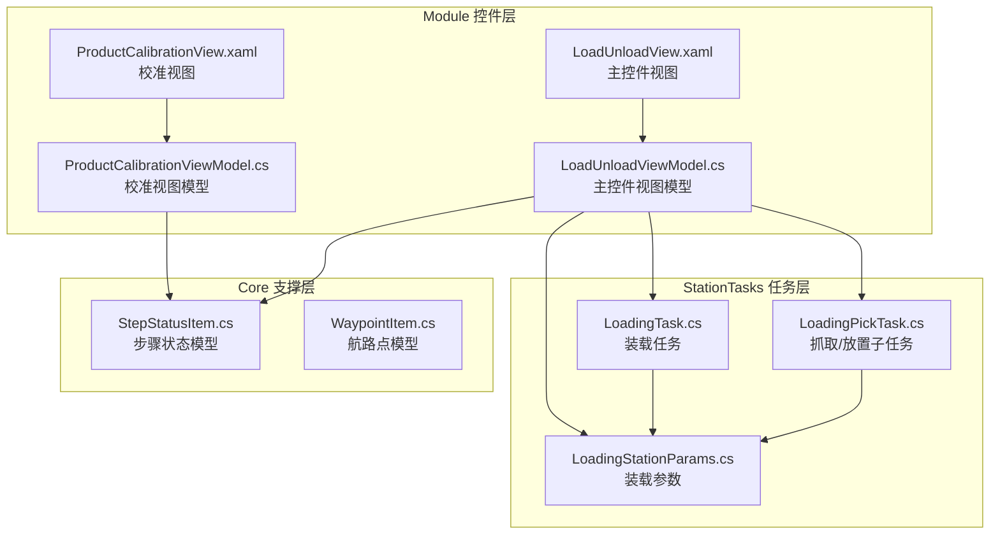
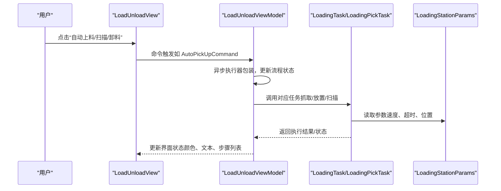
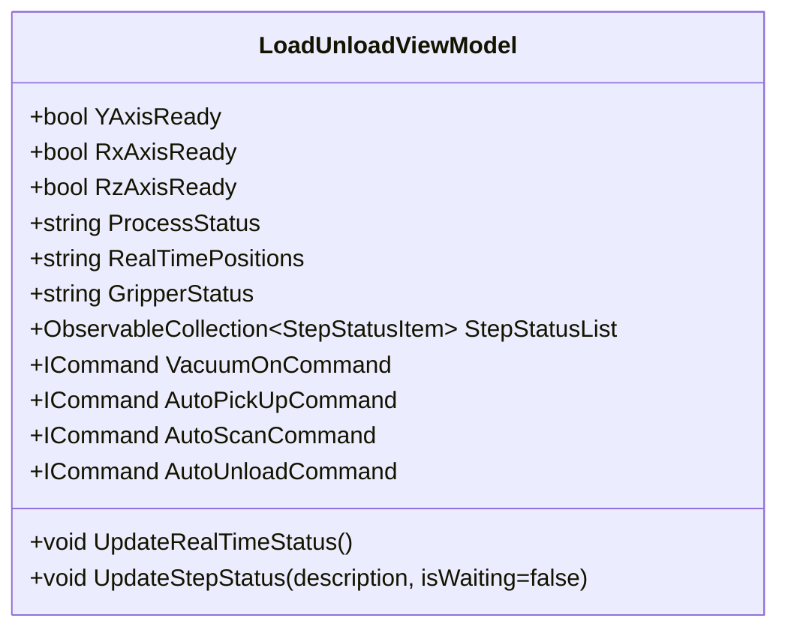
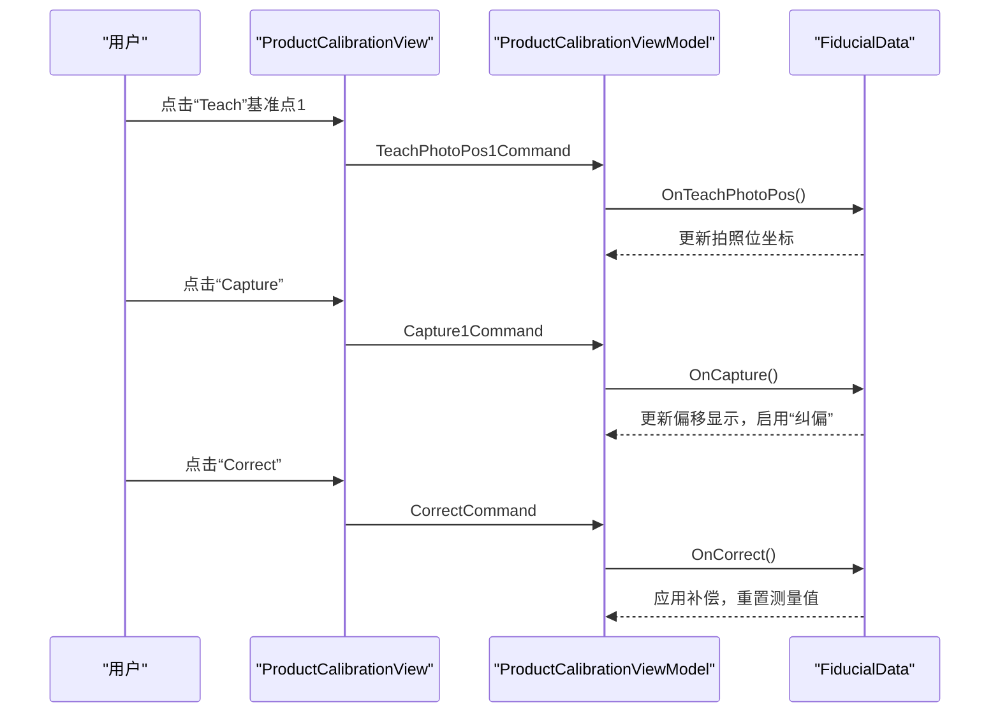
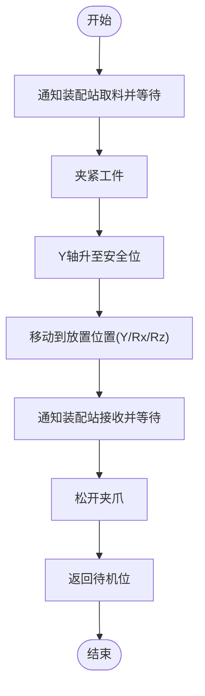
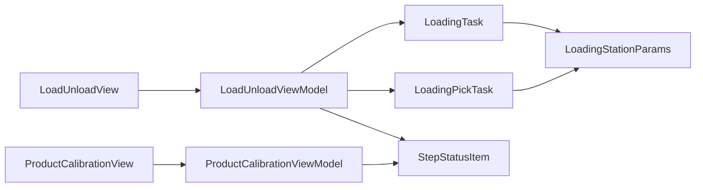

# 装载卸载控件系统

<cite>
**本文引用的文件**
- [LoadUnloadView.xaml](file://Module/Controls/Loading/LoadUnloadView.xaml)
- [LoadUnloadView.xaml.cs](file://Module/Controls/Loading/LoadUnloadView.xaml.cs)
- [LoadUnloadViewModel.cs](file://Module/Controls/Loading/LoadUnloadViewModel.cs)
- [ProductCalibrationView.xaml](file://Module/Controls/Loading/ProductCalibrationView.xaml)
- [ProductCalibrationView.xaml.cs](file://Module/Controls/Loading/ProductCalibrationView.xaml.cs)
- [ProductCalibrationViewModel.cs](file://Module/Controls/Loading/ProductCalibrationViewModel.cs)
- [LoadingTask.cs](file://StationTasks/Tasks/LoadingTask.cs)
- [LoadingPickTask.cs](file://StationTasks/Tasks/LoadingPickTask.cs)
- [LoadingStationParams.cs](file://StationTasks/Params/LoadingStationParams.cs)
- [StepStatusItem.cs](file://Core/Models/StepStatusItem.cs)
- [WaypointItem.cs](file://Module/Models/WaypointItem.cs)
</cite>

## 目录
1. [简介](#简介)
2. [项目结构](#项目结构)
3. [核心组件](#核心组件)
4. [架构总览](#架构总览)
5. [详细组件分析](#详细组件分析)
6. [依赖关系分析](#依赖关系分析)
7. [性能考量](#性能考量)
8. [故障排查指南](#故障排查指南)
9. [结论](#结论)
10. [附录](#附录)

## 简介
本技术文档围绕“装载卸载控件系统”展开，重点覆盖以下内容：
- 装载卸载主控件（LoadUnloadView）与视图模型（LoadUnloadViewModel）的界面布局、命令绑定与状态管理机制
- 产品校准控件（ProductCalibrationView）与视图模型（ProductCalibrationViewModel）的基准点教学、拍照、纠偏与全局应用流程
- 关键工艺步骤（抓取、放置、定位、校准）的控制逻辑与UI交互映射
- 负载检测、安全保护、精度补偿等技术要点
- 装载参数配置方法、产品适应性调整指南、异常处理流程
- 不同产品类型的装载卸载场景示例与操作规范

## 项目结构
装载卸载控件系统位于模块化工程的 Module 控件层，采用 Prism MVVM 框架组织界面与业务逻辑；同时通过 StationTasks 提供底层自动化任务与参数配置支撑。

**图表来源**
- [LoadUnloadView.xaml:1-689](file://Module/Controls/Loading/LoadUnloadView.xaml#L1-L689)
- [LoadUnloadViewModel.cs:1-549](file://Module/Controls/Loading/LoadUnloadViewModel.cs#L1-L549)
- [ProductCalibrationView.xaml:1-202](file://Module/Controls/Loading/ProductCalibrationView.xaml#L1-L202)
- [ProductCalibrationViewModel.cs:1-163](file://Module/Controls/Loading/ProductCalibrationViewModel.cs#L1-L163)
- [LoadingTask.cs:1-110](file://StationTasks/Tasks/LoadingTask.cs#L1-L110)
- [LoadingPickTask.cs:1-78](file://StationTasks/Tasks/LoadingPickTask.cs#L1-L78)
- [LoadingStationParams.cs:1-268](file://StationTasks/Params/LoadingStationParams.cs#L1-L268)
- [StepStatusItem.cs:1-31](file://Core/Models/StepStatusItem.cs#L1-L31)
- [WaypointItem.cs:1-38](file://Module/Models/WaypointItem.cs#L1-L38)

**章节来源**
- [LoadUnloadView.xaml:1-689](file://Module/Controls/Loading/LoadUnloadView.xaml#L1-L689)
- [LoadUnloadViewModel.cs:1-549](file://Module/Controls/Loading/LoadUnloadViewModel.cs#L1-L549)
- [ProductCalibrationView.xaml:1-202](file://Module/Controls/Loading/ProductCalibrationView.xaml#L1-L202)
- [ProductCalibrationViewModel.cs:1-163](file://Module/Controls/Loading/ProductCalibrationViewModel.cs#L1-L163)
- [LoadingTask.cs:1-110](file://StationTasks/Tasks/LoadingTask.cs#L1-L110)
- [LoadingPickTask.cs:1-78](file://StationTasks/Tasks/LoadingPickTask.cs#L1-L78)
- [LoadingStationParams.cs:1-268](file://StationTasks/Params/LoadingStationParams.cs#L1-L268)
- [StepStatusItem.cs:1-31](file://Core/Models/StepStatusItem.cs#L1-L31)
- [WaypointItem.cs:1-38](file://Module/Models/WaypointItem.cs#L1-L38)

## 核心组件
- 装载卸载主控件（LoadUnloadView）
  - 采用三栏布局：左侧设备状态监控、中间主操作控制区、右侧流程控制与状态监控
  - 提供真空控制、定位控制（快速移动、装配位选择）、夹爪控制（真空、开合、角度）与自动流程按钮
  - 实时显示轴状态、实时位置、流程步骤状态列表，并具备滚动聚焦能力
- 装载卸载主控件视图模型（LoadUnloadViewModel）
  - 维护轴状态、真空状态、夹爪状态、实时位置与流程状态文本
  - 定义大量命令（如真空开关、回零、定位、夹爪动作、自动流程等），并通过异步执行器包装，避免重复执行
  - 使用定时器周期更新实时状态；维护步骤状态列表（最多保留50条），并提供消息弹窗提示
- 产品校准控件（ProductCalibrationView）
  - 提供两个基准点（Fiducial 1/2）的教学与纠偏界面，包含拍照位坐标输入、参考坐标输入、偏移显示与操作按钮
  - 支持“全部应用纠偏”全局操作
- 产品校准控件视图模型（ProductCalibrationViewModel）
  - 封装每个基准点的数据与命令，支持“前往拍照位”、“拍照”、“纠偏”
  - “拍照”模拟视觉测量并更新偏移显示；“纠偏”计算偏移并进行补偿（模拟）
  - “全部应用纠偏”依次对两个基准点执行纠偏

**章节来源**
- [LoadUnloadView.xaml:46-689](file://Module/Controls/Loading/LoadUnloadView.xaml#L46-L689)
- [LoadUnloadViewModel.cs:23-549](file://Module/Controls/Loading/LoadUnloadViewModel.cs#L23-L549)
- [ProductCalibrationView.xaml:1-202](file://Module/Controls/Loading/ProductCalibrationView.xaml#L1-L202)
- [ProductCalibrationViewModel.cs:1-163](file://Module/Controls/Loading/ProductCalibrationViewModel.cs#L1-L163)

## 架构总览
装载卸载控件系统遵循 MVVM 分层：
- 视图层（View）：XAML 定义界面与绑定，响应用户交互
- 视图模型层（ViewModel）：封装命令、状态与业务逻辑，负责与任务层交互
- 任务层（StationTasks）：提供自动化任务与参数配置，驱动底层运动与IO
- 支撑层（Core）：提供通用模型与工具（如步骤状态、位置点）

**图表来源**
- [LoadUnloadView.xaml:593-646](file://Module/Controls/Loading/LoadUnloadView.xaml#L593-L646)
- [LoadUnloadViewModel.cs:197-319](file://Module/Controls/Loading/LoadUnloadViewModel.cs#L197-L319)
- [LoadingTask.cs:33-80](file://StationTasks/Tasks/LoadingTask.cs#L33-L80)
- [LoadingPickTask.cs:11-74](file://StationTasks/Tasks/LoadingPickTask.cs#L11-L74)
- [LoadingStationParams.cs:37-244](file://StationTasks/Params/LoadingStationParams.cs#L37-L244)

## 详细组件分析

### 装载卸载主控件（LoadUnloadView）
- 布局与区域
  - 左侧：设备状态卡片（轴状态）、实时位置卡片
  - 中间：真空控制、定位控制、夹爪控制三大块，包含按钮与参数编辑入口
  - 右侧：自动流程卡片（按钮）、流程步骤状态列表
- 数据绑定与交互
  - 状态指示（真空、夹爪、轴状态）通过绑定属性与转换器呈现
  - 步骤状态列表自动滚动到最新项，便于追踪执行过程
- 命令绑定
  - 所有按钮均绑定到 ViewModel 的命令属性，确保统一的执行入口与错误处理

**章节来源**
- [LoadUnloadView.xaml:46-689](file://Module/Controls/Loading/LoadUnloadView.xaml#L46-L689)
- [LoadUnloadView.xaml.cs:1-52](file://Module/Controls/Loading/LoadUnloadView.xaml.cs#L1-L52)

### 装载卸载主控件视图模型（LoadUnloadViewModel）
- 命令体系
  - 真空控制：开启、关闭、检测
  - 平台控制：回零、快速定位（抓取/扫描/卸料）、装配位选择与执行
  - 夹爪控制：夹爪真空、夹爪动作（前往角度、夹紧、松开）、参数编辑
  - 自动流程：自动上料、对位、自动扫描、查看3D扫描数据、自动卸料
  - 阶段校准：打开阶段对齐对话框（ProductCalibrationView）
- 状态管理
  - 实时状态：每500ms更新一次轴状态、真空状态、流程状态
  - 步骤状态：最多保留50条，包含时间戳与完成/当前标记
  - 权限控制：管理员权限决定是否允许编辑参数
- 异常处理
  - 所有命令通过异步执行器包装，避免并发执行；捕获异常并弹窗提示

**图表来源**
- [LoadUnloadViewModel.cs:23-364](file://Module/Controls/Loading/LoadUnloadViewModel.cs#L23-L364)

**章节来源**
- [LoadUnloadViewModel.cs:177-549](file://Module/Controls/Loading/LoadUnloadViewModel.cs#L177-L549)

### 产品校准控件（ProductCalibrationView）与视图模型（ProductCalibrationViewModel）
- 界面组成
  - 两组基准点（Fiducial 1/2）：拍照位坐标输入、参考坐标输入、偏移显示、操作按钮
  - 全局“全部应用纠偏”按钮
- 核心流程
  - 教学（Teach）：从设备当前位置读取并填充拍照位
  - 拍照（Capture）：模拟视觉测量，生成微小偏移并启用“纠偏”
  - 纠偏（Correct）：计算偏移并进行补偿（模拟），重置测量值
  - 全部应用：依次对两个基准点执行纠偏

**图表来源**
- [ProductCalibrationView.xaml:1-202](file://Module/Controls/Loading/ProductCalibrationView.xaml#L1-L202)
- [ProductCalibrationViewModel.cs:1-163](file://Module/Controls/Loading/ProductCalibrationViewModel.cs#L1-L163)

**章节来源**
- [ProductCalibrationView.xaml:1-202](file://Module/Controls/Loading/ProductCalibrationView.xaml#L1-L202)
- [ProductCalibrationViewModel.cs:1-163](file://Module/Controls/Loading/ProductCalibrationViewModel.cs#L1-L163)

### 关键工艺步骤控制逻辑
- 抓取（Pick）
  - 通知装配站取料并等待接收
  - 夹紧工件
  - Y轴升至安全位
- 放置（Place）
  - 移动到放置位置（按序绝对运动：Y/Rx/Rz）
  - 通知装配站接收并等待
  - 松开夹爪
  - 返回待机位
- 定位与扫描
  - 手动或自动移动到拍照位
  - 触发拍照信号（模拟）
- 校准
  - 通过基准点教学与纠偏，补偿定位误差

**图表来源**
- [LoadingPickTask.cs:17-59](file://StationTasks/Tasks/LoadingPickTask.cs#L17-L59)

**章节来源**
- [LoadingPickTask.cs:11-74](file://StationTasks/Tasks/LoadingPickTask.cs#L11-L74)

### 参数配置与适应性调整
- 装载参数（LoadingStationParams）
  - 时间参数：拾取/放置延迟、破真空时间、拾取完成/拍照完成超时
  - 工艺参数：点胶时间、UV固化时间
  - 轴速度参数：Y/U/R轴速度
  - 超时参数：物料检查、真空建立、装配就绪
  - 传送带设置：速度与加速度
  - 运行参数：最大装载数量
  - 真空系统：真空检测超时、真空控制模式
  - 位置控制：Y轴安全位置、U轴夹持角度
  - 位置点：标准位置（待机/安全）与自定义位置（如拍照位、装配位）
- 产品适应性调整建议
  - 根据产品重量与形状调整真空控制模式与破真空时间
  - 根据产品尺寸与易损性调整Y轴安全高度与轴速度
  - 根据装配节拍调整拾取/放置延迟与超时参数
  - 通过基准点教学与纠偏提升定位精度

**章节来源**
- [LoadingStationParams.cs:37-244](file://StationTasks/Params/LoadingStationParams.cs#L37-L244)

## 依赖关系分析
- 视图与视图模型
  - LoadUnloadView 与 LoadUnloadViewModel 通过 Prism 自动绑定关联
  - ProductCalibrationView 与 ProductCalibrationViewModel 通过对话框服务打开
- 视图模型与任务层
  - LoadUnloadViewModel 通过命令间接调用 LoadingTask/LoadingPickTask
  - 任务层读取 LoadingStationParams 获取参数与位置点
- 状态与日志
  - 步骤状态列表（StepStatusItem）贯穿 UI 与任务层，用于流程追踪
  - WaypointItem 作为航路点模型，可用于路径规划与编辑

**图表来源**
- [LoadUnloadView.xaml:1-689](file://Module/Controls/Loading/LoadUnloadView.xaml#L1-L689)
- [LoadUnloadViewModel.cs:1-549](file://Module/Controls/Loading/LoadUnloadViewModel.cs#L1-L549)
- [ProductCalibrationView.xaml:1-202](file://Module/Controls/Loading/ProductCalibrationView.xaml#L1-L202)
- [ProductCalibrationViewModel.cs:1-163](file://Module/Controls/Loading/ProductCalibrationViewModel.cs#L1-L163)
- [LoadingTask.cs:1-110](file://StationTasks/Tasks/LoadingTask.cs#L1-L110)
- [LoadingPickTask.cs:1-78](file://StationTasks/Tasks/LoadingPickTask.cs#L1-L78)
- [LoadingStationParams.cs:1-268](file://StationTasks/Params/LoadingStationParams.cs#L1-L268)
- [StepStatusItem.cs:1-31](file://Core/Models/StepStatusItem.cs#L1-L31)

**章节来源**
- [LoadUnloadViewModel.cs:177-221](file://Module/Controls/Loading/LoadUnloadViewModel.cs#L177-L221)
- [LoadingTask.cs:23-31](file://StationTasks/Tasks/LoadingTask.cs#L23-L31)
- [LoadingPickTask.cs:63-74](file://StationTasks/Tasks/LoadingPickTask.cs#L63-L74)
- [LoadingStationParams.cs:236-244](file://StationTasks/Params/LoadingStationParams.cs#L236-L244)

## 性能考量
- UI 响应性
  - 所有命令通过异步执行器包装，避免重复执行与卡顿
  - 实时状态更新频率（500ms）在保证流畅性的同时降低CPU占用
- 任务执行
  - 任务内部使用 RunStep 包裹步骤，便于统计与异常定位
  - 参数化配置减少硬编码，提高可维护性
- 数据流
  - 步骤状态列表限制长度，防止内存膨胀
  - 对话框服务用于非阻塞的消息提示与参数编辑

[本节为通用指导，无需特定文件引用]

## 故障排查指南
- 真空状态异常
  - 检查真空控制命令是否被正确执行；确认真空检测超时参数合理
  - 若真空检测超时，适当延长 VacuumDetectTimeout
- 夹爪动作失败
  - 确认夹爪真空状态与夹爪动作命令序列正确；检查破真空时间参数
- 定位不准确
  - 重新进行基准点教学与纠偏；检查拍照位与参考位输入
  - 校准后刷新轴状态，确保补偿生效
- 自动流程中断
  - 查看步骤状态列表中的最后一条记录，定位失败步骤
  - 检查装配站信号交互（如通知/接收）是否正常
- 参数未生效
  - 确认参数已保存并应用；核对参数范围与单位

**章节来源**
- [LoadUnloadViewModel.cs:321-364](file://Module/Controls/Loading/LoadUnloadViewModel.cs#L321-L364)
- [LoadingStationParams.cs:178-186](file://StationTasks/Params/LoadingStationParams.cs#L178-L186)
- [ProductCalibrationViewModel.cs:121-149](file://Module/Controls/Loading/ProductCalibrationViewModel.cs#L121-L149)

## 结论
装载卸载控件系统通过清晰的MVVM分层与参数化配置，实现了从界面交互到自动化任务的完整闭环。主控件提供直观的操作入口与实时状态反馈，校准控件保障定位精度，参数体系支持不同产品的适应性调整。结合异常处理与流程追踪，系统具备良好的可维护性与扩展性。

[本节为总结，无需特定文件引用]

## 附录

### 不同产品类型的装载卸载场景示例
- 薄板类（易变形）
  - 参数建议：降低Y轴安全高度、减小夹紧力、缩短拾取/放置延迟
  - 校准策略：增加基准点数量，提高拍照精度要求
- 大型重型（惯性大）
  - 参数建议：提高轴速度上限、延长真空建立与破真空时间
  - 校准策略：优先保证Y轴安全位与角度定位精度
- 精密器件（易损）
  - 参数建议：降低轴速度、增加安全位与超时冗余
  - 校准策略：严格控制偏移阈值，必要时启用视觉定位检测

[本节为概念性内容，无需特定文件引用]