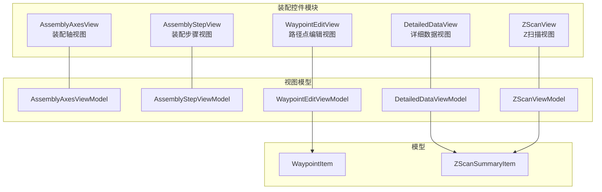
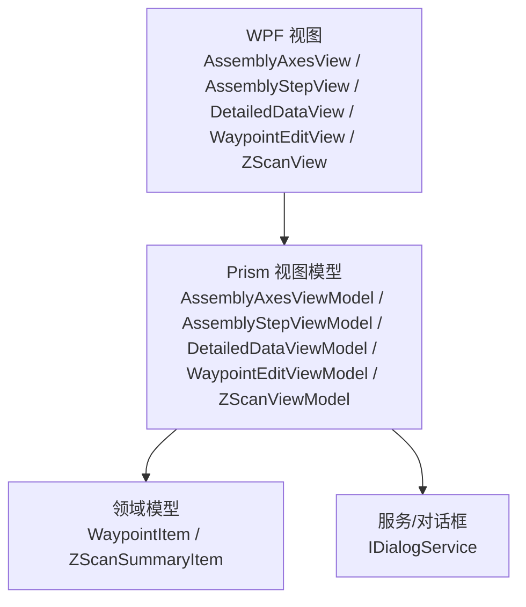
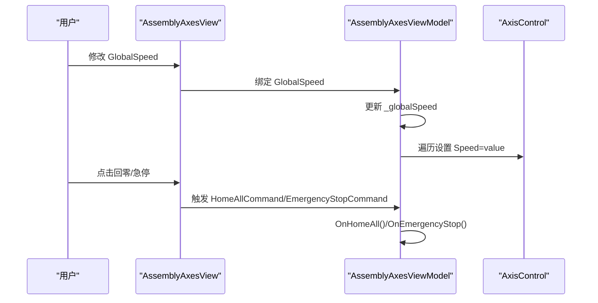
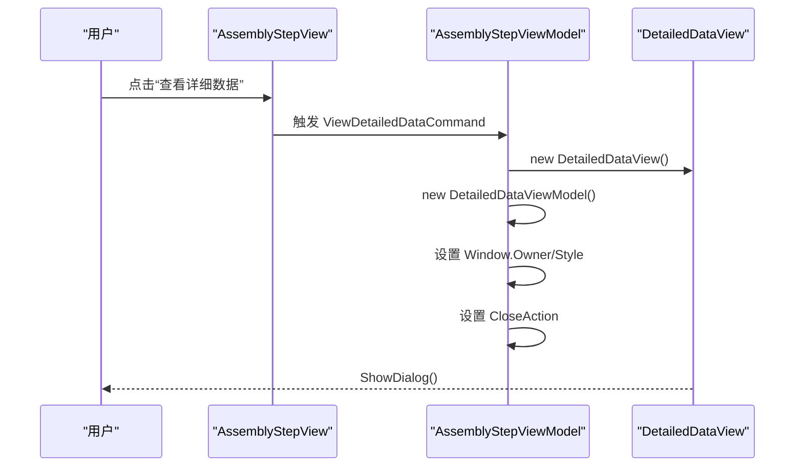
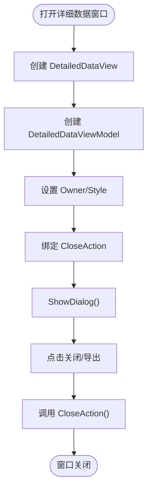
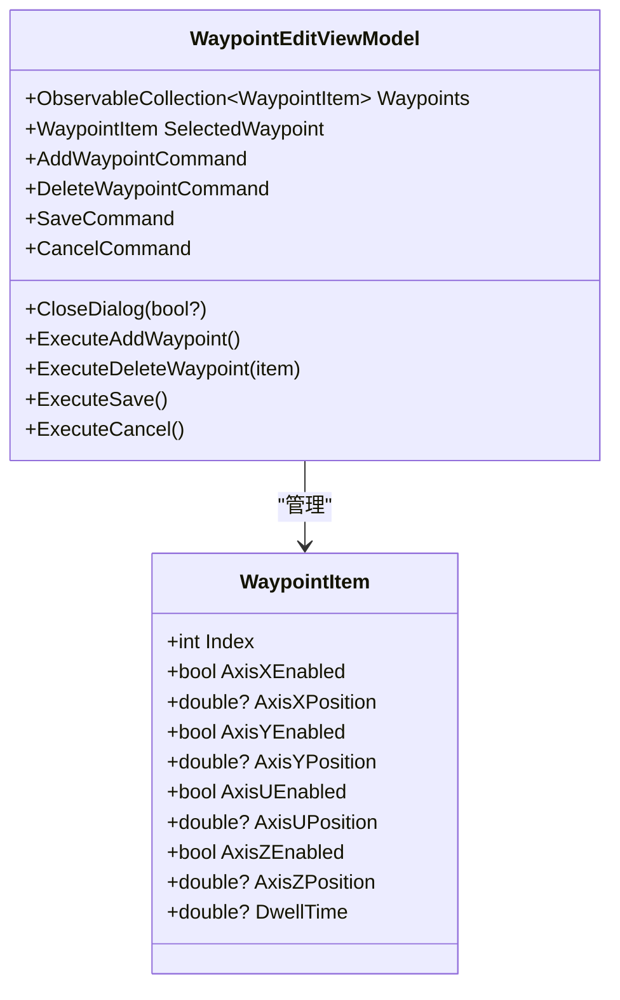
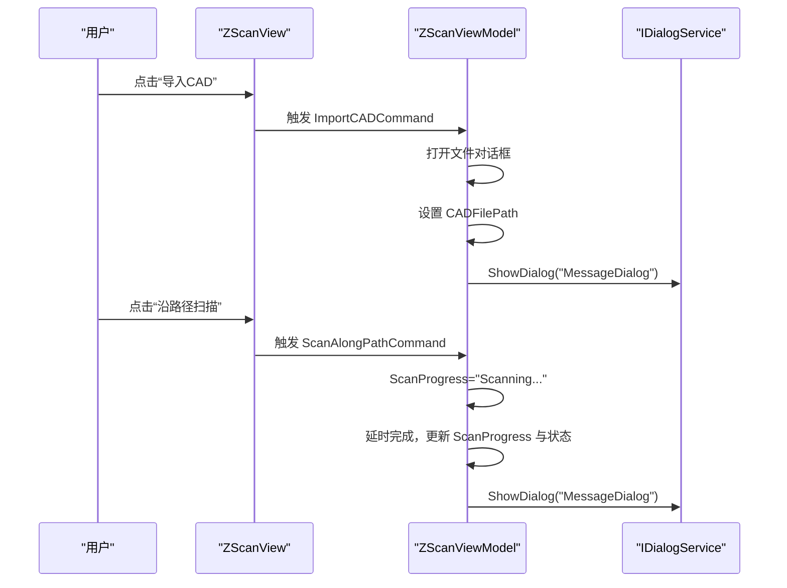
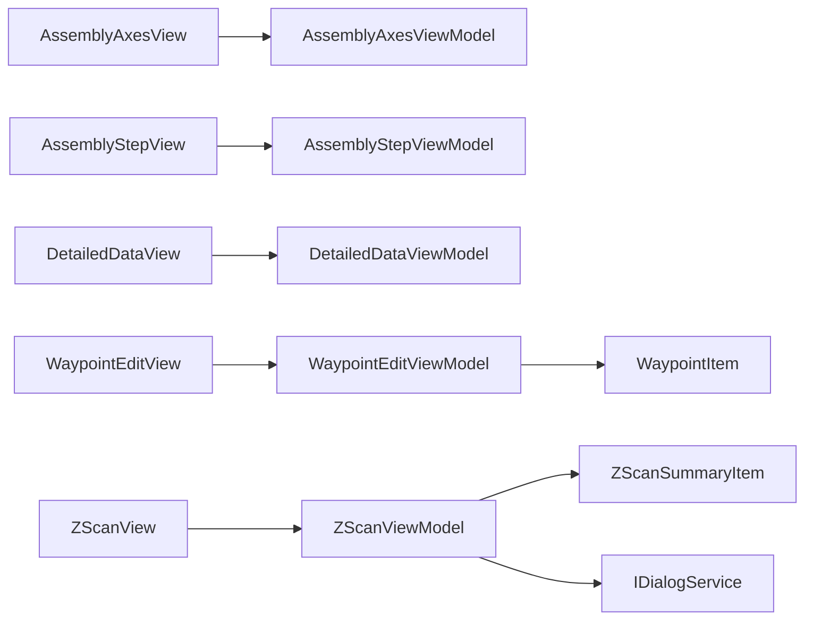

# 装配控件系统

<cite>
**本文引用的文件**
- [AssemblyAxesView.xaml](file://Module/Controls/Assembly/AssemblyAxesView.xaml)
- [AssemblyAxesView.xaml.cs](file://Module/Controls/Assembly/AssemblyAxesView.xaml.cs)
- [AssemblyAxesViewModel.cs](file://Module/Controls/Assembly/AssemblyAxesViewModel.cs)
- [AssemblyStepView.xaml](file://Module/Controls/Assembly/AssemblyStepView.xaml)
- [AssemblyStepView.xaml.cs](file://Module/Controls/Assembly/AssemblyStepView.xaml.cs)
- [AssemblyStepViewModel.cs](file://Module/Controls/Assembly/AssemblyStepViewModel.cs)
- [DetailedDataView.xaml](file://Module/Controls/Assembly/DetailedDataView.xaml)
- [DetailedDataView.xaml.cs](file://Module/Controls/Assembly/DetailedDataView.xaml.cs)
- [DetailedDataViewModel.cs](file://Module/Controls/Assembly/DetailedDataViewModel.cs)
- [WaypointEditView.xaml](file://Module/Controls/Assembly/WaypointEditView.xaml)
- [WaypointEditView.xaml.cs](file://Module/Controls/Assembly/WaypointEditView.xaml.cs)
- [WaypointEditViewModel.cs](file://Module/Controls/Assembly/WaypointEditViewModel.cs)
- [ZScanView.xaml](file://Module/Controls/Assembly/ZScanView.xaml)
- [ZScanView.xaml.cs](file://Module/Controls/Assembly/ZScanView.xaml.cs)
- [ZScanViewModel.cs](file://Module/Controls/Assembly/ZScanViewModel.cs)
- [WaypointItem.cs](file://Module/Models/WaypointItem.cs)
- [ZScanSummaryItem.cs](file://Module/Models/ZScanSummaryItem.cs)
</cite>

## 目录
1. [简介](#简介)
2. [项目结构](#项目结构)
3. [核心组件](#核心组件)
4. [架构总览](#架构总览)
5. [详细组件分析](#详细组件分析)
6. [依赖分析](#依赖分析)
7. [性能考虑](#性能考虑)
8. [故障排查指南](#故障排查指南)
9. [结论](#结论)
10. [附录](#附录)

## 简介
本文件面向装配控件系统，围绕装配轴控件（AssemblyAxesView）、装配步骤控件（AssemblyStepView）、详细数据显示控件（DetailedDataView）、路径点编辑控件（WaypointEditView）、Z扫描控件（ZScanView）等核心功能控件进行深入技术解析。内容涵盖：
- 控件实现原理与使用方法
- 坐标控制、路径规划、姿态调整等装配过程关键模块
- 数据绑定机制、事件处理流程、状态同步逻辑
- 装配参数配置指南、调试方法与性能优化建议
- 实际装配场景的使用示例与最佳实践

## 项目结构
装配控件位于 Module/Controls/Assembly 目录下，采用 Prism MVVM 框架组织视图与视图模型，并通过 Prism 的 ViewModelLocator.AutoWireViewModel 实现自动绑定。模型层位于 Module/Models，封装了路径点与Z扫描明细等数据结构。

**图表来源**
- [AssemblyAxesView.xaml:1-119](file://Module/Controls/Assembly/AssemblyAxesView.xaml#L1-L119)
- [AssemblyStepView.xaml:1-444](file://Module/Controls/Assembly/AssemblyStepView.xaml#L1-L444)
- [DetailedDataView.xaml:1-179](file://Module/Controls/Assembly/DetailedDataView.xaml#L1-L179)
- [WaypointEditView.xaml:1-172](file://Module/Controls/Assembly/WaypointEditView.xaml#L1-L172)
- [ZScanView.xaml:1-30](file://Module/Controls/Assembly/ZScanView.xaml#L1-L30)
- [AssemblyAxesViewModel.cs:1-67](file://Module/Controls/Assembly/AssemblyAxesViewModel.cs#L1-L67)
- [AssemblyStepViewModel.cs:1-268](file://Module/Controls/Assembly/AssemblyStepViewModel.cs#L1-L268)
- [DetailedDataViewModel.cs:1-204](file://Module/Controls/Assembly/DetailedDataViewModel.cs#L1-L204)
- [WaypointEditViewModel.cs:1-70](file://Module/Controls/Assembly/WaypointEditViewModel.cs#L1-L70)
- [ZScanViewModel.cs:1-204](file://Module/Controls/Assembly/ZScanViewModel.cs#L1-L204)
- [WaypointItem.cs:1-38](file://Module/Models/WaypointItem.cs#L1-L38)
- [ZScanSummaryItem.cs:1-203](file://Module/Models/ZScanSummaryItem.cs#L1-L203)

**章节来源**
- [AssemblyAxesView.xaml:1-119](file://Module/Controls/Assembly/AssemblyAxesView.xaml#L1-L119)
- [AssemblyStepView.xaml:1-444](file://Module/Controls/Assembly/AssemblyStepView.xaml#L1-L444)
- [DetailedDataView.xaml:1-179](file://Module/Controls/Assembly/DetailedDataView.xaml#L1-L179)
- [WaypointEditView.xaml:1-172](file://Module/Controls/Assembly/WaypointEditView.xaml#L1-L172)
- [ZScanView.xaml:1-30](file://Module/Controls/Assembly/ZScanView.xaml#L1-L30)

## 核心组件
本节概述各控件职责与关键特性：
- 装配轴控件（AssemblyAxesView/ViewModel）
  - 提供全局速度设置与各轴 Jog、回零、急停等操作入口
  - 支持轴列表动态更新与全局速度联动
- 装配步骤控件（AssemblyStepView/ViewModel）
  - 覆盖站点移动、视觉定位、对位补偿、执行装配、UV固化、检测与导出等完整装配流程
  - 内置强度曲线配置与力传感器数据展示
- 详细数据显示控件（DetailedDataView/ViewModel）
  - 展示装配检测与测量的详细记录，支持导出与关闭
- 路径点编辑控件（WaypointEditView/ViewModel）
  - 编辑装配路径的关键点（X/Y/U/Z启用与位置、停留时间），支持新增、删除与保存
- Z扫描控件（ZScanView/ViewModel）
  - 导入CAD路径、按密度扫描、查看明细、提交修正，支持扫描进度与状态管理

**章节来源**
- [AssemblyAxesViewModel.cs:1-67](file://Module/Controls/Assembly/AssemblyAxesViewModel.cs#L1-L67)
- [AssemblyStepViewModel.cs:1-268](file://Module/Controls/Assembly/AssemblyStepViewModel.cs#L1-L268)
- [DetailedDataViewModel.cs:1-204](file://Module/Controls/Assembly/DetailedDataViewModel.cs#L1-L204)
- [WaypointEditViewModel.cs:1-70](file://Module/Controls/Assembly/WaypointEditViewModel.cs#L1-L70)
- [ZScanViewModel.cs:1-204](file://Module/Controls/Assembly/ZScanViewModel.cs#L1-L204)

## 架构总览
装配控件系统遵循 Prism MVVM 架构，视图通过绑定到对应的 ViewModel，ViewModel 使用 Prism.Commands.DelegateCommand 绑定命令，实现 UI 与业务逻辑解耦；模型层提供数据结构与状态枚举，支撑视图渲染与业务规则。

**图表来源**
- [AssemblyAxesView.xaml:7-7](file://Module/Controls/Assembly/AssemblyAxesView.xaml#L7-L7)
- [AssemblyStepView.xaml:7-10](file://Module/Controls/Assembly/AssemblyStepView.xaml#L7-L10)
- [DetailedDataView.xaml:6-8](file://Module/Controls/Assembly/DetailedDataView.xaml#L6-L8)
- [WaypointEditView.xaml:6-8](file://Module/Controls/Assembly/WaypointEditView.xaml#L6-L8)
- [ZScanView.xaml:5-7](file://Module/Controls/Assembly/ZScanView.xaml#L5-L7)
- [AssemblyAxesViewModel.cs:1-67](file://Module/Controls/Assembly/AssemblyAxesViewModel.cs#L1-L67)
- [AssemblyStepViewModel.cs:1-268](file://Module/Controls/Assembly/AssemblyStepViewModel.cs#L1-L268)
- [DetailedDataViewModel.cs:1-204](file://Module/Controls/Assembly/DetailedDataViewModel.cs#L1-L204)
- [WaypointEditViewModel.cs:1-70](file://Module/Controls/Assembly/WaypointEditViewModel.cs#L1-L70)
- [ZScanViewModel.cs:1-204](file://Module/Controls/Assembly/ZScanViewModel.cs#L1-L204)
- [WaypointItem.cs:1-38](file://Module/Models/WaypointItem.cs#L1-L38)
- [ZScanSummaryItem.cs:1-203](file://Module/Models/ZScanSummaryItem.cs#L1-L203)

## 详细组件分析

### 装配轴控件（AssemblyAxesView/AssemblyAxesViewModel）
- 数据绑定机制
  - 视图通过 Prism 自动绑定，ViewModel 暴露 Axes 集合与 GlobalSpeed 属性
  - GlobalSpeed 变更时，循环更新每个轴的速度，实现全局联动
- 事件处理流程
  - 回零与急停命令分别触发 OnHomeAll 与 OnEmergencyStop
- 状态同步逻辑
  - 轴控件内部维护轴名、当前位置、速度、步长与操作命令
- 使用方法
  - 在装配前设置全局速度，选择步长，逐轴 Jog 对位，最后回零或急停

**图表来源**
- [AssemblyAxesView.xaml:20-35](file://Module/Controls/Assembly/AssemblyAxesView.xaml#L20-L35)
- [AssemblyAxesView.xaml:55-93](file://Module/Controls/Assembly/AssemblyAxesView.xaml#L55-L93)
- [AssemblyAxesViewModel.cs:14-25](file://Module/Controls/Assembly/AssemblyAxesViewModel.cs#L14-L25)
- [AssemblyAxesViewModel.cs:53-62](file://Module/Controls/Assembly/AssemblyAxesViewModel.cs#L53-L62)

**章节来源**
- [AssemblyAxesView.xaml:1-119](file://Module/Controls/Assembly/AssemblyAxesView.xaml#L1-L119)
- [AssemblyAxesViewModel.cs:1-67](file://Module/Controls/Assembly/AssemblyAxesViewModel.cs#L1-L67)

### 装配步骤控件（AssemblyStepView/AssemblyStepViewModel）
- 数据绑定机制
  - 视图通过 Prism 自动绑定，ViewModel 暴露站点、特征、UV头、强度曲线等集合与属性
  - 强度曲线使用 IntensityStage 模型，支持动态编辑持续时间与功率
- 事件处理流程
  - 每个按钮对应一个命令，命令实现为简单消息提示或打开详细数据窗口
  - ViewDetailedDataCommand 动态创建 DetailedDataView 窗口并传入 ViewModel
- 状态同步逻辑
  - 实时位置、补偿、轴状态、偏差、最终位置等均以字符串形式展示，便于调试与监控
- 使用方法
  - 选择站点与特征，移动相机并拍照，执行对位与装配，配置UV固化参数并启动固化

**图表来源**
- [AssemblyStepView.xaml:310-320](file://Module/Controls/Assembly/AssemblyStepView.xaml#L310-L320)
- [AssemblyStepViewModel.cs:230-265](file://Module/Controls/Assembly/AssemblyStepViewModel.cs#L230-L265)

**章节来源**
- [AssemblyStepView.xaml:1-444](file://Module/Controls/Assembly/AssemblyStepView.xaml#L1-L444)
- [AssemblyStepViewModel.cs:1-268](file://Module/Controls/Assembly/AssemblyStepViewModel.cs#L1-L268)

### 详细数据显示控件（DetailedDataView/DetailedDataViewModel）
- 数据绑定机制
  - 视图绑定 MeasurementRecords 集合，列头与格式化显示由资源字典与样式控制
  - 使用 CloseCommand 关闭窗口，CloseAction 由调用方设置
- 使用方法
  - 从装配步骤控件打开，查看每条装配记录的详细指标（周期时间、力传感器、IPQC等）

**图表来源**
- [DetailedDataView.xaml:12-177](file://Module/Controls/Assembly/DetailedDataView.xaml#L12-L177)
- [DetailedDataViewModel.cs:20-32](file://Module/Controls/Assembly/DetailedDataViewModel.cs#L20-L32)

**章节来源**
- [DetailedDataView.xaml:1-179](file://Module/Controls/Assembly/DetailedDataView.xaml#L1-L179)
- [DetailedDataViewModel.cs:1-204](file://Module/Controls/Assembly/DetailedDataViewModel.cs#L1-L204)

### 路径点编辑控件（WaypointEditView/WaypointEditViewModel）
- 数据绑定机制
  - 视图绑定 Waypoints 集合，每行包含 X/Y/U/Z 轴启用与位置、停留时间
  - 删除按钮通过 RelativeSource 获取父级 DataGrid 的命令参数
- 事件处理流程
  - AddWaypointCommand 新增路径点并重新编号
  - DeleteWaypointCommand 删除选中项并重排索引
  - Save/Cancel 通过 CloseDialog 回调通知调用方
- 使用方法
  - 在装配路径中添加关键点，设置各轴启用与位置、停留时间，保存后用于运动控制

**图表来源**
- [WaypointEditViewModel.cs:10-70](file://Module/Controls/Assembly/WaypointEditViewModel.cs#L10-L70)
- [WaypointItem.cs:5-38](file://Module/Models/WaypointItem.cs#L5-L38)

**章节来源**
- [WaypointEditView.xaml:1-172](file://Module/Controls/Assembly/WaypointEditView.xaml#L1-L172)
- [WaypointEditViewModel.cs:1-70](file://Module/Controls/Assembly/WaypointEditViewModel.cs#L1-L70)
- [WaypointItem.cs:1-38](file://Module/Models/WaypointItem.cs#L1-L38)

### Z扫描控件（ZScanView/ZScanViewModel）
- 数据绑定机制
  - 视图嵌入 ZScanDetailView（通过 Prism 自动绑定 ViewModel），自身仅负责容器与滚动
  - ViewModel 暴露点密度、CAD路径、扫描目标、阈值、进度、是否启用修正等参数
- 事件处理流程
  - ImportCAD：打开文件对话框，设置 CADFilePath 并弹出消息
  - ScanAlongPath：模拟扫描任务，完成后更新状态并提示
  - ViewDetail：根据选中项打开 ZScanDetailView 对话框
  - CommitCorrections：提交修正至运动程序
- 使用方法
  - 导入CAD路径，选择扫描密度与目标站点，执行扫描，查看明细并提交修正

**图表来源**
- [ZScanView.xaml:14-28](file://Module/Controls/Assembly/ZScanView.xaml#L14-L28)
- [ZScanViewModel.cs:127-178](file://Module/Controls/Assembly/ZScanViewModel.cs#L127-L178)

**章节来源**
- [ZScanView.xaml:1-30](file://Module/Controls/Assembly/ZScanView.xaml#L1-L30)
- [ZScanViewModel.cs:1-204](file://Module/Controls/Assembly/ZScanViewModel.cs#L1-L204)

## 依赖分析
- 视图与视图模型
  - 通过 Prism.ViewModelLocator.AutoWireViewModel 自动绑定，降低耦合
- 视图模型与模型
  - WaypointEditViewModel 依赖 WaypointItem；ZScanViewModel 依赖 ZScanSummaryItem
- 服务依赖
  - ZScanViewModel 注入 IDialogService，用于统一的消息与详情对话框展示
- 耦合与内聚
  - 控件职责清晰，命令驱动，数据模型轻量，内聚性良好
  - 存在少量视图间交互（如装配步骤打开详细数据），通过窗口与命令回调实现

**图表来源**
- [AssemblyAxesView.xaml:7-7](file://Module/Controls/Assembly/AssemblyAxesView.xaml#L7-L7)
- [AssemblyStepView.xaml:7-10](file://Module/Controls/Assembly/AssemblyStepView.xaml#L7-L10)
- [DetailedDataView.xaml:6-8](file://Module/Controls/Assembly/DetailedDataView.xaml#L6-L8)
- [WaypointEditView.xaml:6-8](file://Module/Controls/Assembly/WaypointEditView.xaml#L6-L8)
- [ZScanView.xaml:5-7](file://Module/Controls/Assembly/ZScanView.xaml#L5-L7)
- [WaypointEditViewModel.cs:1-70](file://Module/Controls/Assembly/WaypointEditViewModel.cs#L1-L70)
- [ZScanViewModel.cs:14-56](file://Module/Controls/Assembly/ZScanViewModel.cs#L14-L56)
- [WaypointItem.cs:1-38](file://Module/Models/WaypointItem.cs#L1-L38)
- [ZScanSummaryItem.cs:1-203](file://Module/Models/ZScanSummaryItem.cs#L1-L203)

**章节来源**
- [WaypointEditViewModel.cs:1-70](file://Module/Controls/Assembly/WaypointEditViewModel.cs#L1-L70)
- [ZScanViewModel.cs:1-204](file://Module/Controls/Assembly/ZScanViewModel.cs#L1-L204)

## 性能考虑
- 数据绑定优化
  - 使用 OneWay 绑定静态列（如序号），减少不必要的回写开销
  - 对大表格启用虚拟化（DataGrid 默认启用）与最小列宽，避免过度重绘
- 命令与异步
  - 长耗时操作（如扫描）应使用后台线程与进度反馈，避免阻塞 UI
- 资源与样式
  - 使用共享资源字典与 MaterialDesign 样式，减少重复定义
- 内存与对象生命周期
  - ViewModel 与 Model 使用 ObservableCollection，注意及时释放窗口与回调委托

## 故障排查指南
- 常见问题
  - 命令不生效：检查 Prism 自动绑定是否启用，命令构造是否正确
  - 数据不刷新：确认属性 setter 是否调用 SetProperty，UI 是否启用 TwoWay 绑定
  - 窗口无法关闭：确保 CloseAction 已设置，且调用方正确传递窗口实例
- 调试建议
  - 使用即时窗口观察绑定路径与值变化
  - 为命令添加日志或消息提示，验证触发链路
  - 对复杂流程（如扫描）增加中间状态提示，便于定位卡顿点

**章节来源**
- [AssemblyStepViewModel.cs:230-265](file://Module/Controls/Assembly/AssemblyStepViewModel.cs#L230-L265)
- [ZScanViewModel.cs:127-178](file://Module/Controls/Assembly/ZScanViewModel.cs#L127-L178)

## 结论
装配控件系统以 Prism MVVM 为核心，实现了装配轴控制、步骤流程、数据展示、路径编辑与Z扫描等关键功能。通过清晰的职责划分、命令驱动与数据绑定，系统具备良好的可维护性与扩展性。建议在后续迭代中引入更多真实设备交互与状态机，进一步提升装配自动化与可视化能力。

## 附录
- 实际装配场景使用示例（步骤说明）
  - 装配轴准备：设置全局速度，选择步长，逐轴 Jog 对位，回零
  - 步骤流程：选择站点与特征，移动相机拍照，执行对位与装配，配置UV参数并固化
  - 数据查看：点击“查看详细数据”，导出CSV
  - 路径编辑：新增路径点，设置启用轴与位置，保存
  - Z扫描：导入CAD，选择密度与目标，扫描并查看明细，提交修正
- 最佳实践
  - 将复杂命令拆分为多个小命令，便于测试与复用
  - 对外设交互采用异步与超时机制，保证UI响应
  - 使用统一的对话框服务（IDialogService）管理消息与详情窗口