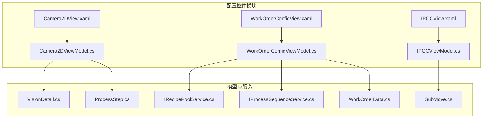
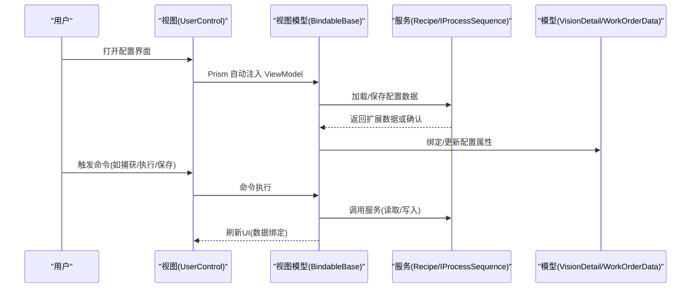
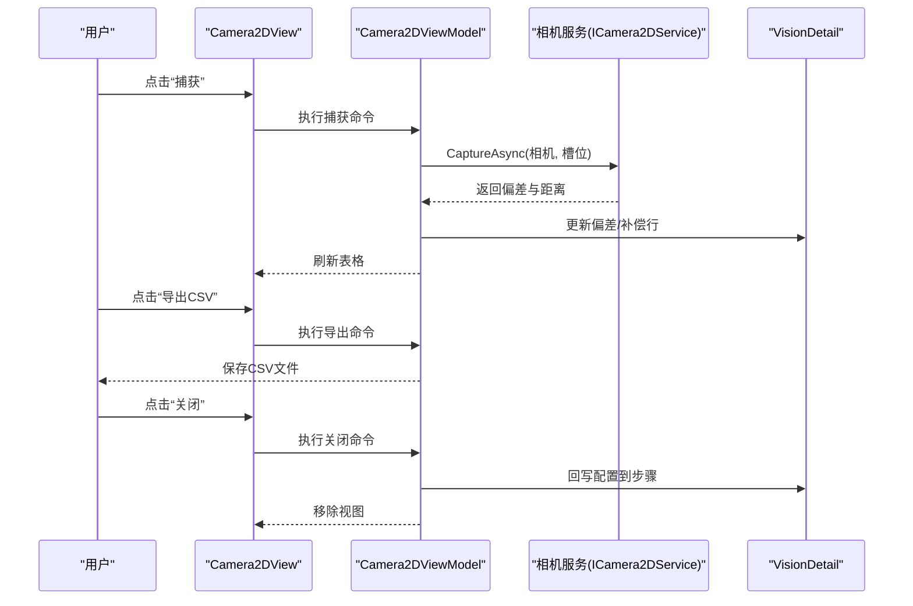
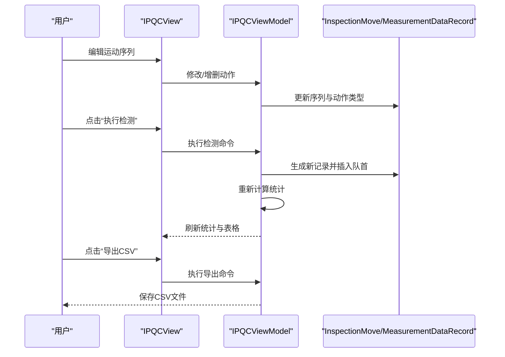
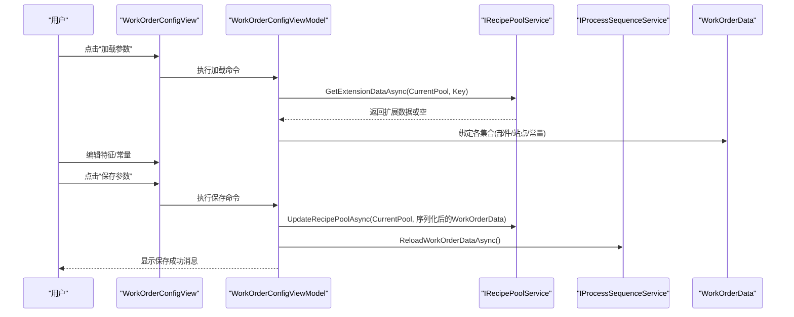
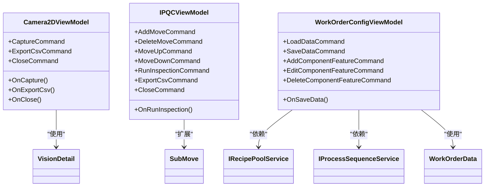

# 配置控件系统

<cite>
**本文引用的文件**
- [Camera2DView.xaml](file://Module/Controls/Configuration/Camera2DView.xaml)
- [Camera2DView.xaml.cs](file://Module/Controls/Configuration/Camera2DView.xaml.cs)
- [Camera2DViewModel.cs](file://Module/Controls/Configuration/Camera2DViewModel.cs)
- [IPQCView.xaml](file://Module/Controls/Configuration/IPQCView.xaml)
- [IPQCView.xaml.cs](file://Module/Controls/Configuration/IPQCView.xaml.cs)
- [IPQCViewModel.cs](file://Module/Controls/Configuration/IPQCViewModel.cs)
- [WorkOrderConfigView.xaml](file://Module/Controls/Configuration/WorkOrderConfigView.xaml)
- [WorkOrderConfigView.xaml.cs](file://Module/Controls/Configuration/WorkOrderConfigView.xaml.cs)
- [WorkOrderConfigViewModel.cs](file://Module/Controls/Configuration/WorkOrderConfigViewModel.cs)
- [WorkOrderData.cs](file://Module/Models/WorkOrderData.cs)
- [SubMove.cs](file://StationTasks/Models/SubMove.cs)
- [VisionDetail.cs](file://StationTasks/Models/VisionDetail.cs)
- [ProcessStep.cs](file://StationTasks/Models/ProcessStep.cs)
- [IRecipePoolService.cs](file://Recipe/Interfaces/IRecipePoolService.cs)
- [IProcessSequenceService.cs](file://Module/Services/IProcessSequenceService.cs)
</cite>

## 目录
1. [简介](#简介)
2. [项目结构](#项目结构)
3. [核心组件](#核心组件)
4. [架构总览](#架构总览)
5. [详细组件分析](#详细组件分析)
6. [依赖关系分析](#依赖关系分析)
7. [性能考量](#性能考量)
8. [故障排查指南](#故障排查指南)
9. [结论](#结论)
10. [附录](#附录)

## 简介
本文件系统性梳理配置控件系统，聚焦三大核心配置界面：2D相机配置控件（Camera2DView）、IPQC质量控制配置控件（IPQCView）、工单配置控件（WorkOrderConfigView）。文档从架构、数据流、处理逻辑、集成点、错误处理与性能等方面进行深入解析，并提供参数验证机制、默认值管理、配置继承规则的技术实现说明，以及配置参数调优、模板使用与迁移策略建议。

## 项目结构
配置控件位于 Module 控制器层，采用 Prism 区域导航 + MVVM 模式，视图与视图模型一一对应，通过 Prism 的自动绑定机制完成数据绑定与命令注入。核心配置数据通过配方池服务持久化，支持按配方池隔离的配置管理。

**图表来源**
- [Camera2DView.xaml:1-116](file://Module/Controls/Configuration/Camera2DView.xaml#L1-L116)
- [IPQCView.xaml:1-187](file://Module/Controls/Configuration/IPQCView.xaml#L1-L187)
- [WorkOrderConfigView.xaml:1-296](file://Module/Controls/Configuration/WorkOrderConfigView.xaml#L1-L296)
- [Camera2DViewModel.cs:1-254](file://Module/Controls/Configuration/Camera2DViewModel.cs#L1-L254)
- [IPQCViewModel.cs:1-345](file://Module/Controls/Configuration/IPQCViewModel.cs#L1-L345)
- [WorkOrderConfigViewModel.cs:1-570](file://Module/Controls/Configuration/WorkOrderConfigViewModel.cs#L1-L570)
- [VisionDetail.cs](file://StationTasks/Models/VisionDetail.cs)
- [ProcessStep.cs](file://StationTasks/Models/ProcessStep.cs)
- [IRecipePoolService.cs](file://Recipe/Interfaces/IRecipePoolService.cs)
- [IProcessSequenceService.cs](file://Module/Services/IProcessSequenceService.cs)
- [WorkOrderData.cs](file://Module/Models/WorkOrderData.cs)
- [SubMove.cs](file://StationTasks/Models/SubMove.cs)

**章节来源**
- [Camera2DView.xaml:1-116](file://Module/Controls/Configuration/Camera2DView.xaml#L1-L116)
- [IPQCView.xaml:1-187](file://Module/Controls/Configuration/IPQCView.xaml#L1-L187)
- [WorkOrderConfigView.xaml:1-296](file://Module/Controls/Configuration/WorkOrderConfigView.xaml#L1-L296)

## 核心组件
- 2D相机配置控件（Camera2DView + Camera2DViewModel）
  - 功能：选择相机与部件槽位，采集实时偏差数据，导出CSV，关闭时回写到步骤配置。
  - 关键点：支持捕获命令、导出CSV、关闭时持久化；默认示例数据用于演示。
- IPQC质量控制配置控件（IPQCView + IPQCViewModel）
  - 功能：配置站点、检查类型、相机、公差阈值与重试次数；维护检测运动序列；展示统计与测量明细；执行检测并更新结果。
  - 关键点：运动序列支持增删改序；检测结果统计动态刷新。
- 工单配置控件（WorkOrderConfigView + WorkOrderConfigViewModel）
  - 功能：管理部件特征、站点特征、设备常量（相机、用途、轴）；与配方池联动，支持加载/保存；与流程序列服务同步。
  - 关键点：基于配方池扩展数据存储；分组与特征编辑通过对话框实现；保存后触发序列服务重载。

**章节来源**
- [Camera2DViewModel.cs:1-254](file://Module/Controls/Configuration/Camera2DViewModel.cs#L1-L254)
- [IPQCViewModel.cs:1-345](file://Module/Controls/Configuration/IPQCViewModel.cs#L1-L345)
- [WorkOrderConfigViewModel.cs:1-570](file://Module/Controls/Configuration/WorkOrderConfigViewModel.cs#L1-L570)

## 架构总览
配置控件采用“视图-视图模型-模型/服务”的分层架构，通过 Prism 区域导航承载视图，视图模型负责状态管理与命令，模型承载配置数据，服务负责持久化与跨模块协作。

**图表来源**
- [Camera2DView.xaml:1-116](file://Module/Controls/Configuration/Camera2DView.xaml#L1-L116)
- [IPQCView.xaml:1-187](file://Module/Controls/Configuration/IPQCView.xaml#L1-L187)
- [WorkOrderConfigView.xaml:1-296](file://Module/Controls/Configuration/WorkOrderConfigView.xaml#L1-L296)
- [Camera2DViewModel.cs:1-254](file://Module/Controls/Configuration/Camera2DViewModel.cs#L1-L254)
- [IPQCViewModel.cs:1-345](file://Module/Controls/Configuration/IPQCViewModel.cs#L1-L345)
- [WorkOrderConfigViewModel.cs:1-570](file://Module/Controls/Configuration/WorkOrderConfigViewModel.cs#L1-L570)

## 详细组件分析

### 2D相机配置控件（Camera2DView / Camera2DViewModel）
- 视图结构
  - 标题栏与关闭按钮
  - 相机与部件选择区
  - 相机数据表格（含偏差与补偿列）
  - 捕获、导出CSV、关闭按钮
- 视图模型职责
  - 初始化相机与槽位列表、默认选中项
  - 提供捕获命令：异步调用相机服务，更新偏差与补偿行
  - 提供导出命令：生成CSV文件
  - 关闭命令：将当前配置回写至步骤的视觉详情对象
  - 导航感知：从导航上下文读取步骤信息，初始化或恢复配置
- 数据模型
  - 使用视觉详情模型承载相机与数据行集合
  - 支持示例数据以演示表格布局与格式

**图表来源**
- [Camera2DView.xaml:1-116](file://Module/Controls/Configuration/Camera2DView.xaml#L1-L116)
- [Camera2DViewModel.cs:1-254](file://Module/Controls/Configuration/Camera2DViewModel.cs#L1-L254)
- [VisionDetail.cs](file://StationTasks/Models/VisionDetail.cs)
- [ProcessStep.cs](file://StationTasks/Models/ProcessStep.cs)

**章节来源**
- [Camera2DView.xaml:1-116](file://Module/Controls/Configuration/Camera2DView.xaml#L1-L116)
- [Camera2DViewModel.cs:1-254](file://Module/Controls/Configuration/Camera2DViewModel.cs#L1-L254)

### IPQC质量控制配置控件（IPQCView / IPQCViewModel）
- 视图结构
  - IPQC参数配置区（站点、检查类型、相机、公差、重试）
  - 检测运动序列表格（轴、目标偏移、速度、动作类型、描述）
  - 检测结果统计与明细表格
  - 执行检测、导出CSV、关闭按钮
- 视图模型职责
  - 维护站点、检查类型、相机、公差、重试等参数
  - 维护运动序列（增删改序），支持动作类型扩展
  - 维护测量数据集合与统计（总数、通过数、失败数、最后测量时间）
  - 执行检测：模拟新增一条测量记录并更新统计
  - 导出CSV：输出测量数据
  - 关闭：移除视图
- 数据模型
  - 运动步骤模型扩展自子移动模型，增加动作类型字段
  - 测量记录模型包含时间戳、装配号、状态、操作员、配方、周期时间、执行器序列与ID、关键尺寸与力值等

**图表来源**
- [IPQCView.xaml:1-187](file://Module/Controls/Configuration/IPQCView.xaml#L1-L187)
- [IPQCViewModel.cs:1-345](file://Module/Controls/Configuration/IPQCViewModel.cs#L1-L345)
- [SubMove.cs](file://StationTasks/Models/SubMove.cs)

**章节来源**
- [IPQCView.xaml:1-187](file://Module/Controls/Configuration/IPQCView.xaml#L1-L187)
- [IPQCViewModel.cs:1-345](file://Module/Controls/Configuration/IPQCViewModel.cs#L1-L345)

### 工单配置控件（WorkOrderConfigView / WorkOrderConfigViewModel）
- 视图结构
  - 工具栏：显示当前配方池名称，提供加载/保存参数
  - 标签页：部件特征、站点特征、设备常量（相机、用途、轴）
- 视图模型职责
  - 订阅配方池服务的当前池名变更事件，自动刷新数据
  - 提供加载/保存命令：从配方池扩展数据读取或写入
  - 提供部件与站点的增删改命令，通过对话框编辑特征与分组
  - 提供设备常量的增删改命令
  - 保存后调用流程序列服务重载工单数据，保证下拉选项同步
- 数据模型
  - 工单数据模型包含部件、站点、相机常量、用途常量、轴常量集合
  - 站点特征类型枚举与选项集合

**图表来源**
- [WorkOrderConfigView.xaml:1-296](file://Module/Controls/Configuration/WorkOrderConfigView.xaml#L1-L296)
- [WorkOrderConfigViewModel.cs:1-570](file://Module/Controls/Configuration/WorkOrderConfigViewModel.cs#L1-L570)
- [IRecipePoolService.cs](file://Recipe/Interfaces/IRecipePoolService.cs)
- [IProcessSequenceService.cs](file://Module/Services/IProcessSequenceService.cs)
- [WorkOrderData.cs](file://Module/Models/WorkOrderData.cs)

**章节来源**
- [WorkOrderConfigView.xaml:1-296](file://Module/Controls/Configuration/WorkOrderConfigView.xaml#L1-L296)
- [WorkOrderConfigViewModel.cs:1-570](file://Module/Controls/Configuration/WorkOrderConfigViewModel.cs#L1-L570)

## 依赖关系分析
- 视图与视图模型
  - 通过 Prism 的 ViewModelLocator 自动关联，减少显式构造与注入成本
- 视图模型与服务
  - 工单配置：依赖配方池服务与流程序列服务，实现配置持久化与同步
  - 2D相机配置：依赖相机服务接口（模拟实现），实际相机服务需在运行时注入
  - IPQC配置：依赖运动序列与测量模型，不直接依赖硬件
- 视图模型与模型
  - 2D相机配置：依赖视觉详情模型承载相机与数据行
  - IPQC配置：依赖运动步骤与测量记录模型
  - 工单配置：依赖工单数据模型承载部件、站点与常量

**图表来源**
- [Camera2DViewModel.cs:1-254](file://Module/Controls/Configuration/Camera2DViewModel.cs#L1-L254)
- [IPQCViewModel.cs:1-345](file://Module/Controls/Configuration/IPQCViewModel.cs#L1-L345)
- [WorkOrderConfigViewModel.cs:1-570](file://Module/Controls/Configuration/WorkOrderConfigViewModel.cs#L1-L570)
- [IRecipePoolService.cs](file://Recipe/Interfaces/IRecipePoolService.cs)
- [IProcessSequenceService.cs](file://Module/Services/IProcessSequenceService.cs)
- [WorkOrderData.cs](file://Module/Models/WorkOrderData.cs)
- [SubMove.cs](file://StationTasks/Models/SubMove.cs)

**章节来源**
- [Camera2DViewModel.cs:1-254](file://Module/Controls/Configuration/Camera2DViewModel.cs#L1-L254)
- [IPQCViewModel.cs:1-345](file://Module/Controls/Configuration/IPQCViewModel.cs#L1-L345)
- [WorkOrderConfigViewModel.cs:1-570](file://Module/Controls/Configuration/WorkOrderConfigViewModel.cs#L1-L570)

## 性能考量
- UI线程与异步
  - 捕获与保存均采用异步方式，避免阻塞UI线程
- 数据绑定与集合
  - 使用可观测集合承载表格数据，减少手动刷新
- CSV导出
  - 使用字符串构建器批量写入，降低IO开销
- 配置池读写
  - 仅在加载/保存时进行序列化与反序列化，避免频繁I/O

[本节为通用指导，无需特定文件来源]

## 故障排查指南
- 2D相机配置
  - 捕获失败：检查相机服务是否可用，查看日志输出
  - 导出失败：确认文件路径权限与磁盘空间
- IPQC配置
  - 执行检测无结果：确认运动序列是否为空，检查动作类型与轴定义
  - 统计异常：确认测量数据集合未被意外清空
- 工单配置
  - 加载失败：检查配方池扩展数据键是否存在，序列化格式是否正确
  - 保存失败：检查配方池服务状态与网络连接
  - 下拉选项不同步：确认保存后是否调用流程序列服务重载

**章节来源**
- [Camera2DViewModel.cs:160-192](file://Module/Controls/Configuration/Camera2DViewModel.cs#L160-L192)
- [IPQCViewModel.cs:241-276](file://Module/Controls/Configuration/IPQCViewModel.cs#L241-L276)
- [WorkOrderConfigViewModel.cs:266-294](file://Module/Controls/Configuration/WorkOrderConfigViewModel.cs#L266-L294)

## 结论
配置控件系统通过清晰的MVVM分层与Prism导航，实现了相机参数、质量标准、工单数据与设备常量的可视化配置与持久化。系统具备良好的扩展性与可维护性，建议在实际部署中结合硬件服务接口完善相机捕获逻辑，并持续优化配置模板与迁移策略以提升生产效率。

[本节为总结性内容，无需特定文件来源]

## 附录

### 配置数据验证机制
- 输入校验
  - 公差与速度等数值型参数可通过转换器与验证规则约束范围
  - 下拉列表限制可选值，避免非法输入
- 默认值管理
  - 视图模型在初始化时设置默认参数与示例数据
  - 未配置时回退到默认值，保证界面可用性
- 配置继承规则
  - 工单配置通过配方池扩展数据实现跨配方池共享
  - 步骤级配置（如2D相机）回写到步骤对象，实现步骤内继承

[本节为通用指导，无需特定文件来源]

### 配置参数调优指南
- 2D相机
  - 捕获频率与采样点数平衡精度与性能
  - 偏差补偿算法应结合历史数据校准
- IPQC
  - 公差阈值应基于历史测量分布设定，兼顾质量与效率
  - 运动序列应最小化非必要动作，缩短检测周期
- 工单配置
  - 特征与分组应遵循标准化命名规范，便于检索与复用
  - 常量表应定期评审，剔除冗余项

[本节为通用指导，无需特定文件来源]

### 配置模板使用方法
- 工单配置
  - 在“部件特征”与“站点特征”标签页中，通过对话框创建标准特征模板
  - 将常用“相机/用途/轴”常量沉淀为模板，复用到不同产品
- IPQC
  - 将典型运动序列保存为模板，按产品族快速套用
- 2D相机
  - 将常用相机与槽位组合保存为模板，便于快速切换

[本节为通用指导，无需特定文件来源]

### 配置迁移策略
- 工单配置
  - 通过配方池扩展数据键进行版本化管理，迁移时对比差异并合并
  - 迁移前备份当前池，迁移后验证关键特征与常量完整性
- IPQC
  - 运动序列采用文本化描述与编号，便于人工核对与迁移
- 2D相机
  - 将相机参数与补偿表导出为CSV，迁移后导入并校验一致性

[本节为通用指导，无需特定文件来源]