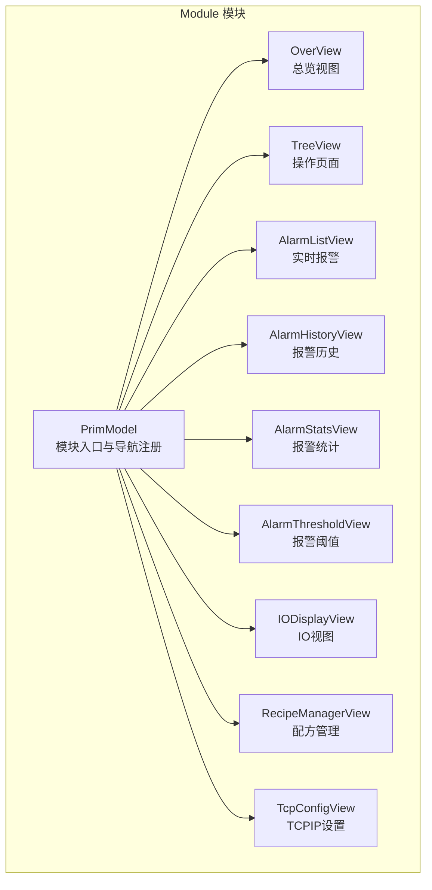
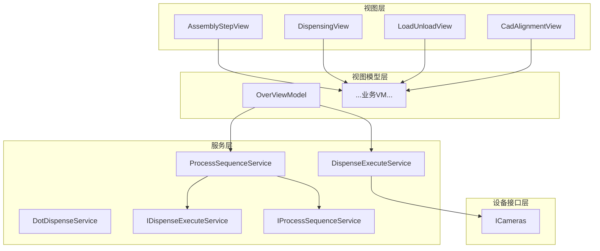
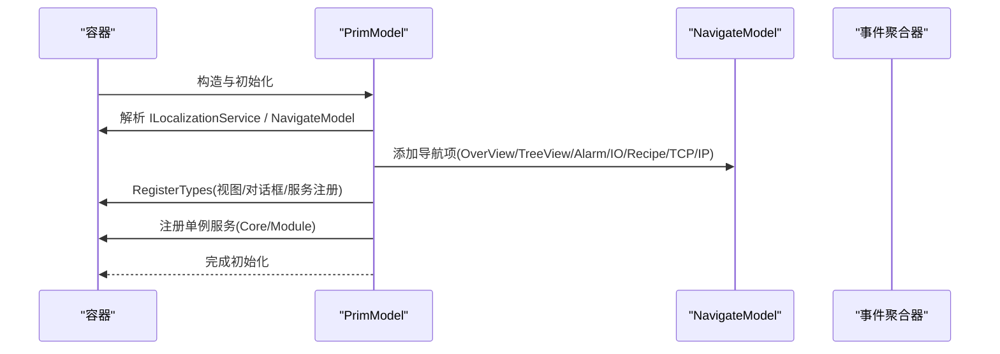
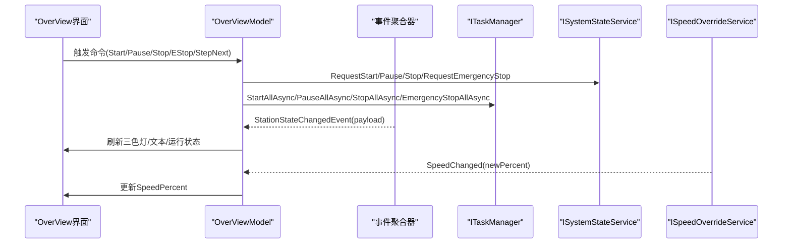
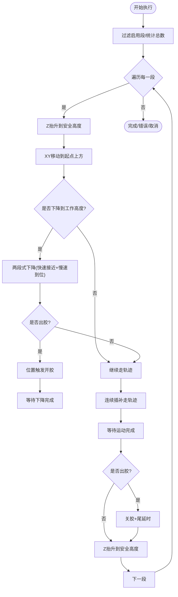
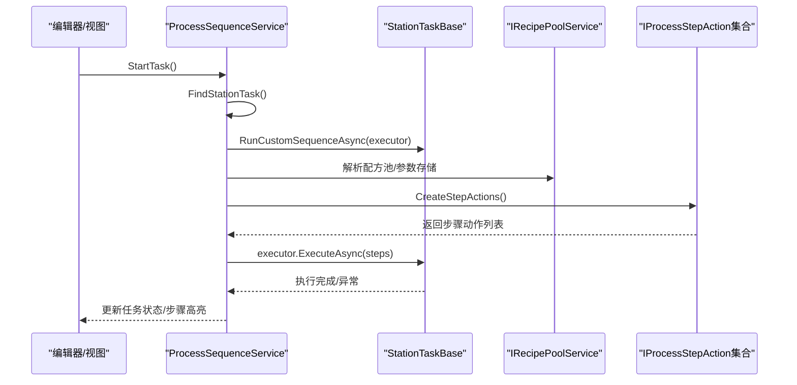
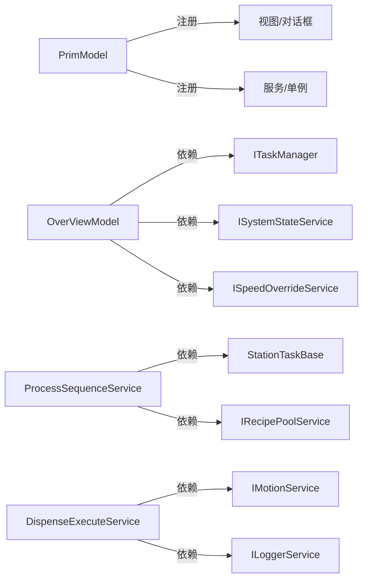

# 主功能模块 (Module)

<cite>
**本文档引用的文件**
- [PrimModel.cs](file://Module/PrimModel.cs)
- [OverViewModel.cs](file://Module/ViewModels/OverViewModel.cs)
- [ICameras.cs](file://Module/Devices/ICameras.cs)
- [IProcessSequenceService.cs](file://Module/Services/IProcessSequenceService.cs)
- [IDispenseExecuteService.cs](file://Module/Services/IDispenseExecuteService.cs)
- [DispenseExecuteService.cs](file://Module/Services/DispenseExecuteService.cs)
- [DotDispenseService.cs](file://Module/Services/DotDispenseService.cs)
- [ProcessSequenceService.cs](file://Module/Services/ProcessSequenceService.cs)
- [WaypointItem.cs](file://Module/Models/WaypointItem.cs)
- [AssemblyStepView.xaml](file://Module/Controls/Assembly/AssemblyStepView.xaml)
- [DispensingView.xaml](file://Module/Controls/Dispense/DispensingView.xaml)
- [LoadUnloadView.xaml](file://Module/Controls/Loading/LoadUnloadView.xaml)
- [CadAlignmentView.xaml](file://Module/Controls/Cad/CadAlignmentView.xaml)
</cite>

## 目录
1. [简介](#简介)
2. [项目结构](#项目结构)
3. [核心组件](#核心组件)
4. [架构总览](#架构总览)
5. [详细组件分析](#详细组件分析)
6. [依赖关系分析](#依赖关系分析)
7. [性能考虑](#性能考虑)
8. [故障排查指南](#故障排查指南)
9. [结论](#结论)
10. [附录](#附录)

## 简介
本文件面向“主功能模块（Module）”的技术文档，系统性阐述其作为业务功能载体的整体架构设计与实现要点。重点覆盖以下方面：
- 模块定义与初始化：PrimModel 的模块注册与导航构建
- 业务总览与控制：OverViewModel 的系统状态、速度与运行控制
- 设备接口抽象：ICameras 等设备接口契约
- 服务层实现：点胶执行、点胶点涂、流程序列等核心服务
- 业务控件：Assembly、Dispense、Loading、Cad 等视图与交互
- 配置参数、事件处理与状态管理
- 扩展机制、插件集成与自定义开发指南

## 项目结构
Module 模块采用 Prism 模块化架构，通过 IModule 接口进行注册与初始化，将导航视图、对话框、服务与核心能力注入到全局容器中。导航树由 PrimModel 在 OnInitialized 阶段构建，涵盖总览、操作页面、报警、IO、配方、TCPIP 设置等。

图表来源
- [PrimModel.cs:21-49](file://Module/PrimModel.cs#L21-L49)

章节来源
- [PrimModel.cs:21-116](file://Module/PrimModel.cs#L21-L116)

## 核心组件
- PrimModel：实现 IModule，负责模块初始化、导航项注册、视图与对话框注册、服务注册与单例绑定
- OverViewModel：总览页 VM，负责系统状态订阅、运行控制、速度调节、日志查看等
- 服务层：DispenseExecuteService、DotDispenseService、ProcessSequenceService 等
- 设备接口：ICameras 提供相机抽象
- 业务控件：AssemblyStepView、DispensingView、LoadUnloadView、CadAlignmentView 等

章节来源
- [PrimModel.cs:21-116](file://Module/PrimModel.cs#L21-L116)
- [OverViewModel.cs:19-255](file://Module/ViewModels/OverViewModel.cs#L19-L255)
- [ICameras.cs:7-28](file://Module/Devices/ICameras.cs#L7-L28)
- [IProcessSequenceService.cs:11-61](file://Module/Services/IProcessSequenceService.cs#L11-L61)
- [IDispenseExecuteService.cs:12-32](file://Module/Services/IDispenseExecuteService.cs#L12-L32)

## 架构总览
Module 模块采用分层架构：
- 视图层：XAML 控件与用户交互
- 视图模型层：MVVM 绑定与命令处理
- 服务层：业务流程与设备交互
- 设备接口层：抽象相机、IO、运动控制等硬件
- 核心与框架：跨模块复用的服务与模型

图表来源
- [PrimModel.cs:51-114](file://Module/PrimModel.cs#L51-L114)
- [OverViewModel.cs:95-130](file://Module/ViewModels/OverViewModel.cs#L95-L130)
- [DispenseExecuteService.cs:16-43](file://Module/Services/DispenseExecuteService.cs#L16-L43)
- [DotDispenseService.cs:17-39](file://Module/Services/DotDispenseService.cs#L17-L39)
- [ProcessSequenceService.cs:23-71](file://Module/Services/ProcessSequenceService.cs#L23-L71)
- [ICameras.cs:7-28](file://Module/Devices/ICameras.cs#L7-L28)

## 详细组件分析

### PrimModel 模块定义与导航
- 初始化阶段：注册导航项、设置默认视图、绑定本地化资源
- 注册阶段：注册对话框、导航视图、服务与单例绑定
- 关键职责：统一管理模块内视图、服务与依赖注入

图表来源
- [PrimModel.cs:23-49](file://Module/PrimModel.cs#L23-L49)
- [PrimModel.cs:51-114](file://Module/PrimModel.cs#L51-L114)

章节来源
- [PrimModel.cs:21-116](file://Module/PrimModel.cs#L21-L116)

### OverViewModel 总览与控制
- 绑定属性：系统时间、三色灯状态/文本、安全门颜色、运行状态、单步模式、速度百分比
- 命令：初始化、启动、暂停、恢复、停止、急停、切换单步、下一步、打开日志查看器
- 事件订阅：StationStateChangedEvent，驱动 UI 状态刷新
- 区域导航：挂载任务监控与速度控制子视图

图表来源
- [OverViewModel.cs:118-130](file://Module/ViewModels/OverViewModel.cs#L118-L130)
- [OverViewModel.cs:162-217](file://Module/ViewModels/OverViewModel.cs#L162-L217)
- [OverViewModel.cs:233-251](file://Module/ViewModels/OverViewModel.cs#L233-L251)

章节来源
- [OverViewModel.cs:19-255](file://Module/ViewModels/OverViewModel.cs#L19-L255)

### 设备接口抽象：ICameras
- 能力：初始化相机、获取单帧图像、错误与相机列表变更事件
- 用途：为视觉捕获、对焦、引导等场景提供统一接口

章节来源
- [ICameras.cs:7-28](file://Module/Devices/ICameras.cs#L7-L28)

### 服务层：点胶执行与序列控制

#### 点胶执行服务接口与实现
- 接口 IDispenseExecuteService：DryRunAsync、ExecutePathAsync、ExecuteSinglePointAsync、进度与状态事件
- 实现 DispenseExecuteService：统一空跑/走胶流程，两段式下降、位置触发开胶、IO 控制、异常安全处理

图表来源
- [DispenseExecuteService.cs:75-213](file://Module/Services/DispenseExecuteService.cs#L75-L213)
- [IDispenseExecuteService.cs:14-31](file://Module/Services/IDispenseExecuteService.cs#L14-L31)

章节来源
- [DispenseExecuteService.cs:16-292](file://Module/Services/DispenseExecuteService.cs#L16-L292)
- [IDispenseExecuteService.cs:12-32](file://Module/Services/IDispenseExecuteService.cs#L12-L32)

#### 点胶点涂服务：DotDispenseService
- 能力：空跑、真实点胶、示教、安全停止、等待轴停止
- 工艺：统一两段式下降、位置触发开胶、延时控制、IO 安全兜底

章节来源
- [DotDispenseService.cs:17-297](file://Module/Services/DotDispenseService.cs#L17-L297)

#### 流程序列服务：ProcessSequenceService
- 职责：任务与步骤管理、验证、保存/加载、MRU、工作订单数据联动、执行宿主选择与运行控制
- 执行：通过 IStationRegistry 获取工站任务，RunCustomSequenceAsync 执行步骤序列

图表来源
- [ProcessSequenceService.cs:256-318](file://Module/Services/ProcessSequenceService.cs#L256-L318)
- [ProcessSequenceService.cs:321-325](file://Module/Services/ProcessSequenceService.cs#L321-L325)

章节来源
- [ProcessSequenceService.cs:23-712](file://Module/Services/ProcessSequenceService.cs#L23-L712)
- [IProcessSequenceService.cs:11-61](file://Module/Services/IProcessSequenceService.cs#L11-L61)

### 业务控件详解

#### Assembly（装配）控件
- 功能：站点移动、相机定位与拍照、视觉引导、对位补偿、UV 固化、检测与测量输出
- 交互：多相机特征选择、实时位置显示、对位数据查看、力传感器数据导出
- 视图：AssemblyStepView

章节来源
- [AssemblyStepView.xaml:1-444](file://Module/Controls/Assembly/AssemblyStepView.xaml#L1-L444)

#### Dispense（点胶）控件
- 功能：点涂（类型A）、2D 线条（类型B）、视觉引导（类型D）三大模式
- 视图：DispensingView，内部包含三个 Tab：DotPointEditorView、CadPointEditorView、VisionCaptureView

章节来源
- [DispensingView.xaml:1-129](file://Module/Controls/Dispense/DispensingView.xaml#L1-L129)

#### Loading（上下料）控件
- 功能：真空控制、定位控制、夹爪控制、自动流程、步骤状态监控
- 视图：LoadUnloadView

章节来源
- [LoadUnloadView.xaml:1-689](file://Module/Controls/Loading/LoadUnloadView.xaml#L1-L689)

#### Cad（CAD 对齐）控件
- 功能：回转中心拟合、全局偏移计算、旋转角度计算、DXF 导入与交互选取、变换坐标摘要、结果展示
- 视图：CadAlignmentView

章节来源
- [CadAlignmentView.xaml:1-800](file://Module/Controls/Cad/CadAlignmentView.xaml#L1-L800)

### 数据模型与配置参数
- WaypointItem：路径点位的轴使能与位置、姿态、停留时间等绑定属性
- 模型用途：路径编辑、运动规划、装配对位等

章节来源
- [WaypointItem.cs:5-37](file://Module/Models/WaypointItem.cs#L5-L37)

## 依赖关系分析
- 模块注册：PrimModel 在 RegisterTypes 中注册视图、对话框、服务与单例
- 服务依赖：OverViewModel 依赖 ITaskManager、ISystemStateService、ISpeedOverrideService、IDialogService
- 执行链路：ProcessSequenceService 通过 IStationRegistry 获取工站任务，RunCustomSequenceAsync 执行步骤序列
- 设备抽象：DispenseExecuteService 依赖 IMotionService 与 ILoggerService，通过 ICameras 提供视觉能力

图表来源
- [PrimModel.cs:51-114](file://Module/PrimModel.cs#L51-L114)
- [OverViewModel.cs:95-110](file://Module/ViewModels/OverViewModel.cs#L95-L110)
- [ProcessSequenceService.cs:256-298](file://Module/Services/ProcessSequenceService.cs#L256-L298)
- [DispenseExecuteService.cs:39-43](file://Module/Services/DispenseExecuteService.cs#L39-L43)

章节来源
- [PrimModel.cs:51-114](file://Module/PrimModel.cs#L51-L114)
- [OverViewModel.cs:95-130](file://Module/ViewModels/OverViewModel.cs#L95-L130)
- [ProcessSequenceService.cs:256-318](file://Module/Services/ProcessSequenceService.cs#L256-L318)
- [DispenseExecuteService.cs:16-43](file://Module/Services/DispenseExecuteService.cs#L16-L43)

## 性能考虑
- 任务执行：ProcessSequenceService 通过 RunCustomSequenceAsync 异步执行，避免阻塞 UI
- 运动控制：DispenseExecuteService/DotDispenseService 使用连续插补与两段式下降，提升轨迹精度与效率
- 事件驱动：OverViewModel 通过 StationStateChangedEvent 刷新 UI，降低轮询成本
- 日志与异常：服务层统一记录 Info/Debug/Error，便于问题定位与性能分析

## 故障排查指南
- 系统状态异常：检查 StationStateChangedEvent 订阅与 payload 字段映射
- 点胶执行失败：确认 IsRunning 状态、ProgressChanged/StatusChanged 事件、IO 写入异常
- 流程执行中断：查看 ExecutionCts 取消、StopAsync/ResumeAsync 状态切换
- 相机异常：监听 ICameras 的 ErrorMessage 与 CameraListChanged 事件

章节来源
- [OverViewModel.cs:131-159](file://Module/ViewModels/OverViewModel.cs#L131-L159)
- [DispenseExecuteService.cs:34-38](file://Module/Services/DispenseExecuteService.cs#L34-L38)
- [ProcessSequenceService.cs:328-359](file://Module/Services/ProcessSequenceService.cs#L328-L359)
- [ICameras.cs:12-25](file://Module/Devices/ICameras.cs#L12-L25)

## 结论
Module 主功能模块以 PrimModel 为核心入口，结合 OverViewModel 的系统控制与服务层的业务实现，形成清晰的分层架构。通过 ICameras 等设备接口抽象与 ProcessSequenceService、DispenseExecuteService、DotDispenseService 等服务，模块实现了从装配、点胶、上下料到 CAD 对齐的完整业务闭环。业务控件以 XAML 视图与 MVVM 模式呈现，具备良好的可扩展性与可维护性。

## 附录

### 扩展机制与插件集成
- 模块注册：通过 PrimModel 的 RegisterTypes 注册新视图、对话框与服务
- 服务扩展：新增服务实现后，在 RegisterTypes 中注册为 Singleton 或 Transient
- 步骤动作扩展：ProcessSequenceService 通过 DI 解析 IEnumerable<IProcessStepAction>，新增动作需在容器中注册

章节来源
- [PrimModel.cs:51-114](file://Module/PrimModel.cs#L51-L114)
- [ProcessSequenceService.cs:321-325](file://Module/Services/ProcessSequenceService.cs#L321-L325)

### 自定义开发指南
- 新增业务控件：创建 UserControl 与对应 ViewModel，通过 RegisterForNavigation 注册
- 新增服务：实现接口并在 RegisterTypes 中注册，注入到需要的 VM 或服务中
- 配置参数：利用 Core/Module 的参数存储与配方池服务，实现参数化与持久化
- 事件处理：通过 IEventAggregator 发布/订阅事件，驱动 UI 与业务状态同步

章节来源
- [PrimModel.cs:56-98](file://Module/PrimModel.cs#L56-L98)
- [ProcessSequenceService.cs:524-552](file://Module/Services/ProcessSequenceService.cs#L524-L552)