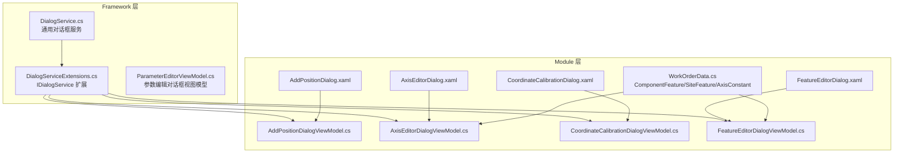
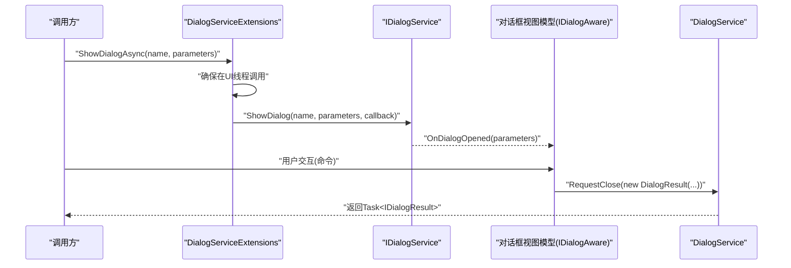
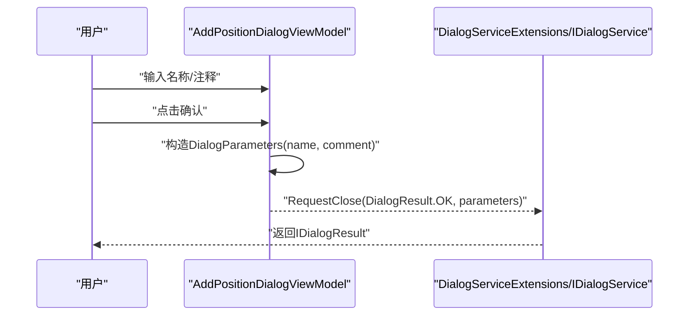
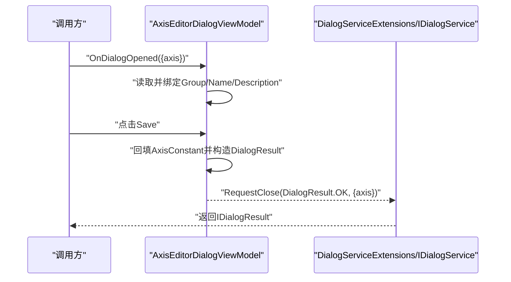
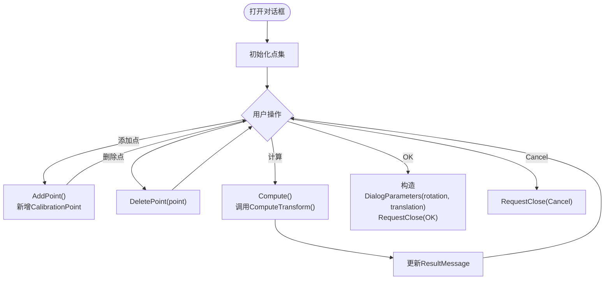
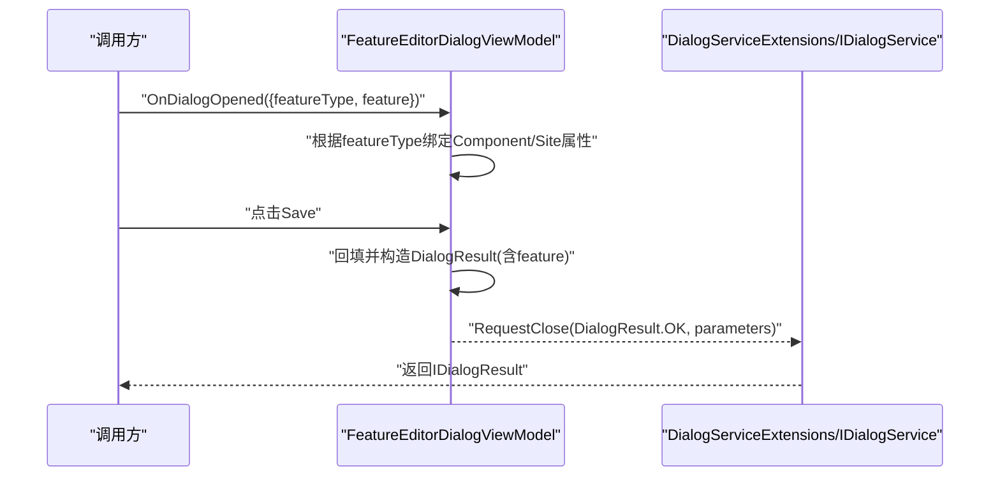
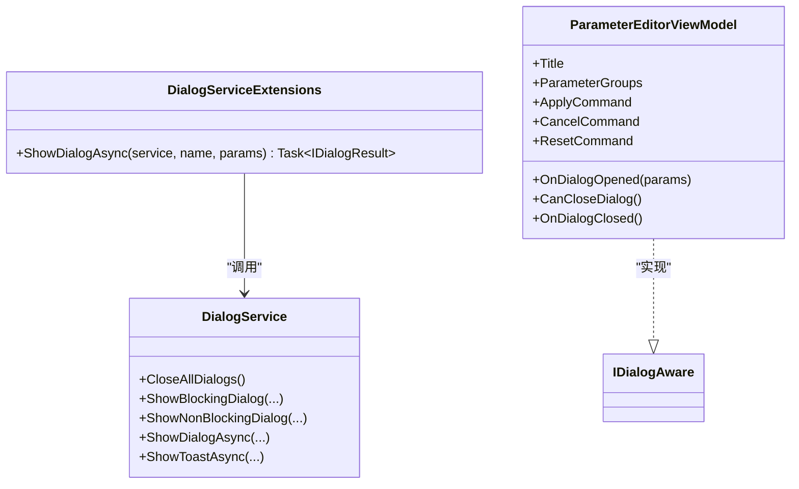
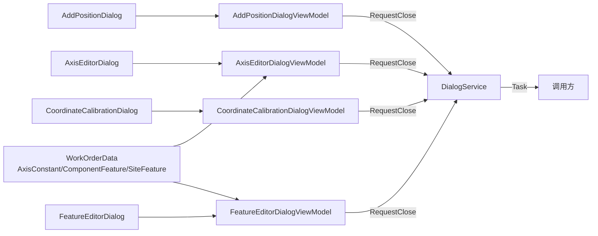

# 对话框与窗口系统

<cite>
**本文引用的文件**   
- [AddPositionDialog.xaml](file://Module/Controls/Dialogs/AddPositionDialog.xaml)
- [AddPositionDialog.xaml.cs](file://Module/Controls/Dialogs/AddPositionDialog.xaml.cs)
- [AddPositionDialogViewModel.cs](file://Module/Controls/Dialogs/AddPositionDialogViewModel.cs)
- [AxisEditorDialog.xaml](file://Module/Controls/Dialogs/AxisEditorDialog.xaml)
- [AxisEditorDialog.xaml.cs](file://Module/Controls/Dialogs/AxisEditorDialog.xaml.cs)
- [AxisEditorDialogViewModel.cs](file://Module/Controls/Dialogs/AxisEditorDialogViewModel.cs)
- [CoordinateCalibrationDialog.xaml](file://Module/Controls/Dialogs/CoordinateCalibrationDialog.xaml)
- [CoordinateCalibrationDialog.xaml.cs](file://Module/Controls/Dialogs/CoordinateCalibrationDialog.xaml.cs)
- [CoordinateCalibrationDialogViewModel.cs](file://Module/Controls/Dialogs/CoordinateCalibrationDialogViewModel.cs)
- [FeatureEditorDialog.xaml](file://Module/Controls/Dialogs/FeatureEditorDialog.xaml)
- [FeatureEditorDialog.xaml.cs](file://Module/Controls/Dialogs/FeatureEditorDialog.xaml.cs)
- [FeatureEditorDialogViewModel.cs](file://Module/Controls/Dialogs/FeatureEditorDialogViewModel.cs)
- [DialogService.cs](file://Framework/Services/DialogService.cs)
- [DialogServiceExtensions.cs](file://Framework/Dialogs/DialogServiceExtensions.cs)
- [ParameterEditorViewModel.cs](file://Framework/ViewModels/ParameterEditorViewModel.cs)
- [WorkOrderData.cs](file://Module/Models/WorkOrderData.cs)
</cite>

## 目录
1. [简介](#简介)
2. [项目结构](#项目结构)
3. [核心组件](#核心组件)
4. [架构总览](#架构总览)
5. [组件详解](#组件详解)
6. [依赖关系分析](#依赖关系分析)
7. [性能考量](#性能考量)
8. [故障排查指南](#故障排查指南)
9. [结论](#结论)
10. [附录](#附录)

## 简介
本文件面向Module模块的对话框与窗口系统，围绕典型对话框组件（位置添加、轴编辑、坐标校准、特征编辑等）进行深入技术解析，覆盖生命周期管理、数据传递机制、验证规则实现、窗口系统架构、模态/非模态处理以及对话框间通信等主题。同时提供自定义对话框开发指南、样式定制方法与用户体验优化建议，并给出常见问题的排查思路。

## 项目结构
Module模块的对话框以“视图(UserControl)+视图模型(IDialogAware)”的MVVM模式组织，配合Framework层的通用对话框服务与Prism对话框框架实现统一的展示与交互体验。对话框位于Module/Controls/Dialogs目录，通用服务位于Framework/Services与Framework/Dialogs。

**图表来源**
- [DialogService.cs:14-432](file://Framework/Services/DialogService.cs#L14-L432)
- [DialogServiceExtensions.cs:1-43](file://Framework/Dialogs/DialogServiceExtensions.cs#L1-L43)
- [AddPositionDialog.xaml:1-54](file://Module/Controls/Dialogs/AddPositionDialog.xaml#L1-L54)
- [AddPositionDialogViewModel.cs:1-55](file://Module/Controls/Dialogs/AddPositionDialogViewModel.cs#L1-L55)
- [AxisEditorDialog.xaml:1-44](file://Module/Controls/Dialogs/AxisEditorDialog.xaml#L1-L44)
- [AxisEditorDialogViewModel.cs:1-57](file://Module/Controls/Dialogs/AxisEditorDialogViewModel.cs#L1-L57)
- [CoordinateCalibrationDialog.xaml:1-62](file://Module/Controls/Dialogs/CoordinateCalibrationDialog.xaml#L1-L62)
- [CoordinateCalibrationDialogViewModel.cs:1-112](file://Module/Controls/Dialogs/CoordinateCalibrationDialogViewModel.cs#L1-L112)
- [FeatureEditorDialog.xaml:1-85](file://Module/Controls/Dialogs/FeatureEditorDialog.xaml#L1-L85)
- [FeatureEditorDialogViewModel.cs:1-148](file://Module/Controls/Dialogs/FeatureEditorDialogViewModel.cs#L1-L148)
- [WorkOrderData.cs:21-75](file://Module/Models/WorkOrderData.cs#L21-L75)

**章节来源**
- [AddPositionDialog.xaml:1-54](file://Module/Controls/Dialogs/AddPositionDialog.xaml#L1-L54)
- [AxisEditorDialog.xaml:1-44](file://Module/Controls/Dialogs/AxisEditorDialog.xaml#L1-L44)
- [CoordinateCalibrationDialog.xaml:1-62](file://Module/Controls/Dialogs/CoordinateCalibrationDialog.xaml#L1-L62)
- [FeatureEditorDialog.xaml:1-85](file://Module/Controls/Dialogs/FeatureEditorDialog.xaml#L1-L85)
- [DialogService.cs:14-432](file://Framework/Services/DialogService.cs#L14-L432)
- [DialogServiceExtensions.cs:1-43](file://Framework/Dialogs/DialogServiceExtensions.cs#L1-L43)

## 核心组件
- 通用对话框服务：提供阻塞/非阻塞、异步、自动关闭等多形态对话框能力，统一注册与清理已打开对话框，避免资源泄漏。
- Prism对话框适配：通过IDialogService扩展，将Prism的ShowDialog封装为Task<IDialogResult>，便于在任意线程安全调用。
- 模块内对话框：以UserControl承载UI，以IDialogAware实现生命周期与数据交换，典型包括位置添加、轴编辑、坐标校准、特征编辑等。

**章节来源**
- [DialogService.cs:14-432](file://Framework/Services/DialogService.cs#L14-L432)
- [DialogServiceExtensions.cs:1-43](file://Framework/Dialogs/DialogServiceExtensions.cs#L1-L43)
- [ParameterEditorViewModel.cs:28-510](file://Framework/ViewModels/ParameterEditorViewModel.cs#L28-L510)

## 架构总览
对话框系统采用分层解耦设计：
- 视图层：XAML定义UI布局与绑定，MaterialDesign主题提供一致风格。
- 视图模型层：实现IDialogAware接口，负责数据装载、命令绑定、参数传递与对话框关闭。
- 服务层：DialogService集中管理对话框生命周期与线程调度；DialogServiceExtensions桥接Prism的IDialogService。
- 数据模型层：WorkOrderData中的ComponentFeature、SiteFeature、AxisConstant作为对话框的数据载体。

**图表来源**
- [DialogServiceExtensions.cs:8-41](file://Framework/Dialogs/DialogServiceExtensions.cs#L8-L41)
- [DialogService.cs:334-408](file://Framework/Services/DialogService.cs#L334-L408)
- [AddPositionDialogViewModel.cs:10-53](file://Module/Controls/Dialogs/AddPositionDialogViewModel.cs#L10-L53)
- [FeatureEditorDialogViewModel.cs:11-147](file://Module/Controls/Dialogs/FeatureEditorDialogViewModel.cs#L11-L147)

## 组件详解

### 位置添加对话框 AddPositionDialog
- 视图职责：提供名称与注释输入框，底部确认/取消按钮。
- 视图模型职责：实现IDialogAware，暴露ConfirmCommand/CanelCommand；在确认时将Name/Comment打包为DialogParameters并通过RequestClose返回。
- 生命周期：Title、CanCloseDialog、OnDialogClosed、OnDialogOpened均按需实现。
- 数据流：用户输入 -> 视图模型属性 -> 确认命令 -> 参数封装 -> 关闭回调。

**图表来源**
- [AddPositionDialog.xaml:29-52](file://Module/Controls/Dialogs/AddPositionDialog.xaml#L29-L52)
- [AddPositionDialogViewModel.cs:34-46](file://Module/Controls/Dialogs/AddPositionDialogViewModel.cs#L34-L46)

**章节来源**
- [AddPositionDialog.xaml:1-54](file://Module/Controls/Dialogs/AddPositionDialog.xaml#L1-L54)
- [AddPositionDialogViewModel.cs:1-55](file://Module/Controls/Dialogs/AddPositionDialogViewModel.cs#L1-L55)

### 轴编辑对话框 AxisEditorDialog
- 视图职责：展示Group/Name/Description三列输入，底部Save/Cancel按钮。
- 视图模型职责：实现IDialogAware；OnDialogOpened从参数提取AxisConstant并初始化属性；Save时回填并返回包含AxisConstant的参数。
- 数据模型：AxisConstant来自WorkOrderData，作为对话框的编辑对象。

**图表来源**
- [AxisEditorDialog.xaml:19-42](file://Module/Controls/Dialogs/AxisEditorDialog.xaml#L19-L42)
- [AxisEditorDialogViewModel.cs:34-55](file://Module/Controls/Dialogs/AxisEditorDialogViewModel.cs#L34-L55)
- [WorkOrderData.cs:175-198](file://Module/Models/WorkOrderData.cs#L175-L198)

**章节来源**
- [AxisEditorDialog.xaml:1-44](file://Module/Controls/Dialogs/AxisEditorDialog.xaml#L1-L44)
- [AxisEditorDialogViewModel.cs:1-57](file://Module/Controls/Dialogs/AxisEditorDialogViewModel.cs#L1-L57)
- [WorkOrderData.cs:175-198](file://Module/Models/WorkOrderData.cs#L175-L198)

### 坐标校准对话框 CoordinateCalibrationDialog
- 视图职责：数据网格展示对应点集，提供“添加点”“计算”按钮，底部结果显示区与OK/Cancel。
- 视图模型职责：实现IDialogAware；维护CalibrationPoint集合；提供AddPoint/DeletePoint/Compute/Ok/Cancel命令；Compute基于Math.NET进行变换计算；Ok时返回旋转矩阵与平移向量。
- 数据模型：CalibrationPoint为内部可观察集合；结果通过DialogParameters返回。

**图表来源**
- [CoordinateCalibrationDialog.xaml:22-60](file://Module/Controls/Dialogs/CoordinateCalibrationDialog.xaml#L22-L60)
- [CoordinateCalibrationDialogViewModel.cs:69-111](file://Module/Controls/Dialogs/CoordinateCalibrationDialogViewModel.cs#L69-L111)

**章节来源**
- [CoordinateCalibrationDialog.xaml:1-62](file://Module/Controls/Dialogs/CoordinateCalibrationDialog.xaml#L1-L62)
- [CoordinateCalibrationDialogViewModel.cs:1-112](file://Module/Controls/Dialogs/CoordinateCalibrationDialogViewModel.cs#L1-L112)

### 特征编辑对话框 FeatureEditorDialog
- 视图职责：根据FeatureType动态呈现Component或Site特征的输入模板，底部Save/Cancel按钮。
- 视图模型职责：实现IDialogAware；OnDialogOpened读取featureType与feature对象，分别映射到ComponentFeature或SiteFeature属性；Save时回填并返回对应feature对象。
- 数据模型：ComponentFeature/SiteFeature来自WorkOrderData；SiteFeatureTypeOptions为下拉选项集合。

**图表来源**
- [FeatureEditorDialog.xaml:20-83](file://Module/Controls/Dialogs/FeatureEditorDialog.xaml#L20-L83)
- [FeatureEditorDialogViewModel.cs:100-146](file://Module/Controls/Dialogs/FeatureEditorDialogViewModel.cs#L100-L146)
- [WorkOrderData.cs:21-75](file://Module/Models/WorkOrderData.cs#L21-L75)

**章节来源**
- [FeatureEditorDialog.xaml:1-85](file://Module/Controls/Dialogs/FeatureEditorDialog.xaml#L1-L85)
- [FeatureEditorDialogViewModel.cs:1-148](file://Module/Controls/Dialogs/FeatureEditorDialogViewModel.cs#L1-L148)
- [WorkOrderData.cs:21-75](file://Module/Models/WorkOrderData.cs#L21-L75)

### 通用对话框服务与Prism集成
- DialogService：提供阻塞/非阻塞、异步、自动关闭等多形态对话框；内部使用ConcurrentDictionary跟踪已打开窗口，确保关闭时清理；支持跨线程调用并在UI线程执行。
- DialogServiceExtensions：将Prism的IDialogService.ShowDialog包装为Task<IDialogResult>，自动处理线程上下文切换与异常捕获。
- ParameterEditorViewModel：作为IDialogAware示例，演示参数装载、搜索过滤、应用/重置/取消流程与事件发布。

**图表来源**
- [DialogService.cs:14-432](file://Framework/Services/DialogService.cs#L14-L432)
- [DialogServiceExtensions.cs:1-43](file://Framework/Dialogs/DialogServiceExtensions.cs#L1-L43)
- [ParameterEditorViewModel.cs:28-510](file://Framework/ViewModels/ParameterEditorViewModel.cs#L28-L510)

**章节来源**
- [DialogService.cs:14-432](file://Framework/Services/DialogService.cs#L14-L432)
- [DialogServiceExtensions.cs:1-43](file://Framework/Dialogs/DialogServiceExtensions.cs#L1-L43)
- [ParameterEditorViewModel.cs:28-510](file://Framework/ViewModels/ParameterEditorViewModel.cs#L28-L510)

## 依赖关系分析
- 视图与视图模型：通过DataContext绑定，视图仅负责展示与命令触发，逻辑集中在视图模型。
- 视图模型与服务：通过IDialogService扩展与DialogService交互，实现跨线程安全调用与结果返回。
- 视图模型与数据模型：通过IDialogParameters传递对象（如AxisConstant、ComponentFeature、SiteFeature），实现双向数据绑定与结果回传。
- 通用服务与UI：DialogService统一管理窗口生命周期，避免重复创建与资源泄漏。

**图表来源**
- [AddPositionDialogViewModel.cs:10-53](file://Module/Controls/Dialogs/AddPositionDialogViewModel.cs#L10-L53)
- [AxisEditorDialogViewModel.cs:10-55](file://Module/Controls/Dialogs/AxisEditorDialogViewModel.cs#L10-L55)
- [CoordinateCalibrationDialogViewModel.cs:30-111](file://Module/Controls/Dialogs/CoordinateCalibrationDialogViewModel.cs#L30-L111)
- [FeatureEditorDialogViewModel.cs:11-147](file://Module/Controls/Dialogs/FeatureEditorDialogViewModel.cs#L11-L147)
- [DialogService.cs:334-408](file://Framework/Services/DialogService.cs#L334-L408)
- [WorkOrderData.cs:21-75](file://Module/Models/WorkOrderData.cs#L21-L75)

**章节来源**
- [AddPositionDialogViewModel.cs:1-55](file://Module/Controls/Dialogs/AddPositionDialogViewModel.cs#L1-L55)
- [AxisEditorDialogViewModel.cs:1-57](file://Module/Controls/Dialogs/AxisEditorDialogViewModel.cs#L1-L57)
- [CoordinateCalibrationDialogViewModel.cs:1-112](file://Module/Controls/Dialogs/CoordinateCalibrationDialogViewModel.cs#L1-L112)
- [FeatureEditorDialogViewModel.cs:1-148](file://Module/Controls/Dialogs/FeatureEditorDialogViewModel.cs#L1-L148)
- [DialogService.cs:14-432](file://Framework/Services/DialogService.cs#L14-L432)
- [WorkOrderData.cs:21-75](file://Module/Models/WorkOrderData.cs#L21-L75)

## 性能考量
- 线程安全：所有对话框显示与结果返回均通过Dispatcher在UI线程执行，避免跨线程访问UI引发异常。
- 资源管理：DialogService使用ConcurrentDictionary跟踪窗口句柄，窗口关闭时自动清理，防止内存泄漏。
- 计算密集型：坐标校准使用Math.NET进行矩阵运算，建议在后台线程执行计算并更新UI绑定属性，避免阻塞主线程。
- 数据绑定：大量数据网格场景建议使用VirtualizingStackPanel与延迟加载策略，减少初始渲染开销。

## 故障排查指南
- 无法在非UI线程调用对话框：使用DialogServiceExtensions提供的ShowDialogAsync，内部会自动切换到UI线程。
- 对话框未关闭或重复打开：检查是否正确调用RequestClose或通过DialogService关闭；避免多次注册相同窗口句柄。
- 参数未生效：确认OnDialogOpened中正确读取参数键名；保存时将修改回填至对象并构造DialogResult。
- 自动关闭不生效：检查ShowNonBlockingDialog/ShowToastAsync的autoCloseTimeout参数是否设置且Owner正确。
- 数据网格卡顿：对大数据集启用虚拟化、分页或延迟加载；避免在UI线程执行耗时计算。

**章节来源**
- [DialogServiceExtensions.cs:8-41](file://Framework/Dialogs/DialogServiceExtensions.cs#L8-L41)
- [DialogService.cs:34-47](file://Framework/Services/DialogService.cs#L34-L47)
- [CoordinateCalibrationDialogViewModel.cs:81-96](file://Module/Controls/Dialogs/CoordinateCalibrationDialogViewModel.cs#L81-L96)

## 结论
Module模块的对话框与窗口系统通过MVVM与Prism对话框框架实现了清晰的职责分离与一致的交互体验。通用对话框服务提供了跨线程安全、可扩展的对话框管理能力；各业务对话框以IDialogAware为契约，确保生命周期可控、数据传递明确。遵循本文的开发与优化建议，可在保证稳定性的同时提升用户体验与开发效率。

## 附录

### 自定义对话框开发指南
- 视图层：新建UserControl，定义输入控件与按钮，绑定到视图模型命令。
- 视图模型层：实现IDialogAware，处理OnDialogOpened参数装载，实现命令与验证，通过RequestClose返回结果。
- 服务层：通过DialogServiceExtensions.ShowDialogAsync调用，确保线程安全与结果收集。
- 数据模型：通过IDialogParameters传递对象实例，实现双向绑定与结果回填。

**章节来源**
- [AddPositionDialog.xaml:1-54](file://Module/Controls/Dialogs/AddPositionDialog.xaml#L1-L54)
- [AddPositionDialogViewModel.cs:1-55](file://Module/Controls/Dialogs/AddPositionDialogViewModel.cs#L1-L55)
- [DialogServiceExtensions.cs:1-43](file://Framework/Dialogs/DialogServiceExtensions.cs#L1-L43)

### 样式定制方法
- 主题与样式：通过MaterialDesign主题资源字典统一风格，按钮、输入框、数据网格等控件样式可复用。
- 响应式布局：使用Grid行/列定义与自动尺寸，适配不同分辨率与窗口大小。
- 可访问性：为输入控件设置HintAssist.Hint，按钮设置Content与默认焦点，提升易用性。

**章节来源**
- [AddPositionDialog.xaml:9-18](file://Module/Controls/Dialogs/AddPositionDialog.xaml#L9-L18)
- [AxisEditorDialog.xaml:4-42](file://Module/Controls/Dialogs/AxisEditorDialog.xaml#L4-L42)
- [CoordinateCalibrationDialog.xaml:6-44](file://Module/Controls/Dialogs/CoordinateCalibrationDialog.xaml#L6-L44)
- [FeatureEditorDialog.xaml:4-83](file://Module/Controls/Dialogs/FeatureEditorDialog.xaml#L4-L83)

### 用户体验优化建议
- 明确反馈：在保存/计算等耗时操作中提供加载状态或进度提示。
- 输入验证：结合Prism验证规则与本地化提示，即时反馈输入错误。
- 快捷键与默认行为：为常用按钮设置默认焦点与快捷键，减少鼠标操作。
- 一致性：统一标题、按钮文案与图标风格，保持跨模块一致的交互语言。