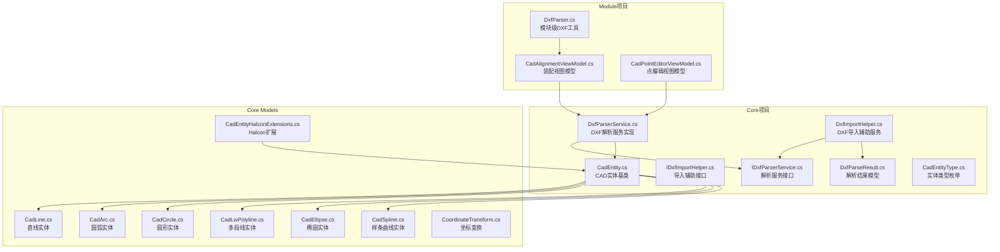
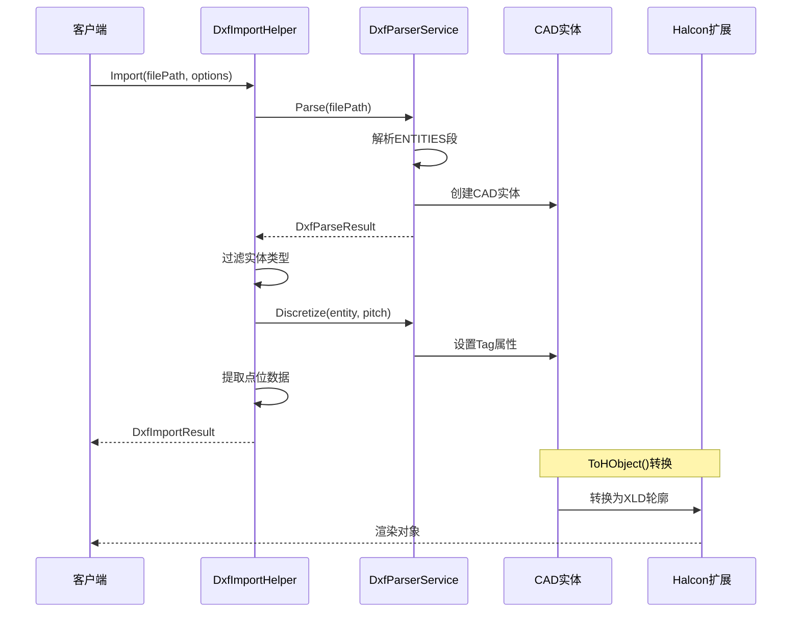
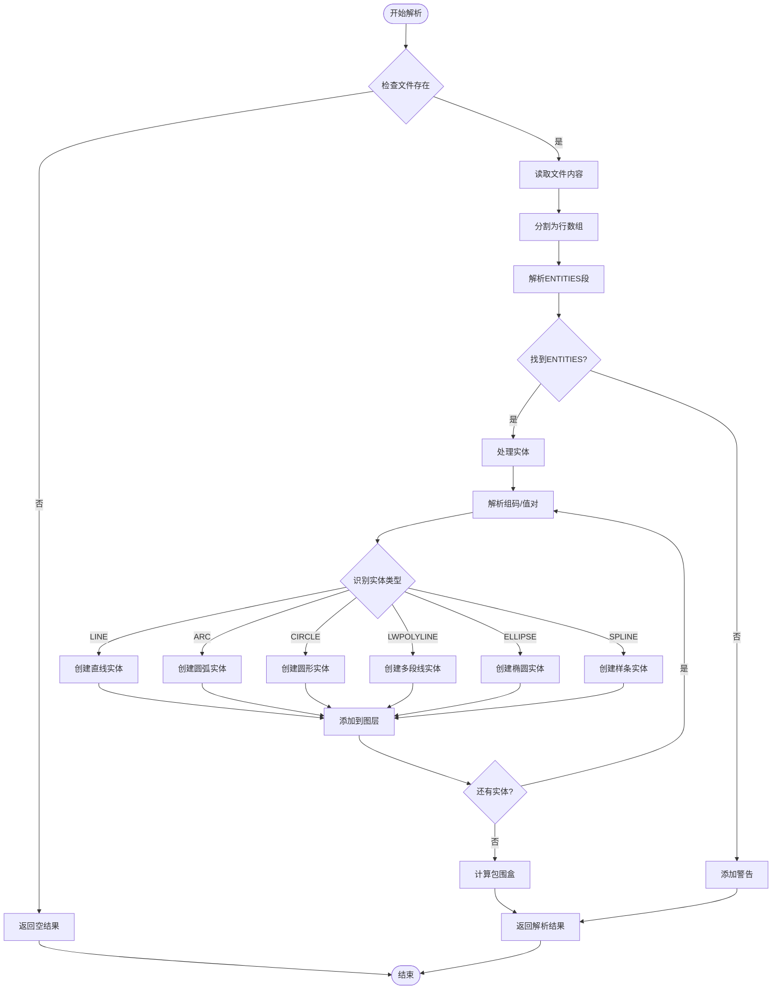
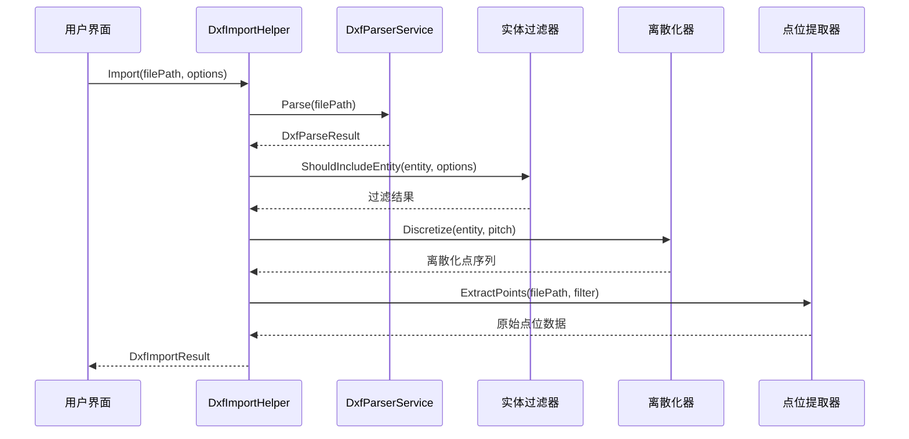
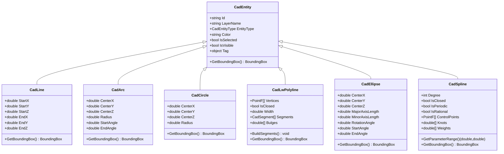
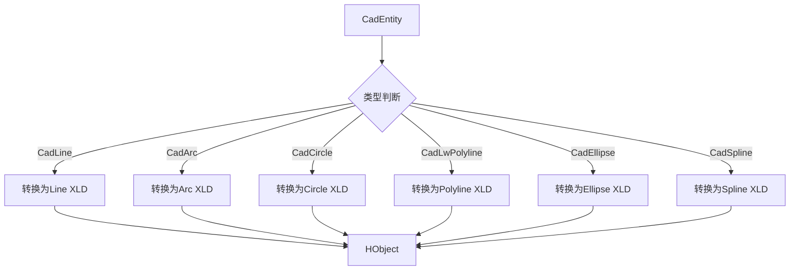
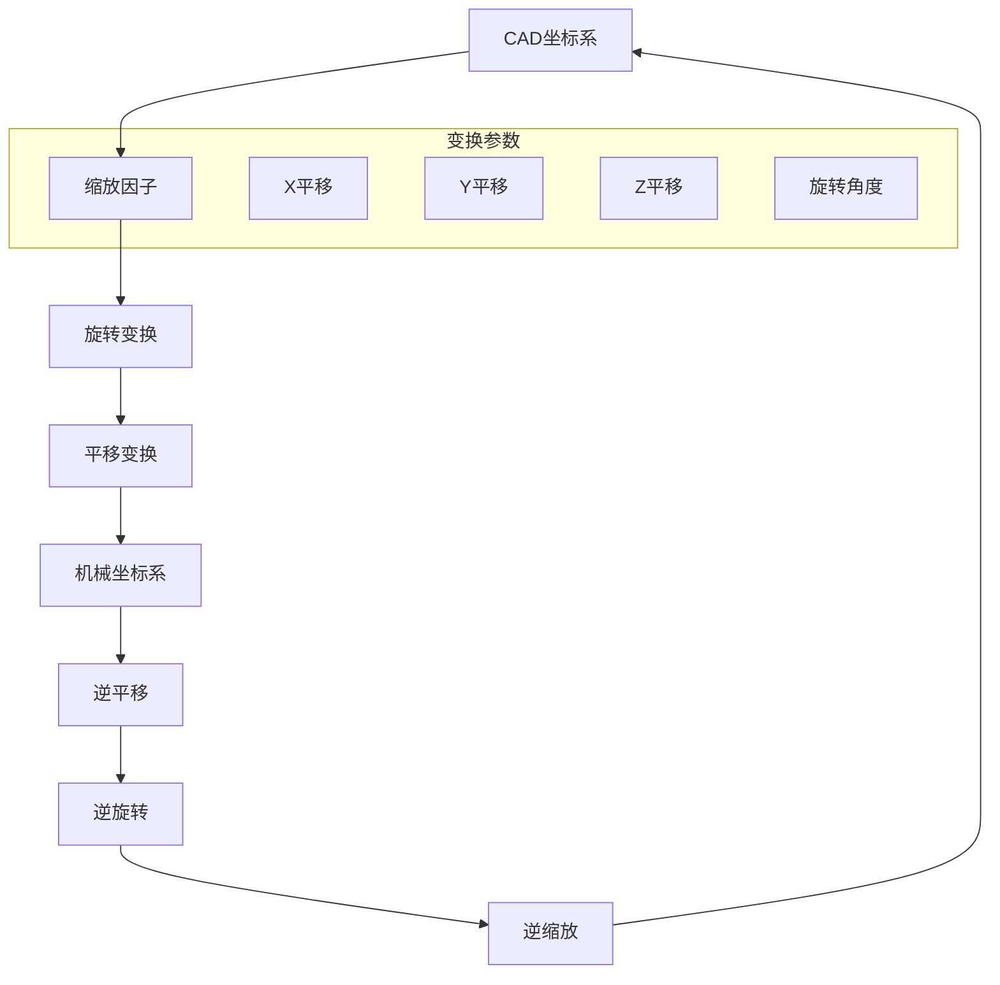
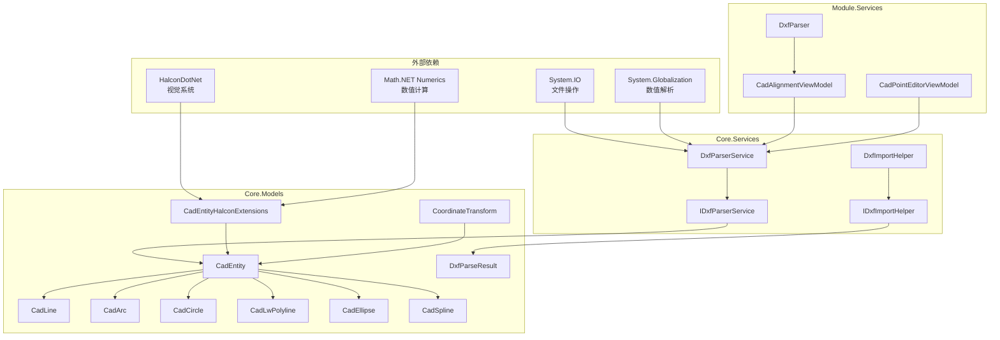

# DXF解析服务

<cite>
**本文档引用的文件**
- [DxfParserService.cs](file://Core/Services/DxfParserService.cs)
- [DxfImportHelper.cs](file://Core/Services/DxfImportHelper.cs)
- [IDxfParserService.cs](file://Core/Services/IDxfParserService.cs)
- [IDxfImportHelper.cs](file://Core/Services/IDxfImportHelper.cs)
- [DxfParseResult.cs](file://Core/Models/DxfParseResult.cs)
- [CadEntity.cs](file://Core/Models/CadEntity.cs)
- [CadEntityType.cs](file://Core/Models/CadEntityType.cs)
- [CadLine.cs](file://Core/Models/CadLine.cs)
- [CadArc.cs](file://Core/Models/CadArc.cs)
- [CadCircle.cs](file://Core/Models/CadCircle.cs)
- [CadLwPolyline.cs](file://Core/Models/CadLwPolyline.cs)
- [CadEllipse.cs](file://Core/Models/CadEllipse.cs)
- [CadSpline.cs](file://Core/Models/CadSpline.cs)
- [CadEntityHalconExtensions.cs](file://Core/Models/CadEntityHalconExtensions.cs)
- [CoordinateTransform.cs](file://Core/Models/CoordinateTransform.cs)
- [DxfParser.cs](file://Module/Services/DxfParser.cs)
- [CadAlignmentViewModel.cs](file://Module/Controls/Cad/CadAlignmentViewModel.cs)
- [CadPointEditorViewModel.cs](file://Module/Controls/Cad/CadPointEditorViewModel.cs)
</cite>

## 目录
1. [简介](#简介)
2. [项目结构](#项目结构)
3. [核心组件](#核心组件)
4. [架构概览](#架构概览)
5. [详细组件分析](#详细组件分析)
6. [依赖关系分析](#依赖关系分析)
7. [性能考虑](#性能考虑)
8. [故障排除指南](#故障排除指南)
9. [结论](#结论)

## 简介

DXF解析服务是GZQL机器视觉系统中的核心模块，负责将CAD数据导入到内部几何模型中。该服务提供了完整的DXF文件解析能力，支持多种CAD实体类型，实现了与Halcon视觉系统的无缝集成。

本服务采用纯文本解析方式，不依赖任何第三方DXF库，通过逐行组码/值对模式解析，能够准确提取CAD数据并转换为内部几何模型。服务支持多种DXF版本和实体类型，包括直线、圆弧、圆形、多段线、椭圆和样条曲线等。

## 项目结构

DXF解析服务主要分布在Core和Module两个项目中：

**图表来源**
- [DxfParserService.cs:11-147](file://Core/Services/DxfParserService.cs#L11-L147)
- [DxfImportHelper.cs:14-101](file://Core/Services/DxfImportHelper.cs#L14-L101)
- [CadEntity.cs:10-95](file://Core/Models/CadEntity.cs#L10-L95)

## 核心组件

### DXF解析服务接口

IDxfParserService定义了DXF解析的核心接口，提供了以下功能：

- **文件解析**：解析DXF文件并返回按图层分组的图元集合
- **离散化功能**：将CAD图元转换为等间距点序列
- **批量处理**：支持多个图元的批量离散化

### DXF导入辅助服务

DxfImportHelper提供了统一的DXF导入流程，包含以下步骤：

1. **文件解析**：调用IDxfParserService.Parse()解析DXF文件
2. **实体过滤**：根据DxfImportOptions配置过滤实体类型
3. **离散化处理**：对实体进行预离散化并缓存到Tag属性
4. **点位提取**：从DXF文件中提取原始点位数据

### CAD实体模型体系

系统提供了完整的CAD实体模型体系，支持以下实体类型：

- **基础实体**：直线、圆弧、圆形
- **复合实体**：多段线、椭圆、样条曲线
- **扩展功能**：坐标变换、包围盒计算、Halcon集成

**章节来源**
- [IDxfParserService.cs:8-40](file://Core/Services/IDxfParserService.cs#L8-L40)
- [IDxfImportHelper.cs:87-102](file://Core/Services/IDxfImportHelper.cs#L87-L102)
- [CadEntity.cs:6-95](file://Core/Models/CadEntity.cs#L6-L95)

## 架构概览

DXF解析服务采用分层架构设计，实现了清晰的职责分离：

**图表来源**
- [DxfImportHelper.cs:31-101](file://Core/Services/DxfImportHelper.cs#L31-L101)
- [DxfParserService.cs:22-147](file://Core/Services/DxfParserService.cs#L22-L147)
- [CadEntityHalconExtensions.cs:41-53](file://Core/Models/CadEntityHalconExtensions.cs#L41-L53)

## 详细组件分析

### DxfParserService解析器

DxfParserService是DXF解析的核心实现，采用了状态机模式来处理复杂的DXF文件结构：

#### 解析流程

**图表来源**
- [DxfParserService.cs:22-147](file://Core/Services/DxfParserService.cs#L22-L147)
- [DxfParserService.cs:113-147](file://Core/Services/DxfParserService.cs#L113-L147)

#### 实体解析算法

解析器支持以下DXF实体类型的解析：

| 实体类型 | 组码支持 | 关键参数 | 特殊处理 |
|---------|---------|---------|----------|
| LINE | 0, 10, 20, 30, 8 | 起点坐标、终点坐标、图层 | 基础直线绘制 |
| ARC | 0, 10, 20, 30, 40, 50, 51, 8 | 中心点、半径、起止角、图层 | 角度范围处理 |
| CIRCLE | 0, 10, 20, 30, 40, 8 | 中心点、半径、图层 | 完整圆形渲染 |
| LWPOLYLINE | 0, 90, 73, 43, 10, 20, 30, 72, 73, 42, 8 | 顶点列表、闭合状态、宽度 | 多段线混合渲染 |
| ELLIPSE | 0, 10, 20, 30, 40, 41, 42, 43, 44, 45, 8 | 中心、长短轴、旋转角 | 椭圆参数方程 |
| SPLINE | 70, 71, 72, 73, 40, 10, 20, 30, 41, 210, 220, 230 | 控制点、节点向量、权重 | NURBS样条计算 |

**章节来源**
- [DxfParserService.cs:109-736](file://Core/Services/DxfParserService.cs#L109-L736)

### DxfImportHelper导入服务

DxfImportHelper提供了统一的DXF导入流程，确保不同界面使用相同的导入逻辑：

#### 导入流程

**图表来源**
- [DxfImportHelper.cs:31-101](file://Core/Services/DxfImportHelper.cs#L31-L101)

#### 导入选项配置

DxfImportOptions提供了灵活的导入配置选项：

| 配置项 | 类型 | 默认值 | 描述 |
|-------|------|--------|------|
| IncludeArcs | bool | true | 是否包含圆弧实体 |
| IncludeCircles | bool | true | 是否包含圆形实体 |
| IncludeSplines | bool | true | 是否包含样条曲线实体 |
| DiscretizePitchMM | double | 1.0 | 离散化间距（毫米） |
| ExtractPoints | bool | false | 是否提取原始点位数据 |
| PointLayerFilter | string | null | 点位提取时的图层过滤 |

**章节来源**
- [IDxfImportHelper.cs:11-85](file://Core/Services/IDxfImportHelper.cs#L11-L85)

### CAD实体模型体系

系统提供了完整的CAD实体模型，支持几何计算和可视化：

#### 实体继承关系

**图表来源**
- [CadEntity.cs:10-95](file://Core/Models/CadEntity.cs#L10-L95)
- [CadLine.cs:7-111](file://Core/Models/CadLine.cs#L7-L111)
- [CadArc.cs:8-158](file://Core/Models/CadArc.cs#L8-L158)
- [CadCircle.cs:7-89](file://Core/Models/CadCircle.cs#L7-L89)
- [CadLwPolyline.cs:10-152](file://Core/Models/CadLwPolyline.cs#L10-L152)
- [CadEllipse.cs:7-160](file://Core/Models/CadEllipse.cs#L7-L160)
- [CadSpline.cs:24-241](file://Core/Models/CadSpline.cs#L24-L241)

#### 包围盒计算

每种CAD实体都实现了精确的包围盒计算：

| 实体类型 | 计算方法 | 关键参数 |
|---------|---------|---------|
| 直线 | 连接起点终点 | StartX, StartY, EndX, EndY |
| 圆弧 | 起止点+象限点 | CenterX, CenterY, Radius, StartAngle, EndAngle |
| 圆形 | 外接正方形 | CenterX, CenterY, Radius |
| 多段线 | 遍历所有顶点 | Vertices列表 |
| 椭圆 | 参数方程采样 | CenterX, CenterY, MajorAxisLength, MinorAxisLength, RotationAngle |
| 样条曲线 | 控制点估算 | ControlPoints列表 |

**章节来源**
- [CadLine.cs:102-108](file://Core/Models/CadLine.cs#L102-L108)
- [CadArc.cs:104-137](file://Core/Models/CadArc.cs#L104-L137)
- [CadCircle.cs:78-86](file://Core/Models/CadCircle.cs#L78-L86)
- [CadLwPolyline.cs:136-149](file://Core/Models/CadLwPolyline.cs#L136-L149)
- [CadEllipse.cs:128-157](file://Core/Models/CadEllipse.cs#L128-L157)
- [CadSpline.cs:205-238](file://Core/Models/CadSpline.cs#L205-L238)

### Halcon视觉系统集成

CadEntityHalconExtensions提供了与Halcon视觉系统的深度集成：

#### XLD轮廓转换

**图表来源**
- [CadEntityHalconExtensions.cs:41-53](file://Core/Models/CadEntityHalconExtensions.cs#L41-L53)

#### 离散化策略

Halcon扩展实现了智能的离散化策略：

| 实体类型 | 采样策略 | 参数设置 |
|---------|---------|---------|
| 圆弧 | 弧长自适应 | 最小间距0.3mm，基础采样72点 |
| 圆形 | 均匀采样 | 基础采样72点 |
| 椭圆 | 参数方程采样 | 基础采样72点 |
| 多段线 | 混合段处理 | 直线段两点连线，圆弧段采样 |
| 样条曲线 | NURBS采样 | 基于控制点和节点向量 |

**章节来源**
- [CadEntityHalconExtensions.cs:21-33](file://Core/Models/CadEntityHalconExtensions.cs#L21-L33)
- [CadEntityHalconExtensions.cs:91-138](file://Core/Models/CadEntityHalconExtensions.cs#L91-L138)

### 坐标变换系统

CoordinateTransform提供了CAD坐标系与机械坐标系之间的双向转换：

#### 变换流程

**图表来源**
- [CoordinateTransform.cs:68-98](file://Core/Models/CoordinateTransform.cs#L68-L98)
- [CoordinateTransform.cs:110-136](file://Core/Models/CoordinateTransform.cs#L110-L136)

**章节来源**
- [CoordinateTransform.cs:10-187](file://Core/Models/CoordinateTransform.cs#L10-L187)

## 依赖关系分析

DXF解析服务的依赖关系呈现清晰的层次结构：

**图表来源**
- [DxfParserService.cs:1-4](file://Core/Services/DxfParserService.cs#L1-L4)
- [CadEntityHalconExtensions.cs:1-4](file://Core/Models/CadEntityHalconExtensions.cs#L1-L4)
- [DxfImportHelper.cs:1-5](file://Core/Services/DxfImportHelper.cs#L1-L5)

### 循环依赖检测

系统设计避免了循环依赖：
- Core.Services依赖Core.Models（单向）
- Module.Services依赖Core.Services（单向）
- Halcon扩展独立于业务逻辑

**章节来源**
- [DxfParserService.cs:1-4](file://Core/Services/DxfParserService.cs#L1-L4)
- [CadEntityHalconExtensions.cs:1-4](file://Core/Models/CadEntityHalconExtensions.cs#L1-L4)

## 性能考虑

### 解析性能优化

1. **内存管理**
   - 使用StringBuilder减少字符串拼接开销
   - 批量处理实体避免频繁GC
   - 及时释放大对象引用

2. **算法优化**
   - 状态机模式减少条件判断
   - 预分配集合容量
   - 智能缓存离散化结果

3. **I/O优化**
   - 流式读取避免大文件内存占用
   - 批量字符串处理
   - 及时关闭文件流

### 渲染性能优化

1. **Halcon集成优化**
   - Tag属性缓存预计算结果
   - 合并多个轮廓对象
   - 智能采样密度控制

2. **实体过滤优化**
   - 按需离散化减少计算量
   - 批量处理提升效率
   - 延迟加载策略

## 故障排除指南

### 常见DXF文件问题

#### 文件格式问题

| 问题类型 | 症状 | 解决方案 |
|---------|------|---------|
| 编码问题 | 解析异常或字符乱码 | 检查文件编码，确保UTF-8 |
| 结构损坏 | ENTITIES段缺失 | 使用CAD软件修复DXF文件 |
| 版本不兼容 | 新版本实体无法识别 | 更新解析器或转换文件版本 |
| 字段缺失 | 实体参数不完整 | 检查DXF组码完整性 |

#### 实体解析问题

| 实体类型 | 常见问题 | 诊断方法 |
|---------|---------|---------|
| LINE | 起点终点相同 | 检查坐标值有效性 |
| ARC | 半径为负 | 验证半径参数 |
| CIRCLE | 中心点无效 | 检查坐标范围 |
| LWPOLYLINE | 顶点数量不足 | 确认多段线定义 |
| ELLIPSE | 轴长为零 | 验证长短轴参数 |
| SPLINE | 控制点不足 | 检查NURBS定义 |

#### 坐标系统问题

| 问题类型 | 症状 | 解决方案 |
|---------|------|---------|
| 单位不匹配 | 实际尺寸与预期不符 | 检查DXF单位设置 |
| 坐标偏移 | 图形位置错误 | 验证坐标变换参数 |
| 方向反转 | 图形方向相反 | 检查旋转角度设置 |

**章节来源**
- [DxfParserService.cs:28-34](file://Core/Services/DxfParserService.cs#L28-L34)
- [DxfImportHelper.cs:35-40](file://Core/Services/DxfImportHelper.cs#L35-L40)

### 错误处理策略

系统实现了多层次的错误处理机制：

1. **文件级错误处理**
   - 文件不存在检查
   - 权限验证
   - 磁盘空间检查

2. **解析级错误处理**
   - 组码格式验证
   - 数值范围检查
   - 实体完整性验证

3. **运行时错误处理**
   - Halcon调用异常捕获
   - 内存溢出保护
   - 超时机制

**章节来源**
- [DxfParserService.cs:28-147](file://Core/Services/DxfParserService.cs#L28-L147)
- [DxfImportHelper.cs:38-101](file://Core/Services/DxfImportHelper.cs#L38-L101)

## 结论

DXF解析服务通过精心设计的架构和算法，成功实现了CAD数据到内部几何模型的高效转换。服务具有以下优势：

1. **完整性**：支持多种DXF版本和实体类型
2. **准确性**：精确的几何计算和坐标变换
3. **性能**：优化的解析算法和缓存机制
4. **稳定性**：完善的错误处理和异常恢复
5. **可扩展性**：清晰的接口设计便于功能扩展

该服务为GZQL机器视觉系统提供了坚实的CAD数据基础，支持从简单几何到复杂NURBS曲面的完整处理能力。通过与Halcon视觉系统的深度集成，实现了从CAD设计到自动化生产的无缝连接。

未来可以进一步优化的方向包括：支持更多DXF版本、增强错误诊断能力、提供可视化调试工具等。