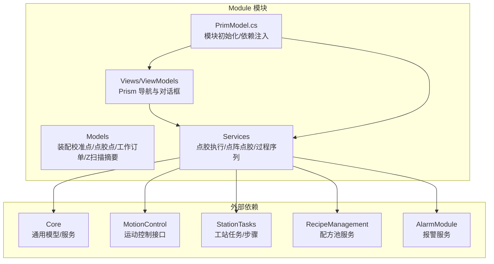
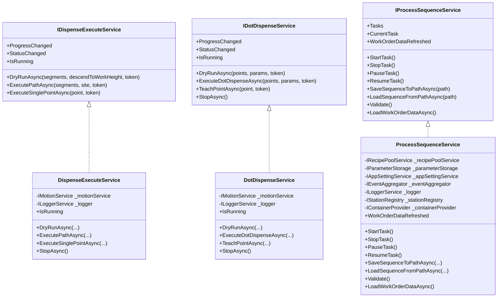
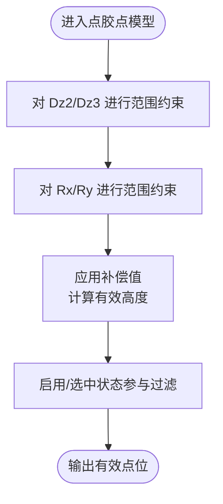
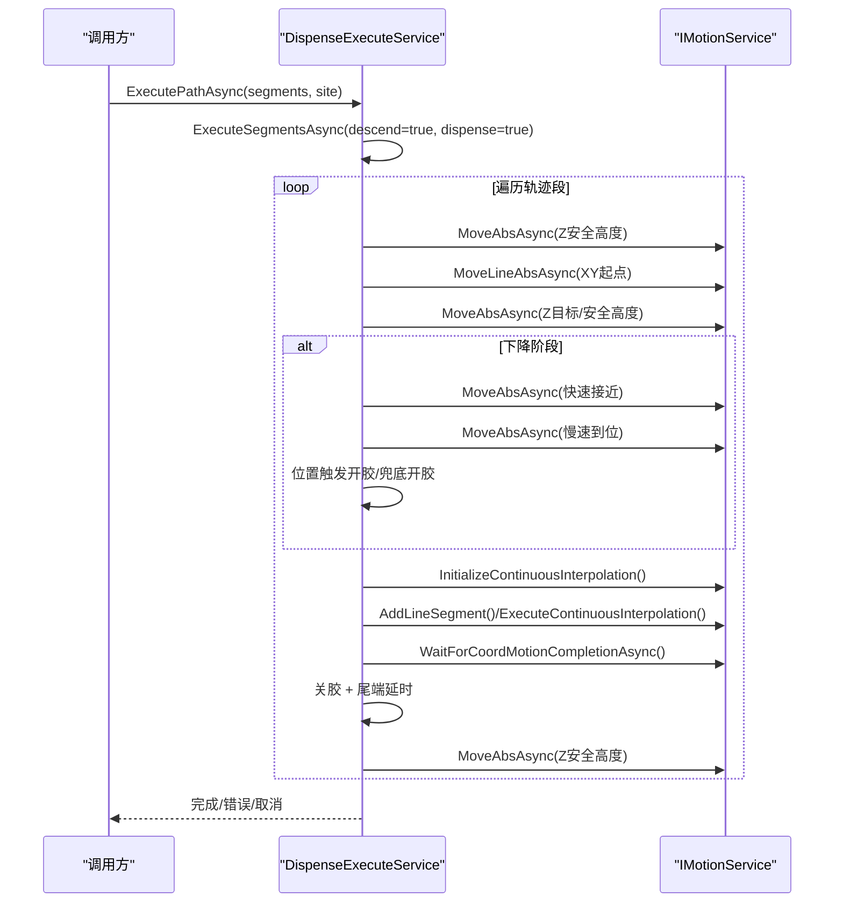
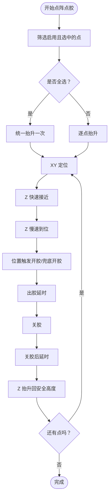
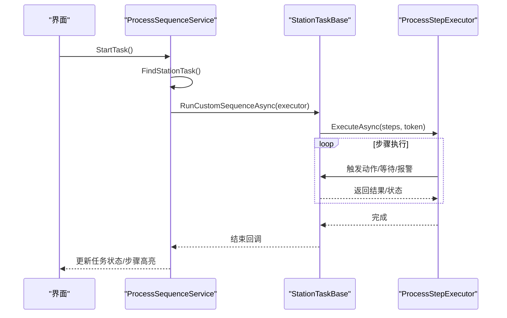
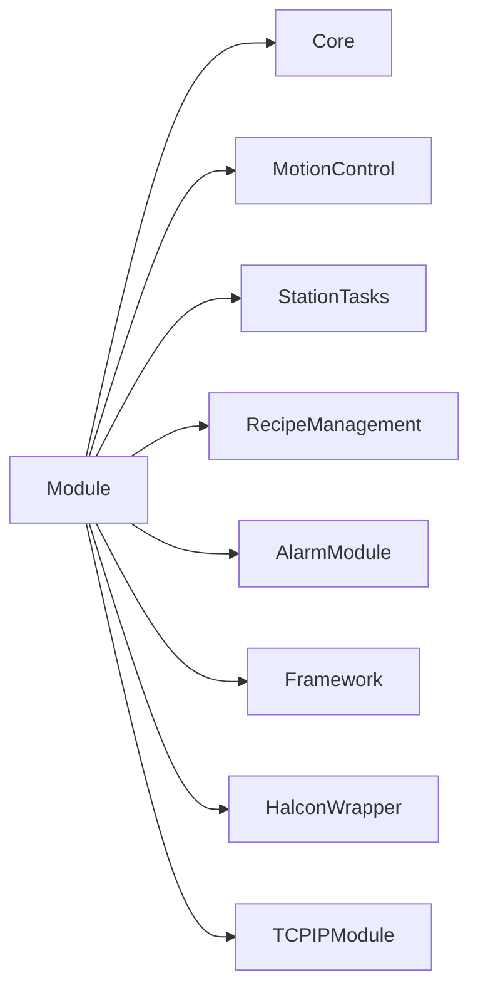

# 数据模型与服务层

<cite>
**本文档引用的文件**
- [AssyCalibrationPoint.cs](file://Module/Models/AssyCalibrationPoint.cs)
- [DotPoint.cs](file://Module/Models/DotPoint.cs)
- [WorkOrderData.cs](file://Module/Models/WorkOrderData.cs)
- [ZScanSummaryItem.cs](file://Module/Models/ZScanSummaryItem.cs)
- [DispenseExecuteService.cs](file://Module/Services/DispenseExecuteService.cs)
- [DotDispenseService.cs](file://Module/Services/DotDispenseService.cs)
- [ProcessSequenceService.cs](file://Module/Services/ProcessSequenceService.cs)
- [IDispenseExecuteService.cs](file://Module/Services/IDispenseExecuteService.cs)
- [IDotDispenseService.cs](file://Module/Services/IDotDispenseService.cs)
- [IProcessSequenceService.cs](file://Module/Services/IProcessSequenceService.cs)
- [PrimModel.cs](file://Module/PrimModel.cs)
- [Module.csproj](file://Module/Module.csproj)
</cite>

## 目录
1. [简介](#简介)
2. [项目结构](#项目结构)
3. [核心组件](#核心组件)
4. [架构总览](#架构总览)
5. [详细组件分析](#详细组件分析)
6. [依赖分析](#依赖分析)
7. [性能考虑](#性能考虑)
8. [故障排查指南](#故障排查指南)
9. [结论](#结论)
10. [附录](#附录)

## 简介
本文件聚焦于 Module 模块的数据模型与服务层，系统梳理装配校准点、点胶点、工作订单数据、Z 扫描摘要等核心业务模型，并深入解析点胶执行服务、点阵点胶服务、过程序列服务的关键实现。同时阐述 MVVM 架构下的视图模型设计与依赖注入配置，提供模型扩展、服务自定义与性能优化的实践指南。

## 项目结构
Module 模块采用 Prism 模块化与 MVVM 架构组织，核心文件分布如下：
- Models：业务数据模型（装配校准点、点胶点、工作订单数据、Z 扫描摘要等）
- Services：服务层（点胶执行、点阵点胶、过程序列等）
- Views/ViewModels：视图与视图模型（通过 Prism 导航与对话框承载）
- PrimModel.cs：模块初始化与依赖注入注册
- Module.csproj：项目依赖与引用

**图表来源**
- [PrimModel.cs:51-115](file://Module/PrimModel.cs#L51-L115)
- [Module.csproj:619-630](file://Module/Module.csproj#L619-L630)

**章节来源**
- [PrimModel.cs:21-115](file://Module/PrimModel.cs#L21-L115)
- [Module.csproj:1-630](file://Module/Module.csproj#L1-L630)

## 核心组件
本节对关键数据模型与服务进行概览式介绍，后续章节将深入实现细节与交互流程。

- 装配校准点（AssyCalibrationPoint）
  - 用途：装配工位的校准参考点，包含三维位置与姿态参数。
  - 关键字段：标识、X/Y/Z/Rx/Rz/Ofs、装配站点标识。
- 点胶点（DotPoint）
  - 用途：点涂模式下的目标点位，支持补偿与有效性高度计算。
  - 关键字段：组别、点位标识、Dx/Dy、Dz2/Dz3（含补偿）、Rx/Ry、启用/选中状态、有效高度。
- 工作订单数据（WorkOrderData）
  - 用途：承载组件、站点、相机、用途、轴等常量配置，支撑工序编辑与执行。
  - 关键结构：组件/站点/相机/用途/轴集合，任务项与验证结果。
- Z 扫描摘要（ZScanSummaryItem）
  - 用途：Z 扫描的汇总与逐点明细，支持公差判定与状态管理。
  - 关键结构：汇总行、逐点明细（含描述、标称、范围、状态等）。

**章节来源**
- [AssyCalibrationPoint.cs:3-17](file://Module/Models/AssyCalibrationPoint.cs#L3-L17)
- [DotPoint.cs:9-145](file://Module/Models/DotPoint.cs#L9-L145)
- [WorkOrderData.cs:12-265](file://Module/Models/WorkOrderData.cs#L12-L265)
- [ZScanSummaryItem.cs:8-203](file://Module/Models/ZScanSummaryItem.cs#L8-L203)

## 架构总览
Module 模块的服务层围绕“运动控制 + 工序编排 + 配方数据”展开，通过 Prism 注册视图与服务，实现松耦合的 MVVM 架构。

**图表来源**
- [IDispenseExecuteService.cs:12-31](file://Module/Services/IDispenseExecuteService.cs#L12-L31)
- [DispenseExecuteService.cs:16-292](file://Module/Services/DispenseExecuteService.cs#L16-L292)
- [IDotDispenseService.cs:13-35](file://Module/Services/IDotDispenseService.cs#L13-L35)
- [DotDispenseService.cs:17-297](file://Module/Services/DotDispenseService.cs#L17-L297)
- [IProcessSequenceService.cs:11-61](file://Module/Services/IProcessSequenceService.cs#L11-L61)
- [ProcessSequenceService.cs:23-712](file://Module/Services/ProcessSequenceService.cs#L23-L712)

## 详细组件分析

### 数据模型详解

#### 装配校准点（AssyCalibrationPoint）
- 设计要点
  - 继承可绑定基类，支持 UI 数据绑定与变更通知。
  - 提供装配站点标识，便于多工位协同。
- 适用场景
  - 装配定位、坐标系对齐、多站点协同作业。

**章节来源**
- [AssyCalibrationPoint.cs:3-17](file://Module/Models/AssyCalibrationPoint.cs#L3-L17)

#### 点胶点（DotPoint）
- 设计要点
  - 支持 Dz2/Dz3 的补偿与有效高度计算，保障点胶精度。
  - 对关键参数（如高度、角度）进行范围约束，提升安全性。
  - 提供启用/选中状态，便于批量筛选与执行。
- 适用场景
  - 点涂模式下的路径规划与执行，支持示教与自动执行。

**图表来源**
- [DotPoint.cs:66-112](file://Module/Models/DotPoint.cs#L66-L112)
- [DotPoint.cs:135-140](file://Module/Models/DotPoint.cs#L135-L140)

**章节来源**
- [DotPoint.cs:9-145](file://Module/Models/DotPoint.cs#L9-L145)

#### 工作订单数据（WorkOrderData）
- 设计要点
  - 以可观察集合承载组件、站点、相机、用途、轴等常量。
  - 任务项包含步骤集合与状态，支持默认任务与运行状态管理。
  - 验证结果项用于序列合法性检查。
- 适用场景
  - 工序编辑器的数据源，驱动步骤选择与联动。

**章节来源**
- [WorkOrderData.cs:12-265](file://Module/Models/WorkOrderData.cs#L12-L265)

#### Z 扫描摘要（ZScanSummaryItem）
- 设计要点
  - 汇总行记录装配组、站点、子装配、点数、标称与最大偏差及状态。
  - 逐点明细支持描述、标称、范围、数据索引与状态，便于判定与展示。
- 适用场景
  - Z 扫描结果的统计与逐点判定，支持报表与质量追溯。

**章节来源**
- [ZScanSummaryItem.cs:8-203](file://Module/Models/ZScanSummaryItem.cs#L8-L203)

### 服务层实现

#### 点胶执行服务（DispenseExecuteService）
- 职责
  - 将 CAD 轨迹（DispenseSegment）转换为运动控制指令，支持空跑与走胶。
  - 提供单点点胶执行能力，具备位置触发开胶与兜底策略。
- 关键流程
  - 安全抬升 → XY 定位 → Z 两段式下降（可选）→ 插补走轨迹 → 关胶 → 抬升。
  - 支持取消令牌与异常处理，确保安全停止与日志记录。
- 事件与状态
  - 进度事件（段索引/总数）与状态事件（运行/完成/错误/取消）。

**图表来源**
- [DispenseExecuteService.cs:75-213](file://Module/Services/DispenseExecuteService.cs#L75-L213)

**章节来源**
- [IDispenseExecuteService.cs:12-31](file://Module/Services/IDispenseExecuteService.cs#L12-L31)
- [DispenseExecuteService.cs:16-292](file://Module/Services/DispenseExecuteService.cs#L16-L292)

#### 点阵点胶服务（DotDispenseService）
- 职责
  - 点涂模式下的空跑、真实点胶与示教。
  - 支持全选模式减少重复抬升，提高效率。
- 关键流程
  - 安全抬升 → XY 定位 → Z 两段式下降 → 位置触发开胶 → 出胶 → 关胶 → 抬升。
  - 安全停止：关胶并等待轴完全停止。
- 事件与状态
  - 进度事件（点索引/总数）与状态事件（运行/完成/取消/错误）。

**图表来源**
- [DotDispenseService.cs:102-213](file://Module/Services/DotDispenseService.cs#L102-L213)

**章节来源**
- [IDotDispenseService.cs:13-35](file://Module/Services/IDotDispenseService.cs#L13-L35)
- [DotDispenseService.cs:17-297](file://Module/Services/DotDispenseService.cs#L17-L297)

#### 过程序列服务（ProcessSequenceService）
- 职责
  - 编辑、保存/加载工序序列，管理任务与步骤，驱动工站任务执行。
  - 与配方池、参数存储、应用设置、事件聚合器协作。
- 关键能力
  - 任务与步骤管理（增删改、重排、自动生成）。
  - 序列文件 MRU 管理与自动加载。
  - 工序验证（起止 HOME、PICK/RELEASE 数量、CHECK 数量）。
  - 任务控制（启动/停止/暂停/恢复），与工站任务集成。
  - 工单数据加载与特征联动（组件/站点选项联动）。

**图表来源**
- [ProcessSequenceService.cs:256-318](file://Module/Services/ProcessSequenceService.cs#L256-L318)
- [ProcessSequenceService.cs:320-325](file://Module/Services/ProcessSequenceService.cs#L320-L325)

**章节来源**
- [IProcessSequenceService.cs:11-61](file://Module/Services/IProcessSequenceService.cs#L11-L61)
- [ProcessSequenceService.cs:23-712](file://Module/Services/ProcessSequenceService.cs#L23-L712)

### MVVM 架构与依赖注入
- 视图与视图模型
  - 通过 Prism 的 RegisterForNavigation 与 RegisterDialog 将视图与视图模型绑定。
  - 导航模型（NavigateModel）集中管理页面导航与图标标题。
- 依赖注入
  - 在 PrimModel 的 RegisterTypes 中注册服务与视图模型。
  - 服务注册采用 Singleton 或按需注册，确保跨模块共享与生命周期可控。
- 本地化与资源
  - 通过 ILocalizationService 获取多语言资源，统一导航标题与提示文本。

**章节来源**
- [PrimModel.cs:23-115](file://Module/PrimModel.cs#L23-L115)
- [Module.csproj:619-630](file://Module/Module.csproj#L619-L630)

## 依赖分析
- 内部依赖
  - Services 依赖 Core（通用模型/工具）、MotionControl（运动控制接口）、StationTasks（工站任务/步骤）、RecipeManagement（配方池）、AlarmModule（报警）。
- 外部依赖
  - Prism（模块化/依赖注入/事件聚合）、Newtonsoft.Json（序列化）、MaterialDesignThemes（UI）、OpenCvSharp4（图像处理）等。
- 项目引用
  - Module 与 Core、MotionControl、StationTasks、RecipeManagement、AlarmModule、Framework、HalconWrapper、TCPIPModule 等形成清晰的分层与边界。

**图表来源**
- [Module.csproj:619-630](file://Module/Module.csproj#L619-L630)

**章节来源**
- [Module.csproj:1-630](file://Module/Module.csproj#L1-L630)

## 性能考虑
- 点胶执行
  - 两段式下降与位置触发开胶降低冲击与抖动，提升点胶一致性。
  - 连续插补运动与等待完成机制避免队列堆积，提升吞吐。
- 点阵点胶
  - 全选模式统一抬升减少重复动作，缩短周期时间。
  - 安全停止采用轮询稳定计数，兼顾响应性与稳定性。
- 过程序列
  - MRU 列表与最近路径持久化减少 IO 开销。
  - 条件表达式与跳转目标的序号映射在重排后同步更新，避免运行期解析成本。

[本节为通用指导，无需具体文件分析]

## 故障排查指南
- 点胶执行异常
  - 检查运动超时与轴状态，确认安全停止是否执行。
  - 查看日志输出，定位段级错误与兜底开胶触发原因。
- 点阵点胶异常
  - 确认点位启用/选中状态与有效高度计算。
  - 检查位置触发开胶是否提前触发或未触发，调整触发偏移。
- 过程序列
  - 校验序列验证结果，确保起止 HOME、PICK/RELEASE 数量与 CHECK 数量满足要求。
  - 检查 MRU 列表与最近路径是否有效，必要时清理无效路径。

**章节来源**
- [DispenseExecuteService.cs:195-213](file://Module/Services/DispenseExecuteService.cs#L195-L213)
- [DotDispenseService.cs:195-213](file://Module/Services/DotDispenseService.cs#L195-L213)
- [ProcessSequenceService.cs:376-395](file://Module/Services/ProcessSequenceService.cs#L376-L395)

## 结论
Module 模块通过清晰的数据模型与服务层实现，构建了从点胶执行到工序编排的完整闭环。模型层强调可绑定与范围约束，服务层强调流程标准化与安全停止，MVVM 架构与依赖注入确保了模块化与可维护性。结合本文的扩展与优化建议，可在保证安全与稳定的前提下进一步提升生产效率与用户体验。

## 附录
- 模型扩展建议
  - DotPoint：新增“点位优先级/分组策略”，支持按策略排序执行。
  - ZScanPointDetail：引入“测量时间戳/操作员”字段，增强可追溯性。
- 服务自定义开发
  - 新增点胶模式：在 DotDispenseService 基础上扩展参数集与触发策略。
  - 新增工序动作：在 StationTasks 中实现 IProcessStepAction 并在 DI 中注册。
- 性能优化建议
  - 点胶：合并相近点位的 XY 定位，减少微小位移。
  - 序列：缓存工单数据与 MRU 列表，避免频繁 IO。

[本节为通用指导，无需具体文件分析]