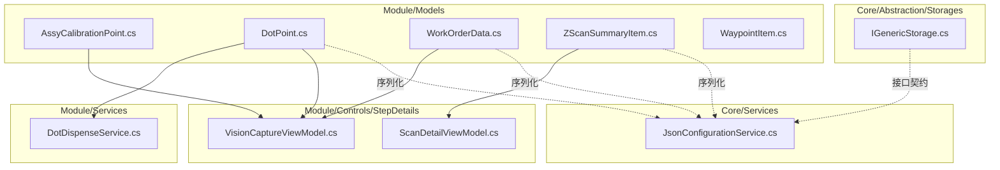
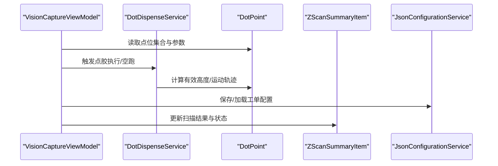
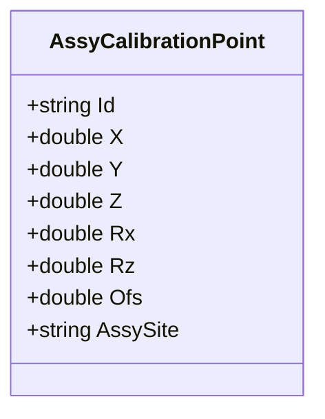
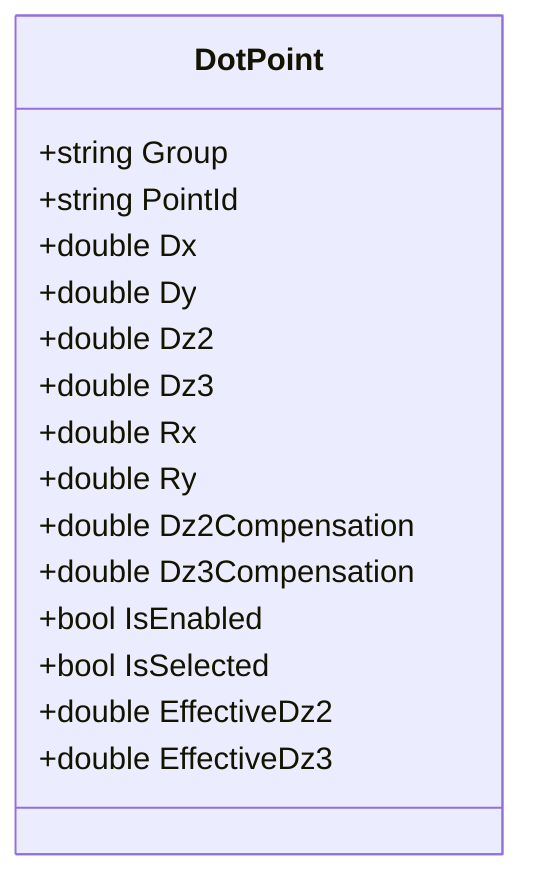
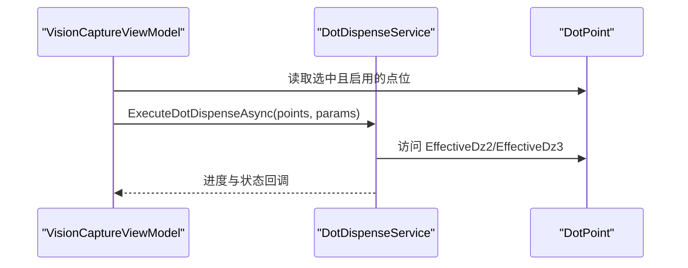
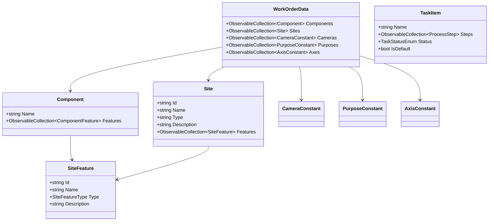
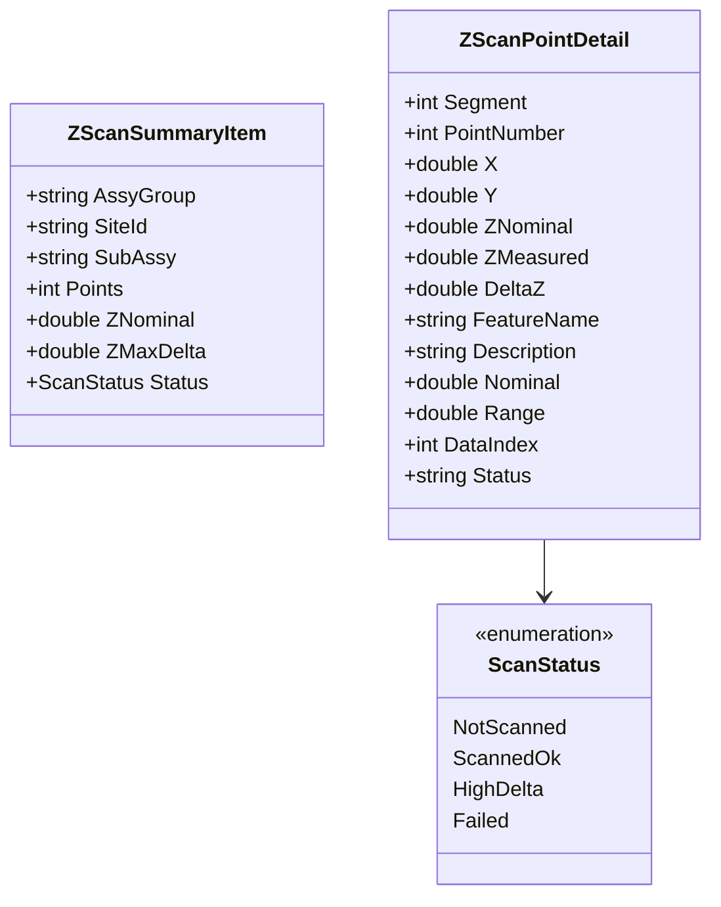
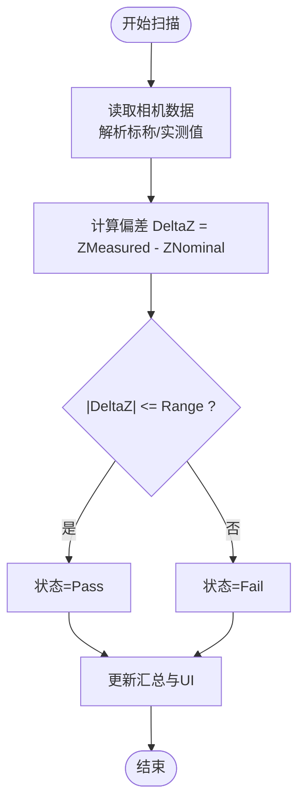
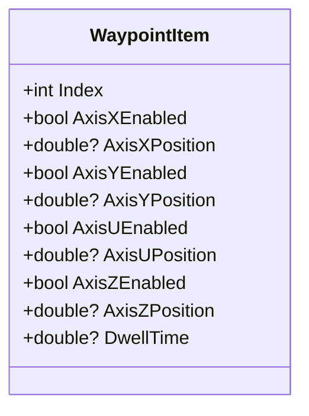
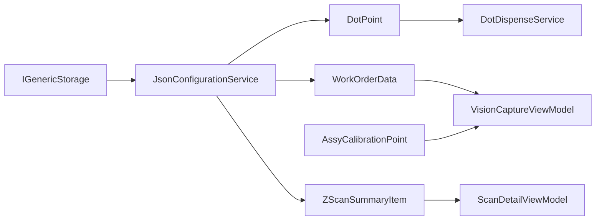

# 核心数据模型

<cite>
**本文档引用的文件**
- [AssyCalibrationPoint.cs](file://Module/Models/AssyCalibrationPoint.cs)
- [DotPoint.cs](file://Module/Models/DotPoint.cs)
- [WorkOrderData.cs](file://Module/Models/WorkOrderData.cs)
- [ZScanSummaryItem.cs](file://Module/Models/ZScanSummaryItem.cs)
- [WaypointItem.cs](file://Module/Models/WaypointItem.cs)
- [JsonConfigurationService.cs](file://Core/Services/JsonConfigurationService.cs)
- [IGenericStorage.cs](file://Core/Abstraction/Storages/IGenericStorage.cs)
- [DotDispenseService.cs](file://Module/Services/DotDispenseService.cs)
- [VisionCaptureViewModel.cs](file://Module/Controls/StepDetails/VisionCaptureViewModel.cs)
- [ScanDetailViewModel.cs](file://Module/Controls/StepDetails/ScanDetailViewModel.cs)
- [Strings.zh-CN.xaml](file://MainApp/Languages/Strings.zh-CN.xaml)
- [Strings.en-US.xaml](file://MainApp/Languages/Strings.en-US.xaml)
</cite>

## 目录
1. [简介](#简介)
2. [项目结构](#项目结构)
3. [核心组件](#核心组件)
4. [架构概览](#架构概览)
5. [详细组件分析](#详细组件分析)
6. [依赖分析](#依赖分析)
7. [性能考虑](#性能考虑)
8. [故障排除指南](#故障排除指南)
9. [结论](#结论)
10. [附录](#附录)

## 简介
本文件聚焦于 Module 模块的核心数据模型，系统性阐述以下关键业务模型：
- 装配校准点（AssyCalibrationPoint）：坐标定义与装配校准场景下的姿态参数。
- 点胶点（DotPoint）：几何参数、补偿机制与工艺配置约束。
- 工作订单数据（WorkOrderData）：组件、站点、相机、用途与轴的生产计划管理结构。
- Z 扫描摘要（ZScanSummaryItem）：高度测量数据结构与状态管理。
- 路径航点（WaypointItem）：运动轨迹定义与可选轴位。

文档将详细说明各模型的字段定义、数据类型、验证规则与业务约束，并提供模型间的关系图、数据流转示例以及序列化/反序列化与持久化的实现机制。

## 项目结构
这些核心模型位于 Module/Models 下，作为业务层的基础数据载体，服务于点胶、装配、视觉捕获与 Z 扫描等场景。它们通过 Prism.Mvvm 的 BindableBase 提供绑定能力，并与 Core/Services 的 JSON 配置服务协同实现持久化。

图表来源
- [AssyCalibrationPoint.cs:1-17](file://Module/Models/AssyCalibrationPoint.cs#L1-L17)
- [DotPoint.cs:1-145](file://Module/Models/DotPoint.cs#L1-L145)
- [WorkOrderData.cs:1-265](file://Module/Models/WorkOrderData.cs#L1-L265)
- [ZScanSummaryItem.cs:1-203](file://Module/Models/ZScanSummaryItem.cs#L1-L203)
- [WaypointItem.cs:1-38](file://Module/Models/WaypointItem.cs#L1-L38)
- [JsonConfigurationService.cs:1-60](file://Core/Services/JsonConfigurationService.cs#L1-L60)
- [IGenericStorage.cs:1-12](file://Core/Abstraction/Storages/IGenericStorage.cs#L1-L12)
- [DotDispenseService.cs:1-297](file://Module/Services/DotDispenseService.cs#L1-L297)
- [VisionCaptureViewModel.cs:228-671](file://Module/Controls/StepDetails/VisionCaptureViewModel.cs#L228-L671)
- [ScanDetailViewModel.cs:473-495](file://Module/Controls/StepDetails/ScanDetailViewModel.cs#L473-L495)

章节来源
- [AssyCalibrationPoint.cs:1-17](file://Module/Models/AssyCalibrationPoint.cs#L1-L17)
- [DotPoint.cs:1-145](file://Module/Models/DotPoint.cs#L1-L145)
- [WorkOrderData.cs:1-265](file://Module/Models/WorkOrderData.cs#L1-L265)
- [ZScanSummaryItem.cs:1-203](file://Module/Models/ZScanSummaryItem.cs#L1-L203)
- [WaypointItem.cs:1-38](file://Module/Models/WaypointItem.cs#L1-L38)
- [JsonConfigurationService.cs:1-60](file://Core/Services/JsonConfigurationService.cs#L1-L60)
- [IGenericStorage.cs:1-12](file://Core/Abstraction/Storages/IGenericStorage.cs#L1-L12)

## 核心组件
本节概述五个核心数据模型的职责与边界：
- AssyCalibrationPoint：装配校准场景下的姿态坐标（X/Y/Z/Rx/Rz/Ofs）与装配站点标识。
- DotPoint：点胶过程的目标点位，包含几何偏移（Dx/Dy）、Z2/Z3 高度及其补偿、旋转角度（Rx/Ry）、启用/选中状态与有效高度派生属性。
- WorkOrderData：生产计划管理的数据容器，包含组件、站点、相机、用途与轴的常量集合，以及任务项与验证结果。
- ZScanSummaryItem：Z 扫描的汇总与逐点明细，涵盖标称值、实测值、偏差、状态与描述等。
- WaypointItem：运动轨迹的航点定义，包含各轴使能与目标位置、U 轴与 Z 轴可选位置、可选停留时间。

章节来源
- [AssyCalibrationPoint.cs:1-17](file://Module/Models/AssyCalibrationPoint.cs#L1-L17)
- [DotPoint.cs:1-145](file://Module/Models/DotPoint.cs#L1-L145)
- [WorkOrderData.cs:1-265](file://Module/Models/WorkOrderData.cs#L1-L265)
- [ZScanSummaryItem.cs:1-203](file://Module/Models/ZScanSummaryItem.cs#L1-L203)
- [WaypointItem.cs:1-38](file://Module/Models/WaypointItem.cs#L1-L38)

## 架构概览
核心模型与服务/视图模型的交互关系如下：

图表来源
- [VisionCaptureViewModel.cs:811-879](file://Module/Controls/StepDetails/VisionCaptureViewModel.cs#L811-L879)
- [DotDispenseService.cs:102-213](file://Module/Services/DotDispenseService.cs#L102-L213)
- [DotPoint.cs:132-140](file://Module/Models/DotPoint.cs#L132-L140)
- [ZScanSummaryItem.cs:1-203](file://Module/Models/ZScanSummaryItem.cs#L1-L203)
- [JsonConfigurationService.cs:20-49](file://Core/Services/JsonConfigurationService.cs#L20-L49)

## 详细组件分析

### 装配校准点（AssyCalibrationPoint）
- 字段定义与类型
  - Id：字符串，唯一标识
  - X/Y/Z：双精度浮点数，装配坐标系位置
  - Rx/Rz：双精度浮点数，绕 X/Z 轴的姿态角
  - Ofs：双精度浮点数，装配偏移量
  - AssySite：字符串，装配站点标识
- 业务约束
  - 作为装配校准的参考点，通常与视觉或机械对齐结果关联。
  - Rx/Rz 的取值范围未在模型中显式限制，应结合设备/工艺约束进行校验。
- 数据绑定
  - 基于 BindableBase，支持 UI 绑定与变更通知。

图表来源
- [AssyCalibrationPoint.cs:3-16](file://Module/Models/AssyCalibrationPoint.cs#L3-L16)

章节来源
- [AssyCalibrationPoint.cs:1-17](file://Module/Models/AssyCalibrationPoint.cs#L1-L17)

### 点胶点（DotPoint）
- 字段定义与类型
  - Group：字符串，默认值“ASSY_001”，分组标识
  - PointId：字符串，默认值“DOT_001”，点位标识
  - Dx/Dy：双精度浮点数，X/Y 方向偏移量
  - Dz2/Dz3：双精度浮点数，Z2/Z3 轴高度，范围[-200, 200]
  - Rx/Ry：双精度浮点数，X/Y 轴旋转角度，范围[-360, 360]
  - Dz2Compensation/Dz3Compensation：双精度浮点数，Z2/Z3 轴补偿，范围[-50, 50]
  - IsEnabled：布尔值，默认 true，是否启用
  - IsSelected：布尔值，默认 true，是否选中
- 有效高度派生属性
  - EffectiveDz2 = Dz2 + Dz2Compensation
  - EffectiveDz3 = Dz3 + Dz3Compensation
- 业务约束与验证规则
  - Dz2、Dz3、Dz2Compensation、Dz3Compensation 使用数值钳制（Clamp）限制范围，防止越界。
  - Rx、Ry 使用数值钳制限制范围。
  - IsEnabled/IsSelected 用于批量启用/过滤与执行控制。
- 工艺配置与执行
  - 点胶服务（DotDispenseService）依据 EffectiveDz2/EffectiveDz3 与工艺参数决定 Z 轴目标高度与两段式下降策略。
  - 支持空跑（DryRun）与真实点胶（ExecuteDotDispense），并提供示教（TeachPoint）功能。

图表来源
- [DotPoint.cs:9-143](file://Module/Models/DotPoint.cs#L9-L143)

图表来源
- [VisionCaptureViewModel.cs:811-879](file://Module/Controls/StepDetails/VisionCaptureViewModel.cs#L811-L879)
- [DotDispenseService.cs:102-213](file://Module/Services/DotDispenseService.cs#L102-L213)
- [DotPoint.cs:132-140](file://Module/Models/DotPoint.cs#L132-L140)

章节来源
- [DotPoint.cs:1-145](file://Module/Models/DotPoint.cs#L1-L145)
- [DotDispenseService.cs:1-297](file://Module/Services/DotDispenseService.cs#L1-L297)
- [Strings.zh-CN.xaml:669-688](file://MainApp/Languages/Strings.zh-CN.xaml#L669-L688)
- [Strings.en-US.xaml:639-659](file://MainApp/Languages/Strings.en-US.xaml#L639-L659)

### 工作订单数据（WorkOrderData）
- 结构组成
  - WorkOrderData：顶层容器，包含组件（Components）、站点（Sites）、相机（Cameras）、用途（Purposes）、轴（Axes）集合。
  - Component：组件名称与特性集合（ComponentFeature）。
  - Site：站点标识、名称、类型、描述与特性集合（SiteFeature）。
  - SiteFeature：站点特性标识、名称、类型（SiteFeatureType）与描述。
  - CameraConstant/PurposeConstant/AxisConstant：相机、用途、轴的常量配置。
  - TaskItem：任务项，包含名称、步骤集合（ObservableCollection<ProcessStep>）、状态（TaskStatusEnum）与默认标记。
  - ValidationItem：验证结果项（消息与有效性）。
- 业务约束
  - 使用 ObservableCollection 支持 UI 动态绑定与变更通知。
  - SiteFeatureType 枚举限定站点特性类型（Site、Dispense、AssyGroup）。
- 生产计划管理
  - 通过组件与站点特性组织装配/点胶/检查等工序的配置与执行。

图表来源
- [WorkOrderData.cs:12-264](file://Module/Models/WorkOrderData.cs#L12-L264)

章节来源
- [WorkOrderData.cs:1-265](file://Module/Models/WorkOrderData.cs#L1-L265)
- [VisionCaptureViewModel.cs:646-671](file://Module/Controls/StepDetails/VisionCaptureViewModel.cs#L646-L671)

### Z 扫描摘要（ZScanSummaryItem）
- 汇总行数据（ZScanSummaryItem）
  - AssyGroup/SiteId/SubAssy：装配组、工位标识、子装配标识
  - Points：测量点数量
  - ZNominal/ZMaxDelta：标称高度与最大偏差
  - Status：扫描状态（枚举 ScanStatus）
- 逐点测量数据（ZScanPointDetail）
  - Segment/PointNumber：测量段号与点序号
  - X/Y：理论/实际位置坐标
  - ZNominal/ZMeasured/DeltaZ：标称值、实测值与偏差
  - FeatureName：特征名称（向后兼容）
  - 新增字段：Description（描述）、Nominal（标称值，与 ZNominal 同步）、Range（允许偏差范围）、DataIndex（相机数据索引）、Status（状态）
- 状态与判定
  - ScanStatus：未扫描、扫描成功、高偏差、失败
  - Status 字段用于 UI 显示与统计汇总（Pass/Fail 判定基于 |DeltaZ| <= Range）

图表来源
- [ZScanSummaryItem.cs:8-203](file://Module/Models/ZScanSummaryItem.cs#L8-L203)

图表来源
- [ZScanSummaryItem.cs:126-171](file://Module/Models/ZScanSummaryItem.cs#L126-L171)
- [ScanDetailViewModel.cs:473-495](file://Module/Controls/StepDetails/ScanDetailViewModel.cs#L473-L495)

章节来源
- [ZScanSummaryItem.cs:1-203](file://Module/Models/ZScanSummaryItem.cs#L1-L203)
- [ScanDetailViewModel.cs:473-495](file://Module/Controls/StepDetails/ScanDetailViewModel.cs#L473-L495)

### 路径航点（WaypointItem）
- 字段定义与类型
  - Index：整型，航点序号
  - AxisXEnabled/XPosition：布尔与可空双精度，X 轴使能与目标位置
  - AxisYEnabled/YPosition：布尔与可空双精度，Y 轴使能与目标位置
  - AxisUEnabled/UPosition：布尔与可空双精度，U 轴使能与目标位置
  - AxisZEnabled/ZPosition：布尔与可空双精度，Z 轴使能与目标位置
  - DwellTime：可空双精度，停留时间
- 业务约束
  - 仅在对应轴使能时生效；未使能的轴位置为空，表示不参与该航点运动。
- 运动轨迹定义
  - 通过多个 WaypointItem 组成连续运动路径，结合 DwellTime 实现定位与驻留。

图表来源
- [WaypointItem.cs:5-36](file://Module/Models/WaypointItem.cs#L5-L36)

章节来源
- [WaypointItem.cs:1-38](file://Module/Models/WaypointItem.cs#L1-L38)

## 依赖分析
- 模型与服务/视图模型的耦合
  - DotPoint 与 DotDispenseService：点胶执行依赖点位的有效高度与工艺参数。
  - ZScanSummaryItem 与 ScanDetailViewModel：扫描结果与状态驱动 UI 展示。
  - WorkOrderData 与 VisionCaptureViewModel：工单配置驱动站点/特性与位置映射。
  - AssyCalibrationPoint 与 VisionCaptureViewModel：装配校准点参与视觉/机械对齐。
- 持久化与配置
  - JsonConfigurationService：提供 JSON 序列化/反序列化与文件持久化，配置路径为应用目录下的 Config/Position。
  - IGenericStorage：抽象存储接口，可用于替换不同存储后端（如数据库）。

图表来源
- [DotDispenseService.cs:1-297](file://Module/Services/DotDispenseService.cs#L1-L297)
- [ScanDetailViewModel.cs:473-495](file://Module/Controls/StepDetails/ScanDetailViewModel.cs#L473-L495)
- [VisionCaptureViewModel.cs:646-671](file://Module/Controls/StepDetails/VisionCaptureViewModel.cs#L646-L671)
- [JsonConfigurationService.cs:20-49](file://Core/Services/JsonConfigurationService.cs#L20-L49)
- [IGenericStorage.cs:4-9](file://Core/Abstraction/Storages/IGenericStorage.cs#L4-L9)

章节来源
- [JsonConfigurationService.cs:1-60](file://Core/Services/JsonConfigurationService.cs#L1-L60)
- [IGenericStorage.cs:1-12](file://Core/Abstraction/Storages/IGenericStorage.cs#L1-L12)

## 性能考虑
- 数值钳制与派生属性
  - DotPoint 对关键数值进行钳制，避免越界导致的运动控制异常，提升执行稳定性。
  - EffectiveDz2/EffectiveDz3 派生属性减少重复计算，提高 UI 刷新效率。
- 批量操作与过滤
  - IsEnabled/IsSelected 用于批量启用/过滤，降低无效点位的执行成本。
- 文件 I/O 优化
  - JsonConfigurationService 将配置保存在应用目录的 Config/Position，避免频繁磁盘访问；建议在批量更新时合并写入。

## 故障排除指南
- 点胶执行异常
  - 确认 DotPoint 的 Dz2/Dz3 与 Dz2Compensation/Dz3Compensation 未超出钳制范围。
  - 检查 DotDispenseService 的进度与状态回调，定位取消/错误发生阶段。
- Z 扫描状态异常
  - 检查 ZScanPointDetail 的 Range 设置与 DeltaZ 计算，确认状态判定逻辑。
  - 确认相机数据索引（DataIndex）与实际数据长度匹配。
- 工单配置加载失败
  - 检查 JsonConfigurationService 的配置路径是否存在，JSON 格式是否正确。
- UI 绑定失效
  - 确保模型继承 BindableBase 并在属性 setter 中调用 SetProperty，触发 PropertyChanged。

章节来源
- [DotDispenseService.cs:77-90](file://Module/Services/DotDispenseService.cs#L77-L90)
- [DotDispenseService.cs:195-208](file://Module/Services/DotDispenseService.cs#L195-L208)
- [ZScanSummaryItem.cs:145-171](file://Module/Models/ZScanSummaryItem.cs#L145-L171)
- [JsonConfigurationService.cs:34-49](file://Core/Services/JsonConfigurationService.cs#L34-L49)

## 结论
本文档系统梳理了 Module 模块的核心数据模型，明确了装配校准点、点胶点、工作订单数据、Z 扫描摘要与路径航点的字段定义、验证规则与业务约束，并展示了它们与服务/视图模型的交互关系与持久化机制。通过合理的数值钳制、派生属性与配置管理，这些模型为点胶、装配与检测等业务提供了稳定可靠的数据基础。

## 附录
- 序列化/反序列化与持久化
  - 使用 Newtonsoft.Json 进行对象序列化与反序列化。
  - 默认配置路径：应用目录/Config/Position，文件名为 sectionName.json。
- 术语说明
  - EffectiveDz2/EffectiveDz3：有效高度，用于点胶执行时的最终目标高度。
  - ScanStatus：扫描状态枚举，用于汇总与逐点判定。
  - SiteFeatureType：站点特性类型，区分工位、点胶位与装配组。