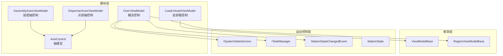
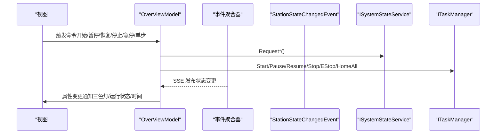
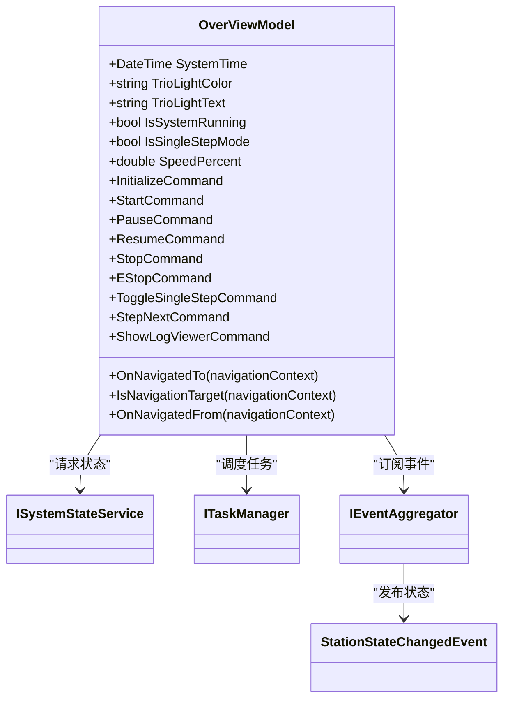
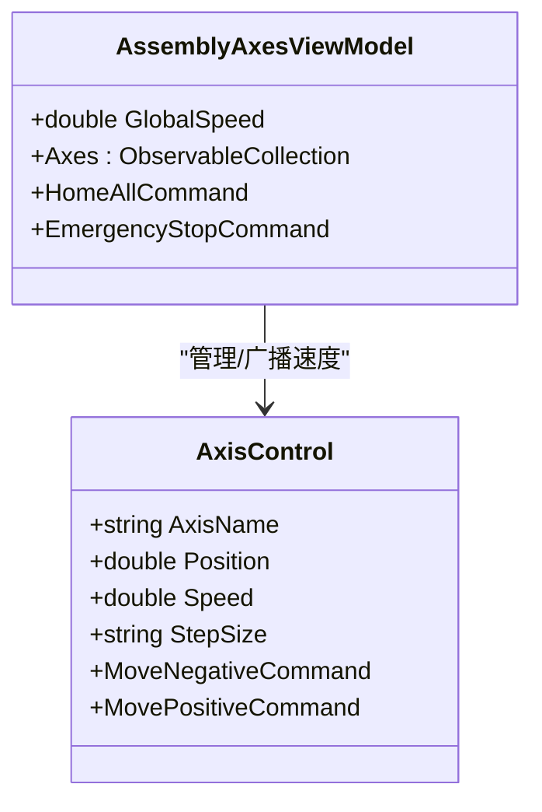
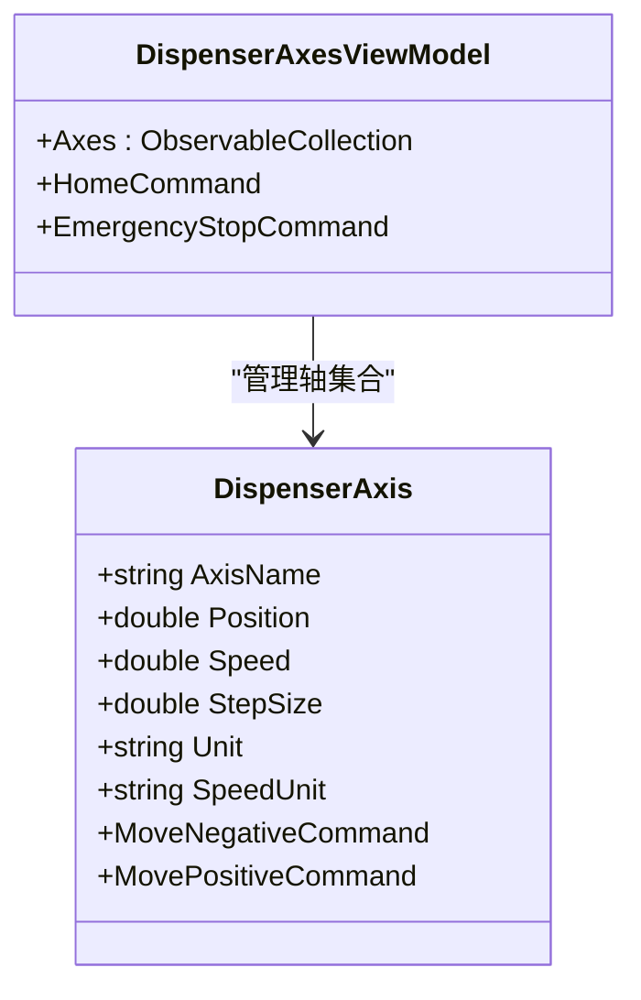
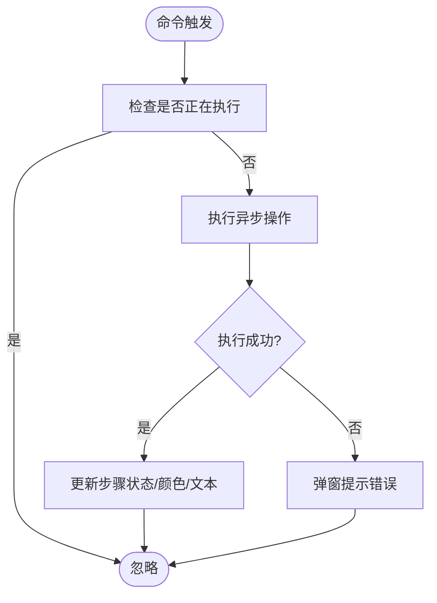
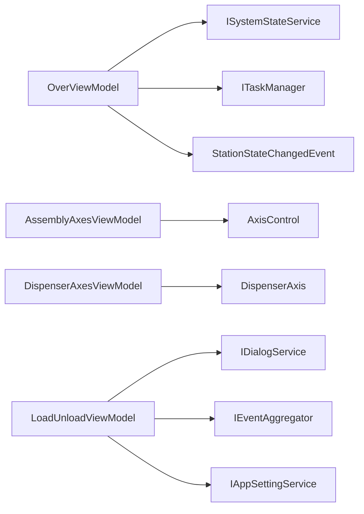

# 模块视图模型

<cite>
**本文引用的文件**
- [OverViewModel.cs](file://Module/ViewModels/OverViewModel.cs)
- [AssemblyAxesViewModel.cs](file://Module/Controls/Assembly/AssemblyAxesViewModel.cs)
- [DispenserAxesViewModel.cs](file://Module/Controls/Dispense/DispenserAxesViewModel.cs)
- [LoadUnloadViewModel.cs](file://Module/Controls/Loading/LoadUnloadViewModel.cs)
- [AxisControl.cs](file://Module/Models/AxisControl.cs)
- [ViewModelBase.cs](file://Framework/Mvvm/ViewModelBase.cs)
- [RegionViewModelBase.cs](file://Framework/Mvvm/RegionViewModelBase.cs)
- [StationStateChangedEvent.cs](file://MotionControl/Events/StationStateChangedEvent.cs)
- [ITaskManager.cs](file://MotionControl/Interfaces/ITaskManager.cs)
- [ISystemStateService.cs](file://MotionControl/Interfaces/ISystemStateService.cs)
- [StationState.cs](file://MotionControl/Models/StationState.cs)
- [OverView.xaml.cs](file://Module/Views/OverView.xaml.cs)
</cite>

## 目录
1. [简介](#简介)
2. [项目结构](#项目结构)
3. [核心组件](#核心组件)
4. [架构总览](#架构总览)
5. [详细组件分析](#详细组件分析)
6. [依赖关系分析](#依赖关系分析)
7. [性能考量](#性能考量)
8. [故障排查指南](#故障排查指南)
9. [结论](#结论)
10. [附录](#附录)

## 简介
本文件面向“模块视图模型”主题，系统梳理并深入解析以下内容：
- OverViewModel 等核心视图模型的设计模式与职责边界
- 数据绑定机制（属性变更通知、双向绑定、视图状态管理）
- 命令处理逻辑（Prism DelegateCommand、异步命令封装）
- 具体装配轴、点胶轴、装卸载视图模型的实现细节
- 视图模型生命周期管理、内存优化与性能监控最佳实践

## 项目结构
本项目采用 Prism MVVM 架构，模块化组织视图与视图模型，核心位于 Module 与 Framework 子目录；运动控制与状态管理由 MotionControl 提供服务接口与事件。

图表来源
- [OverViewModel.cs:19-130](file://Module/ViewModels/OverViewModel.cs#L19-L130)
- [AssemblyAxesViewModel.cs:9-51](file://Module/Controls/Assembly/AssemblyAxesViewModel.cs#L9-L51)
- [DispenserAxesViewModel.cs:10-58](file://Module/Controls/Dispense/DispenserAxesViewModel.cs#L10-L58)
- [LoadUnloadViewModel.cs:23-195](file://Module/Controls/Loading/LoadUnloadViewModel.cs#L23-L195)
- [ViewModelBase.cs:6-15](file://Framework/Mvvm/ViewModelBase.cs#L6-L15)
- [RegionViewModelBase.cs:6-32](file://Framework/Mvvm/RegionViewModelBase.cs#L6-L32)
- [StationStateChangedEvent.cs:6-17](file://MotionControl/Events/StationStateChangedEvent.cs#L6-L17)
- [ITaskManager.cs:9-21](file://MotionControl/Interfaces/ITaskManager.cs#L9-L21)
- [ISystemStateService.cs:5-22](file://MotionControl/Interfaces/ISystemStateService.cs#L5-L22)
- [StationState.cs:3-15](file://MotionControl/Models/StationState.cs#L3-L15)

章节来源
- [OverViewModel.cs:19-130](file://Module/ViewModels/OverViewModel.cs#L19-L130)
- [AssemblyAxesViewModel.cs:9-51](file://Module/Controls/Assembly/AssemblyAxesViewModel.cs#L9-L51)
- [DispenserAxesViewModel.cs:10-58](file://Module/Controls/Dispense/DispenserAxesViewModel.cs#L10-L58)
- [LoadUnloadViewModel.cs:23-195](file://Module/Controls/Loading/LoadUnloadViewModel.cs#L23-L195)
- [ViewModelBase.cs:6-15](file://Framework/Mvvm/ViewModelBase.cs#L6-L15)
- [RegionViewModelBase.cs:6-32](file://Framework/Mvvm/RegionViewModelBase.cs#L6-L32)
- [StationStateChangedEvent.cs:6-17](file://MotionControl/Events/StationStateChangedEvent.cs#L6-L17)
- [ITaskManager.cs:9-21](file://MotionControl/Interfaces/ITaskManager.cs#L9-L21)
- [ISystemStateService.cs:5-22](file://MotionControl/Interfaces/ISystemStateService.cs#L5-L22)
- [StationState.cs:3-15](file://MotionControl/Models/StationState.cs#L3-L15)

## 核心组件
- OverViewModel：系统级概览控制，负责系统启动/暂停/恢复/停止/急停、单步模式切换、速度控制、三色灯状态与系统时间显示，并通过事件驱动刷新 UI。
- AssemblyAxesViewModel：装配轴控制，集中管理多轴状态与全局速度，提供回零与急停命令。
- DispenserAxesViewModel：点胶轴控制，包含轴模型与移动命令，提供回零与急停命令。
- LoadUnloadViewModel：装卸载控制，封装大量异步命令与实时状态更新，提供真空、夹爪、站点选择等操作。
- ViewModelBase/RegionViewModelBase：框架基类，统一生命周期与导航契约。

章节来源
- [OverViewModel.cs:19-130](file://Module/ViewModels/OverViewModel.cs#L19-L130)
- [AssemblyAxesViewModel.cs:9-51](file://Module/Controls/Assembly/AssemblyAxesViewModel.cs#L9-L51)
- [DispenserAxesViewModel.cs:10-58](file://Module/Controls/Dispense/DispenserAxesViewModel.cs#L10-L58)
- [LoadUnloadViewModel.cs:23-195](file://Module/Controls/Loading/LoadUnloadViewModel.cs#L23-L195)
- [ViewModelBase.cs:6-15](file://Framework/Mvvm/ViewModelBase.cs#L6-L15)
- [RegionViewModelBase.cs:6-32](file://Framework/Mvvm/RegionViewModelBase.cs#L6-L32)

## 架构总览
下图展示视图模型与外部服务的交互关系，包括事件订阅、命令分发与状态驱动。

图表来源
- [OverViewModel.cs:118-130](file://Module/ViewModels/OverViewModel.cs#L118-L130)
- [StationStateChangedEvent.cs:6-17](file://MotionControl/Events/StationStateChangedEvent.cs#L6-L17)
- [ITaskManager.cs:9-21](file://MotionControl/Interfaces/ITaskManager.cs#L9-L21)
- [ISystemStateService.cs:5-22](file://MotionControl/Interfaces/ISystemStateService.cs#L5-L22)

## 详细组件分析

### OverViewModel：系统概览控制
- 设计模式
  - 继承 Prism 的 BindableBase，实现 INavigationAware，遵循 Prism MVVM 约定。
  - 通过事件驱动刷新 UI，避免直接耦合底层设备。
- 数据绑定机制
  - 使用 SetProperty 自动生成属性变更通知，驱动 XAML 绑定。
  - 使用 DispatcherTimer 每秒更新系统时间，确保 UI 实时性。
- 命令处理逻辑
  - 使用 DelegateCommand 包装业务方法，部分命令基于 CanExecute 动态启用/禁用。
  - 速度百分比变更通过事件回调同步到 UI。
- 视图状态管理
  - 订阅 StationStateChangedEvent，根据状态映射三色灯颜色与文本，同时控制运行态显示。
- 生命周期与导航
  - OnNavigatedTo 自动挂载子区域视图（任务监控、速度控制），便于模块化布局。

图表来源
- [OverViewModel.cs:19-130](file://Module/ViewModels/OverViewModel.cs#L19-L130)
- [StationStateChangedEvent.cs:6-17](file://MotionControl/Events/StationStateChangedEvent.cs#L6-L17)
- [ISystemStateService.cs:5-22](file://MotionControl/Interfaces/ISystemStateService.cs#L5-L22)
- [ITaskManager.cs:9-21](file://MotionControl/Interfaces/ITaskManager.cs#L9-L21)

章节来源
- [OverViewModel.cs:19-130](file://Module/ViewModels/OverViewModel.cs#L19-L130)
- [OverViewModel.cs:131-159](file://Module/ViewModels/OverViewModel.cs#L131-L159)
- [OverViewModel.cs:162-232](file://Module/ViewModels/OverViewModel.cs#L162-L232)
- [OverViewModel.cs:233-254](file://Module/ViewModels/OverViewModel.cs#L233-L254)

### 装配轴视图模型（AssemblyAxesViewModel）
- 设计模式
  - 集中式轴管理，全局速度变更广播至各轴，保持一致性。
- 数据绑定机制
  - Axes 为 ObservableCollection，支持视图自动刷新。
  - GlobalSpeed 变更时批量更新各轴 Speed。
- 命令处理逻辑
  - HomeAllCommand：一键归零。
  - EmergencyStopCommand：触发急停提示（可扩展为实际设备动作）。

图表来源
- [AssemblyAxesViewModel.cs:9-51](file://Module/Controls/Assembly/AssemblyAxesViewModel.cs#L9-L51)
- [AxisControl.cs:11-82](file://Module/Models/AxisControl.cs#L11-L82)

章节来源
- [AssemblyAxesViewModel.cs:9-51](file://Module/Controls/Assembly/AssemblyAxesViewModel.cs#L9-L51)
- [AxisControl.cs:11-82](file://Module/Models/AxisControl.cs#L11-L82)

### 点胶轴视图模型（DispenserAxesViewModel）
- 设计模式
  - 内嵌 DispenserAxis 值对象，封装轴名称、位置、速度、步进与单位。
- 数据绑定机制
  - 通过 ObservableCollection 暴露 Axes，支持视图绑定与编辑。
- 命令处理逻辑
  - HomeCommand：弹窗提示后模拟回零。
  - EmergencyStopCommand：弹窗提示急停。
  - 每个 DispenserAxis 提供正/负向移动命令，基于 StepSize 变更 Position。

图表来源
- [DispenserAxesViewModel.cs:10-58](file://Module/Controls/Dispense/DispenserAxesViewModel.cs#L10-L58)
- [DispenserAxesViewModel.cs:60-114](file://Module/Controls/Dispense/DispenserAxesViewModel.cs#L60-L114)

章节来源
- [DispenserAxesViewModel.cs:10-58](file://Module/Controls/Dispense/DispenserAxesViewModel.cs#L10-L58)
- [DispenserAxesViewModel.cs:60-114](file://Module/Controls/Dispense/DispenserAxesViewModel.cs#L60-L114)

### 装卸载视图模型（LoadUnloadViewModel）
- 设计模式
  - 基于 ViewModelBase，封装大量异步命令，统一异常处理与状态更新。
- 数据绑定机制
  - 多个布尔/文本/颜色属性用于实时状态指示（如真空、夹爪、轴到位、流程状态）。
  - StepStatusList 用于记录步骤状态，支持上限截断。
- 命令处理逻辑
  - ExecuteAsyncOperation 封装异步命令，防止并发执行，统一错误处理与状态反馈。
  - 提供真空、夹爪、回零、移动、自动流程等命令。
- 实时状态管理
  - 定时器每 500ms 更新轴状态、真空状态与流程状态，保证 UI 与设备状态一致。

图表来源
- [LoadUnloadViewModel.cs:282-319](file://Module/Controls/Loading/LoadUnloadViewModel.cs#L282-L319)
- [LoadUnloadViewModel.cs:340-364](file://Module/Controls/Loading/LoadUnloadViewModel.cs#L340-L364)

章节来源
- [LoadUnloadViewModel.cs:23-195](file://Module/Controls/Loading/LoadUnloadViewModel.cs#L23-L195)
- [LoadUnloadViewModel.cs:197-221](file://Module/Controls/Loading/LoadUnloadViewModel.cs#L197-L221)
- [LoadUnloadViewModel.cs:223-241](file://Module/Controls/Loading/LoadUnloadViewModel.cs#L223-L241)
- [LoadUnloadViewModel.cs:282-319](file://Module/Controls/Loading/LoadUnloadViewModel.cs#L282-L319)
- [LoadUnloadViewModel.cs:340-364](file://Module/Controls/Loading/LoadUnloadViewModel.cs#L340-L364)

### 视图与导航
- OverView.xaml.cs 作为视图载体，配合 OverViewModel 实现导航与区域挂载。
- RegionViewModelBase 提供标准导航契约，OverViewModel 继承自 ViewModelBase 并实现 INavigationAware。

章节来源
- [OverView.xaml.cs:22-31](file://Module/Views/OverView.xaml.cs#L22-L31)
- [RegionViewModelBase.cs:6-32](file://Framework/Mvvm/RegionViewModelBase.cs#L6-L32)
- [ViewModelBase.cs:6-15](file://Framework/Mvvm/ViewModelBase.cs#L6-L15)

## 依赖关系分析
- OverViewModel 依赖 ISystemStateService 与 ITaskManager，通过 StationStateChangedEvent 获取状态变化，驱动 UI。
- AssemblyAxesViewModel/DispenserAxesViewModel 依赖 AxisControl/DispenserAxis 模型，实现轴级控制。
- LoadUnloadViewModel 依赖 IDialogService/IEventAggregator/IAppSettingService/LoginModel，实现权限与对话框集成。

图表来源
- [OverViewModel.cs:21-28](file://Module/ViewModels/OverViewModel.cs#L21-L28)
- [AssemblyAxesViewModel.cs:12](file://Module/Controls/Assembly/AssemblyAxesViewModel.cs#L12)
- [DispenserAxesViewModel.cs:14](file://Module/Controls/Dispense/DispenserAxesViewModel.cs#L14)
- [LoadUnloadViewModel.cs:25-28](file://Module/Controls/Loading/LoadUnloadViewModel.cs#L25-L28)

章节来源
- [OverViewModel.cs:21-28](file://Module/ViewModels/OverViewModel.cs#L21-L28)
- [AssemblyAxesViewModel.cs:12](file://Module/Controls/Assembly/AssemblyAxesViewModel.cs#L12)
- [DispenserAxesViewModel.cs:14](file://Module/Controls/Dispense/DispenserAxesViewModel.cs#L14)
- [LoadUnloadViewModel.cs:25-28](file://Module/Controls/Loading/LoadUnloadViewModel.cs#L25-L28)

## 性能考量
- 事件驱动刷新：OverViewModel 通过事件订阅而非轮询刷新 UI，降低 CPU 占用。
- 命令并发控制：LoadUnloadViewModel 的 ExecuteAsyncOperation 防止命令并发执行，避免资源竞争。
- 定时器粒度：OverViewModel 使用 1 秒定时器，LoadUnloadViewModel 使用 500ms 定时器，兼顾实时性与性能。
- 集中速度广播：AssemblyAxesViewModel 将 GlobalSpeed 变更广播至各轴，减少重复计算。
- 内存优化建议
  - 避免在 ObservableCollection 中存储大型对象，必要时使用轻量标识。
  - 对长列表（如 StepStatusList）设置上限并及时清理。
  - 在视图卸载时取消定时器与事件订阅，防止内存泄漏。

## 故障排查指南
- 三色灯不更新
  - 检查 StationStateChangedEvent 是否被正确发布与订阅。
  - 确认 OnStationStateChanged 在 UI 线程中执行。
- 命令无响应
  - 检查命令的 CanExecute 返回值与 RaiseCanExecuteChanged 调用。
  - 对于异步命令，确认 ExecuteAsyncOperation 的 isExecuting 状态未阻塞。
- 速度百分比不同步
  - 确认 SpeedChanged 事件回调在 UI 线程中更新 SpeedPercent。
- 装卸载状态不同步
  - 检查定时器是否启动，UpdateRealTimeStatus 是否被周期调用。
  - 确认权限模型 LoginModel 的 HasPermission 逻辑与 UI 绑定一致。

章节来源
- [OverViewModel.cs:128-130](file://Module/ViewModels/OverViewModel.cs#L128-L130)
- [OverViewModel.cs:131-159](file://Module/ViewModels/OverViewModel.cs#L131-L159)
- [OverViewModel.cs:210-217](file://Module/ViewModels/OverViewModel.cs#L210-L217)
- [LoadUnloadViewModel.cs:282-319](file://Module/Controls/Loading/LoadUnloadViewModel.cs#L282-L319)
- [LoadUnloadViewModel.cs:229-233](file://Module/Controls/Loading/LoadUnloadViewModel.cs#L229-L233)

## 结论
本项目以 Prism MVVM 为核心，通过事件驱动与命令模式实现强解耦的视图模型设计。OverViewModel 作为系统中枢，协调状态服务与任务管理；AssemblyAxesViewModel 与 DispenserAxesViewModel 提供轴级控制与广播；LoadUnloadViewModel 以异步命令封装与实时状态更新保障复杂流程的可控性。遵循本文的生命周期与性能建议，可在保证稳定性的同时提升用户体验。

## 附录
- 关键接口与事件
  - ISystemStateService：系统状态请求与查询
  - ITaskManager：任务调度与控制
  - StationStateChangedEvent：状态变更事件
  - StationState：状态枚举

章节来源
- [ISystemStateService.cs:5-22](file://MotionControl/Interfaces/ISystemStateService.cs#L5-L22)
- [ITaskManager.cs:9-21](file://MotionControl/Interfaces/ITaskManager.cs#L9-L21)
- [StationStateChangedEvent.cs:6-17](file://MotionControl/Events/StationStateChangedEvent.cs#L6-L17)
- [StationState.cs:3-15](file://MotionControl/Models/StationState.cs#L3-L15)