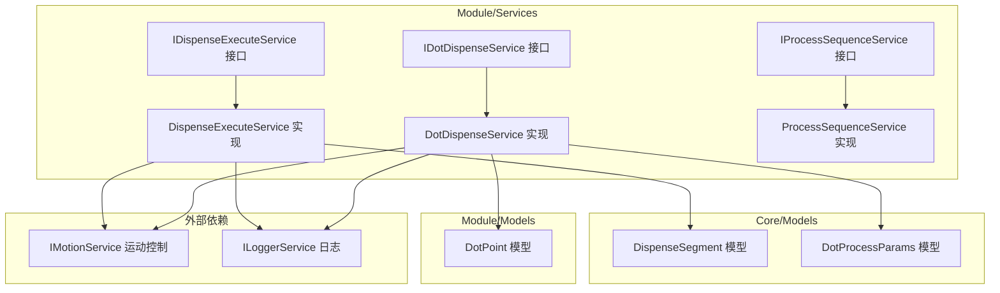
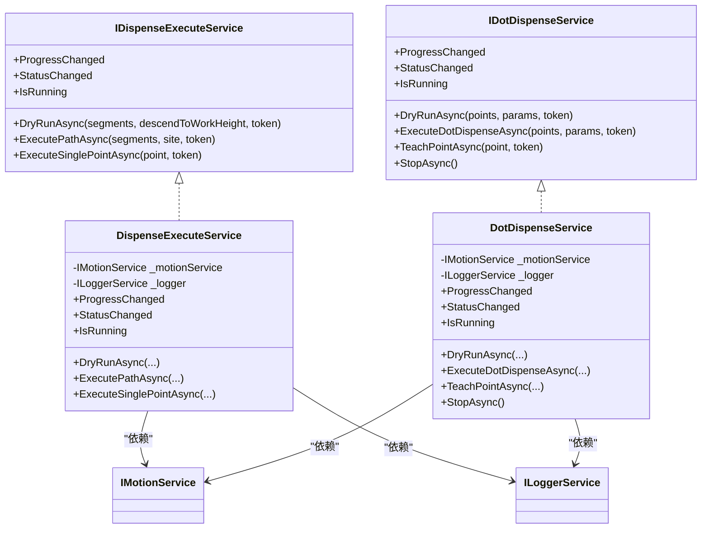
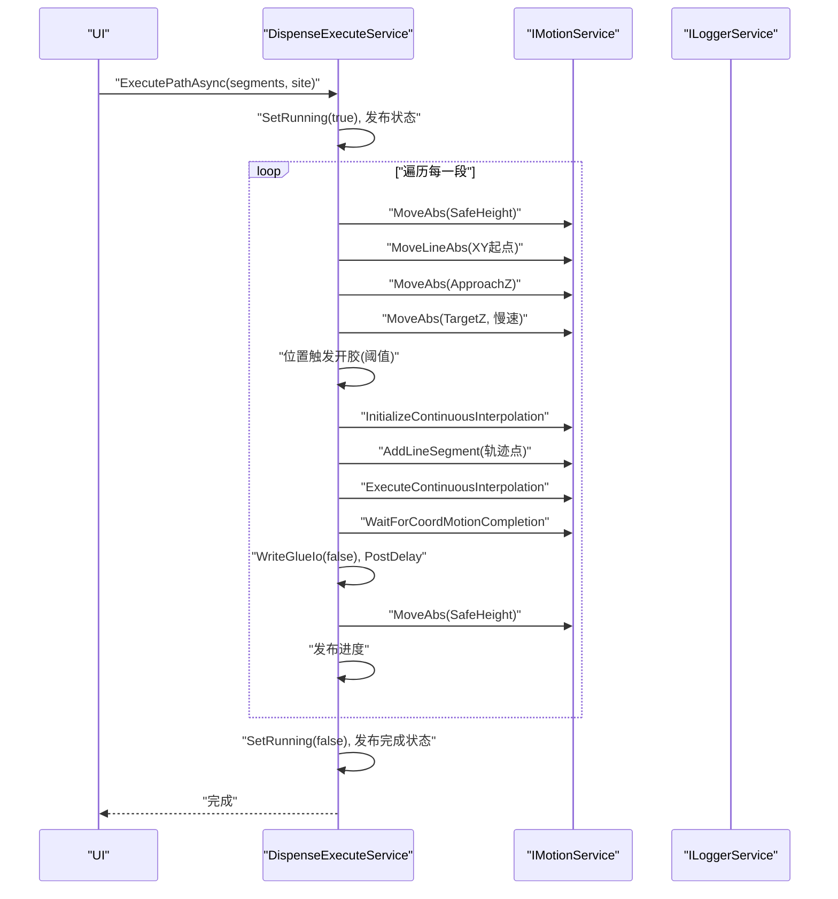
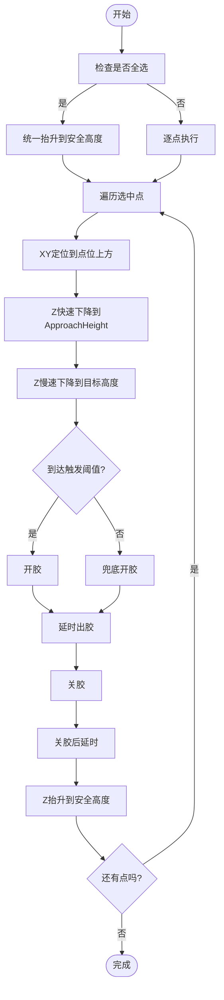
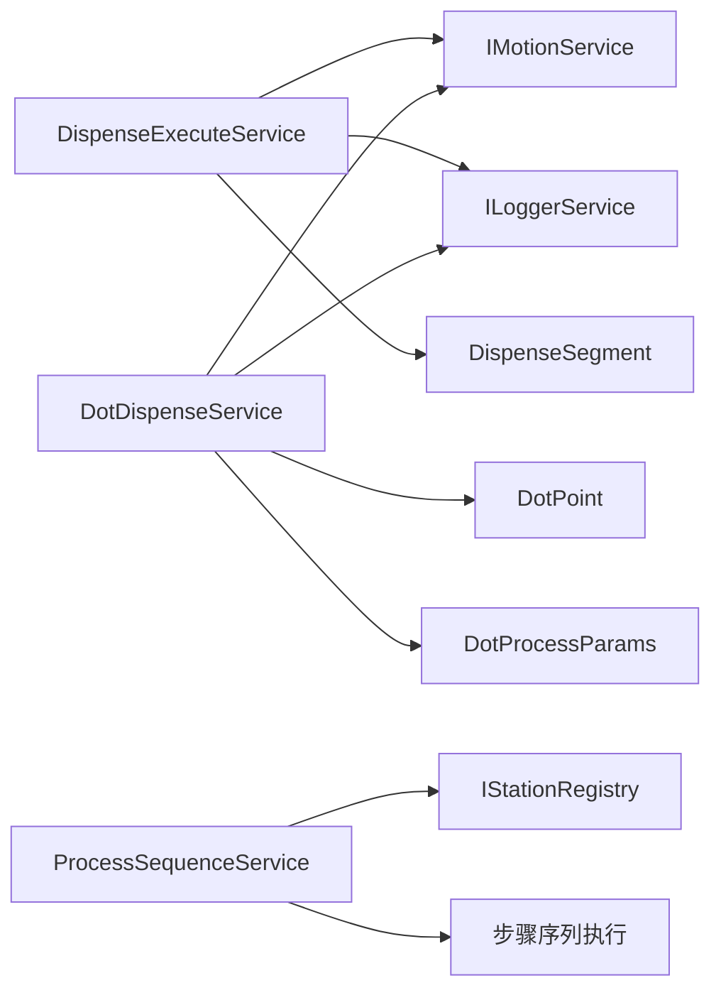

# 点胶服务组件

<cite>
**本文档引用的文件**
- [DispenseExecuteService.cs](file://Module/Services/DispenseExecuteService.cs)
- [DotDispenseService.cs](file://Module/Services/DotDispenseService.cs)
- [IDispenseExecuteService.cs](file://Module/Services/IDispenseExecuteService.cs)
- [IDotDispenseService.cs](file://Module/Services/IDotDispenseService.cs)
- [IProcessSequenceService.cs](file://Module/Services/IProcessSequenceService.cs)
- [ProcessSequenceService.cs](file://Module/Services/ProcessSequenceService.cs)
- [DispenseSegment.cs](file://Core/Models/DispenseSegment.cs)
- [DotPoint.cs](file://Module/Models/DotPoint.cs)
- [DotProcessParams.cs](file://Core/Models/DotProcessParams.cs)
- [DispensingViewModel.cs](file://Module/Controls/Dispense/DispensingViewModel.cs)
- [DotPointEditorViewModel.cs](file://Module/Controls/Dispense/DotPointEditorViewModel.cs)
- [App.xaml.cs](file://MainApp/App.xaml.cs)
- [StationTasksModule.cs](file://StationTasks/StationTasksModule.cs)
</cite>

## 目录
1. [简介](#简介)
2. [项目结构](#项目结构)
3. [核心组件](#核心组件)
4. [架构概览](#架构概览)
5. [详细组件分析](#详细组件分析)
6. [依赖关系分析](#依赖关系分析)
7. [性能考虑](#性能考虑)
8. [故障排查指南](#故障排查指南)
9. [结论](#结论)
10. [附录](#附录)

## 简介
本文件面向Module模块中的点胶服务组件，系统性梳理点胶执行服务（DispenseExecuteService）与点阵点胶服务（DotDispenseService）的设计与实现，覆盖以下关键主题：
- 调度算法与执行流程：包含空跑仿真、路径执行、单点点胶的标准化流程与两段式下降策略
- 状态管理与事件发布：运行状态、进度事件与异常处理
- 图案生成、路径规划与精度控制：基于CAD轨迹与点位模型的离散化与轨迹插补
- 服务接口设计与依赖注入配置：接口契约、实现类与容器注册
- 并发控制与资源管理：取消令牌、线程安全、IO安全关闭与轴停止等待
- 性能优化策略与最佳实践：连续插补、位置触发开胶、延迟控制与超时处理
- 服务调用示例、配置参数说明与故障诊断指南

## 项目结构
点胶服务组件位于Module模块的服务层，围绕两个核心接口展开：
- IDispenseExecuteService：负责将CAD轨迹（DispenseSegment）转换为运动控制指令，支持空跑、路径执行与单点点胶
- IDotDispenseService：负责点阵模式下的空跑、真实点胶与示教操作，支持全选/部分选中两种执行模式

**图表来源**
- [IDispenseExecuteService.cs:12-31](file://Module/Services/IDispenseExecuteService.cs#L12-L31)
- [DispenseExecuteService.cs:16-43](file://Module/Services/DispenseExecuteService.cs#L16-L43)
- [IDotDispenseService.cs:13-35](file://Module/Services/IDotDispenseService.cs#L13-L35)
- [DotDispenseService.cs:17-39](file://Module/Services/DotDispenseService.cs#L17-L39)
- [IProcessSequenceService.cs:11-61](file://Module/Services/IProcessSequenceService.cs#L11-L61)
- [ProcessSequenceService.cs:23-71](file://Module/Services/ProcessSequenceService.cs#L23-L71)
- [DispenseSegment.cs:13-235](file://Core/Models/DispenseSegment.cs#L13-L235)
- [DotPoint.cs:9-144](file://Module/Models/DotPoint.cs#L9-L144)
- [DotProcessParams.cs:10-119](file://Core/Models/DotProcessParams.cs#L10-L119)

**章节来源**
- [IDispenseExecuteService.cs:12-31](file://Module/Services/IDispenseExecuteService.cs#L12-L31)
- [IDotDispenseService.cs:13-35](file://Module/Services/IDotDispenseService.cs#L13-L35)
- [IProcessSequenceService.cs:11-61](file://Module/Services/IProcessSequenceService.cs#L11-L61)

## 核心组件
- 点胶执行服务（DispenseExecuteService）
  - 职责：将DispenseSegment轨迹转换为运动控制指令，支持空跑、路径执行与单点点胶
  - 关键特性：两段式Z轴下降、位置触发开胶、连续插补、超时与取消处理、IO安全关闭
- 点阵点胶服务（DotDispenseService）
  - 职责：点阵模式下的空跑、真实点胶与示教，支持全选/部分选中两种执行模式
  - 关键特性：两段式Z轴下降、位置触发开胶、全选统一抬升、轴停止等待与安全停止
- 服务接口（IDispenseExecuteService、IDotDispenseService）
  - 职责：定义点胶执行的契约，暴露事件与运行状态
- 工序序列服务（ProcessSequenceService）
  - 职责：任务与步骤管理、序列保存/加载、执行宿主选择与运行时控制

**章节来源**
- [DispenseExecuteService.cs:16-43](file://Module/Services/DispenseExecuteService.cs#L16-L43)
- [DotDispenseService.cs:17-39](file://Module/Services/DotDispenseService.cs#L17-L39)
- [IDispenseExecuteService.cs:12-31](file://Module/Services/IDispenseExecuteService.cs#L12-L31)
- [IDotDispenseService.cs:13-35](file://Module/Services/IDotDispenseService.cs#L13-L35)
- [ProcessSequenceService.cs:23-71](file://Module/Services/ProcessSequenceService.cs#L23-L71)

## 架构概览
点胶服务组件采用接口-实现分离与依赖注入模式，通过IMotionService抽象运动控制，通过ILoggerService记录日志。DispenseExecuteService与DotDispenseService均实现各自的接口契约，并通过事件向UI层发布进度与状态。

**图表来源**
- [IDispenseExecuteService.cs:12-31](file://Module/Services/IDispenseExecuteService.cs#L12-L31)
- [DispenseExecuteService.cs:16-43](file://Module/Services/DispenseExecuteService.cs#L16-L43)
- [IDotDispenseService.cs:13-35](file://Module/Services/IDotDispenseService.cs#L13-L35)
- [DotDispenseService.cs:17-39](file://Module/Services/DotDispenseService.cs#L17-L39)

## 详细组件分析

### 点胶执行服务（DispenseExecuteService）
- 调度算法与执行流程
  - 空跑：按段执行，不下降到工作高度，不出胶
  - 路径执行：按段执行，下降到工作高度并出胶，支持预延时与后延时
  - 单点点胶：定点下降→开胶→延时→关胶→上升
  - 两段式Z轴下降：先快速接近（固定偏移），再慢速到位（减速系数），期间进行位置触发开胶
  - 连续插补：初始化插补参数，添加轨迹点，执行插补并等待完成
- 状态管理
  - 运行状态：原子标志位，IsRunning通过原子比较交换读取
  - 事件发布：ProgressChanged与StatusChanged事件用于UI反馈
  - 异常处理：捕获取消与异常，确保在出胶模式下进行安全关胶，发布错误状态
- 并发控制与资源管理
  - 取消令牌：每个异步方法均接收CancellationToken，支持取消
  - IO安全关闭：WriteGlueIo与SafeGlueOff封装，异常时记录日志
  - 轴停止：等待运动完成或超时，避免资源泄漏

**图表来源**
- [DispenseExecuteService.cs:75-213](file://Module/Services/DispenseExecuteService.cs#L75-L213)

**章节来源**
- [DispenseExecuteService.cs:48-213](file://Module/Services/DispenseExecuteService.cs#L48-L213)
- [DispenseSegment.cs:13-235](file://Core/Models/DispenseSegment.cs#L13-L235)

### 点阵点胶服务（DotDispenseService）
- 调度算法与执行流程
  - 空跑：按点执行，Z保持在安全高度，XY定位
  - 真实点胶：两段式Z轴下降，位置触发开胶，延时出胶，关胶后延时，最后抬升
  - 全选模式：统一抬升，逐点执行，减少重复抬升
  - 部分选中模式：逐点完整执行
- 状态管理与事件
  - 进度与状态事件同上，IsRunning通过原子标志位读取
- 安全停止与轴等待
  - StopAsync：关胶并停止相关轴，轮询等待轴位置稳定
  - WaitForAxesStoppedAsync：多轴位置稳定检测，避免残留运动

**图表来源**
- [DotDispenseService.cs:102-213](file://Module/Services/DotDispenseService.cs#L102-L213)

**章节来源**
- [DotDispenseService.cs:44-213](file://Module/Services/DotDispenseService.cs#L44-L213)
- [DotPoint.cs:9-144](file://Module/Models/DotPoint.cs#L9-L144)
- [DotProcessParams.cs:10-119](file://Core/Models/DotProcessParams.cs#L10-L119)

### 服务接口设计
- IDispenseExecuteService
  - 方法：空跑、路径执行、单点点胶
  - 事件：进度与状态变更
  - 属性：运行状态
- IDotDispenseService
  - 方法：空跑、真实点胶、示教、安全停止
  - 事件：进度与状态变更
  - 属性：运行状态

**章节来源**
- [IDispenseExecuteService.cs:12-31](file://Module/Services/IDispenseExecuteService.cs#L12-L31)
- [IDotDispenseService.cs:13-35](file://Module/Services/IDotDispenseService.cs#L13-L35)

### 依赖注入配置
- 容器注册
  - 核心服务：日志、配置、本地化、应用设置、站点注册等
  - 配置提供者：XML配置提供者
  - 视觉数据解析器：默认解析器、脚本解析器、3D相机解析器
  - 工站交互服务、位置提供者、配方工厂、视觉采集服务、贝塞尔弧形点胶服务
- 模块初始化
  - 解析ITask单例，触发工站任务自注册到IStationRegistry

**章节来源**
- [App.xaml.cs:110-177](file://MainApp/App.xaml.cs#L110-L177)
- [StationTasksModule.cs:36-64](file://StationTasks/StationTasksModule.cs#L36-L64)

## 依赖关系分析
- 服务间协作
  - DispenseExecuteService与DotDispenseService均依赖IMotionService与ILoggerService
  - ProcessSequenceService作为序列执行宿主，通过IStationRegistry获取工站任务并执行步骤序列
- 数据模型依赖
  - DispenseExecuteService依赖DispenseSegment模型
  - DotDispenseService依赖DotPoint与DotProcessParams模型

**图表来源**
- [DispenseExecuteService.cs:18-43](file://Module/Services/DispenseExecuteService.cs#L18-L43)
- [DotDispenseService.cs:19-39](file://Module/Services/DotDispenseService.cs#L19-L39)
- [ProcessSequenceService.cs:25-62](file://Module/Services/ProcessSequenceService.cs#L25-L62)
- [DispenseSegment.cs:13-235](file://Core/Models/DispenseSegment.cs#L13-L235)
- [DotPoint.cs:9-144](file://Module/Models/DotPoint.cs#L9-L144)
- [DotProcessParams.cs:10-119](file://Core/Models/DotProcessParams.cs#L10-L119)

**章节来源**
- [ProcessSequenceService.cs:245-325](file://Module/Services/ProcessSequenceService.cs#L245-L325)

## 性能考虑
- 连续插补：在路径执行中使用InitializeContinuousInterpolation与AddLineSegment，减少指令切换开销
- 两段式下降：快速接近+慢速到位，降低冲击与振动，提升轨迹精度
- 位置触发开胶：在慢速下降阶段临近目标高度时触发，避免过冲与胶量控制误差
- 延迟控制：预延时与后延时参数化，平衡胶点质量与生产效率
- 超时与取消：运动完成等待设置超时，支持取消令牌中断，避免资源占用
- 全选模式：统一抬升减少重复动作，提高整体效率

[本节为通用性能讨论，无需列出具体文件来源]

## 故障排查指南
- 空跑/点胶异常
  - 现象：状态变为Error，日志输出异常信息
  - 排查：检查IMotionService通信、IO写入权限、Z轴限位与急停状态
- 运动超时
  - 现象：WaitForCoordMotionCompletion返回false，抛出超时异常
  - 排查：确认机械系统负载、插补参数、路径点密度与速度限制
- 出胶异常
  - 现象：开胶失败或关胶不及时
  - 排查：检查IO端口配置、WriteGlueIo异常日志、兜底开胶逻辑
- 安全停止无效
  - 现象：轴仍在运动
  - 排查：确认StopAxis调用、WaitForAxesStoppedAsync轮询间隔与阈值
- 取消不生效
  - 现象：任务无法中断
  - 排查：确认CancellationToken传递链路、循环内ThrowIfCancellationRequested调用

**章节来源**
- [DispenseExecuteService.cs:195-212](file://Module/Services/DispenseExecuteService.cs#L195-L212)
- [DotDispenseService.cs:195-212](file://Module/Services/DotDispenseService.cs#L195-L212)

## 结论
点胶服务组件通过清晰的接口设计与稳定的实现，提供了从CAD轨迹到运动控制的完整链路。DispenseExecuteService与DotDispenseService分别覆盖路径点胶与点阵点胶场景，结合两段式下降、位置触发开胶与连续插补等策略，在保证精度的同时兼顾效率。配合ProcessSequenceService的序列化与执行宿主机制，形成可扩展、可维护的点胶执行体系。

[本节为总结性内容，无需列出具体文件来源]

## 附录

### 服务调用示例（路径指引）
- 空跑仿真（路径）
  - [DispenseExecuteService.cs:48-51](file://Module/Services/DispenseExecuteService.cs#L48-L51)
- 路径执行（带站点标识）
  - [DispenseExecuteService.cs:56-58](file://Module/Services/DispenseExecuteService.cs#L56-L58)
- 单点点胶
  - [DispenseExecuteService.cs:218-271](file://Module/Services/DispenseExecuteService.cs#L218-L271)
- 点阵空跑
  - [DotDispenseService.cs:44-95](file://Module/Services/DotDispenseService.cs#L44-L95)
- 真实点胶（含全选/部分选中）
  - [DotDispenseService.cs:102-213](file://Module/Services/DotDispenseService.cs#L102-L213)
- 示教单点
  - [DotDispenseService.cs:218-227](file://Module/Services/DotDispenseService.cs#L218-L227)
- 安全停止
  - [DotDispenseService.cs:232-242](file://Module/Services/DotDispenseService.cs#L232-L242)

**章节来源**
- [DispenseExecuteService.cs:48-271](file://Module/Services/DispenseExecuteService.cs#L48-L271)
- [DotDispenseService.cs:44-242](file://Module/Services/DotDispenseService.cs#L44-L242)

### 配置参数说明（模型字段）
- DispenseSegment（路径段）
  - 运动参数：MoveSpeed、CornerDecel、SafeHeight
  - 出胶参数：PreDelay、PostDelay、DispenseAmount
  - 高度参数：ZHeight、TeachHeight、HeightCompensation、EffectiveZHeight
  - 触发参数：GlueTriggerOffsetMm
  - 参考路径：[DispenseSegment.cs:13-235](file://Core/Models/DispenseSegment.cs#L13-L235)
- DotProcessParams（点阵工艺）
  - 运动参数：MoveSpeed、SafeHeight、ApproachHeight、CornerDecel
  - 出胶参数：DispenseTime、PostDelay、DotGlueTriggerOffsetMm
  - 阀控参数：DispensingPressure、SuckBackTime
  - 高度参数：TeachHeight、HeightCompensation、EffectiveZHeight
  - 参考路径：[DotProcessParams.cs:10-119](file://Core/Models/DotProcessParams.cs#L10-L119)
- DotPoint（点位）
  - 坐标与补偿：Dx、Dy、Dz2、Dz3、Dz2Compensation、Dz3Compensation
  - 有效性：EffectiveDz2、EffectiveDz3
  - 参考路径：[DotPoint.cs:9-144](file://Module/Models/DotPoint.cs#L9-L144)

**章节来源**
- [DispenseSegment.cs:13-235](file://Core/Models/DispenseSegment.cs#L13-L235)
- [DotProcessParams.cs:10-119](file://Core/Models/DotProcessParams.cs#L10-L119)
- [DotPoint.cs:9-144](file://Module/Models/DotPoint.cs#L9-L144)

### 依赖注入与模块注册
- 容器注册要点
  - 核心服务：日志、配置、本地化、应用设置、站点注册
  - 配置提供者：XML配置提供者
  - 视觉数据解析器：默认解析器、脚本解析器、3D相机解析器
  - 工站交互服务、位置提供者、配方工厂、视觉采集服务、贝塞尔弧形点胶服务
- 模块初始化
  - 解析ITask单例，触发工站任务自注册到IStationRegistry

**章节来源**
- [App.xaml.cs:110-177](file://MainApp/App.xaml.cs#L110-L177)
- [StationTasksModule.cs:36-64](file://StationTasks/StationTasksModule.cs#L36-L64)

### UI集成参考
- DispensingViewModel（路径点胶界面VM）
  - 事件订阅：ProgressChanged、StatusChanged
  - 参考路径：[DispensingViewModel.cs](file://Module/Controls/Dispense/DispensingViewModel.cs)
- DotPointEditorViewModel（点阵点胶界面VM）
  - 事件订阅：ProgressChanged、StatusChanged
  - 参考路径：[DotPointEditorViewModel.cs](file://Module/Controls/Dispense/DotPointEditorViewModel.cs)

**章节来源**
- [DispensingViewModel.cs](file://Module/Controls/Dispense/DispensingViewModel.cs)
- [DotPointEditorViewModel.cs:224-243](file://Module/Controls/Dispense/DotPointEditorViewModel.cs#L224-L243)