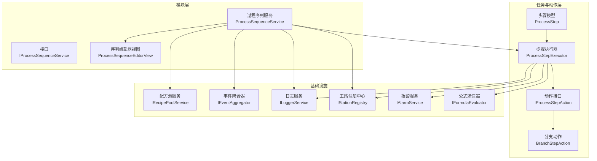
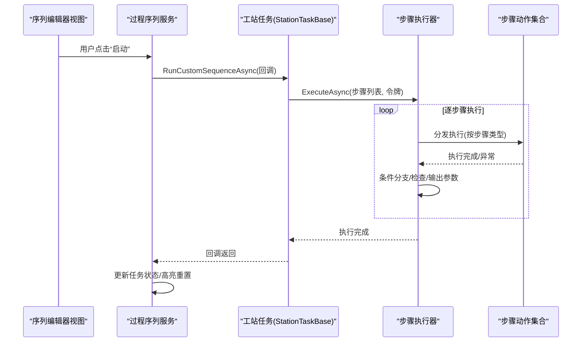
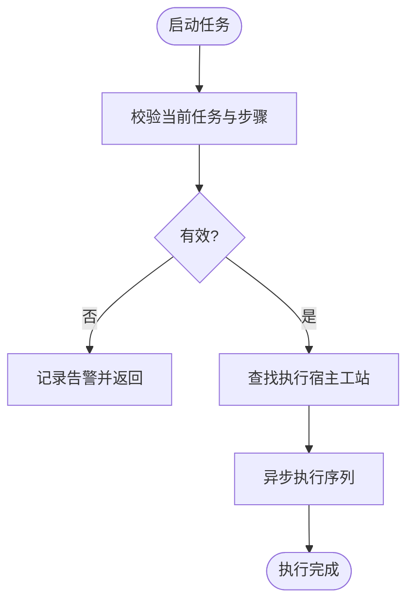
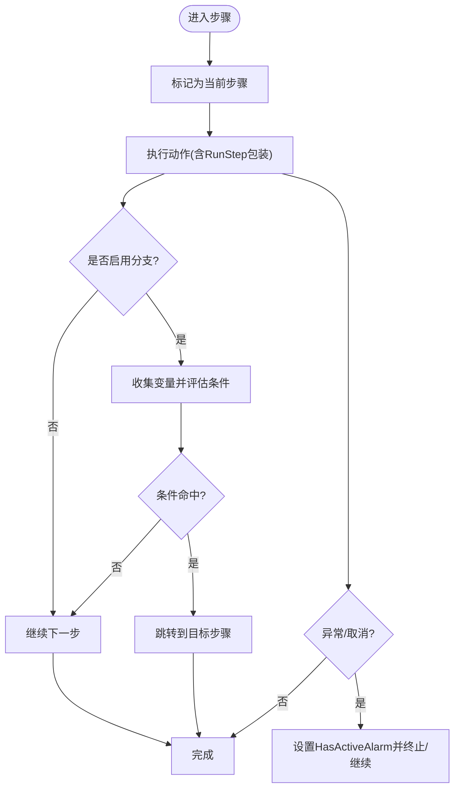
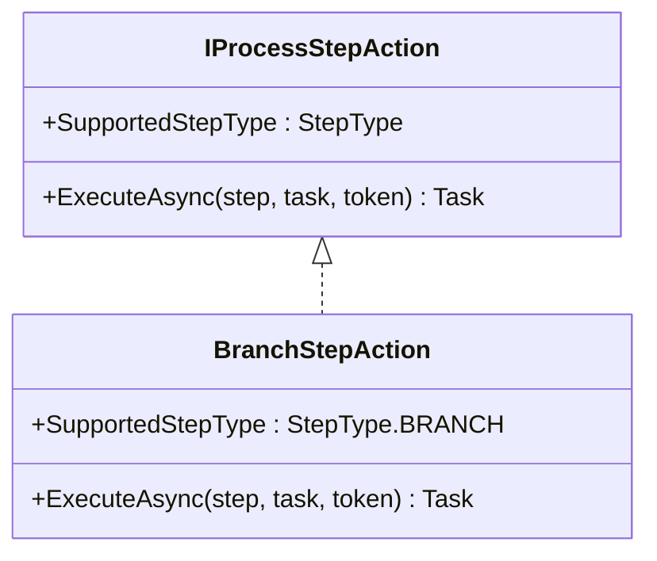
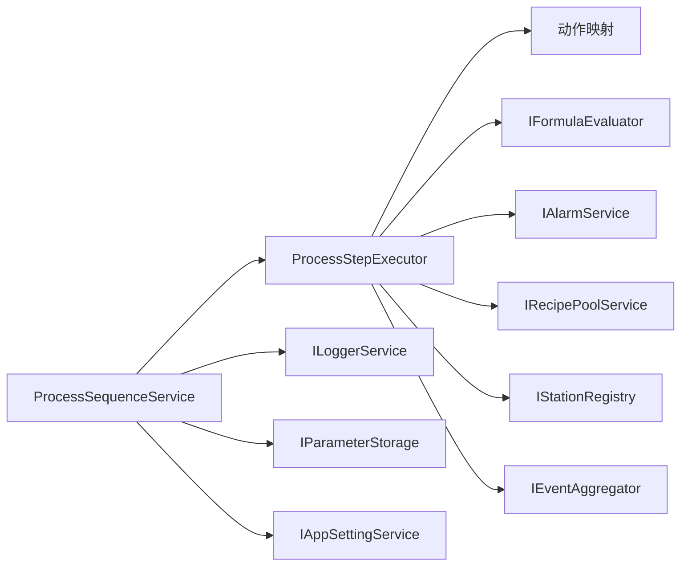

# 过程序列服务

<cite>
**本文引用的文件**
- [ProcessSequenceService.cs](file://Module/Services/ProcessSequenceService.cs)
- [IProcessSequenceService.cs](file://Module/Services/IProcessSequenceService.cs)
- [ProcessStepExecutor.cs](file://StationTasks/Actions/ProcessStepExecutor.cs)
- [ProcessStep.cs](file://StationTasks/Models/ProcessStep.cs)
- [BranchStepAction.cs](file://StationTasks/Actions/BranchStepAction.cs)
- [IProcessStepAction.cs](file://StationTasks/Actions/IProcessStepAction.cs)
- [tasks.md](file://.trae/specs/refactor-step-sequence-execution/tasks.md)
- [task-monitor-step-display-fix.md](file://.trae/documents/task-monitor-step-display-fix.md)
- [2026-05-11-condition-branch-feature.md](file://.trae/documents/2026-05-11-condition-branch-feature.md)
- [ProcessSequenceEditorView.xaml](file://Module/Controls/StepEditor/ProcessSequenceEditorView.xaml)
- [TaskItem.cs](file://Module/Models/TaskItem.cs)
</cite>

## 目录
1. [简介](#简介)
2. [项目结构](#项目结构)
3. [核心组件](#核心组件)
4. [架构总览](#架构总览)
5. [详细组件分析](#详细组件分析)
6. [依赖关系分析](#依赖关系分析)
7. [性能考虑](#性能考虑)
8. [故障排查指南](#故障排查指南)
9. [结论](#结论)
10. [附录](#附录)

## 简介
本文件面向“过程序列服务（ProcessSequenceService）”的技术文档，聚焦其在模块化执行引擎中的角色与职责，系统阐述任务编排、步骤调度与流程控制机制；详述序列执行的生命周期管理、错误恢复策略、进度跟踪与状态同步；给出序列定义语法、执行条件判断、分支处理与循环控制的实现细节；并提供服务的扩展点、插件机制与自定义序列处理器的开发指南。

## 项目结构
围绕过程序列服务的关键文件与模块如下：
- Module/Services：包含过程序列服务与接口定义，负责任务管理、步骤维护、序列保存/加载、执行控制与UI联动。
- StationTasks/Actions：包含步骤动作接口与具体动作实现，以及执行器（ProcessStepExecutor）负责按序执行步骤、条件分支、检查与跳转。
- StationTasks/Models：包含步骤数据模型（ProcessStep）与各类步骤详情（PickDetail、ReleaseDetail、CheckDetail、BranchConfig等）。
- Module/Controls/StepEditor：包含序列编辑器视图，用于可视化编辑任务与步骤。
- .trae/specs 与 .trae/documents：包含重构任务清单与条件分支功能文档，体现演进过程与设计决策。

**图表来源**
- [ProcessSequenceService.cs:23-71](file://Module/Services/ProcessSequenceService.cs#L23-L71)
- [ProcessStepExecutor.cs:29-71](file://StationTasks/Actions/ProcessStepExecutor.cs#L29-L71)
- [IProcessStepAction.cs:11-23](file://StationTasks/Actions/IProcessStepAction.cs#L11-L23)
- [BranchStepAction.cs:14-30](file://StationTasks/Actions/BranchStepAction.cs#L14-L30)
- [ProcessStep.cs:17-296](file://StationTasks/Models/ProcessStep.cs#L17-L296)

**章节来源**
- [ProcessSequenceService.cs:1-712](file://Module/Services/ProcessSequenceService.cs#L1-L712)
- [IProcessSequenceService.cs:1-62](file://Module/Services/IProcessSequenceService.cs#L1-L62)
- [ProcessStepExecutor.cs:1-826](file://StationTasks/Actions/ProcessStepExecutor.cs#L1-L826)
- [ProcessStep.cs:1-890](file://StationTasks/Models/ProcessStep.cs#L1-L890)
- [BranchStepAction.cs:1-32](file://StationTasks/Actions/BranchStepAction.cs#L1-L32)
- [IProcessStepAction.cs:1-25](file://StationTasks/Actions/IProcessStepAction.cs#L1-L25)
- [ProcessSequenceEditorView.xaml:467-478](file://Module/Controls/StepEditor/ProcessSequenceEditorView.xaml#L467-L478)

## 核心组件
- 过程序列服务（ProcessSequenceService）
  - 负责任务与步骤的增删改查、序列保存/加载、最近文件管理、工作订单数据联动、任务控制（启动/停止/暂停/恢复）、UI状态同步与高亮重置。
  - 通过DI容器解析步骤动作集合，创建执行器并委派给工站任务执行。
- 步骤执行器（ProcessStepExecutor）
  - 按序执行步骤，支持GOTO/VISION/SCAN/DASHBOARD/SEEK/WAIT/SCRIPT/PICK/CHECK/BRANCH等类型。
  - 提供条件分支（BranchConfig）与检查（CheckDetail）逻辑，支持表达式求值、输出参数收集与全局变量写入、跨工站状态广播。
- 步骤动作体系（IProcessStepAction 与具体实现）
  - 每个步骤类型对应一个动作实现，统一通过接口注册与分发。
- 步骤数据模型（ProcessStep）
  - 描述步骤的元数据、子移动（SubMove）、报警配置、分支配置、检查配置、各类步骤详情等。

**章节来源**
- [ProcessSequenceService.cs:23-318](file://Module/Services/ProcessSequenceService.cs#L23-L318)
- [ProcessStepExecutor.cs:29-188](file://StationTasks/Actions/ProcessStepExecutor.cs#L29-L188)
- [IProcessStepAction.cs:11-23](file://StationTasks/Actions/IProcessStepAction.cs#L11-L23)
- [ProcessStep.cs:17-296](file://StationTasks/Models/ProcessStep.cs#L17-L296)

## 架构总览
过程序列服务采用“服务驱动 + 执行器 + 动作分发”的架构：
- 服务层：集中管理任务、步骤与UI交互，协调执行器与工站任务。
- 执行层：执行器负责步骤顺序、条件分支、检查与跳转，封装暂停/急停/单步保护。
- 动作层：每种步骤类型独立实现，便于扩展与替换。
- 配置层：步骤模型承载所有配置信息，支持序列化与编辑器可视化。

**图表来源**
- [ProcessSequenceService.cs:256-318](file://Module/Services/ProcessSequenceService.cs#L256-L318)
- [ProcessStepExecutor.cs:88-188](file://StationTasks/Actions/ProcessStepExecutor.cs#L88-L188)

**章节来源**
- [ProcessSequenceService.cs:256-318](file://Module/Services/ProcessSequenceService.cs#L256-L318)
- [ProcessStepExecutor.cs:88-188](file://StationTasks/Actions/ProcessStepExecutor.cs#L88-L188)

## 详细组件分析

### 过程序列服务（ProcessSequenceService）
- 任务与步骤管理
  - 任务集合（Tasks）、当前任务（CurrentTask）、选中步骤（SelectedStep）、当前步骤索引（CurrentStepIndex）。
  - 步骤增删改、重排、自动编号与引用更新（RenumberSteps/UpdateStepReferences）。
- 序列文件管理
  - 保存/加载所有任务至JSON，MRU列表维护与持久化，最近路径记录与自动加载。
- 工作订单数据联动
  - 从配方池加载相机、用途、组件与站点选项，刷新UI绑定。
- 任务控制
  - 单任务互斥执行（_executionCts/_isExecuting/_activeStationTask），启动/停止/暂停/恢复。
  - 执行结束状态回写与步骤高亮重置。
- 扩展点
  - 通过DI容器解析步骤动作集合（IEnumerable<IProcessStepAction>），便于新增步骤类型。

**图表来源**
- [ProcessSequenceService.cs:256-318](file://Module/Services/ProcessSequenceService.cs#L256-L318)

**章节来源**
- [ProcessSequenceService.cs:74-318](file://Module/Services/ProcessSequenceService.cs#L74-L318)
- [ProcessSequenceService.cs:321-325](file://Module/Services/ProcessSequenceService.cs#L321-L325)

### 步骤执行器（ProcessStepExecutor）
- 执行流程
  - 初始化：清理故障步骤标记、清空输出参数、收集目标工站、发布Running状态、构建步骤标签映射。
  - 循环执行：标记当前步骤、执行单步、异常捕获与报警标记、计算下一步索引。
  - 结束清理：清理映射、重置高亮、发布Completed状态。
- 条件分支（BRANCH）
  - 收集上下文变量（全局变量@GV:与输出参数@Output:），按顺序评估条件表达式，命中即跳转；否则执行默认动作（Continue/Stop/SkipTo）。
  - 安全机制：跳转目标无效时触发紧急报警并终止。
- 检查（CHECK）
  - 评估检查项（多指标范围判断），支持重试与超限动作（Alarm/Stop/Continue），写入CHECK结果到输出参数。
- 跨工站状态广播
  - 向所有涉及的目标工站发布Running/Completed状态事件，供TaskMonitorView刷新。

**图表来源**
- [ProcessStepExecutor.cs:88-188](file://StationTasks/Actions/ProcessStepExecutor.cs#L88-L188)
- [ProcessStepExecutor.cs:565-781](file://StationTasks/Actions/ProcessStepExecutor.cs#L565-L781)
- [ProcessStepExecutor.cs:370-440](file://StationTasks/Actions/ProcessStepExecutor.cs#L370-L440)

**章节来源**
- [ProcessStepExecutor.cs:88-188](file://StationTasks/Actions/ProcessStepExecutor.cs#L88-L188)
- [ProcessStepExecutor.cs:565-781](file://StationTasks/Actions/ProcessStepExecutor.cs#L565-L781)
- [ProcessStepExecutor.cs:370-440](file://StationTasks/Actions/ProcessStepExecutor.cs#L370-L440)

### 步骤动作体系（IProcessStepAction 与具体实现）
- 接口约束
  - 每个动作实现需声明SupportedStepType，并提供ExecuteAsync(step, task, token)。
- 分支动作（BranchStepAction）
  - 纯逻辑步骤，条件评估与跳转由执行器统一处理，避免动作接口返回索引的限制。
- 其他动作类型
  - GOTO/SCAN/VISION/DASHBOARD/SEEK/WAIT/SCRIPT/PICK等，均由对应动作实现负责具体物理或业务操作。

**图表来源**
- [IProcessStepAction.cs:11-23](file://StationTasks/Actions/IProcessStepAction.cs#L11-L23)
- [BranchStepAction.cs:14-30](file://StationTasks/Actions/BranchStepAction.cs#L14-L30)

**章节来源**
- [IProcessStepAction.cs:11-23](file://StationTasks/Actions/IProcessStepAction.cs#L11-L23)
- [BranchStepAction.cs:14-30](file://StationTasks/Actions/BranchStepAction.cs#L14-L30)

### 步骤数据模型（ProcessStep）
- 步骤元数据
  - Seq、Step、CompFeature、SiteFeature、Camera、Purpose、SubMoves等。
- 运行时状态
  - IsCurrent（高亮）、HasActiveAlarm（报警标记）、AlarmConfig（报警配置）。
- 配置扩展
  - BranchConfig（条件分支）、CheckDetail（检查）、PickDetail/ReleaseDetail/CureDetail/IpqcDetail/ScanDetail/VisionDetail/DashboardStepDetail/SeekDetail/WaitDetail/ScriptDetail等。
- 序列化与UI绑定
  - 通过EnsureAlarmConfigInitialized确保反序列化后UI绑定正确刷新。

**章节来源**
- [ProcessStep.cs:17-296](file://StationTasks/Models/ProcessStep.cs#L17-L296)

### 序列定义语法与执行条件
- 条件表达式
  - 使用公式求值器（IFormulaEvaluator）评估，支持@GV:全局变量与@Output:输出参数引用。
  - 示例：@GV:检测结果 == true、@GV:H2 > 10.5、@Output:PassFlag == true && @GV:Count > 0、@GV:H2 - @GV:Slot > 0.27。
- 分支配置（BranchConfig）
  - Conditions：条件表达式与目标步骤序号。
  - DefaultAction/DefaultTargetStepSeq：默认动作与跳转目标。
  - OutputParameters：将步骤输出写入全局变量。
- 检查配置（CheckDetail）
  - CheckItems：多指标范围判断。
  - OnPassAction/OnFailAction：通过Continue/SkipTo/Retry/Stop控制流程。
  - MaxRetries/OnMaxExceeded：重试上限与超限时动作（Alarm/Stop/Continue）。

**章节来源**
- [ProcessStepExecutor.cs:728-743](file://StationTasks/Actions/ProcessStepExecutor.cs#L728-L743)
- [ProcessStepExecutor.cs:565-781](file://StationTasks/Actions/ProcessStepExecutor.cs#L565-L781)
- [ProcessStep.cs:353-362](file://StationTasks/Models/ProcessStep.cs#L353-L362)

### 生命周期管理与状态同步
- 生命周期
  - 启动：校验任务与步骤，创建CancellationTokenSource，设置任务状态为Running，清除报警标记。
  - 执行：委派给工站任务RunCustomSequenceAsync，内部创建执行器并执行步骤序列。
  - 结束：无论正常完成、取消还是异常，均重置状态为Idle，清理高亮，释放CTS。
- 状态同步
  - 跨工站：向所有目标工站发布Running/Completed状态事件，供TaskMonitorView刷新。
  - UI：通过IsCurrent与HasActiveAlarm实现步骤高亮与报警背景色。

**章节来源**
- [ProcessSequenceService.cs:256-318](file://Module/Services/ProcessSequenceService.cs#L256-L318)
- [ProcessStepExecutor.cs:105-109](file://StationTasks/Actions/ProcessStepExecutor.cs#L105-L109)
- [ProcessStepExecutor.cs:182-186](file://StationTasks/Actions/ProcessStepExecutor.cs#L182-L186)

### 错误恢复策略
- 可恢复异常
  - 捕获OperationCanceledException时，若LastFaultStepName匹配且启用报警，则标记HasActiveAlarm并抛出。
- 致命异常
  - 捕获Exception时，标记HasActiveAlarm并终止序列。
- CHECK步骤重试
  - 支持Retry/Stop/SkipTo动作，超过MaxRetries按OnMaxExceeded处理（Alarm/Stop/Continue）。
- 安全跳转
  - 跳转目标无效时触发紧急报警并终止，避免撞机风险。

**章节来源**
- [ProcessStepExecutor.cs:144-166](file://StationTasks/Actions/ProcessStepExecutor.cs#L144-L166)
- [ProcessStepExecutor.cs:445-480](file://StationTasks/Actions/ProcessStepExecutor.cs#L445-L480)
- [ProcessStepExecutor.cs:787-800](file://StationTasks/Actions/ProcessStepExecutor.cs#L787-L800)

### 进度跟踪与高亮
- 步骤高亮
  - 执行期间将当前步骤IsCurrent设为true，完成后统一重置为第一步。
- 事件与UI联动
  - 序列编辑器视图根据任务状态与高亮属性进行样式绑定与提示。

**章节来源**
- [ProcessSequenceService.cs:362-373](file://Module/Services/ProcessSequenceService.cs#L362-L373)
- [ProcessSequenceExecutor.cs:50-78](file://.trae/documents/task-monitor-step-display-fix.md#L50-L78)
- [ProcessSequenceEditorView.xaml:467-478](file://Module/Controls/StepEditor/ProcessSequenceEditorView.xaml#L467-L478)

### 扩展点、插件机制与自定义处理器
- 动作扩展
  - 通过实现IProcessStepAction并注册到DI容器，即可新增步骤类型。
- 条件分支扩展
  - 通过BranchConfig与FormulaEvaluator，可在任意步骤后插入条件跳转逻辑。
- 配置扩展
  - 步骤详情（如PickDetail/ReleaseDetail等）可按需扩展字段，保持向后兼容。

**章节来源**
- [IProcessStepAction.cs:11-23](file://StationTasks/Actions/IProcessStepAction.cs#L11-L23)
- [ProcessSequenceService.cs:321-325](file://Module/Services/ProcessSequenceService.cs#L321-L325)
- [2026-05-11-condition-branch-feature.md:1-920](file://.trae/documents/2026-05-11-condition-branch-feature.md#L1-L920)

## 依赖关系分析
- 服务对执行器的依赖
  - 通过RunCustomSequenceAsync委派执行，执行器负责步骤调度与条件分支。
- 执行器对动作的依赖
  - 通过动作映射（ActionMap）分发执行，动作实现解耦具体设备或业务。
- 执行器对基础设施的依赖
  - 公式求值器（IFormulaEvaluator）、报警服务（IAlarmService）、配方池服务（IRecipePoolService）、事件聚合器（IEventAggregator）、工站注册中心（IStationRegistry）。
- 服务对UI与配置的依赖
  - 日志服务（ILoggerService）、应用设置服务（IAppSettingService）、参数存储（IParameterStorage）、事件聚合器（IEventAggregator）。

**图表来源**
- [ProcessSequenceService.cs:25-62](file://Module/Services/ProcessSequenceService.cs#L25-L62)
- [ProcessStepExecutor.cs:31-67](file://StationTasks/Actions/ProcessStepExecutor.cs#L31-L67)

**章节来源**
- [ProcessSequenceService.cs:25-62](file://Module/Services/ProcessSequenceService.cs#L25-L62)
- [ProcessStepExecutor.cs:31-67](file://StationTasks/Actions/ProcessStepExecutor.cs#L31-L67)

## 性能考虑
- 异步执行与取消
  - 使用CancellationTokenSource与异步执行避免阻塞UI线程。
- 事件与状态广播
  - 仅对涉及的目标工站发布状态事件，减少不必要的UI刷新。
- 输出参数与变量池
  - 通过字典累积输出参数，避免重复计算与频繁IO访问。
- 序列化与MRU
  - MRU列表与最近路径持久化，减少文件浏览开销。

[本节为通用指导，无需特定文件引用]

## 故障排查指南
- 任务无法启动
  - 检查是否已有任务在执行（_isExecuting）、当前任务是否存在步骤、执行宿主工站是否注册。
- 执行中断或异常
  - 查看HasActiveAlarm标记与LastFaultStepName，结合报警服务记录定位问题。
- 条件分支不生效
  - 检查BranchConfig.IsEnabled、条件表达式语法与变量拼写（@GV:/@Output:）。
- 跳转目标无效
  - 检查目标步骤序号是否大于0且存在，避免安全报警与终止。
- UI高亮异常
  - 确认执行结束后的高亮重置逻辑是否被调用。

**章节来源**
- [ProcessSequenceService.cs:256-318](file://Module/Services/ProcessSequenceService.cs#L256-L318)
- [ProcessStepExecutor.cs:144-166](file://StationTasks/Actions/ProcessStepExecutor.cs#L144-L166)
- [ProcessStepExecutor.cs:787-800](file://StationTasks/Actions/ProcessStepExecutor.cs#L787-L800)

## 结论
过程序列服务通过清晰的分层架构与强解耦的动作体系，实现了对复杂工艺流程的可配置、可扩展、可观测的执行能力。执行器承担了流程控制的核心职责，配合条件分支与检查机制，能够灵活应对多变的生产需求。同时，完善的错误恢复策略与状态同步机制，保障了系统的稳定性与可维护性。

[本节为总结性内容，无需特定文件引用]

## 附录
- 重构与演进
  - 重构任务清单展示了从步骤序列事件驱动到独立执行引擎的迁移过程，明确了单任务互斥、生命周期管理与状态广播等关键改进。
- 条件分支功能
  - 条件分支功能文档详细描述了从VISION到CONDITION的完整数据流与架构关系，强调了对FormulaEvaluator的复用与向后兼容性。

**章节来源**
- [tasks.md:1-42](file://.trae/specs/refactor-step-sequence-execution/tasks.md#L1-L42)
- [2026-05-11-condition-branch-feature.md:1-920](file://.trae/documents/2026-05-11-condition-branch-feature.md#L1-L920)