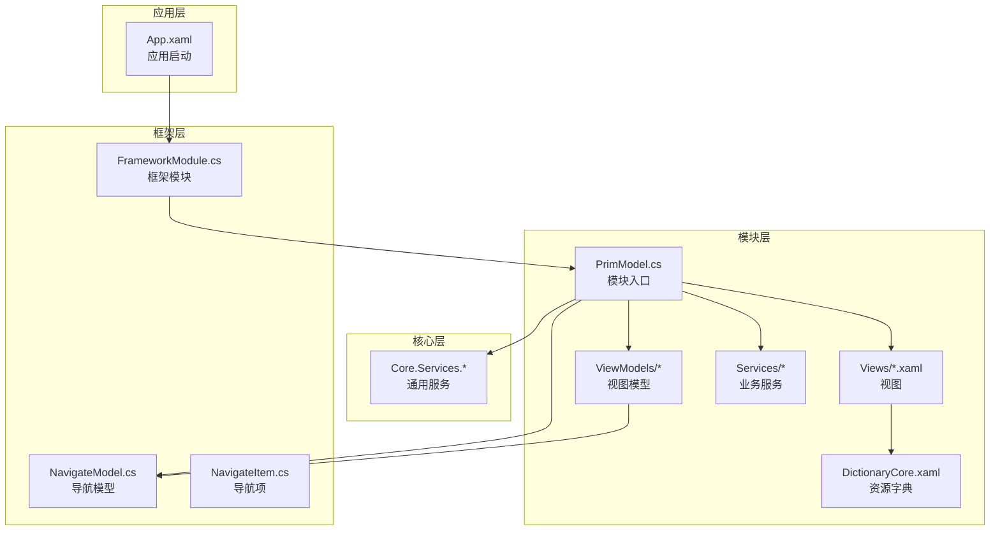
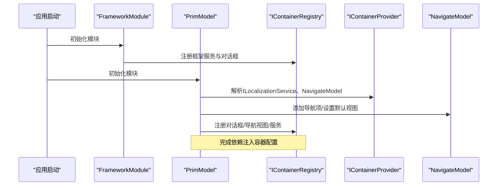
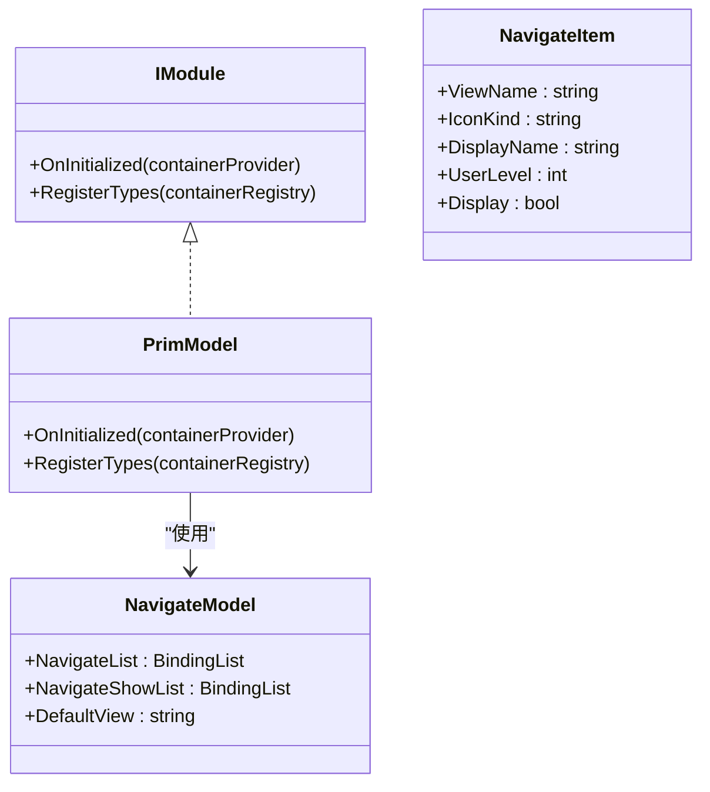
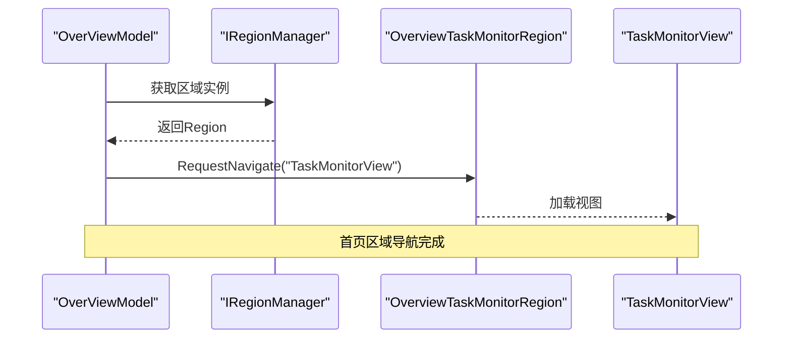
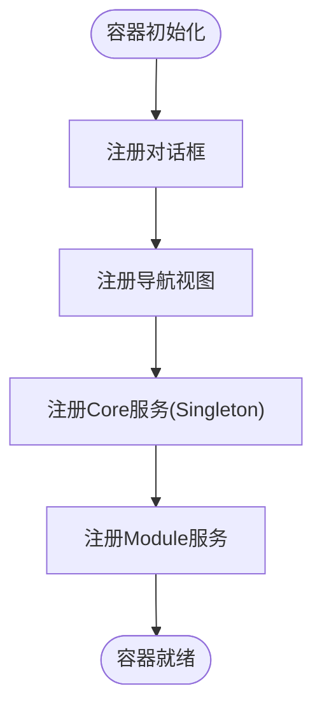
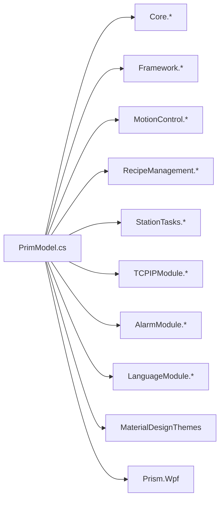

# 核心组件与架构

<cite>
**本文档引用的文件**
- [PrimModel.cs](file://Module/PrimModel.cs)
- [Module.csproj](file://Module/Module.csproj)
- [NavigateModel.cs](file://Framework/Mvvm/NavigateModel.cs)
- [NavigateItem.cs](file://Framework/Mvvm/NavigateItem.cs)
- [FrameworkModule.cs](file://Framework/FrameworkModule.cs)
- [OverView.xaml](file://Module/Views/OverView.xaml)
- [OverViewModel.cs](file://Module/ViewModels/OverViewModel.cs)
- [DispenseExecuteService.cs](file://Module/Services/DispenseExecuteService.cs)
- [FormulaEvaluator.cs](file://Core/Services/FormulaEvaluator.cs)
- [DictionaryCore.xaml（Module）](file://Module/DictionaryCore.xaml)
- [DictionaryCore.xaml（ModuleCore）](file://ModuleCore/DictionaryCore.xaml)
</cite>

## 目录
1. [引言](#引言)
2. [项目结构](#项目结构)
3. [核心组件](#核心组件)
4. [架构总览](#架构总览)
5. [详细组件分析](#详细组件分析)
6. [依赖关系分析](#依赖关系分析)
7. [性能考虑](#性能考虑)
8. [故障排查指南](#故障排查指南)
9. [结论](#结论)
10. [附录：扩展与自定义指南](#附录扩展与自定义指南)

## 引言
本文件面向Module模块，系统性梳理其核心组件与架构设计，重点围绕PrimModel模块类的实现原理展开，涵盖IModule接口实现、导航项注册机制、依赖注入容器配置、初始化流程、视图注册机制、对话框服务配置、模块基础设施（资源字典与全局样式）、扩展机制与插件集成方式，并提供可直接落地的自定义开发指南与示例路径。

## 项目结构
Module模块采用Prism模块化架构，以PrimModel作为模块入口，通过IContainerRegistry进行类型注册与导航注册；同时整合Core、Framework、ModuleCore等基础模块，形成统一的导航体系与服务生态。项目结构遵循“功能域+层次”的混合组织方式，便于扩展与维护。

图表来源
- [PrimModel.cs:1-116](file://Module/PrimModel.cs#L1-L116)
- [FrameworkModule.cs:1-59](file://Framework/FrameworkModule.cs#L1-L59)
- [NavigateModel.cs:1-30](file://Framework/Mvvm/NavigateModel.cs#L1-L30)
- [NavigateItem.cs:1-47](file://Framework/Mvvm/NavigateItem.cs#L1-L47)
- [DictionaryCore.xaml（Module）:1-15](file://Module/DictionaryCore.xaml#L1-L15)

章节来源
- [Module.csproj:1-630](file://Module/Module.csproj#L1-L630)
- [PrimModel.cs:1-116](file://Module/PrimModel.cs#L1-L116)

## 核心组件
- 模块入口与生命周期
  - PrimModel实现IModule接口，负责模块初始化与类型注册。在OnInitialized中完成导航项注册与默认视图设定；在RegisterTypes中完成对话框、导航视图、服务与跨项目共享服务的注册。
- 导航体系
  - 通过NavigateModel与NavigateItem构建导航列表，支持图标、显示名称、用户级别与显示开关等属性，配合Prism导航实现主内容区与树形菜单区的视图切换。
- 视图与视图模型
  - OverView与OverViewModel构成模块首页，演示区域导航、命令绑定、事件订阅与对话框调用等典型模式。
- 服务与依赖注入
  - 通过IContainerRegistry注册服务，包括Core通用服务（公式求值、DXF解析、ROI工具、坐标对齐）与Module特有服务（点胶执行、路径序列等），并区分Singleton与瞬时注册策略。
- 资源字典与全局样式
  - 通过DictionaryCore.xaml合并MaterialDesign主题与第三方图表库资源，统一界面风格与主题配色。

章节来源
- [PrimModel.cs:21-116](file://Module/PrimModel.cs#L21-L116)
- [NavigateModel.cs:6-29](file://Framework/Mvvm/NavigateModel.cs#L6-L29)
- [NavigateItem.cs:5-46](file://Framework/Mvvm/NavigateItem.cs#L5-L46)
- [OverViewModel.cs:19-255](file://Module/ViewModels/OverViewModel.cs#L19-L255)
- [DictionaryCore.xaml（Module）:1-15](file://Module/DictionaryCore.xaml#L1-L15)

## 架构总览
Module模块以PrimModel为核心，借助Prism的模块化与依赖注入能力，将导航、视图、服务与资源字典有机整合。初始化阶段完成导航项注册与默认视图设定；注册阶段完成视图与服务的绑定；运行阶段通过事件与命令驱动UI交互与业务执行。

图表来源
- [FrameworkModule.cs:23-55](file://Framework/FrameworkModule.cs#L23-L55)
- [PrimModel.cs:23-114](file://Module/PrimModel.cs#L23-L114)

## 详细组件分析

### PrimModel模块类与IModule实现
- 初始化流程
  - OnInitialized阶段：解析ILocalizationService与NavigateModel，设置导航项列表与默认视图。
  - 导航项包含首页、操作页面、实时报警、报警历史、报警统计、报警阈值、IO视图、配方管理、TCPIP设置等，体现模块化导航的完整性。
- 类型注册流程
  - RegisterTypes阶段：注册非导航控件、主内容区导航视图、树形菜单区导航视图、对话框、以及跨项目共享服务（公式求值、DXF解析、ROI工具、坐标对齐）与模块特有服务（点胶执行、路径序列）。
- 设计要点
  - 导航项与视图解耦：通过视图名称与Prism导航关联，便于扩展新视图。
  - 服务注册策略：跨项目服务采用Singleton提升复用性；模块特有服务按需注册。
  - DXF统一导入服务：确保CadPointEditorViewModel与CadAlignmentViewModel共享一致的导入逻辑。

图表来源
- [PrimModel.cs:21-116](file://Module/PrimModel.cs#L21-L116)
- [NavigateModel.cs:6-29](file://Framework/Mvvm/NavigateModel.cs#L6-L29)
- [NavigateItem.cs:5-46](file://Framework/Mvvm/NavigateItem.cs#L5-L46)

章节来源
- [PrimModel.cs:23-114](file://Module/PrimModel.cs#L23-L114)

### 导航项注册机制
- NavigateModel与NavigateItem
  - NavigateModel维护导航列表与显示列表，并提供DefaultView属性；NavigateItem描述每个导航项的视图名称、图标、显示名、用户级别与显示开关。
- 注册策略
  - 在PrimModel.OnInitialized中集中注册导航项，结合本地化资源实现多语言显示；通过UserLevel与Display控制权限与可见性。
- 扩展建议
  - 新增导航项时，优先在PrimModel中添加NavigateItem条目，并在RegisterTypes中补充对应的视图与视图模型注册。

章节来源
- [NavigateModel.cs:6-29](file://Framework/Mvvm/NavigateModel.cs#L6-L29)
- [NavigateItem.cs:5-46](file://Framework/Mvvm/NavigateItem.cs#L5-L46)
- [PrimModel.cs:30-48](file://Module/PrimModel.cs#L30-L48)

### 视图注册机制与首页示例
- 视图注册
  - 通过RegisterForNavigation与RegisterDialog完成视图与对话框的注册，支持带视图模型的注册形式。
- 首页视图与视图模型
  - OverView展示顶部快捷操作栏、中部核心区域与底部流程控制栏；OverViewModel绑定命令、订阅事件、管理区域导航与对话框调用。
- 区域导航
  - OverViewModel在OnNavigatedTo中向指定区域请求导航至TaskMonitorView与SpeedControlView，体现区域化布局与动态加载。

图表来源
- [OverViewModel.cs:233-251](file://Module/ViewModels/OverViewModel.cs#L233-L251)
- [OverView.xaml:117-131](file://Module/Views/OverView.xaml#L117-L131)

章节来源
- [OverView.xaml:1-321](file://Module/Views/OverView.xaml#L1-L321)
- [OverViewModel.cs:19-255](file://Module/ViewModels/OverViewModel.cs#L19-L255)

### 对话框服务配置
- 对话框注册
  - 通过RegisterDialog完成对话框与视图模型的绑定，支持命名对话框（如RecipeSelectionDialog、LogView等）。
- 首页对话框调用
  - OverViewModel在ShowLogViewerCommand中构造参数并调用IDialogService.Show，实现非模态日志查看器窗口的打开。
- 框架支持
  - FrameworkModule注册了多种通用对话框服务（消息、通知、可取消操作等），为模块提供一致的对话框体验。

章节来源
- [PrimModel.cs:56-88](file://Module/PrimModel.cs#L56-L88)
- [OverViewModel.cs:220-231](file://Module/ViewModels/OverViewModel.cs#L220-L231)
- [FrameworkModule.cs:41-54](file://Framework/FrameworkModule.cs#L41-L54)

### 依赖注入容器配置
- 容器注册策略
  - 非导航控件与对话框：RegisterDialog/Register
  - 导航视图：RegisterForNavigation（含带视图模型的注册）
  - 跨项目服务：RegisterSingleton（公式求值、DXF解析、ROI工具、坐标对齐）
  - 模块特有服务：Register/RegisterSingleton（点胶执行、路径序列）
- 服务依赖链
  - 例如DispenseExecuteService依赖IMotionService与ILoggerService，体现服务间协作与解耦。

图表来源
- [PrimModel.cs:51-114](file://Module/PrimModel.cs#L51-L114)

章节来源
- [PrimModel.cs:51-114](file://Module/PrimModel.cs#L51-L114)
- [DispenseExecuteService.cs:39-43](file://Module/Services/DispenseExecuteService.cs#L39-L43)

### 模块基础设施：资源字典与全局样式
- 资源字典合并
  - Module与ModuleCore均提供DictionaryCore.xaml，合并MaterialDesign主题与第三方图表库资源，统一界面风格。
- 主题与配色
  - 通过MaterialDesign.BundledTheme与颜色资源定义主次主题色，确保模块内UI风格一致性。
- 使用建议
  - 新增控件样式时，优先在现有资源字典中扩展，避免重复定义。

章节来源
- [DictionaryCore.xaml（Module）:1-15](file://Module/DictionaryCore.xaml#L1-L15)
- [DictionaryCore.xaml（ModuleCore）:1-9](file://ModuleCore/DictionaryCore.xaml#L1-L9)

### 核心算法与服务：公式求值与点胶执行
- 公式求值（FormulaEvaluator）
  - 支持变量引用（@GV:/@Output:）、四则运算、比较与布尔运算，具备预处理与错误容错能力。
- 点胶执行（DispenseExecuteService）
  - 提供空跑与走胶两种模式，统一工艺流程：安全抬升→XY定位→Z下降→轨迹插补→出胶/关胶→Z抬升；支持取消与超时处理。

章节来源
- [FormulaEvaluator.cs:13-336](file://Core/Services/FormulaEvaluator.cs#L13-L336)
- [DispenseExecuteService.cs:16-292](file://Module/Services/DispenseExecuteService.cs#L16-L292)

## 依赖关系分析
- 模块间依赖
  - Module依赖Core、Framework、ModuleCore、AlarmModule、LanguageModule、MotionControl、RecipeManagement、StationTasks、TCPIPModule等项目，体现模块化分层与复用。
- 容器依赖
  - PrimModel通过IContainerRegistry注册类型，FrameworkModule提供对话框与参数编辑等基础服务，共同构成模块运行时环境。
- 外部依赖
  - Prism.Wpf、MaterialDesignThemes、LiveCharts等第三方库提供模块化与UI主题支持。

图表来源
- [Module.csproj:619-629](file://Module/Module.csproj#L619-L629)
- [PrimModel.cs:14-17](file://Module/PrimModel.cs#L14-L17)

章节来源
- [Module.csproj:619-629](file://Module/Module.csproj#L619-L629)

## 性能考虑
- 导航与视图加载
  - 使用区域化导航减少一次性加载成本；按需请求导航至子视图，降低内存占用。
- 服务注册策略
  - 跨项目通用服务采用Singleton，避免重复实例化带来的开销。
- 事件与命令
  - 通过事件聚合与命令绑定实现UI与业务解耦，减少不必要的UI刷新。
- 图表与资源
  - 合并第三方图表库资源字典，避免重复加载导致的性能损耗。

## 故障排查指南
- 导航项不显示
  - 检查PrimModel.OnInitialized中的导航项注册与本地化资源键是否存在；确认NavigateModel.DefaultView设置正确。
- 视图无法导航
  - 确认RegisterForNavigation已注册对应视图与视图模型；检查视图名称与导航项ViewName一致。
- 对话框无法打开
  - 确认RegisterDialog已注册；检查对话框名称与调用时传入名称一致；验证IDialogService.Show参数配置。
- 服务解析失败
  - 检查IContainerRegistry注册顺序与类型绑定；确认服务接口与实现匹配；注意Singleton与瞬时注册的区别。
- 资源字典问题
  - 确认DictionaryCore.xaml合并路径有效；检查MaterialDesign主题与颜色资源引用无冲突。

章节来源
- [PrimModel.cs:23-114](file://Module/PrimModel.cs#L23-L114)
- [OverViewModel.cs:220-231](file://Module/ViewModels/OverViewModel.cs#L220-L231)

## 结论
Module模块通过PrimModel实现了清晰的模块化入口与依赖注入配置，结合Framework提供的导航与对话框能力，形成了可扩展、可维护的UI与业务架构。资源字典与全局样式确保了界面风格的一致性。基于本文档的分析与指南，开发者可以高效地扩展导航项、注册视图与服务、集成插件并进行自定义开发。

## 附录：扩展与自定义指南

### 如何添加新的导航项
- 在PrimModel.OnInitialized中新增NavigateItem条目，设置ViewName、IconKind、DisplayName、UserLevel与Display。
- 在RegisterTypes中为新视图添加RegisterForNavigation或RegisterDialog注册。
- 若涉及跨项目服务，按Singleton策略在RegisterTypes中注册。

章节来源
- [PrimModel.cs:30-48](file://Module/PrimModel.cs#L30-L48)
- [PrimModel.cs:56-114](file://Module/PrimModel.cs#L56-L114)

### 如何注册视图模型
- 对于带视图模型的视图，在RegisterForNavigation中使用“视图, 视图模型”形式注册。
- 对于纯控件或对话框，使用Register/RegisterDialog注册。

章节来源
- [PrimModel.cs:56-114](file://Module/PrimModel.cs#L56-L114)

### 如何配置服务依赖
- 跨项目通用服务采用RegisterSingleton注册，模块特有服务按需注册。
- 服务实现中通过构造函数注入所需依赖，确保依赖链完整。

章节来源
- [PrimModel.cs:99-114](file://Module/PrimModel.cs#L99-L114)
- [DispenseExecuteService.cs:39-43](file://Module/Services/DispenseExecuteService.cs#L39-L43)

### 插件集成方式
- 通过项目引用引入插件模块（如RecipeManagement、StationTasks等），并在Module.csproj中添加ProjectReference。
- 在FrameworkModule或PrimModel中注册插件所需的对话框与服务，确保容器解析正常。

章节来源
- [Module.csproj:619-629](file://Module/Module.csproj#L619-L629)
- [FrameworkModule.cs:31-55](file://Framework/FrameworkModule.cs#L31-L55)