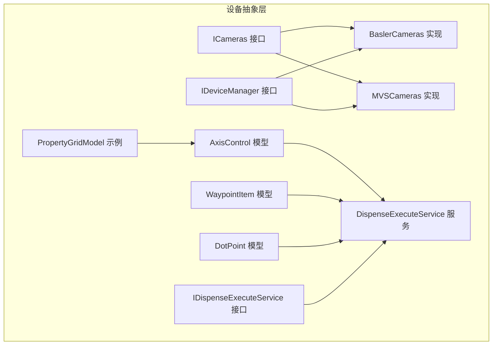
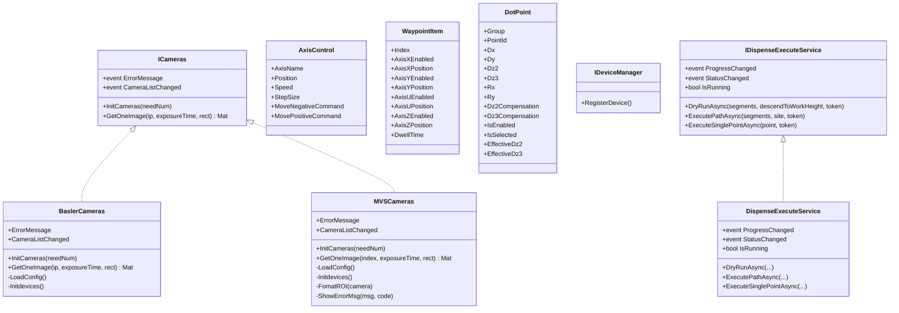
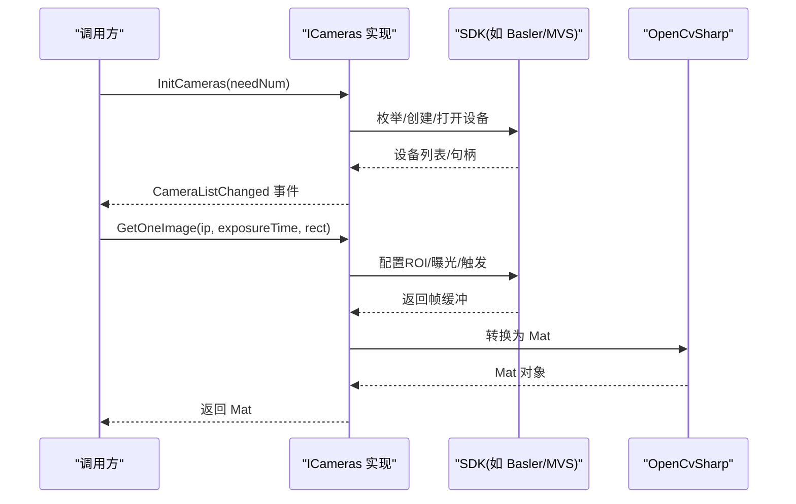
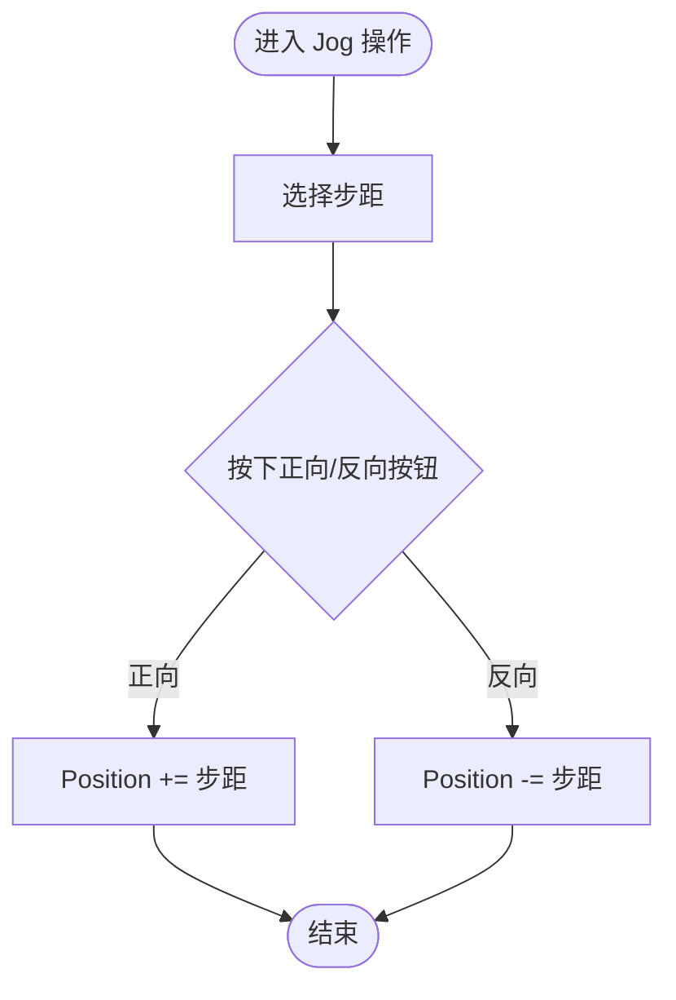
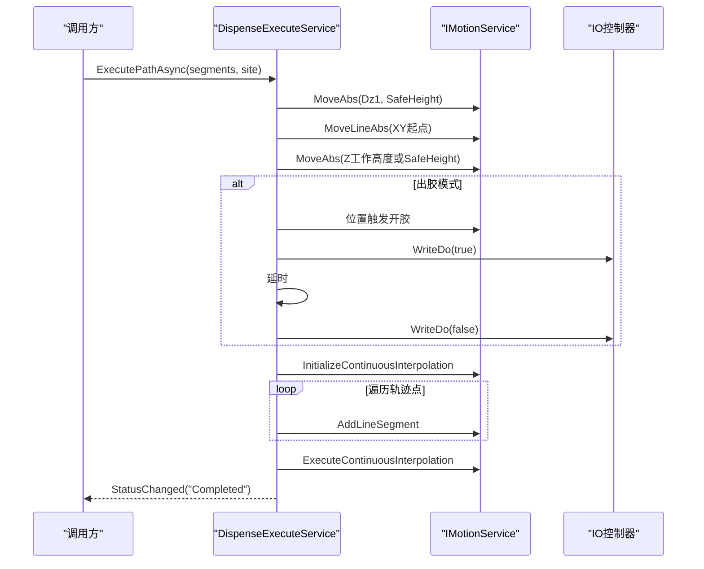
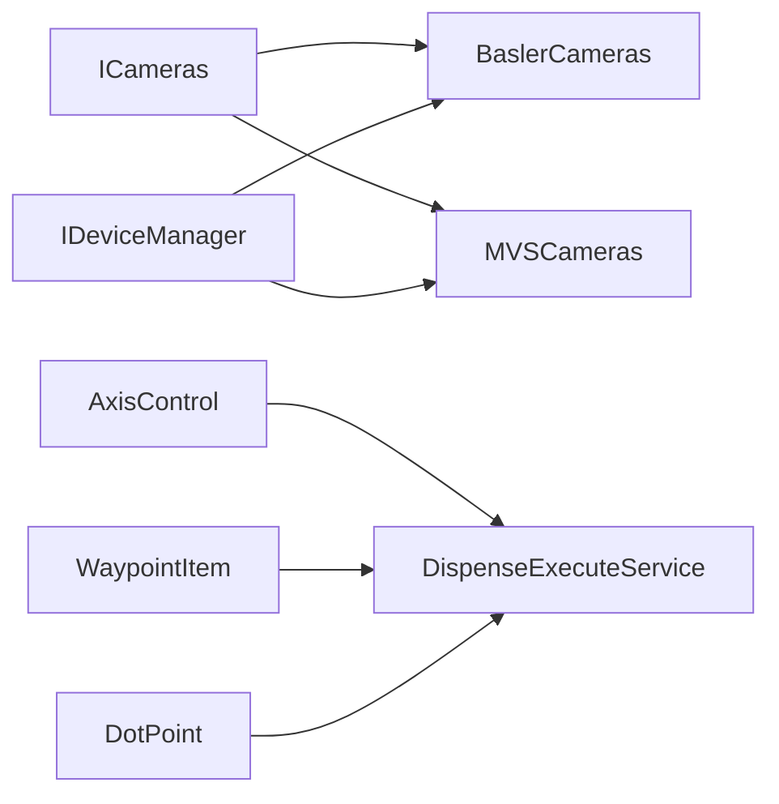

# 设备接口抽象层

<cite>
**本文引用的文件**
- [ICameras.cs](file://Module/Devices/ICameras.cs)
- [BaslerCameras.cs](file://Module/Devices/BaslerCameras.cs)
- [MVSCameras.cs](file://Module/Devices/MVSCameras.cs)
- [AxisControl.cs](file://Module/Models/AxisControl.cs)
- [WaypointItem.cs](file://Module/Models/WaypointItem.cs)
- [DotPoint.cs](file://Module/Models/DotPoint.cs)
- [IDeviceManager.cs](file://Core/Abstraction/IDeviceManager.cs)
- [DispenseExecuteService.cs](file://Module/Services/DispenseExecuteService.cs)
- [IDispenseExecuteService.cs](file://Module/Services/IDispenseExecuteService.cs)
- [PropertyGridModel.cs](file://Module/Models/PropertyGridModel.cs)
</cite>

## 目录
1. [简介](#简介)
2. [项目结构](#项目结构)
3. [核心组件](#核心组件)
4. [架构总览](#架构总览)
5. [详细组件分析](#详细组件分析)
6. [依赖关系分析](#依赖关系分析)
7. [性能考量](#性能考量)
8. [故障排查指南](#故障排查指南)
9. [结论](#结论)
10. [附录](#附录)

## 简介
本文件聚焦于“设备接口抽象层”，系统性梳理相机设备抽象与实现、轴控制模型与路径点模型、设备管理与状态管理策略，并给出扩展新设备与故障处理的最佳实践。重点覆盖以下内容：
- 相机接口抽象与两种实现（Basler 与 MVS）的设计与差异
- 轴控制模型与路径点模型的数据结构与交互
- 设备状态管理与事件通知机制
- 设备扩展开发指南与接入步骤
- 性能优化与故障处理策略

## 项目结构
围绕设备抽象层的关键目录与文件如下：
- Module/Devices：相机设备抽象与实现（ICameras、BaslerCameras、MVSCameras）
- Module/Models：设备相关数据模型（AxisControl、WaypointItem、DotPoint、PropertyGridModel）
- Module/Services：设备相关业务服务（DispenseExecuteService 及其接口）
- Core/Abstraction：设备管理接口（IDeviceManager）

**图表来源**
- [ICameras.cs:1-29](file://Module/Devices/ICameras.cs#L1-L29)
- [BaslerCameras.cs:1-201](file://Module/Devices/BaslerCameras.cs#L1-L201)
- [MVSCameras.cs:1-389](file://Module/Devices/MVSCameras.cs#L1-L389)
- [AxisControl.cs:1-82](file://Module/Models/AxisControl.cs#L1-L82)
- [WaypointItem.cs:1-38](file://Module/Models/WaypointItem.cs#L1-L38)
- [DotPoint.cs:1-145](file://Module/Models/DotPoint.cs#L1-L145)
- [IDeviceManager.cs:1-10](file://Core/Abstraction/IDeviceManager.cs#L1-L10)
- [DispenseExecuteService.cs:1-292](file://Module/Services/DispenseExecuteService.cs#L1-L292)
- [IDispenseExecuteService.cs:1-33](file://Module/Services/IDispenseExecuteService.cs#L1-L33)
- [PropertyGridModel.cs:1-47](file://Module/Models/PropertyGridModel.cs#L1-L47)

**章节来源**
- [ICameras.cs:1-29](file://Module/Devices/ICameras.cs#L1-L29)
- [BaslerCameras.cs:1-201](file://Module/Devices/BaslerCameras.cs#L1-L201)
- [MVSCameras.cs:1-389](file://Module/Devices/MVSCameras.cs#L1-L389)
- [AxisControl.cs:1-82](file://Module/Models/AxisControl.cs#L1-L82)
- [WaypointItem.cs:1-38](file://Module/Models/WaypointItem.cs#L1-L38)
- [DotPoint.cs:1-145](file://Module/Models/DotPoint.cs#L1-L145)
- [IDeviceManager.cs:1-10](file://Core/Abstraction/IDeviceManager.cs#L1-L10)
- [DispenseExecuteService.cs:1-292](file://Module/Services/DispenseExecuteService.cs#L1-L292)
- [IDispenseExecuteService.cs:1-33](file://Module/Services/IDispenseExecuteService.cs#L1-L33)
- [PropertyGridModel.cs:1-47](file://Module/Models/PropertyGridModel.cs#L1-L47)

## 核心组件
- 相机设备抽象与实现
  - 抽象接口：统一初始化、图像采集、设备列表变化与错误通知事件
  - 具体实现：BaslerCameras（基于 pylon SDK）、MVSCameras（基于 MVS SDK）
- 轴控制模型与路径点模型
  - AxisControl：Jog 操作的轴控制模型，含步距、速度、命令绑定
  - WaypointItem：路径点模型，支持多轴使能与位置、停留时间
  - DotPoint：装配/点胶场景的目标点位模型，含补偿与有效高度计算
- 设备管理与状态
  - IDeviceManager：设备注册接口（当前最小化）
  - 事件驱动：设备列表变化、错误消息、状态变更
- 业务服务
  - IDispenseExecuteService/DispenseExecuteService：将轨迹转换为运动控制指令，负责安全高度、XY定位、Z下降、轨迹插补、IO出胶控制与状态发布

**章节来源**
- [ICameras.cs:1-29](file://Module/Devices/ICameras.cs#L1-L29)
- [BaslerCameras.cs:1-201](file://Module/Devices/BaslerCameras.cs#L1-L201)
- [MVSCameras.cs:1-389](file://Module/Devices/MVSCameras.cs#L1-L389)
- [AxisControl.cs:1-82](file://Module/Models/AxisControl.cs#L1-L82)
- [WaypointItem.cs:1-38](file://Module/Models/WaypointItem.cs#L1-L38)
- [DotPoint.cs:1-145](file://Module/Models/DotPoint.cs#L1-L145)
- [IDeviceManager.cs:1-10](file://Core/Abstraction/IDeviceManager.cs#L1-L10)
- [IDispenseExecuteService.cs:1-33](file://Module/Services/IDispenseExecuteService.cs#L1-L33)
- [DispenseExecuteService.cs:1-292](file://Module/Services/DispenseExecuteService.cs#L1-L292)

## 架构总览
设备抽象层采用“接口 + 多实现”的分层设计：
- 抽象层：ICameras 定义相机能力边界
- 设备层：BaslerCameras、MVSCameras 分别对接不同 SDK
- 模型层：AxisControl、WaypointItem、DotPoint 提供设备相关数据结构
- 服务层：DispenseExecuteService 通过 IMotionService 驱动运动控制，完成点胶/装配路径执行
- 管理层：IDeviceManager 作为设备注册入口（可扩展）

**图表来源**
- [ICameras.cs:1-29](file://Module/Devices/ICameras.cs#L1-L29)
- [BaslerCameras.cs:1-201](file://Module/Devices/BaslerCameras.cs#L1-L201)
- [MVSCameras.cs:1-389](file://Module/Devices/MVSCameras.cs#L1-L389)
- [AxisControl.cs:1-82](file://Module/Models/AxisControl.cs#L1-L82)
- [WaypointItem.cs:1-38](file://Module/Models/WaypointItem.cs#L1-L38)
- [DotPoint.cs:1-145](file://Module/Models/DotPoint.cs#L1-L145)
- [IDeviceManager.cs:1-10](file://Core/Abstraction/IDeviceManager.cs#L1-L10)
- [IDispenseExecuteService.cs:1-33](file://Module/Services/IDispenseExecuteService.cs#L1-L33)
- [DispenseExecuteService.cs:1-292](file://Module/Services/DispenseExecuteService.cs#L1-L292)

## 详细组件分析

### 相机接口抽象与实现
- 接口职责
  - 初始化相机（可指定需求数量）
  - 获取单帧图像（支持指定相机IP、曝光时间、ROI）
  - 设备列表变化与错误事件通知
- BaslerCameras 实现要点
  - 使用 Basler Pylon SDK 枚举设备、建立连接、配置参数（缓冲区、心跳超时、像素格式等）
  - ROI 对齐与尺寸校验，避免小于最小步进
  - 采集流程：设置曝光、启动抓取、等待结果、转 OpenCvSharp Mat
  - 进程退出时释放资源
- MVSCameras 实现要点
  - 使用 MVS SDK 枚举 Gige 设备、创建设备、打开设备、设置触发模式/像素格式/白平衡等
  - ROI 格式化与 AOI 设置，支持软件触发
  - 图像缓冲区管理与像素格式判断（灰度/RGB）
  - 错误码映射与统一错误事件输出
- 差异对比
  - SDK 不同导致 API 差异显著（Pylon vs MVS）
  - ROI 支持与格式要求不同（Basler 以 Offset/Width/Height 为主；MVS 以 AOI offset 与步进对齐为主）
  - 触发方式：Basler 使用 StreamGrabber；MVS 使用 TriggerSoftware

**图表来源**
- [ICameras.cs:1-29](file://Module/Devices/ICameras.cs#L1-L29)
- [BaslerCameras.cs:107-186](file://Module/Devices/BaslerCameras.cs#L107-L186)
- [MVSCameras.cs:192-277](file://Module/Devices/MVSCameras.cs#L192-L277)

**章节来源**
- [ICameras.cs:1-29](file://Module/Devices/ICameras.cs#L1-L29)
- [BaslerCameras.cs:1-201](file://Module/Devices/BaslerCameras.cs#L1-L201)
- [MVSCameras.cs:1-389](file://Module/Devices/MVSCameras.cs#L1-L389)

### 轴控制模型（AxisControl）
- 设计目标：为 Jog 操作提供统一的轴控制模型，支持步距选择、速度设定与正负向移动命令
- 关键属性与行为
  - 步距选项：预设若干步距（如 0.01、0.05、0.10、0.50、1.00）
  - 命令绑定：使用 Prism 命令封装 MoveNegativeCommand/MovePositiveCommand
  - 位置更新：根据步距增减当前位置
- 适用场景：装配、点胶、视觉对位等需要精细微调的场合

**图表来源**
- [AxisControl.cs:62-72](file://Module/Models/AxisControl.cs#L62-L72)

**章节来源**
- [AxisControl.cs:1-82](file://Module/Models/AxisControl.cs#L1-L82)

### 路径点模型（WaypointItem）
- 设计目标：描述路径执行中的一个目标点，支持多轴使能与位置、停留时间
- 关键字段
  - Index：点序号
  - 各轴使能与位置：X/Y/U/Z 的启用与目标位置
  - DwellTime：在该点的停留时间
- 适用场景：装配、点胶、视觉检查等路径规划与执行

**章节来源**
- [WaypointItem.cs:1-38](file://Module/Models/WaypointItem.cs#L1-L38)

### 点位模型（DotPoint）
- 设计目标：装配/点胶场景的目标点位模型，支持补偿与有效高度计算
- 关键特性
  - 限定范围：Dz2/Dz3 在 [-200, 200]，Rx/Ry 在 [-360, 360]，补偿在 [-50, 50]
  - 有效高度：EffectiveDz2/Dz3 = 实际值 + 补偿值
  - 启用/选中：用于批量操作与执行过滤
- 适用场景：装配高度、点胶落点、Z轴补偿等

**章节来源**
- [DotPoint.cs:1-145](file://Module/Models/DotPoint.cs#L1-L145)

### 设备管理与状态管理
- 设备管理接口
  - IDeviceManager.RegisterDevice：设备注册入口（当前为空实现，便于后续扩展）
- 状态与事件
  - 相机实现通过 CameraListChanged 与 ErrorMessage 发布设备状态与错误
  - 点胶执行服务通过 StatusChanged/ProgressChanged 发布执行状态与进度
- 管理建议
  - 建立统一的设备生命周期管理（创建/打开/配置/抓取/关闭/销毁）
  - 将错误码映射为可读消息，统一通过 ErrorMessage 事件上报
  - 对外暴露设备列表变化事件，便于 UI 与配置模块同步

**章节来源**
- [IDeviceManager.cs:1-10](file://Core/Abstraction/IDeviceManager.cs#L1-L10)
- [BaslerCameras.cs:12-66](file://Module/Devices/BaslerCameras.cs#L12-L66)
- [MVSCameras.cs:59-62](file://Module/Devices/MVSCameras.cs#L59-L62)
- [DispenseExecuteService.cs:34-36](file://Module/Services/DispenseExecuteService.cs#L34-L36)

### 业务服务：点胶执行（DispenseExecuteService）
- 能力概述
  - 空跑仿真：按标准流程移动，可选下降到工作高度但不出胶
  - 走胶路径：下降到工作高度并出胶，沿轨迹连续插补
  - 单点点胶：定点下降→开胶→延时→关胶→上升
- 工业标准流程
  - 安全抬升 → XY 定位 → Z 下降（可选）→ 走轨迹 → 关胶 → 抬升
  - 支持位置触发开胶与兜底保护
- 关键点
  - 运动控制：通过 IMotionService 驱动轴运动与轨迹插补
  - IO 控制：通过 WriteDo 控制出胶 IO，异常时安全关断
  - 状态发布：ProgressChanged/StatusChanged 事件
  - 超时与取消：超时抛出异常，支持取消令牌

**图表来源**
- [IDispenseExecuteService.cs:1-33](file://Module/Services/IDispenseExecuteService.cs#L1-L33)
- [DispenseExecuteService.cs:75-213](file://Module/Services/DispenseExecuteService.cs#L75-L213)

**章节来源**
- [IDispenseExecuteService.cs:1-33](file://Module/Services/IDispenseExecuteService.cs#L1-L33)
- [DispenseExecuteService.cs:1-292](file://Module/Services/DispenseExecuteService.cs#L1-L292)

## 依赖关系分析
- 接口与实现
  - ICameras 是相机设备的统一抽象，BaslerCameras 与 MVSCameras 分别实现
- 模型与服务
  - AxisControl/WaypointItem/DotPoint 为业务服务 DispenseExecuteService 提供数据支撑
- 管理与事件
  - IDeviceManager 作为设备注册入口；各实现通过事件对外发布状态
- 外部依赖
  - BaslerCameras 依赖 Basler.Pylon 与 OpenCvSharp
  - MVSCameras 依赖 MvCamCtrl.NET 与 OpenCvSharp
  - DispenseExecuteService 依赖 MotionControl.Interfaces（IMotionService）

**图表来源**
- [ICameras.cs:1-29](file://Module/Devices/ICameras.cs#L1-L29)
- [BaslerCameras.cs:1-201](file://Module/Devices/BaslerCameras.cs#L1-L201)
- [MVSCameras.cs:1-389](file://Module/Devices/MVSCameras.cs#L1-L389)
- [AxisControl.cs:1-82](file://Module/Models/AxisControl.cs#L1-L82)
- [WaypointItem.cs:1-38](file://Module/Models/WaypointItem.cs#L1-L38)
- [DotPoint.cs:1-145](file://Module/Models/DotPoint.cs#L1-L145)
- [IDeviceManager.cs:1-10](file://Core/Abstraction/IDeviceManager.cs#L1-L10)
- [DispenseExecuteService.cs:1-292](file://Module/Services/DispenseExecuteService.cs#L1-L292)

**章节来源**
- [ICameras.cs:1-29](file://Module/Devices/ICameras.cs#L1-L29)
- [BaslerCameras.cs:1-201](file://Module/Devices/BaslerCameras.cs#L1-L201)
- [MVSCameras.cs:1-389](file://Module/Devices/MVSCameras.cs#L1-L389)
- [AxisControl.cs:1-82](file://Module/Models/AxisControl.cs#L1-L82)
- [WaypointItem.cs:1-38](file://Module/Models/WaypointItem.cs#L1-L38)
- [DotPoint.cs:1-145](file://Module/Models/DotPoint.cs#L1-L145)
- [IDeviceManager.cs:1-10](file://Core/Abstraction/IDeviceManager.cs#L1-L10)
- [DispenseExecuteService.cs:1-292](file://Module/Services/DispenseExecuteService.cs#L1-L292)

## 性能考量
- 相机采集
  - ROI 对齐与步进对齐：减少频繁 AOI 变更带来的配置开销（MVS）
  - 缓冲区与心跳超时：合理设置 MaxNumBuffer 与 HeartbeatTimeout，提升稳定性
  - 像素格式：优先使用相机原生格式，避免额外转换
- 运动控制
  - 两段式下降：快速接近 + 慢速到位，兼顾效率与精度
  - 连续插补：InitializeContinuousInterpolation + AddLineSegment + ExecuteContinuousInterpolation，减少指令切换
  - 位置触发开胶：在慢速阶段进行，确保胶量与质量
- 资源管理
  - 进程退出时统一 StopGrabbing/Close/Destroy，避免资源泄漏

[本节为通用指导，无需特定文件引用]

## 故障排查指南
- 相机类问题
  - 未找到足够数量相机：检查设备连接与 SDK 安装，查看 ErrorMessage 输出
  - ROI 尺寸过小：确保宽度/高度不小于最小步进（如 64），参考格式化逻辑
  - 抓取失败：确认 StreamGrabber/Trigger 状态，检查 GrabResult 错误码
- MVS 特有问题
  - 设备创建失败：检查设备句柄与错误码映射，查看 ShowErrorMsg 输出
  - 像素格式不符：确保相机像素格式为 BGR8 或灰度，否则无法正确转换
- 点胶执行问题
  - 运动超时：检查 IMotionService 状态与坐标系配置，适当延长超时时间
  - 出胶异常：确认 IO 写入成功，异常时执行 SafeGlueOff
- 事件与状态
  - 设备列表变化：订阅 CameraListChanged，及时刷新 UI
  - 状态变更：监听 StatusChanged/ProgressChanged，更新界面反馈

**章节来源**
- [BaslerCameras.cs:32-44](file://Module/Devices/BaslerCameras.cs#L32-L44)
- [BaslerCameras.cs:100-146](file://Module/Devices/BaslerCameras.cs#L100-L146)
- [MVSCameras.cs:34-51](file://Module/Devices/MVSCameras.cs#L34-L51)
- [MVSCameras.cs:355-387](file://Module/Devices/MVSCameras.cs#L355-L387)
- [DispenseExecuteService.cs:195-213](file://Module/Services/DispenseExecuteService.cs#L195-L213)
- [DispenseExecuteService.cs:273-283](file://Module/Services/DispenseExecuteService.cs#L273-L283)

## 结论
设备接口抽象层通过清晰的接口与多实现，实现了相机设备的统一接入与差异化适配；轴控制与路径点模型为运动控制提供了稳健的数据基础；业务服务将轨迹转换为可执行的运动指令，配合事件与状态管理，形成闭环的设备控制体系。建议在扩展新设备时遵循现有接口契约与事件规范，确保一致的用户体验与可维护性。

[本节为总结性内容，无需特定文件引用]

## 附录

### 设备扩展开发指南
- 新增设备接入步骤
  - 定义实现类并实现 ICameras 接口（事件、初始化、图像采集）
  - 在设备管理模块中注册设备（扩展 IDeviceManager.RegisterDevice）
  - 订阅并发布 CameraListChanged 与 ErrorMessage 事件
  - 在 UI 层订阅事件，动态刷新设备列表与错误提示
- 最佳实践
  - 统一错误码映射与错误消息输出
  - 合理设置 ROI 步进与最小尺寸，避免频繁 AOI 变更
  - 在进程退出时统一释放资源
  - 为不同厂商 SDK 提供一致的 API 语义与返回值

**章节来源**
- [ICameras.cs:1-29](file://Module/Devices/ICameras.cs#L1-L29)
- [IDeviceManager.cs:1-10](file://Core/Abstraction/IDeviceManager.cs#L1-L10)

### 数据模型与属性编辑
- PropertyGridModel 示例展示了如何通过特性标注（Category、DisplayName、Description）组织属性网格展示，便于参数化配置与调试

**章节来源**
- [PropertyGridModel.cs:1-47](file://Module/Models/PropertyGridModel.cs#L1-L47)