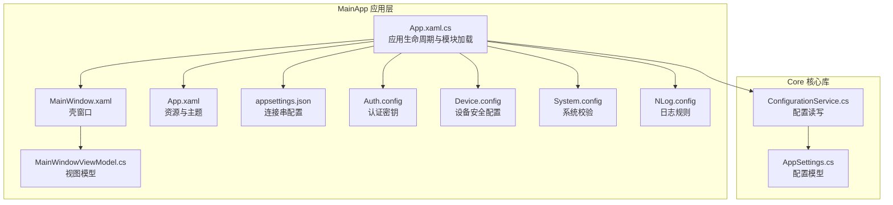
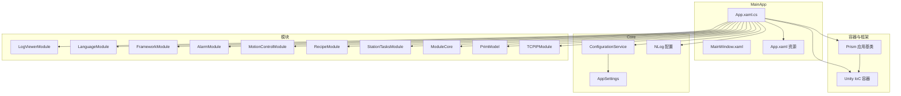
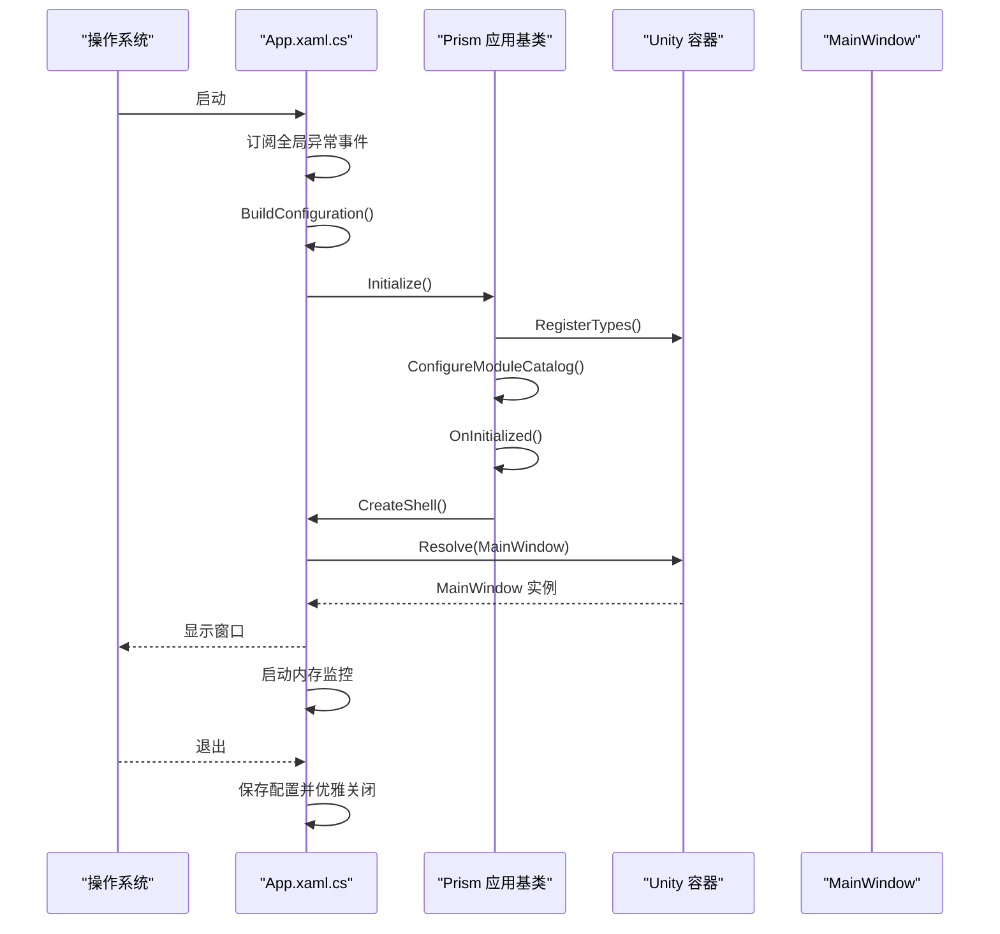
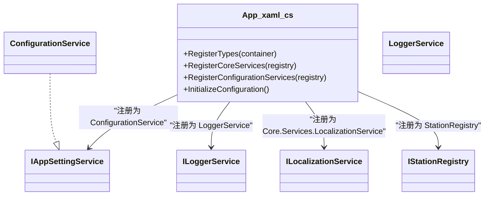
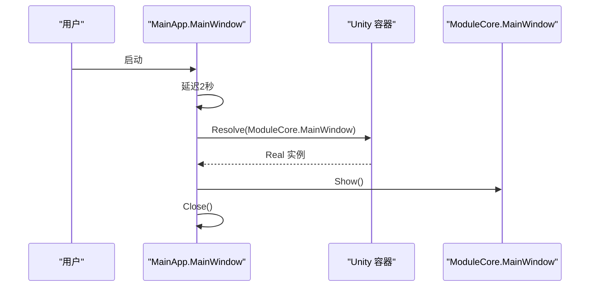
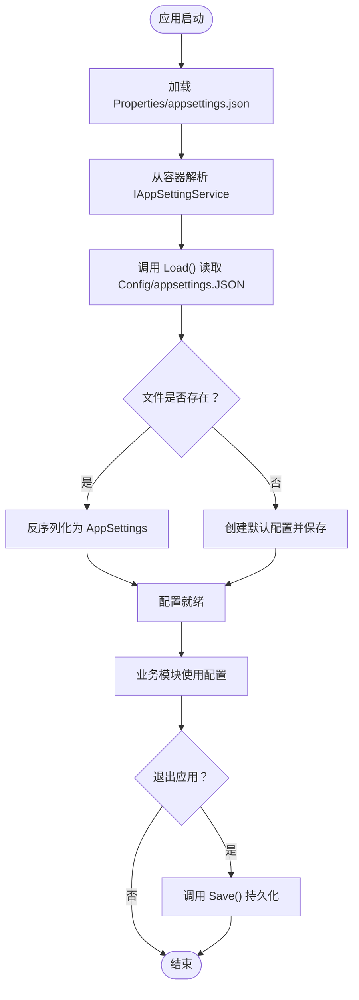
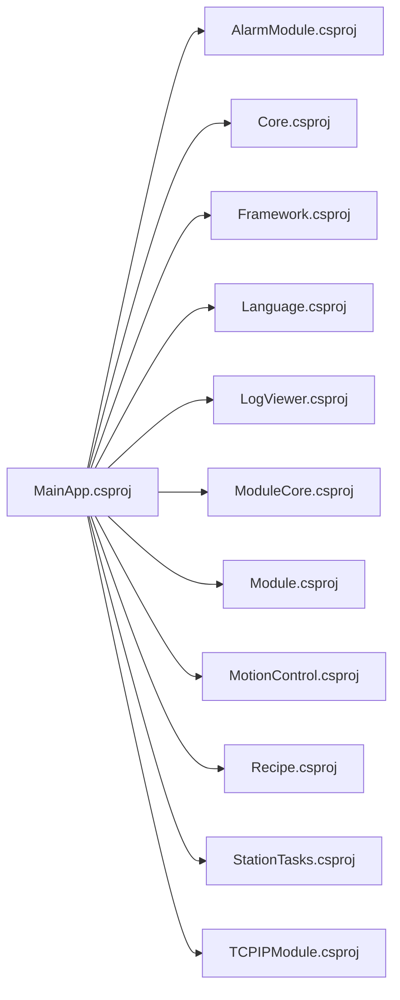

# 主应用程序层（MainApp）

<cite>
**本文档引用的文件**
- [App.xaml.cs](file://MainApp/App.xaml.cs)
- [App.xaml](file://MainApp/App.xaml)
- [MainWindow.xaml](file://MainApp/Views/MainWindow.xaml)
- [MainWindow.xaml.cs](file://MainApp/Views/MainWindow.xaml.cs)
- [MainWindowViewModel.cs](file://MainApp/ViewModels/MainWindowViewModel.cs)
- [MainApp.csproj](file://MainApp/MainApp.csproj)
- [appsettings.json](file://MainApp/Properties/appsettings.json)
- [Auth.config](file://MainApp/Auth.config)
- [Device.config](file://MainApp/Device.config)
- [NLog.config](file://MainApp/NLog.config)
- [System.config](file://MainApp/System.config)
- [AppSettings.cs](file://Core/Configuration/AppSettings.cs)
- [ConfigurationService.cs](file://Core/Services/ConfigurationService.cs)
</cite>

## 目录
1. [简介](#简介)
2. [项目结构](#项目结构)
3. [核心组件](#核心组件)
4. [架构总览](#架构总览)
5. [详细组件分析](#详细组件分析)
6. [依赖关系分析](#依赖关系分析)
7. [性能考虑](#性能考虑)
8. [故障排查指南](#故障排查指南)
9. [结论](#结论)
10. [附录](#附录)

## 简介
本文件面向MainApp主应用程序层，系统性梳理其生命周期管理、模块化初始化、全局配置与依赖注入、UI层MVVM架构以及部署与资源管理等关键主题。重点覆盖以下方面：
- 应用启动流程与Prism模块加载机制
- Unity依赖注入容器的注册与使用
- MainWindow的MVVM实现与视图模型绑定
- 配置体系（appsettings.json、Auth.config、Device.config、System.config）
- 日志与异常处理、国际化资源管理、部署与打包要点

## 项目结构
MainApp作为WPF桌面应用入口，负责：
- 初始化Prism与Unity容器
- 注册核心服务与模块
- 加载全局配置与本地化资源
- 创建并展示主窗口

图表来源
- [App.xaml.cs:54-78](file://MainApp/App.xaml.cs#L54-L78)
- [App.xaml:8-48](file://MainApp/App.xaml#L8-L48)
- [MainWindow.xaml:1-24](file://MainApp/Views/MainWindow.xaml#L1-L24)
- [MainWindowViewModel.cs:1-20](file://MainApp/ViewModels/MainWindowViewModel.cs#L1-L20)
- [ConfigurationService.cs:15-220](file://Core/Services/ConfigurationService.cs#L15-L220)
- [AppSettings.cs:10-39](file://Core/Configuration/AppSettings.cs#L10-L39)

章节来源
- [MainApp.csproj:1-83](file://MainApp/MainApp.csproj#L1-L83)
- [App.xaml.cs:54-78](file://MainApp/App.xaml.cs#L54-L78)
- [App.xaml:8-48](file://MainApp/App.xaml#L8-L48)

## 核心组件
- 应用程序类：负责事件订阅、配置构建、模块注册、异常处理与优雅退出。
- 视图与视图模型：MainWindow作为启动壳窗口，延迟切换至实际业务主窗体；视图模型提供标题等基础绑定。
- 配置服务：统一读取/写入JSON配置，支持扩展字段与异步操作。
- 资源与主题：通过App.xaml合并字典与MaterialDesign主题。

章节来源
- [App.xaml.cs:42-84](file://MainApp/App.xaml.cs#L42-L84)
- [MainWindow.xaml.cs:19-29](file://MainApp/Views/MainWindow.xaml.cs#L19-L29)
- [MainWindowViewModel.cs:5-17](file://MainApp/ViewModels/MainWindowViewModel.cs#L5-L17)
- [ConfigurationService.cs:72-87](file://Core/Services/ConfigurationService.cs#L72-L87)
- [App.xaml:36-44](file://MainApp/App.xaml#L36-L44)

## 架构总览
MainApp采用Prism + Unity组合的模块化WPF架构：
- Prism负责模块发现与生命周期管理
- Unity作为IoC容器进行服务注册与解析
- Core提供通用配置、日志、本地化等基础设施
- 各功能模块以独立项目形式集成

图表来源
- [App.xaml.cs:110-191](file://MainApp/App.xaml.cs#L110-L191)
- [ConfigurationService.cs:15-220](file://Core/Services/ConfigurationService.cs#L15-L220)
- [NLog.config:1-88](file://MainApp/NLog.config#L1-L88)

## 详细组件分析

### 应用生命周期与启动流程
- 事件钩子：在构造函数中注册Dispatcher、AppDomain、TaskScheduler异常事件，确保全局异常被捕获与记录。
- Shell创建：通过容器解析MainWindow作为应用主窗口。
- 初始化阶段：构建配置（Properties/appsettings.json）、注册核心服务、模块化加载。
- 运行期：启动内存监控定时器；退出前持久化配置并延时收尾。

图表来源
- [App.xaml.cs:42-84](file://MainApp/App.xaml.cs#L42-L84)
- [App.xaml.cs:86-94](file://MainApp/App.xaml.cs#L86-L94)
- [App.xaml.cs:110-119](file://MainApp/App.xaml.cs#L110-L119)
- [App.xaml.cs:179-191](file://MainApp/App.xaml.cs#L179-L191)
- [App.xaml.cs:447-455](file://MainApp/App.xaml.cs#L447-L455)

章节来源
- [App.xaml.cs:42-84](file://MainApp/App.xaml.cs#L42-L84)
- [App.xaml.cs:86-94](file://MainApp/App.xaml.cs#L86-L94)
- [App.xaml.cs:110-119](file://MainApp/App.xaml.cs#L110-L119)
- [App.xaml.cs:179-191](file://MainApp/App.xaml.cs#L179-L191)
- [App.xaml.cs:447-455](file://MainApp/App.xaml.cs#L447-L455)

### Prism模块加载机制
- 在ConfigureModuleCatalog中集中声明所有模块，包括日志、语言、框架、报警、运动控制、配方、任务、核心模块等。
- 模块按声明顺序被加载与初始化，Prism负责生命周期管理与依赖解析。

章节来源
- [App.xaml.cs:179-191](file://MainApp/App.xaml.cs#L179-L191)

### Unity依赖注入容器配置与使用
- 核心服务注册：日志接口、配置服务、本地化服务、站点注册表等。
- 配置提供器注册：基于XML的配置提供器实例化并注入容器。
- 服务解析：在应用初始化阶段从容器解析所需服务，如IAppSettingService、ILoggerService等。

图表来源
- [App.xaml.cs:110-161](file://MainApp/App.xaml.cs#L110-L161)
- [ConfigurationService.cs:15-220](file://Core/Services/ConfigurationService.cs#L15-L220)

章节来源
- [App.xaml.cs:110-161](file://MainApp/App.xaml.cs#L110-L161)
- [ConfigurationService.cs:15-220](file://Core/Services/ConfigurationService.cs#L15-L220)

### MainWindow的MVVM架构实现
- 视图：MainWindow.xaml启用Prism的ViewModelLocator自动绑定，标题绑定到ViewModel的Title属性。
- 视图模型：MainWindowViewModel继承BindableBase，提供Title属性的INotifyPropertyChanged实现。
- 启动过渡：MainWindow.xaml.cs在构造函数中延迟2秒后，从容器解析ModuleCore的MainWindow并显示，随后关闭当前壳窗口。

图表来源
- [MainWindow.xaml:6-12](file://MainApp/Views/MainWindow.xaml#L6-L12)
- [MainWindowViewModel.cs:5-17](file://MainApp/ViewModels/MainWindowViewModel.cs#L5-L17)
- [MainWindow.xaml.cs:19-29](file://MainApp/Views/MainWindow.xaml.cs#L19-L29)

章节来源
- [MainWindow.xaml:1-24](file://MainApp/Views/MainWindow.xaml#L1-L24)
- [MainWindowViewModel.cs:1-20](file://MainApp/ViewModels/MainWindowViewModel.cs#L1-L20)
- [MainWindow.xaml.cs:1-32](file://MainApp/Views/MainWindow.xaml.cs#L1-L32)

### 全局配置管理
- Properties/appsettings.json：用于读取连接串等基础配置。
- Core.ConfigurationService：负责Config/appsettings.JSON的读写、默认值创建、扩展字段保留、异步保存与重载。
- AppSettings模型：包含配方、语言、主题、日志策略、硬件配置路径及安全开关等键值。

图表来源
- [App.xaml.cs:86-108](file://MainApp/App.xaml.cs#L86-L108)
- [ConfigurationService.cs:72-103](file://Core/Services/ConfigurationService.cs#L72-L103)
- [ConfigurationService.cs:153-181](file://Core/Services/ConfigurationService.cs#L153-L181)
- [AppSettings.cs:10-39](file://Core/Configuration/AppSettings.cs#L10-L39)

章节来源
- [appsettings.json:1-6](file://MainApp/Properties/appsettings.json#L1-L6)
- [ConfigurationService.cs:72-103](file://Core/Services/ConfigurationService.cs#L72-L103)
- [ConfigurationService.cs:153-181](file://Core/Services/ConfigurationService.cs#L153-L181)
- [AppSettings.cs:10-39](file://Core/Configuration/AppSettings.cs#L10-L39)

### 配置文件结构与示例
- appsettings.json（Properties）：用于存放连接串等基础配置，由应用启动时读取。
- Auth.config：认证相关密文配置，用于系统授权校验。
- Device.config：设备安全与蜂鸣器等硬件行为开关。
- System.config：系统级校验或签名配置。
- NLog.config：日志目标与规则，按级别输出到不同文件并支持归档。

章节来源
- [appsettings.json:1-6](file://MainApp/Properties/appsettings.json#L1-L6)
- [Auth.config:1-1](file://MainApp/Auth.config#L1-L1)
- [Device.config:1-1](file://MainApp/Device.config#L1-L1)
- [System.config:1-1](file://MainApp/System.config#L1-L1)
- [NLog.config:1-88](file://MainApp/NLog.config#L1-L88)

### 国际化与资源管理
- App.xaml通过ResourceDictionary.MergedDictionaries合并默认语言字典与MaterialDesign主题资源。
- 语言选择与本地化服务由LanguageModule与Core.LocalizationService协作实现。
- 字符串资源位于Languages目录下，按语言命名（如zh-CN、en-US）。

章节来源
- [App.xaml:36-44](file://MainApp/App.xaml#L36-L44)
- [App.xaml.cs:128-128](file://MainApp/App.xaml.cs#L128-L128)

### 部署与打包要点
- 目标框架：net9.0-windows7.0，启用WPF。
- 包引用：Prism.Unity、MaterialDesignThemes、Microsoft.Extensions.Configuration等。
- 项目引用：与各功能模块（Alarm、Framework、Language、LogViewer、ModuleCore、Module、MotionControl、Recipe、StationTasks、TCPIP）保持解耦的多项目结构。
- 资源文件：图标、图片、NLog配置等通过MSBuild嵌入或复制到输出目录。
- 版本信息：构建后自动生成VersionInfo.txt，便于发布追踪。

章节来源
- [MainApp.csproj:1-83](file://MainApp/MainApp.csproj#L1-L83)

## 依赖关系分析
- 模块依赖：MainApp对多个模块项目进行编译期引用，运行期通过Prism动态加载。
- 容器依赖：App.RegisterTypes集中注册服务，模块可按需解析。
- 配置依赖：Core.ConfigurationService依赖System.Text.Json进行序列化，依赖文件系统进行持久化。

图表来源
- [MainApp.csproj:28-39](file://MainApp/MainApp.csproj#L28-L39)

章节来源
- [MainApp.csproj:28-39](file://MainApp/MainApp.csproj#L28-L39)

## 性能考虑
- 内存监控：启动后每分钟记录一次工作集，便于定位内存泄漏或增长异常。
- 异步保存：配置服务提供异步SaveAsync与ReloadAsync，避免阻塞UI线程。
- 日志归档：NLog按大小归档，限制保留数量，降低磁盘占用。

章节来源
- [App.xaml.cs:333-341](file://MainApp/App.xaml.cs#L333-L341)
- [ConfigurationService.cs:84-93](file://Core/Services/ConfigurationService.cs#L84-L93)
- [NLog.config:10-18](file://MainApp/NLog.config#L10-L18)

## 故障排查指南
- 全局异常处理：捕获UI线程、后台线程与未观察任务异常，生成崩溃转储与错误报告，并弹出友好提示后优雅退出。
- 配置加载失败：当配置文件损坏或缺失时，自动创建默认配置并继续运行。
- 退出流程：退出前保存配置并等待短暂延时，确保资源释放与日志落盘。

章节来源
- [App.xaml.cs:234-298](file://MainApp/App.xaml.cs#L234-L298)
- [App.xaml.cs:343-415](file://MainApp/App.xaml.cs#L343-L415)
- [App.xaml.cs:417-445](file://MainApp/App.xaml.cs#L417-L445)
- [ConfigurationService.cs:153-181](file://Core/Services/ConfigurationService.cs#L153-L181)

## 结论
MainApp通过Prism与Unity实现了清晰的应用生命周期与模块化架构，配合Core提供的配置与日志能力，形成了稳定、可扩展的桌面应用基础。MainWindow采用轻量壳窗口模式，平滑过渡到业务主窗体；配置与资源管理遵循约定优于配置原则，便于维护与部署。

## 附录
- 关键实现位置参考
  - 应用启动与模块注册：[App.xaml.cs:59-72](file://MainApp/App.xaml.cs#L59-L72), [App.xaml.cs:110-119](file://MainApp/App.xaml.cs#L110-L119), [App.xaml.cs:179-191](file://MainApp/App.xaml.cs#L179-L191)
  - 配置加载与持久化：[App.xaml.cs:86-108](file://MainApp/App.xaml.cs#L86-L108), [ConfigurationService.cs:72-87](file://Core/Services/ConfigurationService.cs#L72-L87), [ConfigurationService.cs:183-203](file://Core/Services/ConfigurationService.cs#L183-L203)
  - 视图与视图模型绑定：[MainWindow.xaml:6-12](file://MainApp/Views/MainWindow.xaml#L6-L12), [MainWindowViewModel.cs:5-17](file://MainApp/ViewModels/MainWindowViewModel.cs#L5-L17)
  - 资源与主题：[App.xaml:36-44](file://MainApp/App.xaml#L36-L44)
  - 日志配置：[NLog.config:1-88](file://MainApp/NLog.config#L1-L88)