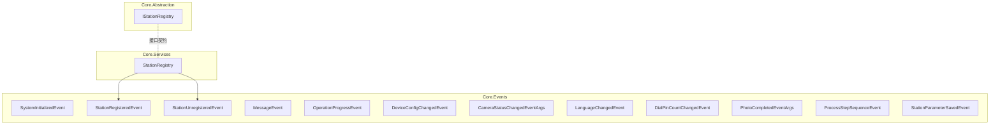
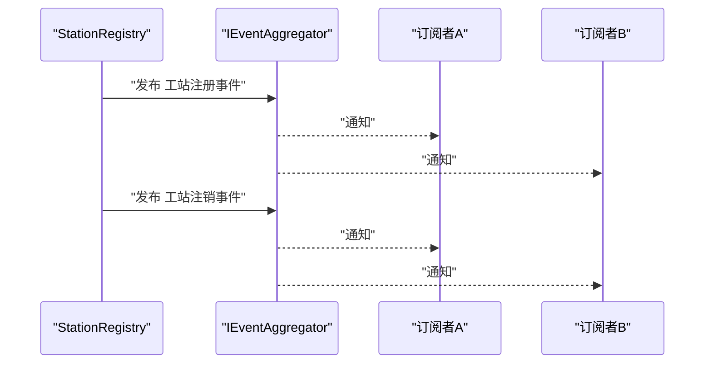
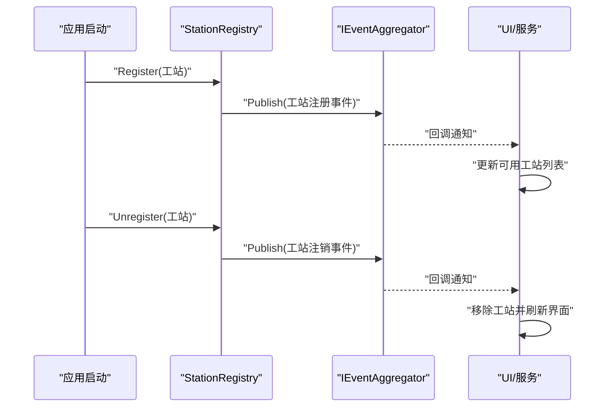
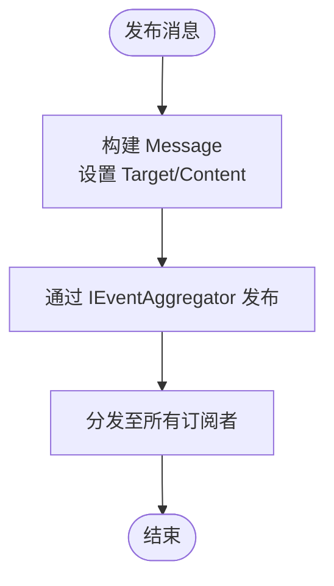
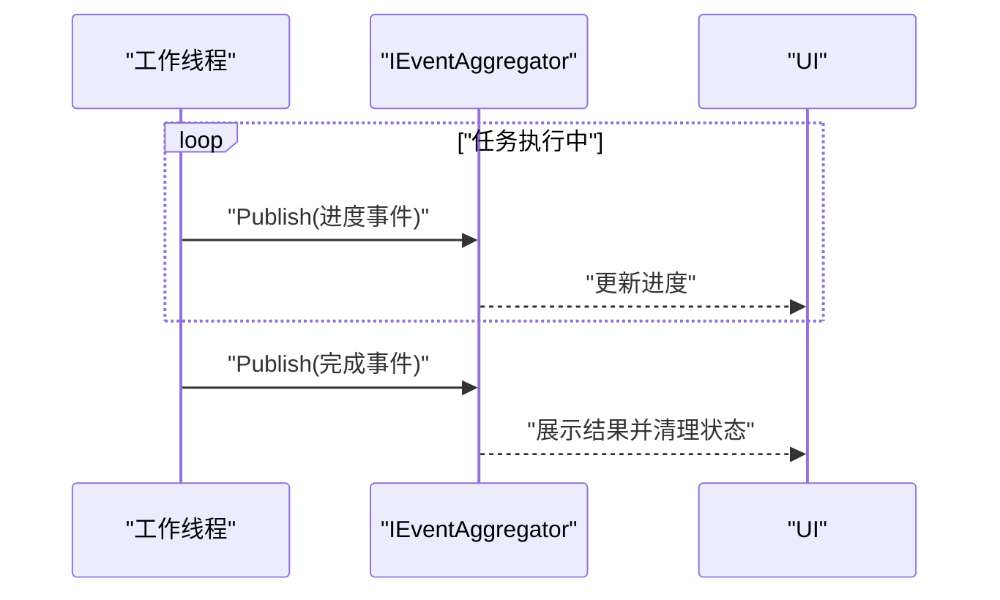
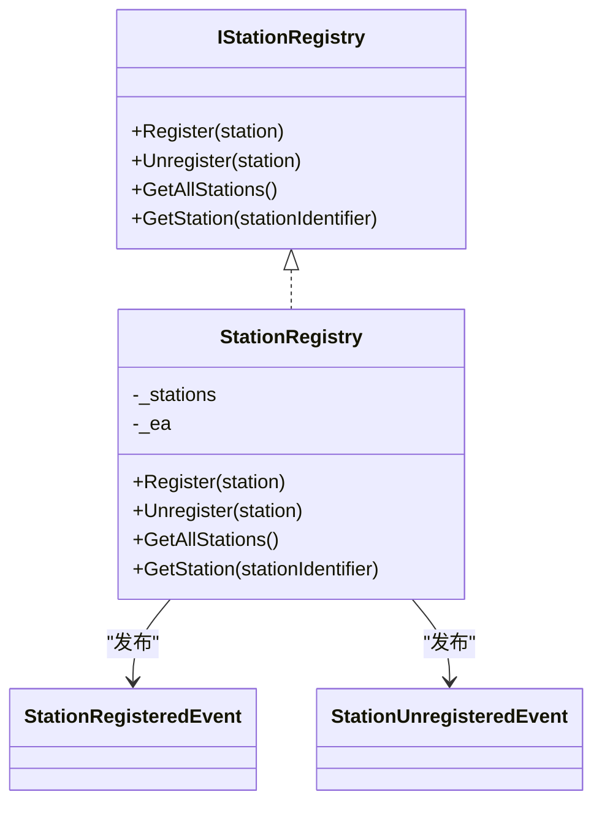

# 事件系统

<cite>
**本文引用的文件**
- [SystemInitializedEvent.cs](file://Core/Events/SystemInitializedEvent.cs)
- [StationRegisteredEvent.cs](file://Core/Events/StationRegisteredEvent.cs)
- [StationUnregisteredEvent.cs](file://Core/Events/StationUnregisteredEvent.cs)
- [MessageEvent.cs](file://Core/Events/MessageEvent.cs)
- [OperationProgressEvent.cs](file://Core/Events/OperationProgressEvent.cs)
- [DeviceConfigChangedEvent.cs](file://Core/Events/DeviceConfigChangedEvent.cs)
- [CameraStatusChangedEventArgs.cs](file://Core/Events/CameraStatusChangedEventArgs.cs)
- [LanguageChangedEvent.cs](file://Core/Events/LanguageChangedEvent.cs)
- [DialPinCountChangedEvent.cs](file://Core/Events/DialPinCountChangedEvent.cs)
- [PhotoCompletedEventArgs.cs](file://Core/Events/PhotoCompletedEventArgs.cs)
- [ProcessStepSequenceEvent.cs](file://Core/Events/ProcessStepSequenceEvent.cs)
- [StationParameterSavedEvent.cs](file://Core/Events/StationParameterSavedEvent.cs)
- [IStationRegistry.cs](file://Core/Abstraction/IStationRegistry.cs)
- [StationRegistry.cs](file://Core/Services/StationRegistry.cs)
</cite>

## 目录
1. [简介](#简介)
2. [项目结构](#项目结构)
3. [核心组件](#核心组件)
4. [架构总览](#架构总览)
5. [详细组件分析](#详细组件分析)
6. [依赖关系分析](#依赖关系分析)
7. [性能考量](#性能考量)
8. [故障排查指南](#故障排查指南)
9. [结论](#结论)
10. [附录](#附录)

## 简介
本文件系统性梳理 Core 模块中的事件体系，覆盖系统事件、工站事件、消息事件、进度事件、设备事件与相机状态事件等。重点阐述事件的数据结构、触发时机、订阅机制与响应流程；说明事件在模块间解耦通信中的作用、事件聚合器的使用方法、事件处理最佳实践，并给出订阅与发布的参考路径与异步处理策略。

## 项目结构
事件相关代码集中于 Core/Events 目录，围绕 Prism.Events.PubSubEvent 实现轻量级发布/订阅模型；部分事件采用标准 EventArgs 参数化，便于与非 Prism 场景兼容。工站注册与注销事件由注册中心在状态变更时发布，体现“事件驱动”的模块协作模式。

图表来源
- [StationRegistry.cs:24-38](file://Core/Services/StationRegistry.cs#L24-L38)
- [StationRegisteredEvent.cs:9](file://Core/Events/StationRegisteredEvent.cs#L9)
- [StationUnregisteredEvent.cs:9](file://Core/Events/StationUnregisteredEvent.cs#L9)

章节来源
- [StationRegistry.cs:14-47](file://Core/Services/StationRegistry.cs#L14-L47)
- [IStationRegistry.cs:7-21](file://Core/Abstraction/IStationRegistry.cs#L7-L21)

## 核心组件
- 事件基座：基于 Prism.Events.PubSubEvent 的轻量事件模型，支持强类型载荷与无参事件。
- 工站事件族：工站注册/注销事件，载荷为 IStationParameterProvider，用于通知订阅方工站可用性变化。
- 消息事件：MessageEvent 携带目标与内容，适配通用消息分发场景。
- 进度事件：OperationProgressEvent 与 OperationCompletedEvent 分别承载进行中与完成态的进度信息。
- 设备事件：DeviceConfigChangedEvent 载荷为 AppSettings，用于设备配置变更广播。
- 相机事件：CameraStatusChangedEventArgs 与 PhotoCompletedEventArgs 提供相机连接状态与拍照结果的事件化表示。
- 语言事件：LanguageChangedEvent 提供简要与详细两种形态，详细版包含文化代码、是否用户触发与时间戳。
- 序列事件：ProcessStepSequenceEvent 与 ProcessStepSequenceControlEvent 支持步骤序列的启动与控制（暂停/恢复/停止）。
- 其他：DialPinCountChangedEvent、StationParameterSavedEvent 等，满足特定业务场景。

章节来源
- [SystemInitializedEvent.cs:5](file://Core/Events/SystemInitializedEvent.cs#L5)
- [StationRegisteredEvent.cs:9](file://Core/Events/StationRegisteredEvent.cs#L9)
- [StationUnregisteredEvent.cs:9](file://Core/Events/StationUnregisteredEvent.cs#L9)
- [MessageEvent.cs:5](file://Core/Events/MessageEvent.cs#L5)
- [OperationProgressEvent.cs:5](file://Core/Events/OperationProgressEvent.cs#L5)
- [DeviceConfigChangedEvent.cs:9](file://Core/Events/DeviceConfigChangedEvent.cs#L9)
- [CameraStatusChangedEventArgs.cs:6](file://Core/Events/CameraStatusChangedEventArgs.cs#L6)
- [LanguageChangedEvent.cs:8](file://Core/Events/LanguageChangedEvent.cs#L8)
- [DialPinCountChangedEvent.cs:5](file://Core/Events/DialPinCountChangedEvent.cs#L5)
- [PhotoCompletedEventArgs.cs:5](file://Core/Events/PhotoCompletedEventArgs.cs#L5)
- [ProcessStepSequenceEvent.cs:8](file://Core/Events/ProcessStepSequenceEvent.cs#L8)
- [StationParameterSavedEvent.cs:8](file://Core/Events/StationParameterSavedEvent.cs#L8)

## 架构总览
事件系统以 IEventAggregator 为核心枢纽，各模块通过事件聚合器进行松耦合通信。工站注册中心在注册/注销时发布相应事件，订阅方可即时获知工站可用性变化；其他事件如进度、消息、设备配置变更等亦遵循相同模式。

图表来源
- [StationRegistry.cs:24-38](file://Core/Services/StationRegistry.cs#L24-L38)
- [StationRegisteredEvent.cs:9](file://Core/Events/StationRegisteredEvent.cs#L9)
- [StationUnregisteredEvent.cs:9](file://Core/Events/StationUnregisteredEvent.cs#L9)

## 详细组件分析

### 工站事件：注册与注销
- 触发时机
  - 注册：工站实例创建并完成初始化后调用注册中心的 Register 方法。
  - 注销：工站生命周期结束或被移除时调用 Unregister。
- 数据结构
  - 载荷：IStationParameterProvider，包含工站标识符与参数提供能力。
- 订阅与响应
  - 订阅：通过 IEventAggregator 获取事件并 Subscribe。
  - 响应：在回调中读取载荷并更新本地缓存或 UI 状态。
- 最佳实践
  - 在订阅时保留取消令牌以便生命周期管理。
  - 对空载荷与异常进行防御式编程。

图表来源
- [StationRegistry.cs:24-38](file://Core/Services/StationRegistry.cs#L24-L38)
- [StationRegisteredEvent.cs:9](file://Core/Events/StationRegisteredEvent.cs#L9)
- [StationUnregisteredEvent.cs:9](file://Core/Events/StationUnregisteredEvent.cs#L9)

章节来源
- [StationRegistry.cs:24-38](file://Core/Services/StationRegistry.cs#L24-L38)
- [IStationRegistry.cs:9-20](file://Core/Abstraction/IStationRegistry.cs#L9-L20)

### 消息事件：MessageEvent
- 数据结构
  - Message 结构体包含 Target 与 Content，用于标识消息目标与内容。
- 使用场景
  - 跨模块的消息广播，例如日志、通知、提示等。
- 订阅与发布
  - 发布：构造 Message 并通过 IEventAggregator 发布。
  - 订阅：在接收端 Subscribe 并处理消息路由。

图表来源
- [MessageEvent.cs:5](file://Core/Events/MessageEvent.cs#L5)
- [MessageEvent.cs:9-20](file://Core/Events/MessageEvent.cs#L9-L20)

章节来源
- [MessageEvent.cs:5](file://Core/Events/MessageEvent.cs#L5)
- [MessageEvent.cs:9-20](file://Core/Events/MessageEvent.cs#L9-L20)

### 进度事件：OperationProgressEvent 与 OperationCompletedEvent
- 数据结构
  - 进行中：包含进度百分比、状态文本、操作ID、是否完成、是否成功。
  - 完成：包含操作ID与是否成功。
- 使用场景
  - 长耗时任务的实时进度反馈与最终结果通知。
- 异步处理建议
  - UI 层订阅后及时更新进度条与状态文本。
  - 成功/失败分支分别处理后续逻辑。

图表来源
- [OperationProgressEvent.cs:5](file://Core/Events/OperationProgressEvent.cs#L5)
- [OperationProgressEvent.cs:7-21](file://Core/Events/OperationProgressEvent.cs#L7-L21)

章节来源
- [OperationProgressEvent.cs:5](file://Core/Events/OperationProgressEvent.cs#L5)
- [OperationProgressEvent.cs:7-21](file://Core/Events/OperationProgressEvent.cs#L7-L21)

### 设备事件：DeviceConfigChangedEvent
- 数据结构
  - 载荷：AppSettings，设备配置的全局设置对象。
- 使用场景
  - 当设备配置发生变更时，通知各模块重新加载或刷新配置。
- 订阅与响应
  - 订阅后在回调中读取新配置并应用到对应服务。

章节来源
- [DeviceConfigChangedEvent.cs:9](file://Core/Events/DeviceConfigChangedEvent.cs#L9)

### 相机事件：CameraStatusChangedEventArgs 与 PhotoCompletedEventArgs
- 数据结构
  - 相机状态：包含相机名称、是否连接、状态描述。
  - 拍照完成：包含相机名称、是否成功、数据与错误信息。
- 使用场景
  - 相机连接状态监控与拍照结果回传。
- 订阅与响应
  - 订阅状态变更事件以更新 UI 状态指示。
  - 订阅拍照完成事件以处理图像数据或错误。

章节来源
- [CameraStatusChangedEventArgs.cs:6](file://Core/Events/CameraStatusChangedEventArgs.cs#L6)
- [PhotoCompletedEventArgs.cs:5](file://Core/Events/PhotoCompletedEventArgs.cs#L5)

### 语言事件：LanguageChangedEvent 与 DetailedLanguageChangedEvent
- 数据结构
  - 简要：字符串载荷为新文化代码。
  - 详细：包含旧文化代码、新文化代码、是否用户触发、时间戳。
- 使用场景
  - 多语言切换通知，支持 UI 与资源的动态刷新。
- 订阅与响应
  - 订阅简要事件进行基础刷新。
  - 订阅详细事件以记录变更历史与来源。

章节来源
- [LanguageChangedEvent.cs:8](file://Core/Events/LanguageChangedEvent.cs#L8)
- [LanguageChangedEvent.cs:13-63](file://Core/Events/LanguageChangedEvent.cs#L13-L63)

### 序列事件：ProcessStepSequenceEvent 与 ProcessStepSequenceControlEvent
- 数据结构
  - 启动事件：载荷包含目标工站标识与步骤集合（运行时类型为 ObservableCollection<ProcessStep>）。
  - 控制事件：载荷包含控制动作（暂停/恢复/停止）与目标工站标识。
- 使用场景
  - 工艺步骤序列的启动与运行期控制。
- 订阅与响应
  - 订阅启动事件后按步骤执行并上报进度。
  - 订阅控制事件后根据动作调整执行流。

章节来源
- [ProcessStepSequenceEvent.cs:8](file://Core/Events/ProcessStepSequenceEvent.cs#L8)
- [ProcessStepSequenceEvent.cs:14-51](file://Core/Events/ProcessStepSequenceEvent.cs#L14-L51)

### 其他事件
- DialPinCountChangedEvent：拨盘针数变更，载荷包含任务号与新针数。
- StationParameterSavedEvent：工站参数保存成功，载荷为工站标识符。

章节来源
- [DialPinCountChangedEvent.cs:5](file://Core/Events/DialPinCountChangedEvent.cs#L5)
- [DialPinCountChangedEvent.cs:9-13](file://Core/Events/DialPinCountChangedEvent.cs#L9-L13)
- [StationParameterSavedEvent.cs:8](file://Core/Events/StationParameterSavedEvent.cs#L8)

## 依赖关系分析
- 工站事件依赖 IStationRegistry 与 IEventAggregator，注册中心在注册/注销时负责发布事件。
- 其他事件多为纯数据结构或简单载荷，直接通过 IEventAggregator 发布/订阅。
- 事件之间无直接耦合，仅通过 IEventAggregator 间接关联。

图表来源
- [IStationRegistry.cs:7-21](file://Core/Abstraction/IStationRegistry.cs#L7-L21)
- [StationRegistry.cs:14-47](file://Core/Services/StationRegistry.cs#L14-L47)
- [StationRegisteredEvent.cs:9](file://Core/Events/StationRegisteredEvent.cs#L9)
- [StationUnregisteredEvent.cs:9](file://Core/Events/StationUnregisteredEvent.cs#L9)

章节来源
- [IStationRegistry.cs:7-21](file://Core/Abstraction/IStationRegistry.cs#L7-L21)
- [StationRegistry.cs:14-47](file://Core/Services/StationRegistry.cs#L14-L47)

## 性能考量
- 事件风暴防护：对高频事件（如进度事件）应限制发布频率，合并更新或节流。
- 订阅生命周期：确保在对象销毁时取消订阅，避免内存泄漏与无效回调。
- 载荷大小：尽量保持事件载荷精简，必要时传递引用或标识符，延迟加载完整数据。
- 线程安全：在多线程环境下发布事件时注意同步与异常捕获，避免 UI 线程阻塞。

## 故障排查指南
- 事件未触发
  - 检查是否正确获取 IEventAggregator 实例并发布事件。
  - 确认订阅者是否在正确时机 Subscribe。
- 订阅无效
  - 核对事件类型与载荷类型一致。
  - 确保订阅者持有有效的取消令牌并在合适时机取消订阅。
- 数据不一致
  - 对于长耗时事件，确保完成事件与进行中事件的关联（如操作ID）。
  - 对于配置变更事件，订阅者应在回调中应用变更并刷新缓存。
- 相机事件异常
  - 检查相机状态参数是否正确设置。
  - 对拍照完成事件中的错误信息进行分类处理。

章节来源
- [OperationProgressEvent.cs:5](file://Core/Events/OperationProgressEvent.cs#L5)
- [DeviceConfigChangedEvent.cs:9](file://Core/Events/DeviceConfigChangedEvent.cs#L9)
- [CameraStatusChangedEventArgs.cs:6](file://Core/Events/CameraStatusChangedEventArgs.cs#L6)
- [PhotoCompletedEventArgs.cs:5](file://Core/Events/PhotoCompletedEventArgs.cs#L5)

## 结论
Core 模块的事件系统以 Prism.Events 为基础，结合少量标准 EventArgs，实现了对系统、工站、消息、进度、设备与相机等多类场景的统一建模。通过 IEventAggregator 实现模块间的松耦合通信，配合注册中心的工站事件，形成清晰的发布/订阅闭环。遵循本文的最佳实践与排障建议，可有效提升系统的可维护性与稳定性。

## 附录
- 事件聚合器使用要点
  - 获取事件：通过 IEventAggregator.GetEvent<T>() 获取事件实例。
  - 发布事件：调用 Publish(载荷) 或 Publish()。
  - 订阅事件：调用 Subscribe(回调)，返回取消令牌。
  - 取消订阅：调用取消令牌的 Dispose 或取消方法。
- 异步事件处理策略
  - 对于耗时回调，建议在后台线程执行并适时切换到 UI 线程更新界面。
  - 对高频事件采用去抖/节流策略，降低 UI 刷新压力。
- 代码示例参考路径
  - 工站注册事件发布：[StationRegistry.cs:28](file://Core/Services/StationRegistry.cs#L28)
  - 工站注销事件发布：[StationRegistry.cs:36](file://Core/Services/StationRegistry.cs#L36)
  - 消息事件发布/订阅：[MessageEvent.cs:5](file://Core/Events/MessageEvent.cs#L5)
  - 进度事件发布/订阅：[OperationProgressEvent.cs:5](file://Core/Events/OperationProgressEvent.cs#L5)
  - 设备配置变更事件发布/订阅：[DeviceConfigChangedEvent.cs:9](file://Core/Events/DeviceConfigChangedEvent.cs#L9)
  - 相机状态事件参数：[CameraStatusChangedEventArgs.cs:6](file://Core/Events/CameraStatusChangedEventArgs.cs#L6)
  - 语言事件发布/订阅：[LanguageChangedEvent.cs:8](file://Core/Events/LanguageChangedEvent.cs#L8)
  - 序列事件发布/订阅：[ProcessStepSequenceEvent.cs:8](file://Core/Events/ProcessStepSequenceEvent.cs#L8)
  - 工站参数保存事件发布/订阅：[StationParameterSavedEvent.cs:8](file://Core/Events/StationParameterSavedEvent.cs#L8)